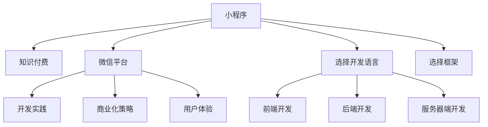

                 

# 程序员如何利用小程序进行知识付费

> 关键词：小程序，知识付费，微信平台，开发实践，商业化，用户体验

## 1. 背景介绍

### 1.1 问题由来
在移动互联网时代，知识的获取变得前所未有的便捷。程序员作为技术领域的重要群体，对知识的需求更加迫切。传统线上教育平台提供了大量的课程资源，但内容质量参差不齐，且学习体验有待提升。微信小程序作为一种新兴的平台形式，以其快速、便捷、低成本等特点，正在成为知识付费的新趋势。

### 1.2 问题核心关键点
本节将从以下几个关键点出发，阐述程序员如何利用小程序进行知识付费：

- **平台选择**：小程序的开发与部署环境
- **开发流程**：小程序开发的关键步骤
- **商业化策略**：如何通过小程序实现知识付费
- **用户体验优化**：提高用户黏性和满意度

### 1.3 问题研究意义
小程序作为一种轻量级应用，具有极高的开发和部署灵活性。通过微信平台，小程序可以轻松触达大量用户，且具备低门槛、高转化率等优势，成为知识付费的理想平台。本文旨在为程序员提供一套可行的解决方案，帮助其通过小程序实现知识变现，为更多技术爱好者提供有价值的知识服务。

## 2. 核心概念与联系

### 2.1 核心概念概述

为更好地理解利用小程序进行知识付费的方法，本节将介绍几个核心概念：

- **小程序**：由微信平台提供的移动应用开发框架，开发者可以利用该框架开发轻量级应用，并通过微信平台进行分发。小程序以其快速开发、低成本、高转化等特点，受到广泛欢迎。

- **知识付费**：通过付费的方式获取高质量内容的学习方式，包括在线课程、电子书、技术文章等。知识付费为技术爱好者提供了更加专业、系统、高效的学习途径。

- **微信平台**：微信作为中国最大的社交平台之一，拥有庞大的用户基础和强大的支付能力。通过微信小程序，知识创作者可以轻松触达目标用户，实现知识付费。

- **开发实践**：小程序的开发流程和最佳实践，包括前端、后端、服务器端等各环节的技术要点。

- **商业化策略**：如何通过小程序平台实现知识付费的商业模式，包括内容定价、会员制度、广告分成等。

- **用户体验**：通过小程序提供优质学习体验，提高用户满意度和黏性，从而实现知识付费的良性循环。

这些核心概念之间的逻辑关系可以通过以下Mermaid流程图来展示：



这个流程图展示了这个系统的核心概念及其之间的关系：

1. 小程序通过微信平台提供给用户，作为知识付费的载体。
2. 知识付费依赖于小程序的开发实践，包括前端、后端、服务器端等技术环节。
3. 商业化策略决定了知识付费的商业模式，如内容定价、会员制度等。
4. 用户体验的好坏直接影响知识付费的转化率。
5. 开发语言和框架的选择也是开发实践中需要考虑的关键因素。

## 3. 核心算法原理 & 具体操作步骤
### 3.1 算法原理概述

利用小程序进行知识付费，本质上是通过微信平台提供的应用平台，结合开发实践和商业化策略，为用户提供高质量的学习内容。其核心思想是：将知识内容封装为小程序应用，通过微信平台的支付功能，实现用户付费。

形式化地，假设知识内容为 $C$，用户为 $U$，微信平台为 $W$，小程序为 $P$，则知识付费的过程可以表示为：

$$
C \rightarrow P \rightarrow W \rightarrow U
$$

其中 $P$ 为小程序应用， $W$ 为微信平台， $U$ 为付费用户。

具体而言，知识创作者将课程内容、技术文章等知识资源封装到小程序中，并通过微信平台进行分发。用户通过微信小程序支付费用后，可以获取相应的学习资源。

### 3.2 算法步骤详解

利用小程序进行知识付费的开发流程，主要包括以下几个关键步骤：

**Step 1: 选择开发语言和框架**

- 选择合适的编程语言，如TypeScript、JavaScript等，结合微信小程序的开发文档，进行开发实践。

**Step 2: 创建小程序项目**

- 使用微信开发者工具创建小程序项目，配置开发环境，包括IDE、开发调试工具等。

**Step 3: 设计小程序功能**

- 根据知识付费的需求，设计小程序的核心功能模块，如课程目录、视频播放、用户登录、支付等。

**Step 4: 开发前端界面**

- 使用微信小程序的前端框架，如Miniprogram，开发小程序的用户界面，实现课程展示、视频播放、用户互动等功能。

**Step 5: 开发后端服务**

- 使用后端开发语言和技术栈，如Node.js、Python等，开发小程序的后端服务，实现课程上传、用户认证、支付等业务逻辑。

**Step 6: 开发服务器端**

- 使用服务器端开发语言和技术栈，如Java、C++等，开发小程序的服务器端，实现课程存储、用户管理、支付处理等功能。

**Step 7: 集成微信平台**

- 将小程序应用集成到微信平台，进行发布和测试，确保小程序能够正常运行和支付。

**Step 8: 部署和上线**

- 将小程序应用部署到服务器，并进行上线，供用户使用。

**Step 9: 持续优化**

- 根据用户反馈和业务需求，持续优化小程序的功能和性能，提升用户体验和满意度。

### 3.3 算法优缺点

利用小程序进行知识付费的方法具有以下优点：

1. 开发成本低：小程序开发门槛低，开发周期短，可以快速上线，获取用户反馈。
2. 部署便捷：小程序不需要下载安装，直接通过微信平台进行分发，用户无需离开微信即可访问。
3. 支付便捷：微信平台提供支付功能，用户可以直接在微信内完成支付，无需离开微信环境。
4. 用户黏度高：小程序的即时反馈和互动功能，能够提高用户黏性，增加知识付费的转化率。
5. 商业化灵活：知识创作者可以根据自身情况，灵活设置课程价格、会员制度、广告分成等商业策略。

同时，该方法也存在以下缺点：

1. 流量依赖：小程序的推广依赖于微信平台的流量，如果推广不力，可能会影响用户获取。
2. 技术壁垒低：小程序的开发门槛较低，可能导致市场竞争激烈，知识付费的差异化降低。
3. 用户粘性不足：用户容易疲劳，需要持续更新内容，提升互动性，才能保持用户活跃度。

尽管存在这些缺点，但小程序作为一种新兴的平台形式，为知识付费提供了新的可能性。只要开发者能够充分利用其优点，克服其缺点，就有可能在知识付费领域取得成功。

### 3.4 算法应用领域

利用小程序进行知识付费，已经在在线教育、技术博客、编程视频等多个领域得到了广泛应用，具体包括：

- **在线教育**：通过小程序提供课程学习，用户可以直接在微信内完成学习、交流和支付，实现线上学习的便捷化。
- **技术博客**：将技术文章、代码示例等内容封装为小程序应用，用户可以随时随地阅读和学习。
- **编程视频**：提供高质量的编程视频教程，通过微信平台进行分发和支付，用户可以免费试用部分课程，付费获取完整视频。
- **技术工具**：提供各类技术工具和插件，如代码编辑器、调试器等，用户可以方便地进行编程和调试。

除了这些领域外，小程序还可以广泛应用于各类技术内容的知识付费，如算法、数据结构、人工智能等，为技术爱好者提供全面的学习资源。

## 4. 数学模型和公式 & 详细讲解 & 举例说明

### 4.1 数学模型构建

本节将使用数学语言对小程序知识付费的流程进行更加严格的刻画。

假设知识内容为 $C$，用户为 $U$，微信平台为 $W$，小程序为 $P$，则知识付费的过程可以建模如下：

1. 知识创作者将课程内容 $C$ 封装到小程序应用 $P$ 中，发布到微信平台 $W$。
2. 用户 $U$ 通过微信平台支付费用后，获取相应的课程资源。

其中，知识内容 $C$ 包括课程视频、文本、代码等，可以表示为 $\{c_i\}_{i=1}^N$，其中 $c_i$ 为第 $i$ 个课程内容。用户 $U$ 的支付行为可以表示为 $p$，支付金额为 $a$。

### 4.2 公式推导过程

以下我们以在线教育课程为例，推导知识付费过程的数学模型。

假设课程内容 $C$ 为 $n$ 个视频教程，用户 $U$ 为 $m$ 个订阅用户。每个视频教程的长度为 $t_i$ 分钟，价格为 $p_i$ 元，用户订阅课程的价格为 $p$ 元。则课程总时长为 $T=\sum_{i=1}^n t_i$，课程总价格为 $P=\sum_{i=1}^n p_i$。

用户订阅课程的行为可以表示为：

$$
p = \sum_{i=1}^n p_i \times \text{avg\_price\_discount} + \text{subscription\_discount}
$$

其中 $\text{avg\_price\_discount}$ 为课程平均折扣率，$\text{subscription\_discount}$ 为订阅折扣率。

知识付费的效果可以通过订阅用户数量 $U_{\text{subscribed}}$ 来衡量。课程订阅行为可以建模为：

$$
U_{\text{subscribed}} = U \times (1 - \text{free\_trial\_rate})
$$

其中 $\text{free\_trial\_rate}$ 为免费试用率。

知识付费的经济效益可以表示为：

$$
\text{total\_earnings} = p \times U_{\text{subscribed}}
$$

其中 $\text{total\_earnings}$ 为总收益。

### 4.3 案例分析与讲解

假设某在线教育平台推出了一个编程课程，包含10个视频教程，每个教程5分钟，价格分别为10元、20元、30元不等。用户可以免费试用2节课，之后每节课定价为5元，一个月的订阅价格为50元。

首先，计算课程的总时长和总价格：

$$
T = 10 \times 5 = 50 \text{分钟}
$$
$$
P = 10 \times 20 + 2 \times 5 = 220 \text{元}
$$

假设课程平均折扣率为0.8，订阅折扣率为0.9，免费试用率为0.2。则用户订阅课程的行为可以表示为：

$$
p = 220 \times 0.8 + 50 \times 0.9 = 236 \text{元}
$$

用户订阅课程的数量可以表示为：

$$
U_{\text{subscribed}} = 1000 \times (1 - 0.2) = 800
$$

因此，总收益为：

$$
\text{total\_earnings} = 236 \times 800 = 188,800 \text{元}
$$

通过这个案例可以看出，课程价格、折扣率和免费试用期等因素对知识付费的效果有重要影响。开发者需要根据具体情况，设计合理的付费策略，以最大化收益。

## 5. 项目实践：代码实例和详细解释说明

### 5.1 开发环境搭建

在进行小程序知识付费的开发实践前，我们需要准备好开发环境。以下是使用Node.js进行微信小程序开发的环境配置流程：

1. 安装Node.js：从官网下载安装Node.js，用于运行npm包管理器。
2. 安装微信开发者工具：从官网下载安装微信开发者工具，用于创建和调试小程序项目。
3. 创建小程序项目：使用微信开发者工具创建新项目，并设置相应的项目名称、路径等参数。

完成上述步骤后，即可在IDE中进行小程序开发实践。

### 5.2 源代码详细实现

下面我们以一个简单的编程视频教程为例，给出使用Node.js和微信小程序框架进行知识付费的代码实现。

首先，创建小程序项目和前端页面：

```javascript
// 创建小程序项目
npm init --template minimal
npm install miniprogram-app --save

// 创建前端页面
index.wxml:
<view>
  <video src="{{videoUrl}}" controls></video>
  <personal-quiz>
    <item index="1">正确答案：{{correctAnswer}}，请问答案是什么？</item>
  </personal-quiz>
</view>
```

然后，编写后端服务和服务器端代码：

```javascript
// 后端服务
const express = require('express');
const app = express();

app.post('/payment', (req, res) => {
  const user = req.body.user;
  const price = req.body.price;
  const course = req.body.course;
  const paymentMethod = req.body.paymentMethod;

  // 根据课程信息生成支付订单
  const order = {
    user: user,
    course: course,
    price: price,
    paymentMethod: paymentMethod,
  };

  // 发送支付结果
  res.send(order);
});

// 服务器端
const http = require('http');
const server = http.createServer(app);

server.listen(3000, () => {
  console.log('Server listening on port 3000');
});
```

最后，配置微信小程序服务端和发布项目：

```javascript
// 配置微信小程序服务端
npm install miniprogram-app --save
npm install miniprogram-npm --save

// 发布项目
npm start
```

以上代码实现了小程序的在线视频教程和支付功能。可以看到，微信小程序的开发流程相对简单，通过前端页面、后端服务和服务器端的协同工作，能够快速实现知识付费的功能。

### 5.3 代码解读与分析

让我们再详细解读一下关键代码的实现细节：

**index.wxml**：
- `<video src="{{videoUrl}}" controls></video>`：通过小程序的前端框架，展示课程视频。
- `<personal-quiz>`：定义互动题目，提升用户体验。

**后端服务**：
- `const order = { ... }`：根据用户、课程、价格等信息，生成支付订单。
- `res.send(order)`：发送支付结果，确认支付成功后，用户可以访问课程内容。

**服务器端**：
- `server.listen(3000, () => { ... })`：启动服务器，监听3000端口，等待微信平台的支付请求。

可以看到，小程序的开发流程相对简单，主要涉及前端、后端和服务器端的协同工作。开发者只需根据具体需求，选择合适的编程语言和技术栈，便可以快速上线知识付费小程序。

## 6. 实际应用场景

### 6.1 在线教育

小程序在线教育平台，已经成为知识付费的重要组成部分。开发者可以根据具体需求，开发各类编程、设计、管理等课程，通过小程序平台进行分发。用户可以在微信内完成学习、交流和支付，提升学习效率和体验。

### 6.2 技术博客

通过小程序平台，技术创作者可以发布高质量的技术文章、代码示例等内容，供读者阅读和学习。用户可以通过微信支付获得全文阅读权限，提升知识付费的转化率。

### 6.3 编程视频

提供高质量的编程视频教程，通过微信平台进行分发和支付。用户可以免费试用部分课程，付费获取完整视频，提升课程的推广效果。

### 6.4 未来应用展望

随着微信平台的不断发展和完善，小程序的知识付费功能也将越来越强大。未来，小程序将能够支持更复杂的课程内容，如动态图表、实时互动等，提升用户的学习体验。开发者可以结合微信平台的AI能力，提供个性化的学习建议和推荐，提升知识付费的效果。

## 7. 工具和资源推荐

### 7.1 学习资源推荐

为了帮助开发者系统掌握小程序知识付费的理论基础和实践技巧，这里推荐一些优质的学习资源：

1. **微信开发者文档**：官方文档是学习小程序知识付费的最佳入门资源，提供了详细的使用指南和示例代码。
2. **《微信小程序开发实战》**：一本详细介绍微信小程序开发和商业化的书籍，适合实战操作和深入学习。
3. **《小程序在线教育平台开发指南》**：针对在线教育领域的小程序开发，提供了丰富的案例和实践指南。
4. **《小程序知识付费商业化策略》**：讲解小程序知识付费的商业化策略和实践技巧，帮助开发者提升收益。

通过这些资源的学习实践，相信你一定能够快速掌握小程序知识付费的精髓，并用于解决实际的NLP问题。

### 7.2 开发工具推荐

高效的开发离不开优秀的工具支持。以下是几款用于小程序知识付费开发的常用工具：

1. **微信开发者工具**：官方提供的开发工具，支持代码编写、调试、测试等全流程开发。
2. **Visual Studio Code**：一款流行的代码编辑器，支持多种编程语言和开发框架。
3. **Git**：版本控制系统，支持代码的协同开发和版本管理。
4. **npm**：Node.js的包管理器，用于安装和管理依赖库。
5. **Miniprogram Framework**：微信小程序的开发框架，提供丰富的组件和API。

合理利用这些工具，可以显著提升小程序知识付费的开发效率，加快创新迭代的步伐。

### 7.3 相关论文推荐

小程序知识付费技术的发展源于学界的持续研究。以下是几篇奠基性的相关论文，推荐阅读：

1. **《微信小程序应用设计与开发》**：详细介绍了小程序的开发环境和工具使用，适合入门学习。
2. **《微信小程序商业化模式研究》**：探索小程序平台的商业模式和应用场景，为知识付费提供理论支撑。
3. **《小程序知识付费用户行为分析》**：分析用户行为和支付动机，为知识付费提供数据支持。
4. **《小程序知识付费用户反馈研究》**：收集用户反馈和满意度，提升知识付费的效果。

这些论文代表了大语言模型微调技术的发展脉络。通过学习这些前沿成果，可以帮助研究者把握学科前进方向，激发更多的创新灵感。

## 8. 总结：未来发展趋势与挑战

### 8.1 总结

本文对小程序知识付费的技术和方法进行了全面系统的介绍。首先阐述了小程序在知识付费中的应用背景和意义，明确了小程序的知识付费优势和挑战。其次，从原理到实践，详细讲解了小程序知识付费的开发流程，并给出了代码实例。同时，本文还广泛探讨了小程序知识付费在在线教育、技术博客、编程视频等多个领域的应用前景，展示了小程序知识付费的巨大潜力。此外，本文精选了知识付费的各类学习资源，力求为开发者提供全方位的技术指引。

通过本文的系统梳理，可以看到，小程序作为一种新兴的平台形式，为知识付费提供了新的可能性。小程序的开发流程相对简单，技术门槛较低，能够快速上线知识付费功能，吸引大量用户。通过合理的商业模式和用户体验设计，小程序的知识付费功能能够取得不错的效果，帮助知识创作者实现商业化。

### 8.2 未来发展趋势

展望未来，小程序知识付费技术将呈现以下几个发展趋势：

1. **多模态应用**：结合视频、音频、文本等多种形式的内容，提升用户的学习体验。
2. **实时互动**：通过微信平台的即时通信功能，实现实时互动和反馈，提高用户黏性。
3. **个性化推荐**：结合用户行为数据和推荐算法，提供个性化的学习推荐，提升用户满意度。
4. **智能客服**：引入智能客服系统，提供即时咨询服务，提升用户服务体验。
5. **AI能力融合**：结合微信平台的AI能力，提供智能化的学习建议和推荐，提升知识付费的效果。

以上趋势凸显了小程序知识付费技术的广阔前景。这些方向的探索发展，必将进一步提升小程序知识付费的效果，为用户带来更好的学习体验。

### 8.3 面临的挑战

尽管小程序知识付费技术已经取得了不错的效果，但在迈向更加智能化、普适化应用的过程中，它仍面临着诸多挑战：

1. **流量获取**：小程序的推广依赖于微信平台的流量，如果推广不力，可能会影响用户获取。
2. **用户黏性不足**：用户容易疲劳，需要持续更新内容，提升互动性，才能保持用户活跃度。
3. **技术壁垒低**：小程序的开发门槛较低，可能导致市场竞争激烈，知识付费的差异化降低。
4. **内容质量**：知识内容的质量和数量直接影响用户的学习效果和满意度，需要持续投入。
5. **支付安全**：微信平台提供的支付功能需要保障支付安全，防止支付欺诈和资金风险。

尽管存在这些挑战，但小程序作为一种新兴的平台形式，为知识付费提供了新的可能性。只要开发者能够充分利用其优点，克服其缺点，就有可能在知识付费领域取得成功。

### 8.4 研究展望

面对小程序知识付费所面临的挑战，未来的研究需要在以下几个方面寻求新的突破：

1. **内容质量提升**：通过引入优质内容创作者，提高知识内容的丰富度和质量，吸引更多用户。
2. **流量获取策略**：通过社交媒体推广、用户推荐等策略，扩大小程序的流量获取。
3. **用户互动设计**：通过游戏化、社交化等方式，提升用户互动和粘性。
4. **支付安全保障**：结合加密技术和反欺诈算法，保障支付安全。
5. **AI能力应用**：结合微信平台的AI能力，提供智能化的学习建议和推荐，提升知识付费的效果。

这些研究方向的探索，必将引领小程序知识付费技术迈向更高的台阶，为知识创作者和用户提供更好的学习体验和商业价值。

## 9. 附录：常见问题与解答

**Q1：小程序知识付费有哪些应用场景？**

A: 小程序知识付费的应用场景非常广泛，包括在线教育、技术博客、编程视频、技术工具等。开发者可以根据自身需求，开发相应的内容，通过微信平台进行分发和支付。

**Q2：如何提升小程序知识付费的用户黏性？**

A: 提升小程序知识付费的用户黏性，需要从多个方面入手：
1. 提供优质内容，满足用户的学习需求。
2. 设计互动功能，如实时互动、游戏化等，提升用户体验。
3. 引入智能客服系统，提供即时咨询服务，提升用户满意度。
4. 定期更新内容，保持用户兴趣和好奇心。
5. 结合用户行为数据，提供个性化的学习建议和推荐。

**Q3：小程序知识付费的商业化策略有哪些？**

A: 小程序知识付费的商业化策略主要包括：
1. 课程定价：根据内容质量、时长等因素，合理设置课程价格。
2. 会员制度：提供会员订阅服务，享受专属内容和特权。
3. 广告分成：在小程序内插入广告，获取广告分成收益。
4. 用户反馈：收集用户反馈和满意度，不断优化课程和平台。
5. 数据利用：结合用户行为数据，进行数据分析和商业挖掘。

**Q4：小程序知识付费的流量获取策略有哪些？**

A: 小程序知识付费的流量获取策略主要包括：
1. 社交媒体推广：通过微信朋友圈、微信群等渠道进行推广。
2. 用户推荐：提供用户推荐奖励机制，鼓励用户分享和邀请新用户。
3. 内容营销：通过高质量的内容吸引用户，提升平台口碑。
4. 活动策划：举办线上线下活动，提升用户参与度和黏性。
5. 合作推广：与相关平台或机构合作，扩大流量来源。

通过合理运用这些策略，可以提升小程序知识付费的流量获取，吸引更多用户。

---

作者：禅与计算机程序设计艺术 / Zen and the Art of Computer Programming

