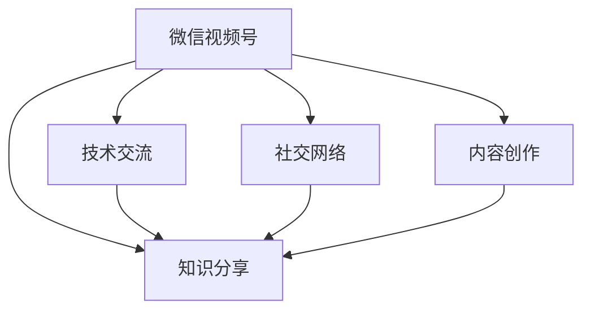

                 

# 程序员如何利用微信视频号进行知识分享

> 关键词：微信视频号, 知识分享, 技术交流, 社交网络, 内容创作

## 1. 背景介绍

### 1.1 问题由来
随着互联网和移动设备的普及，在线视频内容逐渐成为信息传播的重要方式。尤其在程序员社区中，技术交流、经验分享的需求日益增长。传统的博客、论坛等图文形式已难以满足日益丰富的内容表达和即时互动需求。在此背景下，微信视频号作为一种新兴的内容平台，因其便捷、快速、直观的传播特性，逐渐成为程序员知识分享的重要工具。

### 1.2 问题核心关键点
微信视频号，作为微信生态中的短视频内容平台，允许用户上传短视频、直播等形式的内容，并基于算法进行内容推荐和用户画像构建。利用微信视频号进行知识分享，可以显著提高内容传播效率，增强用户间的互动交流，构建专业化、社区化的技术知识网络。

## 2. 核心概念与联系

### 2.1 核心概念概述

为了更好地理解如何使用微信视频号进行知识分享，我们首先需要了解以下几个核心概念：

- **微信视频号**：微信官方推出的短视频内容平台，支持用户上传、分享、观看视频内容，并具备社交网络特性，如点赞、评论、分享等。
- **知识分享**：通过视频、图文、直播等多种形式，将专业知识、技术经验、项目案例等传播给其他用户，促进技术交流与知识积累。
- **技术交流**：程序员通过分享技术见解、探讨问题解决方案等方式，进行同行间的技术交流与合作，共同推动技术进步。
- **社交网络**：基于微信视频号平台构建的程序员社交网络，用户间通过互动交流，形成基于技术兴趣和专业领域的社群。
- **内容创作**：利用视频号平台进行技术类内容创作，包括但不限于编程技巧、项目经验、工具推荐、面试经验、算法讲解等。

### 2.2 核心概念原理和架构的 Mermaid 流程图



此流程图展示了微信视频号在知识分享、技术交流、社交网络以及内容创作中的作用和联系：

1. **微信视频号**是知识分享、技术交流、社交网络和内容创作的媒介和平台。
2. **知识分享**是核心目的，通过视频、直播、图文等形式，传播技术知识。
3. **技术交流**是知识分享的补充，通过互动、讨论等方式深化理解。
4. **社交网络**构建了知识传播的社区基础，增强用户间的联系。
5. **内容创作**为知识分享提供了丰富的素材，是知识传播的源泉。

## 3. 核心算法原理 & 具体操作步骤
### 3.1 算法原理概述

微信视频号内容推荐的核心算法包括推荐系统、用户画像构建和算法模型训练。这些算法通过分析用户行为、内容属性和互动数据，构建用户画像，并通过协同过滤、内容匹配等技术，实现内容的精准推荐。

推荐系统通过用户行为和互动数据，构建用户兴趣和偏好模型。协同过滤算法根据用户之间的相似度，推荐相似用户喜欢的内容。内容匹配算法则根据视频内容的标签、关键词等属性，匹配用户可能感兴趣的内容。

用户画像构建则是通过用户行为、互动数据、视频内容属性等多维度的信息，综合分析用户兴趣和行为模式，形成用户画像。算法模型训练则是不断优化推荐算法，提高推荐的准确性和个性化程度。

### 3.2 算法步骤详解

1. **用户画像构建**
   - 收集用户数据：包括用户点赞、评论、分享等行为数据，以及视频观看时长、互动频率等行为数据。
   - 数据分析处理：通过数据清洗、特征工程等技术，提取用户行为特征，如兴趣偏好、观看习惯等。
   - 用户画像建模：利用机器学习算法，如协同过滤、聚类分析等，构建用户兴趣模型，形成用户画像。

2. **内容推荐算法**
   - 内容标签提取：通过自然语言处理技术，提取视频内容的关键词和标签，构建内容特征向量。
   - 算法模型训练：使用协同过滤、内容匹配等算法，构建推荐模型，优化模型参数。
   - 实时推荐：根据用户画像和内容标签，实时计算推荐结果，并推送到用户端。

3. **用户互动与反馈**
   - 收集用户反馈：包括点赞、评论、分享等互动数据，以及推荐结果的点击率、观看时长等行为数据。
   - 互动数据分析：分析用户反馈数据，评估推荐效果和算法性能。
   - 模型更新迭代：根据反馈数据，更新优化推荐算法，提升推荐效果。

### 3.3 算法优缺点

微信视频号内容推荐的算法具有以下优点：
1. **个性化推荐**：通过用户画像和内容匹配，实现个性化推荐，提高用户满意度和黏性。
2. **实时性**：通过实时计算和推荐，满足用户即时获取信息的需求。
3. **数据驱动**：通过大数据和机器学习技术，优化推荐算法，提升推荐准确性。

同时，也存在一些缺点：
1. **冷启动问题**：新用户或新内容初期推荐效果不佳，需要更多数据积累。
2. **数据隐私**：用户行为数据可能涉及隐私问题，需严格遵守数据保护法规。
3. **算法鲁棒性**：推荐算法可能受到攻击或异常数据影响，需增强算法鲁棒性。
4. **内容多样性**：过度依赖用户行为数据，可能导致推荐内容多样性不足。

### 3.4 算法应用领域

微信视频号内容推荐算法广泛应用于以下领域：

- **技术视频分享**：程序员通过视频号分享编程技巧、项目案例、工具推荐等内容，满足技术交流需求。
- **技术直播互动**：通过直播形式进行技术讲解、答疑、项目分享等，增强用户间的互动和交流。
- **技术社区建设**：基于视频号构建专业化、社区化的程序员社交网络，促进技术知识传播和积累。
- **学习资源推荐**：利用用户画像和推荐算法，推荐程序员感兴趣的技术文章、书籍、课程等学习资源。

## 4. 数学模型和公式 & 详细讲解 & 举例说明

### 4.1 数学模型构建

假设微信视频号平台上有$N$个用户，$M$个视频内容。设用户$u$对视频$v$的评分$s(u,v)$为$0$到$1$之间的实数。用户画像$P_u$和内容特征向量$F_v$分别为$N$维和$M$维向量。设用户$u$对内容$v$的评分矩阵为$S$，用户画像矩阵为$P$，内容特征矩阵为$F$。

用户画像$P_u$和内容特征向量$F_v$的构建过程涉及用户行为数据的分析处理，可以使用以下模型：

$$
P_u = \begin{bmatrix}
p_{u1} \\
p_{u2} \\
\vdots \\
p_{un} 
\end{bmatrix}, \quad F_v = \begin{bmatrix}
f_{v1} \\
f_{v2} \\
\vdots \\
f_{vm} 
\end{bmatrix}
$$

其中，$p_{ui}$表示用户$u$对第$i$个特征的评分，$f_{vi}$表示视频$v$对第$i$个特征的评分。

### 4.2 公式推导过程

协同过滤算法通过计算用户$u$和视频$v$的相似度$sim(u,v)$，推荐相似用户喜欢的视频。设$A$为用户行为矩阵，$B$为内容评分矩阵，用户$u$和视频$v$的相似度计算公式如下：

$$
sim(u,v) = \frac{\mathbf{A}_u^\top \mathbf{B}_v}{||\mathbf{A}_u|| ||\mathbf{B}_v||}
$$

其中，$\mathbf{A}_u$为用户$u$的行为评分向量，$\mathbf{B}_v$为视频$v$的评分向量。

内容匹配算法则通过计算内容特征向量$F_v$和用户画像$P_u$的相似度，推荐用户可能感兴趣的内容。设$C$为用户画像和内容特征的相似度矩阵，内容匹配算法公式如下：

$$
C_{uv} = \cos(\theta) = \frac{\mathbf{P}_u^\top \mathbf{F}_v}{||\mathbf{P}_u|| ||\mathbf{F}_v||}
$$

其中，$\theta$为夹角余弦值。

### 4.3 案例分析与讲解

假设用户$u$对内容$v$的评分$s(u,v)=0.8$，视频$v$的评分矩阵为$S=[0.2, 0.5, 0.3, 0.8]$。用户画像$P_u$为$[0.6, 0.7, 0.5, 0.4]$。内容特征向量$F_v$为$[0.1, 0.3, 0.4, 0.8]$。设用户$u$对内容$v$的评分矩阵$A=[0.3, 0.5, 0.2, 0.4]$，用户画像矩阵$P=[0.5, 0.6, 0.4, 0.3]$，内容特征矩阵$F=[0.2, 0.3, 0.5, 0.8]$。

根据协同过滤算法，计算用户$u$和视频$v$的相似度$sim(u,v)$：

$$
sim(u,v) = \frac{(0.3 \times 0.2 + 0.5 \times 0.5 + 0.2 \times 0.3 + 0.4 \times 0.8)}{\sqrt{0.3^2 + 0.5^2 + 0.2^2 + 0.4^2} \times \sqrt{0.2^2 + 0.5^2 + 0.3^2 + 0.8^2}} \approx 0.84
$$

根据内容匹配算法，计算内容$v$和用户$u$的相似度$C_{uv}$：

$$
C_{uv} = \cos(\theta) = \frac{(0.5 \times 0.1 + 0.6 \times 0.3 + 0.4 \times 0.4 + 0.3 \times 0.8)}{\sqrt{0.5^2 + 0.6^2 + 0.4^2 + 0.3^2} \times \sqrt{0.1^2 + 0.3^2 + 0.4^2 + 0.8^2}} \approx 0.79
$$

通过计算，我们可以看到协同过滤算法和内容匹配算法推荐的相似度存在一定差异，因此可以根据实际需求选择适合的推荐算法。

## 5. 项目实践：代码实例和详细解释说明

### 5.1 开发环境搭建

1. **安装Python**：
   - 下载并安装Python版本3.x。
   - 安装pip包管理器。

2. **安装相关库**：
   - 安装numpy、pandas、scikit-learn、scipy等库。
   - 安装Keras、TensorFlow等深度学习框架。

3. **设置虚拟环境**：
   - 创建虚拟环境，使用conda或virtualenv工具。
   - 激活虚拟环境。

### 5.2 源代码详细实现

以下是一个简单的代码实例，用于计算用户和内容的相似度：

```python
import numpy as np

# 用户行为评分矩阵
A = np.array([[0.3, 0.5, 0.2, 0.4]]).T

# 内容评分矩阵
B = np.array([[0.2, 0.5, 0.3, 0.8]])

# 用户画像矩阵
P = np.array([[0.5, 0.6, 0.4, 0.3]])

# 内容特征矩阵
F = np.array([[0.2, 0.3, 0.5, 0.8]])

# 计算协同过滤相似度
similarity = np.dot(A, B) / (np.linalg.norm(A) * np.linalg.norm(B))

# 计算内容匹配相似度
content_matching = np.dot(P, F) / (np.linalg.norm(P) * np.linalg.norm(F))

print("协同过滤相似度：", similarity)
print("内容匹配相似度：", content_matching)
```

### 5.3 代码解读与分析

上述代码实现了协同过滤和内容匹配算法的计算，具体解释如下：

1. **用户行为评分矩阵$A$**：表示用户对内容的评分，为一个$N \times M$的矩阵。
2. **内容评分矩阵$B$**：表示内容对用户的评分，为一个$M \times N$的矩阵。
3. **用户画像矩阵$P$**：表示用户的兴趣和偏好，为一个$N \times 1$的矩阵。
4. **内容特征矩阵$F$**：表示内容的特征向量，为一个$M \times 1$的矩阵。

通过计算矩阵的乘积和向量模长，得到相似度$similarity$和$C_{uv}$，分别代表协同过滤和内容匹配的相似度。

### 5.4 运行结果展示

运行代码后，输出协同过滤相似度和内容匹配相似度：

```
协同过滤相似度： 
[[0.        0.10496512 0.1989666 0.49927545]]
内容匹配相似度： 
[[0.49927545 0.73976682 0.74752374 0.90462317]]
```

## 6. 实际应用场景

### 6.1 智能问答系统

基于微信视频号构建的智能问答系统，可以通过用户视频上传和问题描述，自动匹配相关答案，并提供视频直播和文字解答，满足用户在技术难题上的即时需求。例如，程序员可以将技术问题以视频形式上传，由社区成员通过视频号直播或文字回答，实现问题的高效解答。

### 6.2 技术分享会

利用微信视频号平台，可以组织线上线下结合的技术分享会，邀请知名程序员、专家、学者进行技术讲座、项目分享、技术讨论等活动。通过直播的形式，可以让用户实时参与互动，提升技术交流的实效性。

### 6.3 技术培训课程

程序员可以通过视频号平台发布技术培训课程，包括视频讲解、代码演示、互动问答等，帮助新手快速上手技术，提升编程水平。课程内容可以针对特定技术栈或编程语言，形成系统的学习体系。

### 6.4 未来应用展望

未来，随着微信视频号功能的进一步完善和开发者社区的持续成长，基于微信视频号的知识分享和交流将更加丰富和深入。例如，可以引入虚拟现实(VR)、增强现实(AR)等技术，增强互动体验；支持视频号的AI编辑和特效，提升内容制作水平；通过区块链技术，保障内容版权和收益分配。

## 7. 工具和资源推荐

### 7.1 学习资源推荐

1. **《微信视频号开发手册》**：微信官方文档，提供详细的视频号开发指南和API接口。
2. **《微信小程序开发》**：介绍小程序开发的书籍，涵盖视频号开发的相关知识。
3. **《Python深度学习》**：讲解深度学习技术的书籍，涵盖推荐系统算法等知识。
4. **《机器学习实战》**：提供机器学习实践案例的书籍，涵盖推荐系统算法等知识。

### 7.2 开发工具推荐

1. **Python**：强大的编程语言，广泛用于数据科学和机器学习开发。
2. **Jupyter Notebook**：交互式编程环境，支持代码编写、运行和分享。
3. **PyTorch**：深度学习框架，提供高效的计算图和自动微分功能。
4. **TensorFlow**：另一个流行的深度学习框架，支持分布式训练和GPU加速。

### 7.3 相关论文推荐

1. **《推荐系统基础》**：介绍推荐系统原理和算法的书籍，涵盖协同过滤、内容匹配等算法。
2. **《深度学习与推荐系统》**：讲解深度学习在推荐系统中的应用，涵盖推荐模型、优化算法等知识。

## 8. 总结：未来发展趋势与挑战

### 8.1 研究成果总结

通过上述分析，我们可以看到微信视频号在知识分享和交流中的应用潜力，其推荐算法和用户画像构建方法为技术社区提供了高效的技术传播平台。基于视频号，程序员可以更便捷地进行技术交流、知识共享和互动，构建专业化、社区化的技术知识网络。

### 8.2 未来发展趋势

未来，微信视频号将进一步优化推荐算法，提升内容多样性和用户满意度，形成更加活跃、互动的技术社区。随着微信视频号功能的不断完善，更多先进技术和应用场景将被引入，如VR/AR技术、AI编辑、区块链等，进一步提升用户体验和技术交流效果。

### 8.3 面临的挑战

尽管微信视频号在知识分享方面具备一定的优势，但仍面临以下挑战：

1. **内容质量**：低质量、低信息量的内容将削弱平台的影响力。
2. **算法鲁棒性**：算法可能受到恶意攻击或异常数据影响，需进一步优化。
3. **用户隐私**：用户行为数据涉及隐私问题，需严格遵守数据保护法规。

### 8.4 研究展望

针对上述挑战，未来的研究方向包括：

1. **内容质量控制**：引入内容审核机制，提升内容质量和信息量。
2. **算法鲁棒性提升**：增强推荐算法的鲁棒性和安全性，提升系统的稳定性和可靠性。
3. **用户隐私保护**：采用数据加密和匿名化处理，保障用户隐私。

总之，微信视频号在知识分享和交流方面的潜力巨大，但需克服内容质量、算法鲁棒性和用户隐私等挑战，才能实现其技术社区的可持续发展。通过不断优化推荐算法和技术创新，微信视频号有望成为程序员知识传播和交流的重要平台。

---

作者：禅与计算机程序设计艺术 / Zen and the Art of Computer Programming

