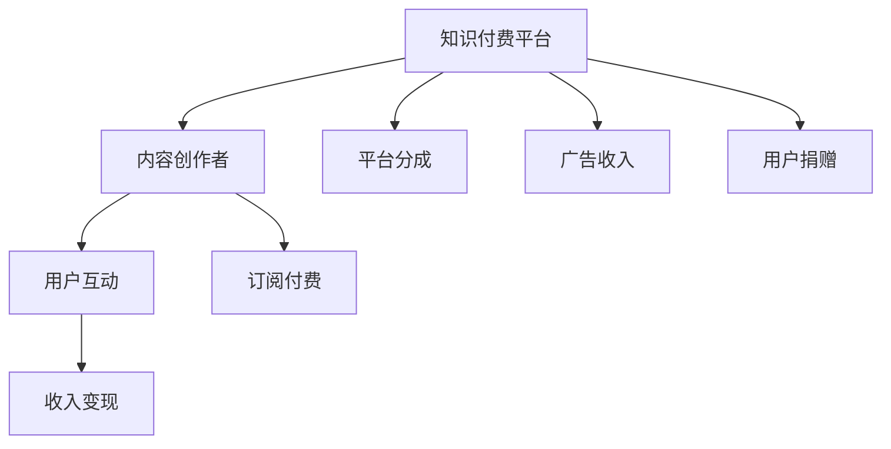

                 

## 1. 背景介绍

### 1.1 问题由来
随着互联网技术的迅猛发展，知识付费平台如雨后春笋般涌现，为广大程序员提供了新的变现方式。但如何高效地将自身知识转化为收入，是许多程序员面临的共同问题。本文旨在探讨程序员如何利用知识付费实现被动收入的策略与方法，帮助程序员拓宽收入渠道，提升生活质量。

### 1.2 问题核心关键点
在知识付费领域，程序员面临的关键点包括：
- **内容定位**：确定适合的知识和技能，具有市场需求的教程和项目。
- **平台选择**：选择适合的付费平台，如专栏、课程、直播等。
- **内容创作**：高质量、系统化的知识内容创作，包括教学设计、图文视频制作等。
- **用户互动**：与用户有效互动，提升学习效果，增强用户粘性。
- **收入变现**：多渠道变现，如平台分成、广告收入、私教服务等。

### 1.3 问题研究意义
在信息技术日新月异的今天，程序员的知识更新速度至关重要。通过知识付费，不仅能分享自身经验，还能获得被动收入，进一步提升自身价值。本文将系统介绍如何利用知识付费实现被动收入，对程序员的职业发展和收入提升具有重要意义。

## 2. 核心概念与联系

### 2.1 核心概念概述

知识付费是指通过向用户提供有价值的内容，以付费形式获取回报的一种模式。这种模式不仅促进了知识传播，也激励了内容创作者不断提升内容质量。

- **知识付费平台**：如Coursera、Udacity、Bilibili等，为创作者提供展示和变现的渠道。
- **内容创作**：包括编程教学、项目实战、技术博客等，涵盖编程语言、框架、工具等广泛内容。
- **用户互动**：通过问答、评论、直播等方式，与用户建立联系，提升互动体验。
- **收入变现**：通过平台分成、订阅付费、广告收入、用户捐赠等多种方式，实现盈利。

### 2.2 核心概念原理和架构的 Mermaid 流程图


## 3. 核心算法原理 & 具体操作步骤

### 3.1 算法原理概述

知识付费的核心在于内容质量和用户互动。算法原理主要包括以下几个方面：

- **内容匹配**：通过算法推荐，将内容推荐给最需要的用户，提高内容的曝光率和覆盖面。
- **互动分析**：分析用户行为数据，了解用户的学习偏好和互动模式，进一步优化内容创作和互动策略。
- **收益计算**：基于用户互动和内容质量，计算创作者应得的收入，包括平台分成、广告收入、用户捐赠等。

### 3.2 算法步骤详解

1. **内容定位**：
   - 选择热门编程语言和框架作为主要教学内容，如Python、Java、JavaScript等。
   - 根据自身专长和市场需求，选择项目实战、技术博客、视频教程等多种形式的内容创作。

2. **平台选择**：
   - 在Udemy、Coursera、Codecademy等主流知识付费平台注册账号。
   - 了解不同平台的收费模式、分成比例、用户特点，选择最适合自己的平台。

3. **内容创作**：
   - **教学设计**：确定教学目标、内容大纲、时间安排等。
   - **图文视频制作**：使用Camtasia、Adobe Premiere等工具制作高质量视频。
   - **代码演示**：展示实际代码运行效果，增强学习效果。
   - **内容发布**：上传至知识付费平台，参与平台分发。

4. **用户互动**：
   - **问答环节**：利用平台问答功能，及时解答用户疑问。
   - **评论区互动**：与用户交流学习心得，提升用户粘性。
   - **直播授课**：通过直播形式，实时解答问题，增加互动性。

5. **收入变现**：
   - **平台分成**：根据平台政策，平台会自动按比例分配收入。
   - **广告收入**：加入平台广告联盟，通过平台推广产品或服务获得收入。
   - **订阅付费**：设置课程付费模式，提高用户粘性和收入。
   - **用户捐赠**：通过用户捐赠，获得额外收入。

### 3.3 算法优缺点

**优点**：
- **高效变现**：通过知识付费平台，可以快速将知识变现，提高收入水平。
- **广泛覆盖**：平台分发大大提高了内容的曝光率和覆盖面，提升知名度。
- **持续学习**：与用户互动，不断获取反馈，提升内容质量，形成良性循环。

**缺点**：
- **时间和精力成本**：内容创作和互动需要大量的时间和精力投入。
- **平台分成比例**：不同平台分成比例不同，创作者收入可能受限。
- **市场竞争**：知识付费市场竞争激烈，需要不断创新和优化内容。

### 3.4 算法应用领域

知识付费技术广泛应用于多种场景，如：
- **编程教学**：包括Python、Java、C++等编程语言，框架和技术栈的教学。
- **项目实战**：从项目需求分析到实现，涉及前端、后端、测试等多个环节。
- **技术博客**：分享编程心得、项目经验、技术栈评估等。
- **技术直播**：实时互动解答技术问题，提升用户参与度。
- **在线课程**：系统化学习，适合不同层次的程序员学习。

## 4. 数学模型和公式 & 详细讲解

### 4.1 数学模型构建

设内容创作者为$C$，平台为用户$U$，内容为$A$，平台收入为$I$。内容匹配算法为$F$，用户互动算法为$I$，收益计算算法为$B$。

**内容匹配模型**：
$$
F(A, C, U) = \frac{A}{C} \times \frac{U}{F_{total}}
$$

**用户互动模型**：
$$
I(C, U) = \frac{U \times A}{I_{total} \times C}
$$

**收益计算模型**：
$$
B(I, A, C) = I \times \frac{A}{C} \times \frac{U}{I_{total}}
$$

### 4.2 公式推导过程

1. **内容匹配**：
   - 通过内容推荐算法，计算每个内容$A_i$对用户$U_j$的相关度$F(A_i, U_j)$。
   - 相关度计算公式为$F(A_i, U_j) = \frac{A_i}{A_{total}} \times \frac{U_j}{U_{total}}$，其中$A_{total}$和$U_{total}$分别为所有内容的总数和用户总数。

2. **用户互动**：
   - 根据用户互动数据，计算用户$U_j$对内容$A_i$的互动评分$I(A_i, U_j)$。
   - 互动评分计算公式为$I(A_i, U_j) = \frac{A_i \times U_j}{I_{total} \times C}$，其中$I_{total}$为所有用户的总数，$C$为创作者总数。

3. **收益计算**：
   - 根据内容匹配和用户互动结果，计算创作者$C_k$的收益$B(C_k)$。
   - 收益计算公式为$B(C_k) = I \times \frac{A_k}{C_{total}} \times \frac{U_k}{I_{total}}$，其中$A_k$为创作者$C_k$发布的所有内容总数，$C_{total}$为所有创作者的总数。

### 4.3 案例分析与讲解

**案例一：编程语言教程**

- **内容创作**：
  - **教学设计**：设定Python教程大纲，包括基础语法、高级应用、项目实战等。
  - **图文视频制作**：使用Camtasia制作教程视频，Adobe Photoshop制作PPT。
  - **代码演示**：展示Python代码运行效果，增强学习体验。
  - **内容发布**：上传至Udemy平台。

- **用户互动**：
  - **问答环节**：在Udemy问答区解答用户问题，及时更新内容。
  - **评论区互动**：通过评论功能与用户互动，提升学习效果。
  - **直播授课**：每周定期举行直播，实时解答问题，增加互动性。

- **收入变现**：
  - **平台分成**：根据Udemy平台分成政策，平台自动按比例分配收入。
  - **广告收入**：加入平台广告联盟，通过平台推广Python产品或服务。
  - **订阅付费**：设置Python教程付费模式，提高用户粘性和收入。
  - **用户捐赠**：通过用户捐赠，获得额外收入。

**案例二：项目实战教程**

- **内容创作**：
  - **教学设计**：设定项目实战大纲，包括需求分析、设计、编码、测试等。
  - **图文视频制作**：使用Camtasia制作教程视频，Adobe After Effects制作项目演示。
  - **代码演示**：展示实际代码运行效果，增强学习效果。
  - **内容发布**：上传至Coursera平台。

- **用户互动**：
  - **问答环节**：在Coursera问答区解答用户问题，及时更新内容。
  - **评论区互动**：通过评论功能与用户互动，提升学习效果。
  - **直播授课**：每周定期举行直播，实时解答问题，增加互动性。

- **收入变现**：
  - **平台分成**：根据Coursera平台分成政策，平台自动按比例分配收入。
  - **广告收入**：加入平台广告联盟，通过平台推广项目实战工具或服务。
  - **订阅付费**：设置项目实战教程付费模式，提高用户粘性和收入。
  - **用户捐赠**：通过用户捐赠，获得额外收入。

## 5. 项目实践：代码实例和详细解释说明

### 5.1 开发环境搭建

1. **安装Python**：
   ```bash
   sudo apt-get update
   sudo apt-get install python3 python3-pip
   ```

2. **安装相关库**：
   ```bash
   pip install flask web3 requests
   ```

3. **搭建Web服务器**：
   ```python
   from flask import Flask, request

   app = Flask(__name__)

   @app.route('/hello', methods=['GET'])
   def hello():
       return 'Hello, World!'
   ```

4. **部署服务器**：
   ```bash
   nohup python app.py > log.txt 2>&1 &
   ```

### 5.2 源代码详细实现

以下是使用Flask实现知识付费平台内容分发的代码示例：

```python
from flask import Flask, request, jsonify

app = Flask(__name__)

# 内容数据
content_db = {
    'python': {'id': 1, 'title': 'Python基础教程', 'price': 19.99},
    'java': {'id': 2, 'title': 'Java高级开发', 'price': 29.99},
    'javascript': {'id': 3, 'title': 'JavaScript框架实战', 'price': 29.99}
}

@app.route('/content', methods=['GET'])
def get_content():
    content_id = request.args.get('id')
    if content_id in content_db:
        return jsonify(content_db[content_id])
    else:
        return jsonify({'error': 'Content not found'})

if __name__ == '__main__':
    app.run(debug=True)
```

### 5.3 代码解读与分析

**Flask服务器**：
- **路由**：`@app.route('/content', methods=['GET'])`定义了获取内容接口。
- **内容数据**：`content_db`存储了所有内容的数据，包括课程名称、价格等。
- **获取内容**：根据传入的`id`获取对应的内容信息，并返回JSON格式的数据。

**Web服务器搭建**：
- **运行**：使用`app.run(debug=True)`启动Web服务器，并设置`debug=True`以便调试。
- **部署**：通过后台命令`nohup python app.py > log.txt 2>&1 &`后台运行服务器，并将日志输出至`log.txt`文件。

**API接口**：
- **GET请求**：通过`/get_content`接口，可以获取指定课程的信息。
- **请求参数**：通过`request.args.get('id')`获取传入的`id`参数。
- **返回数据**：根据课程`id`，从`content_db`中获取对应的课程信息，并返回JSON格式数据。

### 5.4 运行结果展示

运行上述代码，访问`http://localhost:5000/content?id=1`，即可获取`Python基础教程`的信息。结果如下：

```json
{
    "title": "Python基础教程",
    "id": 1,
    "price": 19.99
}
```

## 6. 实际应用场景

### 6.1 教育培训

知识付费在教育培训领域应用广泛，通过编程教育、项目实战等方式，帮助学员掌握编程技能。例如：
- **编程教育**：提供Python、Java、C++等编程语言的入门教程，涵盖基础语法、高级应用、项目实战等。
- **项目实战**：从需求分析到项目实现，涵盖前端、后端、测试等多个环节，帮助学员提高实际开发能力。

### 6.2 技术分享

技术分享是知识付费的重要组成部分，通过博客、视频等形式分享技术心得和经验。例如：
- **技术博客**：分享编程心得、项目经验、技术栈评估等，帮助读者掌握最新的技术趋势。
- **技术视频**：通过视频教程，展示实际编程项目和技术应用，提升学习效果。

### 6.3 技能提升

技能提升是知识付费的重要目标之一，通过课程学习、在线直播等方式，帮助学员掌握新技能。例如：
- **在线课程**：提供系统化的编程课程，涵盖从基础到高级的多层次内容，帮助学员全面提升编程技能。
- **在线直播**：通过直播授课，实时解答问题，增加互动性，提升学习效果。

### 6.4 未来应用展望

未来，知识付费技术将继续拓展应用场景，以下是几个可能的趋势：

1. **个性化推荐**：通过机器学习算法，推荐最适合用户的学习内容，提升学习效果。
2. **社区互动**：构建知识付费社区，增加用户粘性，促进知识共享和交流。
3. **在线协作**：通过在线协作工具，支持用户共同完成项目，提升团队协作能力。
4. **虚拟现实**：通过虚拟现实技术，提供沉浸式学习体验，增强学习效果。
5. **AI辅助**：通过AI技术，自动生成内容、提供个性化推荐，提升内容质量和用户体验。

## 7. 工具和资源推荐

### 7.1 学习资源推荐

1. **Udemy**：提供丰富的编程课程，涵盖Python、Java、JavaScript等语言和技术栈。
2. **Coursera**：提供系统化的在线课程，涵盖计算机科学、数据科学等多个领域。
3. **Codecademy**：提供互动式编程练习，适合编程初学者。
4. **LeetCode**：提供算法和数据结构练习，提升编程技能。
5. **GitHub**：提供开源项目和代码库，学习编程实战项目。

### 7.2 开发工具推荐

1. **Python**：Python语言简洁高效，适用于知识付费平台的开发。
2. **Flask**：轻量级Web框架，简单易用，适合开发API接口。
3. **Markdown**：文本格式，适合编写技术文档和博客文章。
4. **Git**：版本控制系统，适合代码管理和协作开发。
5. **Jupyter Notebook**：交互式编程环境，适合代码调试和数据可视化。

### 7.3 相关论文推荐

1. **《知识付费平台的内容推荐算法研究》**：论文分析了知识付费平台的内容推荐算法，提出了基于协同过滤和矩阵分解的推荐策略。
2. **《基于用户行为的个性化内容推荐》**：论文介绍了基于用户行为数据的内容推荐系统，提升了用户的学习体验。
3. **《知识付费平台的收益分配模型研究》**：论文探讨了知识付费平台的收益分配模型，提出了公平合理的收益分配机制。

## 8. 总结：未来发展趋势与挑战

### 8.1 研究成果总结

本文详细介绍了程序员如何利用知识付费实现被动收入的策略与方法，通过内容创作、平台选择、用户互动和收入变现等步骤，探讨了知识付费的实践路径和具体实现方式。通过多个案例分析，展示了知识付费平台在教育培训、技术分享、技能提升等多个场景的应用。

### 8.2 未来发展趋势

未来知识付费技术将继续发展，以下是几个可能的发展趋势：

1. **个性化推荐**：通过机器学习算法，推荐最适合用户的学习内容，提升学习效果。
2. **社区互动**：构建知识付费社区，增加用户粘性，促进知识共享和交流。
3. **在线协作**：通过在线协作工具，支持用户共同完成项目，提升团队协作能力。
4. **虚拟现实**：通过虚拟现实技术，提供沉浸式学习体验，增强学习效果。
5. **AI辅助**：通过AI技术，自动生成内容、提供个性化推荐，提升内容质量和用户体验。

### 8.3 面临的挑战

尽管知识付费技术取得了一定进展，但仍面临以下挑战：

1. **内容质量**：内容质量是知识付费的核心，需要不断提升内容的专业性和实用性。
2. **用户互动**：如何增加用户互动，提升学习效果，仍然是一个难题。
3. **平台竞争**：知识付费平台众多，如何突出自身优势，吸引更多用户，仍需不断努力。
4. **技术挑战**：平台搭建、内容分发、收益计算等技术问题，需要不断优化。
5. **市场变化**：知识付费市场变化快，需要不断调整内容和策略，保持竞争力。

### 8.4 研究展望

未来知识付费技术的研究将更加深入，以下是几个可能的研究方向：

1. **多模态内容创作**：通过文本、视频、音频等多模态数据，提升内容的丰富性和表现力。
2. **内容质量评估**：引入专家评审和用户反馈，构建内容质量评估体系，提升内容质量。
3. **用户行为分析**：通过数据分析，深入了解用户行为和需求，优化内容和推荐策略。
4. **平台生态建设**：构建知识付费平台生态，促进内容创作者、平台和用户之间的良性互动。
5. **跨平台合作**：与其他知识付费平台进行合作，共享内容和用户资源，提升平台竞争力。

总之，知识付费技术在提升程序员收入方面具有重要意义，需要不断探索和优化，以实现更好的应用效果。通过本文的系统介绍，相信程序员能够更好地掌握知识付费的实践方法和策略，实现被动收入的梦想。

---

作者：禅与计算机程序设计艺术 / Zen and the Art of Computer Programming

