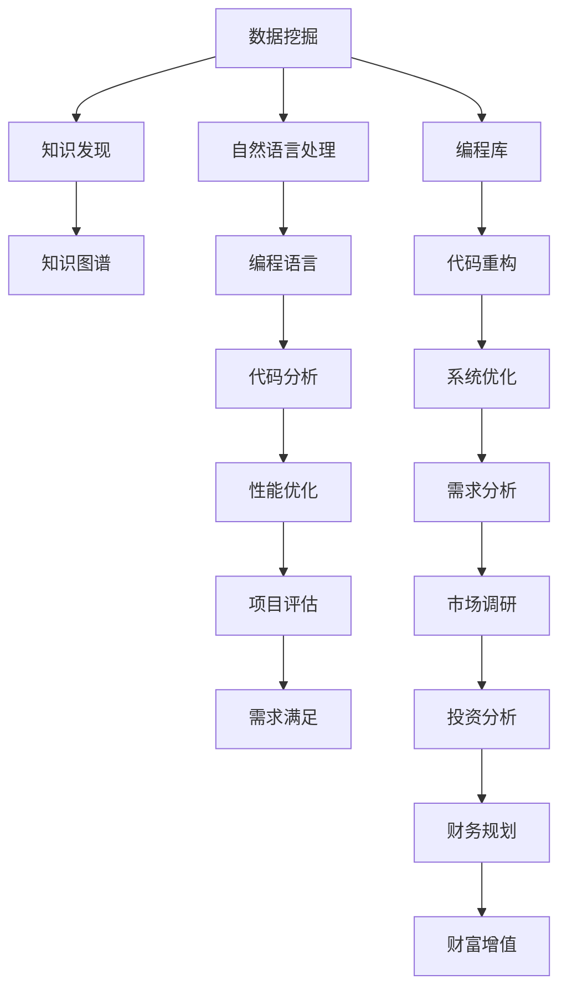

                 

# 程序员如何利用知识发现引擎实现财富自由

> 关键词：知识发现引擎, 数据挖掘, 自然语言处理, 财富自由, 编程语言

## 1. 背景介绍

在现代社会，信息爆炸，数据如潮水般涌现。对于程序员来说，如何从海量数据中提取出有用的知识，并利用这些知识实现个人和企业的价值增长，成为了一个重要课题。尤其是对于有志于财富自由的程序员而言，掌握高效的知识发现技术，将大数据转化为资产，更是迫在眉睫。

### 1.1 问题由来
随着互联网和移动互联网的迅猛发展，数据量呈指数级增长。数据已经从简单的数字、文字扩展到图像、视频、语音等多种形式，数据挖掘（Data Mining）和知识发现（Knowledge Discovery）技术在各行各业得到广泛应用。然而，数据量虽然庞大，但有用的信息却像沙里淘金，需要高效的技术手段进行挖掘。

程序员利用知识发现技术，可以从海量的编程文档、技术博客、源代码库等数据中，提取高质量的知识和经验，实现技术提升和项目优化，从而在职业生涯中快速增值。此外，通过知识发现引擎，程序员还能洞察市场趋势、预判技术走向，及时把握投资机会，实现财富自由。

### 1.2 问题核心关键点
知识发现引擎（Knowledge Discovery Engine）是一种高级的数据挖掘工具，通过智能化算法和模型，从大数据中提取有价值的信息和知识。对于程序员来说，知识发现引擎的运用关键点包括：

1. 选择合适的知识发现工具和技术。
2. 明确数据来源和分析目标。
3. 理解数据清洗、预处理和特征提取的过程。
4. 掌握常用的知识发现算法和模型。
5. 结合实际需求，进行模型调优和结果解释。

### 1.3 问题研究意义
掌握知识发现技术，对程序员而言，具有重要的实践意义：

1. **技术提升**：能够快速识别编程语言、框架、库等技术栈中的知识点，加速学习和应用。
2. **项目优化**：通过分析代码库和开发日志，识别性能瓶颈和潜在问题，优化开发效率和项目质量。
3. **市场洞察**：利用自然语言处理技术，从社区讨论、招聘信息中挖掘行业趋势，指导职业规划和发展。
4. **财富增值**：通过数据洞察，把握投资机会，利用数据分析进行财务规划，实现资产增值。

## 2. 核心概念与联系

### 2.1 核心概念概述

为更好地理解知识发现引擎及其在财富自由应用中的实践，本节将介绍几个密切相关的核心概念：

1. **知识发现（Knowledge Discovery）**：通过算法和模型，从大数据中挖掘和提取有价值的信息和知识的过程。
2. **数据挖掘（Data Mining）**：一种从大数据中提取出有用知识和规律的技术，常用于市场营销、金融、医疗等领域。
3. **自然语言处理（NLP）**：使计算机能理解、处理和生成自然语言的技术，是知识发现中重要的一环。
4. **编程语言**：程序员进行软件开发的基础工具，通过分析编程语言和代码库，可以发现很多技术细节和开发技巧。
5. **知识图谱（Knowledge Graph）**：通过语义图表示实体和关系的图谱，用于表示复杂知识和关系，是知识发现的重要工具。

这些核心概念之间的逻辑关系可以通过以下Mermaid流程图来展示：



这个流程图展示了好几种核心概念及其之间的关系：

1. 数据挖掘从原始数据中提取有用信息，自然语言处理则解析文本数据，两者共同构成了知识发现的基础。
2. 编程语言和代码库是程序员的工作对象，知识发现可以分析这些对象，优化开发过程。
3. 知识图谱用于构建复杂知识的表示，有助于程序员理解更抽象和深层的知识。

## 3. 核心算法原理 & 具体操作步骤
### 3.1 算法原理概述

知识发现引擎通过一系列算法和模型，从数据中提取和挖掘知识。这些算法通常基于统计学、机器学习和人工智能技术，适用于各种不同类型的数据。

### 3.2 算法步骤详解

知识发现引擎的构建和应用一般包括以下几个关键步骤：

1. **数据预处理**：清洗、标准化、去除噪声和缺失值，确保数据的质量和一致性。
2. **特征提取**：从原始数据中提取关键特征，如词频、TF-IDF等，用于后续建模。
3. **模型选择和训练**：选择合适的算法（如K-means、决策树、神经网络等），并根据数据特征进行训练。
4. **模型评估和调优**：通过交叉验证等方法评估模型效果，根据结果进行参数调整和优化。
5. **结果解释和可视化**：将模型结果转换为可视化的图表和报告，便于理解和应用。

### 3.3 算法优缺点

知识发现引擎在数据挖掘和知识提取方面有其显著的优点，但也存在一些局限性：

**优点：**

1. **自动化程度高**：能自动处理大量数据，快速提取有用信息。
2. **高效性**：在正确配置下，可以显著提升数据分析和处理效率。
3. **多样性**：适用于文本、图像、声音等多种数据类型。

**缺点：**

1. **依赖数据质量**：对数据质量和特征提取依赖性较强，处理错误数据可能导致误导性结果。
2. **算法复杂度**：部分算法（如深度学习）模型复杂，训练成本较高。
3. **可解释性不足**：部分模型（如深度学习）难以解释，结果难以被理解和验证。

### 3.4 算法应用领域

知识发现引擎在多个领域都有广泛的应用，特别是对程序员而言，以下是几个典型的应用场景：

1. **编程语言和库的挖掘**：通过分析编程语言、框架、库等，挖掘其中隐藏的API文档、开发技巧和最佳实践。
2. **代码质量和性能优化**：利用知识发现技术，从代码库中分析代码风格、性能瓶颈和潜在的代码重构点。
3. **技术趋势和市场分析**：从技术社区、招聘信息和开源项目中挖掘技术趋势和市场需求，指导技术学习和职业规划。
4. **投资分析和财务规划**：利用自然语言处理技术，从财经新闻、企业报告中挖掘投资机会和财务指标，进行财务规划。

## 4. 数学模型和公式 & 详细讲解 & 举例说明

### 4.1 数学模型构建

在知识发现中，常用的数学模型包括分类、聚类、关联规则、回归等。这里以分类模型为例，介绍其构建过程。

假设我们有一个数据集 $D=\{(x_1,y_1),(x_2,y_2),...(x_n,y_n)\}$，其中 $x_i$ 为输入特征向量，$y_i$ 为类别标签。我们的目标是构建一个分类模型 $M(x)$，使得 $M(x)$ 能够对新数据 $x$ 进行准确的分类。

常用的分类算法包括决策树、支持向量机、神经网络等。这里以决策树算法为例，介绍模型的构建过程。

决策树的构建分为两个阶段：训练和预测。训练阶段用于生成决策树模型，预测阶段用于对新数据进行分类。

### 4.2 公式推导过程

决策树的构建主要涉及两个问题：选择最优特征和生成子树。

1. **特征选择**：假设特征集合为 $X=\{x_1,x_2,...,x_m\}$，我们希望选择最优特征 $x_j$ 作为分裂节点，使得模型对数据分类更加准确。常用的特征选择算法有信息增益、信息增益比、基尼指数等。以信息增益算法为例，其公式为：

$$
Gain(x_j) = H(x)-\sum_{j=1}^{m}P(x_j)H(x|x_j)
$$

其中 $H(x)$ 为数据集的熵，$P(x_j)$ 为特征 $x_j$ 在数据集中的概率，$H(x|x_j)$ 为在特征 $x_j$ 分割后的子集熵。

2. **子树生成**：在选定最优特征 $x_j$ 后，我们将数据按照特征值 $x_j$ 进行分裂，得到两个子集 $D_j^+$ 和 $D_j^-$。然后对这两个子集递归应用决策树算法，生成子树。

### 4.3 案例分析与讲解

以著名的Iris数据集为例，分析如何使用决策树进行分类。

Iris数据集包含150个样本，每个样本有4个特征属性（萼片长度、萼片宽度、花瓣长度、花瓣宽度）和3个类别标签（山鸢尾、变色鸢尾、维吉尼亚鸢尾）。我们可以使用决策树算法对数据进行分类，步骤如下：

1. 计算每个特征的信息增益，选择最优特征作为分裂节点。
2. 根据最优特征值，将数据集分为两个子集。
3. 对每个子集递归应用决策树算法，生成子树。
4. 最终生成的决策树可用于对新数据进行分类。

## 5. 项目实践：代码实例和详细解释说明
### 5.1 开发环境搭建

要进行知识发现项目的开发，需要先搭建好开发环境。以下是使用Python进行scikit-learn开发的环境配置流程：

1. 安装Anaconda：从官网下载并安装Anaconda，用于创建独立的Python环境。

2. 创建并激活虚拟环境：
```bash
conda create -n sklearn-env python=3.8 
conda activate sklearn-env
```

3. 安装scikit-learn：
```bash
pip install -U scikit-learn
```

4. 安装相关工具包：
```bash
pip install numpy pandas matplotlib seaborn scikit-learn
```

完成上述步骤后，即可在`sklearn-env`环境中开始知识发现项目的开发。

### 5.2 源代码详细实现

下面我们以Iris数据集为例，给出使用scikit-learn对决策树模型进行构建和评估的Python代码实现。

```python
from sklearn import datasets
from sklearn.model_selection import train_test_split
from sklearn.tree import DecisionTreeClassifier
from sklearn.metrics import accuracy_score
from sklearn.model_selection import GridSearchCV

# 加载Iris数据集
iris = datasets.load_iris()
X = iris.data
y = iris.target

# 划分训练集和测试集
X_train, X_test, y_train, y_test = train_test_split(X, y, test_size=0.2, random_state=42)

# 构建决策树模型
clf = DecisionTreeClassifier()
clf.fit(X_train, y_train)

# 预测测试集结果
y_pred = clf.predict(X_test)

# 计算模型准确率
accuracy = accuracy_score(y_test, y_pred)
print(f"模型准确率为：{accuracy:.2f}")

# 进行超参数调优
param_grid = {
    'max_depth': [2, 3, 4],
    'min_samples_split': [2, 3, 4],
    'min_samples_leaf': [1, 2, 3]
}
grid_search = GridSearchCV(clf, param_grid, cv=5, scoring='accuracy')
grid_search.fit(X_train, y_train)

# 输出最优模型参数
print(f"最优参数为：{grid_search.best_params_}")
```

以上就是使用scikit-learn对Iris数据集进行决策树模型构建和评估的完整代码实现。可以看到，scikit-learn提供了丰富的机器学习算法和工具，使得知识发现模型的构建和评估变得相对简单。

### 5.3 代码解读与分析

让我们再详细解读一下关键代码的实现细节：

**数据加载和分割**：
- `datasets.load_iris()`方法：从scikit-learn库中加载Iris数据集。
- `train_test_split()`方法：将数据集划分为训练集和测试集，设置比例为80%训练、20%测试。

**模型构建和预测**：
- `DecisionTreeClassifier()`方法：构建决策树模型。
- `fit()`方法：在训练集上拟合模型。
- `predict()`方法：对测试集进行预测。
- `accuracy_score()`方法：计算模型准确率。

**超参数调优**：
- `GridSearchCV()`方法：构建超参数搜索的Grid Search对象，设置参数搜索范围和交叉验证次数。
- `fit()`方法：在训练集上执行交叉验证，找出最优参数组合。
- `best_params_`属性：获取最优超参数组合。

可以看到，scikit-learn的API设计简洁高效，结合其强大的算法库，可以方便地实现各种知识发现任务。

## 6. 实际应用场景
### 6.1 代码质量检测

程序员可以利用知识发现引擎，从开源社区中挖掘高质量的代码，进行学习和借鉴。例如，可以从GitHub上的热门项目中，提取优秀代码片段，并结合自身项目需求进行改进。通过代码质量检测，还可以分析项目中代码重复率、复杂度、函数调用等情况，识别潜在的代码质量问题。

**代码质量检测步骤**：
1. 爬取开源项目代码库。
2. 提取代码片段和函数定义。
3. 进行代码质量检测，如重复代码检测、复杂度分析、调用链分析等。
4. 生成报告，提出改进建议。

### 6.2 技术趋势分析

程序员可以利用知识发现技术，从技术社区和开源项目中挖掘技术趋势，指导自己的学习和职业规划。

**技术趋势分析步骤**：
1. 从技术社区（如Stack Overflow、Github Issues、Stack Exchange等）爬取问题和评论。
2. 进行文本分析，提取关键技术名词和热点话题。
3. 利用可视化工具，呈现技术趋势和热点。
4. 根据技术趋势，调整学习和职业规划方向。

### 6.3 投资分析

程序员可以通过自然语言处理技术，从财经新闻和公司报告中挖掘投资机会，进行财务规划。

**投资分析步骤**：
1. 爬取财经新闻和公司报告。
2. 进行情感分析，判断市场情绪和公司前景。
3. 进行文本分类，筛选出相关主题和事件。
4. 结合财务指标，进行投资决策。

## 7. 工具和资源推荐
### 7.1 学习资源推荐

为了帮助程序员系统掌握知识发现引擎的理论基础和实践技巧，这里推荐一些优质的学习资源：

1. **《Python数据科学手册》**：详细介绍了Python在数据科学中的应用，包括数据处理、可视化、机器学习等。
2. **《机器学习实战》**：以实际案例为主线，介绍了机器学习和深度学习的基本概念和实践技巧。
3. **《NLP基础教程》**：介绍了自然语言处理的基本原理和算法，结合Python实现。
4. **scikit-learn官方文档**：提供了丰富的机器学习算法和工具，详细解释了使用方法和应用场景。
5. **Kaggle竞赛**：参加Kaggle数据科学竞赛，可以锻炼实战技能，积累经验。

通过对这些资源的学习实践，相信你一定能够快速掌握知识发现引擎的精髓，并用于解决实际的编程问题。

### 7.2 开发工具推荐

高效的开发离不开优秀的工具支持。以下是几款用于知识发现引擎开发的常用工具：

1. **Jupyter Notebook**：提供了交互式编程环境，便于数据探索和算法验证。
2. **Pandas**：提供了强大的数据处理和分析功能，支持数据清洗和预处理。
3. **SciPy**：提供了科学计算和数据挖掘工具，支持各种统计分析和数学建模。
4. **Matplotlib**：提供了丰富的可视化功能，便于呈现数据挖掘结果。
5. **Scikit-learn**：提供了丰富的机器学习算法和工具，支持模型构建和评估。

合理利用这些工具，可以显著提升知识发现项目的开发效率，加快创新迭代的步伐。

### 7.3 相关论文推荐

知识发现引擎的研究始于20世纪80年代，近年来随着大数据和机器学习的发展，相关论文层出不穷。以下是几篇奠基性的相关论文，推荐阅读：

1. **《K-means: A new approach to clustering by Arthur and Berman》**：提出了K-means聚类算法，成为数据挖掘中常用的算法之一。
2. **《Text Mining: Summary, Properties, and Remaining Challenges》**：全面介绍了文本挖掘的基本概念、方法和挑战。
3. **《Introduction to Statistical Learning》**：介绍了统计学习和机器学习的基本原理和算法。
4. **《Deep Learning》**：由Goodfellow等人撰写，介绍了深度学习的基本概念和算法。
5. **《Practical Recommendation Systems》**：介绍了推荐系统中的常见算法和应用，包括基于内容的推荐、协同过滤等。

这些论文代表了大数据和机器学习的最新进展，通过学习这些前沿成果，可以帮助程序员掌握最新的知识发现技术。

## 8. 总结：未来发展趋势与挑战
### 8.1 总结

本文对知识发现引擎及其在财富自由应用中的实践进行了全面系统的介绍。首先阐述了知识发现技术在程序员职业发展中的重要性，明确了知识发现引擎在技术提升、项目优化、市场洞察和财富增值中的应用价值。其次，从原理到实践，详细讲解了知识发现算法的构建和应用流程，给出了知识发现项目开发的完整代码实例。同时，本文还广泛探讨了知识发现引擎在程序员职业发展中的多个应用场景，展示了其巨大的潜在价值。

通过本文的系统梳理，可以看到，知识发现技术不仅能够帮助程序员提升技术和项目质量，还能够洞察市场趋势，把握投资机会，实现财富自由。未来，伴随知识发现引擎的发展，程序员可以更加高效地利用数据资源，实现个人和企业的价值增长。

### 8.2 未来发展趋势

展望未来，知识发现引擎将在多个领域持续发展，展现新的突破：

1. **自动化和智能化**：自动化程度更高，能够处理更加复杂和多样化的数据类型。智能化算法和模型将不断涌现，提升数据分析的准确性和效率。
2. **跨领域应用**：知识发现引擎将突破传统领域限制，应用于更多场景，如医疗、金融、制造等。
3. **数据融合和协同**：多种数据类型（文本、图像、语音等）的融合将带来更全面的分析结果。
4. **实时性和交互性**：知识发现引擎将具备更强的实时处理能力，支持人机交互，提升用户体验。
5. **隐私和安全**：数据隐私和安全将成为知识发现引擎的重要考量，通过隐私保护和数据安全技术，确保数据使用合规和可信。

### 8.3 面临的挑战

尽管知识发现引擎在多个领域得到了广泛应用，但在迈向更加智能化、普适化应用的过程中，它仍面临诸多挑战：

1. **数据质量问题**：数据源多样，数据质量参差不齐，处理错误数据可能导致误导性结果。
2. **算法复杂性**：部分算法（如深度学习）模型复杂，训练和调优成本较高。
3. **可解释性不足**：部分模型（如深度学习）难以解释，结果难以被理解和验证。
4. **资源消耗大**：知识发现引擎处理大量数据需要高性能硬件，计算资源消耗大。

### 8.4 研究展望

面向未来，知识发现引擎的研究方向包括：

1. **自动化和智能化**：提升算法的自动化程度和智能化水平，降低对人工干预的依赖。
2. **跨领域应用**：探索更多跨领域知识发现算法，提升跨领域数据的融合能力。
3. **隐私和安全**：研究数据隐私和安全保护技术，确保知识发现的合规性和可信性。
4. **实时性和交互性**：提升知识发现引擎的实时处理能力，支持人机交互和用户反馈。

这些研究方向将进一步推动知识发现引擎的发展，帮助程序员和企业在数据驱动的决策中取得更大的成功。

## 9. 附录：常见问题与解答

**Q1：知识发现引擎是否可以用于所有数据类型？**

A: 知识发现引擎主要用于处理结构化数据，如数值数据、文本数据等。对于非结构化数据，如图片、音频等，需要先进行预处理和特征提取，才能进行知识发现。

**Q2：如何选择最优特征进行分裂？**

A: 特征选择是知识发现中重要的一步，可以通过信息增益、信息增益比、基尼指数等方法选择最优特征。实际应用中，可以结合领域知识和专家经验，进行特征工程和模型调优。

**Q3：知识发现引擎是否可以实时处理数据？**

A: 部分知识发现引擎已经具备实时处理数据的能力，如基于流数据的实时分析引擎。但对于大规模数据集，可能需要分布式计算和存储技术进行支持。

**Q4：如何解释知识发现模型的结果？**

A: 知识发现模型的解释性取决于算法和数据类型。部分算法（如决策树）具有较好的可解释性，可以直观呈现模型决策逻辑。部分算法（如深度学习）难以解释，可以通过可视化工具和特征重要性分析方法，帮助理解模型结果。

通过本文的系统梳理，可以看到，知识发现引擎不仅能够帮助程序员提升技术和项目质量，还能够洞察市场趋势，把握投资机会，实现财富自由。未来，伴随知识发现引擎的发展，程序员可以更加高效地利用数据资源，实现个人和企业的价值增长。

---

作者：禅与计算机程序设计艺术 / Zen and the Art of Computer Programming

