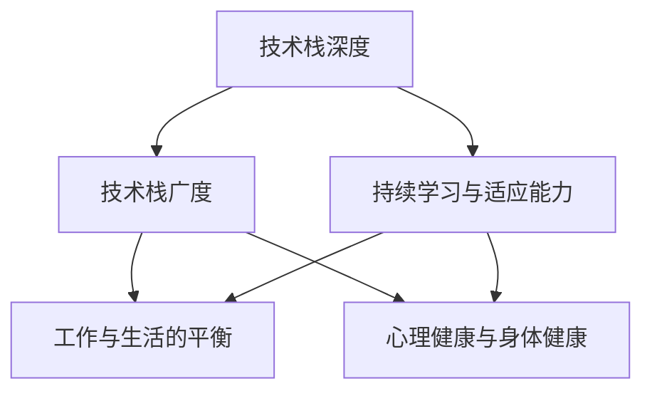

                 

## 1. 背景介绍

### 1.1 问题由来
程序员，这一群体一直以来都被认为是高薪、高智商、高学历的代表。然而，随着时间的流逝，一些中年程序员逐渐发现自己面临着诸多问题，这些问题包括但不限于职业生涯瓶颈、技术更新速度过快、工作与生活失衡、健康问题等。这一现象，常被称作“中年危机”，尤其是在互联网和IT行业尤为突出。

### 1.2 问题核心关键点
中年危机的主要表现包括职业发展的停滞、技术储备的更新不足、以及身心健康的下滑。这些问题不仅对个人职业发展产生重大影响，也可能带来生活质量的下降。因此，如何有效应对这些挑战，成为摆在每位中年程序员面前的重要课题。

### 1.3 问题研究意义
研究和探讨如何应对中年危机，对于提升程序员的职业生涯满意度、维持工作热情、实现持续成长，具有重要意义。本文将从多个角度深入分析这个问题，提出实用的应对策略和建议，帮助程序员顺利渡过职业生涯的这一关键阶段。

## 2. 核心概念与联系

### 2.1 核心概念概述

本文将聚焦于几个与程序员中年危机相关的重要概念：

- 技术栈与技术深度：程序员在职业生涯中的技术积累和专长。
- 技术栈的广度：程序员掌握的各类技术或技术领域。
- 持续学习与适应能力：面对快速变化的技术环境，程序员学习新技术的能力。
- 工作与生活的平衡：程序员在职业生涯中的工作与生活时间的分配。
- 心理健康与身体健康：程序员在职业生涯中的心理和身体健康状态。

这些概念之间存在相互影响的关系，可以通过以下Mermaid流程图来展示：



这个流程图展示了技术栈深度和广度对持续学习与适应能力的影响，以及持续学习与适应能力、技术栈广度和工作生活平衡、心理健康和身体健康之间的相互影响。

## 3. 核心算法原理 & 具体操作步骤

### 3.1 算法原理概述

应对中年危机的核心在于提升技术栈的广度和深度，同时保持持续学习和适应能力，确保工作与生活的平衡，以及保持良好的心理健康和身体健康。

- **技术栈深度**：通过专项技术深化，提升在某项技术或领域的专业性。
- **技术栈广度**：通过多领域技术学习，拓宽技术视野。
- **持续学习与适应能力**：通过不断学习新技术，保持对技术发展的敏感度。
- **工作与生活的平衡**：合理安排工作时间，提高效率，确保有足够时间休息和家庭生活。
- **心理健康与身体健康**：通过适当的运动、饮食和休息，保持良好的身体状态；通过心理咨询和自我调节，保持心理健康。

### 3.2 算法步骤详解

#### 3.2.1 提升技术栈深度
- 选择一个技术栈作为专项深化，如云计算、大数据、人工智能等。
- 阅读相关书籍、论文，参加培训课程，获取认证。
- 参加开源项目，实践专项技术。
- 定期复训，更新知识体系。

#### 3.2.2 拓宽技术栈广度
- 通过项目实践，接触新领域技术，如Web开发、移动开发、数据科学等。
- 参加工作坊、技术会议，了解前沿技术趋势。
- 阅读广泛的技术博客和文章，积累跨领域知识。
- 定期进行技术总结，将所学技术整理成知识体系。

#### 3.2.3 保持持续学习与适应能力
- 每天抽出时间阅读最新的技术文章、博客和书籍。
- 加入技术社区，参与讨论和交流，获取新信息。
- 参加线上线下的技术培训和认证课程，获取新技能。
- 定期自我评估，识别知识盲点，有针对性地进行补充学习。

#### 3.2.4 实现工作与生活的平衡
- 制定明确的工作计划，合理分配任务优先级。
- 使用时间管理工具，如Trello、Notion等，提高工作效率。
- 制定周计划和月计划，确保有足够的休息时间。
- 设立家庭时间，与家人共度美好时光。

#### 3.2.5 保障心理健康与身体健康
- 定期进行心理咨询，解决心理困扰。
- 学习压力管理技巧，如冥想、瑜伽、呼吸练习等。
- 坚持规律的运动，保持身体健康。
- 保证充足的睡眠，保持良好的作息习惯。

### 3.3 算法优缺点

提升技术栈深度与广度的方法，具有以下优点：
- 增加职业竞争力和市场价值。
- 提升个人工作满意度和职业成就感。
- 拓宽技术视野，增强适应性和灵活性。

然而，这些方法也存在以下缺点：
- 时间和精力投入较大，可能导致短期内压力增加。
- 学习成本较高，需投入经济和心理资源。
- 对于技术变化快的领域，知识更新可能不够及时。

尽管如此，这些方法仍是对抗中年危机、实现个人职业发展的重要手段。

### 3.4 算法应用领域

基于提升技术栈深度与广度的算法，可以应用于各种职业发展的情境，特别是在技术迭代快速、行业竞争激烈的IT和互联网领域。以下列举几个具体的应用场景：

- **技术专家进阶**：通过专项深化和广泛学习，逐步成为某个技术领域的专家。
- **项目经理转型**：通过学习项目管理、敏捷开发等知识，实现技术管理者的转型。
- **业务架构师发展**：通过跨领域学习，掌握业务和技术双重知识，提升价值。
- **技术创新者角色**：通过不断学习新技术，引领团队和公司的技术创新。

## 4. 数学模型和公式 & 详细讲解 & 举例说明

### 4.1 数学模型构建

本文涉及的概念和策略，可以通过数学模型来进一步描述和量化。以下是一个简单的数学模型，用于描述持续学习与适应能力的提升：

设 $L(t)$ 为在 $t$ 时刻的知识水平，其中 $t$ 表示时间，可以代表学习的周期或时间点。令 $l_1$ 和 $l_2$ 分别表示新知识的获取效率和学习速度，则知识水平的提升可以表示为：

$$
L(t+1) = L(t) + l_1 \times \text{新知识引入率} + l_2 \times \text{现有知识复用率}
$$

其中 $\text{新知识引入率}$ 和 $\text{现有知识复用率}$ 均依赖于个人的学习策略和时间管理能力。

### 4.2 公式推导过程

根据上述数学模型，我们可以进一步推导出以下公式：

$$
\frac{dL}{dt} = l_1 \times \text{新知识引入率} + l_2 \times \text{现有知识复用率}
$$

这表明知识水平的提升率是由新知识的引入和现有知识的复用共同决定的。为了保持知识水平的持续增长，需要确保新知识的引入率和现有知识的复用率均保持在较高水平。

### 4.3 案例分析与讲解

假设某程序员 $A$ 在 $t=0$ 时的知识水平为 $L_0$，新知识的引入效率为 $l_1=0.2$，现有知识的复用效率为 $l_2=0.3$。在 $t=1$ 时，引入的新知识为 $0.3$，复用的现有知识为 $0.5$。则 $t=1$ 时的知识水平 $L_1$ 计算如下：

$$
L_1 = L_0 + 0.2 \times 0.3 + 0.3 \times 0.5 = L_0 + 0.13
$$

通过数学模型，我们可以看到知识水平随时间的累积增长。

## 5. 项目实践：代码实例和详细解释说明

### 5.1 开发环境搭建

为实现上述策略，我们需要一个良好的开发环境。以下是使用Python进行开发的环境配置流程：

1. 安装Anaconda：从官网下载并安装Anaconda，用于创建独立的Python环境。

2. 创建并激活虚拟环境：
```bash
conda create -n py-env python=3.9 
conda activate py-env
```

3. 安装PyTorch：根据CUDA版本，从官网获取对应的安装命令。例如：
```bash
conda install pytorch torchvision torchaudio cudatoolkit=11.1 -c pytorch -c conda-forge
```

4. 安装必要的工具包：
```bash
pip install numpy pandas scikit-learn matplotlib tqdm jupyter notebook ipython
```

5. 配置Git和GitHub：确保能够访问GitHub存储库，并使用git进行版本控制。

### 5.2 源代码详细实现

以下是一个简化的代码示例，用于记录技术学习进度和项目时间管理：

```python
import time

class Programmer:
    def __init__(self, name, start_time):
        self.name = name
        self.start_time = start_time
        self.learned_technologies = set()
        self.project = {}
        self.timer = time.time()

    def study(self, technology, duration):
        self.learned_technologies.add(technology)
        self.timer = time.time()
        print(f"{self.name} is studying {technology} for {duration} minutes.")

    def project_start(self, project_name, start_time):
        self.project[project_name] = {
            'start_time': start_time,
            'end_time': 0,
            'status': 'in progress',
            'hours': 0
        }

    def project_end(self, project_name, duration):
        project = self.project[project_name]
        project['end_time'] = time.time()
        project['status'] = 'completed'
        project['hours'] = (project['end_time'] - project['start_time']) / 60
        print(f"{self.name} completed {project_name} in {project['hours']} hours.")

    def project_status(self, project_name):
        project = self.project.get(project_name, None)
        if project is None:
            print(f"{self.name} is not working on {project_name}.")
        else:
            status = project['status']
            hours = project['hours']
            print(f"{self.name} is working on {project_name}.")
            if status == 'in progress':
                print(f"Remaining hours: {int((hours - project['end_time'] / 60)}")
            else:
                print(f"Completed {hours} hours ago.")

    def get_learned_technologies(self):
        return self.learned_technologies

    def get_project_status(self):
        return self.project

# 创建程序员实例
p = Programmer("Alice", 1640280000)

# 学习技术
p.study("Python", 30)
p.study("JavaScript", 45)

# 开始项目
p.project_start("Web Development", 1640280000)
p.project_start("Machine Learning", 1640280000)

# 结束项目
p.project_end("Web Development", 60)
p.project_end("Machine Learning", 90)

# 获取学习技术和项目状态
print(p.get_learned_technologies())
print(p.get_project_status())
```

### 5.3 代码解读与分析

这段代码使用了Python语言，包含一个`Programmer`类，用于记录程序员的技术学习和项目管理。

- `__init__`方法：初始化程序员的基本信息，包括名字和开始时间。
- `study`方法：记录程序员学习某种技术，并更新学习时间。
- `project_start`方法：开始一个新的项目。
- `project_end`方法：记录项目结束时间，并更新项目时长。
- `project_status`方法：检查项目状态，并输出剩余时间或已完成时间。
- `get_learned_technologies`方法：获取程序员掌握的技术。
- `get_project_status`方法：获取项目状态。

以上代码实现了对程序员学习进度和项目状态的记录和追踪，有助于更好地管理时间和技术学习。

## 6. 实际应用场景

### 6.1 智能办公系统

智能办公系统可以通过记录和分析程序员的技术学习和项目管理数据，提供个性化的学习推荐和项目建议，帮助程序员提升工作效率和职业满意度。

例如，系统可以记录程序员学习的时间、项目进展情况、技能掌握情况等，通过数据分析和机器学习算法，为程序员推荐新技能学习路径、推荐项目参与机会等。

### 6.2 人力资源管理平台

人力资源管理平台可以通过程序员的技术学习和项目管理数据，评估程序员的职业发展潜力，提供针对性的培训和晋升建议。

系统可以基于程序员的学习记录、项目成绩、技能掌握情况等，生成职业发展报告，为员工提供提升建议和职业规划指导。同时，系统可以自动记录员工的学习和项目进展，跟踪职业发展轨迹。

### 6.3 在线教育平台

在线教育平台可以根据程序员的技术学习需求，提供个性化的课程推荐和培训计划，帮助程序员不断提升自己的技术栈深度和广度。

例如，平台可以根据程序员的技术学习记录，推荐相关课程和书籍，安排在线学习计划，促进程序员持续学习新知识。

### 6.4 未来应用展望

随着技术的进步和应用场景的拓展，基于程序员技术栈深度与广度的应用将会更加广泛。以下列举几个可能的应用领域：

- **技术能力测评**：通过分析程序员的学习记录和项目进展，评估其技术能力，为招聘和晋升提供依据。
- **技术趋势预测**：基于程序员的学习行为和项目参与情况，预测技术发展趋势，为技术选型和投资决策提供参考。
- **技术社区建设**：创建技术社区，鼓励程序员分享学习经验和技术心得，形成知识共享和共同进步的氛围。

## 7. 工具和资源推荐

### 7.1 学习资源推荐

为了帮助程序员系统掌握技术栈深度与广度的提升方法，这里推荐一些优质的学习资源：

1. Coursera、edX等在线教育平台：提供丰富的技术课程和认证，帮助程序员系统学习新技能。
2. GitHub、Stack Overflow等技术社区：交流技术问题，分享技术心得，获取最新技术动态。
3. Udacity、Pluralsight等技术培训平台：提供专项技术培训，帮助程序员提升专业深度和广度。
4. 《深度学习》、《机器学习实战》等书籍：系统学习深度学习、机器学习等技术。
5. Medium、掘金等技术博客平台：阅读最新的技术文章，获取前沿技术信息。

通过对这些资源的学习实践，相信程序员能够系统提升技术栈深度与广度，实现持续成长。

### 7.2 开发工具推荐

为了提升程序员的技术栈深度与广度，以下是几款常用的开发工具：

1. Visual Studio Code：轻量级、功能强大的代码编辑器，支持多语言开发。
2. Jupyter Notebook：交互式开发环境，支持Python、R等多种语言。
3. Git：版本控制系统，便于代码管理和团队协作。
4. Docker：容器化技术，便于构建和管理开发环境。
5. VSCode插件：如GitHub、GitLens等，提高开发效率。

合理利用这些工具，可以显著提升程序员的技术学习和项目管理效率。

### 7.3 相关论文推荐

为了深入理解技术栈深度与广度的提升方法，以下几篇相关论文值得参考：

1. "Deep Learning" by Ian Goodfellow、Yoshua Bengio、Aaron Courville：深度学习领域的经典教材，涵盖深度学习基础和应用。
2. "Hands-On Machine Learning with Scikit-Learn and TensorFlow" by Aurélien Géron：机器学习实战指南，讲解机器学习算法和实践。
3. "Practical Python and Django for Data Science" by Kevin Markham：Python和Django实战教程，帮助程序员掌握技术栈。
4. "The Role of Machine Learning in Hiring and Onboarding Processes: An Empirical Study" by Lim et al.：研究机器学习在招聘和入职过程中的作用，提供数据支持。

这些论文代表了技术栈深度与广度提升的最新研究成果，为程序员提供了理论和实践的指导。

## 8. 总结：未来发展趋势与挑战

### 8.1 总结

本文探讨了如何通过提升技术栈的深度与广度，应对程序员的中年危机，实现持续职业发展。通过系统的学习方法和实用的工具推荐，帮助程序员有效应对职业生涯中的各种挑战。

通过本文的系统梳理，可以看到，技术栈深度与广度的提升是应对中年危机的关键策略。只要合理规划时间，不断学习新技能，保持高效的项目管理和良好的身心健康，程序员就能在职业生涯中实现可持续的发展。

### 8.2 未来发展趋势

展望未来，技术栈深度与广度的提升将成为程序员职业发展的必由之路。以下趋势值得关注：

1. **自动化和人工智能技术的应用**：自动化和AI技术将进一步渗透到技术栈中，提升开发效率和项目质量。
2. **跨领域技术融合**：云计算、大数据、人工智能等技术的融合，将使技术栈更加广泛和深入。
3. **个性化学习推荐系统**：基于数据分析和机器学习，提供个性化的技术学习路径和项目推荐，帮助程序员实现定制化发展。
4. **远程办公和协作工具**：随着远程办公的普及，更加高效的项目管理和协作工具将变得重要。
5. **心理健康和健康管理**：心理健康和健康管理将更多地融入职业发展中，帮助程序员保持良好的身心状态。

这些趋势将进一步推动技术栈深度与广度的提升，为程序员的职业发展提供更广阔的空间。

### 8.3 面临的挑战

尽管技术栈深度与广度的提升具有显著的潜在好处，但在实践中仍面临一些挑战：

1. **时间和精力的投入**：提升技术栈深度与广度需要大量的时间和精力，可能导致短期内压力增加。
2. **学习成本较高**：新技术和工具的引入，需要投入经济和心理资源，可能带来一定的负担。
3. **技术变化快**：技术迭代速度快，需要不断更新知识体系，保持学习动力。
4. **知识体系的构建**：如何系统构建和整合多领域知识，仍是一个挑战。

### 8.4 研究展望

面对这些挑战，未来的研究需要在以下几个方面进行探索：

1. **高效学习方法的开发**：研究如何通过更高效的学习方法，提升知识掌握的速度和质量。
2. **持续学习机制的建立**：建立持续学习机制，确保技术栈深度与广度能随着时间持续提升。
3. **技术栈管理工具的开发**：开发更智能的技术栈管理工具，帮助程序员更好地规划和跟踪学习进度。
4. **技术栈深度与广度的评估方法**：研究如何量化和评估技术栈的深度与广度，为职业发展提供数据支持。

这些研究方向的探索，将有助于解决技术栈提升中的实际问题，为程序员提供更科学、更实用的指导。

## 9. 附录：常见问题与解答

**Q1：如何平衡工作和学习？**

A: 合理规划时间，制定详细的时间表，将学习任务细分为小块，每天抽出固定时间学习。同时，利用碎片时间进行学习，如通勤途中、午休时间等。

**Q2：如何高效学习新技术？**

A: 选择合适的学习资源，如在线课程、书籍、博客等，并制定学习计划。多进行实践练习，通过项目实践巩固知识。加入技术社区，参与讨论和交流，获取反馈。

**Q3：如何选择技术栈方向？**

A: 结合个人兴趣、职业发展目标和行业需求，选择有发展潜力的技术栈方向。可以参考行业发展趋势和公司技术栈需求，选择适合自己的技术。

**Q4：如何保持健康心理状态？**

A: 定期进行心理咨询，解决心理困扰。学习压力管理技巧，如冥想、瑜伽、呼吸练习等。建立良好的生活习惯，确保充足的睡眠和规律的饮食。

**Q5：如何应对技术变化快的问题？**

A: 持续关注行业动态，及时获取新技术信息。参加技术社区和培训课程，保持对新技术的敏感度。不断实践和应用新技术，巩固知识。

通过以上问题的解答，希望能够帮助程序员更好地应对中年危机，实现职业生涯的持续发展。只要科学规划、高效学习，保持健康身心，程序员就能在技术栈深度与广度的提升中，找到新的发展空间和机会。

