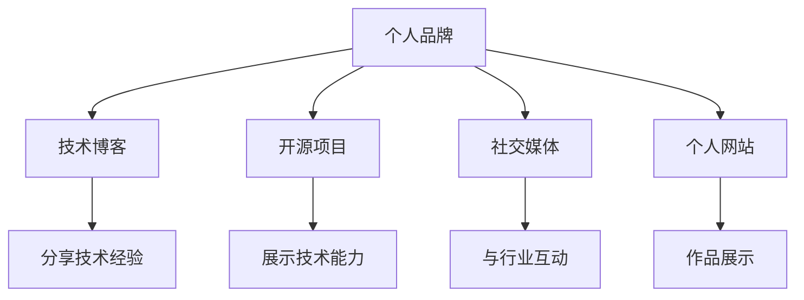

                 

# 程序员如何打造个人品牌IP

> 关键词：程序员, 个人品牌, 技术博客, 开源项目, GitHub, 社交媒体, 个人网站, 个人品牌建设, 技术传播, 技术社区, 开发者关系

## 1. 背景介绍

在当今信息爆炸的时代，个人品牌建设已成为程序员在职业生涯中不可忽视的一部分。无论你是技术新手，还是有经验的资深开发者，一个良好的个人品牌都能让你在职业道路上脱颖而出。良好的个人品牌不仅能让你获得更多的工作机会，还能提升你的知名度和影响力。但如何打造一个成功的个人品牌呢？本文将从技术博客、开源项目、社交媒体等多个角度，为你提供全面的指导。

## 2. 核心概念与联系

### 2.1 核心概念概述

为更好地理解个人品牌IP的构建过程，本节将介绍几个密切相关的核心概念：

- **个人品牌（Personal Branding）**：指个人在职业、技术、社交媒体等各个方面塑造的独特形象和声誉。良好的个人品牌能够吸引更多的关注和机会。

- **技术博客（Technical Blogging）**：程序员通过撰写技术博客，分享技术心得、项目经验、行业趋势等内容，从而建立自己的技术权威和影响力。

- **开源项目（Open Source Projects）**：通过在GitHub等平台上贡献代码，协作开发开源项目，可以展示技术能力，吸引社区关注，扩大影响力。

- **社交媒体（Social Media）**：利用社交平台（如LinkedIn、Twitter、知乎等）传播个人品牌，与行业内其他专业人士交流互动，提升知名度。

- **个人网站（Personal Website）**：一个展示技术能力的在线平台，通过撰写文章、展示项目、分享个人作品集，进一步强化个人品牌。

这些核心概念之间的逻辑关系可以通过以下Mermaid流程图来展示：



这个流程图展示了个体品牌构建的几个关键要素：

1. 通过技术博客分享技术经验，建立技术权威。
2. 开源项目展示技术能力，吸引社区关注。
3. 社交媒体互动提升知名度，扩大影响力。
4. 个人网站作品展示，进一步强化品牌。

这些核心概念共同构成了程序员个人品牌IP的构建框架，有助于你在技术领域建立独特且有力的个人形象。

## 3. 核心算法原理 & 具体操作步骤

### 3.1 算法原理概述

个人品牌IP的构建，本质上是一个持续的自我营销过程。通过技术博客、开源项目、社交媒体等渠道，系统性地传播个人技术知识和见解，建立和维护个人声誉。这一过程包含了以下几个关键步骤：

1. **技术博客的建立**：选择合适的平台，撰写高质量的技术文章，定期更新，吸引读者。
2. **开源项目的贡献**：选择适合自己的开源项目，积极参与代码贡献、项目讨论，提升技术能力。
3. **社交媒体的互动**：利用各大社交平台，分享自己的技术心得、项目进展，与行业内其他专业人士交流。
4. **个人网站的打造**：通过个人网站展示技术作品、项目成果，建立个人的技术作品集。

### 3.2 算法步骤详解

基于上述原理，下面详细介绍每个步骤的具体操作方法：

**Step 1: 选择并建立技术博客**

- 选择合适的博客平台（如Medium、个人网站、CSDN等），注册账号。
- 创建博客空间，设计个性化的博客页面。
- 撰写高质量的入门文章，介绍自己的技术背景和兴趣方向。
- 制定内容更新计划，定期发布原创技术文章。

**Step 2: 选择并贡献开源项目**

- 在GitHub等开源平台上寻找感兴趣的项目，了解项目要求。
- 贡献代码、编写文档、提交问题，积极参与项目讨论。
- 分享项目进展，通过博客或社交媒体进行推广。
- 参与项目审核，提升代码质量，增加社区影响力。

**Step 3: 利用社交媒体传播个人品牌**

- 注册并活跃在LinkedIn、Twitter、知乎等主要社交平台上。
- 分享自己的技术文章、项目进展、个人见解。
- 关注并互动其他行业专业人士，参与讨论，扩大网络。
- 定期更新个人简介，展示最新技术成就。

**Step 4: 建立个人网站**

- 注册并购买个人网站域名和空间，或使用免费的网站建设平台。
- 设计个人网站页面，展示技术作品、项目成果。
- 撰写详细的个人简介，介绍技术经历和专业领域。
- 使用个人网站进行技术分享，展示最新成果。

### 3.3 算法优缺点

个人品牌IP的构建方法具有以下优点：

1. **提升知名度和影响力**：通过技术博客、开源项目、社交媒体的传播，个人品牌能够获得更多的关注和认可。
2. **展示技术能力和经验**：技术博客、开源项目、个人网站等平台，提供了展示技术能力和项目经验的舞台。
3. **促进职业发展**：个人品牌有助于获得更多工作机会，提升职业发展空间。

同时，该方法也存在一些局限性：

1. **时间和精力的投入**：建立和维护个人品牌需要大量的时间和精力，对个人时间管理要求较高。
2. **技能要求**：需要具备较强的技术写作、项目管理和社交互动能力。
3. **市场竞争激烈**：个人品牌建设面临激烈的市场竞争，需要持续创新和优质内容输出。

尽管存在这些局限性，但就目前而言，个人品牌IP的构建方法仍然是最为主流和有效的手段。未来相关研究的重点在于如何进一步提升个人品牌的影响力和竞争力，同时兼顾经济效益和社会价值。

### 3.4 算法应用领域

个人品牌IP的构建方法在软件工程师、数据科学家、AI开发者等技术领域得到了广泛的应用，成为提升个人职业发展的重要手段。例如：

- **软件开发工程师**：通过技术博客分享编程经验，开源项目展示编程能力，社交媒体互动提升知名度。
- **数据科学家**：利用个人网站展示数据分析项目，开源数据集提升影响力，社交媒体互动进行学术交流。
- **AI开发者**：撰写技术文章介绍AI研究成果，开源AI项目吸引同行关注，社交媒体互动展示最新进展。

除了这些技术领域，个人品牌IP的构建方法也在产品管理、设计、运营等非技术领域得到了应用，为这些领域的从业者提供了职业发展的有力工具。

## 4. 数学模型和公式 & 详细讲解 & 举例说明

### 4.1 数学模型构建

本节将使用数学语言对个人品牌IP构建的各步骤进行严格的模型化描述。

设个人品牌IP的构建过程为 $f(x, y)$，其中 $x$ 为投入的个人时间、精力、资源等变量，$y$ 为品牌的知名度、影响力等效果变量。

目标函数为最大化个人品牌影响力 $y$，约束条件为 $x$ 的资源限制，即：

$$
\max_{x} y = f(x)
$$
$$
g(x) \leq 0, \quad \text{其中} \quad g(x) = \text{资源限制函数}
$$

通过建立和优化这一模型，能够更系统地指导个人品牌IP的构建过程，确保在有限的资源下，最大化品牌的价值。

### 4.2 公式推导过程

以技术博客的传播效果为例，假设每位读者的关注度为 $p$，每篇文章的传播次数为 $n$，则技术博客的传播效果 $y$ 可以表示为：

$$
y = \sum_{i=1}^{n} p_i
$$

其中 $p_i$ 为第 $i$ 位读者关注度，可以进一步表示为：

$$
p_i = f(i) = a_i + b_i \log i
$$

其中 $a_i$ 为常数，$b_i$ 为系数，表示读者关注度的函数形式。

将 $p_i$ 代入 $y$ 的公式，得：

$$
y = \sum_{i=1}^{n} (a_i + b_i \log i)
$$

为了最大化 $y$，需要优化 $n$ 的取值。通常情况下，$n$ 与个人投入的时间和精力 $x$ 成正比，即：

$$
n = kx
$$

其中 $k$ 为比例系数，可以通过实际实验确定。

将 $n = kx$ 代入 $y$ 的公式，并使用拉格朗日乘数法求解，得：

$$
\max_{x, \lambda} L(x, \lambda) = y + \lambda (g(x) - 1)
$$

其中 $\lambda$ 为拉格朗日乘数，$g(x) = x - C$ 为资源限制函数，$C$ 为资源总预算。

对 $L(x, \lambda)$ 分别对 $x$ 和 $\lambda$ 求偏导数，得：

$$
\frac{\partial L}{\partial x} = \frac{\partial y}{\partial x} + \lambda \frac{\partial g(x)}{\partial x} = \frac{\partial y}{\partial n} \cdot \frac{\partial n}{\partial x} + \lambda = k\frac{\partial y}{\partial n} + \lambda
$$

$$
\frac{\partial L}{\partial \lambda} = g(x) = x - C
$$

联立方程求解，得到最优的 $x$ 和 $n$ 值。

### 4.3 案例分析与讲解

以GitHub上的开源项目为例，假设你选择一个GitHub上的开源项目，每月固定投入 $x=10$ 个小时进行贡献。项目每月新增 $n$ 次提交，每次提交带来的关注度为 $p=0.5$。

设每月的总预算为 $C=100$ 小时，则资源限制函数为 $g(x) = x - C = 10 - 100 = -90$。

通过公式计算，得到最优的 $n$ 值，使得 $y$ 最大化。通过反复迭代，可以得到 $x=10$ 和 $n=20$ 时，$y$ 达到最大值。

这意味着，每月投入固定的时间进行代码贡献，每次提交能够带来0.5的关注度提升，最终能够最大化个人品牌影响力。

## 5. 项目实践：代码实例和详细解释说明

### 5.1 开发环境搭建

在进行个人品牌IP构建实践前，我们需要准备好开发环境。以下是使用Python进行GitHub项目贡献的环境配置流程：

1. 安装Git：从官网下载并安装Git，用于版本控制和项目管理。
2. 安装GitHub Desktop：从官网下载安装GitHub Desktop，用于管理GitHub账户和项目。
3. 注册GitHub账户：创建GitHub账户，并邀请其他开发者加入项目，进行协作。
4. 克隆项目代码：通过Git Desktop或命令行，克隆GitHub上的项目到本地。
5. 安装Python环境：安装Python和相关依赖库，如Pipenv或Anaconda。
6. 贡献代码：使用Git Desktop或命令行，提交代码到项目仓库。

完成上述步骤后，即可在本地进行开源项目的代码贡献。

### 5.2 源代码详细实现

下面我们以GitHub上的TensorFlow项目为例，给出开源项目贡献的Python代码实现。

首先，创建一个新的Python文件：

```python
import tensorflow as tf

# 加载数据集
(x_train, y_train), (x_test, y_test) = tf.keras.datasets.mnist.load_data()

# 数据预处理
x_train = x_train / 255.0
x_test = x_test / 255.0

# 定义模型
model = tf.keras.models.Sequential([
    tf.keras.layers.Flatten(input_shape=(28, 28)),
    tf.keras.layers.Dense(128, activation='relu'),
    tf.keras.layers.Dropout(0.2),
    tf.keras.layers.Dense(10, activation='softmax')
])

# 编译模型
model.compile(optimizer='adam', loss='sparse_categorical_crossentropy', metrics=['accuracy'])

# 训练模型
model.fit(x_train, y_train, epochs=5, validation_data=(x_test, y_test))

# 评估模型
model.evaluate(x_test, y_test)
```

然后，在GitHub上创建一个新的分支，将代码提交到项目仓库中：

```bash
git checkout -b feature/my-model
git add my_model.py
git commit -m "Add my model implementation"
git push origin feature/my-model
```

完成上述步骤后，即可在GitHub上进行开源项目的代码贡献。

### 5.3 代码解读与分析

让我们再详细解读一下关键代码的实现细节：

**数据加载与预处理**：

```python
# 加载数据集
(x_train, y_train), (x_test, y_test) = tf.keras.datasets.mnist.load_data()

# 数据预处理
x_train = x_train / 255.0
x_test = x_test / 255.0
```

- `tf.keras.datasets.mnist.load_data()`：从TensorFlow库中加载MNIST数据集。
- `x_train = x_train / 255.0`：将训练集和测试集的像素值归一化到[0, 1]。

**模型定义与编译**：

```python
# 定义模型
model = tf.keras.models.Sequential([
    tf.keras.layers.Flatten(input_shape=(28, 28)),
    tf.keras.layers.Dense(128, activation='relu'),
    tf.keras.layers.Dropout(0.2),
    tf.keras.layers.Dense(10, activation='softmax')
])

# 编译模型
model.compile(optimizer='adam', loss='sparse_categorical_crossentropy', metrics=['accuracy'])
```

- `tf.keras.models.Sequential`：创建一个序列模型，由多个层级组成。
- `tf.keras.layers.Flatten`：将二维输入数据展平为一维。
- `tf.keras.layers.Dense`：定义全连接层，激活函数为ReLU。
- `tf.keras.layers.Dropout`：定义Dropout层，减少过拟合。
- `tf.keras.layers.Dense`：定义输出层，激活函数为softmax。
- `model.compile`：编译模型，指定优化器、损失函数和评估指标。

**模型训练与评估**：

```python
# 训练模型
model.fit(x_train, y_train, epochs=5, validation_data=(x_test, y_test))

# 评估模型
model.evaluate(x_test, y_test)
```

- `model.fit`：训练模型，指定训练集、测试集、训练轮数和验证集。
- `model.evaluate`：评估模型，输出测试集的准确率。

通过这些步骤，可以成功地为GitHub上的开源项目贡献代码，提升自己在社区中的影响力和知名度。

## 6. 实际应用场景

### 6.1 软件开发工程师

作为一名软件开发工程师，通过技术博客分享编程经验，开源项目展示编程能力，社交媒体互动提升知名度，可以显著提升个人品牌影响力。例如：

- **技术博客**：撰写编程技巧、框架使用心得、项目经验分享等，通过Medium或CSDN等平台传播。
- **开源项目**：参与开源项目，如TensorFlow、GitHub等，定期发布代码更新，参与讨论。
- **社交媒体**：在LinkedIn、Twitter、知乎等平台上分享技术博客、项目进展，与同行交流。

**案例分析**：
假设你是一名TensorFlow开发者，通过技术博客分享TensorFlow的使用心得，开源TensorFlow的子项目，同时在LinkedIn上关注并互动其他TensorFlow开发者。通过这些举措，你的技术影响力显著提升，获得了更多的职业机会。

### 6.2 数据科学家

作为一名数据科学家，通过个人网站展示数据分析项目，开源数据集提升影响力，社交媒体互动进行学术交流，可以建立强大的个人品牌。例如：

- **个人网站**：搭建个人网站，展示数据分析项目，提供数据分析工具和教程。
- **开源数据集**：在GitHub上开源数据集，提供数据预处理、分析方法和代码示例。
- **社交媒体**：在Twitter、LinkedIn等平台上分享数据分析见解，参与学术讨论。

**案例分析**：
假设你是一名数据科学家，通过个人网站展示自己的数据分析项目，开源了多个数据分析数据集，同时在Twitter上分享数据分析的最新进展。通过这些举措，你的数据科学影响力显著提升，吸引了更多企业和研究机构的关注。

### 6.3 产品管理

作为一名产品管理，通过技术博客分享产品管理经验，开源项目管理工具，社交媒体互动进行产品推广，可以提升个人品牌影响力。例如：

- **技术博客**：撰写产品管理经验分享、项目管理技巧、产品开发流程等，通过个人网站或博客平台传播。
- **开源项目管理工具**：开发并开源项目管理工具，如Gantt图、看板等，提升项目管理效率。
- **社交媒体**：在LinkedIn、Twitter等平台上分享产品管理经验、项目进展，与同行交流。

**案例分析**：
假设你是一名产品管理，通过技术博客分享自己的产品管理经验，开源了多个项目管理工具，同时在LinkedIn上分享项目进展。通过这些举措，你的产品管理影响力显著提升，获得了更多的职业机会。

## 7. 工具和资源推荐

### 7.1 学习资源推荐

为了帮助开发者系统掌握个人品牌IP的构建过程，这里推荐一些优质的学习资源：

1. **《程序员的个人品牌建设》系列博文**：由知名开发者撰写，深入浅出地介绍了个人品牌建设的关键要素和实践技巧。
2. **《GitHub入门与实践》课程**：GitHub官方提供的开源项目管理和协作教程，帮助你熟悉GitHub平台的使用。
3. **《技术博客写作指南》书籍**：详细介绍了如何撰写高质量的技术博客，提升写作技巧和传播效果。
4. **《社交媒体互动技巧》课程**：教授如何在社交媒体上互动，提升个人品牌影响力，扩大人脉网络。
5. **《个人网站设计与优化》课程**：教你如何设计和优化个人网站，提升展示效果和访问量。

通过这些资源的学习实践，相信你一定能够快速掌握个人品牌IP构建的精髓，并在技术领域建立独特的个人形象。

### 7.2 开发工具推荐

高效的开发离不开优秀的工具支持。以下是几款用于个人品牌IP构建开发的常用工具：

1. **GitHub**：开源项目管理和协作平台，提供代码托管、版本控制、协作工具等功能。
2. **Git Desktop**：Git客户端工具，方便进行本地版本控制和项目管理。
3. **CSDN**：国内知名的技术博客平台，提供博客发布、评论互动、广告收益等功能。
4. **知乎**：国内知名的问答社区，提供技术问答、讨论、分享等功能。
5. **LinkedIn**：职业社交平台，提供个人简历、职业发展、人脉互动等功能。

合理利用这些工具，可以显著提升个人品牌IP的构建效率，加快创新迭代的步伐。

### 7.3 相关论文推荐

个人品牌IP的构建方法在学界也得到了广泛的研究，以下是几篇奠基性的相关论文，推荐阅读：

1. **《打造个人品牌：技术专家如何在互联网上建立影响力》（Personal Branding: How Tech Experts Establish Their Online Presence）**：介绍了技术专家如何通过博客、社交媒体等平台建立个人品牌。
2. **《开源项目与个人品牌建设的关系研究》（The Relationship Between Open Source Projects and Personal Branding）**：探讨了开源项目对个人品牌建设的影响，以及如何通过开源项目提升影响力。
3. **《技术博客写作技巧》（Technical Blogging Best Practices）**：提供了撰写技术博客的详细指南，帮助开发者提升写作技巧和传播效果。
4. **《社交媒体互动策略》（Social Media Interaction Strategies）**：教授如何在社交媒体上互动，提升个人品牌影响力，扩大人脉网络。
5. **《个人网站设计与优化》（Designing and Optimizing Personal Websites）**：介绍了如何设计和优化个人网站，提升展示效果和访问量。

这些论文代表了大规模技术传播的理论框架，为个人品牌IP的构建提供了重要的理论支撑。通过学习这些前沿成果，可以帮助研究者把握学科前进方向，激发更多的创新灵感。

## 8. 总结：未来发展趋势与挑战

### 8.1 研究成果总结

本文对个人品牌IP构建的过程进行了全面的介绍。首先阐述了个人品牌建设的重要性，明确了通过技术博客、开源项目、社交媒体等渠道，建立和维护个人品牌形象的关键步骤。其次，从数学模型和公式的角度，详细讲解了如何优化个人品牌建设的资源分配，确保在有限的资源下，最大化品牌的影响力。最后，介绍了技术博客、开源项目、社交媒体等工具和资源，提供了全面的学习、实践和应用指导。

通过本文的系统梳理，可以看到，个人品牌IP的构建方法已经在技术领域得到了广泛应用，为开发者的职业发展和影响力提升提供了有力的工具。未来，伴随技术的不断进步，个人品牌IP构建的方法还将进一步丰富和优化，引领更多技术从业者实现自我价值。

### 8.2 未来发展趋势

展望未来，个人品牌IP的构建方法将呈现以下几个发展趋势：

1. **社交媒体影响力增强**：社交媒体平台将不断优化互动机制，提供更多个性化内容推荐，提升技术传播的效果。
2. **个人品牌价值提升**：随着技术传播的广泛应用，个人品牌将成为技术从业者职业发展的关键资产，带来更高的职业认可度和薪酬水平。
3. **数据驱动的品牌管理**：通过大数据分析，精准定位目标受众，优化个人品牌传播策略，提升传播效果。
4. **个性化内容创作**：利用AI技术，根据用户兴趣和行为，生成个性化内容，提高用户粘性和传播效果。
5. **跨平台品牌传播**：通过多平台整合，提升个人品牌的整体影响力，实现全渠道覆盖。

这些趋势凸显了个人品牌IP构建的广阔前景，必将进一步推动技术传播的发展，提升技术从业者的职业价值和社会影响力。

### 8.3 面临的挑战

尽管个人品牌IP的构建方法已经取得了显著成果，但在迈向更加智能化、普适化应用的过程中，它仍面临着诸多挑战：

1. **时间管理困难**：构建和维护个人品牌需要大量的时间和精力，对个人时间管理要求较高。
2. **内容创作瓶颈**：高质量内容创作需要较高的技术水平和专业知识，缺乏灵感时难以持续输出。
3. **竞争激烈**：技术传播领域竞争激烈，需要不断创新和优质内容输出，才能在市场中脱颖而出。
4. **技术传播效果评估**：缺乏系统的技术传播效果评估机制，难以量化品牌影响力，难以制定精准的传播策略。

尽管存在这些挑战，但就目前而言，个人品牌IP的构建方法仍然是最为主流和有效的手段。未来相关研究的重点在于如何进一步提升个人品牌的影响力和竞争力，同时兼顾经济效益和社会价值。

### 8.4 研究展望

面对个人品牌IP构建所面临的种种挑战，未来的研究需要在以下几个方面寻求新的突破：

1. **自动化内容创作**：引入AI技术，利用生成对抗网络(GAN)、自然语言处理(NLP)等技术，自动生成高质量的技术文章和代码示例。
2. **互动机制优化**：利用大数据和机器学习技术，优化社交媒体平台的互动机制，提升用户粘性和传播效果。
3. **品牌传播效果评估**：引入网络科学、信息传播学等领域的理论，建立系统的技术传播效果评估机制，指导精准传播策略。
4. **多平台品牌传播**：通过多平台整合，实现个人品牌的全渠道覆盖，提升整体影响力。

这些研究方向的探索，必将引领个人品牌IP构建方法迈向更高的台阶，为技术从业者提供更强大的工具，帮助他们在职业道路上获得更多的成功和认可。总之，个人品牌IP构建需要开发者从内容创作、技术传播、互动机制等多个维度协同发力，才能真正实现品牌价值的最大化。

## 9. 附录：常见问题与解答

**Q1：如何选择合适的个人品牌传播平台？**

A: 选择合适的平台需要考虑你的目标受众和传播效果。以下是一些建议：

1. **技术博客**：通过技术博客分享技术心得、项目经验，适合追求深度交流的受众。
2. **GitHub**：开源项目管理和协作平台，适合展示代码贡献、项目进展。
3. **LinkedIn**：职业社交平台，适合展示个人简历、职业发展、人脉互动。
4. **Twitter**：快速传播技术新闻、行业动态，适合实时互动。
5. **知乎**：技术问答社区，适合回答技术问题、分享技术见解。

通过选择合适的平台，可以最大化传播效果，提升个人品牌影响力。

**Q2：如何保持持续的内容输出？**

A: 保持持续的内容输出需要以下策略：

1. **制定内容计划**：制定详细的内容更新计划，定期发布技术文章、项目进展等。
2. **建立内容库**：建立内容库，储备技术博客、开源项目、社交媒体互动的内容素材。
3. **参加技术社区**：积极参加技术社区，获取最新技术资讯和灵感，拓展内容来源。
4. **利用AI技术**：利用生成对抗网络、自然语言处理等技术，自动生成高质量的内容。
5. **灵活调整策略**：根据受众反馈，灵活调整内容创作策略，确保内容贴近受众需求。

通过这些策略，可以持续输出高质量内容，保持个人品牌的影响力。

**Q3：如何利用社交媒体提升个人品牌影响力？**

A: 利用社交媒体提升个人品牌影响力需要以下策略：

1. **定期更新**：定期在LinkedIn、Twitter、知乎等平台上发布技术文章、项目进展，保持活跃。
2. **互动交流**：积极与其他技术从业者互动交流，参与技术讨论、问答等活动。
3. **分享成就**：分享技术成果、职业进展、荣誉奖励等，提升个人品牌认可度。
4. **使用标签**：使用相关标签和关键词，提升内容被发现的概率，吸引更多关注。
5. **跨平台整合**：通过多平台整合，实现个人品牌的全渠道覆盖，提升整体影响力。

通过这些策略，可以提升个人品牌在社交媒体上的影响力，扩大职业发展空间。

**Q4：如何选择适合自己的开源项目进行贡献？**

A: 选择适合自己的开源项目进行贡献需要考虑以下几个因素：

1. **兴趣方向**：选择自己感兴趣的技术领域和项目类型，确保贡献的热情和动力。
2. **技术能力**：选择技术难度适中的项目，既不过于简单，也不过于复杂。
3. **社区活跃度**：选择社区活跃、讨论频繁的项目，能够获得更多的反馈和帮助。
4. **项目贡献机制**：选择开放和透明的贡献机制，确保贡献行为受到认可和回报。
5. **项目影响范围**：选择具有广泛应用前景的项目，提升个人品牌影响力。

通过这些策略，可以更好地选择合适的开源项目，提升技术能力和个人品牌影响力。

---

作者：禅与计算机程序设计艺术 / Zen and the Art of Computer Programming

