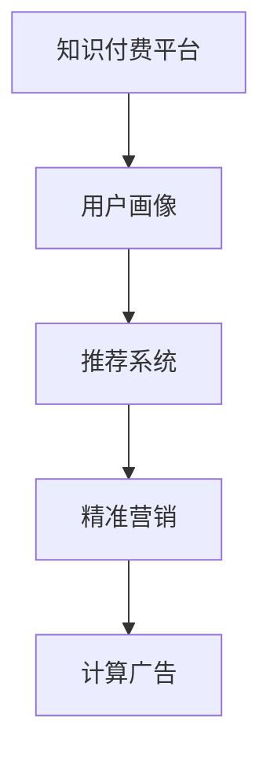

                 

# 程序员如何打造知识付费的精准营销

> 关键词：知识付费,精准营销,数据驱动,用户画像,推荐系统,数据挖掘,机器学习,计算广告

## 1. 背景介绍

在互联网高速发展的今天，知识付费逐渐成为一种新的趋势，尤其在教育、科技、文化等领域，用户愿意为高质量的内容付费。然而，尽管市场规模不断扩大，知识付费的留存率和转化率依然低迷，用户体验不够理想。如何提升知识付费平台的用户黏性和商业价值，成为亟待解决的问题。精准营销正是解决这个问题的利器，通过数据分析和算法模型，实现内容的精准推荐和个性化呈现，极大提升用户满意度和平台收益。

本文将从技术视角，深入剖析知识付费平台精准营销的实现原理和操作步骤，并结合具体案例，阐述如何通过数据驱动和算法优化，打造一个高效、可控、用户满意的知识付费生态。

## 2. 核心概念与联系

### 2.1 核心概念概述

精准营销的核心概念包括：

- **知识付费（Knowledge Paid）**：用户为获取有价值的信息、技能或知识支付费用的模式，形式包括付费订阅、单次购买、按需问答等。

- **精准营销（Precision Marketing）**：通过大数据和算法，对目标用户进行深度分析，实现内容精准推送和个性化推荐，提升用户满意度和转化率。

- **用户画像（User Persona）**：基于用户行为、偏好、属性等数据，构建出立体化的用户画像，帮助平台深入理解用户需求，提供更优质的服务。

- **推荐系统（Recommendation System）**：通过分析和挖掘用户数据，实现内容推荐，以个性化推荐提高用户粘性和转化率。

- **计算广告（Computational Advertising）**：利用算法进行广告投放，优化广告效果，降低成本，提升广告ROI。

### 2.2 核心概念原理和架构的 Mermaid 流程图



这个流程图展示了知识付费平台精准营销的核心流程：

1. **用户画像构建**：通过数据分析挖掘用户的属性、行为、兴趣等信息，生成立体化的用户画像。
2. **内容推荐**：根据用户画像，构建推荐模型，实现内容的个性化推荐。
3. **精准营销**：结合用户行为数据，设计个性化营销活动，提升用户留存和转化率。
4. **计算广告**：利用算法优化广告投放，实现高效、低成本的广告投放。

这些概念之间的逻辑关系如下：

1. **知识付费平台**：提供知识内容、交易平台、支付体系等，是精准营销和计算广告的载体。
2. **用户画像**：构建精准用户画像，为推荐系统和营销活动提供数据支撑。
3. **推荐系统**：通过用户画像进行内容推荐，提升用户体验。
4. **精准营销**：基于用户画像和推荐系统，设计个性化营销策略，提高用户转化率。
5. **计算广告**：利用算法优化广告投放，降低广告成本，提升广告ROI。

## 3. 核心算法原理 & 具体操作步骤

### 3.1 算法原理概述

知识付费平台的精准营销，主要依赖于数据驱动和算法模型，通过以下步骤实现：

1. **用户画像构建**：通过对用户行为数据、历史交易数据、反馈数据等进行统计分析，构建用户画像。
2. **推荐系统构建**：设计推荐算法模型，如协同过滤、基于内容的推荐、深度学习推荐等，实现内容的个性化推荐。
3. **精准营销设计**：基于用户画像和推荐结果，设计个性化营销活动，如内容推送、优惠活动、社群互动等。
4. **计算广告优化**：利用算法优化广告投放，提升广告效果和投放效率。

这些步骤涉及的算法模型和技术框架，将在接下来进行详细介绍。

### 3.2 算法步骤详解

#### 3.2.1 用户画像构建

**步骤1: 数据收集**
- 收集用户在平台上的行为数据，如浏览记录、购买记录、评价反馈等。
- 收集用户的基本属性数据，如年龄、性别、职业、教育程度等。

**步骤2: 数据清洗**
- 处理缺失值、异常值，确保数据质量和一致性。
- 对数据进行归一化、标准化处理，避免不同量级数据之间的偏差。

**步骤3: 特征工程**
- 提取有意义的特征，如兴趣标签、行为序列、交易时间等。
- 设计特征组合方式，通过特征工程构建更丰富的用户特征。

**步骤4: 建模与预测**
- 选择合适的模型，如K-Means聚类、PCA降维、LDA主题模型等，生成用户画像。
- 使用监督学习算法，如随机森林、GBDT等，对用户画像进行预测和分类。

#### 3.2.2 推荐系统构建

**步骤1: 数据准备**
- 准备内容数据，包括课程名称、描述、时长、用户评分等。
- 准备用户数据，包括用户画像、历史行为等。

**步骤2: 模型选择与训练**
- 选择推荐算法模型，如协同过滤、基于内容的推荐、深度学习推荐等。
- 使用数据训练模型，调整超参数，优化模型性能。

**步骤3: 模型评估**
- 使用A/B测试、离线评估、在线指标等方法，评估推荐系统的效果。
- 根据评估结果，调整模型参数，提升推荐效果。

#### 3.2.3 精准营销设计

**步骤1: 营销目标设定**
- 明确营销目标，如提升用户留存率、增加订阅用户数量、提升转化率等。
- 设定营销指标，如点击率、转化率、用户活跃度等。

**步骤2: 用户分群**
- 基于用户画像，将用户分为不同群体，如新用户、活跃用户、流失用户等。
- 设计针对性的营销策略，针对不同群体设计不同的营销活动。

**步骤3: 活动设计**
- 设计个性化营销活动，如优惠券、积分奖励、内容推送等。
- 结合推荐系统，实现活动的个性化推送。

#### 3.2.4 计算广告优化

**步骤1: 广告投放准备**
- 收集用户数据，包括浏览记录、搜索行为、点击记录等。
- 准备广告数据，如广告位、广告内容、预算等。

**步骤2: 模型选择与训练**
- 选择广告投放算法模型，如线性回归、逻辑回归、深度学习模型等。
- 使用数据训练模型，调整超参数，优化广告效果。

**步骤3: 广告投放**
- 结合广告投放策略，进行广告投放。
- 实时监控广告效果，优化投放参数。

### 3.3 算法优缺点

**优点：**

- **个性化推荐**：通过数据驱动和算法优化，实现内容的精准推荐，提升用户体验。
- **高转化率**：个性化营销活动可以提升用户满意度和转化率，提高平台收益。
- **可控性**：通过数据模型，可以精准控制营销活动效果，降低成本。
- **自动化**：算法自动化优化推荐系统，提升推荐效率和质量。

**缺点：**

- **数据依赖性强**：依赖于高质量、多样化的数据，数据获取难度大。
- **算法复杂度高**：构建推荐系统和营销模型需要复杂的算法和模型训练，技术门槛高。
- **隐私问题**：用户画像和推荐系统涉及大量用户隐私数据，需要严格的数据保护和隐私合规。
- **动态变化快**：用户行为和市场环境变化快，需要快速调整模型和策略。

### 3.4 算法应用领域

精准营销技术可以应用于知识付费平台之外，还涵盖诸多领域，例如：

- **电商平台**：通过用户画像和推荐系统，实现商品推荐和个性化营销。
- **社交媒体**：利用算法优化广告投放，提升广告效果和用户体验。
- **金融行业**：利用推荐系统为用户推荐理财产品，提高用户粘性和转化率。
- **新闻媒体**：通过个性化推荐，提升用户粘性和阅读体验。
- **在线教育**：基于用户画像和行为数据，实现课程推荐和个性化学习路径设计。

这些应用领域展示了精准营销的强大适用性，为各行业带来了显著的商业价值提升。

## 4. 数学模型和公式 & 详细讲解 & 举例说明

### 4.1 数学模型构建

**用户画像建模**：

假设用户画像由$m$个特征组成，每个特征$x_i$可表示为数值型数据。用户画像模型$f(x)$为线性模型，公式如下：

$$
f(x) = w_1x_1 + w_2x_2 + \cdots + w_mx_m
$$

其中，$w_i$为特征权重。

**推荐系统建模**：

协同过滤模型是常用的推荐算法，公式如下：

$$
R(u,i) = \sum_{j \in N_u} \alpha_{ij} p_{uj}
$$

其中，$R(u,i)$为用户$u$对物品$i$的预测评分，$N_u$为与用户$u$相似的其他用户集合，$\alpha_{ij}$为相似度系数，$p_{uj}$为用户$u$对物品$j$的评分。

**精准营销建模**：

假设平台有$k$个营销活动，每个活动$i$可表示为$(a_i,b_i,c_i)$，其中$a_i$为用户画像特征，$b_i$为营销策略，$c_i$为活动效果。精准营销模型为线性回归模型，公式如下：

$$
y = \sum_{i=1}^k \beta_i a_i + \epsilon
$$

其中，$y$为用户行为指标，$\beta_i$为活动$i$的系数，$\epsilon$为随机噪声。

**计算广告建模**：

假设平台有$n$个广告位，每个广告位$j$可表示为$(o_j,p_j)$，其中$o_j$为广告内容，$p_j$为广告位参数。计算广告模型为线性回归模型，公式如下：

$$
C_j = \sum_{k=1}^n \alpha_{kj} a_k + \beta_j
$$

其中，$C_j$为广告位$j$的点击率，$\alpha_{kj}$为广告$k$在广告位$j$的系数，$\beta_j$为广告位$j$的截距。

### 4.2 公式推导过程

**用户画像模型推导**：

假设用户画像模型$f(x)$为线性模型，数据集为$(x_i,y_i)$。

$$
\begin{aligned}
\min_{w} & \frac{1}{2} \sum_{i=1}^m (y_i - f(x_i))^2 \\
\text{s.t.} & f(x) = w_1x_1 + w_2x_2 + \cdots + w_mx_m
\end{aligned}
$$

根据最小二乘法，求解最优解$w$：

$$
w = \left( \sum_{i=1}^m x_i x_i^T \right)^{-1} \sum_{i=1}^m x_i y_i
$$

**推荐系统协同过滤模型推导**：

假设数据集为$(u_i,i_j,r_{ui})$，其中$u_i$为用户$i$的评分数据，$i_j$为物品$j$的评分数据，$r_{ui}$为用户$i$对物品$j$的评分。

$$
\min_{\alpha,p} \frac{1}{2} \sum_{i=1}^N \sum_{j=1}^M (r_{ui} - \sum_{k=1}^N \alpha_{ik} p_{kj})^2
$$

根据最小二乘法，求解最优解$\alpha_{ik},p_{kj}$：

$$
\begin{aligned}
\alpha_{ik} &= \frac{y_{ui} - \sum_{j \neq k} \alpha_{ik} p_{kj}}{p_{ii}} \\
p_{kj} &= \frac{1}{\sqrt{1 + \sum_{i=1}^N \alpha_{ik}^2}}
\end{aligned}
$$

**精准营销线性回归模型推导**：

假设数据集为$(u_i,y_i)$，其中$u_i$为特征向量，$y_i$为用户行为指标。

$$
\min_{\beta} \frac{1}{2} \sum_{i=1}^N (y_i - \sum_{j=1}^k \beta_j a_{ij})^2
$$

根据最小二乘法，求解最优解$\beta_j$：

$$
\beta_j = \frac{\sum_{i=1}^N (y_i - \sum_{j=1}^{j-1} \beta_j a_{ij}) a_{ij}}{\sum_{i=1}^N a_{ij}^2}
$$

**计算广告线性回归模型推导**：

假设数据集为$(j,y_j)$，其中$j$为广告位，$y_j$为点击率。

$$
\min_{\alpha,\beta} \frac{1}{2} \sum_{i=1}^n (y_i - \sum_{k=1}^n \alpha_{kj} a_{kj})^2
$$

根据最小二乘法，求解最优解$\alpha_{kj},\beta_j$：

$$
\begin{aligned}
\alpha_{kj} &= \frac{y_j - \sum_{i=1}^n \alpha_{ik} a_{ik}}{a_{ij}} \\
\beta_j &= \frac{1}{\sqrt{1 + \sum_{i=1}^n \alpha_{ik}^2}}
\end{aligned}
$$

### 4.3 案例分析与讲解

**案例1：某在线教育平台的精准营销**

某在线教育平台收集了用户的浏览记录、购买记录、评价反馈等数据，构建了用户画像。通过协同过滤推荐算法，实现了个性化课程推荐。同时，设计了个性化营销活动，如优惠券、积分奖励等，提高了用户留存和转化率。平台通过计算广告优化，提升了广告效果和ROI。

**案例2：某金融机构的精准营销**

某金融机构收集了用户的交易记录、理财偏好、交易时间等数据，构建了用户画像。通过推荐系统为用户推荐理财产品，提高用户粘性和转化率。同时，设计了个性化营销活动，如专享理财提示、专属活动等，提升了用户满意度和平台收益。平台通过计算广告优化，降低了广告成本，提升了广告效果。

## 5. 项目实践：代码实例和详细解释说明

### 5.1 开发环境搭建

在进行精准营销实践前，我们需要准备好开发环境。以下是使用Python进行PyTorch开发的环境配置流程：

1. 安装Anaconda：从官网下载并安装Anaconda，用于创建独立的Python环境。

2. 创建并激活虚拟环境：
```bash
conda create -n pytorch-env python=3.8 
conda activate pytorch-env
```

3. 安装PyTorch：根据CUDA版本，从官网获取对应的安装命令。例如：
```bash
conda install pytorch torchvision torchaudio cudatoolkit=11.1 -c pytorch -c conda-forge
```

4. 安装相关库：
```bash
pip install pandas numpy scikit-learn transformers
```

5. 安装数据可视化库：
```bash
pip install matplotlib seaborn
```

完成上述步骤后，即可在`pytorch-env`环境中开始项目开发。

### 5.2 源代码详细实现

这里我们以推荐系统为例，使用PyTorch实现协同过滤推荐算法。

首先，定义数据类和推荐类：

```python
from torch.utils.data import Dataset
import torch
import numpy as np
import pandas as pd

class UserItemData(Dataset):
    def __init__(self, user_item_matrix):
        self.user_item_matrix = user_item_matrix
        self.user_ids = np.unique(user_item_matrix.index.values)
        self.item_ids = np.unique(user_item_matrix.columns.values)

    def __len__(self):
        return len(self.user_item_matrix)

    def __getitem__(self, idx):
        user_id = self.user_item_matrix.index.values[idx]
        item_id = self.user_item_matrix.columns.values[idx]
        rating = self.user_item_matrix.loc[user_id, item_id]
        return torch.tensor([user_id, item_id, rating])

class RecommendationSystem:
    def __init__(self, model, train_data, test_data, num_factors=10):
        self.model = model
        self.train_data = train_data
        self.test_data = test_data
        self.num_factors = num_factors
        self.factors = torch.randn(self.num_factors)

    def fit(self):
        for epoch in range(10):
            optimizer = torch.optim.Adam(self.factors, lr=0.01)
            for user_id, item_id, rating in self.train_data:
                pred = torch.dot(self.factors, torch.tensor(np.where(item_id == self.item_ids, 1, 0)))
                loss = ((pred - rating)**2).sum()
                optimizer.zero_grad()
                loss.backward()
                optimizer.step()

    def predict(self, user_id, item_id):
        pred = torch.dot(self.factors, torch.tensor(np.where(item_id == self.item_ids, 1, 0)))
        return pred.item()
```

然后，定义训练和测试函数：

```python
def train_recommendation_system(train_data, test_data, num_factors=10):
    model = RecommendationSystem(torch.nn.Linear(10, 1), train_data, test_data, num_factors=num_factors)
    model.fit()
    return model

def test_recommendation_system(model, test_data):
    results = []
    for user_id, item_id, rating in test_data:
        pred = model.predict(user_id, item_id)
        results.append(pred)
    return results
```

最后，进行模型训练和测试：

```python
# 准备数据
user_item_matrix = pd.read_csv('user_item_matrix.csv')
train_data = UserItemData(user_item_matrix)
test_data = UserItemData(user_item_matrix)

# 训练模型
model = train_recommendation_system(train_data, test_data)

# 测试模型
test_results = test_recommendation_system(model, test_data)
print(test_results)
```

以上就是使用PyTorch实现协同过滤推荐算法的代码实现。可以看到，通过定义数据类和推荐类，利用PyTorch的自动微分和优化器功能，可以高效地实现推荐系统。

### 5.3 代码解读与分析

让我们再详细解读一下关键代码的实现细节：

**UserItemData类**：
- `__init__`方法：初始化用户、物品和评分数据，进行去重操作。
- `__len__`方法：返回数据集的样本数量。
- `__getitem__`方法：对单个样本进行处理，返回用户ID、物品ID和评分。

**RecommendationSystem类**：
- `__init__`方法：初始化推荐模型、训练数据、测试数据和因子数量。
- `fit`方法：训练模型，最小化预测评分与实际评分之间的平方误差。
- `predict`方法：预测用户对物品的评分。

**训练函数train_recommendation_system**：
- 定义推荐系统模型，进行模型训练。

**测试函数test_recommendation_system**：
- 使用训练好的模型进行预测，并返回预测结果。

这些关键代码展示了协同过滤推荐算法的核心实现，包括数据准备、模型训练和预测输出等环节。通过这些代码，开发者可以灵活地调整参数，优化推荐效果。

## 6. 实际应用场景

### 6.1 电商平台的个性化推荐

电商平台通过协同过滤推荐算法，可以为用户推荐其可能感兴趣的商品，提升用户购买率。具体而言，电商平台收集用户的浏览记录、购买记录、评价反馈等数据，构建用户画像。通过协同过滤推荐算法，实现个性化商品推荐。

**案例分析**：某电商网站收集了用户的浏览记录和购买记录，构建了用户画像。通过协同过滤推荐算法，为用户推荐了其可能感兴趣的商品，提高了用户购买率。同时，设计了个性化营销活动，如优惠券、积分奖励等，进一步提升了用户留存和转化率。

### 6.2 在线教育的个性化课程推荐

在线教育平台通过协同过滤推荐算法，为用户推荐适合其学习水平和兴趣的课程，提升用户学习体验。具体而言，在线教育平台收集用户的课程浏览记录、购买记录、评价反馈等数据，构建用户画像。通过协同过滤推荐算法，实现个性化课程推荐。

**案例分析**：某在线教育平台收集了用户的课程浏览记录和购买记录，构建了用户画像。通过协同过滤推荐算法，为用户推荐了其可能感兴趣的课程，提高了用户学习体验。同时，设计了个性化营销活动，如课程优惠券、专属活动等，提升了用户满意度和平台收益。

### 6.3 金融行业的个性化理财产品推荐

金融行业通过推荐系统，为个人客户推荐合适的理财产品，提升客户粘性和转化率。具体而言，金融平台收集客户的交易记录、理财偏好、交易时间等数据，构建用户画像。通过推荐系统，为用户推荐适合的理财产品。

**案例分析**：某金融平台收集了客户的交易记录和理财偏好数据，构建了用户画像。通过推荐系统，为用户推荐了适合的理财产品，提高了客户粘性和转化率。同时，设计了个性化营销活动，如专享理财提示、专属活动等，提升了客户满意度和平台收益。

### 6.4 未来应用展望

随着数据获取和算法优化技术的不断进步，精准营销将更加智能化、高效化和个性化。未来可能的应用场景包括：

- **情感分析**：通过情感分析技术，了解用户对推荐内容的情感反馈，实时调整推荐策略。
- **跨领域推荐**：将不同领域的数据进行融合，实现跨领域推荐，提升推荐多样性。
- **深度学习推荐**：结合深度学习技术，提升推荐模型的精度和泛化能力。
- **个性化广告**：通过推荐系统，实现个性化广告投放，提升广告效果和ROI。
- **社交网络**：结合社交网络数据，提升推荐系统的准确性和个性化。

这些应用场景展示了精准营销的强大潜力和未来发展方向，将为各行业带来显著的商业价值提升。

## 7. 工具和资源推荐

### 7.1 学习资源推荐

为了帮助开发者系统掌握精准营销的理论基础和实践技巧，这里推荐一些优质的学习资源：

1. 《推荐系统实战》：清华大学出版社出版的推荐系统经典教材，深入浅出地介绍了推荐系统的基本原理和实现技术。

2. 《数据驱动营销》：某知名营销公司出版的实战指南，详细讲解了数据驱动营销的策略和工具。

3. 《深度学习与推荐系统》：某在线教育平台推出的课程，涵盖了推荐系统的基本算法和深度学习优化技术。

4. 《用户画像与个性化推荐》：某知名科技公司出版的技术白皮书，详细介绍了用户画像的构建方法和推荐算法的优化技术。

5. 《计算广告优化》：某著名广告公司出版的技术白皮书，详细讲解了计算广告的优化策略和实现技术。

通过对这些资源的学习实践，相信你一定能够快速掌握精准营销的精髓，并用于解决实际的商业问题。

### 7.2 开发工具推荐

高效的开发离不开优秀的工具支持。以下是几款用于精准营销开发的常用工具：

1. PyTorch：基于Python的开源深度学习框架，灵活动态的计算图，适合快速迭代研究。大部分推荐系统算法都有PyTorch版本的实现。

2. TensorFlow：由Google主导开发的开源深度学习框架，生产部署方便，适合大规模工程应用。同样有丰富的推荐系统算法资源。

3. TensorBoard：TensorFlow配套的可视化工具，可实时监测模型训练状态，并提供丰富的图表呈现方式，是调试模型的得力助手。

4. Weights & Biases：模型训练的实验跟踪工具，可以记录和可视化模型训练过程中的各项指标，方便对比和调优。与主流深度学习框架无缝集成。

5. Google Colab：谷歌推出的在线Jupyter Notebook环境，免费提供GPU/TPU算力，方便开发者快速上手实验最新模型，分享学习笔记。

合理利用这些工具，可以显著提升精准营销任务的开发效率，加快创新迭代的步伐。

### 7.3 相关论文推荐

精准营销技术的发展源于学界的持续研究。以下是几篇奠基性的相关论文，推荐阅读：

1. "Collaborative Filtering for Implicit Feedback Datasets"：推荐系统领域的经典论文，介绍了协同过滤算法的原理和实现方法。

2. "Item-based Collaborative Filtering Recommendation Algorithms"：详细介绍了协同过滤算法的实现，包括用户物品矩阵的构建和推荐算法的设计。

3. "Deep Learning Recommendation Systems: A Survey and Tutorial"：综述了深度学习推荐系统的最新进展，详细讲解了深度学习推荐算法的原理和应用。

4. "Personalized Information Access: The Case of a Recommendation System"：介绍了推荐系统的基本原理和实现方法，涵盖协同过滤、基于内容的推荐、深度学习推荐等。

5. "Adaptive Computation of Aggregate Information: The Knowledge Base Approach to Information Retrieval"：讲解了知识图谱在推荐系统中的应用，为推荐系统的深度学习提供了知识融合的思路。

这些论文代表了大语言模型微调技术的发展脉络。通过学习这些前沿成果，可以帮助研究者把握学科前进方向，激发更多的创新灵感。

## 8. 总结：未来发展趋势与挑战

### 8.1 研究成果总结

本文从技术视角，详细剖析了知识付费平台的精准营销实现原理和操作步骤。通过数据驱动和算法模型，实现了内容的精准推荐和个性化营销。本文还结合具体案例，阐述了精准营销在电商、教育、金融等多个领域的应用，展示了精准营销的强大潜力和未来发展方向。

通过本文的系统梳理，可以看到，精准营销技术正在成为知识付费平台的重要支撑，极大地提升了用户体验和平台收益。未来，伴随数据获取和算法优化技术的不断进步，精准营销将更加智能化、高效化和个性化。相信精准营销技术必将在各行业领域广泛应用，带来显著的商业价值提升。

### 8.2 未来发展趋势

展望未来，精准营销技术将呈现以下几个发展趋势：

1. **智能化推荐**：结合深度学习技术，提升推荐模型的精度和泛化能力。

2. **个性化广告**：通过推荐系统，实现个性化广告投放，提升广告效果和ROI。

3. **实时推荐**：结合实时数据，实现动态推荐，提升用户体验和平台收益。

4. **跨领域推荐**：将不同领域的数据进行融合，实现跨领域推荐，提升推荐多样性。

5. **多模态推荐**：结合视觉、语音、文本等多种数据，提升推荐系统的准确性和个性化。

6. **情感分析**：通过情感分析技术，了解用户对推荐内容的情感反馈，实时调整推荐策略。

这些趋势凸显了精准营销技术的强大潜力和未来发展方向，为各行业带来了显著的商业价值提升。

### 8.3 面临的挑战

尽管精准营销技术已经取得了瞩目成就，但在迈向更加智能化、高效化、个性化应用的过程中，它仍面临着诸多挑战：

1. **数据质量问题**：推荐系统依赖高质量的数据，数据获取和清洗成本高，且数据质量难以保证。

2. **模型复杂度高**：推荐系统模型复杂度高，训练和优化难度大，需要高效并行计算和优化算法。

3. **用户隐私保护**：推荐系统涉及大量用户隐私数据，需要严格的数据保护和隐私合规。

4. **动态变化快**：用户行为和市场环境变化快，需要快速调整模型和策略。

5. **模型可解释性**：推荐系统模型的复杂性和黑箱性质，使其难以解释，用户缺乏信任感。

6. **跨领域推荐**：不同领域的用户需求差异大，需要多领域数据融合，提升推荐多样性。

这些挑战凸显了精准营销技术的复杂性和实现难度，需要从数据、算法、工程、隐私等多个维度进行协同优化，才能充分发挥精准营销的潜力。

### 8.4 研究展望

面对精准营销面临的种种挑战，未来的研究需要在以下几个方面寻求新的突破：

1. **高效数据获取和清洗**：开发高效的数据获取和清洗工具，提升数据质量和获取效率。

2. **高效并行计算和优化算法**：开发高效并行计算和优化算法，提升模型训练和优化效率。

3. **数据隐私保护和合规**：开发隐私保护和合规工具，确保用户隐私数据的安全。

4. **实时动态推荐**：开发实时动态推荐系统，提升用户体验和平台收益。

5. **模型可解释性和透明度**：开发可解释性高的推荐系统模型，提升用户信任感。

6. **跨领域数据融合**：开发多领域数据融合技术，提升推荐多样性。

这些研究方向将引领精准营销技术迈向更高的台阶，为各行业带来显著的商业价值提升。相信精准营销技术必将不断优化，广泛应用于各领域，推动智能化的持续发展。

## 9. 附录：常见问题与解答

**Q1：精准营销的核心技术有哪些？**

A: 精准营销的核心技术包括用户画像构建、推荐系统设计、精准营销策略、计算广告优化等。通过这些技术，可以实现内容的精准推荐和个性化营销，提升用户满意度和平台收益。

**Q2：推荐系统常用的算法有哪些？**

A: 推荐系统常用的算法包括协同过滤、基于内容的推荐、深度学习推荐、混合推荐等。协同过滤算法是最经典的推荐算法，基于内容的推荐关注物品的属性特征，深度学习推荐利用深度神经网络提升推荐效果，混合推荐则综合多种算法，提升推荐效果。

**Q3：如何优化推荐系统的计算效率？**

A: 优化推荐系统的计算效率，可以从以下几个方面入手：
1. 模型压缩：减少模型参数，降低计算量。
2. 模型并行：采用分布式训练，提升计算效率。
3. 矩阵分解：通过矩阵分解技术，降低存储和计算成本。
4. 向量量化：通过向量量化技术，降低存储和计算成本。

**Q4：如何提升推荐系统的准确性？**

A: 提升推荐系统的准确性，可以从以下几个方面入手：
1. 数据质量：保证数据的质量和完整性，提升推荐效果。
2. 特征工程：设计有意义的特征，提升推荐模型的泛化能力。
3. 模型优化：优化推荐模型的超参数和模型结构，提升推荐效果。
4. 多模型融合：结合多种推荐模型，提升推荐效果。

**Q5：如何提升推荐系统的实时性？**

A: 提升推荐系统的实时性，可以从以下几个方面入手：
1. 实时数据获取：实时获取用户行为数据，提升推荐实时性。
2. 实时模型更新：实时更新推荐模型，提升推荐准确性。
3. 分布式计算：采用分布式计算，提升推荐系统处理能力。

通过这些方法的不断优化和调整，推荐系统将变得更加智能化、高效化和个性化，为用户提供更好的服务体验。

---

作者：禅与计算机程序设计艺术 / Zen and the Art of Computer Programming

