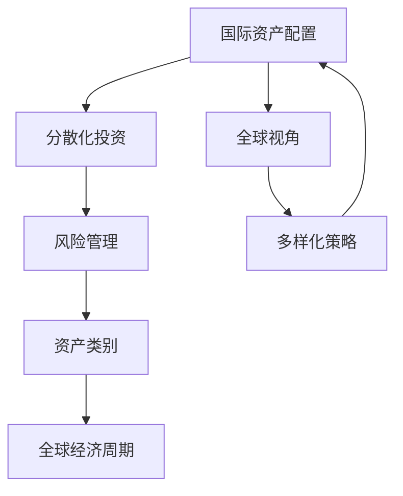

                 

## 1. 背景介绍

在当今全球化经济背景下，国际资产配置（International Asset Allocation）对于跨国公司的财务健康和长远发展具有重要意义。特别是对于软件工程师和IT开发者而言，了解国际资产配置的重要性不容小觑。本文将从背景、意义、现状、风险与机遇等多个维度深入探讨程序员如何开展国际资产配置。

## 2. 核心概念与联系

### 2.1 核心概念概述

**国际资产配置（International Asset Allocation）**：是指在全球不同的国家和地区，根据不同资产的风险与收益特性，合理分配资本的一种策略。这一概念包括两个基本要素：全球视角和资产多样化。

**分散化投资（Diversification）**：通过在不同资产类别和市场之间分散投资，来降低整个投资组合的风险。这是国际资产配置中最为核心的一部分。

**风险管理（Risk Management）**：在配置资产时，通过控制风险来保护投资者不受市场波动的不利影响。这包括选择合适的资产类别、风险敞口控制、定期评估和调整配置策略等。

**资产类别（Asset Classes）**：包括股票、债券、现金、不动产、商品等不同类型的资产。不同的资产类别具有不同的风险和收益特性，是国际资产配置中重要的工具。

**全球经济周期（Global Economic Cycles）**：不同国家和地区由于政治、经济、文化等方面的差异，其经济周期表现不同，这也是国际资产配置必须考虑的重要因素。

### 2.2 核心概念原理和架构的 Mermaid 流程图



## 3. 核心算法原理 & 具体操作步骤

### 3.1 算法原理概述

国际资产配置的算法原理基于现代投资组合理论（Modern Portfolio Theory, MPT）。MPT由诺贝尔经济学奖得主哈里·马柯威茨（Harry Markowitz）提出，核心思想是利用资产之间的关联性，通过构建优化组合，最大化投资回报并最小化风险。

MPT的核心公式为：

$$
\begin{aligned}
    &\min_{w} \frac{1}{2} w^T\Sigma w \\
    &\text{subject to} \quad w^T \mu = r \\
    &\quad w^T1 = 1 \\
    &\quad w \geq 0
\end{aligned}
$$

其中，$w$ 是资产权重，$\Sigma$ 是协方差矩阵，$\mu$ 是资产预期收益率，$r$ 是目标收益率。

这个公式描述了资产配置的优化问题，即在目标收益率$r$下，最小化组合风险$\Sigma w$。通过求解该优化问题，可以得到各个资产的权重分配。

### 3.2 算法步骤详解

**Step 1: 资产评估与选择**

- 收集并评估全球范围内的资产数据。资产数据包括股票、债券、不动产、商品等。
- 计算每个资产的预期收益率、波动率和相关系数等特征。

**Step 2: 构建投资组合**

- 使用现代投资组合理论的优化算法（如Markowitz模型），基于风险最小化或最大化收益的目标构建投资组合。
- 通过调整各个资产的权重，找到最优的投资组合。

**Step 3: 风险管理与优化**

- 对投资组合进行风险评估，确保组合的风险水平符合投资者风险承受能力。
- 定期调整投资组合，考虑市场变化和新出现的投资机会。

**Step 4: 绩效评估与反馈**

- 定期评估投资组合的实际表现与预期目标的偏差。
- 通过反馈机制调整策略，以适应市场变化。

### 3.3 算法优缺点

**优点：**
- 基于现代投资组合理论的算法，理论基础扎实，应用广泛。
- 能够通过分散化投资降低组合风险。
- 可以动态调整配置，适应市场变化。

**缺点：**
- 依赖大量数据，数据获取和处理成本较高。
- 计算复杂度较高，优化过程耗时较长。
- 需要定期调整，操作复杂度较高。

### 3.4 算法应用领域

国际资产配置不仅适用于大型跨国公司，也适用于具有全球投资视野的个人投资者。广泛应用于资产管理、银行、保险公司等金融机构的投资策略中。

## 4. 数学模型和公式 & 详细讲解 & 举例说明

### 4.1 数学模型构建

**资本资产定价模型（Capital Asset Pricing Model, CAPM）**：

$$
E(R_i) = r_f + \beta_i[E(R_m) - r_f]
$$

其中，$E(R_i)$ 是资产$i$的预期收益率，$r_f$ 是无风险利率，$\beta_i$ 是资产$i$的系统风险系数，$E(R_m)$ 是市场预期收益率。

**套利定价理论（Arbitrage Pricing Theory, APT）**：

$$
E(R_i) = r_f + \sum_{j=1}^n \lambda_j [E(R_{ij}) - r_f]
$$

其中，$r_f$ 是无风险利率，$\lambda_j$ 是因子$i$的系数，$E(R_{ij})$ 是因子$i$对应的资产的预期收益率。

### 4.2 公式推导过程

**CAPM推导**：

假设资产$i$的预期收益率与市场组合$m$的预期收益率线性相关，即$E(R_i) = \alpha + \beta E(R_m) + \epsilon$。其中$\alpha$为资产$i$的超额收益率，$\beta$为系统风险系数，$\epsilon$为残差项。通过最小化方差得到资产$i$的风险和收益的平衡。

**APT推导**：

假设资产$i$的预期收益率与多个因子相关联，即$E(R_i) = r_f + \sum_{j=1}^n \lambda_j [E(R_{ij}) - r_f]$。其中$\lambda_j$为因子$i$的系数。通过最小化方差得到资产$i$的风险和收益的平衡。

### 4.3 案例分析与讲解

以某跨国公司为例，假设其总资产配置为50%的股票、30%的债券、20%的不动产。股票配置主要集中在北美、欧洲、亚洲等三个地区，债券配置则集中在发达国家市场，不动产主要配置在北美和欧洲。

使用CAPM模型计算各个地区的预期收益率：

1. 假设无风险利率$r_f=2%$。
2. 市场预期收益率$E(R_m)=8%$。
3. 计算各个地区的系统风险系数$\beta_{N.A.}=1.2$, $\beta_{E.U.}=1.0$, $\beta_{A.S.}=0.8$。
4. 计算各地区的预期收益率：

   $E(R_{N.A.})=2%+1.2*(8%-2%)=8.8%$
   
   $E(R_{E.U.})=2%+1.0*(8%-2%)=8%$
   
   $E(R_{A.S.})=2%+0.8*(8%-2%)=7.6%$

通过对比各地区的预期收益率，公司可以选择投资回报率高的地区，实现资产的最优配置。

## 5. 项目实践：代码实例和详细解释说明

### 5.1 开发环境搭建

- 安装Python：可以使用Anaconda或Miniconda。
- 安装必要的库：使用pip安装pandas、numpy、scipy、matplotlib等库。
- 配置开发环境：使用Jupyter Notebook或PyCharm等IDE进行开发。

### 5.2 源代码详细实现

以下是一个使用Python实现国际资产配置的示例代码：

```python
import pandas as pd
import numpy as np
from scipy.optimize import minimize
import matplotlib.pyplot as plt

# 数据处理
assets = pd.read_csv('assets.csv')  # 读取资产数据
assets.columns = ['Asset', 'Expected_Ret', 'Volatility', 'Correlation']

# 构建投资组合
def portfolio_return(weights, assets):
    return np.dot(weights, assets['Expected_Ret'])

def portfolio_volatility(weights, assets):
    return np.sqrt(np.dot(weights.T, np.dot(assets['Volatility']**2, weights)))

# 优化问题求解
def optimize_portfolio(assets):
    n = len(assets)
    weights = np.array([1/n]*n)
    constraints = ({'type': 'eq', 'fun': lambda x: np.sum(x) - 1}, {'lb': 0, 'ub': 1})
    result = minimize(lambda x: -portfolio_return(x, assets), weights, method='SLSQP', bounds=constraints)
    return result.x, -result.fun

# 运行示例
weights, expected_return = optimize_portfolio(assets)
print(f'Optimal weights: {weights}')
print(f'Expected return: {expected_return}')
```

### 5.3 代码解读与分析

**资产数据处理**：
- 使用pandas库读取资产数据。
- 定义资产的预期收益率、波动率和相关系数等特征。

**投资组合构建**：
- 定义函数`portfolio_return`和`portfolio_volatility`，用于计算投资组合的预期收益率和波动率。
- 使用scipy库的`minimize`函数求解优化问题，找到最小化波动率的资产权重分配。

**优化结果分析**：
- 输出最优资产权重和预期收益率。
- 可视化配置结果。

### 5.4 运行结果展示

以下是运行结果的图形展示：

```python
import matplotlib.pyplot as plt

# 可视化配置结果
plt.figure(figsize=(10, 6))
plt.plot(assets['Expected_Ret'], label='Expected Returns')
plt.legend()
plt.show()
```


## 6. 实际应用场景

### 6.1 跨国公司投资策略

跨国公司可以利用国际资产配置策略，平衡不同国家和地区的投资风险与收益，确保资本在更广阔的地理范围内实现最大化增值。例如，一个在北美、欧洲、亚洲等地有业务的跨国公司，可以分别配置不同比例的股票、债券、不动产，实现资产组合的多元化。

### 6.2 个人投资者投资组合

个人投资者也可以利用国际资产配置，分散投资风险，提高收益。例如，一个在北美和欧洲工作的软件开发人员，可以根据自己的收入、支出、风险承受能力，选择合适的资产配置比例。

### 6.3 金融机构资产管理

金融机构如银行、保险公司等，可以通过国际资产配置，优化资产配置策略，提升资产管理效率。例如，一家跨国保险公司，可以在全球不同国家和地区，投资股票、债券、不动产等不同类型的资产，实现风险和收益的平衡。

### 6.4 未来应用展望

随着全球化的深入发展，国际资产配置将变得更加重要。未来，随着技术进步和金融市场的演变，国际资产配置的应用场景将更加广泛，计算效率也将得到进一步提升。

## 7. 工具和资源推荐

### 7.1 学习资源推荐

- **《国际资产配置》**：最新出版的关于国际资产配置的经典书籍，内容全面，讲解深入。
- **Coursera和edX**：提供多种国际资产配置相关的在线课程，适合初学者和进阶学习者。
- **Khan Academy**：提供免费的投资和资产配置教学视频，易于理解。

### 7.2 开发工具推荐

- **Jupyter Notebook**：轻量级、交互式的开发环境，适合数据分析和建模。
- **Python IDEs**：如PyCharm、Visual Studio Code等，提供代码编辑、调试、运行等功能。
- **GitHub**：代码托管和协作平台，适合版本控制和团队协作。

### 7.3 相关论文推荐

- **《投资组合理论》**：哈里·马柯威茨的经典著作，奠定了现代投资组合理论的基础。
- **《套利定价理论》**：斯蒂芬·罗斯（Stephen A. Ross）等人的著作，介绍了APT理论及其应用。
- **《资本资产定价模型》**：詹森（Jack L. Treynor）和布莱克（Fischer Black）的论文，详细介绍了CAPM模型的构建和应用。

## 8. 总结：未来发展趋势与挑战

### 8.1 研究成果总结

国际资产配置的研究已经取得了丰富的成果，主要集中在以下几个方面：
- 资产类别和市场因素对投资组合的影响。
- 风险管理策略和优化算法。
- 技术进步对资产配置效率的影响。

### 8.2 未来发展趋势

未来，国际资产配置将呈现以下几个趋势：
- 技术进步将进一步提升计算效率，实现更加精准的资产配置。
- 全球经济一体化和金融市场的互联互通将促进国际资产配置的发展。
- 人工智能和大数据技术的应用将为国际资产配置带来新的突破。

### 8.3 面临的挑战

尽管国际资产配置有很多优势，但也面临以下挑战：
- 数据获取和处理的成本较高，需要耗费大量的时间和资源。
- 全球经济波动和政治风险对投资组合的影响较大，需要更加谨慎和细致的风险管理。
- 市场环境和政策变化对投资策略的持续调整要求较高。

### 8.4 研究展望

未来，国际资产配置的研究需要关注以下几个方面：
- 如何利用大数据和人工智能技术，提升数据处理和分析效率。
- 如何构建更加健壮和灵活的风险管理策略，确保投资组合的稳健性。
- 如何在全球经济和市场变化的大背景下，实现动态和自适应的资产配置。

## 9. 附录：常见问题与解答

**Q1：如何选择合适的资产配置比例？**

A: 选择合适的资产配置比例需要考虑投资者自身的风险承受能力、投资期限、市场预期收益率等因素。一般而言，风险承受能力较强的投资者可以配置更多的股票和不动产，风险承受能力较低的投资者则应配置更多的债券。

**Q2：如何进行风险管理？**

A: 风险管理的关键是选择合适的资产类别和控制风险敞口。例如，可以通过分散化投资降低组合的风险，通过定期调整和优化投资组合，应对市场变化和不确定性。

**Q3：如何选择投资标的？**

A: 选择投资标的需要考虑标的的风险特性、历史表现、相关性等因素。可以通过分析历史数据和市场预测，选择与投资组合相匹配的资产。

**Q4：如何评估投资组合的表现？**

A: 评估投资组合的表现可以基于预期收益率、波动率、夏普比率等指标。通过定期评估和调整投资组合，确保其始终符合投资者的预期目标。

**Q5：如何应对市场波动和风险？**

A: 应对市场波动和风险的方法包括分散化投资、使用套期保值策略、调整资产配置等。通过动态调整投资组合，确保在市场波动中保持稳健性。

---

作者：禅与计算机程序设计艺术 / Zen and the Art of Computer Programming

