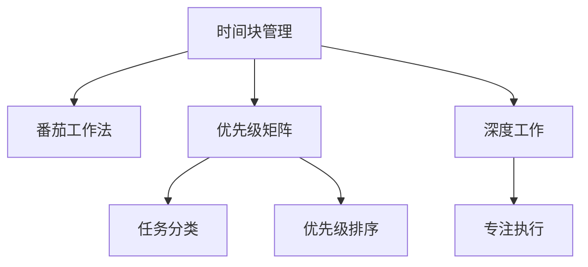

                 

# 程序员如何进行时间管理

## 1. 背景介绍

在当今快速变化的技术环境中，程序员常常面临着多重压力。一方面，技术的更新迭代不断加快，需要对新技术快速学习、掌握；另一方面，项目管理、代码质量、性能优化等任务繁重，需要高效地安排时间。如何管理好自己的时间，提升工作效率，成为每个程序员必须面对的课题。

本文旨在通过深入剖析时间管理的核心概念和实用策略，帮助程序员提升个人及团队的时间利用率，最大化产出，同时保持工作与生活的平衡。我们将从时间管理的原理出发，结合实际应用场景，提供一系列实用的时间管理建议和工具推荐。

## 2. 核心概念与联系

### 2.1 核心概念概述

在进行时间管理前，首先需要理解几个关键的时间管理概念：

- **时间块管理(Time Blocking)**：将一天或一周的时间分为若干固定的时间块，每个时间块专注于完成特定任务，以提高效率和专注度。
- **番茄工作法(Pomodoro Technique)**：将工作时间分为25分钟的专注工作和5分钟的短暂休息，每4个周期后进行长休息，以维持高效率的工作状态。
- **优先级矩阵(Eisenhower Matrix)**：通过区分任务的紧急性和重要性，将任务分为四类：重要且紧急、重要但不紧急、紧急但不重要、不紧急且不重要，从而更好地安排时间和精力。
- **深度工作(Deep Work)**：专注于高复杂度、需要高度集中注意力的工作，以实现更深的思考和创造，提高工作质量。

这些概念之间的逻辑关系可以通过以下Mermaid流程图来展示：



这个流程图展示了你如何通过时间块、番茄工作法、优先级矩阵和深度工作等方法，来安排和优化你的工作时间。

## 3. 核心算法原理 & 具体操作步骤

### 3.1 算法原理概述

时间管理本质上是一种优化资源分配的过程。通过合理规划时间，能够最大化利用每一段时间段，提升工作效率和产出。

形式化地，假设每天可利用的时间为 $T$，需完成的任务数量为 $N$，每个任务的执行时间为 $t_i$。则最优的时间管理目标是最小化总执行时间 $\Sigma t_i$。

具体来说，基于时间块管理、番茄工作法、优先级矩阵等方法，可以将任务按优先级和执行时间分配到不同的时间段中，从而优化时间利用效率。

### 3.2 算法步骤详解

以下是具体的时间管理操作步骤：

**Step 1: 任务清单与时间评估**
- 列出所有需要完成的任务，并估计每个任务的执行时间。
- 根据任务的紧急性和重要性，使用优先级矩阵将任务分为四类。

**Step 2: 时间块划分**
- 将一天划分为若干时间块，每个时间块专注于一个或一组相关任务。
- 根据任务的重要性和执行时间，合理分配时间块大小，保证关键任务得到充分时间。

**Step 3: 时间分配与执行**
- 使用番茄工作法或深度工作模式，在时间块内专注工作。
- 定期评估任务进度和优先级变化，动态调整时间分配。

**Step 4: 休息与回顾**
- 按周期性安排短暂休息和长休息，避免疲劳和过度劳累。
- 每周进行回顾，总结工作成效和问题，调整时间管理策略。

### 3.3 算法优缺点

时间管理的时间块管理、番茄工作法、优先级矩阵等方法具有以下优点：
- 提高专注度：通过时间块的划分和番茄工作法的短暂休息，集中精力完成任务，避免多任务并行导致的效率低下。
- 增强时间规划能力：优先级矩阵帮助区分任务的紧急性和重要性，优先处理关键任务，避免次要任务的干扰。
- 提升工作效率：通过合理分配时间块和任务执行时间，最大化利用每一段时间段，提高整体工作效率。

同时，这些方法也存在一些局限性：
- 固定性：时间块划分和番茄工作法要求严格遵守时间安排，可能不适合需要灵活变动的任务。
- 执行难度：深度工作要求高集中度的专注，对环境要求较高，可能难以在短时间内实现。
- 弹性不足：优先级矩阵可能无法完全覆盖所有任务，紧急且重要但不符合矩阵分类的情况需要额外处理。

### 3.4 算法应用领域

时间管理技术不仅适用于个人时间管理，也广泛应用于团队项目管理、软件开发等场景。

**个人时间管理**：适用于日常工作、学习、生活等各个方面，提升个人时间利用效率，平衡工作与生活。

**团队项目管理**：通过合理分配项目任务和时间块，优化资源利用，提高团队项目执行效率。

**软件开发**：在敏捷开发中，时间管理帮助团队合理规划任务，提升代码质量和交付速度。

## 4. 数学模型和公式 & 详细讲解 & 举例说明

### 4.1 数学模型构建

假设某程序员每天工作时间为 $T$ 小时，共有 $N$ 个任务，任务 $i$ 的执行时间为 $t_i$。时间管理的目标是合理分配时间，最小化总执行时间 $\Sigma t_i$。

我们可以将时间管理问题建模为线性规划问题，优化目标函数为：

$$
\min \Sigma t_i
$$

约束条件为：
- 每个任务至少完成一次：$\sum_{i=1}^N x_i = 1$
- 每天工作时间不超过总时间：$\Sigma t_i x_i \leq T$
- 每项任务只能分配一次：$x_i \geq 0$

其中 $x_i$ 表示任务 $i$ 是否被分配到某个时间段，若被分配则 $x_i=1$，否则 $x_i=0$。

### 4.2 公式推导过程

目标函数和约束条件可以表示为以下线性规划问题：

$$
\min \Sigma t_i \\
s.t. \\
\sum_{i=1}^N x_i = 1 \\
\Sigma t_i x_i \leq T \\
x_i \geq 0
$$

对于上述线性规划问题，我们可以使用单纯形法(Simplex Method)求解最优解。但在实际应用中，更常见的解决方法是通过启发式算法或优化工具（如Excel Solver、Gurobi等）求解。

### 4.3 案例分析与讲解

假设某程序员每天工作时间为8小时，共有3个任务：编程（3小时）、读书（2小时）、锻炼（1小时）。

1. **任务清单与时间评估**
   - 编程：紧急且重要，需3小时
   - 读书：紧急但不太重要，需2小时
   - 锻炼：不紧急但重要，需1小时

   使用优先级矩阵，任务编程和读书优先级最高。

2. **时间块划分**
   - 将一天分为4个时间块，每个时间块2小时。
   - 第一个时间块：编程（3小时）
   - 第二个时间块：读书（2小时）
   - 第三个时间块：锻炼（1小时）
   - 第四个时间块：阅读（1小时）

3. **时间分配与执行**
   - 使用番茄工作法，每个时间块内25分钟专注工作，5分钟短暂休息。
   - 每个任务分配到对应的时间块中，确保任务按计划执行。

4. **休息与回顾**
   - 每4个番茄周期后，进行15-30分钟的长时间休息。
   - 每周回顾，总结工作效果，调整时间管理策略。

## 5. 项目实践：代码实例和详细解释说明

### 5.1 开发环境搭建

在进行时间管理项目实践前，首先需要搭建开发环境。以下是使用Python进行PyTorch开发的Python环境配置流程：

1. 安装Anaconda：从官网下载并安装Anaconda，用于创建独立的Python环境。

2. 创建并激活虚拟环境：
```bash
conda create -n pytorch-env python=3.8 
conda activate pytorch-env
```

3. 安装PyTorch：根据CUDA版本，从官网获取对应的安装命令。例如：
```bash
conda install pytorch torchvision torchaudio cudatoolkit=11.1 -c pytorch -c conda-forge
```

4. 安装各类工具包：
```bash
pip install numpy pandas scikit-learn matplotlib tqdm jupyter notebook ipython
```

完成上述步骤后，即可在`pytorch-env`环境中开始时间管理实践。

### 5.2 源代码详细实现

这里我们以优先级矩阵为例，给出使用Python实现任务优先级排序的代码示例。

首先，定义任务和执行时间：

```python
from typing import List, Tuple

Task = Tuple[str, int]
Tasks = List[Task]

tasks = [
    ("编程", 3),
    ("读书", 2),
    ("锻炼", 1),
    ("阅读", 1)
]
```

然后，定义优先级矩阵：

```python
def priority_matrix(tasks: Tasks) -> List[Tuple[Task, int]]:
    urgency = [task for task, t in tasks if t == 3]  # 紧急任务
    important = [task for task, t in tasks if t == 2]  # 重要但不紧急任务
    return [(urgency, 2), (important, 1)]
```

最后，定义时间分配函数：

```python
def allocate_time(tasks: Tasks, time: int) -> List[Tuple[Task, int]]:
    sorted_tasks = sorted(tasks, key=lambda x: -x[1])  # 按任务执行时间降序排序
    time_blocks = []
    while sorted_tasks:
        current_task = sorted_tasks[0][0]
        remaining_time = time - sum(task[1] for task in time_blocks)
        if remaining_time >= sorted_tasks[0][1]:
            time_blocks.append((sorted_tasks[0], sorted_tasks[0][1]))
            sorted_tasks.pop(0)
        else:
            time_blocks.append((sorted_tasks[0], remaining_time))
            sorted_tasks[0] = (sorted_tasks[0][0], sorted_tasks[0][1] - remaining_time)
            sorted_tasks.sort(key=lambda x: -x[1])
    return time_blocks
```

调用函数进行任务分配：

```python
time = 8
time_blocks = allocate_time(tasks, time)
print(time_blocks)
```

以上代码实现了根据优先级矩阵和任务执行时间，分配时间块的逻辑。在实际应用中，可以结合优先级矩阵和时间块管理等方法，进一步优化时间分配策略。

### 5.3 代码解读与分析

**Task类**：
- 定义了任务名称和执行时间，用于表示每个任务的特征。

**Tasks类**：
- 定义了任务的列表，包含多个任务名称和执行时间。

**priority_matrix函数**：
- 根据任务的紧急性和重要性，将任务分为紧急和重要两个类别，并返回优先级矩阵。

**allocate_time函数**：
- 根据优先级矩阵和剩余时间，分配时间块。
- 首先按任务执行时间降序排序，然后逐个任务分配时间块。
- 如果剩余时间不足以完成当前任务，则将任务拆分，继续分配到其他时间块。

**main函数**：
- 调用allocate_time函数，输出分配的时间块列表。

可以看出，通过合理的代码设计，我们可以高效地实现时间管理中的任务优先级排序和分配策略，为实际应用提供坚实的基础。

## 6. 实际应用场景

### 6.1 软件开发

在软件开发中，时间管理尤为重要。程序员需要平衡代码编写、测试、代码审查、文档编写等多重任务。通过时间管理工具，可以更好地安排开发任务，提高代码质量和交付速度。

**任务清单与时间评估**：列出所有需要完成的任务，如需求分析、设计、编码、测试等，并估计每个任务的执行时间。

**优先级矩阵**：将任务按紧急性和重要性分类，优先处理关键任务。

**时间块划分**：根据项目截止日期和任务优先级，合理分配时间块，确保关键任务得到充分时间。

**番茄工作法**：在每个时间块内使用番茄工作法，提高专注度和效率。

**回顾与调整**：每周回顾项目进度和问题，调整时间管理策略，确保项目按计划推进。

### 6.2 项目管理

项目管理中，时间管理能够帮助团队高效协调资源，按时完成任务。通过合理分配时间块，能够优化资源利用，提升团队项目执行效率。

**任务清单与时间评估**：列出所有需要完成的任务，并估计每个任务的执行时间。

**优先级矩阵**：将任务按紧急性和重要性分类，优先处理关键任务。

**时间块划分**：根据项目截止日期和任务优先级，合理分配时间块，确保关键任务得到充分时间。

**番茄工作法**：在每个时间块内使用番茄工作法，提高专注度和效率。

**回顾与调整**：每周回顾项目进度和问题，调整时间管理策略，确保项目按计划推进。

### 6.3 学习与培训

学习与培训中，时间管理能够帮助学生和员工合理安排学习时间，提升学习效果。通过时间块管理、番茄工作法等方法，可以更好地专注于学习内容，提高学习效率。

**任务清单与时间评估**：列出所有需要学习的内容，并估计每个学习的执行时间。

**优先级矩阵**：将学习内容按紧急性和重要性分类，优先处理关键内容。

**时间块划分**：根据学习计划和任务优先级，合理分配时间块，确保关键内容得到充分时间。

**番茄工作法**：在每个时间块内使用番茄工作法，提高专注度和效率。

**回顾与调整**：每周回顾学习进度和问题，调整学习策略，确保学习按计划推进。

## 7. 工具和资源推荐

### 7.1 学习资源推荐

为了帮助开发者系统掌握时间管理的理论基础和实践技巧，这里推荐一些优质的学习资源：

1. 《深度工作：如何在分心的世界中保持专注》：Cal Newport所著，探讨深度工作的原理和实践方法，帮助提升专注力和工作效率。

2. 《时间管理：提高生产力的秘诀》：Stephen R. Covey所著，系统讲解时间管理的理论基础和应用策略，适合初学者和进阶读者。

3. 《番茄工作法图解》：Francesco Cirillo所著，介绍番茄工作法的原理和应用，适合快速上手实践。

4. 《精益时间管理》：David Allen所著，讲解精益时间管理的理念和方法，帮助优化时间利用。

5. 《时间管理的艺术》：Bryant McGill所著，结合心理学和实践案例，深入剖析时间管理的核心问题。

通过对这些资源的学习实践，相信你一定能够快速掌握时间管理的精髓，并用于解决实际的NLP问题。

### 7.2 开发工具推荐

高效的开发离不开优秀的工具支持。以下是几款用于时间管理开发的常用工具：

1. Todoist：功能强大的任务管理工具，支持多平台同步，帮助用户高效管理任务清单和优先级。

2. Trello：灵活的看板管理工具，支持团队协作，跟踪任务进度和分配。

3. Pomodone：番茄工作法实践工具，帮助你设置番茄周期和休息时间，统计工作时长。

4. Focus@Will：专注于提升专注力的音乐应用，提供多种音乐和节奏，帮助用户保持高效的工作状态。

5. RescueTime：自动跟踪和分析你的时间使用情况，帮助你识别时间浪费的源头，优化时间利用。

合理利用这些工具，可以显著提升时间管理任务的开发效率，加快创新迭代的步伐。

### 7.3 相关论文推荐

时间管理技术的发展源于学界的持续研究。以下是几篇奠基性的相关论文，推荐阅读：

1. Time Blocking: A Comparative Analysis of Time Blocking versus Time Chunking Approaches for Knowledge Workers：通过实验研究，比较时间块管理和时间块分组在知识工作者中的应用效果。

2. The Pomodoro Technique and Its Impact on the Performance of Project Teams：研究番茄工作法对项目管理团队工作表现的影响。

3. The Eisenhower Matrix: A Time Management Tool for Personal Productivity：介绍优先级矩阵的时间管理工具，帮助用户优化时间分配。

4. Deep Work: Rules for Focused Success in a Distracted World：介绍深度工作的理念和实践方法，帮助提升工作质量和效率。

这些论文代表了大时间管理技术的发展脉络。通过学习这些前沿成果，可以帮助研究者把握学科前进方向，激发更多的创新灵感。

## 8. 总结：未来发展趋势与挑战

### 8.1 研究成果总结

本文对时间管理的核心概念和实用策略进行了全面系统的介绍。首先阐述了时间管理的原理和背景，明确了时间管理在个人及团队效率提升中的重要性。其次，从时间块管理、番茄工作法、优先级矩阵等方法出发，详细讲解了时间管理的实际操作步骤，并给出了代码实现和应用场景。最后，推荐了相关的学习资源、开发工具和研究论文，力求为读者提供全方位的技术指引。

通过本文的系统梳理，可以看到，时间管理技术在提升个人及团队效率、优化时间利用方面具有巨大的潜力。时间管理能够帮助程序员更好地平衡工作与生活，提升代码质量和项目交付速度。

### 8.2 未来发展趋势

展望未来，时间管理技术将呈现以下几个发展趋势：

1. 自动化时间管理：未来可能会出现更多自动化的时间管理工具，通过AI算法优化任务分配和时间利用，减少人工干预。

2. 多维度时间管理：除了传统的任务管理，未来时间管理工具将更多地考虑心理因素、生理状态等因素，提供更为全面、个性化的管理方案。

3. 实时反馈系统：通过实时跟踪和反馈，帮助用户及时调整工作状态和时间利用，提升工作效率。

4. 跨平台集成：时间管理工具将更加注重跨平台集成和数据同步，提高用户使用便捷性。

5. 个性化推荐：根据用户历史行为和偏好，提供个性化的任务推荐和时间管理策略，提升用户体验。

6. 数据驱动决策：利用大数据和机器学习技术，从大量历史数据中提取时间管理的最佳实践和模式，优化时间管理策略。

以上趋势凸显了时间管理技术的广阔前景。这些方向的探索发展，必将进一步提升时间管理的智能化和自动化水平，为个人及团队的高效工作提供更多助力。

### 8.3 面临的挑战

尽管时间管理技术已经取得了显著进展，但在迈向更加智能化、普适化应用的过程中，仍面临一些挑战：

1. 个性化挑战：每个人的时间管理需求和习惯不同，需要定制化解决方案。如何在保证通用性的同时，实现个性化适配，是一大挑战。

2. 数据隐私问题：时间管理工具需要收集用户的时间数据，如何在数据收集和使用过程中保护用户隐私，是必须面对的重要问题。

3. 多任务并行：现代工作环境往往需要同时处理多项任务，如何在时间管理中有效协调多任务，是一大难点。

4. 心理因素影响：时间管理不仅涉及任务安排，还受心理因素（如焦虑、疲劳、压力等）的影响。如何在时间管理中考虑心理因素，提升用户幸福感，是一大挑战。

5. 跨领域应用：时间管理技术在不同领域的应用场景和需求差异较大，如何在不同场景下实现高效的时间管理，是一大挑战。

6. 持续学习：时间管理领域的技术和理论不断发展，如何及时获取最新的研究成果和最佳实践，是一大挑战。

正视时间管理面临的这些挑战，积极应对并寻求突破，将是大时间管理技术走向成熟的必由之路。相信随着学界和产业界的共同努力，时间管理技术将更加智能化、普适化，为个人及团队的高效工作提供更多助力。

### 8.4 研究展望

面对时间管理面临的种种挑战，未来的研究需要在以下几个方面寻求新的突破：

1. 探索智能时间管理算法：结合人工智能技术，开发自动化的任务安排和时间利用算法，提升时间管理效率。

2. 引入心理学和时间生物学：深入研究用户心理和生理状态对时间管理的影响，提供更为科学的建议和策略。

3. 融合大数据和机器学习：利用大数据和机器学习技术，分析用户行为数据，优化时间管理策略。

4. 跨学科交叉研究：结合管理学、心理学、社会学等多个学科，综合研究时间管理的理论和实践，提供全面的解决方案。

5. 注重用户体验：在时间管理工具的设计和实现中，注重用户体验和满意度，提供个性化、易用的工具。

这些研究方向的探索，必将引领时间管理技术迈向更高的台阶，为个人及团队的高效工作提供更多助力。面向未来，时间管理技术还需要与其他人工智能技术进行更深入的融合，如自然语言处理、深度学习等，多路径协同发力，共同推动时间管理系统的进步。

## 9. 附录：常见问题与解答

**Q1：如何平衡工作与生活？**

A: 平衡工作与生活是时间管理的核心目标之一。可以通过以下方法实现：

1. 制定时间块：将一天划分为工作和休息时间块，确保有时间进行个人兴趣和家庭活动。

2. 固定休息时间：每天安排固定的休息时间，如读书、运动、社交等，避免过度工作。

3. 心理调适：通过冥想、运动等方式缓解工作压力，保持身心健康。

**Q2：如何应对紧急任务？**

A: 面对紧急任务，可以通过以下方法处理：

1. 动态调整任务优先级：根据紧急任务的优先级，动态调整原任务优先级和时间分配。

2. 延迟低优先级任务：将低优先级任务推迟到后续时间块处理，确保紧急任务得到优先处理。

3. 时间块重分配：如果紧急任务耗时较长，可以考虑重分配时间块，确保任务按时完成。

**Q3：如何使用番茄工作法？**

A: 番茄工作法是一种高效的时间管理工具，主要步骤如下：

1. 设置任务：将任务分解为25分钟的工作时间块和5分钟的短暂休息时间块。

2. 专注工作：在25分钟内专注工作，避免干扰和分心。

3. 短暂休息：每25分钟结束后，进行5分钟的短暂休息，放松大脑。

4. 长休息：每4个番茄周期后，进行15-30分钟的长休息，恢复精力。

5. 记录日志：记录每个番茄周期的任务完成情况，分析时间利用效果，调整策略。

**Q4：如何设置优先级矩阵？**

A: 优先级矩阵是一种任务优先级排序工具，主要步骤如下：

1. 列出所有任务：将所有需要完成的任务列出，并估计每个任务的执行时间。

2. 分类任务：根据任务的紧急性和重要性，将任务分为四类：重要且紧急、重要但不紧急、紧急但不重要、不紧急且不重要。

3. 确定优先级：根据任务的优先级排序，优先处理重要且紧急的任务。

4. 分配时间：根据任务优先级，合理分配时间块，确保关键任务得到充分时间。

5. 动态调整：定期回顾任务进展，调整优先级和时间分配，保持任务管理的灵活性。

**Q5：如何优化代码质量？**

A: 优化代码质量是软件开发中的重要环节，可以通过以下方法实现：

1. 代码审查：定期进行代码审查，发现并修复潜在问题。

2. 测试驱动开发(TDD)：在编写代码前先编写测试用例，确保代码质量。

3. 重构代码：定期重构代码，优化代码结构和可维护性。

4. 自动化测试：使用自动化测试工具，持续测试代码，确保代码质量。

5. 持续集成(CI)：通过持续集成系统，自动构建和测试代码，及时发现和解决问题。

这些方法不仅能够提升代码质量，还能提高开发效率，减少后期维护成本。

---

作者：禅与计算机程序设计艺术 / Zen and the Art of Computer Programming

