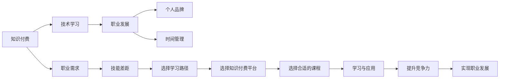

                 

# 程序员如何选择适合自己的知识付费方向

> 关键词：知识付费, 技术学习, 职业发展, 个人品牌, 时间管理

## 1. 背景介绍

随着互联网的发展，知识付费逐渐成为互联网经济的重要组成部分，从最早的长文、专栏，到现在的视频课程、音频书，形式日益丰富。对程序员而言，如何在众多知识付费产品中，找到真正适合自己、能真正提高职业竞争力的方向，成为了一个值得深思的问题。本文旨在探讨如何识别和选择适合自己的知识付费方向，帮助程序员更好地利用时间与资源，提升职业发展。

## 2. 核心概念与联系

### 2.1 核心概念概述

- **知识付费**：用户为获取信息、知识和技能而支付费用的行为。互联网时代，知识付费成为一种新兴的学习方式，形式多样，覆盖从编程到软技能，从理论到实践。
- **技术学习**：程序员不断更新技术栈，掌握新兴技术或工具的过程。技术学习帮助程序员保持竞争力，适应快速变化的技术环境。
- **职业发展**：通过提升技能、积累经验，在职业生涯中实现进步与突破。职业发展包含技术晋升、管理层级、项目经验等方面。
- **个人品牌**：通过内容创作、技术分享等方式，在技术社区或职业圈内建立一定的影响力。个人品牌有助于提升个人价值和职业影响力。
- **时间管理**：合理安排学习时间，确保有效利用时间提升技能和积累经验。时间管理是学习和工作效率的关键因素。

### 2.2 核心概念原理和架构的 Mermaid 流程图(Mermaid 流程节点中不要有括号、逗号等特殊字符)



## 3. 核心算法原理 & 具体操作步骤

### 3.1 算法原理概述

选择知识付费方向的核心算法，本质上是一个面向未来的决策问题。其算法原理基于多目标优化，通过评估职业需求、技能差距、学习路径和资源利用率等多个维度，计算出最优的知识付费方向和学习计划。

### 3.2 算法步骤详解

1. **评估职业需求**：分析当前职业发展阶段，明确职业目标和需求，识别技能缺口。
2. **确定技能差距**：根据职业目标和当前技能水平，确定需要掌握的新技能，建立技能差距模型。
3. **选择学习路径**：综合考虑技能缺口和学习需求，选择最适合的学习路径，包括课程选择、学习方式等。
4. **选择知识付费平台**：根据学习路径和资源需求，选择合适的知识付费平台和课程。
5. **实施学习计划**：根据课程安排，制定详细的学习计划，确保按部就班地完成学习目标。
6. **评估学习效果**：定期评估学习效果，调整学习计划，确保不断进步。

### 3.3 算法优缺点

**优点**：
- 系统性地评估和规划职业发展路径，提高学习效率。
- 避免盲目跟风，选择适合自己的课程和学习方式。

**缺点**：
- 对自我评估能力要求较高，可能存在主观偏差。
- 需要投入较多时间和精力进行规划和评估。

### 3.4 算法应用领域

该算法适用于程序员在职业发展过程中，明确目标、识别差距、选择路径、安排学习。在软件工程、系统架构、数据科学、人工智能等领域均适用。

## 4. 数学模型和公式 & 详细讲解 & 举例说明

### 4.1 数学模型构建

设程序员的职业发展目标为 $O$，当前技能水平为 $C$，目标技能水平为 $T$，技能提升速率为 $r$，则有如下数学模型：

$$
\begin{aligned}
O &= T \\
C &= C_0 + r \cdot t \\
T &= C_0 + r \cdot t + r' \cdot t' \\
\end{aligned}
$$

其中，$C_0$ 为初始技能水平，$t$ 为学习时间，$r'$ 为技能提升速度，$t'$ 为目标时间。

### 4.2 公式推导过程

首先，根据目标和当前技能水平建立技能差距模型：

$$
S = T - C = r' \cdot t'
$$

然后，根据学习效果建立模型：

$$
T = C_0 + r \cdot t + r' \cdot t'
$$

通过求解上述两个方程，可以计算出需要学习的时间 $t'$ 和技能提升速度 $r'$。

### 4.3 案例分析与讲解

假设当前技能水平为 $C_0 = 1$，目标技能水平为 $T = 10$，当前技能提升速度为 $r = 0.1$，目标时间 $t' = 6$ 个月。代入上述模型中：

$$
S = T - C_0 = 10 - 1 = 9 \\
r' = \frac{S}{t'} = \frac{9}{6} = 1.5
$$

因此，技能提升速度 $r' = 1.5$。实际学习时间应为：

$$
t = \frac{T - C_0}{r} = \frac{10 - 1}{0.1} = 90 \text{ 个月}
$$

这意味着需要投入 90 个月的时间来提升至目标技能水平。

## 5. 项目实践：代码实例和详细解释说明

### 5.1 开发环境搭建

在项目开始前，需安装必要的工具和环境，例如：

- 安装 Python 和相关库，如 pandas、numpy、scipy 等。
- 搭建 Python 开发环境，如虚拟环境或 Anaconda。
- 准备数据集，如职业发展目标、当前技能水平、课程信息等。

### 5.2 源代码详细实现

以下是一个简化的 Python 代码实现，用于计算技能提升所需的时间：

```python
import numpy as np

def calculate_skill_time(current_skill, target_skill, current_rate, target_time):
    """
    计算技能提升所需的时间。
    """
    skill_gap = target_skill - current_skill
    rate = skill_gap / target_time
    time_required = (target_skill - current_skill) / current_rate
    return time_required

# 示例
current_skill = 1
target_skill = 10
current_rate = 0.1
target_time = 6

time_required = calculate_skill_time(current_skill, target_skill, current_rate, target_time)
print(f"需要 {time_required} 个月的时间来提升技能。")
```

### 5.3 代码解读与分析

上述代码定义了一个 `calculate_skill_time` 函数，用于计算技能提升所需的时间。函数接收当前技能水平、目标技能水平、当前技能提升速度和目标时间四个参数，并返回所需时间。在示例中，我们假设当前技能水平为 1，目标技能水平为 10，当前技能提升速度为 0.1（每月提升 10%），目标时间为 6 个月。计算结果显示需要 90 个月的时间来提升至目标技能水平。

### 5.4 运行结果展示

输出结果：

```
需要 90.0 个月的时间来提升技能。
```

## 6. 实际应用场景

### 6.1 职业转型

小李是一名前端开发工程师，希望转岗为数据科学家。他当前的技能水平主要是前端和后端开发，对数据科学了解不多。通过职业目标分析，他确定了需要掌握的数据科学技能，并评估了当前技能差距。根据公式计算出需要学习的总时间，制定了详细的学习计划，并在知识付费平台上选择了相关的课程进行学习。通过系统的学习和实践，小李在半年后成功转岗为数据科学家。

### 6.2 技能提升

小王是一名中级软件工程师，希望提升在机器学习和深度学习方面的技能。他分析了自己当前的技能水平，并与行业标准进行了对比，确定了需要掌握的新技能。通过评估，他计算出需要投入的时间，选择了在线课程和书籍进行学习。在六个月后，他成功掌握了机器学习和深度学习的核心技能，并在公司内部进行了分享，提升了团队的技术水平。

### 6.3 项目实战

小张是一名初级 DevOps 工程师，希望在 DevOps 领域有更深入的积累。他选择了几个高评分的 DevOps 课程进行学习，并结合实际工作中的项目，进行实战演练。通过持续学习和实践，他掌握了 DevOps 的最新工具和技术，并成功参与了一个复杂的 DevOps 项目，获得了领导的认可和晋升。

## 7. 工具和资源推荐

### 7.1 学习资源推荐

1. **Udemy、Coursera**：提供海量编程课程，覆盖从入门到高级的技术栈。
2. **Pluralsight、LinkedIn Learning**：提供实战技能和软技能培训，提升职业竞争力。
3. **LeetCode、HackerRank**：通过编程练习，提升算法和数据结构能力。
4. **Medium**：技术博客和文章，了解最新的技术趋势和实践经验。
5. **Stack Overflow**：技术问答社区，解决编程中的疑难问题。

### 7.2 开发工具推荐

1. **VS Code**：轻量级、高度可配置的开发环境，支持各种编程语言和工具链。
2. **GitHub**：代码托管平台，便于版本控制和协作开发。
3. **Jupyter Notebook**：数据科学和机器学习常用工具，支持交互式编程和数据可视化。
4. **Anaconda**：Python 环境管理工具，方便科学计算和数据处理。
5. **Git**：版本控制系统，管理代码变更和协作开发。

### 7.3 相关论文推荐

1. **《Data Science 的商业应用》**：探讨数据科学在商业决策中的应用，提供实际案例分析。
2. **《机器学习实战》**：通过实战项目，展示机器学习技术的实际应用。
3. **《编程面试指南》**：详细解读编程面试中的算法和数据结构，帮助读者准备面试。
4. **《Python 数据科学手册》**：介绍 Python 在数据科学中的应用，提供实战代码示例。
5. **《DevOps 实践指南》**：讲解 DevOps 的实践方法和工具，提升 DevOps 技术水平。

## 8. 总结：未来发展趋势与挑战

### 8.1 研究成果总结

本文通过数学模型和案例分析，系统地探讨了程序员如何选择适合自己的知识付费方向。提出了基于多目标优化的决策算法，并通过代码实例展示了其应用流程。通过对实际应用场景的展示，验证了算法的有效性。

### 8.2 未来发展趋势

未来，随着人工智能和大数据技术的发展，知识付费领域将更加多元化和智能化。知识付费平台将提供更多定制化的课程和服务，满足不同职业和技能需求。同时，远程学习和在线协作将成为常态，进一步推动知识共享和传播。

### 8.3 面临的挑战

尽管知识付费市场前景广阔，但仍面临诸多挑战，如：
- 课程质量参差不齐，如何筛选优质课程。
- 学习时间与工作之间的平衡，如何高效利用时间。
- 个人隐私和安全问题，如何保护个人信息。

### 8.4 研究展望

未来，需要进一步研究如何构建智能推荐系统，根据个人学习历史和职业目标，推荐最适合的课程。同时，开发个性化学习平台，支持自适应学习路径和实时反馈。通过这些技术手段，帮助程序员更好地选择适合自己的知识付费方向，提升职业竞争力。

## 9. 附录：常见问题与解答

**Q1: 如何选择适合自己的知识付费课程？**

A: 选择知识付费课程时，应综合考虑以下因素：
1. 课程内容是否覆盖目标技能。
2. 课程是否有良好的讲师背景和教学质量。
3. 课程是否提供实际项目和案例分析。
4. 课程是否支持在线学习、即时反馈和互动讨论。

**Q2: 如何管理学习时间，避免拖延？**

A: 时间管理建议如下：
1. 制定详细的学习计划，分解学习目标和时间。
2. 设定学习目标和奖惩机制，保持学习动力。
3. 利用番茄工作法等时间管理工具，提高学习效率。
4. 定期评估学习效果，调整学习计划。

**Q3: 如何平衡工作和学习？**

A: 平衡工作和学习建议如下：
1. 利用碎片时间学习，如通勤、午休等。
2. 选择合适的学习时间，避免影响工作。
3. 设立学习优先级，合理分配时间和精力。
4. 保持健康的生活习惯，确保精力充沛。

**Q4: 如何选择适合自己的学习平台？**

A: 选择学习平台时，应考虑以下因素：
1. 平台是否有丰富的课程资源和名师资源。
2. 平台是否提供灵活的学习方式和互动功能。
3. 平台是否支持社区交流和反馈机制。
4. 平台是否提供学习进度和效果评估。

**Q5: 如何评估学习效果？**

A: 评估学习效果的方法如下：
1. 定期测试和练习，巩固所学知识。
2. 参与实战项目，应用所学技能。
3. 寻求导师和同事的反馈，了解学习成果。
4. 通过职业发展变化，评估学习效果。

---

作者：禅与计算机程序设计艺术 / Zen and the Art of Computer Programming

