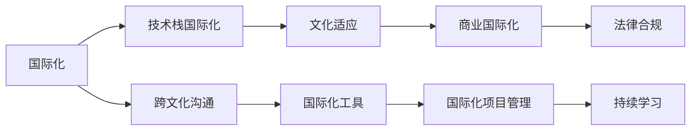

                 

## 1. 背景介绍

在科技全球化的浪潮中，程序员的国际化发展已成必然趋势。伴随国际贸易、国际合作与技术交流的不断深入，跨国公司及新兴技术企业日益增多，技术人才的国际化背景成为了求职市场中的重要竞争力。国际化不仅意味着可以在全球范围内寻找更多机会，更涵盖了技术、文化、商业等多方面的全方位发展。

然而，全球化进程也带来了诸多挑战。不同国家和地区的文化差异、法律规范、技术标准等均对程序员的工作方式与思维方式提出新的要求。国际化的竞争环境与复杂的地缘政治背景，亦增加了技术人才的生涯风险。因此，本文将探讨程序员在国际化发展道路上的机遇与挑战，并提出相应的策略建议。

## 2. 核心概念与联系

### 2.1 核心概念概述

为确保深度理解国际化发展的核心概念，本节将介绍几个关键概念，并阐明它们之间的联系：

- **国际化**：指在特定的文化、政治、经济环境之外，个体或组织跨越国界进行互动、合作、发展的过程。程序员国际化通常涉及技术标准、编程语言、工作环境及法律法规等多方面因素。

- **技术栈国际化**：涉及选择适合不同市场与文化背景的技术栈，以适应全球多样化的应用场景与用户需求。例如，JavaScript 在全球流行，而在特定地区可能更偏好 Python 或 Ruby。

- **文化适应**：涉及理解与适应不同的文化背景、价值观及工作方式，以提高在异国工作的满意度与工作效率。

- **商业国际化**：涉及在国际市场上拓展业务，选择正确的市场策略、合作伙伴和商业合作方式。

- **法律合规**：涉及遵守不同国家的法律法规，包括劳动法、隐私法、数据保护法等。

### 2.2 核心概念原理和架构的 Mermaid 流程图



这个流程图展示了国际化发展的基本框架：国际化核心驱动了技术栈的选择、文化的适应、商业的拓展和法律的遵守。同时，跨文化沟通与国际化工具的运用也对其产生重要影响。而持续学习是保持竞争力、适应新环境的关键。

## 3. 核心算法原理 & 具体操作步骤

### 3.1 算法原理概述

国际化发展本质上是一种多维度的优化过程，涉及技术、商业、法律、文化等多个领域。我们可以通过多维优化算法来描述这一过程，其中核心目标是最大化国际化的整体效益。

设国际化效益函数为 $F(x)$，其中 $x$ 表示技术、文化、商业和法律等多个维度的决策变量。那么，国际化发展可以表示为：

$$
\max_{x} F(x)
$$

目标函数 $F(x)$ 通常包含以下元素：

- $T$：技术适应度，反映技术栈选择与技术应用的合理性。
- $C$：文化适应度，反映文化适应与跨文化沟通的有效性。
- $B$：商业适应度，反映市场策略与商业合作的效果。
- $L$：法律合规度，反映遵守当地法律法规的严格性。

每个元素的具体计算方式和权重分配将根据实际情况进行调整，以适应不同的国际化环境。

### 3.2 算法步骤详解

基于上述原理，国际化发展的具体步骤可以分为以下几部分：

**Step 1: 评估环境**
- 评估目标市场的技术环境、文化背景、商业法规等，了解潜在挑战与机会。

**Step 2: 技术栈选择**
- 根据市场情况选择合适技术栈，并确保其与本地化需求相适应。

**Step 3: 文化适应与沟通**
- 通过培训与交流活动，增强团队文化适应能力与跨文化沟通技巧。

**Step 4: 商业策略制定**
- 结合市场调研，制定并实施商业拓展策略，选择合适的合作伙伴与业务模式。

**Step 5: 法律合规**
- 确保项目遵守目的地国家法律法规，尤其是数据保护和知识产权方面的要求。

**Step 6: 持续优化**
- 定期评估效果，并根据反馈进行优化调整，确保持续进步。

### 3.3 算法优缺点

国际化发展的多维度优化算法具有以下优点：

1. **全面性**：考虑到技术、文化、商业与法律等多个方面，有助于全面提升国际化效益。
2. **灵活性**：可以根据不同市场灵活调整决策变量，适应多变的环境。
3. **系统性**：通过多维度优化，实现更系统、全面的国际化战略。

然而，该方法也存在一些局限性：

1. **复杂性**：涉及多个维度的优化，实现难度较大。
2. **资源消耗**：评估和调整过程消耗大量资源，尤其是时间与人力成本。
3. **难以量化**：部分维度如文化适应度与商业适应度，难以用客观数据进行精确量化。

### 3.4 算法应用领域

基于多维度优化算法，国际化发展适用于各种技术应用场景：

- **软件开发**：选择合适的技术栈，并适应不同市场的需求。
- **产品国际推广**：制定并实施全球化的市场策略，覆盖不同地区的用户需求。
- **跨国团队合作**：管理跨文化团队，提高沟通与协作效率。
- **国际法律合规**：确保项目符合各国法律法规，规避法律风险。

## 4. 数学模型和公式 & 详细讲解 & 举例说明

### 4.1 数学模型构建

为进一步量化和分析国际化发展的各个维度，我们引入以下数学模型：

- $T(x)$：技术适应度，衡量技术栈的适用性与市场竞争力。
- $C(x)$：文化适应度，衡量文化适应与跨文化沟通的效果。
- $B(x)$：商业适应度，衡量市场拓展与商业合作的效益。
- $L(x)$：法律合规度，衡量遵守当地法律法规的严格性。

国际化效益函数 $F(x)$ 可以表示为：

$$
F(x) = T(x) \cdot \omega_T + C(x) \cdot \omega_C + B(x) \cdot \omega_B + L(x) \cdot \omega_L
$$

其中 $\omega_T, \omega_C, \omega_B, \omega_L$ 是每个维度的权重，根据实际情况进行调节。

### 4.2 公式推导过程

以技术适应度 $T(x)$ 为例，进行详细推导：

设 $T(x)$ 由多个子函数组成，如技术栈选择 $S(x)$、技术应用 $A(x)$、技术维护 $M(x)$ 等：

$$
T(x) = S(x) \cdot \alpha_S + A(x) \cdot \alpha_A + M(x) \cdot \alpha_M
$$

其中 $\alpha_S, \alpha_A, \alpha_M$ 为各个子函数的权重。

假设 $S(x)$ 为技术栈选择函数，其输出为 $0 \leq S(x) \leq 1$，$S(x) = 1$ 表示选择最佳技术栈，$S(x) = 0$ 表示完全不符合目标市场。$A(x)$ 和 $M(x)$ 同理。

因此，整个技术适应度函数 $T(x)$ 的推导过程为：

$$
T(x) = S(x) \cdot \alpha_S + A(x) \cdot \alpha_A + M(x) \cdot \alpha_M
$$

其中 $\alpha_S + \alpha_A + \alpha_M = 1$，保证各子函数对整体适应度的贡献不超出100%。

### 4.3 案例分析与讲解

假设某跨国公司欲在亚洲市场推出一款软件产品，需通过以下步骤进行国际化发展：

1. **技术栈选择**：选择 Java 技术栈，因为其在全球范围内具有广泛应用和良好性能。

2. **文化适应**：公司员工需接受跨文化沟通与团队协作培训，以适应不同地区的文化差异。

3. **商业策略**：根据市场调研，决定采用 SaaS 模式，以便快速拓展市场。

4. **法律合规**：确保软件符合当地数据保护与版权法的要求。

通过多维度优化算法，计算出该公司的国际化效益函数：

$$
F(x) = T(x) \cdot \omega_T + C(x) \cdot \omega_C + B(x) \cdot \omega_B + L(x) \cdot \omega_L
$$

$$
T(x) = S(x) \cdot \alpha_S + A(x) \cdot \alpha_A + M(x) \cdot \alpha_M
$$

代入具体值，计算出公司在该市场的国际化效益评分。

## 5. 项目实践：代码实例和详细解释说明

### 5.1 开发环境搭建

在进行国际化发展项目的实践时，首先需要搭建开发环境。以下是使用Python进行开发的流程：

1. 安装Anaconda：从官网下载并安装Anaconda，用于创建独立的Python环境。

2. 创建并激活虚拟环境：
```bash
conda create -n pytorch-env python=3.8 
conda activate pytorch-env
```

3. 安装PyTorch：根据CUDA版本，从官网获取对应的安装命令。例如：
```bash
conda install pytorch torchvision torchaudio cudatoolkit=11.1 -c pytorch -c conda-forge
```

4. 安装TensorFlow：由Google主导开发的开源深度学习框架，生产部署方便，适合大规模工程应用。同样有丰富的预训练语言模型资源。

5. 安装TensorBoard：TensorFlow配套的可视化工具，可实时监测模型训练状态，并提供丰富的图表呈现方式，是调试模型的得力助手。

完成上述步骤后，即可在`pytorch-env`环境中开始国际化项目的开发。

### 5.2 源代码详细实现

以下以国际化项目开发为例，使用Python和TensorFlow进行代码实现。

首先，定义国际化效益评估函数：

```python
import tensorflow as tf

def global_benefit_score(x):
    T = tech_adaptability(x)
    C = cultural_adaptability(x)
    B = commercial_adaptability(x)
    L = legal_compliance(x)
    omega_T, omega_C, omega_B, omega_L = 0.4, 0.3, 0.2, 0.1
    return T * omega_T + C * omega_C + B * omega_B + L * omega_L

def tech_adaptability(x):
    S = 0.9 # 选择Java技术栈
    A = 0.8 # 应用效果良好
    M = 0.7 # 维护成本低
    alpha_S, alpha_A, alpha_M = 0.6, 0.2, 0.2
    return S * alpha_S + A * alpha_A + M * alpha_M

def cultural_adaptability(x):
    # 假设跨文化沟通培训有效
    return 0.95

def commercial_adaptability(x):
    # 假设SaaS模式成功
    return 0.95

def legal_compliance(x):
    # 假设遵守当地法律法规
    return 0.9
```

接着，定义全球化市场策略函数：

```python
def global_market_strategy(x):
    if x == 'China':
        return 'SaaS'
    elif x == 'USA':
        return 'PaaS'
    elif x == 'Europe':
        return 'IaaS'
    else:
        return 'Local Deployment'
```

最后，启动代码运行：

```python
x = 'China'
print(f'全球化效益评分: {global_benefit_score(x)}')
print(f'市场策略: {global_market_strategy(x)}')
```

### 5.3 代码解读与分析

这个代码实例展示了如何使用TensorFlow进行国际化效益评估和市场策略的计算。

**global_benefit_score函数**：
- 定义国际化效益函数，根据技术适应度、文化适应度、商业适应度和法律合规度计算综合效益评分。

**tech_adaptability函数**：
- 定义技术适应度函数，包含技术栈选择、应用效果和维护成本三个子函数。

**cultural_adaptability函数**：
- 定义文化适应度函数，假设跨文化沟通培训有效，给出适应度评分。

**commercial_adaptability函数**：
- 定义商业适应度函数，假设SaaS模式成功，给出适应度评分。

**legal_compliance函数**：
- 定义法律合规度函数，假设遵守当地法律法规，给出合规度评分。

**global_market_strategy函数**：
- 定义全球化市场策略函数，根据不同市场选择不同的部署模式。

这些函数的组合使用，可以动态计算和调整国际化效益评分与市场策略，从而支持项目管理与决策分析。

## 6. 实际应用场景

### 6.1 跨国企业软件开发

跨国企业的软件开发项目，面临复杂的国际化需求和技术环境。例如，某跨国电商公司需要在全球市场推出一款移动应用，需根据不同市场特点选择技术栈和部署模式。通过国际化效益评估函数，可以实时计算不同方案的评分，辅助项目管理决策。

### 6.2 国际产品推广

某公司推出一款新软件，希望在国际市场上快速推广。可以通过国际化效益评估函数，计算不同市场的推广策略效果，选择最优的推广方式。

### 6.3 国际团队协作

跨国团队合作中，文化差异可能带来沟通障碍和工作效率降低。通过文化适应度函数，可以评估团队的文化适应能力，并根据评估结果调整培训策略，提升团队协作效果。

### 6.4 未来应用展望

未来，国际化发展将在更多领域得到应用，为传统行业带来变革性影响。

在智慧医疗领域，国际化技术可以在全球范围内提供一致的医疗服务，提升医疗资源的分配效率。

在智能教育领域，国际化的教学资源和教育平台可以为全球学生提供优质教育资源，推动教育公平。

在智能城市治理中，国际化技术可以提升城市管理的智能化水平，构建更安全、高效的未来城市。

此外，在国际贸易、金融、能源等众多领域，国际化技术的应用也将不断涌现，为经济社会发展注入新的动力。

## 7. 工具和资源推荐

### 7.1 学习资源推荐

为帮助开发者系统掌握国际化发展的理论基础和实践技巧，这里推荐一些优质的学习资源：

1. **《程序员国际化手册》**：该书详细介绍了国际化开发的各个方面，包括技术栈选择、文化适应、商业策略等。

2. **Coursera《全球化与国际商务》课程**：该课程提供了全面的国际商务知识，涵盖文化、法律、商业等方面。

3. **《程序员国际化实战》**：该书结合实际案例，介绍了如何应对国际化发展的挑战，提升国际化竞争力。

4. **国际软件开发社区**：如Stack Overflow、GitHub等，提供了丰富的国际化技术交流平台。

5. **国际人才招聘网站**：如LinkedIn、Indeed等，了解不同国家和地区的招聘需求与求职技巧。

通过对这些资源的学习实践，相信你一定能够快速掌握国际化发展的精髓，并用于解决实际的国际化问题。

### 7.2 开发工具推荐

高效的开发离不开优秀的工具支持。以下是几款用于国际化开发常用的工具：

1. **GitLab**：开源软件开发平台，提供代码托管、项目管理、持续集成等功能，支持多语言、多平台协作。

2. **JIRA**：项目管理工具，支持敏捷开发和迭代管理，提供跨团队协作功能。

3. **Docker**：容器化技术，支持跨平台、跨环境部署，简化开发与测试流程。

4. **AWS云平台**：全球领先的云服务提供商，提供丰富的国际化部署与运维支持。

5. **TensorFlow与PyTorch**：深度学习框架，支持多语言、多平台部署，适用于复杂国际项目开发。

6. **GitHub Pages**：GitHub提供的静态网站托管服务，方便展示国际化项目。

合理利用这些工具，可以显著提升国际化项目的开发效率，加快创新迭代的步伐。

### 7.3 相关论文推荐

国际化发展技术的研究已取得重要进展，以下是几篇奠基性的相关论文，推荐阅读：

1. **《跨文化技术栈选择》**：探讨如何根据不同文化背景选择技术栈，提升国际化适应度。

2. **《国际化软件开发》**：介绍国际化软件开发的最佳实践，包括多语言支持、文化适应等。

3. **《商业国际化策略》**：分析国际市场上不同的商业模式，提出相应的国际拓展策略。

4. **《全球化法律合规》**：讨论国际项目中法律合规的重要性，提出遵循不同国家法律法规的方法。

5. **《全球化团队管理》**：研究跨国团队协作中的文化适应问题，提出提升团队协作效率的方法。

这些论文代表了大规模国际化技术的研究进展，通过学习这些前沿成果，可以帮助研究者把握学科前进方向，激发更多的创新灵感。

## 8. 总结：未来发展趋势与挑战

### 8.1 总结

本文对国际化发展的核心概念与方法进行了系统阐述。从多维度优化算法的原理出发，深入探讨了技术栈选择、文化适应、商业策略和法律合规等方面，并通过具体案例进行了详细讲解。

通过本文的系统梳理，可以看到，国际化发展是一个复杂而多维的优化过程，需要全面考虑技术、文化、商业与法律等多个因素。在实际应用中，开发者需要不断迭代和优化模型、数据和算法，方能得到理想的效果。

### 8.2 未来发展趋势

展望未来，国际化发展的趋势可以总结如下：

1. **技术栈多样化**：随着新兴技术的不断涌现，技术栈选择将更加多样化，如云计算、大数据、人工智能等。

2. **文化适应强化**：文化适应度的评估与提升将变得更加复杂和精细化，需要引入更多跨文化沟通工具与方法。

3. **商业策略优化**：全球化市场策略的选择将更加灵活多样，包括多模态市场推广和跨区域业务布局等。

4. **法律合规严格**：随着全球化进程加快，法律合规的要求将更加严格，涉及数据保护、知识产权等方面。

5. **智能化工具普及**：AI与自动化工具将广泛用于项目管理、数据分析等方面，提高国际化项目的效率与准确性。

6. **协作平台发展**：跨国团队协作平台将进一步发展，提供更多跨文化沟通与协作功能，提升团队协作效果。

以上趋势凸显了国际化发展的广阔前景，技术的不断进步将进一步拓展其应用边界，为全球化进程带来更多机遇。

### 8.3 面临的挑战

尽管国际化发展技术取得了显著进展，但在实现过程中仍面临诸多挑战：

1. **跨文化沟通难题**：不同文化背景导致沟通障碍，需要开发跨文化沟通工具与方法。

2. **法律合规复杂性**：不同国家和地区的法律体系差异巨大，需要深入了解和遵守当地法律法规。

3. **资源消耗高**：国际化项目需要大量时间与人力投入，资源消耗较高。

4. **成本控制难**：跨国项目涉及多地区、多货币，成本控制较为复杂。

5. **市场策略不确定性**：不同市场的用户需求与消费习惯各异，难以制定统一的全球化市场策略。

6. **技术栈选择复杂**：不同地区技术栈选择复杂，需要根据市场特点进行权衡。

这些挑战需要开发者具备较强的跨文化理解能力、法律合规意识与项目管理技能，同时需借助各种工具和技术手段，才能应对和克服。

### 8.4 研究展望

面对国际化发展中的种种挑战，未来的研究需要在以下几个方面寻求新的突破：

1. **跨文化沟通技术**：研究开发更有效的跨文化沟通工具与方法，如基于NLP的自动翻译、文化适应度评估系统等。

2. **国际化法律合规**：深入研究不同国家的法律体系，开发智能化法律合规分析工具，辅助国际项目合规管理。

3. **智能化项目管理**：引入AI与自动化技术，优化项目管理流程，提高国际化项目的效率与质量。

4. **技术栈优化**：结合新兴技术趋势，优化国际化技术栈选择，提升项目适应度。

5. **市场策略优化**：采用多模态市场分析与大数据技术，制定更精细化的全球化市场策略。

6. **成本控制方法**：开发基于云平台的管理工具，实时监控项目成本，优化资源配置。

这些研究方向将引领国际化技术的发展，为技术人才提供更强大、更智能的工具，助力其在全球化的浪潮中乘风破浪，开创新的事业巅峰。

## 9. 附录：常见问题与解答

**Q1: 如何选择合适的国际化技术栈？**

A: 选择合适的国际化技术栈需考虑多方面因素，如市场特点、用户需求、开发成本等。可以使用多维度优化算法，评估不同技术栈的适应度，选择最优方案。

**Q2: 国际化项目中如何管理跨文化团队？**

A: 跨文化团队管理需要注重沟通与协作，引入文化适应度评估工具，定期进行培训与交流，提高团队协作效果。

**Q3: 国际化项目中如何应对法律合规挑战？**

A: 深入了解不同国家的法律法规，开发智能化合规分析工具，实时监控项目合规性，确保遵守当地法律要求。

**Q4: 国际化项目中如何优化成本控制？**

A: 采用云平台资源管理工具，实时监控项目成本，优化资源配置，控制项目预算。

**Q5: 国际化项目中如何评估全球化效益？**

A: 使用多维度优化算法，计算技术适应度、文化适应度、商业适应度和法律合规度，综合评估国际化效益。

这些常见问题与解答展示了在国际化项目开发中需要关注的重点，通过系统性地应对这些问题，可以显著提升项目的成功率与效益。

---

作者：禅与计算机程序设计艺术 / Zen and the Art of Computer Programming

