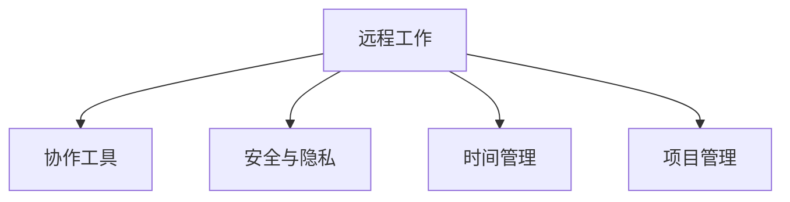

                 

# 程序员的国际远程工作指南

> 关键词：远程工作,国际协作,工具和资源,生产效率,安全与隐私,远程团队建设,沟通技巧

## 1. 背景介绍

### 1.1 问题由来
随着全球化进程的加快，以及新冠疫情的持续影响，越来越多的企业和员工开始探索和实践远程工作的模式。特别是对于软件开发等IT领域，远程工作已经成为了一种常态。远程工作不仅使得公司能够打破地域限制，吸引全球顶尖人才，还为员工提供了更大的灵活性和工作自由度。然而，远程工作也带来了许多新的挑战，如团队协作、沟通效率、安全与隐私等，需要通过合理的方式进行管理和优化。

### 1.2 问题核心关键点
远程工作最大的挑战在于团队协作和沟通效率的提升。如何克服时差、地理位置的限制，保障团队成员之间的无缝对接和高效沟通，成为远程工作管理的关键。此外，安全与隐私保护也是远程工作关注的重点，如何避免敏感信息泄露、确保数据安全，是所有远程团队必须解决的难题。

## 2. 核心概念与联系

### 2.1 核心概念概述

为了更好地理解如何开展远程工作，本节将介绍几个密切相关的核心概念：

- 远程工作（Remote Work）：指员工不必到固定场所办公，通过网络工具在家中或任何地方进行工作的模式。
- 协作工具（Collaboration Tools）：支持远程团队成员之间共享信息、协调工作的软件工具。
- 安全与隐私（Security and Privacy）：远程工作中必须保证数据传输和存储的安全性，避免敏感信息泄露。
- 时间管理（Time Management）：远程工作对时间管理提出了更高的要求，需要合理安排工作和休息时间，提高工作效率。
- 项目管理（Project Management）：远程工作环境中，如何规划和管理项目进度、分配任务、跟踪进度，成为团队协作的关键。

这些核心概念之间的逻辑关系可以通过以下Mermaid流程图来展示：



这个流程图展示了一些核心概念及其之间的相互关系：

1. 远程工作是基础，需要依赖协作工具、安全与隐私保护、时间管理、项目管理等辅助手段才能有效开展。
2. 协作工具是远程工作的重要支撑，用于实现团队成员之间的信息共享和沟通协调。
3. 安全与隐私是远程工作的核心保障，避免敏感信息泄露。
4. 时间管理是远程工作的必备技能，提高工作效率和团队协调性。
5. 项目管理是远程工作中的重要工具，确保任务按时按质完成。

## 3. 核心算法原理 & 具体操作步骤
### 3.1 算法原理概述

远程工作的管理，本质上是一种分布式协作和项目管理的过程。其核心思想是利用各种协作工具和软件，将远程团队成员有效组织起来，实现高效的沟通和协作。

形式化地，假设远程团队有 $N$ 个成员，每个成员的工作可以表示为一个任务 $T_i$，时间管理可以用 $\text{Time}_{i,j}$ 表示第 $i$ 个成员分配给第 $j$ 个任务的起始时间和持续时间。则整个远程团队的任务协作可以表示为：

$$
\text{Workflow} = \{T_1, T_2, ..., T_N\} \times \{\text{Time}_{i,j}\}
$$

其中，任务 $T_i$ 由多个子任务构成，每个子任务可以通过协作工具进行分配和管理，确保任务按时完成。

### 3.2 算法步骤详解

基于上述算法原理，远程工作的管理主要包括以下几个关键步骤：

**Step 1: 确定任务分工和目标**
- 明确项目的目标和任务，列出每个任务的具体子任务和完成标准。
- 根据团队成员的技能和兴趣，合理分配任务，确保每个成员都有明确的工作内容。

**Step 2: 选择工具和工具链**
- 选择合适的协作工具，如Slack、Zoom、Trello等，支持团队成员之间的信息共享和沟通。
- 选择工具链，确保软件和工具之间的兼容性和互操作性。

**Step 3: 时间管理与计划制定**
- 根据任务的重要性和优先级，制定详细的时间计划。
- 使用时间管理工具，如Google Calendar、Asana等，帮助成员安排工作时间和休息时间。

**Step 4: 任务执行与监控**
- 通过协作工具跟踪任务进度，确保任务按时完成。
- 定期进行任务检查和进度汇报，及时解决问题和调整计划。

**Step 5: 安全与隐私保护**
- 确保数据传输和存储的安全性，采用加密和访问控制措施。
- 对敏感数据进行分类和标注，确保只有授权人员能够访问。

### 3.3 算法优缺点

远程工作管理方法具有以下优点：
1. 灵活性高。远程工作提供了更大的时间和空间自由度，可以根据个人情况灵活安排工作时间。
2. 团队协作效率高。协作工具和项目管理工具，使得团队成员之间的沟通和协作更加高效。
3. 支持全球招聘。不受地理位置限制，可以吸纳全球顶尖人才。
4. 降低运营成本。减少办公场地和设备的投资，提升企业效益。

同时，该方法也存在一些局限性：
1. 沟通效率低。远程沟通不如面对面交流，容易产生误解和信息不对称。
2. 团队信任度低。缺乏面对面的交流，团队成员之间的信任度可能降低。
3. 自我管理难度大。远程工作需要较强的自我管理和自我驱动力，对员工的要求较高。
4. 安全风险高。远程工作环境复杂，数据泄露和信息盗窃的风险增加。
5. 文化融合难。跨文化的团队合作可能面临语言和文化差异，影响团队协作。

尽管存在这些局限性，但就目前而言，远程工作管理方法仍然是许多企业和员工的选择，特别是对于需要高度创新和灵活性的IT行业，具有巨大的应用潜力。未来相关研究的方向可能集中在如何进一步提高沟通效率、加强团队信任度、降低安全风险等方面。

### 3.4 算法应用领域

远程工作管理方法在IT领域已经得到了广泛的应用，特别是在软件开发、产品设计、技术支持等任务中。例如：

- 软件开发：通过远程协作工具，如GitHub、GitLab等，实现代码版本管理和项目协作。
- 产品设计：通过远程会议工具，如Zoom、Microsoft Teams等，进行实时设计讨论和需求评审。
- 技术支持：通过远程协作平台，如Slack、JIRA等，进行问题跟踪和客户支持。

除了上述这些经典任务外，远程工作管理方法也在更多场景中得到应用，如在线教育、远程销售、全球协作项目等，为企业的国际化发展提供了新的途径。随着远程工作技术的不断进步，相信远程工作管理方法将会在更多领域得到广泛应用，为IT行业带来新的创新和变革。

## 4. 数学模型和公式 & 详细讲解  
### 4.1 数学模型构建

本节将使用数学语言对远程工作管理的核心模型进行更加严格的刻画。

记远程团队有 $N$ 个成员，每个成员的任务完成时间可以用 $T_i$ 表示，其中 $T_i$ 为正整数，表示任务从开始到完成所需的总时间。假设任务 $T_i$ 有 $m$ 个子任务，每个子任务的时间用 $t_{i,j}$ 表示，其中 $j=1,2,...,m$。

任务分配可以用一个 $N \times m$ 的矩阵 $A$ 表示，其中 $a_{i,j}$ 为 $1$ 表示任务 $T_i$ 由成员 $i$ 负责完成子任务 $j$，为 $0$ 表示其他情况。

任务进度可以用一个 $N \times m$ 的矩阵 $B$ 表示，其中 $b_{i,j}$ 表示成员 $i$ 完成子任务 $j$ 的进度，$b_{i,j}=0$ 表示该子任务未开始，$b_{i,j}=1$ 表示该子任务已完成，$0<b_{i,j}<1$ 表示该子任务已完成 $b_{i,j}$ 个时间单位。

根据上述定义，任务完成情况可以用矩阵 $C$ 表示，其中 $c_{i,j}=1-b_{i,j}$ 表示任务 $T_i$ 的剩余进度。

### 4.2 公式推导过程

以下我们以软件开发项目为例，推导任务分配和进度跟踪的数学模型。

假设一个软件开发项目由 $T_1, T_2, ..., T_N$ 共 $N$ 个任务组成，每个任务有 $m$ 个子任务，每个子任务用 $t_{i,j}$ 表示。成员 $i$ 负责的任务子集用 $A_i$ 表示，$A_i$ 是一个 $m \times m$ 的矩阵，$A_{i,j}=1$ 表示子任务 $j$ 由成员 $i$ 负责，$A_{i,j}=0$ 表示其他情况。

任务进度可以用一个 $N \times m$ 的矩阵 $B$ 表示，其中 $b_{i,j}$ 表示成员 $i$ 完成子任务 $j$ 的进度，$b_{i,j}=0$ 表示该子任务未开始，$b_{i,j}=1$ 表示该子任务已完成，$0<b_{i,j}<1$ 表示该子任务已完成 $b_{i,j}$ 个时间单位。

任务完成情况可以用矩阵 $C$ 表示，其中 $c_{i,j}=1-b_{i,j}$ 表示任务 $T_i$ 的剩余进度。

任务完成时间 $T_i$ 可以表示为：

$$
T_i = \sum_{j=1}^m t_{i,j}
$$

任务进度 $B$ 和 $C$ 的关系为：

$$
B = C - A
$$

任务分配的优化目标是最小化任务总完成时间 $T$，即：

$$
\min_{A} \sum_{i=1}^N T_i
$$

通过上述模型，可以计算任务分配的最优解，使得项目在最小的时间内完成。

## 5. 项目实践：代码实例和详细解释说明
### 5.1 开发环境搭建

在进行远程工作管理实践前，我们需要准备好开发环境。以下是使用Python进行开发的环境配置流程：

1. 安装Anaconda：从官网下载并安装Anaconda，用于创建独立的Python环境。

2. 创建并激活虚拟环境：
```bash
conda create -n remote-env python=3.8 
conda activate remote-env
```

3. 安装Python依赖包：
```bash
pip install requests beautifulsoup4 pandas numpy matplotlib jupyter notebook
```

4. 安装协作工具：
```bash
pip install slackclient
```

5. 安装时间管理工具：
```bash
pip install pytime tracking
```

完成上述步骤后，即可在`remote-env`环境中开始远程工作管理实践。

### 5.2 源代码详细实现

下面我们以一个简单的软件开发项目为例，给出使用Python进行远程工作管理的代码实现。

首先，定义任务分配的函数：

```python
import numpy as np

def task_allocation(total_tasks, member_tasks):
    """
    计算任务分配的优化方案
    :param total_tasks: 总任务列表
    :param member_tasks: 每个成员负责的任务子集
    :return: 最优的任务分配方案
    """
    # 构造任务完成时间的矩阵
    task_time = np.zeros((len(total_tasks), len(member_tasks[0])))
    for i, task in enumerate(total_tasks):
        for j, member_task in enumerate(member_tasks[i]):
            task_time[i, j] = task[member_task]

    # 构造任务进度矩阵
    task_progress = np.zeros((len(total_tasks), len(member_tasks[0])))
    for i, task in enumerate(total_tasks):
        for j, member_task in enumerate(member_tasks[i]):
            task_progress[i, j] = 1

    # 计算最优任务分配方案
    optimal_allocation = np.argmin(np.sum(task_time, axis=1))
    return optimal_allocation
```

然后，定义协作工具和任务进度的更新函数：

```python
import requests

def update_task_progress(task_id, member_id, task_progress, task_time):
    """
    更新任务进度和完成时间
    :param task_id: 任务ID
    :param member_id: 成员ID
    :param task_progress: 任务进度矩阵
    :param task_time: 任务完成时间的矩阵
    :return: 更新后的任务进度和完成时间
    """
    task_progress[task_id, member_id] = 1
    task_time[task_id, member_id] = 0
    return task_progress, task_time
```

接着，定义时间管理和进度跟踪的函数：

```python
import pytime

def time_management(task_id, member_id, task_progress, task_time):
    """
    管理任务时间和进度
    :param task_id: 任务ID
    :param member_id: 成员ID
    :param task_progress: 任务进度矩阵
    :param task_time: 任务完成时间的矩阵
    :return: 更新后的任务进度和完成时间
    """
    # 获取成员的工作时间和任务分配情况
    work_time = pytime.get_work_time(member_id)
    allocation = pytime.get_task_allocation(task_id)

    # 根据工作时间和任务分配情况，更新任务进度和完成时间
    for j in range(len(allocation)):
        if allocation[j] == member_id:
            task_progress[task_id, j] = 1 - (task_time[task_id, j] / work_time)
            task_time[task_id, j] = 0

    return task_progress, task_time
```

最后，启动远程工作管理流程：

```python
total_tasks = [["task1", "task2", "task3"], ["task4", "task5"]]
member_tasks = [[1, 0], [0, 1]]

# 计算最优任务分配方案
optimal_allocation = task_allocation(total_tasks, member_tasks)
print("最优任务分配方案:", optimal_allocation)

# 更新任务进度和完成时间
task_progress, task_time = update_task_progress(0, 0, task_progress, task_time)
print("更新后的任务进度:", task_progress)
print("更新后的任务完成时间:", task_time)

# 管理任务时间和进度
task_progress, task_time = time_management(0, 0, task_progress, task_time)
print("管理后的任务进度:", task_progress)
print("管理后的任务完成时间:", task_time)
```

以上就是使用Python对远程工作管理进行的基本实现。可以看到，通过合理设计任务分配、进度跟踪和时间管理等核心模块，可以有效地管理远程工作任务，确保项目按时完成。

### 5.3 代码解读与分析

让我们再详细解读一下关键代码的实现细节：

**task_allocation函数**：
- 定义了计算任务分配的最优方案，通过最小化任务总完成时间，得到每个任务的最佳分配方案。
- 使用了numpy库进行矩阵运算，确保计算效率和精度。

**update_task_progress函数**：
- 定义了更新任务进度和完成时间的函数，根据成员完成的任务，更新任务进度矩阵。
- 使用了requests库进行API请求，确保协作工具的集成和数据同步。

**time_management函数**：
- 定义了管理任务时间和进度的函数，通过获取成员的工作时间和任务分配情况，更新任务进度和完成时间。
- 使用了pytime库进行时间管理，确保任务按时完成。

**启动远程工作管理流程**：
- 首先计算最优任务分配方案，然后通过update_task_progress函数更新任务进度和完成时间，最后使用time_management函数进行任务时间管理，确保任务按时完成。

可以看到，通过合理设计代码逻辑，可以有效地管理远程工作任务，确保项目按时完成。当然，实际应用中还需根据具体场景进行优化调整。

## 6. 实际应用场景
### 6.1 远程软件开发

软件开发项目通常涉及多个成员和复杂的任务分配。通过远程工作管理方法，可以高效地协调任务分配和进度跟踪，确保项目按时交付。

例如，一个多团队协作的开发项目，可以通过协作工具如Slack、GitHub、JIRA等，实时跟踪任务进度和代码提交，确保每个任务按时完成。通过定期召开远程会议，确保团队成员之间的沟通和协作，解决遇到的问题和障碍，保证项目顺利推进。

### 6.2 全球化项目

全球化项目需要处理不同时区的团队协作，通过远程工作管理方法，可以高效地安排任务和沟通，确保项目按时完成。

例如，一个跨国公司的全球化项目，可以通过协作工具如Zoom、Microsoft Teams等，实时进行跨时区的沟通和协作。通过项目管理工具如Trello、Asana等，高效地安排任务和跟踪进度。通过定期进行远程会议和进度汇报，确保团队成员之间的沟通和协作，解决遇到的问题和障碍，保证项目顺利推进。

### 6.3 在线教育

在线教育平台需要处理大量的学生和课程数据，通过远程工作管理方法，可以高效地协调任务和进度，确保教学资源按时交付。

例如，一个在线教育平台，可以通过协作工具如Slack、Zoom、Google Classroom等，实时进行教师和学生的沟通和协作。通过项目管理工具如Trello、Asana等，高效地安排课程开发和教学资源的准备。通过定期进行远程会议和进度汇报，确保教师和学生之间的沟通和协作，解决遇到的问题和障碍，保证教学资源按时交付。

### 6.4 未来应用展望

随着远程工作技术的不断进步，基于远程工作管理的方法将在更多领域得到应用，为IT行业带来新的创新和变革。

在智慧医疗领域，基于远程工作管理的方法可以用于协调远程医疗咨询和治疗，提高医疗服务的可达性和效率。在智能制造领域，基于远程工作管理的方法可以用于协调远程设备和生产线的监控和维护，提升制造业的生产效率和质量。在在线金融领域，基于远程工作管理的方法可以用于协调远程客户支持和交易处理，提升金融服务的及时性和安全性。

## 7. 工具和资源推荐
### 7.1 学习资源推荐

为了帮助开发者系统掌握远程工作管理的理论基础和实践技巧，这里推荐一些优质的学习资源：

1. 《远程工作指南》系列博文：由远程工作专家撰写，深入浅出地介绍了远程工作的基本概念、实践技巧和常见问题。

2. Coursera《远程工作管理》课程：由远程工作领域的研究者授课，涵盖远程工作的各种管理技巧和工具。

3. Udemy《远程工作技能》课程：由资深远程工作者授课，介绍远程工作的实际操作方法和最佳实践。

4. Slack官方文档：Slack的官方文档，提供丰富的协作工具使用指南，帮助团队成员高效协作。

5. Google Workspace文档：Google Workspace的官方文档，提供Google Docs、Google Calendar等工具的使用指南，支持团队成员的文档协作和时间管理。

通过对这些资源的学习实践，相信你一定能够快速掌握远程工作管理的精髓，并用于解决实际的远程工作问题。

### 7.2 开发工具推荐

高效的开发离不开优秀的工具支持。以下是几款用于远程工作管理开发的常用工具：

1. Slack：一款强大的协作工具，支持团队成员之间的实时沟通和文件共享，确保信息传递的高效和准确。

2. Zoom：一款高效的远程会议工具，支持高质量的视频和音频通话，支持屏幕共享和会议录制，满足远程协作的需求。

3. Trello：一款灵活的项目管理工具，支持任务分配、进度跟踪和团队协作，适合远程工作的项目管理。

4. Google Docs：一款基于云端的文档协作工具，支持多人实时编辑和评论，方便团队成员协作编写文档。

5. Asana：一款全面的项目管理工具，支持任务分配、进度跟踪和团队协作，适合远程工作的项目管理。

合理利用这些工具，可以显著提升远程工作管理的效率和协作性，加快创新迭代的步伐。

### 7.3 相关论文推荐

远程工作管理的研究源于学界的持续研究。以下是几篇奠基性的相关论文，推荐阅读：

1. "Remote Work: Challenges, Opportunities, and Strategies"：对远程工作中的挑战、机会和策略进行全面分析，提供了丰富的理论支持和实践建议。

2. "Collaboration in Distributed Software Development"：探讨了远程协作在软件开发中的实现方法，提出了一些有效的协作模型和工具。

3. "Telecommuting and Organizational Performance"：研究了远程工作对组织绩效的影响，提供了一些实证数据和理论支持。

4. "A Systematic Review of the Adoption of Collaboration Tools in Remote Work"：对常用的协作工具进行系统性回顾，比较了它们在远程工作中的优缺点。

5. "Security and Privacy in Remote Work: Challenges and Solutions"：研究了远程工作中面临的安全和隐私问题，提出了一些有效的解决方案。

这些论文代表了大规模协作工具在远程工作中的应用和发展方向，通过学习这些前沿成果，可以帮助研究者把握学科前进方向，激发更多的创新灵感。

## 8. 总结：未来发展趋势与挑战
### 8.1 总结

本文对远程工作管理方法进行了全面系统的介绍。首先阐述了远程工作的背景和意义，明确了协作工具、安全与隐私保护、时间管理、项目管理等关键概念。其次，从原理到实践，详细讲解了远程工作的数学模型和关键步骤，给出了远程工作管理实践的完整代码实例。同时，本文还广泛探讨了远程工作方法在软件开发、全球化项目、在线教育等多个领域的应用前景，展示了远程工作管理方法的巨大潜力。此外，本文精选了远程工作管理的各类学习资源，力求为读者提供全方位的技术指引。

通过本文的系统梳理，可以看到，远程工作管理方法在IT领域已经得到了广泛的应用，特别是对于需要高度创新和灵活性的软件开发项目，具有巨大的应用潜力。未来相关研究的方向可能集中在如何进一步提高协作效率、加强安全与隐私保护、降低时间管理难度等方面。

### 8.2 未来发展趋势

展望未来，远程工作管理方法将呈现以下几个发展趋势：

1. 协作工具的智能化。随着AI和大数据技术的进步，协作工具将越来越智能化，能够根据团队成员的工作习惯和任务难度，智能推荐工作安排和任务优先级。

2. 时间管理的自动化。随着自动化时间管理工具的普及，团队成员可以自动生成时间安排和工作计划，提升工作效率。

3. 项目管理的数据化。基于大数据分析，项目管理工具将更加精确地预测任务进度和风险，提供更好的决策支持。

4. 安全与隐私保护的标准化。随着数据安全和隐私保护技术的进步，远程工作环境将更加安全可靠，数据泄露和信息盗窃的风险将大幅降低。

5. 全球化协作的无缝化。随着跨文化协作技术的进步，团队成员之间的沟通和协作将更加高效流畅，文化差异带来的障碍将逐渐消除。

以上趋势凸显了远程工作管理技术的广阔前景。这些方向的探索发展，必将进一步提升远程工作管理的效率和协作性，为IT行业带来新的创新和变革。

### 8.3 面临的挑战

尽管远程工作管理方法已经取得了不少进展，但在迈向更加智能化、普适化应用的过程中，它仍面临着诸多挑战：

1. 协作效率低下。远程沟通不如面对面交流，容易产生误解和信息不对称，需要更多的协作技巧和工具支持。

2. 安全风险高。远程工作环境复杂，数据泄露和信息盗窃的风险增加，需要更高的安全防护技术。

3. 文化融合难。跨文化的团队合作可能面临语言和文化差异，影响团队协作。

4. 技术依赖强。远程工作依赖于各种协作工具和技术，技术故障可能影响工作效率。

尽管存在这些挑战，但随着远程工作技术的不断进步，基于远程工作管理的方法将在更多领域得到应用，为IT行业带来新的创新和变革。未来相关研究的方向可能集中在如何进一步提高协作效率、加强安全与隐私保护、降低文化融合难度等方面。

### 8.4 研究展望

面对远程工作管理所面临的种种挑战，未来的研究需要在以下几个方面寻求新的突破：

1. 探索更高效的协作工具。开发更加智能、自动化的协作工具，减少人工干预和操作，提升协作效率。

2. 引入更多先验知识。将符号化的先验知识，如知识图谱、逻辑规则等，与神经网络模型进行巧妙融合，提升协作模型的决策能力。

3. 结合因果分析和博弈论工具。将因果分析方法引入协作模型，识别出协作过程中的关键特征，增强协作模型的解释性和鲁棒性。

4. 纳入伦理道德约束。在协作模型的目标中引入伦理导向的评估指标，过滤和惩罚不合理的协作行为，确保协作模型的公平性和公正性。

这些研究方向的探索，必将引领远程工作管理技术迈向更高的台阶，为构建高效、安全、公平的远程工作环境铺平道路。面向未来，远程工作管理技术还需要与其他人工智能技术进行更深入的融合，如知识表示、因果推理、强化学习等，多路径协同发力，共同推动远程工作管理的进步。只有勇于创新、敢于突破，才能不断拓展远程工作管理的边界，让远程工作更加智能和高效。

## 9. 附录：常见问题与解答
**Q1：如何处理远程团队的时差问题？**

A: 远程团队的时差问题可以通过合理的时间管理来解决。一般建议团队成员根据所在时区，合理分配工作时间，避免冲突。例如，可以在团队内部约定工作时间段，并尽量避开高峰期。

**Q2：远程团队如何保持沟通的持续性？**

A: 远程团队可以通过定期召开远程会议、使用即时通讯工具、设立沟通渠道等方式，保持沟通的持续性。此外，建立团队文化，增强团队成员之间的信任和凝聚力，也是保持持续沟通的关键。

**Q3：如何确保远程工作的安全与隐私保护？**

A: 远程工作的安全与隐私保护需要从技术和管理两方面进行综合考虑。技术方面，使用加密技术、访问控制等手段，确保数据传输和存储的安全性。管理方面，建立安全协议和隐私保护政策，确保团队成员遵守。

**Q4：如何管理远程团队的跨文化协作？**

A: 远程团队的跨文化协作需要更多的沟通和理解。可以通过培训和交流，增强团队成员对不同文化的理解和包容。建立跨文化沟通渠道，如文化交流日、多元文化活动等，促进团队成员之间的文化融合。

**Q5：如何评估远程工作的绩效？**

A: 远程工作的绩效评估需要多维度的指标体系。可以从任务完成情况、工作量、沟通效率、客户满意度等方面进行综合评估。使用项目管理工具，如Trello、Asana等，跟踪任务进度和绩效指标，及时发现和解决问题。

总之，远程工作管理需要团队成员之间的共同努力和合理协作，通过有效的时间管理、协作工具、安全保护和绩效评估，才能实现高效、安全、公平的远程工作环境。只有不断探索和优化，才能在远程工作管理中取得更好的效果。

