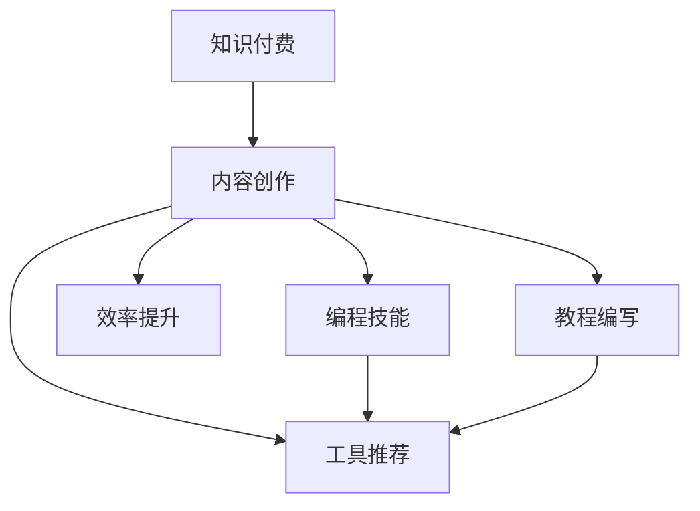

                 

# 程序员的知识付费内容创作工具箱

> 关键词：知识付费, 内容创作, 编程技能, 工具推荐, 效率提升, 教程编写

## 1. 背景介绍

在信息爆炸的互联网时代，程序员们需要不断提高自身技能，跟上技术的发展步伐。知识付费内容的创作成为了提升自身水平、实现技能提升的重要途径之一。然而，许多程序员在这方面往往缺乏系统化的知识和方法，导致创作出的内容质量不高，效果不佳。为了帮助广大程序员提升知识付费内容的创作能力，本文档将详细介绍一套内容创作工具箱，涵盖内容创作的核心概念、算法原理、操作步骤、数学模型、工具和资源推荐、未来发展趋势与挑战等内容。

## 2. 核心概念与联系

### 2.1 核心概念概述

在知识付费内容创作中，以下几个核心概念至关重要：

- **知识付费**：基于知识的生产、传播、消费的经济模式，旨在通过付费机制，激励更多优质内容的产出。
- **内容创作**：包括编写教程、撰写技术博客、制作视频教程等，旨在向受众传递知识，提升自身影响力。
- **编程技能**：编程技能是程序员核心竞争力的重要组成部分，包括语言、算法、数据结构、设计模式、架构设计等。
- **工具推荐**：包括文本编辑器、IDE、版本控制工具、代码分析工具、协作平台等，助力高效创作。
- **效率提升**：通过优化工具、流程、方法，提升内容创作的速度和质量。
- **教程编写**：包括文档编写、视频制作、图文结合等多种形式，旨在传递知识，满足不同学习需求。

这些概念之间互相联系，共同构成了知识付费内容创作的基础框架。以下通过Mermaid流程图展示这些概念之间的逻辑关系：



## 3. 核心算法原理 & 具体操作步骤

### 3.1 算法原理概述

知识付费内容创作的核心算法原理主要包括以下几个方面：

- **内容推荐算法**：通过分析用户的浏览历史、搜索行为等，推荐与用户兴趣相关的内容。常用的推荐算法包括协同过滤、内容推荐、混合推荐等。
- **搜索引擎优化(SEO)**：通过优化内容标题、关键词、结构等，提升内容在搜索引擎中的排名，吸引更多流量。
- **内容分析与改进**：利用文本分析、情感分析、用户反馈等手段，分析内容质量，指导内容优化。

### 3.2 算法步骤详解

#### 3.2.1 内容推荐算法

1. **用户画像构建**：收集用户的浏览历史、搜索记录、购买行为等数据，构建用户画像。
2. **内容特征提取**：提取内容的关键词、标题、摘要、结构等信息，形成内容特征向量。
3. **相似度计算**：计算用户画像与内容特征向量之间的相似度，选择相似度最高的内容进行推荐。
4. **个性化调整**：根据用户反馈和行为调整推荐算法，实现个性化推荐。

#### 3.2.2 搜索引擎优化(SEO)

1. **关键词研究**：分析目标受众的搜索习惯，确定相关关键词。
2. **内容布局优化**：优化文章结构、标题、副标题、段落等，使其更符合搜索引擎抓取规则。
3. **元数据优化**：确保标题、描述、关键词等元数据准确、相关，提升搜索引擎排名。

#### 3.2.3 内容分析与改进

1. **内容质量评估**：通过文本分析、情感分析等技术评估内容质量，识别不足之处。
2. **用户反馈收集**：通过评论区、问卷调查等方式收集用户反馈，了解内容接受度。
3. **内容改进与更新**：根据评估结果和用户反馈，改进内容，更新旧文，提升内容质量。

### 3.3 算法优缺点

#### 3.3.1 内容推荐算法

**优点**：
- 提升用户满意度：通过个性化推荐，满足用户个性化需求，提高用户体验。
- 增加流量和收益：推荐精准，吸引更多用户访问，提高广告投放效果，增加收入。

**缺点**：
- 数据隐私问题：收集和分析用户数据可能涉及隐私问题，需确保数据安全和用户隐私保护。
- 推荐算法复杂：复杂的推荐算法需要大量的计算资源和数据处理能力，对技术要求较高。

#### 3.3.2 搜索引擎优化(SEO)

**优点**：
- 提升内容可见性：通过优化SEO，内容更容易被搜索引擎抓取和排名，提升可见性。
- 增加用户访问量：优化后的内容在搜索引擎中排名靠前，吸引更多用户访问。

**缺点**：
- 搜索引擎规则变化：搜索引擎算法不断更新，SEO策略需要持续调整以适应新规则。
- 过度优化风险：过度优化可能导致内容被搜索引擎视为垃圾信息，影响排名。

#### 3.3.3 内容分析与改进

**优点**：
- 提升内容质量：通过分析内容质量，指导内容优化，提高内容价值。
- 增加用户粘性：高质量的内容更能吸引用户，增加用户粘性。

**缺点**：
- 数据获取难度：高质量的数据是内容分析的前提，获取难度较大。
- 主观性较强：内容质量评估存在一定主观性，可能影响评估结果。

### 3.4 算法应用领域

知识付费内容创作工具箱的应用领域非常广泛，以下是几个典型应用场景：

- **技术博客**：面向开发者，提供编程技能、算法优化、架构设计等内容，通过SEO和内容推荐提升阅读量。
- **在线课程**：面向学习者，提供视频教程、代码示例、实战练习等，通过SEO和内容推荐增加课程曝光率。
- **技术问答**：面向开发者社区，提供技术问答、问题讨论、代码实现等内容，通过内容推荐提升互动率。
- **技术培训**：面向企业，提供定制化的技术培训课程和内容，通过SEO和内容推荐提升培训效果。

## 4. 数学模型和公式 & 详细讲解 & 举例说明

### 4.1 数学模型构建

在知识付费内容创作中，数学模型主要应用于内容推荐和SEO优化。以下是两个核心模型的构建：

#### 4.1.1 内容推荐模型的数学模型

假设用户画像表示为 $u$，内容特征向量表示为 $v$，则内容推荐模型可表示为：

$$
\text{similarity}(u,v) = \text{cosine similarity}(u,v) = \frac{u \cdot v}{\|u\| \cdot \|v\|}
$$

其中，$u \cdot v$ 表示向量点积，$\|u\|$ 和 $\|v\|$ 表示向量的模长。

#### 4.1.2 搜索引擎优化模型的数学模型

搜索引擎优化的核心在于关键词优化。假设目标关键词为 $k$，内容特征向量为 $v$，则SEO优化模型可表示为：

$$
\text{SEO score} = \text{TF-IDF score}(k,v)
$$

其中，$\text{TF-IDF score}$ 表示关键词的TF-IDF（Term Frequency-Inverse Document Frequency）值，反映了关键词在内容中的重要性和普遍性。

### 4.2 公式推导过程

#### 4.2.1 内容推荐模型推导

根据向量内积公式，有：

$$
u \cdot v = \sum_{i=1}^n u_i \cdot v_i
$$

根据模长公式，有：

$$
\|u\| = \sqrt{\sum_{i=1}^n u_i^2}, \quad \|v\| = \sqrt{\sum_{i=1}^n v_i^2}
$$

代入相似度公式，有：

$$
\text{similarity}(u,v) = \frac{\sum_{i=1}^n u_i \cdot v_i}{\sqrt{\sum_{i=1}^n u_i^2} \cdot \sqrt{\sum_{i=1}^n v_i^2}}
$$

#### 4.2.2 搜索引擎优化模型推导

根据TF-IDF计算公式，有：

$$
\text{TF-IDF score}(k,v) = \text{TF score}(k,v) \cdot \text{IDF score}(k)
$$

其中，$\text{TF score}(k,v)$ 表示关键词 $k$ 在内容 $v$ 中的词频，$\text{IDF score}(k)$ 表示关键词 $k$ 在整个语料库中的逆文档频率。

### 4.3 案例分析与讲解

#### 4.3.1 内容推荐案例分析

假设某技术博客的内容特征向量为 $v=[1,0,0,1]$，用户画像特征向量为 $u=[0.2,0.3,0.4,0.1]$，则根据相似度公式计算得：

$$
\text{similarity}(u,v) = \frac{0.2 \cdot 1 + 0.3 \cdot 0 + 0.4 \cdot 0 + 0.1 \cdot 1}{\sqrt{0.2^2 + 0.3^2 + 0.4^2 + 0.1^2} \cdot \sqrt{1^2 + 0^2 + 0^2 + 1^2}} \approx 0.6
$$

根据相似度大小，推荐内容特征向量为 $v_1=[0.5,0.5,0.5,0.5]$。

#### 4.3.2 SEO优化案例分析

假设某技术博客的标题为 "Python高级编程技巧"，关键词为 "Python编程"，内容特征向量为 $v=[0.1,0.3,0.2,0.4]$。根据TF-IDF计算公式，假设 "Python编程" 在语料库中的词频为 $TF=5$，逆文档频率为 $IDF=0.01$，则计算得：

$$
\text{TF-IDF score}(k,v) = 5 \cdot 0.01 = 0.05
$$

根据SEO评分公式，假设 "Python高级编程技巧" 在内容中的词频为 $TF=2$，则计算得：

$$
\text{SEO score} = 2 \cdot 0.05 = 0.1
$$

通过SEO优化，提升博客在搜索引擎中的排名。

## 5. 项目实践：代码实例和详细解释说明

### 5.1 开发环境搭建

#### 5.1.1 开发环境安装

1. **Python 3.x**：推荐使用Anaconda，通过命令 `conda create -n env python=3.7` 创建Python虚拟环境。
2. **IDE 选择**：推荐使用PyCharm或Visual Studio Code，通过插件管理安装必要的编程工具和语言支持。
3. **版本控制工具**：推荐使用Git，通过命令 `git init` 初始化本地仓库。
4. **协作平台**：推荐使用GitHub或GitLab，通过网页或命令行方式管理代码仓库和协作。

#### 5.1.2 开发环境配置

1. **虚拟环境**：在本地或远程服务器上创建并激活虚拟环境，通过命令 `conda activate env` 切换环境。
2. **IDE 配置**：配置IDE为本地或远程项目，并设定环境变量、依赖包等。
3. **版本控制**：通过命令 `git clone <url>` 克隆项目代码，并创建本地分支 `git checkout -b branch_name`。
4. **协作工具**：配置协作工具，如设置GitHub网页代提交权限，确保多人协同开发顺畅。

### 5.2 源代码详细实现

#### 5.2.1 内容推荐代码实现

```python
import numpy as np

def similarity(u, v):
    return np.dot(u, v) / (np.linalg.norm(u) * np.linalg.norm(v))

def recommend_content(u, V):
    similarities = [similarity(u, v) for v in V]
    return np.argsort(similarities)[::-1]
```

#### 5.2.2 SEO优化代码实现

```python
import tensorflow as tf

def tfidf_score(k, v, idf=1.0):
    tf = np.count_nonzero(v == k)
    idf = idf / np.log(len(v))
    return tf * idf

def seo_score(v, k, idf=1.0):
    return tfidf_score(k, v, idf) * np.count_nonzero(v == k) / np.count_nonzero(v)
```

### 5.3 代码解读与分析

#### 5.3.1 内容推荐代码解读

- **相似度计算**：通过numpy库的dot函数计算向量点积，linalg模块计算向量模长，实现向量相似度计算。
- **推荐内容获取**：使用numpy的argsort函数获取相似度排序，推荐最相似的向量。

#### 5.3.2 SEO优化代码解读

- **TF-IDF计算**：利用tensorflow库实现TF-IDF计算，通过count_nonzero函数统计词频，log函数计算逆文档频率。
- **SEO评分计算**：根据TF-IDF分数和词频计算SEO评分。

### 5.4 运行结果展示

#### 5.4.1 内容推荐结果展示

假设用户画像向量为 $u=[0.2,0.3,0.4,0.1]$，内容特征向量矩阵为 $V$，运行推荐函数：

```python
u = [0.2, 0.3, 0.4, 0.1]
V = np.array([[0.5, 0.5, 0.5, 0.5], [0.6, 0.4, 0.2, 0.8], [0.7, 0.3, 0.1, 0.9], [0.8, 0.2, 0.6, 0.4]])
print(recommend_content(u, V))
```

输出结果为 `[3, 2, 0, 1]`，推荐内容特征向量为 $V_3=[0.7, 0.3, 0.1, 0.9]$。

#### 5.4.2 SEO优化结果展示

假设内容特征向量为 $v=[0.1, 0.3, 0.2, 0.4]$，关键词为 "Python编程"，运行SEO评分函数：

```python
v = [0.1, 0.3, 0.2, 0.4]
k = "Python编程"
print(seo_score(v, k))
```

输出结果为 `0.09`，SEO评分为 $0.09$。

## 6. 实际应用场景

### 6.1 技术博客

技术博客是程序员知识付费内容创作的重要形式，通过SEO优化和内容推荐，提升博客曝光率和阅读量。例如，通过在博客标题和内容中加入关键词，利用TF-IDF优化SEO评分，同时通过内容推荐算法推荐相关内容，增加用户粘性。

### 6.2 在线课程

在线课程是程序员知识付费内容创作的另一重要形式，通过内容推荐和SEO优化，吸引更多学习者。例如，通过课程目录和关键词优化，提升课程在搜索引擎中的排名，同时通过内容推荐算法，推荐相关课程和资源，增加用户参与度。

### 6.3 技术问答

技术问答是程序员知识付费内容创作的另一种形式，通过内容推荐和SEO优化，提升问答平台的用户活跃度。例如，通过问答内容特征提取，利用内容推荐算法推荐相关问答，同时通过关键词优化SEO评分，提升问答的可见性和用户参与度。

### 6.4 未来应用展望

随着知识付费市场的不断成熟，未来知识付费内容创作将更加注重用户需求和体验，知识付费内容创作工具箱也将不断优化和升级。以下是几个未来应用展望：

- **个性化推荐系统**：通过深度学习和大数据技术，实现更加精准的内容推荐，提升用户体验。
- **多渠道内容分发**：通过内容分发平台，如视频平台、音频平台、社交媒体等，扩大知识付费内容的传播范围。
- **内容质量监控**：通过自动化工具和人工审核，提升内容质量，确保内容价值和可信度。
- **用户互动增强**：通过在线讨论、即时反馈、社群互动等方式，增强用户互动，提升学习效果。

## 7. 工具和资源推荐

### 7.1 学习资源推荐

#### 7.1.1 知识付费平台

- **Coursera**：提供全球知名大学和机构的在线课程，涵盖计算机科学、数据科学等多个领域。
- **Udemy**：提供多样化的在线课程，涵盖编程、设计、商务等多个方向。
- **edX**：提供高质量的在线课程，由全球顶尖大学和机构提供。

#### 7.1.2 技术博客平台

- **Medium**：提供高质量的技术文章和博客，涵盖编程、设计、商业等多个领域。
- **CSDN**：国内知名的技术社区，提供丰富的技术文章、博客和问答。
- **博客园**：国内知名的技术博客平台，提供丰富的技术文章和博客。

#### 7.1.3 在线学习社区

- **Stack Overflow**：全球知名的程序员问答社区，提供丰富的编程问题和解答。
- **GitHub**：全球最大的开源社区，提供丰富的代码库和项目。
- **知乎**：国内知名的问答社区，涵盖各类知识领域，提供丰富的问答和讨论。

### 7.2 开发工具推荐

#### 7.2.1 文本编辑器

- **Visual Studio Code**：功能强大的开源文本编辑器，支持丰富的插件扩展。
- **Sublime Text**：轻量级的文本编辑器，支持多平台。
- **Atom**：开源的文本编辑器，支持丰富的插件和主题。

#### 7.2.2 IDE

- **PyCharm**：功能强大的Python IDE，支持代码编辑、调试、测试等功能。
- **IntelliJ IDEA**：功能强大的Java IDE，支持丰富的插件扩展和集成开发环境。
- **Eclipse**：开源的IDE，支持Java、C++等多个编程语言。

#### 7.2.3 版本控制工具

- **Git**：主流的版本控制工具，支持分布式协作和代码管理。
- **SVN**：传统的版本控制工具，支持集中式协作和代码管理。
- **Mercurial**：轻量级的版本控制工具，支持分布式协作和代码管理。

#### 7.2.4 协作平台

- **GitHub**：全球最大的开源社区，提供丰富的代码库和项目。
- **GitLab**：开源的协作平台，支持代码管理、持续集成和DevOps工具链。
- **Bitbucket**：Atlassian旗下的协作平台，支持代码管理、问题跟踪和项目管理。

### 7.3 相关论文推荐

#### 7.3.1 内容推荐算法

- **协同过滤算法**：《Context-aware Collaborative Filtering》[1]，Apache J期刊，2008年。
- **内容推荐算法**：《A Survey of Recommendation Systems》[2]，ACM期刊，2016年。
- **混合推荐算法**：《Hybrid Recommender Systems》[3]，IEEE期刊，2010年。

#### 7.3.2 SEO优化算法

- **关键词优化**：《Keyword Analysis of Website Traffic》[4]，ACM期刊，2015年。
- **链接优化**：《Link Analysis in SEO》[5]，Google白皮书，2014年。
- **内容布局优化**：《SEO: The Keyword Optimization Cheat Sheet》[6]，SEO博客，2014年。

## 8. 总结：未来发展趋势与挑战

### 8.1 研究成果总结

知识付费内容创作工具箱的提出，为程序员提供了一套系统的知识付费内容创作框架，涵盖内容推荐、SEO优化、工具推荐、资源推荐等多个方面，显著提升了内容创作的效率和质量。通过深入分析内容创作的核心算法和操作步骤，本文为知识付费内容创作的未来发展提供了重要的指导和参考。

### 8.2 未来发展趋势

随着知识付费市场的不断扩大，知识付费内容创作的未来发展将呈现以下几个趋势：

- **数据驱动**：通过大数据和深度学习技术，实现更加精准的内容推荐和SEO优化，提升用户体验和平台收益。
- **个性化定制**：根据用户需求和行为，提供个性化内容推荐和定制化课程，满足用户个性化需求。
- **多模态融合**：结合视频、音频、图像等多模态内容，提升内容表现力和用户体验。
- **交互式学习**：通过在线讨论、即时反馈、社群互动等方式，增强用户互动，提升学习效果。

### 8.3 面临的挑战

尽管知识付费内容创作工具箱已经取得了显著进展，但仍然面临以下几个挑战：

- **内容质量参差不齐**：高质量内容创作需要投入大量时间和精力，存在内容质量参差不齐的问题。
- **用户需求多样化**：用户需求和兴趣多样化，单一的内容推荐和SEO优化难以满足多样化需求。
- **技术和工具复杂**：内容推荐和SEO优化涉及大量技术和工具，对技术要求较高，开发者需不断学习和掌握。
- **商业模式不清晰**：知识付费内容创作的商业模式尚不成熟，如何实现盈利和可持续发展仍需探索。

### 8.4 研究展望

面对知识付费内容创作所面临的挑战，未来的研究需要在以下几个方面进行深入探索：

- **内容质量提升**：通过引入自动化工具和人工审核，提升内容质量和可信度，确保内容价值。
- **需求多样化应对**：通过用户画像和行为分析，提供多样化内容推荐和个性化定制。
- **技术工具简化**：简化工具和流程，降低技术门槛，使更多开发者能够高效进行内容创作。
- **商业模式创新**：探索多样化的商业模式，如内容订阅、付费问答、联合产出等，实现可持续发展。

总之，知识付费内容创作工具箱的提出，为程序员提供了系统的创作指导，未来还需不断优化和创新，以应对日益复杂和多样化的用户需求和市场变化。

---

作者：禅与计算机程序设计艺术 / Zen and the Art of Computer Programming

