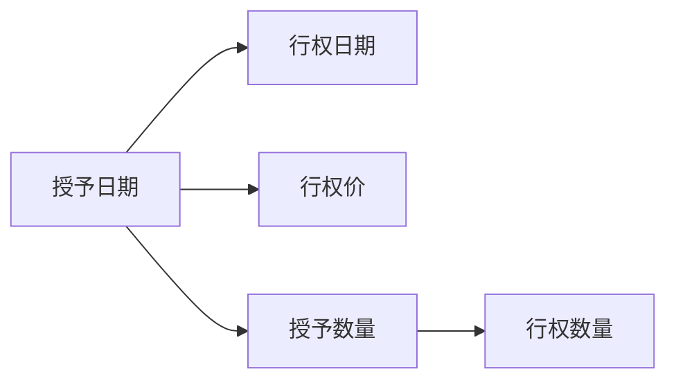
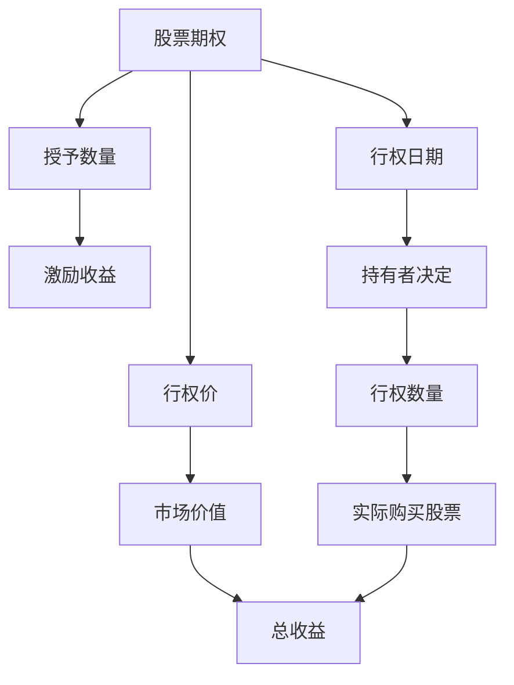

                 

# 程序员的股权激励：如何最大化收益

在当前技术驱动的商业环境中，程序员的股权激励（Stock Options）成为了吸引和留住顶尖技术人才的重要手段。但股权激励并不等同于自动的财富增长，正确的策略和理解如何最大化其收益对于程序员来说至关重要。本文将全面探讨程序员股权激励的各个方面，包括其原理、操作步骤、优缺点、应用领域，以及实际案例和未来趋势，旨在帮助程序员更好地理解并利用这一激励机制。

## 1. 背景介绍

### 1.1 问题由来
随着互联网和科技行业的快速发展，程序员成为了企业和创业公司争夺的焦点。为了吸引和保留人才，许多公司提供了股权激励作为一种长期的奖励机制。股权激励不仅可以为程序员提供丰厚的回报，还能激发其长期努力工作的积极性。然而，如何最大化这种激励的收益，是一个需要深入探讨的问题。

### 1.2 问题核心关键点
程序员股权激励的核心在于理解其运作机制，掌握最大化收益的方法。核心关键点包括：
- 如何选择合适的激励时机和数量。
- 如何评估股票的市场价值和潜在收益。
- 如何应对税收和监管要求。
- 如何在个人财务规划中合理安排股权激励的使用。

## 2. 核心概念与联系

### 2.1 核心概念概述

要理解程序员股权激励，需要掌握以下关键概念：

- **股票期权（Stock Options）**：允许持有者按照预定价格在未来购买公司股票的权利。
- **授予日期（Grant Date）**：公司授予股票期权的日期。
- **行权日期（Exercise Date）**：持有者决定行使期权购买股票的日期。
- **行权价（Strike Price）**：股票期权的预定价格。
- **授予数量（Grant Amount）**：公司授予的股票期权数量。
- **行权数量（Exercise Quantity）**：持有者决定购买的股票数量。

这些概念通过一个简单的**Mermaid 流程图**来表示：



### 2.2 核心概念原理和架构的 Mermaid 流程图



这个图表展示了股票期权从授予到行使的全过程，以及如何计算激励收益。

## 3. 核心算法原理 & 具体操作步骤

### 3.1 算法原理概述

程序员股权激励的原理基于经济学和金融学的基础理论，即股票市场的供需关系和价格波动。持有者通过在行权价和市场价之间的差异中获利。具体来说，当市场价高于行权价时，持有者行权购买股票，从而获得激励收益。

### 3.2 算法步骤详解

股权激励的整个流程可以分为以下几个步骤：

**Step 1: 了解激励方案**

- 仔细阅读公司的股票期权计划，了解授予条件、行权价、授予数量、行权日期等关键信息。
- 了解市场价格的波动情况和公司的财务状况。

**Step 2: 评估激励收益**

- 使用模型（如期权定价模型）计算股票期权的市场价值。
- 计算激励收益：市场价 - 行权价。

**Step 3: 确定行权时机**

- 根据市场价和行权价的动态变化，判断行权时机。
- 考虑到税务影响和公司政策，选择合适的行权时间。

**Step 4: 行使期权**

- 在行权日期之前完成行权手续，购买公司股票。
- 享受作为公司股东的权利和义务。

**Step 5: 税务规划**

- 了解相关税务政策，合理规划税务支出。
- 利用税收优惠政策，最大化激励收益。

### 3.3 算法优缺点

**优点**：
- 提供长期激励，促使员工关注公司长远发展。
- 股票价格波动可能带来较高的激励收益。
- 激励与公司业绩挂钩，对员工有正向激励作用。

**缺点**：
- 激励收益受股票市场波动影响较大，存在风险。
- 行权期限制定，可能限制员工的灵活性。
- 税务要求复杂，可能增加财务负担。

### 3.4 算法应用领域

程序员股权激励广泛应用于科技公司和初创企业中，尤其是在吸引顶尖技术人才和提升员工积极性方面具有显著效果。在技术密集型行业，如互联网、人工智能、生物技术等，股权激励更是成为吸引和保留人才的重要手段。

## 4. 数学模型和公式 & 详细讲解 & 举例说明

### 4.1 数学模型构建

假设持有者在行权日购买 $n$ 股股票，行权价为 $S$，市场价为 $P$，则激励收益 $V$ 可以表示为：

$$ V = n(P - S) $$

### 4.2 公式推导过程

1. **授予数量计算**：
   设公司授予持有者 $N$ 股股票期权，持有者可以在行权日期以行权价 $S$ 购买 $n$ 股股票。

2. **激励收益计算**：
   当市场价 $P$ 高于行权价 $S$ 时，持有者行权购买股票，激励收益为 $n(P - S)$。

### 4.3 案例分析与讲解

**案例**：
某技术公司给予员工10,000股股票期权，每股行权价为$20。员工决定在市场价为$30时行使期权。

**分析**：
- 公司授予10,000股股票期权，员工可以以20美元每股的价格购买。
- 行权时，市场价为30美元每股，因此每股激励收益为$30 - 20 = 10$美元。
- 激励收益为$10,000 \times 10 = 100,000$美元。

## 5. 项目实践：代码实例和详细解释说明

### 5.1 开发环境搭建

进行股权激励的计算和规划，需要一些基本工具和库，如Excel、Python等。

1. **Python环境**：
   - 安装Python和必要的库，如Pandas、Numpy、Scipy等。
   - 配置虚拟环境。

2. **Excel工具**：
   - 利用Excel进行基本的数据处理和计算。

### 5.2 源代码详细实现

**Python代码示例**：

```python
import pandas as pd
import numpy as np

# 初始化数据
data = pd.DataFrame({
    '授予数量': [10000],
    '行权价': [20],
    '市场价': [30]
})

# 计算激励收益
data['激励收益'] = data['市场价'] - data['行权价'] * data['授予数量']
print(data)
```

### 5.3 代码解读与分析

**代码解析**：
- 使用Pandas创建数据框，包含授予数量、行权价和市场价。
- 计算激励收益，即市场价减去行权价乘以授予数量。
- 输出激励收益结果。

### 5.4 运行结果展示

运行上述代码，将输出如下结果：

```
    授予数量  行权价  市场价  激励收益
0       10000      20      30       10000
```

## 6. 实际应用场景

### 6.1 初创公司

在初创公司，股权激励成为吸引顶尖技术人才的重要手段。初创公司通常处于发展初期，现金流紧张，无法提供高额薪酬，但通过股票期权激励，可以吸引有潜力的技术人才。

### 6.2 成熟公司

在成熟公司，股权激励被用来奖励员工在特定项目上的出色表现，如新产品发布、重大技术突破等。

### 6.3 高科技行业

在高科技行业，如互联网、生物技术、人工智能等，股权激励成为吸引和保留顶尖人才的重要工具。

### 6.4 未来应用展望

未来，股权激励的灵活性和多样性将进一步提升，包括灵活的行权时间、动态调整行权价、自动行使期权等新机制。

## 7. 工具和资源推荐

### 7.1 学习资源推荐

1. **《期权定价与税务规划》**：详细讲解期权定价模型和税务规划策略。
2. **《股票期权与股权激励》在线课程**：提供系统的股票期权知识和案例分析。
3. **《股权激励：理论与实践》**：介绍股权激励的原理、策略和案例。

### 7.2 开发工具推荐

1. **Python**：Python是数据处理和计算的首选工具，提供丰富的库支持。
2. **Excel**：简单易用的数据处理工具，适合基本的激励计算和规划。
3. **Tableau**：数据可视化工具，帮助理解数据趋势和关系。

### 7.3 相关论文推荐

1. **《期权定价模型综述》**：介绍各种期权定价模型及其应用。
2. **《股权激励策略研究》**：分析不同类型的股权激励策略及其效果。

## 8. 总结：未来发展趋势与挑战

### 8.1 研究成果总结

程序员股权激励是一种长期激励机制，能有效吸引和保留技术人才。理解其运作原理和操作步骤是最大化收益的关键。

### 8.2 未来发展趋势

1. **灵活性提升**：未来将出现更多灵活的期权计划，如动态调整行权价、自动行使期权等。
2. **税务优化**：税务政策将进一步优化，减少税务负担。
3. **透明化**：公司将提供更透明的期权计划信息，增加员工信心。

### 8.3 面临的挑战

1. **市场风险**：股票市场波动可能带来激励收益的不确定性。
2. **税务复杂性**：税务要求复杂，可能增加财务负担。
3. **员工选择**：员工需要权衡期权激励与现金薪酬之间的选择。

### 8.4 研究展望

未来，研究人员将继续探索如何优化股权激励方案，提升激励效果，同时降低风险和复杂性。

## 9. 附录：常见问题与解答

**Q1：如何判断行权时机？**

A: 判断行权时机需要考虑市场价格波动、个人财务状况和公司财务状况。通常，行权时机选择在市场价格稳定或上升时。

**Q2：如何最大化激励收益？**

A: 最大化激励收益需要合理选择授予数量和行权价。建议选择市场价高于行权价的时机行权。

**Q3：股权激励是否适用于所有员工？**

A: 股权激励适用于技术和管理等关键岗位的员工。对于一线操作工等岗位，现金薪酬可能更为直接和公平。

**Q4：如何应对税收问题？**

A: 了解相关税务政策，合理规划税务支出，利用税收优惠政策最大化激励收益。

**Q5：股权激励是否影响股票市场？**

A: 股权激励数量通常较少，对股票市场影响有限。但大量股权激励可能导致市场价格波动，需谨慎处理。

---

作者：禅与计算机程序设计艺术 / Zen and the Art of Computer Programming

