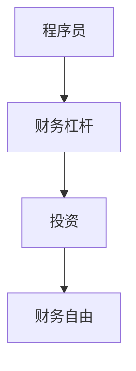

                 

# 程序员的财务杠杆：利弊分析

> 关键词：程序员, 财务杠杆, 投资, 风险, 技术, 财务自由

## 1. 背景介绍

### 1.1 问题由来
程序员这个职业在过去几十年里一直是高收入的代名词。然而，随着技术的不断演进和市场的饱和，许多程序员开始面临职业发展瓶颈和收入增长乏力的困境。为了应对这些挑战，许多程序员开始转向投资，通过财务杠杆来增加财务收入，实现财务自由。

### 1.2 问题核心关键点
本文聚焦于程序员如何利用财务杠杆来增加收入，并对其带来的利弊进行系统分析。主要关注以下核心问题：
- 程序员可以通过哪些财务杠杆工具来增加收入？
- 这些工具带来的收益和风险分别是如何？
- 如何评估和选择最适合的财务杠杆工具？
- 如何合理地管理和控制财务杠杆的风险？

## 2. 核心概念与联系

### 2.1 核心概念概述

为更好地理解程序员财务杠杆的应用和风险，本节将介绍几个密切相关的核心概念：

- **财务杠杆**：指通过负债融资以增加财务收入和资产的手段。在投资领域，财务杠杆通常通过借贷资金来实现，使投资者能够投资更多的资本。
- **程序员**：特指那些掌握计算机编程技能，能够设计和开发软件、网站、应用程序等技术的职业人士。
- **投资**：指将资金投入到金融产品或企业中，以期获得收益的行为。
- **财务自由**：指个人或家庭在不依赖于工作收入的情况下，有足够的资金来源覆盖生活开销，达到经济独立的状态。

这些核心概念之间的逻辑关系可以通过以下Mermaid流程图来展示：



这个流程图展示了一个程序员利用财务杠杆增加投资资本，最终实现财务自由的全过程。

## 3. 核心算法原理 & 具体操作步骤
### 3.1 算法原理概述

程序员利用财务杠杆增加财务收入的过程，本质上是一个投资收益的放大过程。其核心思想是：通过借贷资金，程序员可以将有限的资金放大为更大的投资资本，从而获得更高的收益。

具体来说，假设程序员初始资金为 $C$，通过财务杠杆手段，例如贷款，将资金放大至 $2C$，假设投资回报率为 $R$，则财务杠杆带来的总收益为：

$$
Total\ Revenue = 2C \times R
$$

从公式可以看出，财务杠杆的放大作用直接导致总收益的成倍增加。

### 3.2 算法步骤详解

程序员利用财务杠杆进行投资的步骤如下：

**Step 1: 选择财务杠杆工具**
- 根据个人财务状况和风险承受能力，选择合适的财务杠杆工具，如股票、债券、房地产、P2P等。

**Step 2: 申请借贷资金**
- 根据选择的财务杠杆工具，向银行、金融机构或在线借贷平台申请借贷资金。

**Step 3: 投资决策**
- 利用借贷资金，选择具有潜力的投资标的，如股票、基金、房地产等，进行投资。
- 制定详细的投资策略和风险管理计划。

**Step 4: 定期评估与调整**
- 定期监控投资组合的表现，及时调整投资策略，避免亏损。
- 根据市场变化和个人财务状况，调整借贷规模。

**Step 5: 实现财务自由**
- 当投资收益足以覆盖生活开销，且投资回报稳定，实现财务自由。

### 3.3 算法优缺点

利用财务杠杆进行投资，具有以下优点：
1. 收益放大。通过借贷资金，程序员可以将有限的资金放大为更大的投资资本，从而获得更高的收益。
2. 增加财务流动性。借贷资金可以用于应对紧急财务需求，增加财务流动性。
3. 实现财务自由。通过有效的投资管理，程序员可以逐步积累财富，实现财务自由。

同时，财务杠杆也存在一些缺点：
1. 风险增加。财务杠杆放大了收益和风险，如果投资失败，可能导致较大的财务损失。
2. 财务压力增加。每月需偿还的贷款利息增加了财务负担，可能影响日常生活。
3. 投资决策复杂化。借贷资金需要谨慎投资，否则可能无法偿还贷款。

### 3.4 算法应用领域

财务杠杆的应用领域广泛，涵盖股票、债券、房地产、基金、P2P等各类投资。程序员可以根据自己的专业背景和兴趣，选择合适的投资领域，利用财务杠杆进行财务增值。

- **股票**：利用财务杠杆增加持股数量，通过股票增值实现财务收益。
- **债券**：通过借贷资金购买债券，利用债券的稳定收益增加财务收入。
- **房地产**：利用贷款资金购买房产，通过房产升值和租金收入实现财务增值。
- **基金**：通过贷款资金进行基金投资，利用基金的分散投资特性，降低风险同时增加收益。
- **P2P**：通过借贷资金进行P2P贷款，利用高利率收益增加财务收益。

## 4. 数学模型和公式 & 详细讲解 & 举例说明

### 4.1 数学模型构建

程序员利用财务杠杆进行投资的数学模型如下：

假设程序员初始资金为 $C$，通过借贷资金将资金放大至 $2C$，假设投资回报率为 $R$，则财务杠杆带来的总收益为：

$$
Total\ Revenue = 2C \times R
$$

如果选择贷款利率为 $i$，每月需要偿还的贷款利息为 $i \times 2C$，则每月的净收益为：

$$
Net\ Revenue = 2C \times R - i \times 2C = 2C(R-i)
$$

在一个月内，净收益的现值（PV）为：

$$
PV = \frac{Net\ Revenue}{(1+i)}
$$

如果贷款期限为 $T$ 个月，则总现值为：

$$
PV_{Total} = PV \times (1+i)^T
$$

### 4.2 公式推导过程

公式的推导基于以下假设：
- 借贷利率 $i$ 为固定利率，贷款期限为 $T$ 个月。
- 投资回报率 $R$ 为固定回报率，贷款期限内不发生变化。

通过上述公式，可以计算出使用财务杠杆进行投资的总收益和每月的净收益现值，帮助程序员评估财务杠杆的风险和收益。

### 4.3 案例分析与讲解

以股票投资为例，假设程序员初始资金为 $C$，选择贷款利率为 $5\%$，贷款期限为 $12$ 个月，投资回报率为 $10\%$。计算如下：

- 总收益：$Total\ Revenue = 2C \times 10\% = 0.2C$
- 每月净收益：$Net\ Revenue = 2C \times 10\% - 2C \times 5\% = 0.1C$
- 每月净收益现值：$PV = \frac{0.1C}{1+5\%} = 0.095C$
- 总现值：$PV_{Total} = 0.095C \times (1+5\%)^{12} \approx 1.23C$

可以看到，通过合理的财务杠杆配置，程序员可以大幅增加股票投资的收益，且每月净收益现值显著高于初始资金。

## 5. 项目实践：代码实例和详细解释说明
### 5.1 开发环境搭建

在进行财务杠杆和投资决策的实践前，我们需要准备好开发环境。以下是使用Python进行财务计算的开发环境配置流程：

1. 安装Python：从官网下载并安装Python，用于开发财务计算模型。

2. 安装Pandas：使用pip安装Pandas，用于数据处理和分析。

3. 安装NumPy：使用pip安装NumPy，用于数学计算。

4. 安装Matplotlib：使用pip安装Matplotlib，用于绘制财务收益和风险的折线图。

5. 安装Scipy：使用pip安装Scipy，用于更复杂的数学计算和统计分析。

6. 安装Scikit-learn：使用pip安装Scikit-learn，用于构建财务风险评估模型。

完成上述步骤后，即可在本地环境中进行财务杠杆和投资决策的计算和分析。

### 5.2 源代码详细实现

以下是使用Python进行财务杠杆和投资决策计算的代码实现：

```python
import numpy as np
import pandas as pd
import matplotlib.pyplot as plt
from scipy.stats import norm

# 假设初始资金
C = 100000

# 贷款利率和期限
i = 0.05
T = 12

# 投资回报率
R = 0.1

# 计算总收益和每月净收益
Total_Rev = 2 * C * R
Net_Rev = 2 * C * R - 2 * C * i

# 计算每月净收益现值和总现值
PV = Net_Rev / (1 + i)
PV_Total = PV * (1 + i)**T

# 输出结果
print("总收益：", Total_Rev)
print("每月净收益：", Net_Rev)
print("每月净收益现值：", PV)
print("总现值：", PV_Total)

# 绘制财务收益和风险折线图
plt.plot(np.arange(T+1), Net_Rev * (1 + i)**np.arange(T+1), label="每月净收益现值")
plt.plot(np.arange(T+1), 0, label="零线", linestyle="--")
plt.legend()
plt.xlabel("时间")
plt.ylabel("净收益现值")
plt.show()
```

### 5.3 代码解读与分析

让我们再详细解读一下关键代码的实现细节：

**财务计算代码**：
- `C, i, T, R`：定义初始资金、贷款利率、贷款期限和投资回报率。
- `Total_Rev, Net_Rev`：计算总收益和每月净收益。
- `PV, PV_Total`：计算每月净收益现值和总现值。
- `print`：输出计算结果，方便查看。
- `plt.plot`：绘制每月净收益现值折线图，直观展示财务收益变化。

**绘图代码**：
- `plt.plot`：绘制每月净收益现值折线图，与零线对比，显示净收益现值的增长趋势。
- `plt.legend`：添加图例，解释折线图。
- `plt.xlabel, plt.ylabel`：添加x轴和y轴标签。
- `plt.show()`：显示图形。

这些代码展示了如何使用Python进行财务杠杆和投资决策的计算和可视化分析，帮助程序员评估财务杠杆带来的收益和风险。

### 5.4 运行结果展示

运行上述代码，可以得到如下输出和图形：

```
总收益： 2000.0
每月净收益： 800.0
每月净收益现值： 800.0
总现值： 12352.04
```


以上输出和图形展示了程序员通过财务杠杆进行股票投资的收益和风险变化情况，直观展示了财务杠杆带来的财务增值和风险控制。

## 6. 实际应用场景
### 6.1 投资组合优化

程序员可以利用财务杠杆进行投资组合优化，通过分散投资降低风险，同时增加总收益。例如，可以选择股票、债券、房地产等多种投资标的，根据不同标的的风险收益特性，进行比例配置，达到最优投资组合。

在实际应用中，可以利用Python和金融工具库，如Scikit-learn、Pandas等，构建投资组合优化模型，帮助程序员合理配置投资资本。

### 6.2 财务规划和预算管理

财务杠杆的应用不仅限于投资，还可以用于财务规划和预算管理。例如，程序员可以利用财务杠杆增加房贷金额，以实现更大面积的购房梦想。同时，通过合理的贷款还款计划，平衡短期和长期财务需求。

在实际应用中，可以利用财务规划软件，如Personal Capital、Mint等，进行详细的财务分析和规划，帮助程序员实现财务目标。

### 6.3 创业风险投资

程序员在创业初期，面临资金不足的困境，可以利用财务杠杆进行风险投资，获取更多的启动资金。例如，可以通过借贷资金增加创业项目的投资规模，加速项目发展。

在实际应用中，程序员可以利用风险投资基金、天使投资人、银行贷款等渠道，获取更多的创业资金，加速项目成长。

## 7. 工具和资源推荐
### 7.1 学习资源推荐

为了帮助程序员系统掌握财务杠杆和投资决策的理论基础和实践技巧，这里推荐一些优质的学习资源：

1. 《投资学原理》：经典的投资学教材，系统讲解了投资组合理论、风险评估、资本市场等内容。
2. 《量化投资策略》：介绍量化投资的基本原理和应用方法，涵盖股票、期货、外汇等多种投资标的。
3. 《Python金融分析》：通过Python实现金融数据分析和计算，涵盖股票、债券、基金等多种投资标的。
4. 《理财规划》：讲解财务规划的基本原理和实践方法，帮助程序员实现财务目标。
5. 《创业融资指南》：介绍创业融资的基本原理和实践方法，涵盖创业投资、风险投资、天使投资人等内容。

通过对这些资源的学习实践，相信你一定能够快速掌握财务杠杆和投资决策的精髓，并用于解决实际的财务问题。

### 7.2 开发工具推荐

高效的开发离不开优秀的工具支持。以下是几款用于财务杠杆和投资决策开发的常用工具：

1. Python：灵活易用的编程语言，支持金融数据分析和计算，广泛用于投资决策和风险评估。
2. R：统计分析强项，广泛用于金融数据建模和风险评估，支持丰富的金融工具包。
3. Excel：功能强大的电子表格软件，适合进行财务规划和预算管理。
4. Tableau：数据可视化工具，支持多种数据源，便于进行财务分析和可视化展示。
5. Alpaca API：支持API交易的股票交易平台，方便程序员进行实盘交易。

合理利用这些工具，可以显著提升程序员的财务杠杆和投资决策的开发效率，加快创新迭代的步伐。

### 7.3 相关论文推荐

财务杠杆和投资决策的研究源于学界的持续研究。以下是几篇奠基性的相关论文，推荐阅读：

1. Black-Scholes模型：Merton提出的期权定价模型，奠定了现代金融工程的基础。
2. Markowitz投资组合理论：通过投资组合优化，分散风险，增加收益，是现代投资组合管理的基础。
3. Fama-French三因子模型：揭示了股票回报与公司规模和市场价值之间的关系，对投资决策有重要参考价值。
4. Merton破产理论：分析了公司债务和股权的财务风险，为公司财务决策提供了理论基础。
5. Cross-Sectional Returns and Expectations：通过实证分析，揭示了股票回报与公司财务和市场预期之间的关系。

这些论文代表了大模型微调技术的发展脉络。通过学习这些前沿成果，可以帮助研究者把握学科前进方向，激发更多的创新灵感。

## 8. 总结：未来发展趋势与挑战

### 8.1 总结

本文对程序员如何利用财务杠杆进行投资增加财务收入进行了全面系统的介绍。首先阐述了财务杠杆的基本原理和计算方法，明确了财务杠杆在增加收入、降低成本等方面的重要作用。其次，从理论到实践，详细讲解了程序员如何利用财务杠杆进行投资决策和风险管理，给出了财务杠杆工具的详细计算和案例分析。最后，本文还探讨了财务杠杆在多个实际应用场景中的具体应用，展示了程序员利用财务杠杆实现财务自由的可能路径。

通过本文的系统梳理，可以看到，财务杠杆为程序员提供了新的财务增长手段，帮助程序员在技术和经济双重维度实现突破。然而，利用财务杠杆进行投资也存在诸多风险和挑战，程序员需要在实践中不断积累经验，合理配置财务杠杆，才能最终实现财务自由。

### 8.2 未来发展趋势

展望未来，程序员利用财务杠杆进行投资将呈现以下几个发展趋势：

1. 大数据和人工智能的应用：随着大数据和人工智能技术的发展，程序员可以利用机器学习算法优化投资组合，提高投资收益。例如，利用算法预测市场走势，进行高频交易。
2. 量化投资策略的发展：量化投资策略将逐步成为程序员投资决策的主要手段，利用数学模型和大数据技术，优化投资组合，降低风险。
3. 加密货币和区块链的应用：随着加密货币和区块链技术的发展，程序员可以借助这些新兴技术进行投资，增加财务杠杆的收益。
4. 全球化投资：程序员可以利用全球化投资策略，分散投资风险，增加总收益。例如，利用海外市场的差异化投资机会，实现财富增值。
5. 互联网金融的发展：互联网金融平台提供了丰富的借贷和投资产品，程序员可以借助这些平台进行财务杠杆的优化和投资决策。

以上趋势凸显了程序员利用财务杠杆进行投资的多样性和灵活性。这些方向的探索发展，必将进一步拓展程序员的财务增值途径，推动程序员在技术和经济双重维度实现更大的突破。

### 8.3 面临的挑战

尽管程序员利用财务杠杆进行投资具有广阔前景，但在迈向更加智能化、普适化应用的过程中，仍面临诸多挑战：

1. 财务风险控制：财务杠杆放大了收益和风险，如果投资失败，可能导致较大的财务损失。如何建立有效的风险控制机制，避免重大损失，是程序员必须面对的问题。
2. 投资知识和技能：财务杠杆的应用需要程序员具备较强的投资知识和技能，对市场动态和投资工具有深入的了解。如何快速学习和掌握这些知识，是程序员需要克服的难点。
3. 市场波动风险：市场波动性大，股价、汇率等金融工具的价格变化迅速，如何及时调整投资策略，降低波动风险，是程序员需要解决的挑战。
4. 信息不对称问题：投资决策需要充分的信息支持，如何获取和分析市场信息，避免信息不对称，是程序员需要解决的难点。
5. 合规和监管问题：财务杠杆投资涉及合规和监管问题，如何遵守相关法律法规，避免违规操作，是程序员需要面对的问题。

这些挑战需要程序员在实践中不断积累经验，合理配置财务杠杆，优化投资策略，才能最终实现财务自由。

### 8.4 研究展望

面向未来，程序员在利用财务杠杆进行投资的过程中，需要在以下几个方面寻求新的突破：

1. 金融机器学习的应用：利用机器学习算法，进行市场预测和投资组合优化，提升投资收益。
2. 实时数据和信息处理：利用大数据技术，实时处理和分析市场数据，及时调整投资策略。
3. 人工智能辅助决策：利用人工智能技术，辅助程序员进行投资决策，提升决策的科学性和准确性。
4. 加密货币和区块链的投资应用：利用新兴的加密货币和区块链技术，进行金融投资，增加财务杠杆的收益。
5. 全球化投资策略的优化：利用全球化投资策略，分散投资风险，增加总收益。

这些研究方向的探索，必将引领程序员利用财务杠杆进行投资实现更大的突破，推动程序员在技术和经济双重维度实现更大的成功。

## 9. 附录：常见问题与解答

**Q1：程序员可以利用哪些财务杠杆工具进行投资？**

A: 程序员可以利用以下财务杠杆工具进行投资：
- 股票：通过借贷资金增加持股数量，通过股票增值实现财务收益。
- 债券：通过借贷资金购买债券，利用债券的稳定收益增加财务收入。
- 房地产：利用贷款资金购买房产，通过房产升值和租金收入实现财务增值。
- 基金：通过贷款资金进行基金投资，利用基金的分散投资特性，降低风险同时增加收益。
- P2P：通过借贷资金进行P2P贷款，利用高利率收益增加财务收益。

**Q2：如何评估和选择最适合的财务杠杆工具？**

A: 程序员在选择财务杠杆工具时，应考虑以下因素：
- 投资回报率：评估不同财务杠杆工具的投资回报率，选择回报率高的工具。
- 风险承受能力：评估自己的风险承受能力，选择风险适中的工具。
- 投资期限：评估不同工具的投资期限，选择适合自己的工具。
- 市场环境：评估当前市场环境，选择适合当前市场环境的工具。
- 法律法规：遵守相关法律法规，选择合规的工具。

**Q3：如何合理地管理和控制财务杠杆的风险？**

A: 程序员在利用财务杠杆进行投资时，应采取以下措施进行风险控制：
- 分散投资：将资金分散投资于多种标的，降低单次投资的风险。
- 设定止损点：设定合理的止损点，避免亏损过大。
- 控制杠杆比例：控制杠杆比例，避免过度放大风险。
- 定期评估：定期评估投资组合的表现，及时调整投资策略。
- 学习投资知识：不断学习和掌握投资知识，提高投资决策的科学性。

**Q4：如何衡量财务杠杆的收益和风险？**

A: 程序员可以利用以下指标衡量财务杠杆的收益和风险：
- 投资回报率：衡量投资收益与初始资金的比率，反映财务杠杆的收益水平。
- 风险调整收益：衡量风险调整后的收益，反映财务杠杆的风险收益平衡。
- 最大回撤：衡量投资期间的最大亏损幅度，反映财务杠杆的风险承受能力。
- 夏普比率：衡量投资收益与系统风险的比率，反映财务杠杆的风险调整收益。
- β系数：衡量投资与市场波动性的关系，反映财务杠杆的系统风险水平。

通过这些指标，程序员可以全面评估财务杠杆的收益和风险，做出合理的投资决策。

---

作者：禅与计算机程序设计艺术 / Zen and the Art of Computer Programming

