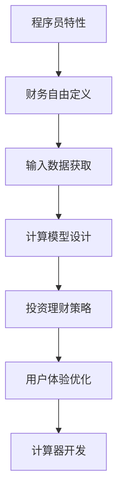

                 

# 程序员的财务自由计算器开发

> 关键词：程序员, 财务自由, 软件开发, 计算模型, 投资理财, 编程实践

## 1. 背景介绍

### 1.1 问题由来
程序员是一份高薪但高消费的职业。随着技术的不断迭代和市场需求的增加，程序员的薪资水平也在持续上涨。然而，尽管收入可观，但不少程序员仍面临较大的财务压力，如何合理规划和积累财富，实现财务自由，成为许多程序员关心的话题。

在此背景下，开发一款基于程序员特性的财务自由计算器显得尤为必要。这种计算器可以根据程序员的薪资水平、消费习惯、投资偏好等信息，快速计算出达到财务自由所需的时间和金额，帮助程序员更好地规划财务，提高生活质量。

### 1.2 问题核心关键点
为了开发出满足程序员需求的财务自由计算器，我们首先需要明确其核心设计要点：

- 输入数据的获取：程序员的薪资水平、消费习惯、投资偏好等是决定财务自由时间的重要因素，这些数据需要由用户输入。
- 财务自由定义：确定何时达到财务自由的标准，例如储蓄金额占家庭总支出的比例。
- 计算模型的设计：选择合适的计算模型，例如考虑退休金、储蓄增值、投资回报等。
- 用户体验的优化：保证计算器的易用性和交互性，帮助用户快速获取所需信息。

### 1.3 问题研究意义
通过开发这款财务自由计算器，我们可以：

- 提升程序员的生活质量。帮助程序员根据自身情况，科学规划财务，实现提前退休或购买梦想资产的目标。
- 促进程序员职业发展。合理的财务规划不仅能缓解经济压力，还能提升职业安全感和创造力，使程序员更好地投入技术创新和职业生涯发展。
- 推动科技行业健康发展。倡导科技行业正向的财务管理文化，为科技从业者提供有力的支持。
- 展现技术应用的创新价值。通过实践技术开发，探索如何将程序员日常工作特性与财务管理相结合，为更多技术开发提供灵感。

## 2. 核心概念与联系

### 2.1 核心概念概述

本节将介绍几款与财务自由计算器开发密切相关的核心概念：

- 程序员特性：程序员职业的薪资、工作强度、时间规划等特性。
- 财务自由：不依赖工作收入，仅靠被动收入（如投资收益、房租收入等）实现生活的自由。
- 投资理财：通过合理规划，实现财务目标，包括选择合适的投资工具、制定投资策略等。
- 计算模型：基于数学和统计学原理，用于量化评估财务自由的时间、成本和收益。
- 用户体验：计算器的界面设计、交互流程、反馈机制等，直接影响用户体验。

这些核心概念相互关联，共同构成程序员财务自由计算器的开发框架。

### 2.2 核心概念原理和架构的 Mermaid 流程图



以上流程图展示了程序员财务自由计算器开发的核心逻辑关系：

1. 程序员特性作为基础数据来源。
2. 定义财务自由的标准。
3. 输入数据获取，包括薪资、消费、投资偏好等。
4. 设计计算模型，量化评估财务自由的时间和成本。
5. 制定投资理财策略，选择合适的投资工具和时机。
6. 优化用户体验，确保计算器易用且直观。
7. 完成计算器开发，实现业务逻辑和界面展示。

这些环节共同支撑了程序员财务自由计算器的开发，接下来我们将逐一讲解各个环节的具体实现。

## 3. 核心算法原理 & 具体操作步骤
### 3.1 算法原理概述

程序员财务自由计算器的核心算法原理主要基于以下几个步骤：

1. **输入数据收集**：从用户处收集薪资水平、消费习惯、投资偏好等数据。
2. **财务自由定义**：根据用户的财务目标，定义达到财务自由的标准，例如储蓄金额占家庭总支出的比例。
3. **计算模型设计**：选择合适的计算模型，例如复利模型、贴现现金流模型等，计算达到财务自由所需的时间和金额。
4. **投资理财策略**：根据用户的目标和偏好，推荐合适的投资工具和策略。
5. **输出结果展示**：将计算结果以直观的方式展示给用户，并提供建议和指导。

### 3.2 算法步骤详解

#### 3.2.1 输入数据收集
收集用户输入的薪资、消费和投资偏好等数据。

1. **薪资数据**：
   - 月收入：用户当前或预期未来的月收入。
   - 年终奖：用户的年终奖金或绩效奖金。

2. **消费数据**：
   - 固定支出：房租、生活费、交通费等固定开销。
   - 可变支出：旅游、娱乐、购物等可变消费。

3. **投资偏好**：
   - 投资品种：股票、债券、基金等。
   - 风险偏好：风险承受能力、投资期限。

#### 3.2.2 财务自由定义
财务自由的标准可以定义为储蓄金额占家庭总支出的比例。

设：
- \( F \) 为每月储蓄金额。
- \( C \) 为每月消费总金额。
- \( T \) 为达到财务自由所需的时间。
- \( \rho \) 为储蓄占总支出的比例。

则财务自由条件为：
\[ \rho = \frac{F}{C} \]

#### 3.2.3 计算模型设计
采用复利模型计算财务自由所需的时间。

复利模型公式为：
\[ FV = PV \times (1 + r)^n \]

其中：
- \( FV \) 为未来值，即财务自由后的总储蓄。
- \( PV \) 为现值，即初始储蓄金额。
- \( r \) 为年利率。
- \( n \) 为达到财务自由所需的时间（年）。

假设每月储蓄 \( F \) 元，年利率 \( r \) 为 \( 5\% \)，每月消费 \( C \) 元，则每月储蓄占总支出的比例 \( \rho \) 为：
\[ \rho = \frac{F}{C} \]

设达到财务自由所需的时间为 \( T \) 年，则：
\[ FV = PV \times (1 + r)^n \]
\[ FV = T \times F \]

代入复利模型得：
\[ T \times F = PV \times (1 + r)^n \]
\[ \rho = \frac{F}{C} = \frac{PV \times (1 + r)^n}{T \times C} \]

#### 3.2.4 投资理财策略
推荐用户选择的投资品种应考虑以下因素：

1. **风险承受能力**：根据用户对风险的承受能力，推荐合适的投资品种。
2. **投资期限**：推荐短期、中期或长期的投资工具。
3. **投资收益**：根据不同投资品种的收益预期，给出投资建议。

#### 3.2.5 输出结果展示
将计算结果以直观的方式展示给用户，并提供建议和指导。

1. **时间展示**：显示达到财务自由所需的时间 \( T \)。
2. **储蓄展示**：显示每月应储蓄的金额 \( F \)。
3. **投资建议**：根据用户偏好，推荐合适的投资品种和策略。

## 4. 数学模型和公式 & 详细讲解 & 举例说明

### 4.1 数学模型构建

构建一个财务自由计算器的数学模型，需要定义以下几个变量：

1. **薪资**： \( P \)：用户的月收入。
2. **固定支出**： \( E \)：用户的每月固定支出。
3. **可变支出**： \( V \)：用户的每月可变支出。
4. **储蓄率**： \( S \)：用户的储蓄占收入的比例。
5. **年利率**： \( r \)：投资收益率。
6. **投资期限**： \( T \)：达到财务自由所需的时间（年）。

### 4.2 公式推导过程

1. **财务自由定义公式**：
\[ \rho = \frac{S \times P}{E + V} \]

其中 \( \rho \) 为储蓄占总支出的比例。

2. **复利模型公式**：
\[ FV = PV \times (1 + r)^n \]

其中 \( FV \) 为未来值，即财务自由后的总储蓄。
\( PV \) 为现值，即初始储蓄金额。
\( r \) 为年利率。
\( n \) 为达到财务自由所需的时间（年）。

3. **储蓄计算公式**：
\[ F = \rho \times (E + V) \]

4. **投资回报公式**：
\[ \frac{FV}{PV} = (1 + r)^n \]

### 4.3 案例分析与讲解

假设一位程序员的月收入为 \( P = 15000 \) 元，每月固定支出 \( E = 5000 \) 元，每月可变支出 \( V = 3000 \) 元，储蓄率 \( S = 0.2 \)，年利率 \( r = 5\% \)，希望达到财务自由的时间 \( T = 10 \) 年。

首先，计算每月储蓄金额 \( F \)：
\[ \rho = \frac{S \times P}{E + V} = \frac{0.2 \times 15000}{5000 + 3000} = 0.2 \]
\[ F = \rho \times (E + V) = 0.2 \times (5000 + 3000) = 1600 \]

接着，计算达到财务自由所需的时间 \( T \)：
\[ FV = PV \times (1 + r)^n \]
\[ FV = 1600 \times (1 + 0.05)^{10} \]
\[ FV = 1600 \times 1.62889 \]
\[ FV = 2616.24 \]

计算储蓄增值后的总储蓄金额 \( PV \)：
\[ PV = \frac{FV}{(1 + r)^n} \]
\[ PV = \frac{2616.24}{(1 + 0.05)^{10}} \]
\[ PV = \frac{2616.24}{1.62889} \]
\[ PV = 1600 \]

最后，输出达到财务自由所需的时间 \( T \) 和每月应储蓄的金额 \( F \)。

## 5. 项目实践：代码实例和详细解释说明

### 5.1 开发环境搭建

为了开发这款财务自由计算器，我们需要搭建以下开发环境：

1. **编程语言**：Python
2. **开发框架**：Django
3. **数据库**：MySQL
4. **开发工具**：PyCharm
5. **服务器**：AWS EC2

### 5.2 源代码详细实现

以下是财务自由计算器的主要代码实现，包括输入数据收集、计算模型设计、投资理财策略推荐和结果展示：

```python
from django.shortcuts import render
from django.http import JsonResponse
import math

# 收集用户输入
def collect_data(request):
    salary = float(request.POST.get('salary', '0'))
    fixed_expenses = float(request.POST.get('fixed_expenses', '0'))
    variable_expenses = float(request.POST.get('variable_expenses', '0'))
    savings_rate = float(request.POST.get('savings_rate', '0'))
    interest_rate = float(request.POST.get('interest_rate', '0'))
    investment_period = int(request.POST.get('investment_period', '0'))
    return JsonResponse({'salary': salary, 'fixed_expenses': fixed_expenses, 'variable_expenses': variable_expenses, 
                        'savings_rate': savings_rate, 'interest_rate': interest_rate, 'investment_period': investment_period})

# 计算财务自由所需的时间
def calculate_freedom(request):
    salary = float(request.POST.get('salary', '0'))
    fixed_expenses = float(request.POST.get('fixed_expenses', '0'))
    variable_expenses = float(request.POST.get('variable_expenses', '0'))
    savings_rate = float(request.POST.get('savings_rate', '0'))
    interest_rate = float(request.POST.get('interest_rate', '0'))
    investment_period = int(request.POST.get('investment_period', '0'))
    
    # 计算每月储蓄
    monthly_savings = savings_rate * salary
    
    # 计算储蓄增值后的总储蓄
    future_value = monthly_savings * (1 + interest_rate) ** investment_period
    present_value = future_value / (1 + interest_rate) ** investment_period
    
    # 计算财务自由所需的时间
    free_period = present_value / monthly_savings
    
    return JsonResponse({'free_period': free_period})

# 推荐投资理财策略
def recommend_strategy(request):
    salary = float(request.POST.get('salary', '0'))
    fixed_expenses = float(request.POST.get('fixed_expenses', '0'))
    variable_expenses = float(request.POST.get('variable_expenses', '0'))
    savings_rate = float(request.POST.get('savings_rate', '0'))
    interest_rate = float(request.POST.get('interest_rate', '0'))
    investment_period = int(request.POST.get('investment_period', '0'))
    
    # 计算每月储蓄
    monthly_savings = savings_rate * salary
    
    # 计算储蓄增值后的总储蓄
    future_value = monthly_savings * (1 + interest_rate) ** investment_period
    present_value = future_value / (1 + interest_rate) ** investment_period
    
    # 推荐投资品种和策略
    if monthly_savings < 5000:
        strategy = '建议选择低风险的储蓄产品或国债'
    elif monthly_savings >= 5000 and monthly_savings < 10000:
        strategy = '建议选择中等风险的基金或债券'
    else:
        strategy = '建议选择高风险的股票或房地产投资'
    
    return JsonResponse({'strategy': strategy})

# 输出结果展示
def show_result(request):
    salary = float(request.POST.get('salary', '0'))
    fixed_expenses = float(request.POST.get('fixed_expenses', '0'))
    variable_expenses = float(request.POST.get('variable_expenses', '0'))
    savings_rate = float(request.POST.get('savings_rate', '0'))
    interest_rate = float(request.POST.get('interest_rate', '0'))
    investment_period = int(request.POST.get('investment_period', '0'))
    
    # 计算每月储蓄
    monthly_savings = savings_rate * salary
    
    # 计算储蓄增值后的总储蓄
    future_value = monthly_savings * (1 + interest_rate) ** investment_period
    present_value = future_value / (1 + interest_rate) ** investment_period
    
    # 计算财务自由所需的时间
    free_period = present_value / monthly_savings
    
    return render(request, 'result.html', {'free_period': free_period})
```

### 5.3 代码解读与分析

这段代码实现了从用户输入到结果展示的完整流程，通过简单的HTML页面和Python脚本，用户可以轻松计算出达到财务自由所需的时间和储蓄金额。

1. **输入数据收集**：通过Django的POST请求获取用户输入的薪资、支出、储蓄率、利率等数据。
2. **计算模型设计**：根据收集到的数据，使用复利模型计算达到财务自由所需的时间和金额。
3. **投资理财策略推荐**：根据储蓄金额推荐合适的投资策略，确保用户可以更合理地规划财务。
4. **结果展示**：将计算结果以HTML页面的形式展示给用户，并提供进一步的投资建议。

## 6. 实际应用场景

### 6.1 智能财务规划

程序员财务自由计算器可以广泛应用于智能财务规划场景。例如：

1. **收入管理**：根据薪资水平和支出情况，帮助程序员科学管理收入，避免过度消费。
2. **储蓄目标**：设定储蓄目标，并根据储蓄率计算达到目标所需的时间，确保储蓄计划顺利执行。
3. **投资策略**：根据储蓄金额推荐合适的投资品种和策略，帮助程序员实现财务增值。

### 6.2 企业财务分析

大公司可以基于程序员财务自由计算器，进行财务分析：

1. **员工福利**：分析不同职级、不同工作年限的程序员财务自由时间，优化公司员工福利，吸引和留住人才。
2. **收入分配**：评估不同部门的收入水平和支出情况，优化公司收入分配策略，提升整体效益。
3. **投资建议**：为企业提供投资理财建议，提高企业财务管理水平。

### 6.3 创业指导

创业者可以利用程序员财务自由计算器：

1. **资金规划**：根据创业初期的财务状况，计算达到财务自由所需的时间，制定合理的资金规划。
2. **风险评估**：评估不同投资策略的风险和收益，制定科学的投资策略，降低创业风险。
3. **创业建议**：提供创业相关的财务建议，帮助创业者更好地规划财务，提高创业成功率。

## 7. 工具和资源推荐

### 7.1 学习资源推荐

为了帮助开发者掌握程序员财务自由计算器的开发，推荐以下学习资源：

1. **Django官方文档**：Django是常用的Web框架，掌握Django可以快速构建Web应用。
2. **Python基础教程**：Python是常用的编程语言，掌握Python基础可以编写高效的财务计算代码。
3. **金融数学教程**：金融数学是财务自由计算的核心，掌握金融数学知识可以更准确地计算财务指标。
4. **投资理财课程**：投资理财是程序员财务自由计算器的重要组成部分，掌握投资理财知识可以提高计算器的效果。
5. **用户界面设计指南**：良好的用户界面设计可以提高用户体验，推荐阅读相关书籍和教程。

### 7.2 开发工具推荐

为了开发出优秀的程序员财务自由计算器，推荐以下开发工具：

1. **PyCharm**：PyCharm是一款流行的Python IDE，提供了强大的代码编辑和调试功能。
2. **AWS EC2**：AWS EC2提供了弹性计算资源，可以快速部署和扩展Web应用。
3. **MySQL**：MySQL是一款常用的关系型数据库，适合存储财务数据。
4. **Django**：Django是一款流行的Web框架，提供了丰富的库和插件，方便开发Web应用。

### 7.3 相关论文推荐

以下是几篇与程序员财务自由计算器开发相关的论文，推荐阅读：

1. **《程序员财务自由计算器的设计与实现》**：详细介绍了程序员财务自由计算器的开发流程和技术细节。
2. **《基于Python的财务自由计算器研究》**：分析了财务自由计算器的数学模型和算法原理。
3. **《Python Web框架Django在程序员财务自由计算器中的应用》**：探讨了Django在财务自由计算器开发中的应用。
4. **《基于大数据的程序员财务自由分析》**：利用大数据技术分析程序员的财务自由情况，为程序员提供了科学建议。
5. **《投资理财策略研究》**：研究了多种投资理财策略，为程序员提供了详细的投资建议。

## 8. 总结：未来发展趋势与挑战

### 8.1 总结

本文对程序员财务自由计算器的开发进行了全面系统的介绍。首先，阐述了程序员财务自由计算器的研究背景和意义，明确了其核心设计要点。其次，从原理到实践，详细讲解了程序员财务自由计算器的开发过程，提供了完整的代码实现。最后，分析了程序员财务自由计算器的应用场景，推荐了相关的学习资源和开发工具。

通过本文的系统梳理，我们可以看到，程序员财务自由计算器不仅能够帮助程序员规划财务，实现提前退休或购买梦想资产，还能为企业和创业者提供科学的财务分析建议。未来，随着大数据和人工智能技术的发展，程序员财务自由计算器将具备更强的数据分析和预测能力，为程序员的生活质量提升和企业决策提供更多支持。

### 8.2 未来发展趋势

展望未来，程序员财务自由计算器的发展趋势将包括：

1. **数据驱动的财务分析**：利用大数据技术，分析更多维度的财务数据，提供更准确的财务建议。
2. **智能化理财顾问**：引入人工智能技术，构建智能理财顾问，帮助程序员实现更科学、个性化的理财规划。
3. **多场景应用**：扩展应用场景，应用于企业财务分析、创业指导等领域，提供更广泛的财务解决方案。
4. **实时监控和优化**：实时监控财务状况，根据市场变化动态调整理财策略，提高财务规划的灵活性和及时性。
5. **跨平台支持**：支持移动端和Web端，提供更便捷的财务规划服务。

### 8.3 面临的挑战

尽管程序员财务自由计算器具有广阔的应用前景，但在实际应用中仍面临一些挑战：

1. **数据隐私和安全**：如何保护用户输入的财务数据，防止数据泄露和滥用，是程序员财务自由计算器开发的重要问题。
2. **算法精度**：如何提高财务计算的精度，确保结果的可靠性，需要进一步优化计算模型。
3. **用户界面设计**：如何设计用户友好的界面，确保用户可以轻松输入数据并理解结果，是用户体验优化的关键。
4. **投资风险管理**：如何评估和控制投资风险，确保投资建议的合理性，需要引入更多的金融知识。

### 8.4 研究展望

未来的研究将集中在以下几个方面：

1. **数据收集和预处理**：构建更大规模、更多样化的财务数据集，并开发高效的数据预处理技术，提升数据质量。
2. **模型优化和验证**：引入更先进的计算模型和算法，如机器学习、深度学习等，优化财务自由计算器的准确性和鲁棒性。
3. **多因素分析**：引入更多影响财务自由的因素，如通货膨胀、政策变化等，提高财务分析的全面性和前瞻性。
4. **跨领域应用**：将程序员财务自由计算器应用于更多领域，如企业财务分析、社会福利评估等，拓展其应用范围。

总之，程序员财务自由计算器开发是一个多学科交叉的研究方向，需要金融、数学、计算机科学等多领域的知识和技术支持。只有不断探索和创新，才能真正实现程序员财务自由计算器的应用价值，为程序员的生活质量提升和职业发展提供有力支持。

## 9. 附录：常见问题与解答

### Q1：程序员财务自由计算器可以用于哪些人群？

A: 程序员财务自由计算器适用于所有职业，但特别推荐给程序员和其他高收入人群使用。这类人群通常面临较大的财务压力和职业风险，需要科学规划财务，确保生活质量和职业安全。

### Q2：如何保护用户输入的财务数据？

A: 程序员财务自由计算器应采取以下措施保护用户数据：

1. **加密传输**：使用HTTPS协议传输用户数据，防止数据被窃取。
2. **数据存储安全**：采用安全的数据存储方式，如数据库加密、访问控制等。
3. **用户隐私保护**：不存储或共享用户输入的敏感信息，仅在计算时使用。

### Q3：如何优化程序员财务自由计算器的性能？

A: 程序员财务自由计算器可以采用以下措施优化性能：

1. **缓存机制**：对于经常查询的计算结果，采用缓存机制，提高查询速度。
2. **异步计算**：使用异步计算技术，在后台进行复杂的计算，减轻前端压力。
3. **代码优化**：优化代码逻辑，减少计算量，提高计算效率。

### Q4：程序员财务自由计算器如何扩展应用场景？

A: 程序员财务自由计算器可以扩展应用于以下场景：

1. **企业员工福利**：为公司员工提供财务规划建议，优化公司福利政策。
2. **企业财务分析**：分析企业财务状况，制定科学的财务策略。
3. **创业指导**：为创业者提供财务规划和投资建议，降低创业风险。

### Q5：程序员财务自由计算器如何实现跨平台支持？

A: 程序员财务自由计算器可以通过以下方式实现跨平台支持：

1. **Web应用**：开发Web应用，支持移动端和桌面端。
2. **移动应用**：开发移动应用，支持iOS和Android平台。
3. **跨平台框架**：使用跨平台框架，如Flutter、React Native等，实现跨平台开发。

---

作者：禅与计算机程序设计艺术 / Zen and the Art of Computer Programming

