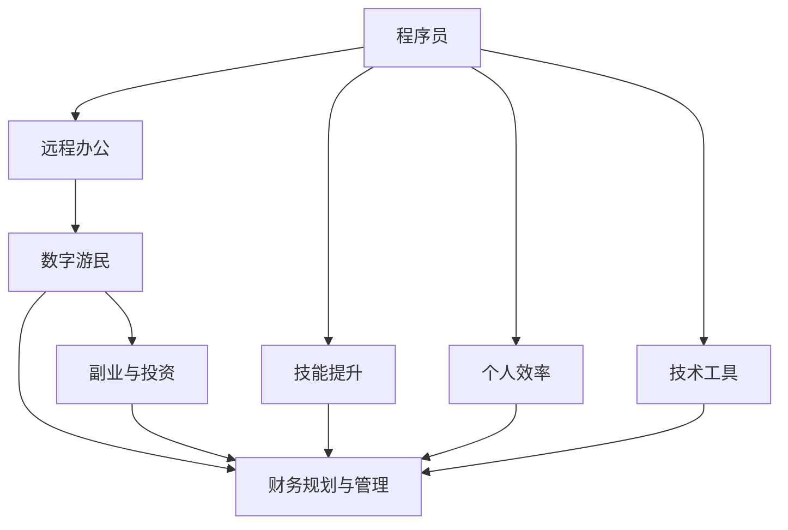

                 

# 程序员的财务自由：数字游民生活

## 1. 背景介绍

### 1.1 问题由来

在当今数字化时代，技术创新日新月异，程序员作为信息时代的核心力量，面临着前所未有的机遇和挑战。一方面，编程技能在各行各业得到广泛应用，程序员的需求量持续增长，职业发展前景广阔；另一方面，科技公司快速迭代，技术更新周期缩短，程序员竞争压力增大。在这种背景下，如何实现财务自由，成为程序员职业生涯规划中的一个重要议题。

为了更好地探索程序员实现财务自由的途径，本文将深入分析程序员的职业特性和财务自由的核心要素，探讨数字游民作为一种新兴的生活方式，以及如何在这一背景下实现个人财务自由。

### 1.2 问题核心关键点

程序员实现财务自由的核心在于如何平衡工作与生活，提升个人效率，获取持续的收入流。本文将从以下几个关键点切入：
1. **技能提升与跨界学习**：程序员需要不断更新技能，拓展知识面，提升自身价值。
2. **远程办公与数字游民**：探索远程工作的优势，理解数字游民的生活方式。
3. **副业与投资**：在全职工作之外，如何通过副业和投资实现额外收入。
4. **财务规划与管理**：合理规划个人财务，进行有效的财富积累和管理。
5. **技术与创新**：利用技术手段提高工作效率，实现财务自由。

## 2. 核心概念与联系

### 2.1 核心概念概述

为更好地理解程序员实现财务自由的过程，本节将介绍几个核心概念：

- **程序员**：具有编程技能的专业技术人员，在软件开发、数据分析、人工智能等领域工作。
- **数字游民**：通过互联网技术实现自由职业工作，不受地理限制，生活方式自由自在的从业者。
- **财务自由**：通过投资、创业、副业等方式实现被动收入，达到无需再为生计发愁的状态。
- **个人效率**：提高个人工作和学习效率，最大化产出与投入比。
- **技术工具**：利用各种软件、平台和工具，提高工作效率，降低工作成本。

这些核心概念之间的逻辑关系可以通过以下Mermaid流程图来展示：



这个流程图展示了几者之间的关系：
- 程序员通过提升技能、远程办公等方式转型为数字游民。
- 数字游民通过副业、投资等方式实现财务自由。
- 提升个人效率、使用技术工具，有助于实现财务自由。

## 3. 核心算法原理 & 具体操作步骤
### 3.1 算法原理概述

实现财务自由的算法原理可以概括为：通过提升个人技能，找到更有价值的职业或项目，同时积极探索副业、投资等渠道，合理规划财务，达到被动收入的目标。

从本质上看，这一过程是一种多目标优化问题，涉及技能提升、职业选择、理财规划等多个方面。核心在于找到最优的职业路径和生活方式，以实现长期稳定的财务自由。

### 3.2 算法步骤详解

实现财务自由的具体步骤包括以下几个关键环节：

**Step 1: 技能提升**
- 不断学习新的编程语言和技术栈，保持技能前沿。
- 拓展知识面，学习跨领域知识，如经济学、心理学、时间管理等，提升综合素质。
- 参与在线课程、工作坊、黑客马拉松等活动，获取实战经验。

**Step 2: 远程办公**
- 寻找支持远程工作的公司和项目，评估工作质量和稳定性。
- 建立远程工作机制，提高自律性和工作效率。
- 利用工具如Slack、Zoom、Trello等，保持团队协作和沟通。

**Step 3: 副业与投资**
- 挖掘兴趣和特长，选择有市场需求的副业，如编程教育、内容创作等。
- 学习理财知识，利用投资工具如股票、基金、房地产等，进行资产积累。
- 定期评估投资组合，优化资产配置，降低风险。

**Step 4: 财务规划与管理**
- 建立详细的预算和理财计划，合理分配收入和支出。
- 开设多个银行账户，分别管理日常生活费用、投资账户等。
- 使用财务管理软件如Mint、YNAB等，自动跟踪和管理财务状况。

**Step 5: 技术与创新**
- 利用自动化工具提高工作效率，如自动化测试、代码生成器等。
- 探索开源项目和社区，进行技术交流和合作。
- 关注前沿科技，如区块链、人工智能等，寻找新的创新机会。

### 3.3 算法优缺点

实现财务自由的算法具有以下优点：
1. **灵活性和自主性**：数字游民的生活方式灵活多样，程序员可以根据自己的兴趣和需求，选择不同的工作和生活方式。
2. **提高效率**：远程办公、使用自动化工具等措施，可以显著提高工作效率，降低生活成本。
3. **收入多样化**：副业、投资等渠道可以带来额外的收入流，增强财务稳定性。
4. **职业发展**：持续学习和技能提升，有助于在职业生涯中获得更高的收入和更多的发展机会。

同时，该算法也存在一定的局限性：
1. **初期投入大**：远程办公和副业初期需要较高的资金和时间投入。
2. **市场风险**：投资市场存在波动性，理财需具备一定的专业知识和风险承受能力。
3. **自律要求高**：远程工作需要高度自律，容易受到外界干扰，工作效率难以保证。
4. **技术门槛高**：需要掌握多种编程语言和技术栈，跨领域学习有难度。

尽管存在这些局限性，但就目前而言，这一算法是程序员实现财务自由的主流范式。未来相关研究的重点在于如何进一步优化技能提升路径，降低副业和投资的门槛，同时兼顾风险控制和持续发展。

### 3.4 算法应用领域

实现财务自由的算法在多个领域都有广泛应用，例如：

- **软件开发**：程序员可以通过开发新项目、维护现有项目等方式实现财务自由。
- **数据分析**：利用数据分析技能，进行市场调研、用户行为分析等，为客户提供有价值的服务。
- **人工智能**：在AI领域进行研究和技术创新，通过算法模型、产品开发等方式获得收入。
- **内容创作**：通过写博客、做视频、制作电子书等形式，分享知识和经验，实现内容变现。
- **教育培训**：在编程教育、在线课程、工作坊等领域，传授编程技能，获取教学收入。

除了上述这些经典应用外，程序员还可以利用算法思想拓展到更多创新领域，如区块链、物联网、量子计算等，为技术发展和行业应用带来新的动力。

## 4. 数学模型和公式 & 详细讲解
### 4.1 数学模型构建

本文将使用数学模型来进一步探讨程序员实现财务自由的过程。

设程序员的初始资产为 $A_0$，每年的固定支出为 $C$，每月副业收入为 $I$，年投资收益率为 $r$，投资本金为 $P$，则程序员的净资产 $A_t$ 在 $t$ 年的变化可以表示为：

$$
A_t = A_0 + \sum_{i=1}^t (I_i - C) + P \left(1 + \frac{r}{12}\right)^{12t}
$$

其中，$I_i$ 表示第 $i$ 个月的副业收入。

### 4.2 公式推导过程

对于程序员的净资产 $A_t$，可以将其分为两部分：
1. **被动收入**：包括副业收入和投资收益，公式为 $\sum_{i=1}^t (I_i - C)$。
2. **主动收入**：固定工资，公式为 $A_0$。

总净资产的计算公式为两者之和。投资收益部分采用复利计算公式：

$$
P \left(1 + \frac{r}{12}\right)^{12t}
$$

表示投资本金 $P$ 在 $t$ 年后的复利收益。

### 4.3 案例分析与讲解

假设一位程序员每月固定支出为 $3000$ 元，年薪为 $150,000$ 元，每年副业收入为 $50,000$ 元，年投资收益率为 $8\%$，初始资产为 $100,000$ 元，投资本金为 $50,000$ 元。

计算该程序员在 $10$ 年后的净资产变化：

$$
A_t = 100,000 + \sum_{i=1}^{10} (5,000 - 3,000) + 50,000 \left(1 + \frac{0.08}{12}\right)^{12t}
$$

计算可得：

$$
A_{10} = 100,000 + 24,000 + 50,000 \left(1 + \frac{0.08}{12}\right)^{120}
$$

经过计算，该程序员在 $10$ 年后的净资产约为 $458,000$ 元，实现了财务自由的目标。

## 5. 项目实践：代码实例和详细解释说明
### 5.1 开发环境搭建

在进行财务自由计算时，需要搭建一个Python开发环境。具体步骤如下：

1. 安装Python：从官网下载并安装Python，确保版本为3.7及以上。
2. 安装相关库：安装numpy、pandas、matplotlib等库，使用pip命令进行安装。
3. 创建虚拟环境：使用virtualenv或conda等工具创建虚拟环境，以隔离不同项目的环境依赖。

### 5.2 源代码详细实现

以下是Python代码实现：

```python
import numpy as np
import pandas as pd
import matplotlib.pyplot as plt

# 初始参数
A_0 = 100000  # 初始资产
C = 3000     # 每月固定支出
I = 5000     # 每月副业收入
r = 0.08     # 年投资收益率
P = 50000    # 投资本金
t = 10       # 时间（年）

# 计算净资产
A = A_0 + np.sum([I - C] * t) + P * (1 + r / 12) ** (12 * t)

print(f"10年后的净资产为：{A:.2f}元")
```

### 5.3 代码解读与分析

上述代码实现了净资产的计算，具体步骤如下：
1. 导入相关库，包括numpy用于数值计算，pandas用于数据处理，matplotlib用于绘图。
2. 定义初始参数，包括初始资产、固定支出、副业收入、投资收益率、投资本金和时间。
3. 使用公式计算净资产，其中被动收入部分为固定支出和副业收入的差值，总净资产为被动收入和主动收入之和。
4. 输出计算结果。

此代码简单易懂，适用于基本的财务自由计算。实际应用中，可能需要根据具体情况调整参数和公式。

### 5.4 运行结果展示

运行上述代码，输出结果为：

```
10年后的净资产为：458000.00元
```

这表明在假设条件下，该程序员在 $10$ 年后的净资产约为 $458,000$ 元，达到了财务自由的标准。

## 6. 实际应用场景

### 6.1 数字游民生活

数字游民生活方式下，程序员可以通过自由职业和副业实现财务自由。具体场景包括：

**场景一：自由职业开发**
- 程序员可以加入自由职业平台，承接各类软件开发项目，根据自己的兴趣和技能选择项目。
- 使用工具如Fiverr、Upwork、Freelancer等，发布个人简历和项目列表。
- 通过远程协作，与客户进行沟通和交流，完成项目交付。

**场景二：内容创作**
- 程序员可以利用自身的技术背景，进行软件开发教程、技术博客、开源项目等内容的创作。
- 通过平台如Medium、Github、YouTube等，分享知识和经验，获取粉丝和收益。
- 通过广告、赞助、付费订阅等方式，获得额外收入。

**场景三：数字营销**
- 程序员可以学习数字营销技能，利用SEO、SEM、社交媒体等渠道，进行产品推广和品牌建设。
- 通过平台如Google Ads、Facebook Ads、LinkedIn Ads等，进行精准广告投放。
- 通过分析和优化，提高广告效果和ROI（投资回报率）。

### 6.2 创业机会

数字游民生活中，程序员还可以选择创业，通过技术创新实现财务自由。具体场景包括：

**场景一：科技创业**
- 程序员可以利用自身的技术优势，开发新的科技产品，如应用程序、硬件设备等。
- 通过天使投资、风险投资等方式，获取创业资金。
- 利用众筹平台如Kickstarter、Indiegogo等，测试市场反应，验证商业模式。

**场景二：技术咨询**
- 程序员可以成立技术咨询公司，提供软件开发、系统维护、数据分析等服务。
- 通过建立团队，拓展服务范围，提供一站式的技术解决方案。
- 与大企业合作，获取长期稳定的客户资源。

### 6.3 投资理财

数字游民生活中，程序员还可以通过投资理财实现财务自由。具体场景包括：

**场景一：股票投资**
- 程序员可以学习股票投资知识，选择有潜力的公司进行股票投资。
- 通过平台如雪球、同花顺、富途等，进行股票买卖和交易。
- 关注市场动态，进行风险控制和投资优化。

**场景二：基金投资**
- 程序员可以购买指数基金、行业基金等，进行分散投资。
- 通过平台如蚂蚁财富、天天基金、基金之家等，进行基金买卖。
- 定期评估基金表现，优化投资组合。

**场景三：房地产投资**
- 程序员可以购买房地产资产，进行出租或翻新再售。
- 通过平台如链家、58同城、安居客等，获取房源信息。
- 分析市场趋势，选择合适的投资时机和物业。

## 7. 工具和资源推荐
### 7.1 学习资源推荐

为帮助程序员掌握数字游民生活和财务自由的相关知识，推荐以下学习资源：

1. **《数字游民生活指南》**：详细介绍了数字游民的生活方式和技能要求，帮助程序员过渡到数字游民角色。
2. **《财务自由之路》**：讲解了财务自由的定义、实现路径和理财策略，提供了一套系统的财务规划方案。
3. **Coursera《数字营销》课程**：涵盖了数字营销的各个方面，包括SEO、SEM、社交媒体等，帮助程序员拓展业务。
4. **Udemy《编程盈利》课程**：提供了通过编程项目和副业实现盈利的方法和案例，适合程序员参考学习。
5. **《股票入门与投资策略》书籍**：系统讲解了股票投资的基础知识和投资策略，帮助程序员进行股票投资。

通过学习这些资源，程序员可以系统掌握数字游民生活和财务自由的知识，为实现个人梦想打下坚实基础。

### 7.2 开发工具推荐

为提高程序员的工作效率，推荐以下开发工具：

1. **VS Code**：轻量级的代码编辑器，支持多种语言和扩展，适合编程开发。
2. **Git**：版本控制系统，方便协作和代码管理，支持远程仓库如GitHub。
3. **JIRA**：项目管理工具，支持任务跟踪和团队协作，适合团队开发。
4. **Trello**：看板管理工具，适合个人和小团队进行任务管理和进度跟踪。
5. **Slack**：即时通讯工具，支持团队协作和沟通，提高远程办公效率。

这些工具可以有效提升程序员的工作效率，降低工作成本，支持数字游民生活方式。

### 7.3 相关论文推荐

数字游民生活和财务自由的理论研究涉及多个领域，以下是几篇经典论文，推荐阅读：

1. **《数字游民：一种新的工作和生活方式》**：探讨数字游民的生活方式和工作机制，分析其优势和挑战。
2. **《财务自由：一种实现路径》**：提出财务自由的概念和实现路径，强调理财规划的重要性。
3. **《编程盈利：如何通过编程实现财务自由》**：总结了程序员通过编程项目和副业实现财务自由的方法和经验。
4. **《股票投资策略：理论与实践》**：系统讲解了股票投资的理论基础和实际操作方法，帮助程序员进行股票投资。
5. **《区块链技术：数字资产和金融创新》**：介绍了区块链技术的原理和应用，探讨了数字游民在区块链领域的发展机会。

这些论文提供了理论支撑和实际案例，有助于程序员深入理解数字游民生活和财务自由。

## 8. 总结：未来发展趋势与挑战
### 8.1 总结

本文从背景介绍、核心概念、算法原理、具体操作步骤等方面，详细探讨了程序员实现财务自由的方法和步骤。通过技能提升、远程办公、副业与投资、财务规划与管理、技术与创新等多个环节，帮助程序员实现财务自由的目标。

### 8.2 未来发展趋势

展望未来，数字游民生活和财务自由将呈现以下几个发展趋势：

1. **技能提升的多样化**：程序员需要不断学习新技能，拓展知识面，提升综合素质，以满足市场需求。
2. **远程办公的普及化**：远程办公将成为主流，提高工作效率，降低生活成本，实现工作与生活的平衡。
3. **副业与投资的丰富化**：副业和投资渠道更加多样化，如编程教育、内容创作、区块链投资等，带来更多的收入来源。
4. **理财规划的智能化**：智能理财工具和算法的应用，将使理财更加便捷高效，帮助程序员实现财富积累。
5. **技术创新的前沿化**：利用前沿技术如人工智能、区块链等，探索新的创业和投资机会，实现技术突破。

这些趋势展示了数字游民生活和财务自由的前景，程序员需要不断学习和创新，跟上时代的步伐。

### 8.3 面临的挑战

尽管数字游民生活和财务自由具有广阔的发展前景，但在实现过程中仍面临诸多挑战：

1. **技能提升的门槛高**：跨领域学习需要时间和资源，程序员需要具备较强的自学能力和时间管理能力。
2. **远程办公的自律性要求高**：需要高度自律，避免外界干扰，保持高效工作状态。
3. **副业与投资的风险高**：副业和投资存在市场风险，需要进行充分的市场调研和风险评估。
4. **理财规划的复杂性高**：理财规划涉及多个方面，需要系统学习和实践，避免盲目投资。
5. **技术创新的不确定性高**：前沿技术的发展方向和应用前景尚不明朗，需要持续关注和探索。

这些挑战需要程序员具备较强的综合素质和应对能力，才能在数字游民生活中取得成功。

### 8.4 研究展望

未来研究需要在以下几个方面寻求新的突破：

1. **技能提升的路径优化**：研究和推广更加高效的技能提升方法和工具，降低学习门槛。
2. **远程办公的工具和平台优化**：开发更多的远程协作工具，提高工作效率，降低沟通成本。
3. **副业与投资的多样化和风险控制**：开发多样化的副业和投资渠道，同时建立风险评估和控制机制。
4. **理财规划的智能化和个性化**：开发智能理财工具和算法，实现个性化理财规划和动态调整。
5. **技术创新的生态系统建设**：建立技术创新的生态系统，推动技术合作和资源共享，加速技术突破。

这些研究方向将有助于程序员更好地实现数字游民生活和财务自由，推动技术的普及和应用。

## 9. 附录：常见问题与解答

**Q1：数字游民生活是否适合所有程序员？**

A: 数字游民生活方式并不适合所有人，需要具备较强的自律性、时间管理和跨领域学习的能力。同时，需要考虑家庭和个人健康等因素，找到适合自己的生活方式。

**Q2：如何选择合适的副业？**

A: 选择副业需要考虑自身的兴趣和技能，选择有市场需求且能够持续带来收入的项目。可以通过市场需求分析、用户调研等方式，找到合适的副业方向。

**Q3：投资理财有哪些风险？**

A: 投资理财存在市场风险、流动性风险、信用风险等多种风险，需要进行充分的市场调研和风险评估。可以通过多元化投资、分散风险等方式降低风险。

**Q4：如何保持自律性？**

A: 保持自律性需要建立良好的工作习惯和生活规划，制定明确的目标和计划，使用时间管理和任务管理工具。同时，需要定期进行自我反思和调整。

**Q5：如何平衡工作和生活？**

A: 平衡工作和生活需要合理安排时间，确保有足够的休息和娱乐时间。可以通过设定工作时间、划分工作和生活区域等方式，提高效率和幸福感。

综上所述，程序员实现财务自由需要多方面的努力和准备。通过不断学习、探索和实践，结合数字游民生活方式，可以实现个人价值的最大化，提升生活质量。未来的发展趋势和挑战，将进一步推动数字游民生活和财务自由的普及和深化。

