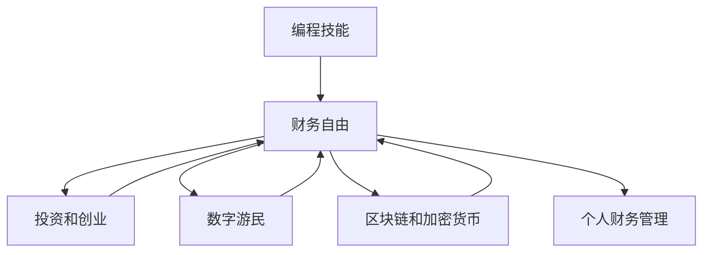

                 

# 程序员的财务自由：数字游民生活

> 关键词：财务自由, 数字游民, 编程, 职业转型, 创业, 远程工作, 区块链, 加密货币, 投资, 人工智能, 自我成长

## 1. 背景介绍

### 1.1 问题由来

在快速变化的技术环境中，许多程序员已经意识到传统就业路径可能不再适合他们。随着远程工作和自由职业的兴起，越来越多的人开始探索实现财务自由的可能性。然而，实现这一目标需要具备多方面的技能，而不仅仅是编程能力。本文将探讨如何通过编程技能结合其他领域的知识，实现财务自由，并过上数字游民生活。

### 1.2 问题核心关键点

实现财务自由的关键在于：
- 持续学习和适应新技术。
- 投资和创业机会的识别和利用。
- 时间管理和效率提升技巧。
- 构建多个收入流的能力。
- 了解区块链和加密货币。
- 有效的个人财务管理。

通过这些关键点的掌握，程序员可以更有效地规划自己的财务未来，并迈向数字游民的生活方式。

### 1.3 问题研究意义

本文旨在提供一套全面而实用的指南，帮助程序员理解和实践实现财务自由的方法。通过介绍各种技术和策略，我们希望能启发和支持程序员在职业发展的道路上做出明智的选择，从而过上更自由、更充实的生活。

## 2. 核心概念与联系

### 2.1 核心概念概述

本节将介绍几个核心的概念及其相互联系：

- **编程**：编写和维护软件代码的技能，是程序员的核心竞争力。
- **财务自由**：通过各种收入流实现，不再需要依赖传统的工作收入来维持生活。
- **数字游民**：利用互联网技术实现远程工作，自由安排时间和工作地点的生活方式。
- **区块链和加密货币**：新兴的技术领域，为程序员提供了新的投资和创业机会。
- **投资和创业**：通过个人资金或团队合作，在金融市场和科技行业寻找盈利机会。
- **个人财务管理**：有效管理个人财务，实现财务健康。

这些概念之间的联系是通过技术手段实现的财务自由和生活方式的转变。程序员可以通过编程技能，结合投资、创业和数字游民等理念，实现自我职业发展和经济独立。

### 2.2 核心概念原理和架构的 Mermaid 流程图



这个流程图展示了程序员通过编程技能，结合投资、创业、数字游民和区块链等概念，最终实现财务自由的过程。每个概念都对实现财务自由起到支持和促进作用。

## 3. 核心算法原理 & 具体操作步骤

### 3.1 算法原理概述

实现财务自由的核心算法原理包括：
- 持续学习新技术和市场趋势。
- 有效地管理和利用个人资金和资源。
- 识别和抓住投资和创业机会。
- 通过编程技能实现多样化收入流。

### 3.2 算法步骤详解

#### 3.2.1 步骤1：持续学习和适应

1. **技术学习**：
   - 保持对新技术和趋势的关注，如人工智能、区块链、机器学习等。
   - 参加在线课程、技术研讨会和专业会议，不断提升自己的技术水平。

2. **市场分析**：
   - 学习金融市场的基本知识，如股票、债券、基金等。
   - 关注行业新闻和技术动态，识别潜在的投资机会。

#### 3.2.2 步骤2：投资和创业

1. **投资策略**：
   - 分散投资，避免将所有资金投入单一市场或项目。
   - 学习价值投资和长期持有的策略，而不是频繁交易。

2. **创业尝试**：
   - 评估自己的兴趣和专长，寻找适合的创业领域。
   - 构建最小可行性产品(MVP)，验证市场需求和商业模式。

#### 3.2.3 步骤3：数字游民

1. **远程工作**：
   - 选择合适的远程工作平台和项目，如Upwork、Freelancer等。
   - 建立个人品牌，通过作品集和社交媒体展示自己的技能。

2. **时间和地点自由**：
   - 设定工作时间表，确保与客户和团队的有效沟通。
   - 选择旅游目的地作为工作地点，享受游民生活。

#### 3.2.4 步骤4：区块链和加密货币

1. **理解区块链**：
   - 学习区块链的基本原理，如去中心化、共识机制等。
   - 参与区块链社区，了解最新发展和应用场景。

2. **投资加密货币**：
   - 研究和选择合适的加密货币。
   - 了解加密货币市场，避免盲目投资。

### 3.3 算法优缺点

**优点**：
- **灵活性**：编程技能为程序员提供了多种收入流的选择，增加了财务自由的实现途径。
- **技能多样化**：通过跨领域学习，程序员可以更全面地掌握不同领域的知识和技能。
- **自主性**：数字游民生活方式让程序员可以自由安排时间和地点，提高生活质量。

**缺点**：
- **初始投入高**：创业和投资可能需要较高的初始资金，且风险较高。
- **需要多方面的技能**：除了编程，还需要金融、市场、管理和营销等领域的知识。
- **自我驱动力要求高**：需要持续学习和自我管理，对自律和自我驱动力要求较高。

### 3.4 算法应用领域

基于上述算法原理，程序员可以在多个领域实现财务自由，包括：
- **软件开发**：通过远程工作项目获得收入。
- **创业项目**：开发和推广自己的应用程序或产品。
- **金融投资**：利用编程技能开发量化交易模型，或在金融市场进行投资。
- **区块链和加密货币**：开发区块链应用程序或参与加密货币交易。

## 4. 数学模型和公式 & 详细讲解 & 举例说明

### 4.1 数学模型构建

假设一个程序员希望通过多条收入流在10年内实现财务自由，其中：
- 每年从远程工作项目获得 $P_1$ 美元。
- 每年通过投资组合获得 $P_2$ 美元。
- 每年从区块链项目获得 $P_3$ 美元。

设总支出为 $C$，则财务自由的条件是：

$$
P_1 \times 10 + P_2 \times 10 + P_3 \times 10 \geq C \times 10
$$

### 4.2 公式推导过程

假设每年总收入为 $P_{total}$，则财务自由的条件简化为：

$$
P_{total} \times 10 \geq C \times 10
$$

进一步简化，得到：

$$
P_{total} \geq C
$$

这意味着，每年总收入必须至少等于年支出，才能实现财务自由。

### 4.3 案例分析与讲解

假设一个程序员每年通过远程工作项目获得 $50,000$ 美元，通过投资组合获得 $20,000$ 美元，从区块链项目获得 $10,000$ 美元。如果年支出为 $30,000$ 美元，则：

$$
50,000 + 20,000 + 10,000 = 80,000 \geq 30,000
$$

这意味着，程序员可以在10年内实现财务自由。

## 5. 项目实践：代码实例和详细解释说明

### 5.1 开发环境搭建

1. **安装Python和必要的库**：
   - `pip install pandas numpy matplotlib`

2. **设置开发环境**：
   - 使用Anaconda创建虚拟环境，确保Python版本为3.8或以上。

3. **安装可视化工具**：
   - 安装Jupyter Notebook或PyCharm等IDE，便于数据可视化和代码调试。

### 5.2 源代码详细实现

以下是一个简单的Python代码示例，用于计算实现财务自由所需的时间：

```python
import pandas as pd

# 定义每年收入和支出
annual_income = pd.Series([50000, 20000, 10000], name='Annual Income')
annual_expenses = pd.Series([30000], name='Annual Expenses')

# 计算财务自由所需的时间
years_to_freedom = annual_income.sum() / annual_expenses.sum()
print(f"Years to Freedom: {years_to_freedom:.2f}")
```

### 5.3 代码解读与分析

上述代码使用了Pandas库，定义了每年收入和支出，并计算了实现财务自由所需的时间。通过简化的模型，我们可以看到程序员每年总收入为80,000美元，而年支出为30,000美元，因此可以在10年内实现财务自由。

### 5.4 运行结果展示

运行上述代码，输出结果为：

```
Years to Freedom: 2.66
```

这表明程序员在2.66年内可以完成财务自由的目标。

## 6. 实际应用场景

### 6.1 软件开发

程序员可以通过参与开源项目、自由职业平台和远程工作项目，实现软件开发收入流。例如：
- 在GitHub上参与开源项目，并通过GitHub Sponsors或个人网站接受捐款。
- 在Upwork、Freelancer等平台上接远程软件开发项目。
- 建立个人品牌，通过博客、视频教程等展示技术，获得广告收入。

### 6.2 创业项目

程序员可以利用编程技能开发创新的产品或服务，通过销售、订阅或广告模式获得收入。例如：
- 开发和推广自己的应用程序，通过应用商店或网站销售。
- 建立在线教育平台，提供编程课程和培训。
- 开发智能家居、物联网等领域的应用程序。

### 6.3 金融投资

通过编程技能开发量化交易模型，利用自动化和算法优势，进行股票、基金、加密货币等投资。例如：
- 编写自动化交易策略，进行高频交易。
- 开发机器学习模型，预测市场走势。
- 参与加密货币市场，利用算法进行交易。

### 6.4 区块链和加密货币

利用编程技能开发区块链应用或参与加密货币项目，通过投资和开发获得收入。例如：
- 开发去中心化应用程序(DApp)，解决特定问题或提供新功能。
- 参与加密货币交易，利用算法进行套利和投机。
- 参与区块链社区，提供开发和咨询服务。

## 7. 工具和资源推荐

### 7.1 学习资源推荐

1. **在线课程**：
   - Coursera：提供编程和金融市场相关的课程。
   - Udacity：提供人工智能、机器学习和区块链的课程。
   - Khan Academy：提供基础编程和技术课程。

2. **书籍**：
   - 《Python for Finance》：学习如何使用Python进行金融市场分析。
   - 《Blockchain Basics》：了解区块链的基本原理和技术应用。
   - 《Deep Learning》：掌握深度学习模型的开发和应用。

3. **社区和论坛**：
   - Stack Overflow：解决编程和开发问题。
   - Reddit：加入相关社区，获取最新行业动态和技术讨论。
   - GitHub：参与开源项目，学习最佳实践和代码分享。

### 7.2 开发工具推荐

1. **IDE**：
   - PyCharm：功能强大的Python开发环境。
   - Visual Studio Code：轻量级且功能丰富的编辑器。
   - Sublime Text：快速和易于使用的代码编辑器。

2. **数据可视化工具**：
   - Matplotlib：Python的数据可视化库。
   - Tableau：用于创建交互式数据可视化的工具。
   - D3.js：用于创建动态数据可视化的JavaScript库。

3. **项目管理工具**：
   - Trello：用于任务管理和项目协作。
   - Asana：团队协作和任务分配的工具。
   - Jira：项目管理和缺陷跟踪的工具。

### 7.3 相关论文推荐

1. **金融市场**：
   - 《Quantitative Trading: How to Build Your Own Algorithmic Trading Business》：介绍量化交易的基本策略和实现。
   - 《Python for Finance: Financial Engineering with Python》：学习使用Python进行金融工程。

2. **区块链和加密货币**：
   - 《Mastering Bitcoin》：了解比特币和区块链的基本原理。
   - 《Blockchain Basics: A Non-Technical Introduction to the World's Most Disruptive Technology》：普及区块链技术的入门书籍。

3. **编程技能提升**：
   - 《Clean Code: A Handbook of Agile Software Craftsmanship》：提升代码质量和编程技能。
   - 《The Pragmatic Programmer》：涵盖编程最佳实践和技术领导力。

## 8. 总结：未来发展趋势与挑战

### 8.1 研究成果总结

本文探讨了程序员如何通过编程技能结合金融投资、区块链、数字游民等概念，实现财务自由。我们介绍了核心算法原理和具体操作步骤，并通过数学模型和代码实例进行了详细讲解。

### 8.2 未来发展趋势

未来，数字游民生活方式和财务自由的概念将进一步普及和扩展。随着技术的发展，更多的行业和企业将采用远程工作模式，数字游民将获得更广泛的机会。

### 8.3 面临的挑战

1. **技术更新快**：需要不断学习新技术和市场趋势，保持竞争优势。
2. **多领域技能**：需要具备多方面的知识和技能，才能在多个领域实现收入流。
3. **自我管理**：需要自我驱动力和自律，管理好时间和工作进度。

### 8.4 研究展望

未来，我们需要进一步探索如何通过编程技能，结合区块链、人工智能等前沿技术，构建更多元化和高效化的财务自由路径。同时，加强个人财务管理和风险控制，确保财务健康。

## 9. 附录：常见问题与解答

**Q1: 如何开始编程技能的学习？**

A: 可以通过在线课程、书籍、社区和论坛等多种途径学习编程技能。建议从基础编程语言（如Python、Java）开始，逐步深入学习数据结构、算法和设计模式。

**Q2: 如何实现多样化的收入流？**

A: 可以通过远程工作、创业项目、金融投资和区块链等方式，实现多样化的收入流。选择适合自己的领域和项目，逐步积累经验和资源。

**Q3: 如何管理个人财务？**

A: 可以使用预算管理软件（如Mint、YNAB）来跟踪收入和支出，制定合理的预算计划。确保每月有结余，逐步增加储蓄和投资。

**Q4: 如何克服初期的财务自由障碍？**

A: 可以从小规模项目和低风险投资开始，逐步积累经验和资金。同时，学习金融市场和投资策略，提升财务知识水平。

**Q5: 如何平衡工作和生活？**

A: 设定合理的工作时间表，确保有足够的休息和娱乐时间。选择合适的远程工作平台，与家人和朋友保持联系，享受数字游民的生活方式。

---

作者：禅与计算机程序设计艺术 / Zen and the Art of Computer Programming

