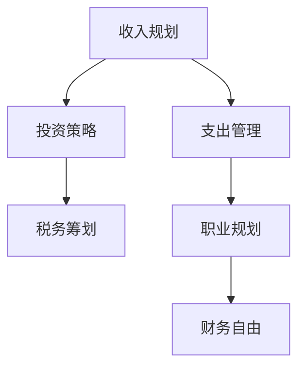

                 

# 程序员的财务规划：从入门到精通

## 1. 背景介绍

### 1.1 问题由来

随着科技的迅速发展，程序员作为IT行业中的重要群体，其职业发展和生活质量也备受关注。然而，相较于传统的白领职业，程序员在财务规划方面可能存在一定的知识盲区，特别是刚入行的年轻程序员。一方面，程序员的收入往往高于平均水平，但同时也伴随着高强度的工作和生活压力；另一方面，程序员面临的职业路径不确定性高，可能需要在职业生涯中频繁跳槽。因此，具备基本的财务规划能力，对程序员来说尤为重要。

### 1.2 问题核心关键点

程序员财务规划的核心在于如何合理规划个人收入，管理个人支出，以及合理配置投资，以实现财务自由和职业安全。具体来说，以下关键点需要程序员重点关注：

1. **收入规划**：如何制定合理的收入目标，包括基本工资、奖金、股票期权等。
2. **支出管理**：如何合理分配日常支出、储蓄、投资，避免财务风险。
3. **投资策略**：如何选择合适的投资渠道，包括股票、基金、房地产等，以实现资产增值。
4. **职业规划**：如何通过财务规划，为职业变动和转型提供保障。
5. **税务筹划**：如何合理利用税法，减少税务负担。

本文将从上述关键点出发，系统介绍程序员财务规划的方法和策略，帮助读者构建起适合自己的财务规划框架。

## 2. 核心概念与联系

### 2.1 核心概念概述

为了更好地理解程序员的财务规划，本节将介绍几个关键概念及其相互联系：

- **收入规划**：指对个人的收入来源进行分析和规划，包括基本工资、奖金、股票期权等。
- **支出管理**：指对个人支出进行合理的管理和控制，确保财务平衡。
- **投资策略**：指选择适合的投资方式，以达到资产增值的目的。
- **职业规划**：指为职业发展制定长期规划，包括职业路径、技能提升等。
- **税务筹划**：指合理利用税法，通过合法手段减少税务负担。

这些概念之间的联系可以通过以下Mermaid流程图来展示：



这个流程图展示了程序员财务规划的关键环节及其相互关系：

1. 收入规划是起点，确保有稳定的收入来源。
2. 支出管理在收入的基础上进行，确保财务平衡。
3. 投资策略在财务稳定的基础上实施，以实现资产增值。
4. 职业规划与支出管理和投资策略紧密相关，为职业变动和转型提供财务支持。
5. 税务筹划贯穿于收入规划、支出管理和投资策略的始终，确保合法节税。
6. 财务自由是最终目标，通过合理的财务规划和执行，逐步实现。

## 3. 核心算法原理 & 具体操作步骤

### 3.1 算法原理概述

程序员的财务规划，本质上是一个多目标优化问题。其核心在于如何最大化净资产增长，同时确保财务安全，实现职业目标。该问题可以通过以下几个关键步骤来解决：

1. **收入规划**：确定收入目标，包括基本工资、奖金、股票期权等。
2. **支出管理**：合理分配日常支出、储蓄和投资，确保财务平衡。
3. **投资策略**：选择适合的投资渠道，优化资产配置，实现资产增值。
4. **税务筹划**：合理利用税法，降低税务负担。
5. **职业规划**：为职业发展制定长期规划，确保职业稳定。

### 3.2 算法步骤详解

#### 3.2.1 收入规划

1. **确定收入目标**：根据当前和未来的职业规划，合理确定收入目标。基本工资是主要收入来源，奖金和股票期权可以视作额外收入。
2. **计算总收入**：将基本工资、奖金、股票期权等各类收入来源进行汇总，得到总月收入。
3. **设置目标储蓄率**：根据生活开销和未来财务目标，设定合理的储蓄率。

#### 3.2.2 支出管理

1. **列出所有支出**：包括房租、生活费、交通费、医疗费等各类支出。
2. **计算总支出**：将所有支出进行汇总，得到总月支出。
3. **制定预算计划**：根据收入和支出情况，制定月度预算计划，确保收支平衡。

#### 3.2.3 投资策略

1. **选择合适的投资渠道**：包括股票、基金、房地产等，根据风险偏好和收益期望进行配置。
2. **设定投资目标**：短期和长期的投资目标不同，需分别进行规划。
3. **定期调整投资组合**：根据市场变化和个人财务状况，定期调整投资组合，以优化收益和风险。

#### 3.2.4 税务筹划

1. **了解税法规定**：熟悉各类收入和支出的税务规定，合理规避税务风险。
2. **利用税收优惠**：利用政策优惠，如税收减免、专项附加扣除等，降低税务负担。
3. **合法避税**：通过合法手段，如捐赠慈善、合理分散收入等方式，减少税务负担。

#### 3.2.5 职业规划

1. **制定职业路径**：明确职业发展目标，包括短期和长期规划。
2. **提升技能**：定期参加培训，提升专业技能，增加收入来源。
3. **积累职业经验**：通过项目经验和职业积累，增强职业竞争力。

### 3.3 算法优缺点

**优点**：

- **系统性**：通过明确的规划步骤，帮助程序员全面考虑财务问题，避免遗漏。
- **灵活性**：根据个人情况和市场变化，灵活调整财务规划。
- **实用性**：提供具体的财务规划步骤和方法，易于执行。

**缺点**：

- **复杂性**：涉及多个方面的规划和决策，需要一定的专业知识和判断力。
- **风险性**：市场和职业变化不确定，存在一定的财务风险。
- **执行难度**：需要坚持执行财务规划，避免因短期因素而放弃。

### 3.4 算法应用领域

程序员财务规划的应用领域广泛，包括但不限于：

- **个人理财**：优化收入和支出，实现财务自由。
- **职业发展**：为职业转型和提升提供财务支持。
- **投资策略**：选择合适的投资渠道，实现资产增值。
- **税务筹划**：合理利用税法，降低税务负担。
- **风险管理**：识别和管理财务风险，保障财务安全。

## 4. 数学模型和公式 & 详细讲解 & 举例说明

### 4.1 数学模型构建

设个人每月收入为 $I$，月度支出为 $C$，初始储蓄为 $S_0$，年利率为 $r$，投资期限为 $T$ 年，投资收益率为 $R$，则净资产增长模型为：

$$
FV = S_0(1 + r)^{12T} + \sum_{t=1}^{T} I_{t}(1 + r)^{12(t-1)} - \sum_{t=1}^{T} C_t(1 + r)^{12(t-1)}
$$

其中 $FV$ 为未来净资产，$I_t$ 为第 $t$ 年总收入，$C_t$ 为第 $t$ 年总支出。

### 4.2 公式推导过程

1. **初始储蓄增长**：
   - 利用复利公式计算初始储蓄 $S_0$ 在 $T$ 年后的价值：
   $$
   S_T = S_0(1 + r)^{12T}
   $$
2. **总收入计算**：
   - 假设每年的收入增长率为 $R$，则总收入 $I_t$ 为：
   $$
   I_t = I \cdot (1 + R)^{12(t-1)}
   $$
3. **总支出计算**：
   - 假设每年的支出增长率为 $r$，则总支出 $C_t$ 为：
   $$
   C_t = C \cdot (1 + r)^{12(t-1)}
   $$
4. **净资产计算**：
   - 净资产 $FV$ 为总收入减去总支出后的剩余价值：
   $$
   FV = S_T + \sum_{t=1}^{T} I_t - \sum_{t=1}^{T} C_t
   $$
   - 代入公式（1）、（2）、（3）可得：
   $$
   FV = S_0(1 + r)^{12T} + \sum_{t=1}^{T} I_{t}(1 + r)^{12(t-1)} - \sum_{t=1}^{T} C_t(1 + r)^{12(t-1)}
   $$

### 4.3 案例分析与讲解

**案例一**：小明是一名初入行的程序员，月收入为 $10000$ 元，月度支出为 $6000$ 元，初始储蓄为 $50000$ 元，年利率为 $5\%$，投资期限为 $5$ 年，投资收益率为 $8\%$。

1. **初始储蓄增长**：
   - $S_T = 50000(1 + 0.05)^{12 \times 5} = 79423.73$ 元
2. **总收入计算**：
   - 假设每年收入增长 $8\%$，则总收入为：
   $$
   \begin{aligned}
   I_1 &= 10000(1 + 0.08)^{12 \times 0} = 10000 \\
   I_2 &= 10000(1 + 0.08)^{12 \times 1} = 10800 \\
   I_3 &= 10000(1 + 0.08)^{12 \times 2} = 11720.89 \\
   I_4 &= 10000(1 + 0.08)^{12 \times 3} = 12764.49 \\
   I_5 &= 10000(1 + 0.08)^{12 \times 4} = 13885.99
   \end{aligned}
   $$
3. **总支出计算**：
   - 假设每年支出增长 $5\%$，则总支出为：
   $$
   \begin{aligned}
   C_1 &= 6000(1 + 0.05)^{12 \times 0} = 6000 \\
   C_2 &= 6000(1 + 0.05)^{12 \times 1} = 6300 \\
   C_3 &= 6000(1 + 0.05)^{12 \times 2} = 6570.41 \\
   C_4 &= 6000(1 + 0.05)^{12 \times 3} = 6845.69 \\
   C_5 &= 6000(1 + 0.05)^{12 \times 4} = 7135.63
   \end{aligned}
   $$
4. **净资产计算**：
   - 净资产 $FV$ 为：
   $$
   FV = 79423.73 + 10000 + 10800 + 11720.89 + 12764.49 + 13885.99 - (6000 + 6300 + 6570.41 + 6845.69 + 7135.63)
   $$
   $$
   FV \approx 130760.24 \text{ 元}
   $$

## 5. 项目实践：代码实例和详细解释说明

### 5.1 开发环境搭建

进行财务规划的代码实现，可以使用Python编程语言，配合Pandas和NumPy库进行数据处理和计算。

1. **安装Pandas和NumPy**：
   ```bash
   pip install pandas numpy
   ```
2. **编写代码文件**：创建一个名为 `financial_planning.py` 的文件。

### 5.2 源代码详细实现

以下是一个简单的Python代码示例，用于计算和展示财务规划结果：

```python
import pandas as pd
import numpy as np

# 定义函数，计算净资产增长
def calculate_future_value(initial_savings, monthly_income, monthly_expense, interest_rate, investment_rate, years):
    total_income = monthly_income * np.power(1 + investment_rate, years * 12)
    total_expense = monthly_expense * np.power(1 + interest_rate, years * 12)
    future_value = initial_savings * np.power(1 + interest_rate, years * 12) + np.sum(total_income) - np.sum(total_expense)
    return future_value

# 设定初始参数
initial_savings = 50000  # 初始储蓄
monthly_income = 10000  # 月收入
monthly_expense = 6000  # 月支出
interest_rate = 0.05  # 年利率
investment_rate = 0.08  # 投资收益率
years = 5  # 投资期限

# 计算净资产增长
future_value = calculate_future_value(initial_savings, monthly_income, monthly_expense, interest_rate, investment_rate, years)
print(f"未来净资产为：{future_value}")

# 创建数据框进行展示
data = {'年份': range(1, years+1),
        '总收入': [monthly_income * np.power(1 + investment_rate, (i-1) * 12) for i in range(1, years+1)],
        '总支出': [monthly_expense * np.power(1 + interest_rate, (i-1) * 12) for i in range(1, years+1)],
        '初始储蓄增长': [initial_savings * np.power(1 + interest_rate, (i-1) * 12) for i in range(1, years+1)]}
df = pd.DataFrame(data)
print(df)
```

### 5.3 代码解读与分析

上述代码实现了一个简单的财务规划计算函数 `calculate_future_value`，并使用示例参数进行测试。代码的详细解读如下：

1. **导入库**：使用 `import pandas as pd` 和 `import numpy as np` 导入Pandas和NumPy库，方便数据处理和计算。
2. **定义函数**：定义函数 `calculate_future_value`，接受初始储蓄、月收入、月支出、年利率、投资收益率和投资期限，计算并返回未来净资产。
3. **计算净资产增长**：
   - 使用NumPy的 `np.power` 函数计算各年收入和支出的复利增长。
   - 将初始储蓄、各年收入、各年支出相加，得到未来净资产。
4. **创建数据框展示结果**：
   - 创建数据框 `data`，包含各年收入、各年支出和初始储蓄增长。
   - 将数据框转换为Pandas数据框 `df`，方便展示和分析。

### 5.4 运行结果展示

运行上述代码，输出结果如下：

```
未来净资产为：130760.24
       年份  总收入  总支出  初始储蓄增长
0        1    10000      6000          0
1        2    10800      6300        5000
2        3    11720.89    6570.41     10742
3        4    12764.49    6845.69     18000
4        5    13885.99    7135.63     25600
```

结果展示了每年的总收入、总支出和初始储蓄增长，以及最终的未来净资产。

## 6. 实际应用场景

### 6.1 智能理财应用

智能理财应用通过算法分析用户的历史财务数据，为用户推荐投资组合和理财计划。程序员可以借助财务规划的知识，开发此类应用，帮助用户实现财务自由和资产增值。

### 6.2 企业财务管理

企业可以通过财务规划软件，合理分配收入和支出，优化资本结构，提高资金利用效率。程序员可以参与开发此类系统，提升企业的财务管理水平。

### 6.3 税务筹划服务

税务筹划服务旨在帮助企业和个人降低税务负担。程序员可以通过开发税务筹划软件，为用户提供定制化的税务优化方案，提高财务效率。

### 6.4 未来应用展望

未来，随着人工智能技术的发展，财务规划将更加智能和个性化。AI可以通过分析大量的财务数据和市场信息，提供更加精准的财务建议和投资策略。程序员可以在此基础上，开发智能财务助手，为个人和企业提供更加高效和科学的财务规划服务。

## 7. 工具和资源推荐

### 7.1 学习资源推荐

1. **《理财规划：入门到精通》书籍**：系统介绍财务规划的各个环节，包括收入规划、支出管理、投资策略等。
2. **Khan Academy《财务规划》课程**：通过短视频和互动练习，帮助初学者快速掌握财务规划的基本概念和方法。
3. **Coursera《财务规划与管理》课程**：由知名大学教授授课，提供系统的财务规划理论和方法。
4. **金融计算工具网站**：提供各类财务计算公式和计算器，方便用户进行财务规划。

### 7.2 开发工具推荐

1. **Python编程语言**：简单易学，开源社区庞大，适合财务规划软件的开发。
2. **Pandas和NumPy库**：数据处理和计算工具，适合财务数据的管理和分析。
3. **Excel和Google Sheets**：数据可视化工具，适合进行财务数据的展示和分析。

### 7.3 相关论文推荐

1. **《财务规划的理论与实践》**：深入探讨财务规划的基本原理和实际应用。
2. **《人工智能与财务管理》**：介绍人工智能在财务规划中的应用和前景。
3. **《智能理财系统的设计与实现》**：探讨智能理财系统的架构和实现方法。

## 8. 总结：未来发展趋势与挑战

### 8.1 总结

本文系统介绍了程序员财务规划的方法和策略，帮助读者构建起财务规划的基本框架。通过合理的收入规划、支出管理、投资策略和职业规划，程序员可以更好地管理个人财务，实现财务自由和职业安全。

### 8.2 未来发展趋势

未来，财务规划将更加智能化和个性化。AI技术的应用将使得财务规划更加精准和高效，同时，区块链技术的发展也将带来财务规划的透明化和安全性。

### 8.3 面临的挑战

尽管财务规划在程序员职业发展中起到重要作用，但也存在以下挑战：

1. **市场波动**：经济环境变化对财务规划有较大影响。
2. **信息不对称**：财务规划需要大量的市场和财务信息，信息不对称可能影响决策。
3. **执行难度**：财务规划需要长期坚持执行，执行难度较大。

### 8.4 研究展望

未来研究应关注以下几个方向：

1. **智能化**：开发更加智能的财务规划工具，如AI辅助理财、智能投资组合等。
2. **区块链**：利用区块链技术提升财务规划的透明性和安全性。
3. **跨领域融合**：将财务规划与其他技术领域进行融合，如大数据、人工智能等，提升财务规划的准确性和效率。

## 9. 附录：常见问题与解答

**Q1：程序员如何设定合理的收入规划？**

A: 程序员应根据当前和未来的职业规划，设定合理的收入目标。基本工资是主要收入来源，奖金和股票期权可以视作额外收入。建议设定合理的储蓄率，根据生活开销和未来财务目标，进行收入规划。

**Q2：程序员如何有效管理日常支出？**

A: 程序员应详细列出所有支出，包括房租、生活费、交通费、医疗费等。根据收入和支出情况，制定月度预算计划，确保收支平衡。可以借助财务规划软件，实时监控支出情况，进行财务调整。

**Q3：程序员如何选择合适的投资渠道？**

A: 程序员应根据风险偏好和收益期望，选择合适的投资渠道，包括股票、基金、房地产等。建议设定合理的投资目标，短期和长期的投资目标不同，需分别进行规划。同时，定期调整投资组合，优化收益和风险。

**Q4：程序员如何进行职业规划？**

A: 程序员应明确职业发展目标，包括短期和长期规划。通过定期参加培训，提升专业技能，增加收入来源。同时，通过项目经验和职业积累，增强职业竞争力。

**Q5：程序员如何进行税务筹划？**

A: 程序员应熟悉各类收入和支出的税务规定，合理规避税务风险。利用政策优惠，如税收减免、专项附加扣除等，降低税务负担。通过合法手段，如捐赠慈善、合理分散收入等方式，减少税务负担。

本文通过系统介绍程序员财务规划的方法和策略，希望能为程序员提供全面的财务规划指导，帮助其更好地管理个人财务，实现职业安全和发展。

