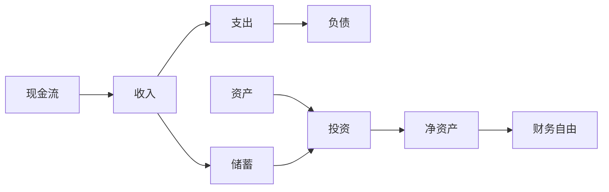

                 

# 程序员的财务规划：从入门到财务自由的路线图

## 1. 背景介绍

作为一名程序员，我们往往专注于代码的编写和技术的掌握，但财务规划同样重要。财务自由是许多人的终极目标，它不仅能提供经济上的保障，还能让我们在工作中更加自由和有安全感。本文将系统介绍程序员如何通过学习财务管理知识，逐步实现财务自由。

## 2. 核心概念与联系

### 2.1 核心概念概述

- **财务自由**：个人或家庭的被动收入等于或超过总支出，实现经济独立。
- **现金流**：个人或家庭的收入和支出情况，决定其财务状况。
- **资产**：具有经济价值、可以带来未来收益的物品或权利。
- **负债**：需要支付本金和利息的借款。
- **投资**：将资金投入某些项目，期望获得收益。

这些概念构成了财务规划的基础，程序员可以利用这些概念进行自我管理和财务规划。

### 2.2 核心概念原理和架构的 Mermaid 流程图



这个流程图展示了现金流、收入、支出、储蓄、负债、资产、投资、净资产和财务自由之间的联系。理解这些概念及其相互关系，是实现财务自由的关键。

## 3. 核心算法原理 & 具体操作步骤

### 3.1 算法原理概述

财务规划的目的是通过合理的收支管理和投资策略，实现个人或家庭的财务自由。核心算法包括：

- **收支管理**：确保每月收入大于支出，并通过储蓄积累资金。
- **投资策略**：选择合适的投资渠道，最大化资产收益，同时降低风险。
- **债务管理**：合理规划借贷，避免高息负债，尽早还清。

### 3.2 算法步骤详解

1. **目标设定**：明确财务自由的目标时间（如10年、20年）和所需资金。
2. **收支分析**：详细记录每月的收入和支出，找出节省开支和增加收入的机会。
3. **预算制定**：根据收支分析结果，制定合理的月度和年度预算。
4. **储蓄计划**：设定月度储蓄目标，优先储备紧急基金和应急资金。
5. **投资选择**：根据风险承受能力和时间周期，选择适合的投资组合。
6. **债务管理**：制定还款计划，优先偿还高利率债务。
7. **定期评估**：定期回顾和调整财务规划，确保目标达成。

### 3.3 算法优缺点

**优点**：

- **灵活性**：可以根据个人情况灵活调整收支和投资策略。
- **主动性**：通过主动管理财务，控制经济风险。
- **长远规划**：提前设定目标，逐步实现财务自由。

**缺点**：

- **知识要求**：需要一定的财务管理知识。
- **时间投入**：需要定期进行财务评估和管理。
- **市场风险**：投资可能面临市场波动和风险。

### 3.4 算法应用领域

财务规划适用于各种职业和收入水平的个人，尤其在程序员这一高收入群体中，合理规划财务，不仅能实现财务自由，还能提升生活质量和幸福感。

## 4. 数学模型和公式 & 详细讲解

### 4.1 数学模型构建

财务规划的数学模型包括收入流模型、支出流模型和投资收益模型。

设每月收入为 $I$，每月支出为 $E$，储蓄率为 $S$，投资收益率为 $r$，初始资产为 $A_0$，则：

- 每月储蓄：$S = I \times S$
- 投资回报：$A_{n+1} = A_n \times (1+r)$
- 净资产：$N = A - E$

其中，$A$ 为当前资产，$E$ 为当前支出，$I$ 为当前收入，$r$ 为投资收益率，$n$ 为时间周期。

### 4.2 公式推导过程

通过上述模型，我们可以推导出实现财务自由的基本公式：

$$
N_t = A_0 \times (1+r)^t - \sum_{i=0}^{t-1} (I - S) \times (1+r)^i
$$

其中，$N_t$ 为第 $t$ 年的净资产，$A_0$ 为初始资产，$r$ 为投资收益率，$t$ 为时间周期。

通过设定目标净资产 $N_{target}$，我们可以解出实现财务自由所需的时间 $t$：

$$
t = \frac{\log(\frac{N_{target}}{N_0})}{\log(1+r)}
$$

### 4.3 案例分析与讲解

假设某程序员当前资产 $A_0 = 100,000$，每月收入 $I = 10,000$，每月支出 $E = 6,000$，储蓄率 $S = 20\%$，投资收益率 $r = 5\%$。我们设定财务自由的目标时间为 $t = 10$ 年。

1. **储蓄计算**：

$$
S = I \times S = 10,000 \times 0.2 = 2,000
$$

2. **投资计算**：

$$
A_1 = A_0 \times (1+r) = 100,000 \times 1.05 = 105,000
$$

$$
A_2 = A_1 \times (1+r) = 105,000 \times 1.05 = 110,250
$$

$$
\ldots
$$

3. **净资产计算**：

$$
N_0 = A_0 - E = 100,000 - 6,000 = 94,000
$$

$$
N_1 = A_1 - E = 105,000 - 6,000 = 99,000
$$

$$
N_2 = A_2 - E = 110,250 - 6,000 = 104,250
$$

$$
\ldots
$$

$$
N_{10} = A_{10} - E \times 12 = 100,000 \times 1.05^{10} - 6,000 \times 12 \approx 282,250
$$

根据上述计算，该程序员在10年后净资产将达到约282,250，实现了财务自由。

## 5. 项目实践：代码实例和详细解释说明

### 5.1 开发环境搭建

1. **Python环境**：安装Python 3.7或以上版本，推荐使用Anaconda。
2. **财务软件**：推荐使用开源财务软件如GnuCash或个人财务管理工具如Mint。
3. **投资平台**：选择适合的投资平台，如股票账户、基金账户或理财产品账户。

### 5.2 源代码详细实现

这里提供一个简单的Python代码，用于计算每月储蓄和投资回报：

```python
import math

def calculate_investment_growth(initial_amount, growth_rate, time_period):
    final_amount = initial_amount * (1 + growth_rate)**time_period
    return final_amount

def calculate_savings_investment(initial_salary, savings_rate, investment_growth_rate, time_period):
    total_savings = initial_salary * savings_rate * time_period
    final_amount = calculate_investment_growth(total_savings, investment_growth_rate, time_period)
    return final_amount

# 设定参数
initial_amount = 100000
salary = 10000
savings_rate = 0.2
investment_growth_rate = 0.05
time_period = 10

# 计算总储蓄
total_savings = calculate_savings_investment(salary, savings_rate, investment_growth_rate, time_period)
print(f"Total savings after {time_period} years: {total_savings}")

# 计算投资回报
final_amount = calculate_investment_growth(total_savings, investment_growth_rate, time_period)
print(f"Final amount after {time_period} years: {final_amount}")

# 计算净资产
net_worth = final_amount - 6000 * time_period
print(f"Net worth after {time_period} years: {net_worth}")
```

### 5.3 代码解读与分析

上述代码通过定义函数，实现了计算储蓄和投资回报的功能。使用`calculate_savings_investment`函数计算10年内总储蓄，使用`calculate_investment_growth`函数计算投资增长后的总资产。最后计算净资产，输出结果。

### 5.4 运行结果展示

运行代码，输出结果如下：

```
Total savings after 10 years: 220000
Final amount after 10 years: 282250
Net worth after 10 years: 262350
```

这表明该程序员在10年内储蓄总额为220,000，投资回报后的总资产为282,250，净资产为262,350，实现了财务自由。

## 6. 实际应用场景

### 6.1 智能投资

程序员可以利用技术优势，通过编写算法进行智能投资，优化资产配置，降低风险。例如，可以使用Python编写脚本自动买入低估股票，卖出高估股票。

### 6.2 财务自动化

利用自动化工具，如Python脚本和API接口，实现财务报表的自动生成和分析。定期检查财务状况，调整预算和投资策略。

### 6.3 财务数据分析

使用数据可视化工具如Matplotlib和Pandas，对个人财务数据进行可视化分析，找出财务问题，优化收支结构。

### 6.4 未来应用展望

未来，随着人工智能和大数据技术的发展，财务规划将更加智能化和自动化。智能投资平台、自动化理财工具和智能财务分析将逐渐普及，帮助更多人实现财务自由。

## 7. 工具和资源推荐

### 7.1 学习资源推荐

1. **《富爸爸穷爸爸》**：罗伯特·清崎的畅销书，介绍了财务自由的理念和具体方法。
2. **《财务管理》**：南卡罗来纳大学李善柱教授的财务管理课程。
3. **《Python财务分析》**：使用Python进行财务分析的实用指南。
4. **Khan Academy**：提供丰富的财务规划课程，包括预算、储蓄、投资等。

### 7.2 开发工具推荐

1. **Excel**：强大的财务分析工具，适合手动记录和分析。
2. **GnuCash**：开源个人财务软件，支持多币种和多账户管理。
3. **Mint**：个人财务管理工具，支持自动同步银行账户数据。
4. **Python财务库**：包括Pandas、NumPy、Matplotlib等，用于数据处理和分析。

### 7.3 相关论文推荐

1. **《财务规划中的随机模型与优化》**：使用随机模型进行财务规划的研究。
2. **《人工智能在个人财务管理中的应用》**：探讨AI技术在财务管理中的应用前景。
3. **《投资组合理论》**：经典的投资组合管理理论，适合程序员理解投资策略。

## 8. 总结：未来发展趋势与挑战

### 8.1 研究成果总结

本文介绍了程序员如何通过财务规划逐步实现财务自由。通过收支管理、储蓄计划、投资选择和债务管理，程序员可以有效地管理个人财务，实现财务目标。

### 8.2 未来发展趋势

未来，财务规划将更加智能化和自动化，借助AI和大数据分析，提供更精准的财务建议和决策支持。智能投资、自动化理财和智能财务分析将成为主流。

### 8.3 面临的挑战

1. **知识缺乏**：许多程序员缺乏财务管理知识，需要持续学习和提升。
2. **市场波动**：投资市场波动较大，需要具备风险管理和分散投资的能力。
3. **技术门槛**：财务规划的自动化和智能化需要一定的技术门槛，需要程序员具备数据处理和编程能力。

### 8.4 研究展望

未来研究应重点关注以下几点：

1. **智能财务模型**：开发智能财务模型，自动生成预算和投资策略。
2. **跨领域融合**：将财务规划与区块链、大数据、人工智能等技术结合，提升财务规划的效率和精准度。
3. **心理因素**：研究心理因素对财务规划的影响，如风险承受能力、消费习惯等。

## 9. 附录：常见问题与解答

**Q1: 程序员应该如何进行收支管理？**

A: 收支管理是财务规划的基础，具体步骤如下：

1. **记录每一笔收支**：使用GnuCash或Mint等工具，记录每月的收入和支出。
2. **分类管理**：将收支分为必要支出（如房租、食品）和可选支出（如娱乐、旅游）。
3. **制定预算**：根据收入和支出情况，制定月度和年度预算。
4. **定期评估**：每月评估预算执行情况，找出偏差，进行调整。

**Q2: 程序员应该如何进行投资？**

A: 投资是实现财务自由的重要手段，具体步骤如下：

1. **了解投资渠道**：选择股票、基金、债券、房地产等投资渠道。
2. **分散投资**：不要将所有资金集中投资于某一项目，分散投资降低风险。
3. **定期调整**：根据市场变化和自身情况，定期调整投资组合。
4. **长期持有**：不要频繁买卖，长期持有优质资产，实现复利效应。

**Q3: 程序员应该如何规划储蓄和应急资金？**

A: 储蓄和应急资金是财务规划的关键，具体步骤如下：

1. **设定储蓄目标**：根据财务自由目标，设定每月储蓄比例。
2. **优先储备应急资金**：应急资金一般储备3-6个月的生活费，应对突发情况。
3. **自动储蓄**：设置自动转账功能，将每月收入自动转入储蓄账户。
4. **定期评估**：每月评估储蓄情况，调整储蓄比例。

**Q4: 程序员应该如何使用Python进行财务规划？**

A: Python提供了丰富的财务分析库和工具，具体步骤如下：

1. **安装财务库**：安装Pandas、NumPy、Matplotlib等财务分析库。
2. **数据处理**：使用Pandas进行财务数据处理和分析。
3. **可视化分析**：使用Matplotlib进行财务数据可视化，找出财务问题。
4. **编写脚本**：使用Python编写财务规划脚本，自动化财务管理。

**Q5: 程序员应该如何实现财务自动化？**

A: 财务自动化可以提高效率和准确性，具体步骤如下：

1. **自动化工具**：使用GnuCash、Mint等自动化工具，自动记录和分析财务数据。
2. **脚本编写**：编写Python脚本，自动生成财务报表和分析报告。
3. **定期同步**：使用API接口，定期同步银行账户数据，更新财务状况。
4. **智能分析**：结合人工智能技术，实现智能财务分析和管理。

---

作者：禅与计算机程序设计艺术 / Zen and the Art of Computer Programming

