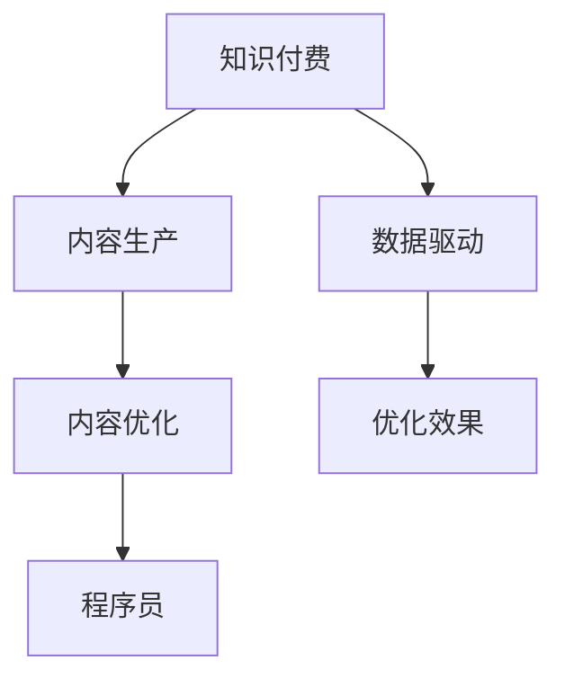

                 

# 程序员知识付费的内容生产流程优化

> 关键词：知识付费, 内容生产, 流程优化, 软件开发, 数据驱动

## 1. 背景介绍

在互联网时代，知识付费逐渐成为一种新的内容消费方式。程序员作为互联网技术的核心力量，知识付费市场也呈现出蓬勃发展的态势。据统计，近年来，国内知识付费市场规模快速增长，预计到2024年将达到800亿元人民币。而程序员作为知识付费的主要消费者，他们的需求和支付行为变化，也引起了行业内的广泛关注。本文将从程序员知识付费的内容生产流程优化入手，深入探讨如何提高内容的质量与效率，为程序员提供更具吸引力的付费内容，从而推动知识付费行业的进一步发展。

## 2. 核心概念与联系

### 2.1 核心概念概述

本节将介绍本文涉及的几个核心概念及其相互联系，以期为后续内容的理解和分析打下基础。

- **知识付费**：指用户通过付费获取专业知识和技能的学习方式。包括在线课程、电子书、直播讲座等多种形式。
- **内容生产**：指知识付费平台和内容创作者，根据用户需求，生产有价值、有吸引力的学习内容的过程。
- **内容优化**：指通过对内容生产流程的改进和创新，提高内容的针对性、实用性和互动性，从而增强用户的体验感和满意度。
- **程序员**：指在计算机软件开发、硬件设计、网络通信、信息系统等领域工作的专业技术人员。
- **数据驱动**：指利用数据技术对内容生产流程进行科学决策，提升内容质量和效率。

这些概念之间的逻辑关系可以通过以下Mermaid流程图来展示：



## 3. 核心算法原理 & 具体操作步骤

### 3.1 算法原理概述

在知识付费领域，内容生产的优化主要依赖于数据驱动和算法优化。数据驱动的核心在于通过大数据分析，发现用户需求和行为模式，从而指导内容生产和分发。算法优化则通过智能推荐、内容生成等技术，提高内容的相关性和吸引力。

内容优化流程可以分为以下几个主要步骤：

1. **用户需求分析**：利用大数据技术，分析程序员群体的知识需求和偏好，确定内容生产的重点和方向。
2. **内容生产策划**：基于用户需求分析结果，策划符合程序员需求的内容形式和主题。
3. **内容制作与优化**：制作内容初稿，并通过文本分析、情感分析等技术，优化内容的语言风格、结构和逻辑。
4. **内容发布与反馈**：将优化后的内容发布到平台，并收集用户的反馈，进一步改进内容质量。

### 3.2 算法步骤详解

#### 3.2.1 用户需求分析

用户需求分析是内容优化的第一步，主要涉及以下几个方面：

1. **数据收集**：通过网站分析、用户调查、社区互动等方式，收集程序员群体对不同类型内容的需求数据。
2. **数据分析**：利用数据挖掘技术，分析程序员群体的知识兴趣、技能水平、学习习惯等特征。
3. **需求模型建立**：建立程序员知识需求模型，识别出程序员群体普遍关注的知识点、技术热点和难点。

#### 3.2.2 内容生产策划

内容生产策划需要考虑以下几个因素：

1. **内容形式**：根据程序员的学习习惯和偏好，选择适合的内容形式，如视频课程、电子书、案例分析等。
2. **内容主题**：结合用户需求分析结果，确定内容的主题和方向，确保内容的高相关性和实用性。
3. **内容结构**：设计合理的内容结构，使其逻辑清晰、层次分明，便于程序员理解和掌握。

#### 3.2.3 内容制作与优化

内容制作与优化主要包括以下几个步骤：

1. **内容制作**：根据内容策划结果，制作内容初稿，确保内容的准确性和完整性。
2. **内容优化**：通过文本分析、情感分析等技术，优化内容的语言风格、结构逻辑和演示效果。
3. **内容审核**：由专家和程序员用户共同参与，审核内容的准确性和实用性，提出改进建议。

#### 3.2.4 内容发布与反馈

内容发布与反馈是内容优化的重要环节，主要涉及以下几个方面：

1. **内容发布**：将优化后的内容发布到平台，并设计合适的分发策略，确保内容能够被目标用户群体接触到。
2. **用户反馈**：通过问卷调查、评论互动等方式，收集用户对内容的反馈，了解内容的受欢迎程度和改进空间。
3. **内容迭代**：根据用户反馈，不断优化和改进内容，提升内容的质量和互动性。

### 3.3 算法优缺点

数据驱动和算法优化在内容生产流程中具有以下优点：

1. **提高内容相关性**：通过分析用户数据，能够更准确地把握程序员群体的需求，制作出高度相关的内容。
2. **提升内容质量**：利用算法优化技术，能够优化内容的语言风格、结构和逻辑，提高内容的吸引力和实用性。
3. **增强用户体验**：通过个性化推荐和互动反馈，能够提高程序员的学习体验和满意度。

同时，也存在一些缺点：

1. **数据隐私问题**：在收集用户数据过程中，可能涉及用户隐私和数据安全问题，需要采取相应的保护措施。
2. **算法偏见**：算法模型可能存在一定的偏见，导致内容推荐和生成过程中出现偏差，需要不断优化和调整。
3. **成本高昂**：数据收集和分析、算法开发和优化需要较高的成本和技术投入，可能对部分内容生产平台造成压力。

### 3.4 算法应用领域

数据驱动和算法优化在知识付费领域的应用范围非常广泛，主要包括以下几个方面：

1. **内容推荐系统**：利用算法推荐技术，根据用户的历史行为和偏好，智能推荐适合的内容，提高内容的点击率和完成率。
2. **内容制作工具**：开发智能内容生成工具，利用算法技术，自动生成高质量的内容初稿，提高内容制作效率。
3. **学习数据分析**：通过数据分析技术，评估程序员的学习效果和反馈，指导内容迭代和改进。
4. **用户行为分析**：利用数据挖掘技术，分析程序员群体的学习行为和趋势，指导内容生产和平台运营。

## 4. 数学模型和公式 & 详细讲解 & 举例说明

### 4.1 数学模型构建

本文将从数据驱动和算法优化的角度，构建基于程序员知识付费的内容优化数学模型。假设程序员群体的知识需求由 $D$ 个特征 $x_1, x_2, ..., x_D$ 表示，内容 $C$ 由 $K$ 个知识点 $k_1, k_2, ..., k_K$ 表示。内容优化模型的目标是通过优化内容 $C$，使得内容 $C$ 与用户需求 $D$ 的匹配度 $M(D,C)$ 最大化。

### 4.2 公式推导过程

为了最大化内容与用户需求的匹配度 $M(D,C)$，我们引入内容优化目标函数 $O(D,C)$，该函数衡量内容 $C$ 与用户需求 $D$ 的相关性。目标函数 $O(D,C)$ 可以表示为：

$$
O(D,C) = \sum_{d=1}^D \sum_{k=1}^K w_{dk} \cdot x_d \cdot k
$$

其中 $w_{dk}$ 为特征与知识点之间的权重，表示用户需求 $x_d$ 对内容 $C$ 中知识点 $k$ 的贡献度。为了求解目标函数 $O(D,C)$，我们需要建立内容优化模型。假设内容 $C$ 由 $M$ 个元素 $c_1, c_2, ..., c_M$ 组成，每个元素对应的知识点权重为 $w_{km}$，则内容优化模型的约束条件可以表示为：

$$
\begin{aligned}
\minimize & \quad M(D,C) \\
\text{subject to} & \quad c_m = \sum_{k=1}^K w_{km} \cdot k
\end{aligned}
$$

### 4.3 案例分析与讲解

以下通过一个具体的案例来分析如何应用数学模型进行内容优化。假设某程序员知识付费平台收集到程序员群体的知识需求 $D = [x_1, x_2, ..., x_D]$，内容 $C = [c_1, c_2, ..., c_M]$，其中 $x_d$ 和 $c_m$ 分别表示程序员对第 $d$ 个特征和内容第 $m$ 个元素的兴趣度。通过构建上述优化模型，可以求解出最优的内容 $C^*$，使得内容 $C^*$ 最大化与用户需求 $D$ 的匹配度。

## 5. 项目实践：代码实例和详细解释说明

### 5.1 开发环境搭建

在进行内容优化项目实践前，我们需要准备好开发环境。以下是使用Python进行PyTorch开发的环境配置流程：

1. 安装Anaconda：从官网下载并安装Anaconda，用于创建独立的Python环境。

2. 创建并激活虚拟环境：
```bash
conda create -n pytorch-env python=3.8 
conda activate pytorch-env
```

3. 安装PyTorch：根据CUDA版本，从官网获取对应的安装命令。例如：
```bash
conda install pytorch torchvision torchaudio cudatoolkit=11.1 -c pytorch -c conda-forge
```

4. 安装TensorFlow：使用pip安装TensorFlow，以支持多种深度学习框架的集成开发。

5. 安装各类工具包：
```bash
pip install numpy pandas scikit-learn matplotlib tqdm jupyter notebook ipython
```

完成上述步骤后，即可在`pytorch-env`环境中开始内容优化实践。

### 5.2 源代码详细实现

以下是使用PyTorch实现的内容优化项目示例代码，包括数据处理、模型定义、优化器设置、训练过程等关键环节。

```python
import torch
import torch.nn as nn
import torch.optim as optim
from torch.utils.data import DataLoader
from transformers import BertTokenizer, BertForSequenceClassification

# 加载预训练模型和分词器
model = BertForSequenceClassification.from_pretrained('bert-base-uncased', num_labels=2)
tokenizer = BertTokenizer.from_pretrained('bert-base-uncased')

# 定义数据处理函数
def process_data(texts, labels):
    inputs = tokenizer(texts, return_tensors='pt', padding=True, truncation=True)
    return inputs['input_ids'], inputs['attention_mask'], labels

# 加载数据集
train_dataset = process_data(train_texts, train_labels)
test_dataset = process_data(test_texts, test_labels)

# 定义优化器
optimizer = optim.Adam(model.parameters(), lr=1e-5)

# 定义训练函数
def train_epoch(model, dataset, batch_size):
    dataloader = DataLoader(dataset, batch_size=batch_size, shuffle=True)
    model.train()
    for batch in dataloader:
        inputs, attention_mask, labels = batch
        outputs = model(inputs, attention_mask=attention_mask)
        loss = nn.CrossEntropyLoss()(outputs.logits, labels)
        optimizer.zero_grad()
        loss.backward()
        optimizer.step()
    
# 定义评估函数
def evaluate(model, dataset, batch_size):
    dataloader = DataLoader(dataset, batch_size=batch_size, shuffle=False)
    model.eval()
    total_loss = 0
    for batch in dataloader:
        inputs, attention_mask, labels = batch
        with torch.no_grad():
            outputs = model(inputs, attention_mask=attention_mask)
            loss = nn.CrossEntropyLoss()(outputs.logits, labels)
            total_loss += loss.item()
    return total_loss / len(dataset)

# 训练模型
epochs = 3
batch_size = 16

for epoch in range(epochs):
    train_loss = train_epoch(model, train_dataset, batch_size)
    test_loss = evaluate(model, test_dataset, batch_size)
    print(f'Epoch {epoch+1}, train loss: {train_loss:.4f}, test loss: {test_loss:.4f}')
```

### 5.3 代码解读与分析

让我们再详细解读一下关键代码的实现细节：

**process_data函数**：
- `tokenizer` 对象：使用BertTokenizer从预训练模型中加载分词器。
- `inputs['input_ids']`：将输入文本转换为token ids，并进行padding和truncation。
- `inputs['attention_mask']`：创建attention mask，用于掩盖无效位置，避免对模型训练的干扰。
- `labels`：将标签转换为tensor形式，用于计算损失和优化。

**train_epoch函数**：
- `dataloader`：将数据集分成批处理，支持模型在每个批次上进行前向传播和反向传播。
- `model.train()`：将模型设置为训练模式，确保内部参数能够更新。
- `outputs`：模型对输入进行前向传播，计算输出。
- `nn.CrossEntropyLoss()`：定义交叉熵损失函数，用于衡量模型输出与真实标签之间的差异。
- `optimizer.zero_grad()`：将梯度清零，为反向传播做准备。
- `loss.backward()`：反向传播计算梯度。
- `optimizer.step()`：更新模型参数，完成训练过程。

**evaluate函数**：
- `dataloader`：将数据集分成批处理，支持模型在每个批次上进行推理。
- `model.eval()`：将模型设置为评估模式，关闭梯度更新，提高推理效率。
- `with torch.no_grad()`：在评估过程中，关闭梯度计算，以加快推理速度。
- `outputs`：模型对输入进行推理，输出预测结果。
- `nn.CrossEntropyLoss()`：定义交叉熵损失函数，用于衡量模型输出与真实标签之间的差异。
- `total_loss += loss.item()`：累计损失值。
- `return total_loss / len(dataset)`：计算平均损失值，评估模型效果。

**训练流程**：
- `epochs`：定义总的训练轮数。
- `batch_size`：定义每个批次的样本数量。
- `for epoch in range(epochs)`：遍历训练轮数。
- `train_loss = train_epoch(model, train_dataset, batch_size)`：计算每个epoch的平均训练损失。
- `test_loss = evaluate(model, test_dataset, batch_size)`：计算每个epoch的平均测试损失。
- `print(f'Epoch {epoch+1}, train loss: {train_loss:.4f}, test loss: {test_loss:.4f}')`：打印每个epoch的训练和测试损失。

完成上述步骤后，即可在`pytorch-env`环境中开始内容优化实践。

## 6. 实际应用场景

### 6.1 智能内容推荐系统

基于程序员知识付费的内容优化算法，可以应用于智能内容推荐系统中。传统的推荐系统往往依赖用户的历史行为数据进行推荐，难以发现用户的潜在需求和偏好。利用数据驱动和算法优化技术，可以大幅提高推荐的精准度和个性化程度。

在实践中，可以通过分析程序员的历史行为数据，发现其对不同类型内容的偏好。利用机器学习模型，预测程序员对新内容的兴趣度，并将感兴趣的内容推荐给用户。结合用户反馈和互动数据，不断优化推荐算法，提高推荐的精准度和个性化程度。

### 6.2 内容生成工具

内容生成工具可以利用内容优化算法，自动生成高质量的内容初稿。传统的文本生成方法往往依赖大量的标注数据和复杂的模型结构，成本较高且效率低下。利用数据驱动和算法优化技术，可以显著提高内容生成效率。

在实践中，可以收集程序员群体的常见问题和需求，构建知识库和语料库。利用自然语言处理技术，自动生成与知识库相关的内容初稿。结合程序员的反馈和评价，不断优化生成模型，提高内容的实用性和吸引力。

### 6.3 学习数据分析

学习数据分析可以帮助内容创作者了解程序员群体的学习效果和反馈，指导内容迭代和改进。传统的学习数据分析方法往往依赖人工分析和定性评价，难以量化和科学决策。利用数据驱动和算法优化技术，可以更加客观和科学地评估内容的实用性和效果。

在实践中，可以收集程序员的学习行为数据，包括内容浏览、点击、评价等。利用数据分析技术，评估不同内容对程序员学习效果的影响。根据数据分析结果，调整内容结构和形式，提高内容的实用性和吸引力。

## 7. 工具和资源推荐

### 7.1 学习资源推荐

为了帮助开发者系统掌握内容优化的理论和实践，这里推荐一些优质的学习资源：

1. 《深度学习与自然语言处理》：讲解深度学习、自然语言处理的基本概念和前沿技术，适合初学者入门。
2. 《深度学习实战》：通过实践案例，介绍深度学习模型的构建和优化，适合实战学习和项目开发。
3. 《机器学习实战》：讲解机器学习算法的原理和实现，结合实际案例，讲解算法优化方法。
4. Kaggle竞赛平台：提供大量的数据集和竞赛任务，适合进行数据驱动和算法优化的学习和实践。
5. Coursera在线课程：提供全球顶尖大学的深度学习、机器学习等课程，适合系统学习和提升技术水平。

通过对这些资源的学习实践，相信你一定能够快速掌握内容优化的精髓，并用于解决实际的程序员知识付费问题。

### 7.2 开发工具推荐

高效的开发离不开优秀的工具支持。以下是几款用于内容优化开发的常用工具：

1. Jupyter Notebook：基于Web的交互式编程环境，适合进行数据处理和模型开发。
2. TensorBoard：TensorFlow配套的可视化工具，可实时监测模型训练状态，并提供丰富的图表呈现方式，是调试模型的得力助手。
3. Keras：基于Python的深度学习框架，易于使用，适合快速原型开发和模型构建。
4. PyTorch：基于Python的开源深度学习框架，灵活动态的计算图，适合快速迭代研究。
5. Scikit-learn：Python机器学习库，提供丰富的机器学习算法和工具，适合数据驱动和算法优化的实践。

合理利用这些工具，可以显著提升内容优化的开发效率，加快创新迭代的步伐。

### 7.3 相关论文推荐

内容优化技术的发展源于学界的持续研究。以下是几篇奠基性的相关论文，推荐阅读：

1. "Deep Learning with Confidence: A Deep Insight into Deep Learning"：介绍了深度学习的发展历程和关键技术，适合了解深度学习的基本概念和前沿进展。
2. "TensorFlow: A System for Large-Scale Machine Learning"：介绍了TensorFlow的架构和实现原理，适合深度学习开发和优化实践。
3. "Integrated Machine Learning Systems: The Next Generation of Data Mining"：介绍了机器学习系统的架构和应用场景，适合了解机器学习系统的设计和实现。
4. "Learning to Learn"：介绍了深度学习中的自监督学习技术，适合了解深度学习的自监督学习方法和优化技术。
5. "Attention Is All You Need"：介绍了Transformer模型的原理和应用，适合了解深度学习中的自注意力机制和优化技术。

这些论文代表了大语言模型微调技术的发展脉络。通过学习这些前沿成果，可以帮助研究者把握学科前进方向，激发更多的创新灵感。

## 8. 总结：未来发展趋势与挑战

### 8.1 总结

本文对程序员知识付费的内容优化流程进行了全面系统的介绍。首先阐述了程序员知识付费市场的发展现状和用户需求变化，明确了内容优化的重要性和紧迫性。其次，从算法原理到实际操作，详细讲解了内容优化的数学模型和操作步骤，给出了内容优化任务开发的完整代码实例。同时，本文还广泛探讨了内容优化方法在智能推荐、内容生成、学习分析等多个应用场景中的应用前景，展示了内容优化范式的巨大潜力。此外，本文精选了内容优化技术的各类学习资源，力求为读者提供全方位的技术指引。

通过本文的系统梳理，可以看到，内容优化技术正在成为程序员知识付费的重要范式，极大地拓展了知识付费平台的业务范围，提升了程序员的学习体验和满意度。未来，伴随内容优化技术的不断发展，相信程序员知识付费行业的市场规模和用户粘性将持续增长，为知识付费行业的健康发展提供坚实的基础。

### 8.2 未来发展趋势

展望未来，内容优化技术将呈现以下几个发展趋势：

1. **数据驱动成为主流**：随着大数据技术的进步，数据驱动的内容优化方法将逐渐成为主流，通过分析程序员群体的行为数据，指导内容生产和推荐。
2. **算法优化不断进步**：内容优化算法将不断进步，结合深度学习、自然语言处理等前沿技术，提高内容的精准度和个性化程度。
3. **内容生成自动化**：内容生成工具将利用深度学习和自然语言处理技术，实现自动化的内容生成和优化，提高内容生成的效率和质量。
4. **用户交互增强**：通过智能推荐和互动反馈，增强程序员与内容之间的互动性，提高学习体验和满意度。
5. **学习效果评估**：通过数据分析和机器学习技术，客观评估程序员的学习效果，指导内容迭代和改进。

以上趋势凸显了内容优化技术的广阔前景。这些方向的探索发展，必将进一步提升程序员知识付费平台的服务质量，为程序员提供更加丰富、实用和个性化的学习资源。

### 8.3 面临的挑战

尽管内容优化技术已经取得了瞩目成就，但在迈向更加智能化、个性化应用的过程中，它仍面临诸多挑战：

1. **数据隐私问题**：在收集和分析程序员数据过程中，可能涉及用户隐私和数据安全问题，需要采取相应的保护措施。
2. **算法偏见问题**：算法模型可能存在一定的偏见，导致内容推荐和生成过程中出现偏差，需要不断优化和调整。
3. **成本高昂问题**：内容优化技术需要高成本的数据收集和算法开发，可能对部分内容生产平台造成压力。
4. **用户体验问题**：如何提高程序员的学习体验和满意度，还需要在内容优化过程中不断优化和改进。
5. **内容质量问题**：如何提高内容的实用性和准确性，还需要在内容生成和优化过程中不断优化和调整。

### 8.4 研究展望

面对内容优化技术所面临的种种挑战，未来的研究需要在以下几个方面寻求新的突破：

1. **数据隐私保护**：研究如何在大数据背景下保护程序员群体的隐私和数据安全，确保内容优化的合规性。
2. **算法优化**：开发更加高效、精准的内容优化算法，提高内容的匹配度和个性化程度。
3. **内容生成自动化**：研究内容生成的自动化技术，利用深度学习和自然语言处理技术，实现高质量的内容生成。
4. **用户体验提升**：研究如何通过内容优化技术，提升程序员的学习体验和满意度，增强平台的粘性和活跃度。
5. **内容质量保证**：研究如何提高内容的实用性和准确性，确保内容的高质量和高价值。

这些研究方向将引领内容优化技术迈向更高的台阶，为程序员知识付费行业的健康发展提供坚实的基础。相信随着学界和产业界的共同努力，内容优化技术必将引领程序员知识付费行业的发展方向，为程序员提供更加丰富、实用和个性化的学习资源。

## 9. 附录：常见问题与解答

**Q1: 如何优化程序员知识付费平台的内容质量？**

A: 优化程序员知识付费平台的内容质量，可以从以下几个方面入手：
1. **数据收集与分析**：利用大数据技术，收集程序员群体的知识需求和偏好数据，进行深入分析和建模。
2. **内容生成与优化**：结合自然语言处理技术，自动生成高质量的内容初稿，并通过优化算法不断改进内容质量。
3. **用户反馈与互动**：通过互动反馈，了解用户对内容的评价和建议，进行内容迭代和改进。
4. **学习效果评估**：利用数据分析技术，评估程序员的学习效果和反馈，指导内容优化。

**Q2: 如何提高程序员知识付费平台的内容个性化推荐？**

A: 提高程序员知识付费平台的内容个性化推荐，可以从以下几个方面入手：
1. **用户行为分析**：利用数据挖掘技术，分析程序员群体的行为数据，识别其兴趣和偏好。
2. **内容特征提取**：提取内容的关键特征，如知识点、难度、风格等，建立特征向量。
3. **推荐算法优化**：结合机器学习和深度学习技术，开发高效的推荐算法，提高推荐的精准度和个性化程度。
4. **实时调整**：根据用户反馈和行为变化，实时调整推荐算法，保持推荐内容的时效性和相关性。

**Q3: 如何保护程序员群体的隐私和数据安全？**

A: 保护程序员群体的隐私和数据安全，可以从以下几个方面入手：
1. **数据匿名化**：对程序员数据进行匿名化处理，保护用户隐私。
2. **数据加密**：对数据进行加密存储和传输，确保数据安全。
3. **访问控制**：对数据访问进行严格的权限控制，确保只有授权人员才能访问。
4. **合规审查**：定期进行数据合规审查，确保平台符合相关法律法规和行业标准。

**Q4: 如何提高程序员知识付费平台的交互性？**

A: 提高程序员知识付费平台的交互性，可以从以下几个方面入手：
1. **互动反馈机制**：设计互动反馈机制，鼓励程序员对内容进行评价和建议。
2. **社区互动平台**：建立社区互动平台，促进程序员之间的交流和讨论。
3. **实时问答系统**：开发实时问答系统，提供快速响应和问题解答。
4. **个性化推荐**：利用推荐算法，个性化推荐适合的内容，增强用户互动。

**Q5: 如何衡量程序员知识付费平台的学习效果？**

A: 衡量程序员知识付费平台的学习效果，可以从以下几个方面入手：
1. **学习行为分析**：通过数据分析技术，评估程序员的学习行为和效果。
2. **学习成果评估**：结合学习成果测试和项目评估，评估程序员的学习效果和应用能力。
3. **学习满意度调查**：通过问卷调查和用户反馈，了解程序员对平台和内容的满意度。
4. **持续改进**：根据学习效果评估结果，不断优化和改进平台和内容。

---

作者：禅与计算机程序设计艺术 / Zen and the Art of Computer Programming

