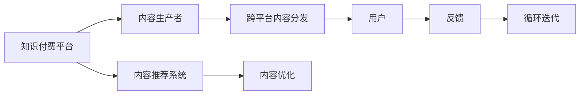

                 

# 程序员知识付费的跨平台内容分发

## 1. 背景介绍

在数字化转型的浪潮下，知识付费成为了许多人获取专业技能、提升职场竞争力的一种重要方式。对于程序员这一特定群体来说，无论是初入职场的新手，还是经验丰富的专家，都在持续学习和自我提升。然而，高质量的知识内容并不容易获得，尤其是对于初学者和自我学习者来说，往往需要花费大量时间和精力去筛选和验证内容。此时，基于跨平台的内容分发机制，成为了程序员知识付费的重要趋势。本文将详细介绍程序员知识付费的跨平台内容分发技术，以及其实现原理、操作步骤和优缺点，并给出数学模型、代码实例和未来发展展望。

## 2. 核心概念与联系

### 2.1 核心概念概述

在探讨程序员知识付费的跨平台内容分发之前，我们先明确几个核心概念：

- **知识付费**：指通过在线课程、电子书、专栏文章等方式，向用户提供有价值的学习资料和专业技能，用户通过付费获取这些内容。
- **跨平台内容分发**：指将内容发布到多个不同的平台（如网站、APP、社交媒体等），使用户可以在不同设备和场景下方便访问。
- **内容推荐系统**：通过分析用户行为和内容特征，为用户推荐个性化的内容，提高用户粘性和平台价值。

这些概念之间的联系可以概括为：知识付费平台通过跨平台的内容分发，将高质量的内容推荐给特定的用户，实现商业化和用户价值的最大化。

### 2.2 核心概念原理和架构的 Mermaid 流程图



这个流程图展示了知识付费平台的核心工作流程：内容生产者（程序员）向平台提供内容，平台通过跨平台分发这些内容给用户，同时利用推荐系统为用户推荐个性化的内容。用户的反馈会影响推荐系统的优化，平台和内容生产者通过不断的循环迭代，提升内容的价值和用户体验。

## 3. 核心算法原理 & 具体操作步骤

### 3.1 算法原理概述

程序员知识付费的跨平台内容分发，本质上是一种推荐系统（Recommendation System）的应用。推荐系统的目标是根据用户的历史行为、偏好、兴趣等信息，为其推荐可能感兴趣的内容。跨平台分发则是指将推荐的内容发布到多个平台，以提升用户的访问便利性和平台的覆盖范围。

推荐系统的一般模型可以表示为：

$$
\hat{y} = f(x; \theta)
$$

其中，$x$ 是用户特征向量，$\theta$ 是模型参数，$\hat{y}$ 是系统预测的内容是否被用户点击或购买。常见的推荐模型包括协同过滤、基于内容的推荐、矩阵分解等。

在跨平台内容分发中，我们还需要考虑如何在多个平台之间进行数据同步和内容调度。这通常涉及到数据中间件（Data Mesh）、API网关（API Gateway）等技术。

### 3.2 算法步骤详解

#### 3.2.1 数据收集与预处理

1. **数据来源**：包括用户行为数据（如浏览记录、点击行为、购买记录等）、内容特征数据（如文章标题、摘要、关键词等）、平台数据（如访问量、点击率等）。
2. **数据清洗**：去除噪声数据、处理缺失值、标准化数据格式等。
3. **数据标注**：为每篇内容打上标签，如热门、冷门、高价值等。

#### 3.2.2 模型训练与优化

1. **特征工程**：将用户特征和内容特征进行组合，提取有意义的特征。
2. **模型选择与训练**：选择适合的推荐算法，如基于协同过滤的矩阵分解算法、基于内容的TF-IDF算法等。
3. **模型优化**：通过交叉验证、网格搜索等方法，调整模型参数，提升推荐效果。

#### 3.2.3 内容分发与调度

1. **分发策略**：设计分发策略，如时间分布、平台分布等。
2. **内容同步**：通过API网关等技术，实现内容在多个平台之间的同步更新。
3. **流量控制**：根据平台流量和用户需求，进行动态内容调度。

#### 3.2.4 反馈收集与调整

1. **用户反馈**：通过用户评分、评论等方式，收集用户对内容的反馈。
2. **推荐调整**：根据用户反馈，调整推荐模型和分发策略。
3. **效果评估**：定期评估推荐系统的效果，如点击率、转化率等。

### 3.3 算法优缺点

#### 3.3.1 优点

1. **提升用户体验**：通过跨平台分发，用户可以在不同的设备上方便访问内容，提高用户粘性。
2. **覆盖更广泛的用户**：通过多个平台的分发，可以覆盖更多的用户，提升平台的市场影响力。
3. **提高内容价值**：推荐系统可以根据用户行为进行优化，提升内容的推荐效果，增加用户点击和购买率。

#### 3.3.2 缺点

1. **数据隐私问题**：跨平台分发需要收集和处理大量的用户数据，存在隐私泄露的风险。
2. **技术复杂度较高**：推荐系统和跨平台分发涉及的数据同步、内容调度等技术，实现难度较大。
3. **内容同质化**：如果推荐算法不合理，可能会导致内容同质化，用户体验不佳。

### 3.4 算法应用领域

程序员知识付费的跨平台内容分发，在以下几个领域有广泛应用：

- **在线教育平台**：如Coursera、Udacity等，通过跨平台分发课程和资料，提升用户的访问便利性和平台覆盖范围。
- **技术博客和社区**：如Medium、Stack Overflow等，通过推荐系统为用户推荐高质量的文章和技术分享，提高用户粘性和平台价值。
- **开源软件和工具**：如GitHub、npm等，通过跨平台分发工具和项目，吸引更多的开发者加入社区，提升平台的活跃度。

## 4. 数学模型和公式 & 详细讲解 & 举例说明

### 4.1 数学模型构建

在推荐系统中，常用的模型包括协同过滤、基于内容的推荐和矩阵分解等。这里以矩阵分解算法为例，介绍其数学模型构建过程。

设用户-物品评分矩阵为 $R$，用户特征矩阵为 $U$，物品特征矩阵为 $V$，用户特征和物品特征的组合矩阵为 $H$，推荐结果矩阵为 $\hat{R}$。

$$
H = UV^\top
$$

$$
\hat{R} = RH
$$

其中，$H$ 为 $R$ 的低秩近似，$U$ 和 $V$ 为特征矩阵，$\hat{R}$ 为推荐结果矩阵。

### 4.2 公式推导过程

矩阵分解算法的推导过程如下：

1. **用户-物品评分矩阵分解**：
   $$
   R \approx UV^\top
   $$

2. **推荐结果矩阵计算**：
   $$
   \hat{R} = RH
   $$

   其中，$R$ 和 $\hat{R}$ 均为 $m \times n$ 矩阵，$U$ 和 $V$ 均为 $m \times k$ 矩阵，$H$ 为 $k \times n$ 矩阵。

### 4.3 案例分析与讲解

假设有一个程序员在线教育平台，平台上有 $m=1000$ 个课程和 $n=5000$ 个用户，用户对课程的评分矩阵为 $R \in \mathbb{R}^{1000 \times 5000}$。平台希望根据用户的历史行为和课程特征，为用户推荐评分高的课程。

1. **数据收集**：收集用户对课程的评分矩阵 $R$。
2. **特征提取**：提取用户的特征向量 $U \in \mathbb{R}^{1000 \times k}$ 和课程的特征向量 $V \in \mathbb{R}^{n \times k}$。
3. **低秩矩阵分解**：通过矩阵分解算法，得到 $H \in \mathbb{R}^{k \times n}$。
4. **推荐计算**：根据 $H$，计算推荐结果矩阵 $\hat{R}$，得到用户推荐的课程。

## 5. 项目实践：代码实例和详细解释说明

### 5.1 开发环境搭建

为了实现跨平台内容分发，我们需要搭建一个跨平台的内容管理系统。以下是搭建环境的步骤：

1. **选择技术栈**：
   - 前端：React、Vue等。
   - 后端：Node.js、Python等。
   - 数据库：MySQL、MongoDB等。
   - API网关：Kong、Zuul等。
   - 缓存：Redis、Memcached等。

2. **环境配置**：
   - 安装Node.js、Python等开发工具。
   - 配置数据库、缓存、API网关等中间件。

3. **项目管理**：
   - 使用Git进行版本控制。
   - 使用Docker进行容器化部署。

### 5.2 源代码详细实现

以下是一个简单的跨平台内容分发系统的代码实现示例，以Node.js和MongoDB为例：

#### 5.2.1 前端代码

```javascript
import React, { useState, useEffect } from 'react';
import axios from 'axios';

const App = () => {
  const [courses, setCourses] = useState([]);

  useEffect(() => {
    axios.get('https://api.example.com/courses')
      .then(response => {
        setCourses(response.data);
      })
      .catch(error => {
        console.error(error);
      });
  }, []);

  return (
    <div>
      {courses.map(course => (
        <div key={course.id}>
          <h2>{course.title}</h2>
          <p>{course.description}</p>
          <button onClick={() => showCourseDetails(course.id)}>查看详情</button>
        </div>
      ))}
    </div>
  );
};

export default App;
```

#### 5.2.2 后端代码

```javascript
const express = require('express');
const axios = require('axios');
const app = express();

app.get('/courses', async (req, res) => {
  try {
    const response = await axios.get('https://api.example.com/courses');
    res.json(response.data);
  } catch (error) {
    res.status(500).json({ error: 'Internal server error' });
  }
});

app.listen(3000, () => {
  console.log('Server started on port 3000');
});
```

### 5.3 代码解读与分析

#### 5.3.1 前端解读

- **React组件**：使用React构建前端页面，通过useState和useEffect钩子管理状态和生命周期。
- **axios请求**：使用axios库进行HTTP请求，获取后端API返回的课程数据。

#### 5.3.2 后端解读

- **Express框架**：使用Express框架搭建后端API，处理HTTP请求。
- **axios请求**：使用axios库进行HTTP请求，获取外部API返回的课程数据。

### 5.4 运行结果展示

运行以上代码，可以访问 `http://localhost:3000/courses`，查看所有课程列表。点击课程详情链接，可以查看课程的具体信息。

## 6. 实际应用场景

### 6.1 在线教育平台

在线教育平台通过跨平台内容分发，可以提升课程的访问便利性和平台的覆盖范围。用户可以在手机、平板、电脑等不同设备上访问课程，提高学习效率和平台粘性。

### 6.2 技术博客和社区

技术博客和社区通过推荐系统，为用户推荐高质量的文章和技术分享。用户可以在多个平台上获取有价值的内容，提升学习效果和平台价值。

### 6.3 开源软件和工具

开源软件和工具通过跨平台分发，吸引更多的开发者加入社区，提升平台的活跃度和用户粘性。开发者可以在多个平台上获取工具和项目，加速开发进程。

## 7. 工具和资源推荐

### 7.1 学习资源推荐

为了深入理解跨平台内容分发技术，以下是一些推荐的学习资源：

1. **《推荐系统实战》**：介绍推荐系统的原理和实现方法，涵盖协同过滤、基于内容的推荐等。
2. **《深度学习实战》**：深入讲解深度学习在推荐系统中的应用，包括神经网络、卷积神经网络等。
3. **Kaggle竞赛**：参加Kaggle推荐系统竞赛，积累实战经验。

### 7.2 开发工具推荐

为了高效实现跨平台内容分发，以下是一些推荐的开发工具：

1. **React**：用于构建前端页面，支持跨平台开发。
2. **Vue**：另一个流行的前端框架，支持单页面应用和跨平台开发。
3. **Express**：用于搭建后端API，支持快速开发和部署。
4. **MongoDB**：用于存储用户行为数据和课程数据，支持高效查询和分析。
5. **Redis**：用于缓存用户行为数据和推荐结果，支持快速读写。

### 7.3 相关论文推荐

为了深入理解跨平台内容分发的原理和实现方法，以下是一些推荐的论文：

1. **《基于协同过滤的推荐系统研究》**：介绍协同过滤推荐系统的原理和应用。
2. **《深度学习在推荐系统中的应用》**：深入讲解深度学习在推荐系统中的应用。
3. **《跨平台推荐系统的设计与实现》**：介绍跨平台推荐系统的设计思路和实现方法。

## 8. 总结：未来发展趋势与挑战

### 8.1 研究成果总结

本文详细介绍了程序员知识付费的跨平台内容分发技术，包括推荐系统、跨平台分发和内容推荐等核心概念。通过数学模型和代码实例，展示了推荐系统和跨平台分发的实现方法。同时，分析了跨平台内容分发的优缺点和应用场景，推荐了一些学习资源和开发工具。

### 8.2 未来发展趋势

未来，跨平台内容分发将呈现以下几个发展趋势：

1. **个性化推荐**：通过深度学习和自然语言处理技术，提升推荐系统的个性化能力，为用户提供更加精准的推荐。
2. **实时推荐**：通过流式计算和实时数据处理技术，实现实时推荐，提升用户体验和平台价值。
3. **多模态内容推荐**：将文本、图像、音频等多模态数据结合，提升推荐系统的丰富性和多样性。

### 8.3 面临的挑战

在跨平台内容分发的发展过程中，仍然面临以下几个挑战：

1. **数据隐私和安全**：跨平台分发需要处理大量用户数据，存在隐私泄露和数据安全问题。
2. **算法复杂度**：推荐系统涉及的数据处理和算法复杂度较高，实现难度较大。
3. **平台兼容性**：不同平台之间的数据格式和API接口可能存在兼容性问题，需要进行统一的规范和设计。

### 8.4 研究展望

未来，跨平台内容分发技术需要进一步研究以下几个方向：

1. **联邦学习**：通过联邦学习技术，在保护用户隐私的前提下，进行跨平台数据共享和模型训练。
2. **边缘计算**：利用边缘计算技术，提升内容分发的实时性和响应速度。
3. **区块链技术**：通过区块链技术，实现数据的安全共享和透明性。

## 9. 附录：常见问题与解答

### 9.1 常见问题

**Q1: 如何选择合适的推荐算法？**

**A1:** 根据平台数据的特点和推荐需求，选择合适的推荐算法。一般选择协同过滤、基于内容的推荐、矩阵分解等。

**Q2: 如何提高推荐系统的个性化能力？**

**A2:** 通过深度学习和自然语言处理技术，提升推荐系统的个性化能力。可以使用词嵌入、深度神经网络等方法。

**Q3: 跨平台分发涉及哪些关键技术？**

**A3:** 跨平台分发涉及数据同步、内容调度、API网关等技术。需要使用中间件和缓存技术进行优化。

### 9.2 解答

**A1:** 选择合适的推荐算法需要考虑数据量、数据分布、用户行为等多个因素。一般来说，协同过滤算法适用于数据量较大的场景，基于内容的推荐适用于数据分布较为均匀的情况。矩阵分解算法适用于数据结构较为复杂的情况。

**A2:** 提高推荐系统的个性化能力需要综合考虑用户行为、内容特征、用户画像等多个因素。可以使用深度学习技术，如神经网络、卷积神经网络等，提升推荐系统的表现。

**A3:** 跨平台分发涉及的关键技术包括数据同步、内容调度、API网关等。需要使用中间件和缓存技术进行优化，提高内容分发的效率和稳定性。

---

作者：禅与计算机程序设计艺术 / Zen and the Art of Computer Programming

