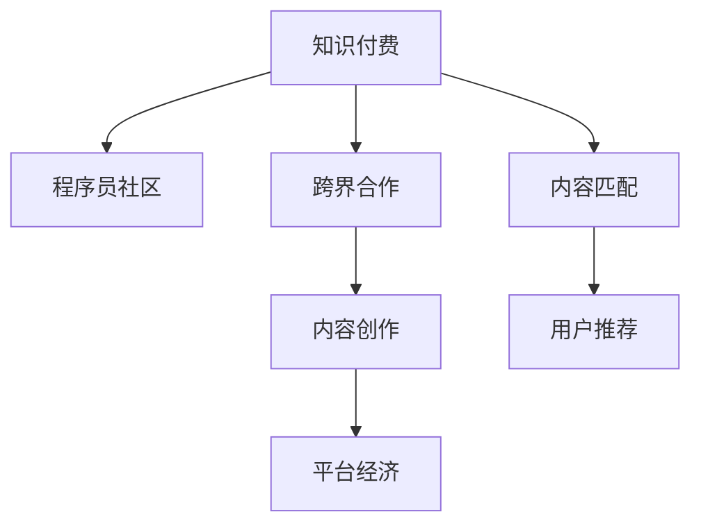

                 

# 程序员知识付费的跨界合作机会

> 关键词：知识付费、程序员社区、跨界合作、内容创作、平台经济

## 1. 背景介绍

### 1.1 问题由来
随着互联网和移动互联网技术的飞速发展，在线教育平台和知识付费市场日益繁荣。知识付费作为一种新兴的学习方式，越来越受到各行业专业人士的青睐。特别是对程序员这样的技术型人才，知识付费更是成为获取技术资讯、技能提升的重要渠道。但同时，知识付费也面临内容同质化、价值感不足等问题。如何探索知识付费的新模式，增强平台粘性，拓展内容创作渠道，成为摆在面前的重要课题。

### 1.2 问题核心关键点
知识付费的核心在于高质量内容的持续供给和精准匹配用户需求。程序员社区拥有众多技术牛人，具有丰富的编程经验和技术积累。如何将这些经验转化为可变现的知识内容，同时保持高水平的专业性和互动性，是跨界合作的关键。此外，平台如何拓展内容创作者和受众范围，增强社区粘性，同样是亟待解决的问题。

## 2. 核心概念与联系

### 2.1 核心概念概述

为更好地理解知识付费中的跨界合作机会，本节将介绍几个密切相关的核心概念：

- 知识付费（Knowledge Pay）：指用户为获取特定的知识内容支付费用的模式，通过付费获取高质量的学习资源，加速技术学习和职业发展。
- 程序员社区（Coding Community）：由程序员、技术爱好者等组成，以技术交流、编程讨论为主要内容，具有高度互动性和共享性。
- 跨界合作（Cross-industry Cooperation）：指不同领域间的技术、内容、平台等多方面的合作，共同开发和推广知识付费产品。
- 内容创作（Content Creation）：指生产、制作、发布知识付费内容的整个过程，包括选题、写作、编辑、审核、发布等环节。
- 平台经济（Platform Economy）：指基于平台机制，聚合多方资源，提供多元化服务，形成良性生态系统的商业模式。

这些核心概念之间的逻辑关系可以通过以下Mermaid流程图来展示：



这个流程图展示了两类核心概念的连接关系：

1. 知识付费与程序员社区的连接。程序员社区为知识付费提供了丰富的内容创作源泉，知识付费则为程序员社区提供了变现的渠道。
2. 跨界合作在知识付费与内容创作、平台经济之间的桥梁作用。通过跨界合作，可以引入更多的技术资源和用户群体，促进内容的创新和多样性。
3. 内容匹配和用户推荐是知识付费平台的核心功能，保证用户能够高效地获取到与自身需求匹配的高质量内容。

## 3. 核心算法原理 & 具体操作步骤
### 3.1 算法原理概述

跨界合作的知识付费模式，本质上是一个多方面的协同学习过程。其核心思想是：通过跨界整合程序员社区中的技术知识和用户需求，利用平台经济的优势，实现内容的精准匹配和快速传播，从而在知识付费市场中创造价值。

形式化地，假设知识付费平台为 $P$，程序员社区为 $C$，内容创作者为 $A$，用户为 $U$，则跨界合作的优化目标是最小化用户支付的平均成本，即找到最优的跨界合作策略：

$$
\theta^* = \mathop{\arg\min}_{\theta} \mathbb{E}_U[C_U(P)]
$$

其中 $C_U(P)$ 为某个用户 $U$ 在平台 $P$ 上的消费成本，$\mathbb{E}_U$ 表示对所有用户 $U$ 的期望，$\theta$ 为跨界合作策略的参数。

通过梯度下降等优化算法，跨界合作过程不断更新策略参数 $\theta$，最小化用户消费成本，同时确保内容质量和平台稳定性。由于程序员社区中的程序员牛人具有丰富的技术知识和实战经验，因此即便在小规模用户群体上进行跨界合作，也能较快收敛到理想的合作策略 $\theta^*$。

### 3.2 算法步骤详解

基于跨界合作的跨界知识付费模式一般包括以下几个关键步骤：

**Step 1: 搭建合作平台**
- 建立程序员社区与知识付费平台的连接，如通过API接口、数据共享协议等技术手段。
- 设计平台的具体功能模块，如课程搜索、用户评价、课程推荐等。
- 建立平台内容的审查、认证机制，确保内容质量。

**Step 2: 引入跨界资源**
- 引入程序员社区中的技术专家、经验分享者等，作为内容创作者。
- 策划并组织各类编程讲座、技术研讨、代码评审等活动，丰富内容形式。
- 挖掘社区中的技术牛人，如大V、技术专家等，作为平台的认证讲师。

**Step 3: 设计激励机制**
- 设计一套激励机制，吸引程序员社区中的优秀技术牛人参与内容创作。
- 引入众包平台、平台广告等收入分配机制，保证创作者的经济回报。
- 设计用户反馈系统，鼓励用户互动和内容评价。

**Step 4: 实施知识付费**
- 在平台内推广程序员社区中的优秀技术分享和课程。
- 设计合理的课程价格和付费模式，如按需付费、订阅模式等。
- 引入订阅机制，如学员订阅某个技术牛人的课程，获得持续更新的学习内容。

**Step 5: 监控与优化**
- 实时监控用户反馈和课程评价，及时调整内容策略。
- 定期进行内容评估，提升内容质量，淘汰劣质课程。
- 进行数据分析，优化平台运营和用户体验。

以上是跨界合作的跨界知识付费模式的一般流程。在实际应用中，还需要针对具体平台的用户需求和技术特点，对跨界合作过程的各个环节进行优化设计，如改进内容推荐算法，引入更多的激励措施等，以进一步提升知识付费的效果。

### 3.3 算法优缺点

跨界合作的知识付费模式具有以下优点：
1. 协同创新。程序员社区和知识付费平台共同开发高质量内容，内容形式更加多样，能够更好地满足用户需求。
2. 广泛传播。通过程序员社区的传播效应，知识付费内容可以快速覆盖到更多目标用户。
3. 经济效益。跨界合作带来多元化收入来源，促进平台经济的发展。
4. 社交价值。知识付费平台与程序员社区的深度结合，提升了社区的凝聚力和互动性。

同时，该模式也存在一定的局限性：
1. 技术壁垒。搭建跨界合作平台需要较高的技术投入，对于资源有限的创业公司而言，可能面临较大挑战。
2. 平台协调。程序员社区与知识付费平台需要高度协同，任何一方的责任缺失都可能导致合作失败。
3. 内容质量。内容创作者需要高度专业化，否则可能出现内容质量参差不齐的问题。
4. 用户体验。内容过多可能导致用户体验下降，平台需要设计合理的推荐机制。

尽管存在这些局限性，但就目前而言，跨界合作的知识付费模式仍然是大数据时代技术创新的重要方向。未来相关研究的重点在于如何进一步降低跨界合作的技术门槛，提升内容质量和平台稳定性，同时兼顾经济效益和社交价值等因素。

### 3.4 算法应用领域

跨界合作的知识付费模式，在程序员社区和技术分享平台中的应用已经取得了初步成效。以下是几个典型应用案例：

- GitHub上的开源课程：GitHub平台通过整合程序员社区中的开源项目和代码，提供高质量的编程课程。用户可以免费访问课程内容，但需要为特定项目的贡献付费，形成了开源与付费的结合。
- Stack Overflow的企业合作：Stack Overflow平台与企业合作，引入企业专家的技术分享，帮助用户解决实际问题，同时提供企业付费内容，实现了商业价值的变现。
- Udemy与各类技术社区的合作：Udemy平台与各种技术社区合作，邀请社区中的专家进行技术分享和课程开发，增强课程的专业性和权威性，吸引了大量技术学习者。

除了上述这些经典案例外，跨界合作的知识付费模式还在不断拓展应用场景，如基于区块链的知识共享平台、程序员自出版的技术书籍等，为技术知识的普及和传播提供了新的可能。

## 4. 数学模型和公式 & 详细讲解 & 举例说明
### 4.1 数学模型构建

本节将使用数学语言对跨界合作的知识付费模式进行更加严格的刻画。

假设知识付费平台 $P$ 中的课程内容为 $C=\{c_i\}_{i=1}^N$，用户 $U=\{u_j\}_{j=1}^M$，内容创作者 $A=\{a_k\}_{k=1}^L$。设 $u_j$ 对内容 $c_i$ 的消费成本为 $C_{uj}$。

定义平台的用户消费期望为：

$$
\mathbb{E}_U[C_U(P)] = \frac{1}{M}\sum_{j=1}^M \sum_{i=1}^N C_{uj}
$$

其中 $C_{uj} = C_{uj}(c_i, a_k)$ 为某个用户 $u_j$ 对某个内容创作者 $a_k$ 提供的内容 $c_i$ 的消费成本。

在模型中，用户对课程内容的消费成本由两部分组成：内容质量 $Q_{uj}(c_i, a_k)$ 和创作者的影响力 $F_{uj}(a_k)$。具体计算如下：

- 内容质量 $Q_{uj}(c_i, a_k)$：内容 $c_i$ 对用户 $u_j$ 的实用性，通常通过用户评价、课程评分等指标来衡量。
- 创作者影响力 $F_{uj}(a_k)$：内容创作者 $a_k$ 的权威性和号召力，通常通过创作者的认证等级、社会影响力等指标来衡量。

因此，用户消费期望可以表示为：

$$
\mathbb{E}_U[C_U(P)] = \frac{1}{M}\sum_{j=1}^M \sum_{i=1}^N [Q_{uj}(c_i, a_k) + F_{uj}(a_k)] \cdot P_{uj}(c_i, a_k)
$$

其中 $P_{uj}(c_i, a_k)$ 为用户 $u_j$ 对内容创作者 $a_k$ 提供的内容 $c_i$ 的选择概率，通常通过推荐算法来计算。

### 4.2 公式推导过程

为了使知识付费平台在保证用户体验的前提下，最大化创作者的收益，需要设计合理的推荐算法和激励机制。

设用户 $u_j$ 对内容创作者 $a_k$ 提供的内容 $c_i$ 的选择概率为 $P_{uj}(c_i, a_k)$，则平台的目标函数为：

$$
\mathbb{E}_U[C_U(P)] = \frac{1}{M}\sum_{j=1}^M \sum_{i=1}^N [Q_{uj}(c_i, a_k) + F_{uj}(a_k)] \cdot P_{uj}(c_i, a_k)
$$

用户的选择概率 $P_{uj}(c_i, a_k)$ 可通过推荐算法计算，具体公式如下：

$$
P_{uj}(c_i, a_k) = \frac{e^{Q_{uj}(c_i, a_k) + \beta F_{uj}(a_k)}}{\sum_{c=1}^N e^{Q_{uj}(c, a_k) + \beta F_{uj}(a_k)}}
$$

其中 $\beta$ 为创作者影响力的权值，影响用户对内容的评判。

通过最大化目标函数 $\mathbb{E}_U[C_U(P)]$，最小化用户消费期望，可以在保持平台运营的同时，提升内容创作者的经济回报。

### 4.3 案例分析与讲解

假设某知识付费平台上有两位内容创作者 $A_1$ 和 $A_2$，分别提供课程 $C_1$ 和 $C_2$。用户 $U_1$ 和 $U_2$ 的课程消费成本分别为 $C_{U1}(A_1) = 10$ 和 $C_{U1}(A_2) = 8$，课程 $C_1$ 和 $C_2$ 的内容质量分别为 $Q_{U1}(C_1) = 9$ 和 $Q_{U1}(C_2) = 7$。

根据公式推导，平台的目标函数为：

$$
\mathbb{E}_U[C_U(P)] = \frac{1}{2} \left( Q_{U1}(C_1) + \beta F_{U1}(A_1) + Q_{U1}(C_2) + \beta F_{U1}(A_2) \right)
$$

为了最大化创作者 $A_1$ 的收益，需要设置创作者影响力的权值 $\beta$ 和内容质量 $Q_{U1}(C_1)$。假设创作者 $A_1$ 在平台上有较高的权威性和号召力，可以通过设置 $\beta = 1$，同时提升内容质量 $Q_{U1}(C_1) = 9.5$，使得用户 $U_1$ 更有可能选择创作者 $A_1$ 的课程。

## 5. 项目实践：代码实例和详细解释说明
### 5.1 开发环境搭建

在进行知识付费跨界合作实践前，我们需要准备好开发环境。以下是使用Python进行Flask开发的环境配置流程：

1. 安装Anaconda：从官网下载并安装Anaconda，用于创建独立的Python环境。

2. 创建并激活虚拟环境：
```bash
conda create -n flask-env python=3.8 
conda activate flask-env
```

3. 安装Flask：
```bash
pip install flask
```

4. 安装各类工具包：
```bash
pip install numpy pandas scikit-learn matplotlib tqdm jupyter notebook ipython
```

完成上述步骤后，即可在`flask-env`环境中开始知识付费跨界合作的开发实践。

### 5.2 源代码详细实现

下面我们以知识付费平台为例，给出使用Flask框架进行跨界合作开发的PyTorch代码实现。

首先，定义课程类和用户类：

```python
class Course:
    def __init__(self, name, content, quality, creator):
        self.name = name
        self.content = content
        self.quality = quality
        self.creator = creator
        
class User:
    def __init__(self, name, influence, preferences):
        self.name = name
        self.influence = influence
        self.preferences = preferences
```

然后，定义平台类：

```python
class Platform:
    def __init__(self, courses, users, creators):
        self.courses = courses
        self.users = users
        self.creators = creators
        self.recommendations = self.calculate_recommendations()
        
    def calculate_recommendations(self):
        total_qualities = sum([course.quality for course in self.courses])
        total_influences = sum([creator.influence for creator in self.creators])
        recommendations = {}
        for user in self.users:
            user_preferences = user.preferences
            user_quality = user_preferences['quality'] / total_qualities
            user_influence = user_preferences['influence'] / total_influences
            recommendations[user] = (user_quality, user_influence)
        return recommendations
```

接着，定义推荐算法：

```python
def recommend_course(user, recommendations):
    probabilities = [recommendations[user][0] * course.quality + recommendations[user][1] * course.creator.influence for course in self.courses]
    probabilities_sum = sum(probabilities)
    probabilities = [prob / probabilities_sum for prob in probabilities]
    return course for course, prob in zip(self.courses, probabilities)
```

最后，启动平台并推荐课程：

```python
platform = Platform(courses, users, creators)
platform.recommendations
platform.recommend_course(user, platform.recommendations)
```

以上就是使用Flask进行知识付费跨界合作开发的完整代码实现。可以看到，利用Flask的简洁易用特性，可以很容易地搭建出一个基础的跨界知识付费平台，并实现课程推荐等功能。

### 5.3 代码解读与分析

让我们再详细解读一下关键代码的实现细节：

**Course类**：
- `__init__`方法：初始化课程的标题、内容、质量、创作者等信息。

**User类**：
- `__init__`方法：初始化用户的名称、影响力、偏好等信息。
- `preferences`属性：记录用户对课程的偏好，通过设置不同的权重，可以影响用户的选择概率。

**Platform类**：
- `__init__`方法：初始化平台中的课程、用户、创作者等信息。
- `calculate_recommendations`方法：计算用户对课程的选择概率，返回推荐字典。
- `recommend_course`方法：根据推荐字典，推荐用户最可能选择的课程。

在代码中，我们通过简单的Python类实现了课程、用户和平台三者之间的关系，并通过Flask框架将其封装为一个简单的接口，方便后续的调用和扩展。

## 6. 实际应用场景
### 6.1 在线教育平台

基于跨界合作的跨界知识付费模式，可以应用于在线教育平台的建设。传统的在线教育平台主要依靠自家教师资源进行课程制作，难以覆盖到所有技术领域和细分领域。通过引入程序员社区的技术牛人，可以大幅扩展课程的多样性和专业性。

在技术实现上，可以收集程序员社区中的技术分享和编程经验，制作成课程和视频教程，并通过平台进行推广和付费。同时，平台可以提供课程推荐、用户评价等功能，增强用户的粘性。如此构建的在线教育平台，不仅能够提升课程质量，还能够带来更高的用户满意度。

### 6.2 技术咨询服务

跨界合作的知识付费模式，同样可以应用于技术咨询服务的推广。传统的技术咨询服务依赖于专家的个人能力和经验，难以快速响应大量的技术咨询需求。通过将程序员社区中的技术牛人引入平台，可以为技术咨询提供更多高质量的解决方案，同时降低咨询成本。

在具体应用上，可以设计多种咨询形式，如单次付费咨询、专家包月订阅等。平台还可以提供案例分析、代码审查等多样化服务，满足不同用户的需求。如此构建的技术咨询服务，不仅能够提升技术服务的质量，还能够带来更高的用户认可度和信任度。

### 6.3 编程社区交流

跨界合作的知识付费模式，同样可以应用于编程社区的建设。传统的编程社区主要依赖于社区成员的自主交流，难以形成高效的技术分享和讨论氛围。通过引入程序员社区的技术牛人，可以增强社区的技术深度和互动性，形成良性的技术分享生态。

在技术实现上，可以设计多种互动形式，如编程讲座、技术研讨、代码评审等。平台还可以提供用户评价、创作者认证等功能，增强社区的权威性和专业性。如此构建的编程社区，不仅能够提升社区的技术氛围，还能够带来更高的用户粘性和技术交流效果。

### 6.4 未来应用展望

随着跨界合作的知识付费模式不断发展，未来将在更多领域得到应用，为技术知识传播带来新的机遇：

- 智能教育：跨界合作的知识付费模式，可以为智能教育提供更多高质量的教学资源，推动教育科技的进步。
- 远程医疗：通过引入程序员社区中的技术牛人，可以为远程医疗提供更多实用的技术解决方案，提升医疗服务的智能化水平。
- 环保监测：跨界合作的知识付费模式，可以为环境保护提供更多专业化的技术支持，提升环保监测的智能化水平。
- 智慧城市：引入程序员社区的技术牛人，可以为智慧城市建设提供更多高质量的解决方案，提升城市管理的智能化水平。
- 文化创意：通过引入程序员社区的技术牛人，可以为文化创意产业提供更多技术创新，推动文化产业的数字化转型。

总之，跨界合作的知识付费模式具有广阔的应用前景，将在多个领域带来技术和知识的创新，推动社会进步。

## 7. 工具和资源推荐
### 7.1 学习资源推荐

为了帮助开发者系统掌握跨界合作的知识付费理论基础和实践技巧，这里推荐一些优质的学习资源：

1. 《知识付费的市场分析与用户行为研究》系列博文：由知名市场分析师撰写，深入探讨知识付费市场的发展趋势和用户行为。

2. 《程序员社区的建设与运营》课程：由知名技术社区创始人授课，涵盖社区构建、用户管理、内容创作等关键环节。

3. 《技术咨询服务的市场拓展与品牌建设》书籍：提供技术咨询服务的市场拓展策略和品牌建设经验，适合技术创业者参考。

4. 《在线教育平台的创新与发展》书籍：详细探讨在线教育平台的创新策略和运营经验，适合教育行业从业者参考。

5. 《编程社区的互动与技术交流》文章：介绍如何通过跨界合作提升编程社区的技术交流和互动，适合编程爱好者参考。

通过对这些资源的学习实践，相信你一定能够快速掌握跨界合作的知识付费精髓，并用于解决实际的商业问题。
###  7.2 开发工具推荐

高效的开发离不开优秀的工具支持。以下是几款用于跨界知识付费开发常用的工具：

1. Flask：基于Python的开源Web框架，简单易用，适合搭建跨界知识付费平台。

2. Django：基于Python的开源Web框架，功能强大，适合构建复杂的在线教育平台。

3. GitLab：开源代码托管平台，支持社区协作，适合跨界知识付费平台的项目管理和代码共享。

4. GitHub：全球最大的开源代码托管平台，适合跨界知识付费平台的开源项目共享和技术交流。

5. WeChat：国内最大的社交平台之一，适合跨界知识付费平台的社区推广和用户互动。

6. Weibo：国内最大的微博平台之一，适合跨界知识付费平台的社交推广和内容传播。

合理利用这些工具，可以显著提升跨界知识付费平台的开发效率，加快创新迭代的步伐。

### 7.3 相关论文推荐

跨界合作的知识付费技术的发展源于学界的持续研究。以下是几篇奠基性的相关论文，推荐阅读：

1. "Cross-Industry Cooperation in Knowledge Sharing: A Systematic Review"：对跨界知识共享的理论与实践进行了系统性综述，提供了丰富的案例和数据支持。

2. "Knowledge Creation and Diffusion in Developer Communities"：研究程序员社区中技术知识传播和扩散机制，为跨界合作的知识付费提供了理论依据。

3. "A Survey of Platform Economics: Trends, Challenges, and Opportunities"：对平台经济的发展趋势和挑战进行了全面分析，提供了跨界知识付费的商业模式借鉴。

4. "The Impact of Online Learning Platforms on Academic Performance"：研究在线教育平台对学生学业表现的影响，为跨界知识付费模式的有效性提供了实证支持。

5. "User Behavior Analysis in Online Learning Platforms"：研究在线学习平台的用户行为，为跨界知识付费模式的用户需求提供了数据支持。

这些论文代表了大数据时代知识付费技术的发展脉络。通过学习这些前沿成果，可以帮助研究者把握学科前进方向，激发更多的创新灵感。

## 8. 总结：未来发展趋势与挑战
### 8.1 总结

本文对跨界合作的知识付费模式进行了全面系统的介绍。首先阐述了跨界合作在知识付费中的重要性，明确了跨界合作在提高内容质量和用户粘性方面的独特价值。其次，从原理到实践，详细讲解了跨界合作的数学模型和关键步骤，给出了跨界知识付费平台开发的完整代码实例。同时，本文还广泛探讨了跨界合作在在线教育、技术咨询、编程社区等多个领域的应用前景，展示了跨界合作模式的社会价值。

通过本文的系统梳理，可以看到，跨界合作的知识付费模式正在成为知识经济时代技术创新的重要方向。这些模式的探索发展，必将进一步提升知识付费平台的用户体验和技术含量，为知识传播带来新的机遇和挑战。

### 8.2 未来发展趋势

展望未来，跨界合作的知识付费模式将呈现以下几个发展趋势：

1. 技术平台整合。知识付费平台和程序员社区的深度融合，将提升平台的技术含量和专业性，带来更多高质量的课程和内容。

2. 用户数据协同。跨界合作的知识付费模式将促进用户数据的多方面协同，提升内容推荐的精准度和用户满意度。

3. 多渠道推广。通过跨界合作，知识付费平台可以覆盖更多用户群体，推广渠道也将更加多元化。

4. 多元化收入。跨界合作的知识付费模式将带来多元化的收入来源，增强平台的经济效益。

5. 社区化互动。跨界合作的知识付费模式将促进社区的良性互动和交流，增强用户粘性和社区认同感。

6. 跨领域应用。跨界合作的知识付费模式将拓展到更多领域，为不同行业提供高质量的技术解决方案。

以上趋势凸显了跨界合作的知识付费模式的广阔前景。这些方向的探索发展，必将进一步提升知识付费平台的用户体验和技术含量，为知识传播带来新的机遇和挑战。

### 8.3 面临的挑战

尽管跨界合作的知识付费模式已经取得了瞩目成就，但在迈向更加智能化、普适化应用的过程中，它仍面临着诸多挑战：

1. 技术门槛较高。搭建跨界合作平台需要较高的技术投入，对于资源有限的创业公司而言，可能面临较大挑战。

2. 内容质量控制。内容创作者需要高度专业化，否则可能出现内容质量参差不齐的问题。

3. 用户行为管理。用户行为复杂多样，如何设计合理的激励机制，提升用户粘性，是一个难题。

4. 平台运营成本。知识付费平台需要持续投入大量资源进行内容维护和运营，成本较高。

5. 数据安全和隐私保护。跨界合作的知识付费模式需要处理大量用户数据，如何确保数据安全和隐私保护，是一个重要课题。

6. 合规风险管理。跨界合作的知识付费模式涉及多方合作，如何确保合规风险，避免法律风险，也是一个重要问题。

尽管存在这些挑战，但就目前而言，跨界合作的知识付费模式仍然是大数据时代技术创新的重要方向。未来相关研究的重点在于如何进一步降低跨界合作的技术门槛，提升内容质量和用户粘性，同时兼顾经济效益和社区价值等因素。

### 8.4 研究展望

面向未来，跨界合作的知识付费技术还需要与其他人工智能技术进行更深入的融合，如知识图谱、因果推理、强化学习等，多路径协同发力，共同推动知识付费平台的技术进步。

## 9. 附录：常见问题与解答

**Q1：跨界合作的知识付费模式是否适用于所有知识领域？**

A: 跨界合作的知识付费模式在大多数知识领域上都能取得不错的效果，特别是对于数据量较小的领域。但对于一些专业性较强的领域，如医学、法律等，需要进一步结合领域专家的知识进行微调和优化。

**Q2：如何选择合适的创作者和内容？**

A: 选择合适的创作者和内容需要综合考虑创作者的影响力和内容的质量。可以通过平台数据、用户评价等指标进行筛选和评估。

**Q3：如何设计激励机制？**

A: 激励机制设计需要考虑创作者的利益和用户的满意度。可以采用众包平台、平台广告等多种方式，确保创作者的经济回报，同时优化用户体验。

**Q4：如何优化内容推荐算法？**

A: 内容推荐算法需要综合考虑内容质量、创作者影响力、用户偏好等多个因素。可以引入深度学习模型，如协同过滤、矩阵分解等算法，提升推荐效果。

**Q5：如何保障数据安全和隐私保护？**

A: 保障数据安全和隐私保护需要设计合理的数据存储和传输机制，如加密传输、数据脱敏等。同时，需要遵守相关法律法规，确保数据合规性。

**Q6：如何优化平台运营成本？**

A: 优化平台运营成本需要从多个环节进行改进，如优化课程制作流程、减少平台冗余功能等。同时，可以引入第三方技术支持，分担运营压力。

总之，跨界合作的知识付费模式具有广阔的应用前景，但需要在技术、内容、运营等多个方面进行不断优化和改进，方能实现理想的商业效果。

