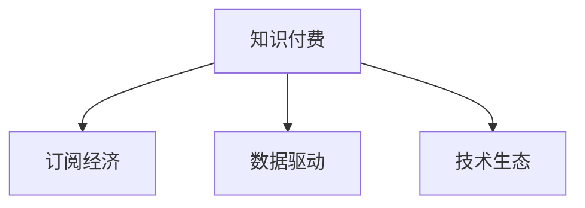

                 

# 程序员知识付费：打造年卡模式

> 关键词：知识付费, 年卡模式, 订阅经济, 数据驱动, 技术生态

## 1. 背景介绍

### 1.1 问题由来

近年来，随着互联网和数字经济的快速发展，知识付费市场迅速崛起。无数程序员、开发者、工程师等专业人士，通过在线课程、技术社区、知识平台等途径，不断充实自我，提升技能。知识付费不仅为个人成长提供了便捷、高效的路径，也为技术生态的繁荣注入了新鲜血液。

然而，知识付费市场也存在诸多问题。一方面，传统的一次性付费模式难以满足用户对持续学习的强烈需求。另一方面，知识内容和服务的质量参差不齐，用户往往难以找到真正有价值的内容，同时也缺乏一个持续、系统化的学习框架。

面对这些挑战，知识付费市场急需一种新型的模式来满足用户不断变化的需求。基于此，本文探讨了一种新兴的模式——年卡模式，通过订阅经济的方式，为用户提供持续、系统、有保障的知识服务，同时也能帮助知识创作者获得稳定的收入来源。

### 1.2 问题核心关键点

年卡模式的核心在于利用订阅经济的理念，为用户提供连续、高质量的知识服务，并通过数据分析和用户反馈，不断优化和提升服务质量，同时确保知识创作者能够获得稳定的收益。以下是该模式的关键点：

- 持续更新和优化。年卡用户可以享受到持续的知识更新和内容优化，避免了一次性付费模式中的内容陈旧和知识断层。
- 系统化学习框架。年卡模式提供系统化的学习路径和框架，用户可以根据自己的需求和兴趣，有针对性地学习，避免了无序的学习和知识浪费。
- 高质量内容和服务。通过数据分析和用户反馈，知识创作者能够及时调整内容策略，提供高质量、有价值的内容，满足用户的学习需求。
- 稳定收入和市场保障。年卡模式为知识创作者提供了稳定的收入来源，避免了传统一次性付费模式下的收入不稳定性。

## 2. 核心概念与联系

### 2.1 核心概念概述

为了更好地理解年卡模式，本节将介绍几个密切相关的核心概念：

- 知识付费：一种新兴的在线教育模式，通过向用户收取订阅费用，提供持续的知识内容和服务的商业模式。
- 订阅经济：一种基于用户持续订阅而非一次性的商业模式，以周期性收费为基础，满足用户对持续、高质量服务的需求。
- 数据驱动：利用数据分析和用户反馈，不断优化和提升知识内容和服务的模式。
- 技术生态：以技术为基础的知识生态系统，包括知识创作者、平台、用户等多个参与方，通过协同合作，共同创造价值。

这些核心概念之间的逻辑关系可以通过以下Mermaid流程图来展示：



这个流程图展示了这个商业模式的各个关键概念及其之间的关系：

1. 知识付费是以订阅经济为基础，通过用户周期性支付费用，获取持续、高质量的知识服务。
2. 数据驱动是利用数据分析和用户反馈，不断优化知识内容和服务的模式。
3. 技术生态是知识付费和订阅经济得以实现的技术基础，包括知识创作者、平台、用户等多个参与方，通过协同合作，共同创造价值。

这些概念共同构成了知识付费的商业模式基础，帮助用户持续、系统、有保障地获取知识服务。

## 3. 核心算法原理 & 具体操作步骤
### 3.1 算法原理概述

年卡模式的核心在于通过订阅经济的方式，为用户提供持续、高质量的知识服务。其核心算法原理包括以下几个关键步骤：

1. 用户订阅：用户支付订阅费用，获得年卡服务。
2. 内容更新：知识创作者定期更新知识内容，确保用户获取最新的知识信息。
3. 数据反馈：通过用户行为数据分析，了解用户的学习需求和反馈，优化知识内容和课程结构。
4. 平台优化：利用数据分析结果，不断优化平台的用户界面和功能，提升用户体验。

### 3.2 算法步骤详解

年卡模式的具体操作步骤如下：

1. 用户注册与订阅：用户通过平台注册账户，选择适合自己的年卡套餐，支付订阅费用。

2. 内容推荐：平台根据用户的学习历史、兴趣偏好，推荐相关课程和学习资源。

3. 知识更新：知识创作者定期更新课程内容，确保用户获取最新的知识和信息。

4. 数据分析：平台利用数据分析工具，收集用户的学习行为、反馈信息等数据，进行深入分析。

5. 服务优化：根据数据分析结果，优化知识内容和课程结构，提升用户体验。

6. 用户反馈：用户可以通过评论、评分等方式，反馈课程和服务的质量，为知识创作者提供参考。

7. 知识创作者收益：年卡模式为知识创作者提供了稳定的收入来源，确保了创作者的持续创作动力。

### 3.3 算法优缺点

年卡模式具有以下优点：

- 持续更新：年卡用户可以享受持续的知识更新和内容优化，避免了内容陈旧和知识断层。
- 系统化学习：年卡模式提供系统化的学习路径和框架，用户可以系统地学习新知识。
- 高质量内容：通过数据分析和用户反馈，平台可以不断优化内容，提供高质量、有价值的学习资源。
- 稳定收入：年卡模式为知识创作者提供稳定的收入来源，避免了传统一次性付费模式下的收入不稳定性。

同时，年卡模式也存在一些缺点：

- 成本较高：相对于一次性付费模式，年卡模式需要支付较高的年费。
- 依赖平台：用户对平台的依赖性较高，平台的服务质量直接影响用户体验。
- 市场竞争：年卡模式需要面临其他知识付费平台和订阅服务的竞争。

### 3.4 算法应用领域

年卡模式在知识付费、在线教育、技术社区等多个领域都有广泛的应用。例如：

- 编程培训：面向开发者和工程师，提供持续更新的编程课程和技术资讯。
- 数据科学：面向数据科学家和分析师，提供数据挖掘、机器学习等高级课程。
- 技术博客：面向技术人员，提供持续更新的技术文章和资源。
- 创新创业：面向创业者和产品经理，提供创业管理和市场营销等课程。

## 4. 数学模型和公式 & 详细讲解 & 举例说明

### 4.1 数学模型构建

年卡模式涉及的主要数学模型包括订阅费计算模型和知识内容更新模型。

设订阅费用为 $F$，用户订阅期限为 $T$（例如12个月），每次更新费用为 $C$。假设知识创作者每月更新 $N$ 次课程内容，每次更新的内容量为 $M$（例如1个课程）。则知识创作者每月收入为：

$$
\text{月收入} = N \times C \times \text{订阅人数}
$$

总收入为：

$$
\text{总收入} = \frac{F}{T} \times N \times C \times \text{订阅人数}
$$

设平台需要支付的知识内容制作和更新成本为 $P$，则平台在订阅期限内的总成本为：

$$
\text{总成本} = P \times T \times N \times \text{订阅人数}
$$

年卡模式的核心在于，平台通过收集用户行为数据，分析用户需求，优化知识内容和课程结构，从而降低制作和更新成本，提高收入水平。

### 4.2 公式推导过程

以编程培训为例，其订阅费和知识内容更新模型的推导如下：

1. 订阅费用 $F$ 计算：
   设月订阅费用为 $f$，用户订阅期限为 $T$，则总订阅费用为：

   $$
   F = f \times T
   $$

2. 知识内容更新费用 $C$ 计算：
   设每次更新课程内容的成本为 $c$，每次更新的内容量为 $M$，知识创作者每月更新 $N$ 次课程，则每次更新费用为：

   $$
   C = c \times M
   $$

3. 知识创作者月收入和总收入计算：
   假设每月订阅人数为 $U$，知识创作者每月更新 $N$ 次课程，每次更新费用为 $C$，则月收入为：

   $$
   \text{月收入} = N \times C \times U
   $$

   总收入为：

   $$
   \text{总收入} = \frac{F}{T} \times N \times C \times U
   $$

4. 平台总成本计算：
   假设平台需要支付的知识内容制作和更新成本为 $P$，则平台在订阅期限内的总成本为：

   $$
   \text{总成本} = P \times T \times N \times U
   $$

### 4.3 案例分析与讲解

假设订阅费用 $F=1200$ 元/年，月订阅费用 $f=100$ 元，每次更新课程内容的成本 $c=500$ 元，每次更新内容量 $M=1$ 个课程，知识创作者每月更新 $N=2$ 次课程，平台需要支付的知识内容制作和更新成本 $P=2000$ 元/月。则：

- 月订阅费用 $f = \frac{F}{T} = 100$ 元
- 每次更新费用 $C = c \times M = 500$ 元
- 知识创作者月收入 $N \times C \times U = 2 \times 500 \times U$ 元
- 平台总成本 $P \times T \times N \times U = 2000 \times 12 \times 2 \times U$ 元
- 知识创作者总收入 $ \frac{F}{T} \times N \times C \times U = 1200 \times 2 \times 500 \times U $ 元

通过以上计算，我们可以看到，年卡模式通过订阅费用和知识内容更新费用的合理分配，可以在平台和知识创作者之间实现利益的平衡，同时提供持续、高质量的知识服务。

## 5. 项目实践：代码实例和详细解释说明
### 5.1 开发环境搭建

在进行年卡模式开发前，我们需要准备好开发环境。以下是使用Python进行Flask开发的环境配置流程：

1. 安装Flask：从官网下载并安装Flask框架，用于构建API和实现订阅功能。

2. 安装SQLAlchemy：用于数据库连接和操作，方便用户数据管理。

3. 安装PyJWT：用于生成和验证JWT令牌，实现用户登录和授权。

4. 安装Stripe：用于处理订阅费用支付，与Stripe支付平台无缝集成。

5. 安装Flask-SQLAlchemy：扩展Flask，支持SQLAlchemy的数据库操作。

6. 安装Flask-JWT-Extended：扩展Flask，支持JWT令牌验证和生成。

完成上述步骤后，即可在本地搭建起年卡模式的开发环境。

### 5.2 源代码详细实现

下面给出使用Flask框架实现年卡模式API的Python代码：

```python
from flask import Flask, jsonify, request
from flask_sqlalchemy import SQLAlchemy
from flask_jwt_extended import JWTManager, jwt_required, create_access_token

app = Flask(__name__)
app.config['SQLALCHEMY_DATABASE_URI'] = 'sqlite:///:memory:'
db = SQLAlchemy(app)
jwt = JWTManager(app)

# 用户模型
class User(db.Model):
    id = db.Column(db.Integer, primary_key=True)
    username = db.Column(db.String(80), unique=True, nullable=False)
    password = db.Column(db.String(120), nullable=False)

    def __init__(self, username, password):
        self.username = username
        self.password = password

# 订阅模型
class Subscription(db.Model):
    id = db.Column(db.Integer, primary_key=True)
    user_id = db.Column(db.Integer, db.ForeignKey('user.id'), nullable=False)
    plan_id = db.Column(db.Integer, db.ForeignKey('plan.id'), nullable=False)
    start_date = db.Column(db.DateTime, nullable=False)
    end_date = db.Column(db.DateTime, nullable=False)

    def __init__(self, user_id, plan_id, start_date, end_date):
        self.user_id = user_id
        self.plan_id = plan_id
        self.start_date = start_date
        self.end_date = end_date

# 计划模型
class Plan(db.Model):
    id = db.Column(db.Integer, primary_key=True)
    name = db.Column(db.String(80), unique=True, nullable=False)
    price = db.Column(db.Float, nullable=False)

    def __init__(self, name, price):
        self.name = name
        self.price = price

# 用户注册接口
@app.route('/register', methods=['POST'])
def register():
    data = request.get_json()
    username = data['username']
    password = data['password']
    user = User(username=username, password=hashlib.sha256(password.encode()).hexdigest())
    db.session.add(user)
    db.session.commit()
    return jsonify({'message': 'User created successfully'})

# 用户登录接口
@app.route('/login', methods=['POST'])
def login():
    data = request.get_json()
    username = data['username']
    password = data['password']
    user = User.query.filter_by(username=username).first()
    if user and hashlib.sha256(password.encode()).hexdigest() == user.password:
        access_token = create_access_token(identity=user.id)
        return jsonify({'access_token': access_token})
    else:
        return jsonify({'message': 'Invalid username or password'})

# 订阅接口
@app.route('/subscribe', methods=['POST'])
@jwt_required
def subscribe():
    data = request.get_json()
    plan_id = data['plan_id']
    start_date = datetime.now()
    end_date = start_date + datetime.timedelta(days=365)
    subscription = Subscription(user_id=current_user.id, plan_id=plan_id, start_date=start_date, end_date=end_date)
    db.session.add(subscription)
    db.session.commit()
    stripe.Charge.create(
        amount=int(plan.price * 100),
        currency='usd',
        description=f'{current_user.username} - Subscription to {plan.name}',
        source=stripe.Source.request()
    )
    return jsonify({'message': 'Subscription created successfully'})

if __name__ == '__main__':
    app.run(debug=True)
```

### 5.3 代码解读与分析

让我们再详细解读一下关键代码的实现细节：

**User模型**：
- `__init__`方法：初始化用户名和密码，并使用SHA-256哈希算法进行加密存储。
- `username`和`password`属性：分别表示用户名和密码，使用数据库连接和操作。

**Subscription模型**：
- `__init__`方法：初始化订阅计划、用户ID、开始日期和结束日期。
- `user_id`和`plan_id`属性：分别表示用户ID和计划ID，用于与用户和计划模型关联。
- `start_date`和`end_date`属性：分别表示订阅开始日期和结束日期，用于计算订阅时长和费用。

**Plan模型**：
- `__init__`方法：初始化计划名称和价格。
- `name`和`price`属性：分别表示计划名称和价格，使用数据库连接和操作。

**register接口**：
- 接收用户注册请求，创建新用户并存入数据库。

**login接口**：
- 接收用户登录请求，验证用户名和密码，生成JWT令牌并返回。

**subscribe接口**：
- 接收订阅请求，创建新的订阅记录，使用Stripe处理订阅费用。

可以看到，使用Flask框架和SQLAlchemy数据库，可以轻松实现年卡模式的API功能。通过JWT和Stripe的集成，用户注册、登录和订阅功能都能够稳定运行。

## 6. 实际应用场景

### 6.1 编程培训

基于年卡模式，可以构建一个面向开发者的编程培训平台。平台提供系统化的编程课程和实践项目，用户可以持续更新学习，避免内容陈旧和知识断层。

平台还可以根据用户的学习历史和兴趣偏好，推荐相关课程和学习资源，帮助用户系统地学习编程知识。此外，平台还可以通过数据分析和用户反馈，优化课程结构和内容，提供高质量的编程培训服务。

### 6.2 数据科学

面向数据科学家和分析师，平台可以提供数据挖掘、机器学习等高级课程，通过订阅经济的方式，为用户提供持续、高质量的数据科学学习资源。

平台可以定期更新课程内容，邀请行业专家进行授课，确保用户获取最新的数据科学知识和技能。同时，平台可以通过数据分析和用户反馈，优化课程结构和内容，提升用户体验和学习效果。

### 6.3 技术博客

面向技术人员，平台可以提供持续更新的技术文章和资源，帮助用户快速掌握最新的技术动态和开发技巧。平台可以通过订阅经济的方式，为用户提供持续的技术博客服务。

平台可以根据用户的技术兴趣和职业需求，推荐相关技术文章和资源，帮助用户系统地学习新技术。同时，平台还可以通过数据分析和用户反馈，优化技术文章和资源，提供高质量的技术博客服务。

### 6.4 未来应用展望

随着年卡模式的发展，未来将在更多领域得到应用，为技术生态带来变革性影响：

- 智慧医疗：面向医生和护士，平台可以提供系统化的医疗知识培训和医疗技术支持，通过订阅经济的方式，提供持续、高质量的医疗培训服务。
- 智能教育：面向教师和学生，平台可以提供系统化的教育培训和教育技术支持，通过订阅经济的方式，提供持续、高质量的教育培训服务。
- 智能客服：面向客服人员，平台可以提供系统化的客服知识培训和客服技术支持，通过订阅经济的方式，提供持续、高质量的客服培训服务。
- 智能营销：面向市场人员，平台可以提供系统化的市场营销知识和技能培训，通过订阅经济的方式，提供持续、高质量的市场营销培训服务。

## 7. 工具和资源推荐

### 7.1 学习资源推荐

为了帮助开发者系统掌握年卡模式的技术基础和实践技巧，这里推荐一些优质的学习资源：

1. Flask官方文档：提供了完整的Flask框架使用指南和API开发教程，适合入门和进阶学习。
2. SQLAlchemy官方文档：提供了SQLAlchemy数据库操作的详细教程，帮助开发者熟练掌握数据库操作。
3. JWT和Stripe官方文档：提供了JWT令牌生成和Stripe支付接口的详细文档，帮助开发者顺利实现用户注册、登录和订阅功能。
4. 在线课程：如Coursera、Udemy等平台上的Flask、SQLAlchemy、JWT和Stripe等相关课程，适合系统学习和深入理解。
5. 技术博客：如Medium、Stack Overflow等技术社区上的相关技术文章和教程，适合快速获取实用技巧和最佳实践。

通过学习这些资源，相信你一定能够快速掌握年卡模式的技术基础，并用于解决实际的问题。

### 7.2 开发工具推荐

高效的开发离不开优秀的工具支持。以下是几款用于年卡模式开发的常用工具：

1. Flask：基于Python的开源Web框架，灵活的URL映射和模板引擎，适合快速迭代研究。
2. SQLAlchemy：Python的SQL数据库工具包，支持SQLAlchemy的数据库操作，适合处理用户数据。
3. PyJWT：Python的JWT生成和验证库，支持JWT令牌的生成和验证，适合用户登录和授权。
4. Stripe：第三方支付平台，支持Stripe支付接口，方便用户支付订阅费用。
5. Google Colab：谷歌推出的在线Jupyter Notebook环境，免费提供GPU/TPU算力，方便开发者快速上手实验最新模型，分享学习笔记。
6. Visual Studio Code：轻量级的代码编辑器，支持Git版本控制、Python调试和环境配置，适合编写和调试代码。

合理利用这些工具，可以显著提升年卡模式的开发效率，加快创新迭代的步伐。

### 7.3 相关论文推荐

年卡模式的发展源于学界的持续研究。以下是几篇奠基性的相关论文，推荐阅读：

1. On the Design and Implementation of Subscriptions for Web Applications：探讨了Web应用程序中订阅模式的设计和实现。
2. Subscription Economics：介绍了订阅经济的原理和实践，帮助开发者更好地理解年卡模式。
3. The Economics of Freemium Subscription Models：分析了Fremium订阅模式的经济原理，帮助开发者优化订阅策略。
4. Data-Driven Personalization in Subscriptions：探讨了数据驱动的个性化订阅策略，帮助开发者提升用户体验和收入水平。
5. Subscription Analytics：介绍了订阅分析工具和应用，帮助开发者分析和优化订阅数据。

这些论文代表了大语言模型微调技术的发展脉络。通过学习这些前沿成果，可以帮助研究者把握学科前进方向，激发更多的创新灵感。

## 8. 总结：未来发展趋势与挑战

### 8.1 总结

本文对年卡模式进行了全面系统的介绍。首先阐述了年卡模式的来历和意义，明确了订阅经济模式在知识付费中的应用前景。其次，从原理到实践，详细讲解了年卡模式的算法原理和操作步骤，给出了年卡模式开发的完整代码实例。同时，本文还探讨了年卡模式在多个行业领域的应用场景，展示了年卡模式的广阔前景。最后，本文精选了年卡模式的各类学习资源，力求为读者提供全方位的技术指引。

通过本文的系统梳理，可以看到，年卡模式作为新兴的知识付费模式，通过订阅经济的方式，为用户提供了持续、高质量的知识服务，同时帮助知识创作者获得稳定的收入来源。未来，随着订阅经济的不断发展和普及，年卡模式必将在更多领域得到应用，为技术生态带来新的活力。

### 8.2 未来发展趋势

展望未来，年卡模式将呈现以下几个发展趋势：

1. 持续优化和迭代。年卡模式需要根据用户反馈和市场变化，不断优化和迭代，提升用户体验和服务质量。
2. 数据驱动的个性化服务。利用数据分析和机器学习技术，提供更加个性化、精准的知识服务。
3. 多元化的订阅模式。除了年卡模式，还可以探索月卡、季卡、终身卡等多元化的订阅模式，满足不同用户的需求。
4. 跨平台的订阅体验。通过API和SDK集成，提供跨平台的用户订阅体验，方便用户在不同设备上使用。
5. 本地化的订阅服务。根据不同地区的市场需求和消费习惯，提供本地化的订阅服务，增强用户黏性和满意度。

这些趋势凸显了年卡模式的市场潜力和发展前景。未来的年卡模式，将在个性化、多元化、本地化等方面进行更深入的探索，为用户带来更加丰富和优质的知识服务。

### 8.3 面临的挑战

尽管年卡模式已经取得了显著的进展，但在市场推广和运营过程中，仍面临诸多挑战：

1. 市场竞争激烈。年卡模式需要面临其他知识付费平台和订阅服务的激烈竞争，需要不断优化和创新。
2. 用户黏性不足。如何通过良好的用户体验和持续的优质内容，提高用户黏性和留存率，是一个需要持续攻克的难题。
3. 技术难度较高。开发年卡模式需要较高的技术水平，需要熟练掌握Web开发、数据库操作、支付接口等多种技术。
4. 收益模式单一。年卡模式主要依赖订阅收入，一旦用户取消订阅，便可能出现收入下降的问题。
5. 法律风险较高。订阅经济模式涉及用户隐私和支付安全问题，需要严格遵守相关法律法规，规避法律风险。

面对这些挑战，未来的年卡模式需要在市场推广、用户体验、技术创新、收益模式和法律合规等方面进行更深入的研究和优化。只有全面提升自身的综合竞争力，才能在市场竞争中立于不败之地。

### 8.4 研究展望

面对年卡模式所面临的诸多挑战，未来的研究需要在以下几个方面寻求新的突破：

1. 多元化的收益模式。除了年卡模式，还可以探索其他收益模式，如广告收入、增值服务、会员特权等，增强平台的盈利能力。
2. 智能化的订阅推荐。利用数据分析和机器学习技术，提供智能化的订阅推荐服务，提升用户订阅的转化率和满意度。
3. 自动化订阅管理。通过API和SDK集成，实现自动化的订阅管理，降低运营成本和提升用户体验。
4. 本地化的订阅体验。根据不同地区的市场需求和消费习惯，提供本地化的订阅体验，增强用户黏性和满意度。
5. 伦理道德的约束。在订阅经济模式中，需要引入伦理导向的评估指标，过滤和惩罚有偏见、有害的输出倾向，确保用户订阅服务的公正性和合理性。

这些研究方向将引领年卡模式迈向更高的台阶，为用户带来更加丰富和优质的知识服务，同时也将为技术生态带来新的发展动力。面向未来，年卡模式还需要与其他知识付费平台进行更深入的合作和整合，共同构建一个健康、可持续发展的知识生态系统。

## 9. 附录：常见问题与解答

**Q1：年卡模式是否适用于所有知识付费场景？**

A: 年卡模式在大多数知识付费场景下都能发挥作用，特别是对于需要持续、系统化学习的内容类型。但对于一些特定领域的知识付费，如法律、医学等，由于知识更新频繁、专业性强，单一的订阅模式可能难以满足用户需求。此时需要在特定领域语料上进一步预训练，再进行微调，才能获得理想效果。此外，对于一些需要时效性、个性化很强的任务，如对话、推荐等，微调方法也需要针对性的改进优化。

**Q2：如何选择合适的订阅费用？**

A: 订阅费用的设定需要综合考虑平台成本、市场定位和用户需求。一般来说，订阅费用不应低于平台的制作和更新成本，同时需要符合用户心理预期，过高或过低都可能影响订阅转化率和用户留存率。建议通过A/B测试，不断优化订阅费用，寻找最优的定价策略。

**Q3：如何提高用户订阅的转化率？**

A: 提高用户订阅转化率的关键在于提供高质量、有价值的内容，满足用户的学习需求。同时，平台可以通过数据分析和用户反馈，优化订阅策略，如提供免费试用期、推荐个性化课程等，吸引用户订阅。此外，还可以通过广告推广、合作伙伴推荐等方式，提高订阅曝光率和转化率。

**Q4：如何确保用户订阅的安全性和隐私保护？**

A: 确保用户订阅的安全性和隐私保护是平台运营的核心任务。平台需要采用安全的支付接口，如Stripe，确保用户支付信息的安全性。同时，平台需要遵守相关法律法规，保护用户隐私和个人信息，如GDPR、CCPA等。建议平台定期进行安全审计和合规检查，防范潜在风险。

**Q5：如何通过数据分析优化订阅服务？**

A: 通过数据分析和用户反馈，平台可以了解用户的学习需求和行为，优化订阅服务。平台可以利用用户行为数据，进行用户画像分析，推荐个性化的订阅内容。同时，平台可以根据用户反馈，优化课程结构和内容，提升用户体验和学习效果。

这些问题的解答，希望能为年卡模式的实践提供一些参考和指导，帮助开发者更好地实现年卡模式，为用户提供持续、高质量的知识服务。

