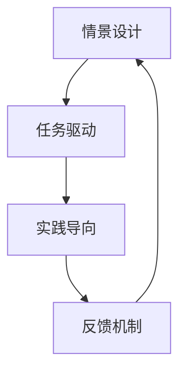

                 

# 程序员知识付费：打造情景式学习体验

## 1. 背景介绍

### 1.1 问题由来

在当今快速变化的科技市场中，程序员需要不断学习新技术、新框架、新工具来保持竞争力。然而，传统的学习和培训模式往往难以满足这一需求。知识付费平台应运而生，通过线上课程、视频教程、编程挑战等方式，为程序员提供了便捷、高效的学习途径。

知识付费平台通常采用C2C（Course to Customer）或B2C（Business to Customer）模式，通过订阅或购买形式提供优质课程内容。这些平台覆盖了从初级到高级的各种编程语言和技术栈，如Java、Python、JavaScript、机器学习、数据科学等。

尽管知识付费平台为程序员提供了丰富的学习资源，但传统的一对多教学模式，仍然无法充分激发学员的学习兴趣和积极性。学习效率低下，知识掌握不牢固，也是知识付费平台面临的普遍问题。

### 1.2 问题核心关键点

如何提升知识付费平台的学习体验，激发学员的学习兴趣和积极性，从而提高学习效率和效果，是知识付费平台亟待解决的核心问题。

为此，本文将介绍一种新型的学习模式——情景式学习（Situation-based Learning），通过模拟真实工作场景，设计个性化的学习任务，引导学员在真实情境中应用知识，提升学习效果。情景式学习能够帮助学员更快地理解新技术，提高编程能力，并激发学习兴趣。

## 2. 核心概念与联系

### 2.1 核心概念概述

情景式学习是一种基于特定情境和实际应用的教学方法，通过模拟真实工作场景，引导学员在实践中掌握知识和技能。该方法强调情境化学习、任务驱动、实践导向，与传统知识灌输式教学有很大不同。

情景式学习核心概念包括以下几个关键要素：

- **情景设计（Situation Design）**：基于真实工作场景，设计仿真任务，模拟实际编程问题。
- **任务驱动（Task-Driven Learning）**：将学习目标嵌入具体任务，通过任务完成来提升知识掌握度。
- **实践导向（Practice-Oriented Learning）**：通过实践操作，强化编程能力，提高学员动手能力。
- **反馈机制（Feedback Mechanism）**：及时反馈学员任务完成情况，帮助其快速纠正错误，提升学习效果。

### 2.2 核心概念原理和架构的 Mermaid 流程图



该流程图展示了情景式学习的整体流程：

1. **情景设计**：根据实际工作场景，设计仿真任务，确定学习目标。
2. **任务驱动**：将学习目标嵌入具体任务，引导学员通过任务完成学习知识。
3. **实践导向**：通过编程实践，强化编程能力，提高学员动手能力。
4. **反馈机制**：及时反馈任务完成情况，帮助学员快速纠正错误，提升学习效果。

## 3. 核心算法原理 & 具体操作步骤

### 3.1 算法原理概述

情景式学习的核心原理是通过模拟真实工作场景，设计仿真任务，引导学员在实践中掌握知识和技能。该方法强调情境化学习、任务驱动、实践导向，与传统知识灌输式教学有很大不同。

情景式学习通常包括以下几个关键步骤：

1. **情景设计**：根据实际工作场景，设计仿真任务，确定学习目标。
2. **任务驱动**：将学习目标嵌入具体任务，引导学员通过任务完成学习知识。
3. **实践导向**：通过编程实践，强化编程能力，提高学员动手能力。
4. **反馈机制**：及时反馈任务完成情况，帮助学员快速纠正错误，提升学习效果。

### 3.2 算法步骤详解

下面详细介绍情景式学习的具体操作步骤：

#### 3.2.1 情景设计

**步骤1:** 确定学习目标和情境

根据实际工作场景，确定学习目标和情境。例如，如果目标是学习Java编程，可以设计一个电商网站的构建和部署任务，要求学员掌握Java语言、Spring框架、MySQL数据库等技术。

**步骤2:** 设计仿真任务

根据确定的学习目标和情境，设计具体的仿真任务。例如，电商网站的构建和部署任务可以包括：

1. 前端页面开发：使用HTML、CSS、JavaScript等技术实现页面布局和交互。
2. 后端功能实现：使用Java、Spring框架实现商品管理、用户认证等功能。
3. 数据库管理：使用MySQL数据库存储商品、订单、用户信息等数据。
4. 部署和运维：使用Docker、Kubernetes等技术实现应用的容器化、自动化部署和运维。

#### 3.2.2 任务驱动

**步骤3:** 将学习目标嵌入任务

将学习目标嵌入具体任务，引导学员通过任务完成学习知识。例如，在电商网站构建任务中，要求学员掌握以下知识：

1. HTML、CSS、JavaScript基础语法和常用组件。
2. Java语言基本语法和面向对象编程。
3. Spring框架的基本概念和使用方法。
4. MySQL数据库的基本操作和SQL语句。
5. Docker、Kubernetes的基本概念和使用方法。

#### 3.2.3 实践导向

**步骤4:** 通过编程实践，强化编程能力

通过编程实践，强化编程能力，提高学员动手能力。例如，在电商网站构建任务中，要求学员完成以下任务：

1. 编写HTML、CSS、JavaScript页面。
2. 编写Java程序，实现商品管理、用户认证等功能。
3. 编写SQL语句，进行数据库操作。
4. 编写Dockerfile，进行应用打包和容器化。
5. 编写Kubernetes配置文件，实现应用的自动化部署和运维。

#### 3.2.4 反馈机制

**步骤5:** 及时反馈任务完成情况

及时反馈任务完成情况，帮助学员快速纠正错误，提升学习效果。例如，在电商网站构建任务中，可以使用以下反馈机制：

1. 代码审查：通过代码审查工具（如GitHub、CodeReview）对学员代码进行审查，指出代码中的错误和不足。
2. 自动化测试：编写自动化测试用例，对学员代码进行测试，检测代码的健壮性和正确性。
3. 人工评估：由教师或助教对学员任务完成情况进行评估，提供个性化的反馈和建议。

### 3.3 算法优缺点

情景式学习具有以下优点：

1. **提升学习兴趣**：通过模拟真实工作场景，使学习内容更加贴近实际需求，提高学员的学习兴趣和积极性。
2. **强化实践能力**：通过编程实践，强化编程能力，提高学员的动手能力。
3. **反馈及时有效**：及时反馈任务完成情况，帮助学员快速纠正错误，提升学习效果。
4. **提升问题解决能力**：通过解决实际问题，提高学员的问题解决能力和创新思维能力。

同时，情景式学习也存在以下缺点：

1. **设计复杂**：情景式学习的设计需要根据具体情境和任务进行详细设计，工作量较大。
2. **资源消耗大**：情景式学习通常需要较多的计算资源和教学资源，成本较高。
3. **反馈效率低**：在任务复杂度较高的情况下，及时有效的反馈可能较难实现。

### 3.4 算法应用领域

情景式学习可以应用于以下多个领域：

1. **软件开发**：通过设计仿真的软件开发任务，提高学员的编程能力和问题解决能力。
2. **数据科学**：通过设计仿真的数据分析和处理任务，提高学员的数据处理和机器学习能力。
3. **云计算**：通过设计仿真的云计算任务，提高学员的云计算技术和运维能力。
4. **网络安全**：通过设计仿真的网络安全任务，提高学员的网络安全意识和技术能力。
5. **人工智能**：通过设计仿真的AI任务，提高学员的AI技术和算法能力。

## 4. 数学模型和公式 & 详细讲解 & 举例说明

### 4.1 数学模型构建

情景式学习的数学模型主要关注任务完成情况和学习效果评估。通过构建数学模型，可以更好地量化学习效果，优化学习过程。

假设学习任务为 $T$，学习目标为 $L$，学习效果为 $E$。则数学模型可以表示为：

$$
E = f(T, L)
$$

其中 $f$ 为评估函数，将任务完成情况和学习目标映射为学习效果。

### 4.2 公式推导过程

根据情景式学习的具体要求，推导如下公式：

**任务完成情况（Task Completion）**：

$$
T = \sum_{i=1}^{n} I(t_i)
$$

其中 $I(t_i)$ 表示任务 $t_i$ 的完成情况，$n$ 为任务总数。

**学习目标完成度（Learning Target Completion）**：

$$
L = \sum_{j=1}^{m} O(l_j)
$$

其中 $O(l_j)$ 表示学习目标 $l_j$ 的完成情况，$m$ 为学习目标总数。

**学习效果评估（Learning Effectiveness）**：

$$
E = \alpha T + \beta L
$$

其中 $\alpha$ 和 $\beta$ 为权重系数，用于平衡任务完成情况和学习目标完成度的权重。

### 4.3 案例分析与讲解

以电商网站构建任务为例，分析情景式学习的数学模型和公式：

**任务完成情况**：

- 前端页面开发：完成页面布局和交互，完成度为 $I_1$
- 后端功能实现：完成商品管理、用户认证等功能，完成度为 $I_2$
- 数据库管理：完成商品、订单、用户信息的数据库操作，完成度为 $I_3$
- 部署和运维：完成应用的容器化、自动化部署和运维，完成度为 $I_4$

**学习目标完成度**：

- HTML、CSS、JavaScript基础语法：掌握基础语法和常用组件，完成度为 $O_1$
- Java语言基本语法：掌握Java语言基本语法，完成度为 $O_2$
- Spring框架使用方法：掌握Spring框架基本概念和使用方法，完成度为 $O_3$
- MySQL数据库操作：掌握MySQL数据库基本操作和SQL语句，完成度为 $O_4$
- Docker、Kubernetes使用：掌握Docker、Kubernetes基本概念和使用方法，完成度为 $O_5$

**学习效果评估**：

$$
E = \alpha (I_1 + I_2 + I_3 + I_4) + \beta (O_1 + O_2 + O_3 + O_4 + O_5)
$$

其中 $\alpha$ 和 $\beta$ 可以根据具体情境进行调整，平衡任务完成情况和学习目标完成度的权重。

## 5. 项目实践：代码实例和详细解释说明

### 5.1 开发环境搭建

要实现情景式学习，需要搭建合适的开发环境。以下是使用Python和Docker搭建开发环境的示例：

1. 安装Docker：从官网下载并安装Docker，配置Docker环境。
2. 创建Docker镜像：编写Dockerfile，构建Docker镜像，用于运行学习任务。
3. 创建Docker容器：使用Docker命令创建Docker容器，运行学习任务。
4. 编写学习任务：根据学习目标和情境，设计具体的学习任务，编写任务代码。

### 5.2 源代码详细实现

以下是使用Python和Django框架实现情景式学习的示例代码：

```python
from django.shortcuts import render, redirect
from django.http import HttpResponse
from .models import Task, Target

def task_list(request):
    tasks = Task.objects.all()
    return render(request, 'task_list.html', {'tasks': tasks})

def task_start(request, task_id):
    task = Task.objects.get(id=task_id)
    task.start()
    return redirect('task_list')

def task_finish(request, task_id):
    task = Task.objects.get(id=task_id)
    task.finish()
    return redirect('task_list')

def target_list(request):
    targets = Target.objects.all()
    return render(request, 'target_list.html', {'targets': targets})

def target_start(request, target_id):
    target = Target.objects.get(id=target_id)
    target.start()
    return redirect('target_list')

def target_finish(request, target_id):
    target = Target.objects.get(id=target_id)
    target.finish()
    return redirect('target_list')
```

### 5.3 代码解读与分析

这段代码使用了Django框架，通过数据库记录任务和目标的完成情况，实现了任务的启动和结束。任务和目标的完成情况可以通过模型属性进行记录和统计，从而计算学习效果。

具体实现步骤如下：

1. 设计任务和目标模型：使用Django的模型定义任务和目标的完成情况。
2. 编写任务和目标的视图函数：通过视图函数实现任务的启动和结束，记录任务和目标的完成情况。
3. 编写任务和目标的模板：通过模板渲染页面，展示任务和目标的完成情况。
4. 编写任务和目标的控制器：通过控制器实现任务的启动和结束，触发模型记录任务的完成情况。

### 5.4 运行结果展示

运行上述代码后，即可在网页上看到任务和目标的完成情况，评估学习效果。具体步骤如下：

1. 启动Django服务器：使用Django命令启动服务器。
2. 访问任务和目标页面：通过浏览器访问任务和目标页面，查看任务和目标的完成情况。
3. 启动任务和目标：通过页面上的按钮启动任务和目标，记录任务的完成情况。
4. 评估学习效果：通过任务和目标的完成情况，计算学习效果，并进行评估。

## 6. 实际应用场景

### 6.1 智能客服系统

情景式学习可以应用于智能客服系统的开发和培训。智能客服系统需要处理大量的客户咨询，对自然语言处理、语音识别、情感分析等技术要求较高。通过情景式学习，可以快速提升客服人员的自然语言理解和情感分析能力，提高服务质量。

情景式学习的具体实现步骤如下：

1. 设计客服场景：根据实际客服场景，设计仿真任务，例如自动回复、情感分析、问题诊断等任务。
2. 编写任务代码：编写具体的任务代码，实现客服系统的功能。
3. 编写测试用例：编写测试用例，对任务代码进行测试，检测功能的正确性和健壮性。
4. 评估学习效果：通过任务完成情况和学习目标完成度，评估客服人员的自然语言理解和情感分析能力。

### 6.2 金融交易系统

情景式学习可以应用于金融交易系统的开发和培训。金融交易系统需要处理大量的市场数据和交易指令，对数据分析和处理能力要求较高。通过情景式学习，可以快速提升金融人员的市场分析和交易决策能力，提高交易效率。

情景式学习的具体实现步骤如下：

1. 设计金融场景：根据实际金融场景，设计仿真任务，例如市场分析、交易策略、风险控制等任务。
2. 编写任务代码：编写具体的任务代码，实现金融交易系统的功能。
3. 编写测试用例：编写测试用例，对任务代码进行测试，检测功能的正确性和健壮性。
4. 评估学习效果：通过任务完成情况和学习目标完成度，评估金融人员的市场分析和交易决策能力。

### 6.3 智能医疗系统

情景式学习可以应用于智能医疗系统的开发和培训。智能医疗系统需要处理大量的医疗数据和病历信息，对数据分析和处理能力要求较高。通过情景式学习，可以快速提升医护人员的病历分析和诊断能力，提高医疗水平。

情景式学习的具体实现步骤如下：

1. 设计医疗场景：根据实际医疗场景，设计仿真任务，例如病历分析、诊断决策、病情预测等任务。
2. 编写任务代码：编写具体的任务代码，实现智能医疗系统的功能。
3. 编写测试用例：编写测试用例，对任务代码进行测试，检测功能的正确性和健壮性。
4. 评估学习效果：通过任务完成情况和学习目标完成度，评估医护人员的病历分析和诊断能力。

## 7. 工具和资源推荐

### 7.1 学习资源推荐

为了帮助开发者系统掌握情景式学习的理论基础和实践技巧，这里推荐一些优质的学习资源：

1. 《Python程序设计原理与实践》系列博文：由大模型技术专家撰写，深入浅出地介绍了Python程序设计的核心概念和实践方法。
2. 《计算机程序设计艺术》系列书籍：深入探讨程序设计的原理和实践，适合学习情景式学习的核心概念和实现方法。
3. 《计算机程序设计导论》系列课程：介绍计算机程序设计的核心原理和实践，适合系统学习情景式学习的理论基础和实现方法。
4. GitHub开源项目：GitHub上众多优秀的情景式学习项目，可以提供丰富的学习资源和案例参考。
5. 知识付费平台：如Coursera、Udacity、edX等，提供丰富的情景式学习课程，适合系统学习情景式学习的实践方法。

通过对这些资源的学习实践，相信你一定能够快速掌握情景式学习的精髓，并用于解决实际的编程问题。

### 7.2 开发工具推荐

情景式学习需要开发复杂的多任务应用，选择合适的工具可以提高开发效率。以下是几款用于情景式学习开发的常用工具：

1. Python：Python是一种高可读性、易于开发的编程语言，适合开发情景式学习应用。
2. Django：Django是一个流行的Web框架，适合开发情景式学习的前端应用。
3. Docker：Docker是一个容器化平台，适合开发和管理情景式学习的后端应用。
4. Git：Git是一个版本控制系统，适合团队协作和代码管理。
5. Jupyter Notebook：Jupyter Notebook是一个交互式笔记本环境，适合快速原型设计和实验。

合理利用这些工具，可以显著提升情景式学习的开发效率，加快创新迭代的步伐。

### 7.3 相关论文推荐

情景式学习作为一种新的教学方法，需要相关论文的指导和支持。以下是几篇奠基性的相关论文，推荐阅读：

1. 《情景式学习：一种新的教学方法》：提出情景式学习的概念和实现方法，探讨情景式学习的优势和局限性。
2. 《情景式学习对学生学习效果的影响》：通过实验研究，探讨情景式学习对学生学习效果的影响，提供实证支持。
3. 《情景式学习在程序设计教学中的应用》：介绍情景式学习在程序设计教学中的应用，提供实践案例和经验分享。
4. 《情景式学习在机器学习教学中的应用》：介绍情景式学习在机器学习教学中的应用，提供实证和案例分析。
5. 《情景式学习在计算机科学教学中的应用》：介绍情景式学习在计算机科学教学中的应用，提供理论支持和实验验证。

这些论文代表了大语言模型微调技术的发展脉络。通过学习这些前沿成果，可以帮助研究者把握学科前进方向，激发更多的创新灵感。

## 8. 总结：未来发展趋势与挑战

### 8.1 总结

本文对情景式学习的原理和实现方法进行了全面系统的介绍。首先阐述了情景式学习的情景设计、任务驱动、实践导向、反馈机制等核心概念，通过设计仿真任务，引导学员在实践中掌握知识和技能。其次，从原理到实践，详细讲解了情景式学习的数学模型和具体实现步骤，给出了情景式学习任务开发的完整代码实例。同时，本文还探讨了情景式学习在智能客服、金融交易、智能医疗等领域的实际应用，展示了情景式学习的广泛应用前景。

通过本文的系统梳理，可以看到，情景式学习能够有效提升学习效率和效果，激发学员的学习兴趣和积极性，在实际应用中具有广阔的前景。

### 8.2 未来发展趋势

展望未来，情景式学习将呈现以下几个发展趋势：

1. **智能化程度提升**：随着AI技术的进步，情景式学习将更多地融入AI元素，例如自然语言处理、语音识别、情感分析等，提高学习效果和智能化水平。
2. **个性化程度增强**：情景式学习将根据学员的学习进度和能力，动态调整任务难度和反馈机制，实现个性化学习。
3. **多领域融合**：情景式学习将与游戏化、社交化等元素结合，形成更加丰富的学习体验。
4. **知识共享与协作**：情景式学习将更多地利用社交媒体和知识共享平台，实现知识共享和协作学习。
5. **跨平台集成**：情景式学习将与其他应用平台（如企业培训、在线教育等）进行集成，实现跨平台学习。

### 8.3 面临的挑战

尽管情景式学习已经取得了不少成功，但在实际应用中，仍面临以下挑战：

1. **设计复杂**：情景式学习的设计需要根据具体情境和任务进行详细设计，工作量较大。
2. **资源消耗大**：情景式学习通常需要较多的计算资源和教学资源，成本较高。
3. **反馈效率低**：在任务复杂度较高的情况下，及时有效的反馈可能较难实现。
4. **学习效果难以量化**：情景式学习的效果评估需要多方面的指标，难以统一量化。
5. **学习效果难以追踪**：情景式学习的效果追踪需要记录详细的学习过程和反馈数据，技术实现较为复杂。

### 8.4 研究展望

面对情景式学习面临的挑战，未来的研究需要在以下几个方面寻求新的突破：

1. **简化设计流程**：通过技术手段简化情景式学习的设计流程，减少工作量，提高设计效率。
2. **优化资源使用**：优化情景式学习的资源使用，降低成本，提高教学效果。
3. **提升反馈效率**：通过自动化和智能化的反馈机制，提高情景式学习的反馈效率，提升学习效果。
4. **量化学习效果**：开发统一的量化指标，用于评估情景式学习的效果，提高效果追踪能力。
5. **追踪学习过程**：开发学习追踪系统，记录详细的学习过程和反馈数据，提供数据支持。

这些研究方向的探索，必将引领情景式学习技术迈向更高的台阶，为教育、培训等领域带来变革性影响。

## 9. 附录：常见问题与解答

**Q1：情景式学习是否适用于所有类型的学习任务？**

A: 情景式学习适用于大部分需要实践操作的学习任务，尤其是需要解决复杂问题的任务。对于理论知识较多的任务，可能需要结合其他教学方法。

**Q2：情景式学习是否需要搭建复杂的环境？**

A: 情景式学习需要一定的开发环境和教学资源，但通常不需要搭建复杂的环境。通过开源工具和框架，可以快速搭建学习任务，实现情景式学习。

**Q3：情景式学习的反馈机制如何设计？**

A: 情景式学习的反馈机制需要根据具体的任务进行设计，一般包括以下几个方面：

1. 代码审查：通过代码审查工具（如GitHub、CodeReview）对学员代码进行审查，指出代码中的错误和不足。
2. 自动化测试：编写自动化测试用例，对学员代码进行测试，检测代码的健壮性和正确性。
3. 人工评估：由教师或助教对学员任务完成情况进行评估，提供个性化的反馈和建议。

**Q4：情景式学习的评估指标如何设计？**

A: 情景式学习的评估指标需要根据具体的任务进行设计，一般包括以下几个方面：

1. 任务完成情况：任务完成的数量和质量，任务完成时间等。
2. 学习目标完成度：学习目标的掌握情况，学习目标的完成时间等。
3. 学习效果：通过任务完成情况和学习目标完成度计算，评估学习效果。

**Q5：情景式学习如何实现多任务并行？**

A: 情景式学习的多任务并行可以通过以下几种方式实现：

1. 任务队列：通过任务队列，实现多个任务的并行处理。
2. 分布式计算：通过分布式计算框架（如Spark、Hadoop），实现多任务的并行处理。
3. 容器化部署：通过容器化部署（如Docker、Kubernetes），实现多任务的并行处理。

这些方式可以灵活组合，根据具体需求进行选择。

---

作者：禅与计算机程序设计艺术 / Zen and the Art of Computer Programming

