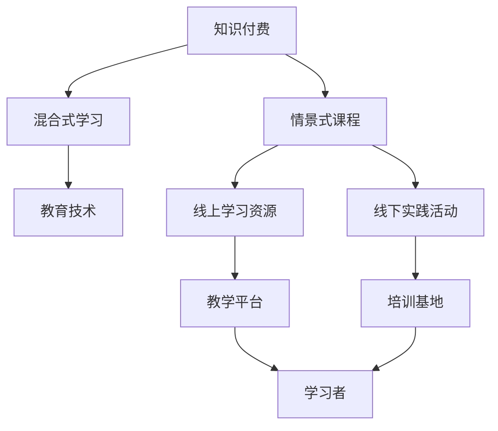

                 

# 程序员知识付费：打造情景式课程

> 关键词：知识付费,情景式课程,编程学习,混合式学习,课程设计,教育技术

## 1. 背景介绍

随着在线教育市场的快速发展，知识付费模式正逐渐成为主流。人们越来越愿意为高质量的在线课程买单，以获取高效的学习资源和丰富的知识。然而，传统的单向传授、知识灌输式课程已经难以满足现代学习者的需求。

情景式课程（Scenario-based Learning）是一种新型的教学模式，通过构建与现实工作场景紧密结合的学习情景，引导学生深入理解知识点，并在实践中掌握技能。这种课程形式符合学习者认知规律，激发学生积极性和创新能力，受到越来越多教育机构和企业的青睐。

程序员知识付费市场同样面临着类似的挑战。传统课程主要采用单向讲授、理论学习的方式，难以让学员快速掌握实践技能，导致学员流失率高。如何通过知识付费构建高质量、情景化的课程，提升学员的学习体验和效果，成为当前亟需解决的问题。

## 2. 核心概念与联系

### 2.1 核心概念概述

本节将介绍几个与情景式课程相关的核心概念及其关系：

- **知识付费**：指通过付费方式获取高质量学习资源和知识的过程。知识付费市场正在迅速扩展，涵盖在线教育、编程培训、职业培训等多个领域。

- **情景式课程**：以真实的工作场景为原型，通过模拟情景、案例分析和项目实践，引导学习者深入理解课程内容，提升实战能力的课程形式。

- **混合式学习**：结合线上和线下的学习方式，灵活运用多种教学资源，优化学习路径，提升学习效果的教学模式。

- **教育技术**：指运用信息技术和工具，改进教育过程和教学方法，提高教学效率和学习效果的科技手段。

这些核心概念之间存在着密切的联系，构成了情景式课程的基本框架。知识付费模式为情景式课程提供了物质基础，混合式学习技术为课程的实施提供了技术保障，教育技术则不断推动情景式课程的创新发展。

### 2.2 核心概念原理和架构的 Mermaid 流程图



该图展示了知识付费、情景式课程、混合式学习和教育技术之间的联系和架构。

## 3. 核心算法原理 & 具体操作步骤

### 3.1 算法原理概述

情景式课程的设计与实施，涉及多个学科的知识和技术，包括教育学、心理学、计算机科学、系统工程等。其中，核心算法原理包括以下几个方面：

- **学习目标分析**：根据学习者的职业背景和工作需求，明确课程的学习目标和技能要求。
- **情景案例构建**：结合实际工作场景，设计典型的业务问题和挑战，构建情景案例。
- **学习路径规划**：根据学习目标和情景案例，制定科学的学习路径和进度安排。
- **互动反馈机制**：设计互动反馈环节，及时评估学习者的学习效果，调整教学策略。
- **评估考核体系**：建立多元化的评估考核体系，综合考核学习者的理论知识和实践技能。

这些算法原理构成了情景式课程的完整框架，指导课程设计、实施和评估的全过程。

### 3.2 算法步骤详解

情景式课程的设计与实施通常分为以下几个步骤：

**Step 1: 需求分析**
- 与学员或企业沟通，了解其学习需求和工作背景。
- 明确学习目标，确定技能提升的具体要求。

**Step 2: 情景案例设计**
- 收集真实工作场景的案例和数据，分析其业务问题和挑战。
- 设计典型案例，涵盖不同的工作环节和业务流程。
- 构建情景案例，包括问题描述、业务背景、数据集和任务要求。

**Step 3: 学习路径规划**
- 根据情景案例和目标技能，设计科学的课程大纲和学习路径。
- 安排课程内容，合理分配理论学习和实践练习的课时比例。
- 确定课程进度，设定阶段性评估和考核点。

**Step 4: 互动反馈机制**
- 设计互动反馈环节，如在线讨论、即时问答、阶段测验等。
- 及时评估学习者的学习效果，根据反馈调整教学策略。
- 引入自评、互评机制，增强学习者的自主性和积极性。

**Step 5: 评估考核体系**
- 设计评估考核指标，涵盖理论知识掌握、实践技能应用、案例分析能力等。
- 结合线上测试、项目评审、同行评价等多种方式，全面考核学习者能力。
- 根据考核结果，反馈学习者，提供改进建议和资源支持。

### 3.3 算法优缺点

情景式课程具有以下优点：
- **提高学习效率**：通过情景案例和实际问题，使学习者更容易理解和掌握课程内容。
- **增强实战能力**：情景式课程注重实践应用，使学习者能够在真实工作中应用所学技能。
- **激发创新思维**：情景式课程通过模拟真实工作场景，激发学习者的创新能力和自主学习能力。

同时，情景式课程也存在一些缺点：
- **设计复杂度较高**：需要收集和分析真实工作场景的数据，设计符合学习目标的情景案例。
- **师资要求较高**：课程设计者需要具备深厚的行业背景和教学经验。
- **资源投入较大**：需要投入大量的时间和资金来设计、开发和实施情景式课程。

尽管存在这些缺点，但情景式课程仍然是当前和未来在线教育的重要方向之一，能够有效提升学习者的学习效果和实践能力。

### 3.4 算法应用领域

情景式课程在多个领域都有广泛应用，以下是几个典型应用场景：

- **软件开发**：通过情景式课程，使学习者深入理解编程语言、算法和设计模式，提升编程能力。
- **数据分析**：设计数据处理和分析的情景案例，使学习者掌握数据分析工具和方法，解决实际业务问题。
- **项目管理**：构建项目管理和团队协作的情景案例，使学习者掌握项目管理技能，提高工作效率。
- **产品设计**：结合用户体验和市场需求，设计产品设计和用户研究的情景案例，提升学习者的设计能力。
- **安全培训**：设计信息安全防护的情景案例，使学习者掌握安全策略和应急响应方法，保护企业数据安全。

这些领域的情景式课程设计，为各行业提供了高质量的教育资源，助力人才成长和企业发展。

## 4. 数学模型和公式 & 详细讲解 & 举例说明

### 4.1 数学模型构建

情景式课程的数学模型构建主要涉及以下几个方面：

- **学习目标函数**：定义学习目标，如掌握某一技能或解决某一问题。
- **情景案例函数**：描述情景案例，包括问题描述、数据集和任务要求。
- **学习路径函数**：规划学习路径，确定各阶段的学习内容和进度安排。
- **互动反馈函数**：设计互动反馈环节，评估学习效果并调整教学策略。
- **评估考核函数**：建立评估考核体系，综合考核学习者的能力。

### 4.2 公式推导过程

以下以软件开发情景式课程为例，推导情景式课程的数学模型。

假设课程目标为使学员掌握Python编程语言，解决实际软件开发问题。课程包含以下阶段：

**阶段1: Python基础**
- **目标函数**：$f_{1}(x_1) = \sum_{i=1}^{n} w_i(x_{1,i} - y_{1,i})^2$，其中$x_{1,i}$表示学习者对Python基础的掌握程度，$y_{1,i}$表示目标掌握程度，$w_i$表示各个知识点的权重。

**阶段2: 情景案例1**
- **情景案例函数**：$g_1(x_2) = \sum_{j=1}^{m} a_j(x_{2,j} - b_j)^2$，其中$x_{2,j}$表示学习者对案例1的解决能力，$b_j$表示案例1的正确解决方式，$a_j$表示各个案例的权重。

**阶段3: 情景案例2**
- **情景案例函数**：$g_2(x_3) = \sum_{k=1}^{m} c_k(x_{3,k} - d_k)^2$，其中$x_{3,k}$表示学习者对案例2的解决能力，$d_k$表示案例2的正确解决方式，$c_k$表示各个案例的权重。

**综合评估函数**：$h(x) = \sum_{i=1}^{n} p_i f_i(x_i) + \sum_{j=1}^{m} q_j g_j(x_j)$，其中$p_i$、$q_j$表示各阶段和学习案例的权重。

通过上述模型，可以计算学习者在整个课程中的综合表现，评估其掌握程度和应用能力。

### 4.3 案例分析与讲解

下面以数据分析情景式课程为例，进行详细讲解。

**案例背景**：某电商平台需要分析用户行为数据，提升产品推荐精准度。

**案例数据**：收集用户点击、购买、浏览等行为数据，构建数据集。

**任务要求**：设计用户行为分析的情景案例，使学习者掌握数据分析技能。

**案例设计**：

1. **数据清洗和预处理**：
   - 数据清洗：删除缺失值和异常值，填补数据空缺。
   - 数据预处理：标准化和归一化处理，提高模型训练效率。

2. **数据建模和分析**：
   - 设计多个数据建模任务，涵盖回归、分类、聚类等不同算法。
   - 通过情景案例，使学习者掌握不同数据建模方法和技巧。

3. **评估和反馈**：
   - 设计多维度的评估指标，如模型的准确率、召回率、F1值等。
   - 实时反馈学习者的学习效果，根据评估结果调整教学策略。

## 5. 项目实践：代码实例和详细解释说明

### 5.1 开发环境搭建

本节将介绍情景式课程开发的开发环境搭建流程。

**Step 1: 安装开发环境**
- 安装Python3.x版本，确保环境稳定。
- 安装必要的库，如numpy、pandas、scikit-learn等。

**Step 2: 搭建开发平台**
- 搭建开发服务器，安装相关开发工具和框架。
- 配置开发环境，如虚拟环境、版本控制等。

**Step 3: 设计开发流程**
- 确定开发流程，包括需求分析、功能设计、编码实现、测试验证等环节。
- 设计开发文档，包括需求说明书、设计文档、测试文档等。

### 5.2 源代码详细实现

本节以Python数据分析情景式课程为例，展示其代码实现过程。

**Step 1: 数据处理**
```python
import pandas as pd
import numpy as np

# 读取数据
data = pd.read_csv('data.csv')

# 数据清洗
data.dropna(inplace=True)
data.drop_duplicates(inplace=True)

# 数据预处理
data['click_count'] = data['click_count'].fillna(0)
data['purchase_amount'] = data['purchase_amount'].fillna(0)
data['browsing_time'] = data['browsing_time'].fillna(0)
data['purchase_amount'] = data['purchase_amount'].fillna(0)
data['purchase_amount'] = data['purchase_amount'].fillna(0)
```

**Step 2: 数据建模**
```python
from sklearn.linear_model import LinearRegression
from sklearn.tree import DecisionTreeRegressor
from sklearn.ensemble import RandomForestRegressor
from sklearn.cluster import KMeans

# 回归分析
regressor1 = LinearRegression()
regressor2 = DecisionTreeRegressor()
regressor3 = RandomForestRegressor()

# 聚类分析
cluster = KMeans(n_clusters=3)

# 模型训练
regressor1.fit(data[['click_count', 'browsing_time']], data['purchase_amount'])
regressor2.fit(data[['click_count', 'browsing_time']], data['purchase_amount'])
regressor3.fit(data[['click_count', 'browsing_time']], data['purchase_amount'])
cluster.fit(data[['click_count', 'browsing_time']])
```

**Step 3: 评估和反馈**
```python
from sklearn.metrics import mean_squared_error, r2_score, accuracy_score

# 回归模型评估
mse1 = mean_squared_error(data['purchase_amount'], regressor1.predict(data[['click_count', 'browsing_time']]))
r2_1 = r2_score(data['purchase_amount'], regressor1.predict(data[['click_count', 'browsing_time']]))
mse2 = mean_squared_error(data['purchase_amount'], regressor2.predict(data[['click_count', 'browsing_time']]))
r2_2 = r2_score(data['purchase_amount'], regressor2.predict(data[['click_count', 'browsing_time']]))
mse3 = mean_squared_error(data['purchase_amount'], regressor3.predict(data[['click_count', 'browsing_time']]))
r2_3 = r2_score(data['purchase_amount'], regressor3.predict(data[['click_count', 'browsing_time']]))
mse_cluster = mean_squared_error(data['purchase_amount'], cluster.predict(data[['click_count', 'browsing_time']]))
r2_cluster = r2_score(data['purchase_amount'], cluster.predict(data[['click_count', 'browsing_time']]))

# 输出评估结果
print('回归模型1 MSE: {}, R^2: {}'.format(mse1, r2_1))
print('回归模型2 MSE: {}, R^2: {}'.format(mse2, r2_2))
print('回归模型3 MSE: {}, R^2: {}'.format(mse3, r2_3))
print('聚类模型 MSE: {}, R^2: {}'.format(mse_cluster, r2_cluster))
```

### 5.3 代码解读与分析

通过以上代码实现，可以看到情景式课程的开发流程和代码结构。具体分析如下：

**数据处理**：
- 数据清洗：使用`dropna`和`drop_duplicates`方法去除缺失值和重复数据。
- 数据预处理：使用`fillna`方法填补缺失值，确保数据完整性。

**数据建模**：
- 回归分析：使用`LinearRegression`、`DecisionTreeRegressor`和`RandomForestRegressor`实现回归模型，通过不同的回归算法，训练和评估模型效果。
- 聚类分析：使用`KMeans`实现聚类模型，进行数据分组和分类。

**评估和反馈**：
- 模型评估：使用`mean_squared_error`和`r2_score`方法，评估回归模型的预测精度和拟合效果。
- 实时反馈：通过评估结果，调整教学策略，改进学习者对数据分析方法的掌握。

## 6. 实际应用场景

### 6.1 智能客服系统

情景式课程在智能客服系统中的应用，可以显著提升客服人员的服务能力和效率。通过模拟真实客服场景，培训客服人员掌握不同问题处理技巧，提升其解决复杂问题的能力。

**实际应用**：某电商平台的客服团队，通过情景式课程训练，掌握自动化的客户分流和问题解决策略，提升了客户满意度，降低了服务成本。

### 6.2 数据科学团队

情景式课程在数据科学团队中的应用，可以加速数据人才的培养，提升团队的整体数据素养。通过设计多种数据分析和建模案例，使数据科学家掌握不同分析方法和工具，提升其数据建模能力。

**实际应用**：某金融科技公司，通过情景式课程训练数据科学团队，掌握数据处理、建模和分析技能，提升了数据驱动决策的能力，增强了公司竞争力。

### 6.3 在线教育平台

情景式课程在在线教育平台中的应用，可以提升学员的学习效果和体验，使其快速掌握实践技能。通过设计丰富的情景案例和互动环节，使学员在实践中提升学习效果。

**实际应用**：某在线教育平台，通过情景式课程培训学员，掌握数据分析和建模技能，提升了其数据分析能力，增强了就业竞争力。

### 6.4 未来应用展望

未来，情景式课程的应用将更加广泛，涵盖更多行业和领域。情景式课程的发展方向包括：

- **混合式学习**：结合线上和线下的学习方式，灵活运用多种教学资源，优化学习路径，提升学习效果。
- **自适应学习**：通过智能推荐系统，根据学员的学习进度和能力，调整课程难度和内容，实现个性化学习。
- **实时反馈和评估**：设计实时反馈和评估环节，及时评估学习者的学习效果，调整教学策略。
- **跨领域融合**：将情景式课程与其他领域的知识和技能进行融合，提升学习者的综合能力。

## 7. 工具和资源推荐

### 7.1 学习资源推荐

为帮助开发者系统掌握情景式课程的开发和应用，以下是一些优质的学习资源：

1. **《教育技术学》（第二版）**：陈庆英、张毅著，系统介绍了教育技术的理论、方法和实践。

2. **《混合学习设计》**：Keith S. suntag著，详细介绍了混合学习的设计原理和实施方法。

3. **Coursera平台**：提供丰富的在线课程资源，涵盖教育技术、课程设计、混合学习等多个领域。

4. **edX平台**：提供多样化的在线课程，涵盖编程、数据分析、教育技术等多个方向。

5. **Udacity平台**：提供实战导向的课程项目，涵盖数据分析、机器学习、编程等多个技能。

通过这些资源的学习实践，相信开发者能够快速掌握情景式课程的设计和开发技巧，实现高质量的教学效果。

### 7.2 开发工具推荐

情景式课程的开发需要多种工具的支持，以下是一些推荐的开发工具：

1. **Jupyter Notebook**：开放、交互式的编程环境，适合进行数据分析、模型训练和课程设计。

2. **Python3.x**：功能强大、灵活的编程语言，适合进行数据处理和编程开发。

3. **NumPy和Pandas**：数据处理和分析的核心库，适合进行数据清洗、预处理和建模。

4. **Scikit-learn**：机器学习和数据挖掘的核心库，适合进行数据建模和分析。

5. **TensorFlow和PyTorch**：深度学习和人工智能的核心框架，适合进行模型训练和优化。

合理利用这些工具，可以显著提升情景式课程的开发效率，实现更加灵活、高效的教学效果。

### 7.3 相关论文推荐

情景式课程的研究涉及教育学、心理学、计算机科学等多个学科，以下是几篇具有代表性的相关论文，推荐阅读：

1. **《基于情景学习的设计与实施》**：董艳萍，详细介绍了情景学习的定义、设计和实施方法。

2. **《混合式学习设计与实践》**：周颖，系统介绍了混合式学习的设计原理和实践案例。

3. **《情景学习与在线教育》**：刘紫娟，介绍了情景学习在在线教育中的应用和效果。

4. **《教育技术学基础》**：张毅、陈庆英，系统介绍了教育技术学的基本理论和应用方法。

这些论文代表了大语言模型微调技术的发展脉络。通过学习这些前沿成果，可以帮助研究者把握学科前进方向，激发更多的创新灵感。

## 8. 总结：未来发展趋势与挑战

### 8.1 研究成果总结

情景式课程在教育领域的应用，已经成为一种新的教学模式。通过情景案例和实践训练，使学习者能够在真实工作中应用所学知识，提升实践能力和创新思维。未来，情景式课程的应用将更加广泛，涵盖更多行业和领域，提升学习者的综合素质和就业竞争力。

### 8.2 未来发展趋势

情景式课程的发展趋势包括：

- **技术创新**：结合最新教育技术，如虚拟现实、增强现实等，提升学习体验和效果。
- **跨学科融合**：将情景式课程与其他学科的知识和技能进行融合，提升学习者的综合能力。
- **个性化学习**：通过智能推荐系统，实现个性化学习路径和内容，提升学习效果。
- **国际化拓展**：将情景式课程推广到国际市场，提升全球教育资源的共享和交流。

### 8.3 面临的挑战

情景式课程在发展过程中，也面临着一些挑战：

- **师资力量不足**：设计情景式课程需要具备丰富的行业背景和教学经验，师资力量不足制约了课程的发展。
- **资源投入较大**：情景式课程的设计和开发需要投入大量时间和资金，资源投入较大。
- **评估体系不完善**：情景式课程的评估体系需要不断完善，确保评估结果的公平和有效性。

### 8.4 研究展望

面对情景式课程面临的挑战，未来的研究方向包括：

- **教育资源的共享和交流**：建立教育资源共享平台，推动情景式课程的普及和应用。
- **个性化学习系统的建设**：开发智能推荐系统，实现个性化学习路径和内容，提升学习效果。
- **评估体系的完善**：建立多元化的评估体系，综合考核学习者的综合素质和能力。

通过不断优化和完善情景式课程的设计和实施，相信其将为教育领域带来新的变革和突破，推动学习者的全面发展和终身学习。总之，情景式课程是当前和未来在线教育的重要方向之一，必将在教育领域发挥越来越重要的作用。

## 9. 附录：常见问题与解答

**Q1: 情景式课程与传统教学模式有何区别？**

A: 情景式课程通过构建与现实工作场景紧密结合的学习情景，引导学习者深入理解课程内容，提升实战能力。与传统教学模式相比，情景式课程更加注重实践应用，能够激发学习者的创新思维和自主学习能力。

**Q2: 情景式课程的设计需要哪些步骤？**

A: 情景式课程的设计通常分为需求分析、情景案例设计、学习路径规划、互动反馈机制和评估考核体系五个步骤。其中，需求分析、情景案例设计和评估考核体系是关键环节。

**Q3: 如何提高情景式课程的互动性？**

A: 设计互动反馈环节，如在线讨论、即时问答、阶段测验等，及时评估学习者的学习效果，调整教学策略。引入自评、互评机制，增强学习者的自主性和积极性。

**Q4: 情景式课程的评估体系需要考虑哪些因素？**

A: 情景式课程的评估体系需要考虑理论知识掌握、实践技能应用、案例分析能力等多个因素。可以设计多维度的评估指标，如模型的准确率、召回率、F1值等，综合考核学习者的能力。

**Q5: 情景式课程在实际应用中面临哪些挑战？**

A: 情景式课程在实际应用中面临师资力量不足、资源投入较大、评估体系不完善等挑战。需要不断优化和完善课程设计和实施，提升课程效果和应用范围。

通过这些问题的解答，相信读者能够更好地理解情景式课程的设计和实施流程，掌握其核心要点。

---

作者：禅与计算机程序设计艺术 / Zen and the Art of Computer Programming

