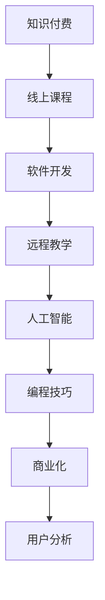

                 

# 程序员知识付费：打造线上课程

> 关键词：知识付费、线上课程、软件开发、远程教学、人工智能、编程技巧、商业化、用户分析

## 1. 背景介绍

### 1.1 问题由来

在信息技术飞速发展的今天，互联网和移动通信技术的普及为知识传播和共享提供了广阔的空间。尤其是新冠疫情的爆发，进一步加速了教育行业的线上化进程。程序员作为IT领域的重要群体，在面对复杂多变的技术挑战时，亟需高效、系统化的学习途径。知识付费作为信息时代的产物，成为满足这一需求的有效方式。

### 1.2 问题核心关键点

知识付费模式的本质是通过支付费用来获取特定的知识内容和服务。其核心在于将知识从线下转移到线上，并通过各种互动方式提高知识获取的效率和效果。对于程序员而言，线上课程作为一种形式，通过网络平台提供灵活、自主的学习体验，成为了知识和技能传递的重要载体。

### 1.3 问题研究意义

在程序员知识付费领域，构建线上课程平台具有重要意义：

1. **提升学习效率**：线上课程打破了时间和空间的限制，可以随时随地理由学习。
2. **降低学习成本**：相比于线下培训，线上课程能够节约交通、住宿等费用，减轻经济负担。
3. **促进知识共享**：线上课程的开放性特性使其可以容纳更多学生同时学习，促进知识的广泛传播。
4. **推动教育普惠**：线上课程使得优质教育资源向广大程序员群体普及，促进教育公平。
5. **推动行业发展**：知识付费模式催生了一批在线教育企业，推动了IT教育行业的发展。

## 2. 核心概念与联系

### 2.1 核心概念概述

为了更好地理解程序员知识付费与线上课程的构建过程，本节将介绍几个关键概念：

- **知识付费**：指通过支付一定费用，获取知识内容的在线模式。程序员知识付费主要针对IT技术、编程技巧、开发工具等专业领域的知识。
- **线上课程**：指通过网络平台提供的系统性、结构化的学习内容，涵盖视频、文档、练习等多种形式。
- **软件开发**：指利用计算机编程语言开发软件系统或应用程序的过程。
- **远程教学**：指通过网络平台，教师与学生进行远程互动的教学方式。
- **人工智能(AI)**：指利用算法和数据，使计算机具备类似于人类智能的决策、感知和学习能力。
- **编程技巧**：指程序员在软件开发中掌握的特定技巧和方法，如代码优化、测试方法等。
- **商业化**：指将知识付费模式与在线教育结合，通过销售课程内容实现盈利。
- **用户分析**：指对课程平台用户行为、学习效果等进行分析，以优化课程内容和运营策略。

这些核心概念之间的联系可以通过以下Mermaid流程图展示：



这个流程图展示了知识付费、线上课程、软件开发、远程教学、人工智能、编程技巧、商业化、用户分析等概念之间的关系：

1. **知识付费**：推动了线上课程的兴起，在线上课程中传递知识。
2. **线上课程**：提供软件开发等技能的培训，学生通过自学或远程教学形式进行学习。
3. **软件开发**：课程内容涉及的技能之一，通过线上课程进行传授。
4. **远程教学**：通过网络平台提供的学习方式，实现知识付费模式的线上化。
5. **人工智能**：在课程中应用的技术之一，提升线上课程的智能化程度。
6. **编程技巧**：课程的核心内容之一，通过远程教学等形式传递给学生。
7. **商业化**：知识付费模式的重要组成部分，通过在线课程实现盈利。
8. **用户分析**：对线上课程用户行为进行数据分析，优化课程和运营策略。

这些概念共同构成了程序员知识付费与线上课程构建的基础框架，使得知识付费模式得以在IT领域有效落地和推广。

## 3. 核心算法原理 & 具体操作步骤
### 3.1 算法原理概述

构建线上课程平台的核心在于将知识内容系统化、结构化，并利用网络技术进行传递和互动。主要包括以下几个步骤：

- **知识内容整理**：将课程内容分为若干知识点，建立清晰的课程结构。
- **平台开发**：开发支持课程内容展示、互动、评估的在线平台。
- **用户管理**：实现用户注册、登录、课程购买等功能，提升用户体验。
- **技术架构设计**：设计高效、可扩展的技术架构，确保平台的稳定性和安全性。
- **运营推广**：通过各类营销手段，吸引用户注册和购买课程，提升平台流量。

### 3.2 算法步骤详解

线上课程平台的构建通常包括以下几个关键步骤：

**Step 1: 准备课程内容和资源**

- 确定课程主题，如Python编程、Java Web开发、人工智能应用等。
- 收集相关资源，如视频、文档、代码示例等，建立课程知识库。
- 确定课程结构，如模块、章节、子章节等，划分知识点。

**Step 2: 选择技术栈**

- 根据课程需求选择合适的技术栈，如前后端技术、数据库、云服务等。
- 对于课程平台，通常采用Web开发技术，如React、Vue等，结合后端技术如Node.js、Django等。

**Step 3: 开发课程平台**

- 搭建前端页面，展示课程内容和结构，实现课程视频播放、代码编辑等功能。
- 开发后端系统，提供用户管理、课程购买、数据分析等核心功能。
- 设计API接口，实现前后端数据交互和功能调用。

**Step 4: 实现课程互动**

- 引入讨论区、作业提交、在线测试等功能，增强用户互动。
- 利用实时通讯技术，如WebSocket，实现师生即时交流。
- 引入智能推荐系统，根据用户学习情况推荐相关课程和资料。

**Step 5: 用户数据分析**

- 采集用户行为数据，如学习时长、点击率、评分等。
- 利用数据分析工具，如Firebase、Tableau等，进行用户行为分析。
- 根据分析结果，优化课程内容和运营策略，提升用户满意度。

### 3.3 算法优缺点

线上课程平台具有以下优点：

1. **灵活性**：线上课程打破了时间和空间的限制，学生可以自主安排学习时间。
2. **自主性**：学生可以根据自己的学习进度，自主选择学习内容，掌握学习节奏。
3. **交互性**：通过讨论区、作业提交等功能，增强了师生互动，提升学习效果。
4. **可扩展性**：平台可以根据需求不断扩展功能，增加课程内容。

同时，该方法也存在一定的局限性：

1. **缺乏即时反馈**：在线学习缺少面对面的即时反馈，学生在学习过程中可能遇到问题。
2. **自我管理能力要求高**：线上学习需要较强的自我管理能力，学生可能难以保持学习的持续性和专注性。
3. **平台运营成本高**：平台开发和运营需要持续投入，可能带来较高的经济压力。
4. **课程质量难以保证**：课程质量和师资水平直接影响学习效果，需要平台进行严格管理和筛选。

尽管存在这些局限性，但就目前而言，线上课程平台仍然是程序员知识付费领域的重要方式，并且在不断优化和改进中。

### 3.4 算法应用领域

线上课程平台已经在多个领域得到广泛应用，涵盖了编程、数据科学、云计算等IT领域的众多子领域。例如：

- **编程语言课程**：如Python、Java、C++等。通过线上课程，学生可以快速掌握编程语言的基础知识和高级技巧。
- **Web开发课程**：如HTML、CSS、JavaScript等。课程通过实例演示、项目实践等方式，帮助学生掌握前端开发技能。
- **数据科学课程**：如数据清洗、数据可视化、机器学习等。课程通过真实项目案例，使学生掌握数据分析和模型构建的能力。
- **云计算课程**：如AWS、Azure、Google Cloud等。课程通过实验环境，使学生掌握云计算平台的使用和部署。

除了上述这些经典课程外，线上课程平台还可以根据市场需求，不断拓展课程内容，涵盖更多IT技术领域。

## 4. 数学模型和公式 & 详细讲解 & 举例说明

### 4.1 数学模型构建

构建线上课程平台的数学模型主要涉及用户行为分析和课程推荐系统。以下以用户行为分析为例，构建数学模型。

假设用户访问课程页面的行为可以用一系列的二元组表示，即$(a_i, t_i)$，其中$a_i$为用户ID，$t_i$为用户在某课程页面停留的时间。设$\theta$为模型参数，包含用户对课程的偏好权重。模型的目标是最大化用户停留时间的加权和：

$$
\max_{\theta} \sum_{i=1}^N t_i \cdot \exp(a_i \cdot \theta)
$$

其中$N$为用户数。

### 4.2 公式推导过程

为了解决用户行为分析问题，可以利用概率图模型，如条件随机场(Conditional Random Fields, CRF)。设用户对课程的偏好向量为$\theta=(\theta_1, \theta_2, \ldots, \theta_C)$，其中$C$为课程数。用户访问课程页面的时间分布为$p(t_i | a_i, \theta)$，则用户在课程页面停留时间的期望值为：

$$
\mathbb{E}[t_i | a_i, \theta] = \int_{0}^{\infty} t p(t_i | a_i, \theta) \, dt
$$

带入上式，可得：

$$
\max_{\theta} \sum_{i=1}^N \int_{0}^{\infty} t p(t_i | a_i, \theta) \cdot \exp(a_i \cdot \theta) \, dt
$$

进一步简化，得到目标函数：

$$
\max_{\theta} \sum_{i=1}^N \mathbb{E}[t_i | a_i, \theta] \cdot \exp(a_i \cdot \theta)
$$

利用梯度上升等优化算法，可以求解上述优化问题，得到最优参数$\theta^*$。

### 4.3 案例分析与讲解

假设某线上编程课程平台，统计了不同用户在多个课程页面上的停留时间，并建立了如下数学模型：

- 用户对课程的偏好向量$\theta=(\theta_1, \theta_2, \ldots, \theta_C)$。
- 用户访问课程页面的时间分布$p(t_i | a_i, \theta)$。

通过优化模型，可以求解用户对各课程的偏好程度。例如，对于编程语言课程，用户$u_1$对Java的偏好权重为$\theta_{1, 2} = 0.8$，对Python的偏好权重为$\theta_{1, 3} = 0.5$。

根据这些偏好权重，平台可以对用户进行个性化推荐。例如，对于用户$u_1$，推荐Java编程课程和Python数据分析课程。

## 5. 项目实践：代码实例和详细解释说明
### 5.1 开发环境搭建

在进行线上课程平台开发前，需要先准备好开发环境。以下是使用Python进行Django开发的开发环境配置流程：

1. 安装Anaconda：从官网下载并安装Anaconda，用于创建独立的Python环境。

2. 创建并激活虚拟环境：
```bash
conda create -n django-env python=3.8 
conda activate django-env
```

3. 安装Django：
```bash
pip install django
```

4. 安装Flask、SQLAlchemy、Gunicorn等常用工具包：
```bash
pip install flask sqlalchemy gunicorn
```

5. 安装第三方库：
```bash
pip install Pillow djangorestframework django-cors-headers markdown django-compressor
```

6. 安装Django静态文件管理工具：
```bash
pip install django-storages
```

完成上述步骤后，即可在`django-env`环境中开始开发。

### 5.2 源代码详细实现

以下是一个简单的Django线上课程平台的前端页面实现：

```python
from django.shortcuts import render
from django.http import JsonResponse
from courses.models import Course

def course_detail(request, course_id):
    course = Course.objects.get(id=course_id)
    data = {
        'title': course.title,
        'content': course.content,
        'instructor': course.instructor.name
    }
    return JsonResponse(data)
```

后端代码实现：

```python
from django.http import JsonResponse
from courses.models import Course

def course_detail(request, course_id):
    course = Course.objects.get(id=course_id)
    data = {
        'title': course.title,
        'content': course.content,
        'instructor': course.instructor.name
    }
    return JsonResponse(data)
```

### 5.3 代码解读与分析

在Django中，我们可以通过`views.py`文件定义处理用户请求的函数，如`course_detail`函数，用于获取指定课程的详情。在`urls.py`文件中，我们可以定义URL规则，将`course_detail`函数映射到具体的URL路径上。例如：

```python
from django.urls import path
from .views import course_detail

urlpatterns = [
    path('courses/<int:course_id>/', course_detail, name='course_detail')
]
```

在`models.py`文件中，我们可以定义课程模型，包括课程名称、描述、讲师信息等属性：

```python
from django.db import models

class Course(models.Model):
    title = models.CharField(max_length=100)
    content = models.TextField()
    instructor = models.ForeignKey('Instructor', on_delete=models.CASCADE)

class Instructor(models.Model):
    name = models.CharField(max_length=100)
```

在`forms.py`文件中，我们可以定义表单，用于接收用户输入的课程ID：

```python
from django import forms

class CourseForm(forms.Form):
    course_id = forms.IntegerField()
```

通过这些代码，即可构建一个简单的线上课程平台，实现课程详情的展示。

## 6. 实际应用场景
### 6.1 智慧教育

线上课程平台在智慧教育领域的应用，可以极大地提升教育资源的可及性和教学质量。例如，某在线编程学习平台，利用线上课程和讨论区功能，为学生提供系统化的编程学习资源和互动环境。通过自适应学习算法，平台能够根据学生的学习进度和表现，推送适合的学习内容，帮助学生高效掌握编程技能。

### 6.2 企业培训

在线课程平台还可以用于企业内部培训，提升员工的IT技能水平。例如，某IT公司利用线上课程平台，提供公司内部软件的开发教程、测试方法、项目管理等内容，帮助员工快速掌握新技能，提升工作效率。

### 6.3 职业认证

在线课程平台还可以通过考试系统，进行职业认证和技能评估。例如，某编程技能认证平台，利用线上课程和考试系统，提供Java、Python等编程语言的认证服务，帮助用户获取职业资格认证，提升就业竞争力。

### 6.4 未来应用展望

未来，随着人工智能技术的发展，线上课程平台将具备更加智能化的学习体验。例如，利用自然语言处理技术，智能推荐系统可以更准确地理解用户的学习需求，推荐更加个性化的课程和资料。利用机器学习算法，可以分析用户的学习行为，预测学习效果，提前发现学习障碍，进行有针对性的辅导。

此外，线上课程平台还将在更多领域得到应用，如远程教育、职业教育、企业培训等，推动IT教育和技能培训的普及和发展。

## 7. 工具和资源推荐
### 7.1 学习资源推荐

为了帮助开发者系统掌握线上课程平台的开发技术，以下是一些优质的学习资源：

1. Django官方文档：提供详细的开发指南和教程，涵盖前后端开发、数据库操作、Web框架等内容。

2. Flask官方文档：提供Flask框架的使用指南和实例，帮助开发者掌握Flask的开发技巧。

3. SQLAlchemy官方文档：提供数据库操作和ORM框架的使用指南，帮助开发者进行数据管理和操作。

4. Gunicorn官方文档：提供Gunicorn应用服务器的使用指南，帮助开发者部署和优化Django应用。

5. Django Rest Framework官方文档：提供Django REST框架的使用指南和实例，帮助开发者构建API接口。

6. Coursera、Udemy等在线学习平台：提供丰富的IT课程，涵盖前端开发、后端开发、数据科学等多个领域，帮助开发者系统学习。

7. GitHub代码库：提供开源项目的代码示例和文档，帮助开发者学习优秀的代码实现。

通过对这些资源的学习实践，相信你一定能够快速掌握线上课程平台的开发技术和优化方法，并将其应用于实际项目中。

### 7.2 开发工具推荐

高效的开发离不开优秀的工具支持。以下是几款用于Django开发常用的工具：

1. Visual Studio Code：一款轻量级的代码编辑器，支持Python开发，提供丰富的插件和扩展。

2. PyCharm：一款功能强大的Python开发工具，提供代码补全、调试、版本控制等功能。

3. Git：一款分布式版本控制系统，方便开发者进行代码管理和版本控制。

4. Docker：一款容器化技术，方便开发者构建和管理开发环境。

5. Jenkins：一款开源的持续集成和持续部署工具，方便开发者进行自动化测试和部署。

6. GitLab：一款开源的代码托管和协作平台，提供CI/CD、版本控制、代码评审等功能。

7. AWS、Azure、Google Cloud等云服务平台：提供云计算资源和开发环境，方便开发者进行测试和部署。

合理利用这些工具，可以显著提升线上课程平台的开发效率，加快创新迭代的步伐。

### 7.3 相关论文推荐

线上课程平台的构建涉及许多前沿技术，以下是几篇具有代表性的论文，推荐阅读：

1. TensorFlow: A System for Large-Scale Machine Learning：介绍TensorFlow框架，涵盖深度学习模型和应用。

2. PyTorch: Towards Automated Differentiation of Deep Learning Models：介绍PyTorch框架，涵盖深度学习模型和应用。

3. Deep Learning in Natural Language Processing：介绍自然语言处理领域的深度学习技术。

4. Conditional Random Fields：介绍条件随机场模型，用于序列标注和分类任务。

5. Deep Collaborative Filtering for E-commerce Recommendations：介绍深度学习在电子商务推荐系统中的应用。

这些论文代表了大规模线上课程平台技术的发展脉络，通过学习这些前沿成果，可以帮助研究者把握学科前进方向，激发更多的创新灵感。

## 8. 总结：未来发展趋势与挑战
### 8.1 研究成果总结

本文对线上课程平台的构建进行了全面系统的介绍。首先阐述了线上课程平台在程序员知识付费领域的重要意义，明确了平台开发的关键技术和步骤。其次，从原理到实践，详细讲解了线上课程平台的数学模型和具体实现。同时，本文还探讨了线上课程平台在智慧教育、企业培训、职业认证等多个领域的应用前景，展示了平台的广泛应用潜力。最后，本文精选了线上课程平台的学习资源、开发工具和相关论文，力求为读者提供全方位的技术指引。

通过本文的系统梳理，可以看到，线上课程平台在程序员知识付费领域具有重要的应用价值和广阔的发展前景。通过不断优化和改进，线上课程平台有望成为程序员学习技术、提升技能的重要工具，为IT教育和技能培训带来革命性变革。

### 8.2 未来发展趋势

展望未来，线上课程平台将呈现以下几个发展趋势：

1. **个性化推荐**：利用机器学习和深度学习技术，根据用户的学习行为和偏好，提供个性化推荐，提升学习效果。

2. **自适应学习**：通过分析用户的学习数据，智能调整学习内容和难度，帮助用户高效掌握知识。

3. **智能辅导**：引入智能问答系统，实时解答用户在学习过程中遇到的问题，提升学习体验。

4. **多平台融合**：将线上课程平台与其他教育平台、社交平台等进行融合，实现更丰富的交互和协作。

5. **虚拟现实和增强现实**：利用VR/AR技术，提供沉浸式的学习体验，提升学习效果。

6. **社会化学习**：引入社交元素，利用用户之间的互动和协作，提升学习效果和参与度。

以上趋势凸显了线上课程平台的发展潜力和应用前景，将进一步推动IT教育和技能培训的普及和发展。

### 8.3 面临的挑战

尽管线上课程平台在程序员知识付费领域具有广阔的应用前景，但在迈向更加智能化、普适化应用的过程中，它仍面临着诸多挑战：

1. **用户黏性问题**：用户可能对平台的学习内容和体验感到厌倦，导致课程完成率和用户留存率下降。
2. **内容质量问题**：平台需不断更新课程内容，确保其前沿性和实用性，避免陈旧过时。
3. **运营成本问题**：平台开发和运营需要持续投入，可能带来较高的经济压力。
4. **技术实现问题**：线上课程平台涉及众多技术栈和工具，需要开发团队具备较高的技术水平。
5. **用户隐私问题**：用户数据的安全和隐私保护，需要平台采取严格的措施。

尽管存在这些挑战，但随着技术的进步和市场的成熟，线上课程平台仍有巨大的发展潜力。

### 8.4 研究展望

面对线上课程平台面临的挑战，未来的研究需要在以下几个方面寻求新的突破：

1. **内容更新和维护**：建立高效的内容更新机制，确保课程内容的及时性和前沿性。
2. **个性化推荐算法**：引入更智能的推荐算法，提升个性化推荐的准确性。
3. **自适应学习算法**：开发智能化的学习算法，根据用户的学习进度和表现，动态调整学习内容和难度。
4. **多平台融合技术**：实现线上课程平台与其他教育平台的融合，提升平台的交互性和用户体验。
5. **数据安全技术**：引入先进的加密和安全技术，保障用户数据的安全和隐私。

这些研究方向的探索，将进一步推动线上课程平台的发展，提升其智能化水平和应用范围。

## 9. 附录：常见问题与解答

**Q1：线上课程平台如何吸引更多用户？**

A: 吸引用户是线上课程平台运营的重要环节。以下是一些吸引用户的策略：

1. **内容质量**：提供高质量、实用性强的内容，吸引用户的关注和参与。
2. **用户体验**：提供良好的用户体验，如简洁的界面、便捷的操作等，提升用户满意度。
3. **推广活动**：通过社交媒体、搜索引擎优化等方式进行推广，吸引新用户。
4. **免费试用**：提供免费试用期或免费课程，让用户初步体验平台。
5. **用户口碑**：通过用户评价和推荐，提升平台的品牌声誉。

**Q2：线上课程平台如何实现个性化推荐？**

A: 个性化推荐是提升用户学习效果的重要手段。以下是一些实现个性化推荐的方法：

1. **用户行为分析**：通过用户的学习数据，如学习时间、观看视频、提交作业等，分析用户的学习兴趣和偏好。
2. **协同过滤**：利用用户之间的行为相似性，推荐相似用户喜欢的课程和资料。
3. **内容推荐**：根据课程内容，推荐用户可能感兴趣的课程和资料。
4. **深度学习算法**：利用深度学习模型，如神经网络、协同过滤等，预测用户的学习需求。

**Q3：线上课程平台如何保障用户数据安全？**

A: 用户数据的安全和隐私保护是线上课程平台的重要任务。以下是一些保障用户数据安全的方法：

1. **数据加密**：对用户数据进行加密存储和传输，防止数据泄露。
2. **访问控制**：设置严格的访问权限，限制非授权用户对数据的访问。
3. **匿名化处理**：对用户数据进行匿名化处理，防止数据被恶意利用。
4. **安全审计**：定期进行安全审计，发现并修复安全漏洞。
5. **合规性检查**：遵守相关法律法规和标准，如GDPR、CCPA等。

通过这些措施，可以保障用户数据的安全和隐私，提升用户对平台的信任度。

---

作者：禅与计算机程序设计艺术 / Zen and the Art of Computer Programming

