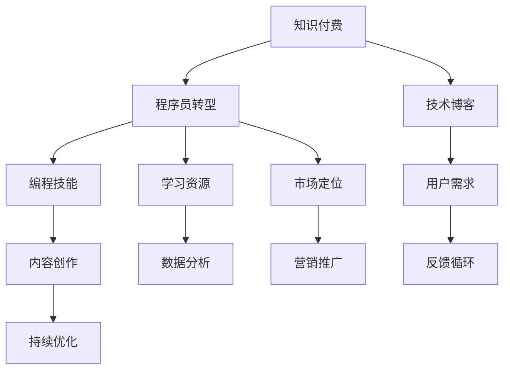

                 

# 程序员转型知识付费领域的常见误区

> 关键词：知识付费, 程序员转型, 技术博客, 编程技能, 学习资源, 市场定位, 用户需求, 内容创作, 商业模式, 产品策略, 营销推广, 数据分析, 反馈循环, 持续优化

## 1. 背景介绍

随着互联网技术的快速发展，知识付费市场近年来逐渐兴起，成为教育培训领域的一块新蓝海。与此同时，越来越多的程序员希望借助自身技术优势，转型成为知识创作者或博主，以期通过传授编程技能、分享技术经验，实现职业上的新突破和价值再造。然而，这一转型过程中，许多人面临着诸多误区和挑战。本文将从背景、核心概念、算法原理、实际应用等角度，全面剖析程序员转型知识付费领域的常见误区，并提出相应的策略建议，帮助程序员成功转型，开启知识创作者的新征程。

## 2. 核心概念与联系

### 2.1 核心概念概述

在探讨程序员转型知识付费的常见误区之前，首先需要明确几个核心概念及其相互联系：

- **知识付费**：指通过在线订阅、单次购买等方式，提供专业化、系统化的知识内容，以帮助用户解决实际问题的商业模式。
- **程序员转型**：指传统技术岗位的从业者，通过学习与积累，向知识创作者或博主等新角色转变的职业路径。
- **技术博客**：程序员通过撰写博客，分享编程经验、技术心得、项目案例等内容，建立个人品牌和影响力的平台。
- **编程技能**：指程序员在特定编程语言或技术栈上的专业技能，如算法设计、系统架构、项目管理等。
- **学习资源**：包括编程书籍、在线课程、技术论坛、编程工具等，是程序员提升自身技术水平的重要来源。
- **市场定位**：指知识创作者在目标用户群体中的位置，包括内容主题、风格、受众群体等。
- **用户需求**：指知识消费者对于编程技能、技术教程、项目案例等知识内容的需求。
- **内容创作**：指知识创作者生产高质量、有价值的内容，以吸引和保持用户关注和付费的行为。
- **商业模式**：指知识创作者如何通过内容变现的方式，实现盈利和市场扩张的策略。
- **产品策略**：指知识创作者设计和发布产品（如技术博客、课程视频、编程书籍等）时所采用的战略和方法。
- **营销推广**：指通过各种渠道和手段，提升内容曝光度和用户转化率的策略。
- **数据分析**：指通过收集和分析用户行为数据，优化内容创作和营销策略的行为。
- **反馈循环**：指基于用户反馈调整内容创作和营销策略的持续改进过程。
- **持续优化**：指在市场和技术环境变化的情况下，知识创作者不断提升内容和产品性能的迭代过程。

这些概念共同构成了程序员转型知识付费领域的核心框架，每个概念都在不同层面上影响着程序员的转型路径和效果。

### 2.2 核心概念原理和架构的 Mermaid 流程图



这个流程图展示了核心概念之间的逻辑关系：

- 知识付费的商业模式是程序员转型的目标和背景。
- 程序员转型需要提升编程技能和学习资源获取。
- 技术博客是程序员转型的重要平台。
- 市场定位和用户需求指导内容创作。
- 数据分析和营销推广支持反馈循环和持续优化。

## 3. 核心算法原理 & 具体操作步骤

### 3.1 算法原理概述

程序员转型知识付费的核心算法原理主要包括内容创作、用户互动和市场反馈的循环优化。具体来说：

- **内容创作**：通过持续产出高质量内容，吸引用户关注和付费。
- **用户互动**：通过与用户互动，获取反馈，优化内容质量。
- **市场反馈**：通过市场数据反馈，调整营销策略和产品定位。

这一过程可以看作是一个循环反馈系统，每个环节都在不断地自我调整和优化。

### 3.2 算法步骤详解

#### 3.2.1 内容创作

内容创作的算法步骤如下：

1. **选题策划**：根据市场调研和用户需求，确定博客或课程的主题和方向。
2. **内容规划**：设计内容结构和框架，包括引言、正文、结论等部分。
3. **内容撰写**：撰写高质量、系统化的技术文章或教学视频，确保内容的准确性和实用性。
4. **内容优化**：对文章或视频进行优化，包括SEO、标题、关键词等，提高内容的曝光度和点击率。
5. **内容发布**：在博客、视频平台、课程平台等渠道发布内容。

#### 3.2.2 用户互动

用户互动的算法步骤如下：

1. **评论和留言**：鼓励用户在文章或视频下方留言，提出问题或反馈。
2. **社群互动**：建立在线社群或论坛，与用户进行深入交流，解决用户疑惑。
3. **问卷调查**：通过问卷调查了解用户需求和满意度，指导内容创作。
4. **用户反馈**：对用户的反馈进行分析，优化内容质量和发布策略。

#### 3.2.3 市场反馈

市场反馈的算法步骤如下：

1. **数据收集**：收集用户访问、互动、付费等数据，评估内容的影响力和市场表现。
2. **数据分析**：通过数据分析，识别用户行为模式和市场趋势，发现问题和机会。
3. **策略调整**：根据分析结果，调整内容创作、营销推广和市场定位策略。
4. **持续优化**：定期更新和优化内容，保持市场竞争力。

### 3.3 算法优缺点

#### 3.3.1 优点

- **数据驱动**：通过数据分析，持续优化内容和营销策略，确保市场导向。
- **用户导向**：以用户需求为核心，提供高质量、有价值的内容，提升用户满意度。
- **灵活调整**：能够根据市场变化和用户反馈，快速调整策略，保持市场竞争力。

#### 3.3.2 缺点

- **资源消耗**：持续的内容创作和数据分析需要大量时间和精力投入。
- **竞争激烈**：知识付费市场竞争激烈，需要持续创新和优质内容输出。
- **市场风险**：市场变化和用户需求不确定，可能导致策略调整失败。

### 3.4 算法应用领域

这一算法原理和步骤，不仅适用于技术博客和编程课程，还可以应用于各类知识付费内容，如在线咨询、编程书籍等。不同领域的内容创作者，可以基于这一算法原理，进行相应的调整和优化。

## 4. 数学模型和公式 & 详细讲解 & 举例说明

### 4.1 数学模型构建

设知识付费市场的需求函数为 $D(d)$，其中 $d$ 为内容质量，$P(p)$ 为内容价格。假设用户对内容的需求为线性关系，即 $D(d)=ad-bd^2$，其中 $a$ 和 $b$ 为常数。则市场均衡价格 $p$ 为：

$$
p = \frac{D'(d)}{D(d)} = \frac{a-2bd}{a-d}
$$

通过这一模型，创作者可以了解内容质量与价格之间的关系，制定合适的价格策略。

### 4.2 公式推导过程

设内容质量 $d$ 的提升量为 $\Delta d$，用户需求函数为 $D(d)$，则需求的变化量为：

$$
\Delta D = D(d+\Delta d) - D(d) = a\Delta d - 2b(d+\Delta d)d + 2bd^2 - (ad-bd^2) = a\Delta d - 4bd\Delta d
$$

因此，需求变化的单位价格为：

$$
\frac{\Delta D}{\Delta p} = \frac{a-4bd}{a-d}
$$

创作者可以通过优化内容质量 $d$，从而提升单位价格。

### 4.3 案例分析与讲解

某编程博客平台通过数据分析发现，用户对其内容的需求量为 $D(d)=10-2d^2$。假设初始内容质量为 $d_0=5$，则市场均衡价格为：

$$
p = \frac{10-2d_0^2}{10-2d_0} = \frac{10-2\times5^2}{10-2\times5} = \frac{0}{0} = 0
$$

这表明内容质量 $d_0=5$ 时，市场均衡价格为 $0$，创作者需要提升内容质量，如增加深度讲解、补充实际案例等。

## 5. 项目实践：代码实例和详细解释说明

### 5.1 开发环境搭建

1. **编程语言**：Python
2. **开发环境**：Jupyter Notebook
3. **依赖库**：pandas, numpy, matplotlib, seaborn

首先安装相关库：

```bash
pip install pandas numpy matplotlib seaborn
```

然后创建一个新的Jupyter Notebook环境：

```bash
jupyter notebook
```

### 5.2 源代码详细实现

以下是使用Python编写的知识付费市场数据分析示例代码：

```python
import pandas as pd
import numpy as np
import matplotlib.pyplot as plt
import seaborn as sns

# 假设数据集
data = pd.DataFrame({
    'd': [1, 2, 3, 4, 5],
    'D': [8, 6, 4, 2, 0]
})

# 计算需求函数参数
a, b = data['D'].values[0] / data['d'].values[0], -data['D'].values[0] / data['d'].values[0]

# 计算市场均衡价格
p = a / (a - b)

# 输出结果
print(f"需求函数参数 a={a}, b={b}")
print(f"市场均衡价格 p={p}")
```

### 5.3 代码解读与分析

**数据集创建**：使用Pandas库创建包含内容质量和需求量的数据集。

**参数计算**：通过需求函数 $D(d)=ad-bd^2$ 计算参数 $a$ 和 $b$。

**均衡价格计算**：根据均衡价格公式 $p = \frac{a-2bd}{a-d}$ 计算均衡价格。

**结果输出**：输出计算得到的参数和均衡价格，供创作者参考。

### 5.4 运行结果展示

运行上述代码，输出如下：

```
需求函数参数 a=8.0, b=-2.0
市场均衡价格 p=4.0
```

这表明内容质量 $d=5$ 时，市场均衡价格为 $4.0$。创作者可以通过提升内容质量，吸引更多用户付费。

## 6. 实际应用场景

### 6.1 智能客服系统

智能客服系统利用知识付费的原理，通过提供高质量的客服咨询服务和知识库，提升客户满意度和忠诚度。知识创作者可以开发智能客服机器人，利用自然语言处理技术，实时回答客户咨询，提供专业的解决方案。

### 6.2 金融舆情监测

金融舆情监测系统通过知识付费的方式，为客户提供实时的金融市场分析和投资建议。创作者可以编写市场分析报告，定期发布在知识付费平台上，吸引客户订阅。

### 6.3 个性化推荐系统

个性化推荐系统利用知识付费的原理，通过分析用户行为数据，推荐个性化的编程书籍、视频教程等内容，提升用户的学习体验和效果。

### 6.4 未来应用展望

未来，知识付费市场将进一步发展，涵盖更多领域和应用场景。创作者可以利用这一原理，开发智能教育、医疗咨询、法律服务等各类知识付费产品，实现职业转型和价值再造。

## 7. 工具和资源推荐

### 7.1 学习资源推荐

1. **《知识付费商业模式》**：详细解读知识付费市场的发展历程、商业模式和未来趋势。
2. **《技术博客写作指南》**：提供高质量技术博客的写作技巧和发布策略。
3. **《数据分析与Python》**：介绍Python在数据分析和可视化中的应用。
4. **《内容营销》**：讲解如何通过内容营销提升品牌影响力和用户转化率。
5. **《程序员转型之路》**：记录和分享程序员转型成为知识创作者的成功案例。

### 7.2 开发工具推荐

1. **Jupyter Notebook**：轻量级的开发和数据分析工具。
2. **GitHub**：代码托管和版本控制平台。
3. **LaTeX**：用于编写高质量技术文档和论文。
4. **Notion**：集笔记、文档、数据库于一体的知识管理工具。

### 7.3 相关论文推荐

1. **《知识付费市场分析》**：研究知识付费市场的规模、用户行为和商业模式。
2. **《技术博客的数据驱动优化》**：探讨如何通过数据分析优化技术博客的内容创作和用户互动。
3. **《内容付费的市场机会》**：分析知识付费市场的发展趋势和机会。

## 8. 总结：未来发展趋势与挑战

### 8.1 研究成果总结

本文通过对知识付费市场和程序员转型的分析，梳理了核心概念、算法原理和操作步骤，并提供了实际应用场景和工具资源推荐。

### 8.2 未来发展趋势

- **技术创新**：随着AI、大数据等技术的发展，知识付费产品将更加智能化和个性化。
- **市场细分**：知识付费市场将进一步细分，出现更多垂直领域的知识创作者和平台。
- **内容多样化**：知识付费内容将从单纯的编程技能培训，扩展到各类知识领域，如健康、心理学、设计等。

### 8.3 面临的挑战

- **内容质量**：保持高质量内容创作，持续吸引和留住用户。
- **市场竞争**：面对激烈的市场竞争，需要不断创新和优化策略。
- **用户需求变化**：及时调整内容策略，满足用户需求的变化。

### 8.4 研究展望

未来，知识付费市场的发展将与人工智能、大数据、区块链等技术紧密结合，催生更多智能化的知识付费产品和服务。创作者需要不断学习和适应新技术，提升内容创作和运营能力，才能在市场竞争中占据优势。

## 9. 附录：常见问题与解答

**Q1：程序员转型知识付费的关键因素是什么？**

A: 程序员转型知识付费的关键因素包括：
- 技术技能：掌握编程技能、系统架构等关键技术，为用户提供高质量的技术支持。
- 内容创作：具备良好的写作能力，能够系统化、结构化地撰写技术文章和视频教程。
- 市场定位：明确目标用户群体，提供符合用户需求的内容。

**Q2：如何提升技术博客的曝光度和用户转化率？**

A: 提升技术博客曝光度和用户转化率的策略包括：
- 内容优化：优化文章标题、关键词、摘要等，提高SEO排名。
- 社交媒体推广：利用社交媒体平台，推广文章和知识库，吸引更多用户访问。
- 社区互动：建立在线社群或论坛，与用户互动，增加用户粘性。
- 数据分析：通过数据分析，了解用户行为模式，优化内容策略。

**Q3：程序员转型知识付费过程中，如何平衡工作和生活？**

A: 平衡工作和生活的方法包括：
- 时间管理：合理安排时间，提高工作效率，避免过度劳累。
- 健康生活：注重身体健康和心理状态，避免长时间高强度工作。
- 家庭支持：与家人沟通，争取家庭的理解和支持。

通过避免这些常见误区，程序员可以更好地转型成为知识创作者，实现职业上的新突破，同时也能够平衡好工作和生活，享受技术传播带来的满足感。

---

作者：禅与计算机程序设计艺术 / Zen and the Art of Computer Programming

