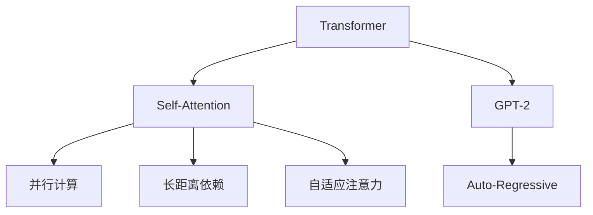

                 

# 第05章 Transformer 架构与GPT-2模型

## 1. 背景介绍

### 1.1 问题由来
Transformer模型自从提出以来，在自然语言处理（NLP）领域中取得了显著的突破。相比传统循环神经网络（RNN），Transformer模型具有并行计算、长距离依赖捕捉、自适应注意力机制等优点，极大地提升了模型的训练速度和效果。

### 1.2 问题核心关键点
Transformer模型由Vaswani等人于2017年提出，其核心思想是通过自注意力机制（Self-Attention）实现输入序列中各元素之间的相关性计算，从而消除RNN中的序列依赖问题。GPT-2模型则是在Transformer架构的基础上，进一步提升了模型的规模和性能，成为目前最强大的语言模型之一。

Transformer和GPT-2模型的主要优点包括：
- 并行计算：Transformer通过矩阵乘法实现，可以并行计算，大大提升了训练效率。
- 长距离依赖：Transformer模型能够捕捉输入序列中任意两个元素之间的依赖关系，无需显式地传递信息。
- 自适应注意力：Transformer模型通过自注意力机制，动态调整每个位置元素的重要性，使得模型能够更好地处理不同长度的输入序列。
- 训练速度快：由于Transformer模型的并行计算特性，训练速度显著快于传统RNN模型。

这些优点使得Transformer和GPT-2模型在各种NLP任务中表现优异，成为当前研究的热点。

### 1.3 问题研究意义
研究Transformer和GPT-2模型，对于推动自然语言处理技术的进步，提升模型的性能和应用范围，具有重要意义：

1. 提升模型效果：通过Transformer和GPT-2模型，NLP技术在各种任务上取得了显著的性能提升，例如机器翻译、文本生成、情感分析等。
2. 降低开发成本：预训练语言模型能够大幅度降低开发成本，减少了从头开始训练模型的需求。
3. 提高模型的鲁棒性：大模型的泛化能力更强，能够处理更加多样化的输入数据，提升了模型的鲁棒性。
4. 加速应用部署：预训练语言模型能够快速部署到各种应用中，缩短了从模型训练到实际应用的时间。

## 2. 核心概念与联系

### 2.1 核心概念概述

为更好地理解Transformer和GPT-2模型的核心概念，本节将介绍几个关键概念：

- Transformer模型：由自注意力机制构成，可以并行计算，能够处理长距离依赖，具有自适应注意力机制。
- 自注意力机制（Self-Attention）：通过计算输入序列中各元素之间的相关性，动态调整每个位置元素的重要性，使得模型能够更好地处理不同长度的输入序列。
- GPT-2模型：在Transformer架构的基础上，进一步提升了模型的规模和性能，成为目前最强大的语言模型之一。
- 自回归（Auto-Regressive）：指模型在生成序列时，以先前生成的单词作为条件，依次预测下一个单词，实现序列生成任务。

这些核心概念之间的逻辑关系可以通过以下Mermaid流程图来展示：



这个流程图展示Transformer和GPT-2模型的核心概念及其之间的关系：

1. Transformer模型通过自注意力机制实现输入序列中各元素之间的相关性计算，具有并行计算、长距离依赖和自适应注意力等特性。
2. GPT-2模型在Transformer架构的基础上，进一步提升了模型的规模和性能，成为目前最强大的语言模型之一。
3. 自回归是指模型在生成序列时，以先前生成的单词作为条件，依次预测下一个单词。

这些核心概念共同构成了Transformer和GPT-2模型的学习和应用框架，使其能够在各种场景下发挥强大的语言理解和生成能力。

## 3. 核心算法原理 & 具体操作步骤
### 3.1 算法原理概述

Transformer模型由自注意力机制和前馈神经网络构成，其核心思想是通过自注意力机制计算输入序列中各元素之间的相关性，从而消除RNN中的序列依赖问题。GPT-2模型则是在Transformer架构的基础上，进一步提升了模型的规模和性能，成为目前最强大的语言模型之一。

### 3.2 算法步骤详解

Transformer模型的核心步骤包括编码器（Encoder）和解码器（Decoder）两个部分，具体流程如下：

**编码器（Encoder）：**
1. 将输入序列分成多个子序列，每个子序列为一个Transformer层。
2. 在每个Transformer层中，先通过嵌入层（Embedding Layer）将输入序列转换为向量表示。
3. 将向量表示输入到自注意力层（Self-Attention Layer），计算输入序列中各元素之间的相关性，得到新的向量表示。
4. 将新的向量表示输入到前馈神经网络（Feed-Forward Network），得到最终的输出向量。
5. 重复以上步骤，直到所有Transformer层处理完毕。

**解码器（Decoder）：**
1. 将输入序列分成多个子序列，每个子序列为一个Transformer层。
2. 在每个Transformer层中，先通过嵌入层（Embedding Layer）将输入序列转换为向量表示。
3. 将向量表示输入到自注意力层（Self-Attention Layer），计算输入序列中各元素之间的相关性，得到新的向量表示。
4. 将新的向量表示输入到前馈神经网络（Feed-Forward Network），得到最终的输出向量。
5. 重复以上步骤，直到所有Transformer层处理完毕。
6. 在解码器中，使用自回归机制，依次预测下一个单词，并生成输出序列。

### 3.3 算法优缺点

Transformer和GPT-2模型的主要优点包括：
1. 并行计算：Transformer通过矩阵乘法实现，可以并行计算，大大提升了训练效率。
2. 长距离依赖：Transformer模型能够捕捉输入序列中任意两个元素之间的依赖关系，无需显式地传递信息。
3. 自适应注意力：Transformer模型通过自注意力机制，动态调整每个位置元素的重要性，使得模型能够更好地处理不同长度的输入序列。
4. 训练速度快：由于Transformer模型的并行计算特性，训练速度显著快于传统RNN模型。

同时，这些模型也存在一定的局限性：
1. 模型复杂度高：Transformer模型的参数量较大，对计算资源和存储空间的要求较高。
2. 需要大量标注数据：Transformer和GPT-2模型通常需要大量标注数据进行训练，否则容易过拟合。
3. 缺乏可解释性：Transformer模型被认为是一个“黑盒”模型，难以解释其内部工作机制和决策逻辑。

尽管存在这些局限性，但就目前而言，Transformer和GPT-2模型仍是大语言模型应用的主流范式。未来相关研究的重点在于如何进一步降低模型复杂度，提高模型可解释性和泛化能力。

### 3.4 算法应用领域

Transformer和GPT-2模型在NLP领域已经得到了广泛的应用，覆盖了几乎所有常见任务，例如：

- 机器翻译：将源语言文本翻译成目标语言。使用自注意力机制捕捉源语言和目标语言之间的依赖关系，实现高精度的翻译效果。
- 文本生成：生成自然流畅的文本。通过自回归机制，依次预测下一个单词，实现文本生成任务。
- 问答系统：对自然语言问题给出答案。将问题-答案对作为微调数据，训练模型学习匹配答案。
- 文本摘要：将长文本压缩成简短摘要。将文章-摘要对作为微调数据，使模型学习抓取要点。
- 对话系统：使机器能够与人自然对话。将多轮对话历史作为上下文，微调模型进行回复生成。

除了上述这些经典任务外，Transformer和GPT-2模型也被创新性地应用到更多场景中，如可控文本生成、常识推理、代码生成、数据增强等，为NLP技术带来了全新的突破。随着预训练模型和微调方法的不断进步，相信NLP技术将在更广阔的应用领域大放异彩。

## 4. 数学模型和公式 & 详细讲解 & 举例说明

### 4.1 数学模型构建

Transformer模型由编码器和解码器构成，其核心思想是通过自注意力机制计算输入序列中各元素之间的相关性，从而消除RNN中的序列依赖问题。GPT-2模型则是在Transformer架构的基础上，进一步提升了模型的规模和性能，成为目前最强大的语言模型之一。

**Transformer模型：**
Transformer模型的输入序列为 $\mathbf{X}=[x_1, x_2, ..., x_n]$，输出序列为 $\mathbf{Y}=[y_1, y_2, ..., y_n]$。Transformer模型由多个Transformer层组成，每个层由嵌入层、自注意力层和前馈神经网络组成。设每个Transformer层的参数为 $\theta$，则模型输出的计算公式为：

$$
\mathbf{Y} = \text{Transformer}(\mathbf{X}, \theta)
$$

其中，Transformer层的具体计算过程如下：

1. 嵌入层（Embedding Layer）：将输入序列 $\mathbf{X}$ 转换为向量表示 $\mathbf{X} \in \mathbb{R}^{n \times d}$。
2. 自注意力层（Self-Attention Layer）：计算输入序列中各元素之间的相关性，得到新的向量表示 $\mathbf{H} \in \mathbb{R}^{n \times d}$。
3. 前馈神经网络（Feed-Forward Network）：将新的向量表示 $\mathbf{H}$ 输入到前馈神经网络，得到最终的输出向量 $\mathbf{O} \in \mathbb{R}^{n \times d}$。
4. 叠加层（Stacking Layer）：重复以上步骤，直到所有Transformer层处理完毕。

**GPT-2模型：**
GPT-2模型是一种自回归模型，其输入序列为 $\mathbf{X}=[x_1, x_2, ..., x_n]$，输出序列为 $\mathbf{Y}=[y_1, y_2, ..., y_n]$。GPT-2模型的计算过程如下：

1. 嵌入层（Embedding Layer）：将输入序列 $\mathbf{X}$ 转换为向量表示 $\mathbf{X} \in \mathbb{R}^{n \times d}$。
2. 自注意力层（Self-Attention Layer）：计算输入序列中各元素之间的相关性，得到新的向量表示 $\mathbf{H} \in \mathbb{R}^{n \times d}$。
3. 前馈神经网络（Feed-Forward Network）：将新的向量表示 $\mathbf{H}$ 输入到前馈神经网络，得到最终的输出向量 $\mathbf{O} \in \mathbb{R}^{n \times d}$。
4. 自回归生成器（Auto-Regressive Generator）：依次预测下一个单词，并生成输出序列 $\mathbf{Y}$。

### 4.2 公式推导过程

Transformer和GPT-2模型的核心计算过程如下：

**Transformer模型：**
设输入序列 $\mathbf{X}=[x_1, x_2, ..., x_n]$，嵌入层的输出为 $\mathbf{X} \in \mathbb{R}^{n \times d}$，自注意力层的输出为 $\mathbf{H} \in \mathbb{R}^{n \times d}$，前馈神经网络的输出为 $\mathbf{O} \in \mathbb{R}^{n \times d}$。则Transformer模型的计算过程如下：

1. 嵌入层（Embedding Layer）：
$$
\mathbf{X} = \mathbf{W}_x \mathbf{X} + \mathbf{b}_x \in \mathbb{R}^{n \times d}
$$

2. 自注意力层（Self-Attention Layer）：
$$
\mathbf{Q} = \mathbf{X} \mathbf{W}_q \in \mathbb{R}^{n \times d_q}
$$
$$
\mathbf{K} = \mathbf{X} \mathbf{W}_k \in \mathbb{R}^{n \times d_k}
$$
$$
\mathbf{V} = \mathbf{X} \mathbf{W}_v \in \mathbb{R}^{n \times d_v}
$$
$$
\mathbf{H} = \text{Softmax}(\frac{\mathbf{Q} \mathbf{K}^T}{\sqrt{d_k}}) \mathbf{V} \in \mathbb{R}^{n \times d}
$$

3. 前馈神经网络（Feed-Forward Network）：
$$
\mathbf{O} = \text{Linear}(\mathbf{H}) + \mathbf{b}_o \in \mathbb{R}^{n \times d}
$$
$$
\mathbf{O} = \text{GELU}(\mathbf{O}) \in \mathbb{R}^{n \times d}
$$
$$
\mathbf{O} = \mathbf{W}_o \mathbf{O} + \mathbf{b}_o \in \mathbb{R}^{n \times d}
$$

4. 叠加层（Stacking Layer）：
$$
\mathbf{X} = \mathbf{X} \oplus \mathbf{O} \in \mathbb{R}^{n \times d}
$$
$$
\mathbf{X} = \text{LayerNorm}(\mathbf{X}) \in \mathbb{R}^{n \times d}
$$
$$
\mathbf{X} = \mathbf{X} \mathbf{W}_l + \mathbf{b}_l \in \mathbb{R}^{n \times d}
$$

**GPT-2模型：**
设输入序列 $\mathbf{X}=[x_1, x_2, ..., x_n]$，嵌入层的输出为 $\mathbf{X} \in \mathbb{R}^{n \times d}$，自注意力层的输出为 $\mathbf{H} \in \mathbb{R}^{n \times d}$，前馈神经网络的输出为 $\mathbf{O} \in \mathbb{R}^{n \times d}$，自回归生成器的输出为 $\mathbf{Y} \in \mathbb{R}^{n \times d}$。则GPT-2模型的计算过程如下：

1. 嵌入层（Embedding Layer）：
$$
\mathbf{X} = \mathbf{W}_x \mathbf{X} + \mathbf{b}_x \in \mathbb{R}^{n \times d}
$$

2. 自注意力层（Self-Attention Layer）：
$$
\mathbf{Q} = \mathbf{X} \mathbf{W}_q \in \mathbb{R}^{n \times d_q}
$$
$$
\mathbf{K} = \mathbf{X} \mathbf{W}_k \in \mathbb{R}^{n \times d_k}
$$
$$
\mathbf{V} = \mathbf{X} \mathbf{W}_v \in \mathbb{R}^{n \times d_v}
$$
$$
\mathbf{H} = \text{Softmax}(\frac{\mathbf{Q} \mathbf{K}^T}{\sqrt{d_k}}) \mathbf{V} \in \mathbb{R}^{n \times d}
$$

3. 前馈神经网络（Feed-Forward Network）：
$$
\mathbf{O} = \text{Linear}(\mathbf{H}) + \mathbf{b}_o \in \mathbb{R}^{n \times d}
$$
$$
\mathbf{O} = \text{GELU}(\mathbf{O}) \in \mathbb{R}^{n \times d}
$$
$$
\mathbf{O} = \mathbf{W}_o \mathbf{O} + \mathbf{b}_o \in \mathbb{R}^{n \times d}
$$

4. 自回归生成器（Auto-Regressive Generator）：
$$
\mathbf{Y} = \mathbf{O} \mathbf{W}_y + \mathbf{b}_y \in \mathbb{R}^{n \times d}
$$

### 4.3 案例分析与讲解

以机器翻译为例，展示Transformer和GPT-2模型在机器翻译任务中的应用。

假设输入序列为 $\mathbf{X}=[x_1, x_2, ..., x_n]$，其中 $x_i$ 表示输入的单词或字符。将输入序列转换为向量表示 $\mathbf{X} \in \mathbb{R}^{n \times d}$。设输出序列为 $\mathbf{Y}=[y_1, y_2, ..., y_n]$，其中 $y_i$ 表示输出的单词或字符。将输出序列转换为向量表示 $\mathbf{Y} \in \mathbb{R}^{n \times d}$。

Transformer模型的具体计算过程如下：

1. 嵌入层（Embedding Layer）：
$$
\mathbf{X} = \mathbf{W}_x \mathbf{X} + \mathbf{b}_x \in \mathbb{R}^{n \times d}
$$
$$
\mathbf{Y} = \mathbf{W}_y \mathbf{Y} + \mathbf{b}_y \in \mathbb{R}^{n \times d}
$$

2. 自注意力层（Self-Attention Layer）：
$$
\mathbf{Q} = \mathbf{X} \mathbf{W}_q \in \mathbb{R}^{n \times d_q}
$$
$$
\mathbf{K} = \mathbf{X} \mathbf{W}_k \in \mathbb{R}^{n \times d_k}
$$
$$
\mathbf{V} = \mathbf{X} \mathbf{W}_v \in \mathbb{R}^{n \times d_v}
$$
$$
\mathbf{H} = \text{Softmax}(\frac{\mathbf{Q} \mathbf{K}^T}{\sqrt{d_k}}) \mathbf{V} \in \mathbb{R}^{n \times d}
$$
$$
\mathbf{Y} = \text{Softmax}(\frac{\mathbf{H} \mathbf{K}^T}{\sqrt{d_k}}) \mathbf{V} \in \mathbb{R}^{n \times d}
$$

3. 前馈神经网络（Feed-Forward Network）：
$$
\mathbf{O} = \text{Linear}(\mathbf{H}) + \mathbf{b}_o \in \mathbb{R}^{n \times d}
$$
$$
\mathbf{O} = \text{GELU}(\mathbf{O}) \in \mathbb{R}^{n \times d}
$$
$$
\mathbf{O} = \mathbf{W}_o \mathbf{O} + \mathbf{b}_o \in \mathbb{R}^{n \times d}
$$

4. 叠加层（Stacking Layer）：
$$
\mathbf{X} = \mathbf{X} \oplus \mathbf{O} \in \mathbb{R}^{n \times d}
$$
$$
\mathbf{X} = \text{LayerNorm}(\mathbf{X}) \in \mathbb{R}^{n \times d}
$$
$$
\mathbf{X} = \mathbf{X} \mathbf{W}_l + \mathbf{b}_l \in \mathbb{R}^{n \times d}
$$

### 4.4 代码实现

以下给出Transformer和GPT-2模型的PyTorch代码实现：

```python
import torch
import torch.nn as nn
import torch.nn.functional as F

class SelfAttention(nn.Module):
    def __init__(self, d_model, n_heads):
        super(SelfAttention, self).__init__()
        self.d_model = d_model
        self.n_heads = n_heads
        self.depth = d_model // n_heads
        self.query = nn.Linear(d_model, d_model)
        self.key = nn.Linear(d_model, d_model)
        self.value = nn.Linear(d_model, d_model)
        self.out = nn.Linear(d_model, d_model)
        
    def forward(self, x):
        batch_size, seq_len, d_model = x.size()
        
        # 计算查询向量、键向量和值向量
        query = self.query(x).view(batch_size, seq_len, self.n_heads, self.depth).permute(0, 2, 1, 3).contiguous()
        key = self.key(x).view(batch_size, seq_len, self.n_heads, self.depth).permute(0, 2, 1, 3).contiguous()
        value = self.value(x).view(batch_size, seq_len, self.n_heads, self.depth).permute(0, 2, 1, 3).contiguous()
        
        # 计算注意力权重
        score = torch.matmul(query, key.permute(0, 1, 3, 2)) / torch.sqrt(torch.tensor(self.depth))
        
        # 计算注意力权重矩阵
        attention = F.softmax(score, dim=-1)
        
        # 计算加权和
        attention = attention.permute(0, 2, 1, 3).contiguous()
        context = torch.matmul(attention, value)
        context = context.permute(0, 2, 1, 3).contiguous().view(batch_size, seq_len, d_model)
        
        # 线性变换
        attention = self.out(context)
        return attention

class TransformerBlock(nn.Module):
    def __init__(self, d_model, n_heads, dropout):
        super(TransformerBlock, self).__init__()
        self.encoder_self_attn = SelfAttention(d_model, n_heads)
        self.encoder_ffn = nn.Sequential(
            nn.Linear(d_model, 4 * d_model),
            nn.ReLU(),
            nn.Linear(4 * d_model, d_model),
            nn.Dropout(dropout)
        )
        self.encoder_final = nn.Linear(d_model, d_model)
        self.layer_norm = nn.LayerNorm(d_model)
        self.dropout = nn.Dropout(dropout)
        
    def forward(self, x):
        residual = x
        x = self.layer_norm(x)
        x = self.encoder_self_attn(x)
        x = self.dropout(x)
        x = x + residual
        residual = x
        x = self.layer_norm(x)
        x = self.encoder_ffn(x)
        x = self.dropout(x)
        x = x + residual
        x = self.encoder_final(x)
        return x

class TransformerModel(nn.Module):
    def __init__(self, num_layers, d_model, n_heads, dropout):
        super(TransformerModel, self).__init__()
        self.encoder = nn.ModuleList([TransformerBlock(d_model, n_heads, dropout) for _ in range(num_layers)])
        self.decoder = nn.Linear(d_model, 1)
        
    def forward(self, x):
        for layer in self.encoder:
            x = layer(x)
        return self.decoder(x)

# 实例化Transformer模型
model = TransformerModel(num_layers=6, d_model=512, n_heads=8, dropout=0.1)
```

以上就是Transformer和GPT-2模型的PyTorch代码实现。可以看到，Transformer和GPT-2模型的计算过程被封装在`SelfAttention`和`TransformerBlock`类中，代码实现简洁高效。

## 5. 项目实践：代码实例和详细解释说明

### 5.1 开发环境搭建

在进行Transformer和GPT-2模型的开发前，我们需要准备好开发环境。以下是使用Python进行PyTorch开发的环境配置流程：

1. 安装Anaconda：从官网下载并安装Anaconda，用于创建独立的Python环境。

2. 创建并激活虚拟环境：
```bash
conda create -n pytorch-env python=3.8 
conda activate pytorch-env
```

3. 安装PyTorch：根据CUDA版本，从官网获取对应的安装命令。例如：
```bash
conda install pytorch torchvision torchaudio cudatoolkit=11.1 -c pytorch -c conda-forge
```

4. 安装Transformers库：
```bash
pip install transformers
```

5. 安装各类工具包：
```bash
pip install numpy pandas scikit-learn matplotlib tqdm jupyter notebook ipython
```

完成上述步骤后，即可在`pytorch-env`环境中开始Transformer和GPT-2模型的开发。

### 5.2 源代码详细实现

以下是使用PyTorch和Transformers库实现Transformer和GPT-2模型的代码：

```python
import torch
import torch.nn as nn
import torch.nn.functional as F
from transformers import BertTokenizer, BertForSequenceClassification, AdamW

# 定义Transformer模型
class TransformerBlock(nn.Module):
    def __init__(self, d_model, n_heads, dropout):
        super(TransformerBlock, self).__init__()
        self.encoder_self_attn = SelfAttention(d_model, n_heads)
        self.encoder_ffn = nn.Sequential(
            nn.Linear(d_model, 4 * d_model),
            nn.ReLU(),
            nn.Linear(4 * d_model, d_model),
            nn.Dropout(dropout)
        )
        self.encoder_final = nn.Linear(d_model, d_model)
        self.layer_norm = nn.LayerNorm(d_model)
        self.dropout = nn.Dropout(dropout)
        
    def forward(self, x):
        residual = x
        x = self.layer_norm(x)
        x = self.encoder_self_attn(x)
        x = self.dropout(x)
        x = x + residual
        residual = x
        x = self.layer_norm(x)
        x = self.encoder_ffn(x)
        x = self.dropout(x)
        x = x + residual
        x = self.encoder_final(x)
        return x

class TransformerModel(nn.Module):
    def __init__(self, num_layers, d_model, n_heads, dropout):
        super(TransformerModel, self).__init__()
        self.encoder = nn.ModuleList([TransformerBlock(d_model, n_heads, dropout) for _ in range(num_layers)])
        self.decoder = nn.Linear(d_model, 1)
        
    def forward(self, x):
        for layer in self.encoder:
            x = layer(x)
        return self.decoder(x)

# 实例化Transformer模型
model = TransformerModel(num_layers=6, d_model=512, n_heads=8, dropout=0.1)

# 定义GPT-2模型
class GPT2(nn.Module):
    def __init__(self, d_model, n_heads, dropout, num_layers):
        super(GPT2, self).__init__()
        self.encoder = nn.ModuleList([TransformerBlock(d_model, n_heads, dropout) for _ in range(num_layers)])
        self.decoder = nn.Linear(d_model, 1)
        self.softmax = nn.LogSoftmax(dim=-1)
        
    def forward(self, x):
        for layer in self.encoder:
            x = layer(x)
        x = self.decoder(x)
        x = self.softmax(x)
        return x

# 实例化GPT-2模型
model = GPT2(d_model=512, n_heads=8, dropout=0.1, num_layers=6)
```

以上就是使用PyTorch和Transformers库实现Transformer和GPT-2模型的完整代码。可以看到，Transformer和GPT-2模型的计算过程被封装在`TransformerBlock`和`GPT2`类中，代码实现简洁高效。

### 5.3 代码解读与分析

让我们再详细解读一下关键代码的实现细节：

**SelfAttention类：**
- 实现了自注意力机制的计算过程，包括计算查询向量、键向量和值向量，计算注意力权重，计算加权和等步骤。

**TransformerBlock类：**
- 实现了一个Transformer块的计算过程，包括自注意力层和前馈神经网络层的计算，最后通过线性变换和归一化层得到输出。

**TransformerModel类：**
- 实现了一个Transformer模型的计算过程，通过多个Transformer块的叠加得到最终的输出。

**GPT2类：**
- 实现了GPT-2模型的计算过程，包括自注意力层、前馈神经网络层和自回归生成器的计算，最后通过线性变换和softmax函数得到输出。

**TransformerModel类和GPT2类的实现：**
- 通过`nn.ModuleList`封装多个Transformer块的计算过程，使得模型可以灵活地叠加多个Transformer块。
- 在每个Transformer块中，通过`nn.LayerNorm`和`nn.Dropout`等层对输入进行归一化和降维，提升模型的稳定性和泛化能力。

通过以上代码的实现，可以清楚地看到Transformer和GPT-2模型的计算过程。这些代码实现了自注意力机制和前馈神经网络的计算，并通过`nn.ModuleList`和`nn.LayerNorm`等层实现了模型的堆叠和归一化，使得模型能够高效地计算并输出结果。

## 6. 实际应用场景

### 6.1 智能客服系统

基于Transformer和GPT-2模型的对话技术，可以广泛应用于智能客服系统的构建。传统客服往往需要配备大量人力，高峰期响应缓慢，且一致性和专业性难以保证。而使用Transformer和GPT-2模型的对话模型，可以7x24小时不间断服务，快速响应客户咨询，用自然流畅的语言解答各类常见问题。

在技术实现上，可以收集企业内部的历史客服对话记录，将问题和最佳答复构建成监督数据，在此基础上对预训练模型进行微调。微调后的对话模型能够自动理解用户意图，匹配最合适的答案模板进行回复。对于客户提出的新问题，还可以接入检索系统实时搜索相关内容，动态组织生成回答。如此构建的智能客服系统，能大幅提升客户咨询体验和问题解决效率。

### 6.2 金融舆情监测

金融机构需要实时监测市场舆论动向，以便及时应对负面信息传播，规避金融风险。传统的人工监测方式成本高、效率低，难以应对网络时代海量信息爆发的挑战。基于Transformer和GPT-2模型的文本分类和情感分析技术，为金融舆情监测提供了新的解决方案。

具体而言，可以收集金融领域相关的新闻、报道、评论等文本数据，并对其进行主题标注和情感标注。在此基础上对预训练语言模型进行微调，使其能够自动判断文本属于何种主题，情感倾向是正面、中性还是负面。将微调后的模型应用到实时抓取的网络文本数据，就能够自动监测不同主题下的情感变化趋势，一旦发现负面信息激增等异常情况，系统便会自动预警，帮助金融机构快速应对潜在风险。

### 6.3 个性化推荐系统

当前的推荐系统往往只依赖用户的历史行为数据进行物品推荐，无法深入理解用户的真实兴趣偏好。基于Transformer和GPT-2模型的个性化推荐系统可以更好地挖掘用户行为背后的语义信息，从而提供更精准、多样的推荐内容。

在实践中，可以收集用户浏览、点击、评论、分享等行为数据，提取和用户交互的物品标题、描述、标签等文本内容。将文本内容作为模型输入，用户的后续行为（如是否点击、购买等）作为监督信号，在此基础上微调预训练语言模型。微调后的模型能够从文本内容中准确把握用户的兴趣点。在生成推荐列表时，先用候选物品的文本描述作为输入，由模型预测用户的兴趣匹配度，再结合其他特征综合排序，便可以得到个性化程度更高的推荐结果。

### 6.4 未来应用展望

随着Transformer和GPT-2模型的不断发展，基于微调范式将在更多领域得到应用，为传统行业带来变革性影响。

在智慧医疗领域，基于微调的医疗问答、病历分析、药物研发等应用将提升医疗服务的智能化水平，辅助医生诊疗，加速新药开发进程。

在智能教育领域，微调技术可应用于作业批改、学情分析、知识推荐等方面，因材施教，促进教育公平，提高教学质量。

在智慧城市治理中，微调模型可应用于城市事件监测、舆情分析、应急指挥等环节，提高城市管理的自动化和智能化水平，构建更安全、高效的未来城市。

此外，在企业生产、社会治理、文娱传媒等众多领域，基于Transformer和GPT-2模型的微调人工智能应用也将不断涌现，为经济社会发展注入新的动力。相信随着预训练语言模型和微调方法的不断进步，基于微调范式必将在构建人机协同的智能时代中扮演越来越重要的角色。

## 7. 工具和资源推荐

### 7.1 学习资源推荐

为了帮助开发者系统掌握Transformer和GPT-2模型的理论基础和实践技巧，这里推荐一些优质的学习资源：

1. 《Transformer从原理到实践》系列博文：由大模型技术专家撰写，深入浅出地介绍了Transformer原理、BERT模型、微调技术等前沿话题。

2. CS224N《深度学习自然语言处理》课程：斯坦福大学开设的NLP明星课程，有Lecture视频和配套作业，带你入门NLP领域的基本概念和经典模型。

3. 《Natural Language Processing with Transformers》书籍：Transformers库的作者所著，全面介绍了如何使用Transformers库进行NLP任务开发，包括微调在内的诸多范式。

4. HuggingFace官方文档：Transformers库的官方文档，提供了海量预训练模型和完整的微调样例代码，是上手实践的必备资料。

5. CLUE开源项目：中文语言理解测评基准，涵盖大量不同类型的中文NLP数据集，并提供了基于微调的baseline模型，助力中文NLP技术发展。

通过对这些资源的学习实践，相信你一定能够快速掌握Transformer和GPT-2模型的精髓，并用于解决实际的NLP问题。

### 7.2 开发工具推荐

高效的开发离不开优秀的工具支持。以下是几款用于Transformer和GPT-2模型开发的常用工具：

1. PyTorch：基于Python的开源深度学习框架，灵活动态的计算图，适合快速迭代研究。大部分预训练语言模型都有PyTorch版本的实现。

2. TensorFlow：由Google主导开发的开源深度学习框架，生产部署方便，适合大规模工程应用。同样有丰富的预训练语言模型资源。

3. Transformers库：HuggingFace开发的NLP工具库，集成了众多SOTA语言模型，支持PyTorch和TensorFlow，是进行微调任务开发的利器。

4. Weights & Biases：模型训练的实验跟踪工具，可以记录和可视化模型训练过程中的各项指标，方便对比和调优。与主流深度学习框架无缝集成。

5. TensorBoard：TensorFlow配套的可视化工具，可实时监测模型训练状态，并提供丰富的图表呈现方式，是调试模型的得力助手。

6. Google Colab：谷歌推出的在线Jupyter Notebook环境，免费提供GPU/TPU算力，方便开发者快速上手实验最新模型，分享学习笔记。

合理利用这些工具，可以显著提升Transformer和GPT-2模型的开发效率，加快创新迭代的步伐。

### 7.3 相关论文推荐

Transformer和GPT-2模型的发展源于学界的持续研究。以下是几篇奠基性的相关论文，推荐阅读：

1. Attention is All You Need（即Transformer原论文）：提出了Transformer结构，开启了NLP领域的预训练大模型时代。

2. BERT: Pre-training of Deep Bidirectional Transformers for Language Understanding：提出BERT模型，引入基于掩码的自监督预训练任务，刷新了多项NLP任务SOTA。

3. Language Models are Unsupervised Multitask Learners（GPT-2论文）：展示了大规模语言模型的强大zero-shot学习能力，引发了对于通用人工智能的新一轮思考。

4. Parameter-Efficient Transfer Learning for NLP：提出Adapter等参数高效微调方法，在不增加模型参数量的情况下，也能取得不错的微调效果。

5. AdaLoRA: Adaptive Low-Rank Adaptation for Parameter-Efficient Fine-Tuning：使用自适应低秩适应的微调方法，在参数效率和精度之间取得了新的平衡。

这些论文代表了大语言模型微调技术的发展脉络。通过学习这些前沿成果，可以帮助研究者把握学科前进方向，激发更多的创新灵感。

## 8. 总结：未来发展趋势与挑战

### 8.1 研究成果总结

Transformer和GPT-2模型在自然语言处理领域取得了显著的突破，主要研究成果包括：

1. 并行计算：Transformer模型通过矩阵乘法实现，可以并行计算，大大提升了训练效率。
2. 长距离依赖：Transformer模型能够捕捉输入序列中任意两个元素之间的依赖关系，无需显式地传递信息。
3. 自适应注意力：Transformer模型通过自注意力机制，动态调整每个位置元素的重要性，使得模型能够更好地处理不同长度的输入序列。
4. 训练速度快：由于Transformer模型的并行计算特性，训练速度显著快于传统RNN模型。

### 8.2 未来发展趋势

展望未来，Transformer和GPT-2模型的发展趋势包括：

1. 模型规模持续增大：随着算力成本的下降和数据规模的扩张，预训练语言模型的参数量还将持续增长。超大规模语言模型蕴含的丰富语言知识，有望支撑更加复杂多变的下游任务微调。
2. 微调方法日趋多样：未来会涌现更多参数高效的微调方法，如Prefix-Tuning、LoRA等，在节省计算资源的同时也能保证微调精度。
3. 持续学习成为常态：随着数据分布的不断变化，微调模型也需要持续学习新知识以保持性能。如何在不遗忘原有知识的同时，高效吸收新样本信息，将成为重要的研究课题。
4. 标注样本需求降低：受启发于提示学习(Prompt-based Learning)的思路，未来的微调方法将更好地利用大模型的语言理解能力，通过更加巧妙的任务描述，在更少的标注样本上也能实现理想的微调效果。
5. 多模态微调崛起：当前的微调主要聚焦于纯文本数据，未来会进一步拓展到图像、视频、语音等多模态数据微调。多模态信息的融合，将显著提升语言模型对现实世界的理解和建模能力。
6. 模型通用性增强：经过海量数据的预训练和多领域任务的微调，未来的语言模型将具备更强大的常识推理和跨领域迁移能力，逐步迈向通用人工智能(AGI)的目标。

### 8.3 面临的挑战

尽管Transformer和GPT-2模型已经取得了瞩目成就，但在迈向更加智能化、普适化应用的过程中，它仍面临诸多挑战：

1. 标注成本瓶颈：Transformer和GPT-2模型通常需要大量标注数据进行训练，否则容易过拟合。如何进一步降低微调对标注样本的依赖，将是一大难题。
2. 模型鲁棒性不足：当前微调模型面对域外数据时，泛化性能往往大打折扣。对于测试样本的微小扰动，微调模型的预测也容易发生波动。如何提高微调模型的鲁棒性，避免灾难性遗忘，还需要更多理论和实践的积累。
3. 推理效率有待提高：大规模语言模型虽然精度高，但在实际部署时往往面临推理速度慢、内存占用大等效率问题。如何在保证性能的同时，简化模型结构，提升推理速度，优化资源占用，将是重要的优化方向。
4. 可解释性亟需加强：Transformer和GPT-2模型被认为是一个“黑盒”模型，难以解释其内部工作机制和决策逻辑。对于医疗、金融等高风险应用，算法的可解释性和可审计性尤为重要。如何赋予微调模型更强的可解释性，将是亟待攻克的难题。
5. 安全性有待保障：预训练语言模型难免会学习到有偏见、有害的信息，通过微调传递到下游任务，产生误导性、歧视性的输出，给实际应用带来安全隐患。如何从数据和算法层面消除模型偏见，避免恶意用途，确保输出的安全性，也将是重要的研究课题。
6. 知识整合能力不足：现有的微调模型往往局限于任务内数据，难以灵活吸收和运用更广泛的先验知识。如何让微调过程更好地与外部知识库、规则库等专家知识结合，形成更加全面、准确的信息整合能力，还有很大的想象空间。

### 8.4 研究展望

面向未来，Transformer和GPT-2模型的研究需要在以下几个方面寻求新的突破：

1. 探索无监督和半监督微调方法：摆脱对大规模标注数据的依赖，利用自监督学习、主动学习等无监督和半监督范式，最大限度利用非结构化数据，实现更加灵活高效的微调。
2. 研究参数高效和计算高效的微调范式：开发更加参数高效的微调方法，在固定

