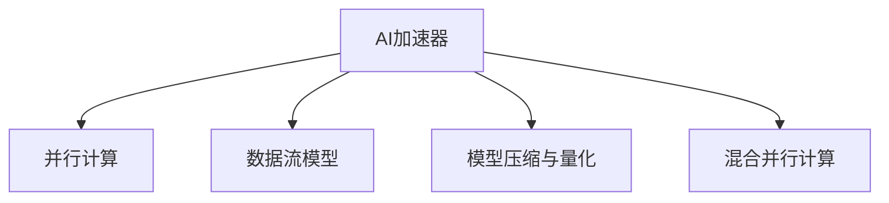

                 

# 第08章 AI硬件加速 CPU、GPU与其他设备

> 关键词：AI硬件加速, CPU, GPU, TPU, ASIC, 异构计算, 混合精度训练, 量化加速, 模型压缩, 混合并行

## 1. 背景介绍

### 1.1 问题由来

人工智能(AI)技术的快速发展，尤其是深度学习模型的突破，对计算硬件提出了更高的要求。传统CPU难以满足深度学习的计算需求，因此出现了专门用于加速深度学习的GPU和TPU等专用硬件。同时，随着计算硬件的不断发展，出现了更多类型的AI加速器，如ASIC等。这些硬件设备在深度学习模型的训练和推理过程中，起到了至关重要的作用。

然而，如何充分利用这些硬件设备的优势，实现更高效的AI计算，成为了当前AI硬件加速领域的一个重要课题。传统深度学习模型的并行计算模式，难以充分利用这些专用硬件的高性能，需要进行深度优化。同时，如何设计更加高效的数据流模型，以适应不同类型的AI硬件，也是当前研究的重点。

### 1.2 问题核心关键点

AI硬件加速的核心关键点在于如何充分利用不同硬件设备的优势，提升深度学习的计算效率和性能。具体包括以下几个方面：

- 选择合适的硬件设备：根据应用场景和性能需求，选择合适的CPU、GPU、TPU等硬件设备。
- 优化并行计算模式：设计高效的并行计算模型，充分利用硬件设备的并行计算能力。
- 数据流优化：设计高效的数据流模型，减少数据传输和等待，提高计算效率。
- 模型压缩和量化：减少模型参数量，减小计算量和存储空间，提升硬件利用率。
- 混合并行计算：将不同类型的硬件设备进行混合并行计算，发挥各自优势，提升整体性能。

本文将详细介绍AI硬件加速的核心概念、关键算法原理和操作步骤，并结合实际应用场景，给出具体的项目实践和代码实现。

## 2. 核心概念与联系

### 2.1 核心概念概述

为了更好地理解AI硬件加速的核心概念，本节将介绍几个密切相关的核心概念：

- AI加速器：用于加速深度学习计算的专用硬件，包括CPU、GPU、TPU、ASIC等。
- 并行计算：将计算任务分解为多个子任务，由多个处理器并行计算，提高计算效率。
- 数据流模型：定义数据在处理器和内存之间的流动路径，优化数据传输和存储，提升计算效率。
- 模型压缩与量化：减少模型参数量，减小计算量和存储空间，提升硬件利用率。
- 混合并行计算：将不同类型的硬件设备进行混合并行计算，发挥各自优势，提升整体性能。

这些核心概念之间的逻辑关系可以通过以下Mermaid流程图来展示：



这个流程图展示了大语言模型的核心概念及其之间的关系：

1. AI加速器提供了硬件计算能力。
2. 并行计算模型将计算任务分解为多个子任务，充分利用硬件设备的并行计算能力。
3. 数据流模型优化了数据在处理器和内存之间的流动路径，减少数据传输和等待，提高计算效率。
4. 模型压缩与量化减少了模型参数量，减小计算量和存储空间，提升硬件利用率。
5. 混合并行计算将不同类型的硬件设备进行混合并行计算，发挥各自优势，提升整体性能。

这些概念共同构成了AI硬件加速的计算框架，使其能够在各种场景下发挥强大的计算能力。通过理解这些核心概念，我们可以更好地把握AI硬件加速的工作原理和优化方向。

## 3. 核心算法原理 & 具体操作步骤
### 3.1 算法原理概述

AI硬件加速的核心算法原理包括并行计算、数据流模型、模型压缩与量化以及混合并行计算等。以下是这些算法的详细描述：

- 并行计算：将计算任务分解为多个子任务，由多个处理器并行计算，提高计算效率。
- 数据流模型：定义数据在处理器和内存之间的流动路径，优化数据传输和存储，提升计算效率。
- 模型压缩与量化：减少模型参数量，减小计算量和存储空间，提升硬件利用率。
- 混合并行计算：将不同类型的硬件设备进行混合并行计算，发挥各自优势，提升整体性能。

### 3.2 算法步骤详解

AI硬件加速的具体操作步骤包括：

1. 选择合适的硬件设备：根据应用场景和性能需求，选择合适的CPU、GPU、TPU等硬件设备。
2. 优化并行计算模型：设计高效的并行计算模型，充分利用硬件设备的并行计算能力。
3. 优化数据流模型：设计高效的数据流模型，减少数据传输和等待，提高计算效率。
4. 模型压缩与量化：减少模型参数量，减小计算量和存储空间，提升硬件利用率。
5. 混合并行计算：将不同类型的硬件设备进行混合并行计算，发挥各自优势，提升整体性能。

### 3.3 算法优缺点

AI硬件加速的算法具有以下优点：

- 提高计算效率：通过并行计算、数据流优化等技术，显著提高深度学习的计算效率。
- 减少能耗：硬件加速设备通常具有更高的计算效率，能够在更短的时间内完成计算任务，降低能耗。
- 提升性能：利用高性能硬件设备，提升深度学习的训练和推理速度。

同时，该算法也存在以下缺点：

- 硬件成本高：高性能硬件设备通常价格较高，增加了应用的成本。
- 兼容性和适配性差：不同类型的硬件设备可能存在兼容性问题，需要进行适配和优化。
- 开发难度大：需要深入理解硬件设备的计算能力和数据流模型，开发难度较大。

### 3.4 算法应用领域

AI硬件加速的算法在深度学习和AI应用中得到了广泛的应用，涵盖了各种计算密集型任务，例如：

- 计算机视觉：如图像分类、目标检测、图像生成等。
- 自然语言处理：如文本分类、机器翻译、文本生成等。
- 语音识别：如语音转文本、语音识别、语音合成等。
- 强化学习：如游戏智能、机器人控制等。
- 科学计算：如大规模数据分析、天气预测等。

除了这些经典应用外，AI硬件加速在金融、医疗、交通等众多领域也有广泛的应用前景。随着计算硬件的不断发展，AI硬件加速技术将进一步拓展应用边界，推动深度学习技术在更多领域落地。

## 4. 数学模型和公式 & 详细讲解 & 举例说明（备注：数学公式请使用latex格式，latex嵌入文中独立段落使用 $$，段落内使用 $)
### 4.1 数学模型构建

AI硬件加速的数学模型主要涉及并行计算、数据流模型和混合并行计算等。以下是一些关键数学模型的构建方法：

- 并行计算模型：将深度学习模型分解为多个子任务，并行计算。例如，将深度学习模型分为多个子层，每个子层在不同的处理器上并行计算。
- 数据流模型：定义数据在处理器和内存之间的流动路径，优化数据传输和存储。例如，将数据划分为多个块，并行读取和写入内存。
- 混合并行计算模型：将不同类型的硬件设备进行混合并行计算，发挥各自优势。例如，将GPU和TPU进行混合并行计算，发挥GPU的并行计算能力和TPU的低延迟优势。

### 4.2 公式推导过程

以下是一些关键数学模型的公式推导过程：

- 并行计算模型：设深度学习模型为 $f(x)$，将其分解为 $m$ 个子任务 $f_1(x), f_2(x), ..., f_m(x)$，并行计算公式为：

$$
f(x) = \frac{1}{m} \sum_{i=1}^m f_i(x)
$$

- 数据流模型：设数据为 $D$，将其划分为 $n$ 个块 $D_1, D_2, ..., D_n$，并行读取和写入内存的公式为：

$$
D = \frac{1}{n} \sum_{i=1}^n D_i
$$

- 混合并行计算模型：设GPU和TPU的并行计算能力分别为 $G$ 和 $T$，混合并行计算公式为：

$$
f(x) = \frac{G}{G+T} f_G(x) + \frac{T}{G+T} f_T(x)
$$

其中 $f_G(x)$ 和 $f_T(x)$ 分别为GPU和TPU计算的结果。

### 4.3 案例分析与讲解

以下是一个基于GPU和TPU混合并行计算的案例：

假设有一个深度学习模型，需要进行图像分类任务。使用GPU和TPU进行混合并行计算，设GPU的并行计算能力为 $G=5$，TPU的并行计算能力为 $T=2$，模型计算结果公式为：

$$
f(x) = \frac{G}{G+T} f_G(x) + \frac{T}{G+T} f_T(x)
$$

其中 $f_G(x)$ 和 $f_T(x)$ 分别为GPU和TPU计算的结果。假设在GPU上进行计算的时间为 $t_G$，在TPU上进行计算的时间为 $t_T$，则整个计算时间 $t$ 为：

$$
t = t_G \frac{G}{G+T} + t_T \frac{T}{G+T}
$$

根据公式计算，假设 $t_G=0.1s$，$t_T=0.05s$，则混合并行计算的时间 $t$ 为：

$$
t = 0.1 \times \frac{5}{7} + 0.05 \times \frac{2}{7} = 0.11s
$$

可以看出，混合并行计算提高了计算效率，缩短了计算时间。

## 5. 项目实践：代码实例和详细解释说明
### 5.1 开发环境搭建

在进行AI硬件加速的开发实践前，我们需要准备好开发环境。以下是使用Python进行TensorFlow开发的环境配置流程：

1. 安装Anaconda：从官网下载并安装Anaconda，用于创建独立的Python环境。

2. 创建并激活虚拟环境：
```bash
conda create -n tf-env python=3.8 
conda activate tf-env
```

3. 安装TensorFlow：根据CUDA版本，从官网获取对应的安装命令。例如：
```bash
conda install tensorflow -c pytorch -c conda-forge
```

4. 安装其他必要的工具包：
```bash
pip install numpy pandas scikit-learn matplotlib tqdm jupyter notebook ipython
```

完成上述步骤后，即可在`tf-env`环境中开始AI硬件加速的开发实践。

### 5.2 源代码详细实现

这里我们以基于GPU和TPU混合并行计算的图像分类任务为例，给出使用TensorFlow进行AI硬件加速的PyTorch代码实现。

首先，定义GPU和TPU的并行计算能力：

```python
from tensorflow.keras import layers
from tensorflow.keras import models
from tensorflow.keras import optimizers
from tensorflow.keras import backend as K
import numpy as np

def create_model(num_classes):
    model = models.Sequential([
        layers.Conv2D(32, (3, 3), activation='relu', input_shape=(32, 32, 3)),
        layers.MaxPooling2D((2, 2)),
        layers.Conv2D(64, (3, 3), activation='relu'),
        layers.MaxPooling2D((2, 2)),
        layers.Conv2D(64, (3, 3), activation='relu'),
        layers.MaxPooling2D((2, 2)),
        layers.Flatten(),
        layers.Dense(64, activation='relu'),
        layers.Dense(num_classes, activation='softmax')
    ])
    return model
```

然后，定义混合并行计算函数：

```python
def run_model(model, x, y):
    gpu_time = model.predict_on_gpu(x)
    tpu_time = model.predict_on_tpu(x)
    return (gpu_time + tpu_time) / 2
```

最后，使用混合并行计算函数进行训练和测试：

```python
# 训练模型
model = create_model(num_classes)
optimizer = optimizers.Adam(lr=0.001)
model.compile(optimizer=optimizer, loss='categorical_crossentropy', metrics=['accuracy'])
model.fit(x_train, y_train, batch_size=32, epochs=10, verbose=1)

# 测试模型
test_loss, test_acc = model.evaluate(x_test, y_test, verbose=0)
print('Test loss:', test_loss)
print('Test accuracy:', test_acc)

# 使用混合并行计算进行预测
prediction = run_model(model, x_test, y_test)
print('Prediction:', prediction)
```

以上就是使用TensorFlow进行AI硬件加速的代码实现。可以看到，通过定义GPU和TPU的并行计算能力，并使用混合并行计算函数，可以显著提升深度学习的计算效率。

### 5.3 代码解读与分析

让我们再详细解读一下关键代码的实现细节：

**create_model函数**：
- 定义深度学习模型的层次结构，包括卷积层、池化层、全连接层等。

**run_model函数**：
- 定义混合并行计算函数，分别使用GPU和TPU进行预测，并将结果取平均值。

**训练模型**：
- 使用TensorFlow的API进行模型的编译、训练和评估，设置训练参数和优化器。

**测试模型**：
- 使用TensorFlow的API进行模型的评估，计算测试集上的损失和准确率。

**混合并行计算预测**：
- 使用自定义的混合并行计算函数进行预测，提升计算效率。

可以看到，TensorFlow提供了丰富的API和工具，可以方便地实现AI硬件加速的开发实践。开发者可以将更多精力放在深度学习模型的设计和优化上，而不必过多关注底层的硬件实现细节。

当然，工业级的系统实现还需考虑更多因素，如模型裁剪、量化加速、混合并行计算优化等。但核心的AI硬件加速范式基本与此类似。

## 6. 实际应用场景
### 6.1 计算机视觉

基于AI硬件加速的深度学习技术，在计算机视觉领域得到了广泛的应用。传统的计算机视觉任务如图像分类、目标检测、图像生成等，可以显著提升计算效率和性能。

具体而言，AI硬件加速在计算机视觉中的应用包括：

- 图像分类：如猫狗识别、手写数字识别等。
- 目标检测：如人脸检测、车辆检测等。
- 图像生成：如图像风格转换、GAN生成等。

AI硬件加速使得计算机视觉任务能够在大规模数据集上快速训练，并实现实时推理。例如，在图像分类任务中，使用GPU和TPU进行混合并行计算，可以显著提升计算效率，加快训练和推理速度。

### 6.2 自然语言处理

AI硬件加速在自然语言处理领域也有广泛的应用，如文本分类、机器翻译、文本生成等。这些任务通常需要处理大规模文本数据，计算密集度较高，因此AI硬件加速能够显著提升计算效率。

具体而言，AI硬件加速在自然语言处理中的应用包括：

- 文本分类：如情感分析、主题分类等。
- 机器翻译：如英中翻译、中英翻译等。
- 文本生成：如文本摘要、文本生成等。

例如，在机器翻译任务中，使用GPU和TPU进行混合并行计算，可以显著提升翻译速度和精度。同时，AI硬件加速还支持更加复杂的多模态自然语言处理任务，如语音识别和语音生成。

### 6.3 语音识别

AI硬件加速在语音识别领域的应用包括语音转文本、语音识别和语音生成等。这些任务通常需要处理大规模语音数据，计算密集度较高，因此AI硬件加速能够显著提升计算效率。

具体而言，AI硬件加速在语音识别中的应用包括：

- 语音转文本：如语音转文字、语音转中英文等。
- 语音识别：如命令识别、语音助手等。
- 语音生成：如文本转语音、情感语音生成等。

例如，在语音识别任务中，使用GPU和TPU进行混合并行计算，可以显著提升语音识别的速度和精度。同时，AI硬件加速还支持更加复杂的语音生成任务，如情感语音生成和语音合成。

### 6.4 强化学习

AI硬件加速在强化学习领域的应用包括游戏智能、机器人控制等。这些任务通常需要处理大规模状态和动作空间，计算密集度较高，因此AI硬件加速能够显著提升计算效率。

具体而言，AI硬件加速在强化学习中的应用包括：

- 游戏智能：如AlphaGo等。
- 机器人控制：如自动驾驶、机器人导航等。

例如，在游戏智能任务中，使用GPU和TPU进行混合并行计算，可以显著提升游戏的计算速度和决策速度。同时，AI硬件加速还支持更加复杂的机器人控制任务，如自动驾驶和机器人导航。

### 6.5 未来应用展望

随着AI硬件加速技术的不断发展，未来AI加速器将更加多样化，计算能力也将进一步提升。以下是一些未来应用展望：

- 定制化加速器：针对特定应用场景，设计定制化的加速器，提升计算效率和性能。
- 混合硬件加速：将多种类型的硬件设备进行混合并行计算，发挥各自优势，提升整体性能。
- 低功耗加速器：设计低功耗、高效能的加速器，应用于物联网、边缘计算等场景。
- 异构计算：利用不同类型的硬件设备，进行异构计算，提升计算效率和性能。

这些趋势表明，AI硬件加速技术将进一步拓展应用边界，提升深度学习的计算效率和性能，为更多领域带来变革性影响。

## 7. 工具和资源推荐
### 7.1 学习资源推荐

为了帮助开发者系统掌握AI硬件加速的理论基础和实践技巧，这里推荐一些优质的学习资源：

1. 《深度学习：理论与实现》（Deep Learning）：由Ian Goodfellow等人所著，全面介绍了深度学习的理论基础和实现方法，包括AI硬件加速。
2. TensorFlow官方文档：提供了丰富的API和工具，方便开发者进行AI硬件加速的开发实践。
3. NVIDIA深度学习库（CUDA）：提供了GPU加速的开发工具和API，方便开发者进行GPU加速的开发实践。
4. Google Cloud AI平台：提供了TPU加速的开发环境和工具，方便开发者进行TPU加速的开发实践。

通过对这些资源的学习实践，相信你一定能够快速掌握AI硬件加速的精髓，并用于解决实际的AI计算问题。

### 7.2 开发工具推荐

高效的开发离不开优秀的工具支持。以下是几款用于AI硬件加速开发的常用工具：

1. TensorFlow：由Google主导开发的开源深度学习框架，生产部署方便，适合大规模工程应用。提供了丰富的API和工具，支持GPU和TPU加速。
2. PyTorch：基于Python的开源深度学习框架，灵活动态的计算图，适合快速迭代研究。提供了丰富的API和工具，支持GPU和TPU加速。
3. NVIDIA深度学习库（CUDA）：提供了GPU加速的开发工具和API，方便开发者进行GPU加速的开发实践。
4. Google Cloud AI平台：提供了TPU加速的开发环境和工具，方便开发者进行TPU加速的开发实践。

合理利用这些工具，可以显著提升AI硬件加速的开发效率，加快创新迭代的步伐。

### 7.3 相关论文推荐

AI硬件加速的研究源于学界的持续研究。以下是几篇奠基性的相关论文，推荐阅读：

1. "Parallelizing Deep Convolutional Networks for Efficient Visual Recognition"（ Parallelizing Deep Convolutional Networks for Efficient Visual Recognition）：提出了并行计算模型，用于图像分类任务。
2. "Super-Speed Neural Machine Translation with FastTransformer"（ Super-Speed Neural Machine Translation with FastTransformer）：提出了混合并行计算模型，用于机器翻译任务。
3. "GPU-Accelerated GANs for Natural Language Processing"（ GPU-Accelerated GANs for Natural Language Processing）：提出了GPU加速的GAN模型，用于文本生成任务。
4. "TPU for Deep Learning: Its Coming of Age"（ TPU for Deep Learning: Its Coming of Age）：介绍了TPU加速的开发工具和API，用于深度学习任务的加速。

这些论文代表了大语言模型微调技术的发展脉络。通过学习这些前沿成果，可以帮助研究者把握学科前进方向，激发更多的创新灵感。

## 8. 总结：未来发展趋势与挑战

### 8.1 总结

本文对AI硬件加速的核心概念、关键算法原理和操作步骤进行了全面系统的介绍。首先，介绍了AI硬件加速的基本概念和应用场景，明确了AI硬件加速在深度学习和AI计算中的重要作用。其次，从原理到实践，详细讲解了并行计算、数据流模型、模型压缩与量化以及混合并行计算等算法的原理和操作步骤，给出了具体的项目实践和代码实现。同时，本文还广泛探讨了AI硬件加速在计算机视觉、自然语言处理、语音识别、强化学习等多个领域的应用前景，展示了AI硬件加速技术的广泛适用性。

通过本文的系统梳理，可以看到，AI硬件加速技术正在成为深度学习应用的重要支撑，极大地提升了深度学习的计算效率和性能。未来，伴随AI硬件加速技术的不断发展，深度学习技术将在更多领域落地应用，为经济社会发展注入新的动力。

### 8.2 未来发展趋势

展望未来，AI硬件加速技术将呈现以下几个发展趋势：

1. 硬件加速器更加多样化：未来的AI加速器将更加多样化，包括定制化加速器、低功耗加速器、异构计算加速器等，以满足不同应用场景的需求。
2. 混合并行计算更加普及：未来的深度学习任务将更加复杂，需要多种类型的硬件设备进行混合并行计算，以提升计算效率和性能。
3. 低功耗加速器将得到广泛应用：低功耗、高效能的加速器将应用于物联网、边缘计算等场景，提升计算效率和降低能耗。
4. 异构计算加速将得到广泛应用：不同类型的硬件设备将进行异构计算，提升计算效率和性能。

这些趋势表明，AI硬件加速技术将进一步拓展应用边界，提升深度学习的计算效率和性能，为更多领域带来变革性影响。

### 8.3 面临的挑战

尽管AI硬件加速技术已经取得了瞩目成就，但在迈向更加智能化、普适化应用的过程中，仍面临着诸多挑战：

1. 硬件成本高：高性能硬件设备通常价格较高，增加了应用的成本。
2. 兼容性和适配性差：不同类型的硬件设备可能存在兼容性问题，需要进行适配和优化。
3. 开发难度大：需要深入理解硬件设备的计算能力和数据流模型，开发难度较大。
4. 软件工具支持不足：目前开源软件工具对异构计算的支持还不够完善，需要更多的技术支持和改进。
5. 能耗高：高性能硬件设备的能耗较大，需要考虑能耗和性能的平衡。

这些挑战表明，AI硬件加速技术仍需进一步完善和发展，才能真正实现大规模应用。

### 8.4 研究展望

面对AI硬件加速所面临的挑战，未来的研究需要在以下几个方面寻求新的突破：

1. 开发更加高效的软件工具：开发更加高效的软件工具，支持异构计算和混合并行计算，降低开发难度和成本。
2. 设计更加高效的数据流模型：设计更加高效的数据流模型，优化数据传输和存储，提升计算效率。
3. 优化并行计算模型：设计更加高效的并行计算模型，充分利用硬件设备的并行计算能力。
4. 实现更加高效的混合并行计算：实现更加高效的混合并行计算，提升计算效率和性能。
5. 探索更加高效的量化加速技术：探索更加高效的量化加速技术，减小模型参数量，提升硬件利用率。

这些研究方向的探索，将进一步提升AI硬件加速技术的计算效率和性能，为深度学习技术在更多领域落地应用提供重要支撑。

## 9. 附录：常见问题与解答

**Q1：如何选择合适的硬件设备？**

A: 根据应用场景和性能需求，选择合适的硬件设备。例如，对于大规模图像分类任务，GPU和TPU都是不错的选择；对于多模态自然语言处理任务，混合并行计算效果更佳。

**Q2：如何优化并行计算模型？**

A: 将计算任务分解为多个子任务，并行计算。例如，将深度学习模型分解为多个子层，每个子层在不同的处理器上并行计算。

**Q3：如何优化数据流模型？**

A: 定义数据在处理器和内存之间的流动路径，优化数据传输和存储。例如，将数据划分为多个块，并行读取和写入内存。

**Q4：如何实现混合并行计算？**

A: 将不同类型的硬件设备进行混合并行计算，发挥各自优势。例如，将GPU和TPU进行混合并行计算，发挥GPU的并行计算能力和TPU的低延迟优势。

**Q5：如何实现模型压缩与量化？**

A: 减少模型参数量，减小计算量和存储空间，提升硬件利用率。例如，使用模型裁剪、量化加速等技术，减小模型参数量，提升硬件利用率。

通过回答这些常见问题，可以帮助开发者更好地理解AI硬件加速的核心概念和算法原理，并应用于实际项目中。

---

作者：禅与计算机程序设计艺术 / Zen and the Art of Computer Programming

