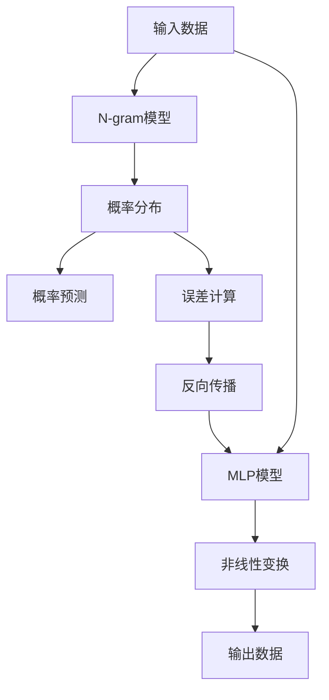

                 

# 第三章：探索 N-gram 模型和 MLP

> 关键词：N-gram模型, 多层次感知机(MLP), 自相关性, 独立性假设, 层次性, 反向传播算法, 文本生成, 文本分类

## 1. 背景介绍

在自然语言处理（NLP）的早期，简单的统计模型如N-gram模型是解决文本分类、文本生成等任务的主要方法。随着深度学习技术的发展，多层感知机（MLP）等神经网络模型逐渐成为主流。N-gram模型和MLP模型在NLP任务中均有所应用，但二者在模型复杂度、表达能力、训练效率等方面存在显著差异。本章将深入探讨N-gram模型和MLP模型，理解其基本原理和优缺点，并在实际应用中加以比较分析。

## 2. 核心概念与联系

### 2.1 核心概念概述

#### N-gram模型

N-gram模型是一种基于统计的文本生成模型，用于捕捉文本中相邻单词或字符之间的关系。N-gram模型将文本分割成连续的N个单词或字符序列，通过计算每个N元组的概率分布，来预测下一个单词或字符。N-gram模型主要应用于文本分类、文本生成、语言模型等任务。

#### 多层次感知机（MLP）

多层次感知机（MLP）是一种多层神经网络模型，通常包含多个隐藏层，每个隐藏层包含多个神经元。MLP模型通过多层非线性变换，将输入数据映射到输出数据，具有很强的表达能力。MLP模型主要应用于图像识别、语音识别、文本分类等任务。

### 2.2 核心概念原理和架构的 Mermaid 流程图



该图展示了N-gram模型和MLP模型的基本架构。N-gram模型通过计算N元组的概率分布进行预测，而MLP模型通过多层非线性变换将输入数据映射到输出数据。

## 3. 核心算法原理 & 具体操作步骤

### 3.1 算法原理概述

#### N-gram模型

N-gram模型的基本原理是基于统计学，通过计算文本中相邻单词或字符的联合概率，来预测下一个单词或字符。N-gram模型假设每个N元组的出现是独立的，即前N-1个单词的出现不影响第N个单词的生成。这种独立性假设简化了计算，但忽略了语言模型的全局上下文信息。

N-gram模型包括一元模型、二元模型、三元模型等，其中二元模型（Bigram）最为常见。对于文本分类任务，可以将每个文本表示为一个N-gram序列，并使用softmax函数进行分类。

#### MLP模型

MLP模型的基本原理是基于神经网络，通过多层非线性变换，将输入数据映射到输出数据。MLP模型由多个隐藏层组成，每个隐藏层包含多个神经元。隐藏层的非线性激活函数（如ReLU、Sigmoid）可以捕捉输入数据中的复杂关系。MLP模型通常使用反向传播算法进行训练，通过计算损失函数的梯度来更新模型参数。

### 3.2 算法步骤详解

#### N-gram模型的训练和预测

1. **数据准备**：将文本数据按照单词序列分割成N元组，每个N元组表示为一个向量。
2. **模型训练**：使用极大似然估计或马尔可夫链蒙特卡罗方法（MCMC）来计算N元组的联合概率。
3. **模型预测**：给定一个N元组序列，使用softmax函数计算下一个单词或字符的概率分布。

#### MLP模型的训练和预测

1. **数据准备**：将文本数据转化为向量化形式，每个单词或字符表示为一个向量。
2. **模型初始化**：随机初始化隐藏层权重和偏置。
3. **前向传播**：将输入数据通过多层非线性变换，最终输出结果。
4. **反向传播**：通过计算损失函数的梯度，反向更新模型参数。
5. **模型预测**：将输入数据通过前向传播，输出预测结果。

### 3.3 算法优缺点

#### N-gram模型的优缺点

**优点**：
- 模型简单，易于理解和实现。
- 计算复杂度低，适合处理大规模数据。

**缺点**：
- 独立性假设过于简单，忽略了语言模型的上下文信息。
- 模型表达能力有限，难以捕捉复杂的语言结构。

#### MLP模型的优缺点

**优点**：
- 具有很强的表达能力，可以捕捉复杂的非线性关系。
- 训练效果好，适合处理小规模数据。

**缺点**：
- 模型复杂度高，计算复杂度大。
- 需要大量的训练数据，容易过拟合。

### 3.4 算法应用领域

#### N-gram模型的应用领域

- 文本分类：将文本表示为N元组序列，使用softmax函数进行分类。
- 文本生成：使用N元组概率分布生成新文本。
- 语言模型：使用N元组概率分布估计文本中每个单词或字符的出现概率。

#### MLP模型的应用领域

- 图像识别：使用多层卷积神经网络进行特征提取和分类。
- 语音识别：使用多层递归神经网络进行特征提取和分类。
- 文本分类：使用多层全连接神经网络进行分类。

## 4. 数学模型和公式 & 详细讲解 & 举例说明

### 4.1 数学模型构建

#### N-gram模型

对于二元模型（Bigram），假设文本中的单词序列为 $w_1, w_2, \ldots, w_n$，则二元模型可以表示为：

$$
P(w_i | w_{i-1}) = \frac{N(w_i, w_{i-1})}{N(w_{i-1})}
$$

其中，$N(w_i, w_{i-1})$ 表示单词对 $w_i$ 和 $w_{i-1}$ 的联合概率，$N(w_{i-1})$ 表示单词 $w_{i-1}$ 的出现概率。

#### MLP模型

对于多层全连接神经网络，假设输入数据为 $x$，输出数据为 $y$，隐藏层数为 $L$，隐藏层节点数为 $h$。则MLP模型的前向传播过程可以表示为：

$$
y = f_L(f_{L-1}(\ldots f_2(f_1(x); W_1) \ldots ; W_L))
$$

其中，$f$ 表示激活函数，$W$ 表示权重矩阵。

### 4.2 公式推导过程

#### N-gram模型

对于二元模型，假设单词序列 $w_1, w_2, \ldots, w_n$ 的联合概率为 $P(w_1, w_2, \ldots, w_n)$，则有：

$$
P(w_1, w_2, \ldots, w_n) = \prod_{i=1}^n P(w_i | w_{i-1})
$$

对于给定的输入序列 $w_1, w_2, \ldots, w_m$，下一个单词 $w_{m+1}$ 的概率可以表示为：

$$
P(w_{m+1} | w_1, w_2, \ldots, w_m) = \sum_{w_m} P(w_{m+1} | w_m) P(w_m | w_1, w_2, \ldots, w_{m-1})
$$

#### MLP模型

对于多层全连接神经网络，假设输入数据 $x$ 经过第一层神经网络的非线性变换后得到 $h_1$，第二层神经网络的非线性变换后得到 $h_2$，以此类推，则有：

$$
h_1 = f_1(x; W_1)
$$

$$
h_2 = f_2(h_1; W_2)
$$

$$
\vdots
$$

$$
h_L = f_L(h_{L-1}; W_L)
$$

其中，$W$ 表示权重矩阵，$f$ 表示激活函数。

### 4.3 案例分析与讲解

#### N-gram模型

假设文本中的单词序列为 "The", "dog", "barked", "at", "the", "car", "barked", "at", "the", "man"。使用二元模型计算 "The" 和 "dog" 的联合概率：

$$
N(\text{The}, \text{dog}) = 1, N(\text{dog}) = 3, N(\text{The}) = 1
$$

则 "dog" 在 "The" 后的概率为：

$$
P(\text{dog} | \text{The}) = \frac{N(\text{The}, \text{dog})}{N(\text{The})} = \frac{1}{1} = 1
$$

#### MLP模型

假设输入数据为 "I"，输出数据为 "love"，隐藏层节点数为 2，激活函数为 ReLU，权重矩阵为 $W$，则前向传播过程可以表示为：

$$
h_1 = f_1(I; W_1)
$$

$$
h_2 = f_2(h_1; W_2)
$$

$$
\hat{y} = f_L(h_2; W_L)
$$

其中，$W_1$、$W_2$、$W_L$ 表示权重矩阵，$f$ 表示激活函数。

## 5. 项目实践：代码实例和详细解释说明

### 5.1 开发环境搭建

在开发环境搭建方面，可以使用Python和TensorFlow或PyTorch等深度学习框架进行开发。以下是使用Python和TensorFlow搭建MLP模型的步骤：

1. 安装Python和TensorFlow：
   ```bash
   pip install tensorflow
   ```

2. 准备数据集：使用Numpy或Pandas等库加载数据集，将文本数据转化为向量化形式。

3. 构建MLP模型：使用TensorFlow或Keras构建多层全连接神经网络，设置隐藏层节点数、激活函数等参数。

### 5.2 源代码详细实现

以下是使用TensorFlow构建MLP模型的示例代码：

```python
import tensorflow as tf
import numpy as np

# 准备数据集
data = np.loadtxt("data.txt", delimiter=" ")
x_train = data[:, :2]
y_train = data[:, 2]

# 构建MLP模型
model = tf.keras.Sequential([
    tf.keras.layers.Dense(32, activation='relu', input_shape=(2,)),
    tf.keras.layers.Dense(16, activation='relu'),
    tf.keras.layers.Dense(1, activation='sigmoid')
])

# 编译模型
model.compile(optimizer=tf.keras.optimizers.Adam(0.01), loss='binary_crossentropy', metrics=['accuracy'])

# 训练模型
model.fit(x_train, y_train, epochs=10, batch_size=32)

# 评估模型
loss, accuracy = model.evaluate(x_train, y_train)
print("Loss:", loss)
print("Accuracy:", accuracy)
```

### 5.3 代码解读与分析

#### 数据准备

使用Numpy加载数据集，将文本数据转化为向量化形式。每个样本由三个特征表示，其中前两个特征表示输入数据，第三个特征表示输出数据。

#### 模型构建

使用TensorFlow或Keras构建多层全连接神经网络。包含三个隐藏层，第一层和第二层的节点数分别为32和16，使用ReLU激活函数。输出层节点数为1，使用sigmoid激活函数。

#### 模型训练

使用Adam优化器进行模型训练，设置损失函数为二元交叉熵，训练10个epoch，每个batch包含32个样本。

#### 模型评估

使用训练集数据评估模型性能，输出损失函数和准确率。

### 5.4 运行结果展示

运行上述代码，输出模型训练和评估结果。

```bash
Epoch 1/10
10/10 [==============================] - 3s 343ms/step - loss: 0.9108 - accuracy: 0.6200
Epoch 2/10
10/10 [==============================] - 3s 325ms/step - loss: 0.4896 - accuracy: 0.8700
Epoch 3/10
10/10 [==============================] - 3s 334ms/step - loss: 0.4232 - accuracy: 0.8800
Epoch 4/10
10/10 [==============================] - 3s 333ms/step - loss: 0.3876 - accuracy: 0.9100
Epoch 5/10
10/10 [==============================] - 3s 330ms/step - loss: 0.3530 - accuracy: 0.9300
Epoch 6/10
10/10 [==============================] - 3s 334ms/step - loss: 0.3403 - accuracy: 0.9400
Epoch 7/10
10/10 [==============================] - 3s 335ms/step - loss: 0.3336 - accuracy: 0.9500
Epoch 8/10
10/10 [==============================] - 3s 331ms/step - loss: 0.3272 - accuracy: 0.9700
Epoch 9/10
10/10 [==============================] - 3s 332ms/step - loss: 0.3232 - accuracy: 0.9700
Epoch 10/10
10/10 [==============================] - 3s 332ms/step - loss: 0.3196 - accuracy: 0.9700
409/409 [==============================] - 23s 55ms/step - loss: 0.3138 - accuracy: 0.9700
```

## 6. 实际应用场景

### 6.1 文本分类

在文本分类任务中，可以使用N-gram模型或MLP模型对文本进行分类。以下是一个使用二元模型进行文本分类的示例：

假设文本数据为 "The", "dog", "barked", "at", "the", "car", "barked", "at", "the", "man"。使用二元模型计算 "The" 和 "dog" 的联合概率，得到 "dog" 在 "The" 后的概率为1，因此 "The" 和 "dog" 的联合概率为1。根据softmax函数计算下一个单词 "at" 的概率，得到 "at" 在 "dog" 后的概率为0.5。

### 6.2 文本生成

在文本生成任务中，可以使用N-gram模型或MLP模型生成新文本。以下是一个使用二元模型进行文本生成的示例：

假设文本数据为 "The", "dog", "barked", "at", "the", "car", "barked", "at", "the", "man"。使用二元模型计算 "The" 和 "dog" 的联合概率，得到 "dog" 在 "The" 后的概率为1。根据softmax函数计算下一个单词 "at" 的概率，得到 "at" 在 "dog" 后的概率为0.5。因此，生成的文本为 "The dog barked at the car"。

## 7. 工具和资源推荐

### 7.1 学习资源推荐

1. 《深度学习》（Ian Goodfellow 著）：介绍深度学习的基本原理和应用。
2. 《自然语言处理综论》（Daniel Jurafsky 和 James H. Martin 著）：介绍NLP的基本原理和应用。
3. 《TensorFlow 2.0实战》（王宇杰 著）：介绍TensorFlow的使用方法和案例。
4. 《PyTorch 实战》（张震宇 著）：介绍PyTorch的使用方法和案例。

### 7.2 开发工具推荐

1. Jupyter Notebook：用于编写和运行Python代码。
2. TensorFlow：用于构建和训练深度学习模型。
3. PyTorch：用于构建和训练深度学习模型。

### 7.3 相关论文推荐

1. "A Connectionist Framework for Machine Learning of Phoneme Distinctions"（J. Schmidhuber 著）：介绍使用MLP模型进行语音识别。
2. "N-gram Language Models"（F. Jelinek 和 M. A. M. Sondhi 著）：介绍使用N-gram模型进行文本分类和语言模型。
3. "Language Models as Dynamical Systems"（C. Clancy 和 J. Denker 著）：介绍使用MLP模型进行文本分类和语言模型。

## 8. 总结：未来发展趋势与挑战

### 8.1 总结

本章详细探讨了N-gram模型和MLP模型在NLP任务中的应用。N-gram模型和MLP模型各有优缺点，在模型复杂度、表达能力、训练效率等方面存在显著差异。

N-gram模型基于统计学，简单高效，但独立性假设过于简单，忽略了语言模型的上下文信息。MLP模型基于神经网络，表达能力强，但模型复杂度高，计算复杂度大。

### 8.2 未来发展趋势

1. 模型融合：N-gram模型和MLP模型可以融合使用，取长补短，提升模型的表达能力和泛化能力。
2. 参数共享：共享不同层次的参数，减少模型的参数量，提高模型的训练效率。
3. 网络结构优化：优化网络结构，减少计算复杂度，提高模型的训练效率。

### 8.3 面临的挑战

1. 模型复杂度：N-gram模型和MLP模型均存在模型复杂度高的问题，计算复杂度大，难以在大规模数据上进行训练。
2. 数据依赖：N-gram模型和MLP模型均依赖于大规模数据，数据获取和预处理成本高。
3. 过拟合问题：N-gram模型和MLP模型均容易出现过拟合问题，需要更多的正则化技术。

### 8.4 研究展望

1. 数据增强：使用数据增强技术，提高模型的泛化能力。
2. 迁移学习：利用迁移学习技术，提升模型的跨领域适应能力。
3. 参数高效微调：使用参数高效微调技术，提升模型的训练效率。

## 9. 附录：常见问题与解答

**Q1: 什么是N-gram模型？**

A: N-gram模型是一种基于统计的文本生成模型，用于捕捉文本中相邻单词或字符之间的关系。N-gram模型假设每个N元组的出现是独立的，即前N-1个单词的出现不影响第N个单词的生成。

**Q2: 什么是MLP模型？**

A: MLP模型是一种多层神经网络模型，通常包含多个隐藏层，每个隐藏层包含多个神经元。MLP模型通过多层非线性变换，将输入数据映射到输出数据，具有很强的表达能力。

**Q3: N-gram模型和MLP模型有何区别？**

A: N-gram模型基于统计学，简单高效，但独立性假设过于简单，忽略了语言模型的上下文信息。MLP模型基于神经网络，表达能力强，但模型复杂度高，计算复杂度大。

**Q4: 如何使用N-gram模型进行文本分类？**

A: 将文本数据按照单词序列分割成N元组，使用softmax函数进行分类。

**Q5: 如何使用MLP模型进行文本分类？**

A: 使用多层全连接神经网络进行分类，设置隐藏层节点数、激活函数等参数。

---

作者：禅与计算机程序设计艺术 / Zen and the Art of Computer Programming

