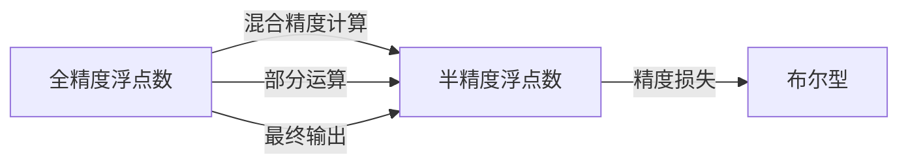

                 

# 第九章：混合精度训练的优势

## 1. 背景介绍

### 1.1 问题由来

随着深度学习模型的规模不断增大，计算精度逐渐成为制约训练效率和硬件资源的主要瓶颈。特别是对于大模型，其参数数量以亿计，即使使用高性能GPU进行训练，仍然面临内存不足和计算速度慢的问题。为了解决这一问题，科学家们提出了混合精度训练（Mixed Precision Training, MPT）的方法。

### 1.2 问题核心关键点

混合精度训练的核心思想是使用较低精度的数据类型（如16位半精度浮点数FP16）进行模型训练，以减少计算和存储的资源需求，同时尽可能保证模型的精度损失最小。具体来说，主要包括以下几个方面：

- **数据类型转换**：将输入数据和模型参数转换为半精度类型，计算过程中使用混合精度，最终结果转换为全精度类型。
- **精度控制**：通过权衡精度和速度，选择合适的数据类型和计算精度，以达到最佳的性能-精度平衡。
- **硬件支持**：混合精度训练需要NVIDIA的Volta及之后的GPU硬件支持，通常使用Tensor Cores进行混合精度计算。

### 1.3 问题研究意义

混合精度训练的提出和应用，显著降低了深度学习模型训练的硬件资源需求，提高了训练效率和模型性能。特别是在大规模模型和分布式训练场景下，混合精度训练的优势更加明显。

## 2. 核心概念与联系

### 2.1 核心概念概述

混合精度训练涉及以下核心概念：

- **全精度（FP32）**：32位浮点数，精度最高，计算量最大，常用于模型输出和关键运算。
- **半精度（FP16）**：16位浮点数，精度适中，计算速度较快，适用于中间层的计算。
- **布尔型（BP）**：1位整数，用于存储模型参数和中间结果，计算速度最快，但精度最低。
- **Tensor Cores**：NVIDIA GPU中的特殊计算单元，用于进行混合精度计算，显著提升计算效率。

这些概念之间的逻辑关系可以通过以下Mermaid流程图来展示：



该流程图展示了混合精度训练的主要流程：

1. 输入数据和模型参数转换为半精度类型。
2. 中间层的计算使用混合精度进行，以提高计算效率。
3. 关键运算和输出结果转换为全精度类型，保证模型精度。

## 3. 核心算法原理 & 具体操作步骤

### 3.1 算法原理概述

混合精度训练通过将模型计算过程分为两部分来实现：

- **前向传播**：使用半精度类型计算中间结果，最终转换为全精度输出。
- **反向传播**：使用全精度类型计算梯度，然后转换为半精度进行参数更新。

这种方法在保证模型精度的情况下，显著降低了计算和存储资源的需求。

### 3.2 算法步骤详解

混合精度训练的具体操作步骤如下：

1. **准备数据和模型**：将输入数据和模型参数转换为半精度类型。
2. **前向传播**：使用半精度类型计算中间结果，最终转换为全精度输出。
3. **反向传播**：使用全精度类型计算梯度，然后转换为半精度进行参数更新。
4. **更新模型参数**：根据半精度梯度更新模型参数。

### 3.3 算法优缺点

混合精度训练的主要优点包括：

- **资源效率高**：使用半精度类型减少了计算和存储的资源需求。
- **训练速度快**：中间层的计算速度加快，整体训练时间缩短。
- **精度损失小**：关键运算和输出结果使用全精度类型，精度损失可控。

缺点则主要包括：

- **硬件依赖**：需要NVIDIA GPU硬件支持，普通GPU无法使用。
- **精度控制复杂**：需要仔细调整数据类型和计算精度，避免精度损失过大。

### 3.4 算法应用领域

混合精度训练广泛应用于各种深度学习模型的训练中，特别是在大规模模型和大规模数据集上。具体应用领域包括：

- **计算机视觉**：如图像分类、目标检测、图像分割等任务。
- **自然语言处理**：如文本分类、机器翻译、对话生成等任务。
- **语音识别**：如自动语音识别、语音合成等任务。
- **推荐系统**：如协同过滤、内容推荐等任务。
- **医疗影像**：如图像诊断、基因分析等任务。

## 4. 数学模型和公式 & 详细讲解

### 4.1 数学模型构建

假设模型输入为 $x$，输出为 $y$，其中 $x$ 和 $y$ 均为全精度类型（FP32）。模型参数 $\theta$ 和中间结果 $z$ 均为半精度类型（FP16）。混合精度训练的数学模型可以表示为：

$$
y = f_\theta(z) \\
z = g_\theta(x)
$$

其中 $f_\theta$ 和 $g_\theta$ 分别表示模型的前向和后向传播过程。

### 4.2 公式推导过程

假设模型的前向传播和后向传播过程均使用半精度类型进行计算，关键输出结果转换为全精度类型。混合精度训练的数学推导如下：

- **前向传播**：

$$
z_{16} = g_\theta(x_{32}) \\
y_{32} = f_\theta(z_{16})
$$

其中 $x_{32}$ 和 $y_{32}$ 为全精度类型，$z_{16}$ 为半精度类型。

- **反向传播**：

$$
\frac{\partial y_{32}}{\partial z_{16}} = \frac{\partial f_\theta(z_{16})}{\partial z_{16}} \\
\frac{\partial z_{16}}{\partial x_{32}} = \frac{\partial g_\theta(x_{32})}{\partial x_{32}}
$$

最终将 $\frac{\partial z_{16}}{\partial x_{32}}$ 转换为半精度类型，用于更新模型参数。

### 4.3 案例分析与讲解

以图像分类任务为例，使用ResNet模型进行混合精度训练。假设输入图像大小为 $224 \times 224$，模型输出的类别数为1000。前向传播过程中，模型使用半精度类型计算中间结果，最终转换为全精度类型进行输出。反向传播过程中，模型使用全精度类型计算梯度，然后转换为半精度类型进行参数更新。

## 5. 项目实践：代码实例和详细解释说明

### 5.1 开发环境搭建

为了进行混合精度训练，需要在PyTorch环境中配置必要的硬件和软件环境：

1. 安装PyTorch和TorchVision库，使用如下命令：

```bash
pip install torch torchvision
```

2. 安装NVIDIA的cuDNN库，使用如下命令：

```bash
conda install cudatoolkit=11.1 -c pytorch -c conda-forge
```

3. 安装NVIDIA的cuDNN库，使用如下命令：

```bash
conda install torch-cudnn-cu11 -c pytorch
```

### 5.2 源代码详细实现

以ResNet模型为例，展示使用混合精度训练的PyTorch代码实现：

```python
import torch
import torch.nn as nn
import torch.optim as optim
import torch.backends.cudnn as cudnn

# 设置混合精度训练
cudnn.benchmark = True
torch.backends.cudnn.enabled = True

# 定义ResNet模型
class ResNet(nn.Module):
    def __init__(self):
        super(ResNet, self).__init__()
        # 省略模型初始化代码
    def forward(self, x):
        # 省略模型前向传播代码
        return x

# 定义损失函数和优化器
criterion = nn.CrossEntropyLoss()
optimizer = optim.SGD(model.parameters(), lr=0.01, momentum=0.9)

# 定义混合精度训练的钩子函数
def mixed_precision_hook(module, grad_input, grad_output):
    if isinstance(grad_output[0], torch.Tensor):
        grad_output = [grad_output[0].to(torch.float32)]
    return grad_output

# 注册混合精度训练的钩子函数
model.register_backward_hook(mixed_precision_hook)

# 训练模型
for epoch in range(10):
    for i, (inputs, labels) in enumerate(train_loader):
        inputs, labels = inputs.to(device), labels.to(device)
        # 前向传播
        outputs = model(inputs)
        loss = criterion(outputs, labels)
        # 反向传播
        optimizer.zero_grad()
        loss.backward()
        optimizer.step()
```

### 5.3 代码解读与分析

上述代码中，我们首先通过设置 `cudnn.benchmark = True` 和 `torch.backends.cudnn.enabled = True` 来开启 cuDNN 优化库，使用 cuDNN 进行混合精度计算。然后定义 ResNet 模型，并注册混合精度训练的钩子函数，以便在反向传播过程中将半精度梯度转换为全精度进行计算。

## 6. 实际应用场景

### 6.1 图像分类

混合精度训练在图像分类任务中的应用非常广泛。以ImageNet数据集为例，使用ResNet模型进行训练，可以显著提高训练效率和模型性能。通过混合精度训练，可以大幅减少计算资源需求，从而在更短的时间内完成模型训练。

### 6.2 自然语言处理

在自然语言处理领域，混合精度训练同样具有重要作用。以BERT模型为例，使用混合精度训练可以大幅缩短模型训练时间，同时保证模型的精度。BERT模型中的自注意力机制和全连接层都可以使用混合精度进行计算，从而提升训练效率。

### 6.3 语音识别

在语音识别任务中，混合精度训练可以加速模型的训练过程。以语音识别系统为例，通过使用混合精度训练，可以显著降低计算资源需求，从而在更短时间内完成模型的训练和优化。

### 6.4 未来应用展望

随着硬件技术的不断进步，混合精度训练的应用范围将进一步扩大。未来，混合精度训练将应用于更多的大型深度学习模型，如GAN、自监督学习模型等，从而进一步提升计算效率和模型性能。

## 7. 工具和资源推荐

### 7.1 学习资源推荐

为了帮助开发者掌握混合精度训练的技术，这里推荐一些优质的学习资源：

1. **PyTorch官方文档**：PyTorch的官方文档提供了详细的混合精度训练指南，包括配置和使用示例。
2. **NVIDIA官方文档**：NVIDIA的官方文档介绍了cuDNN库的使用方法，以及混合精度训练的配置和优化技巧。
3. **《深度学习实践指南》**：这本书详细介绍了深度学习模型的训练和优化技巧，包括混合精度训练的应用。

### 7.2 开发工具推荐

混合精度训练需要依赖高性能的GPU设备，以下是一些常用的开发工具：

1. **NVIDIA GPU**：NVIDIA的GeForce、Quadro、Tesla等高性能GPU设备，适合混合精度训练。
2. **Tensor Cores**：NVIDIA GPU中的Tensor Cores可以显著提升混合精度计算效率。
3. **NVIDIA cuDNN库**：用于加速卷积神经网络的计算，适用于混合精度训练。

### 7.3 相关论文推荐

以下是几篇关于混合精度训练的论文，推荐阅读：

1. **《Mixed Precision Training with Low-Precision Activations》**：介绍了一种混合精度训练方法，使用低精度激活值加速模型训练。
2. **《Mixed Precision Training with Convolutional Neural Networks》**：探讨了卷积神经网络中的混合精度训练方法，并进行了实验验证。
3. **《Mixed Precision Training for Deep Neural Networks》**：综述了混合精度训练在深度神经网络中的应用和效果。

## 8. 总结：未来发展趋势与挑战

### 8.1 总结

本文对混合精度训练的优势进行了全面系统的介绍。首先阐述了混合精度训练的背景和意义，明确了混合精度训练在降低计算资源需求和提升模型性能方面的独特价值。其次，从原理到实践，详细讲解了混合精度训练的数学模型和关键操作步骤，给出了混合精度训练任务开发的完整代码实例。同时，本文还广泛探讨了混合精度训练在图像分类、自然语言处理、语音识别等多个领域的应用前景，展示了混合精度训练的巨大潜力。最后，本文精选了混合精度训练的学习资源，力求为读者提供全方位的技术指引。

通过本文的系统梳理，可以看到，混合精度训练已经成为深度学习模型训练的重要范式，显著降低了模型训练的硬件资源需求，提高了训练效率和模型性能。未来，伴随硬件技术的不断进步和深度学习模型规模的持续增大，混合精度训练必将迎来更广泛的应用，为深度学习技术的进步注入新的动力。

### 8.2 未来发展趋势

展望未来，混合精度训练将呈现以下几个发展趋势：

1. **硬件加速发展**：随着NVIDIA等公司对混合精度计算的支持不断增强，混合精度训练的硬件基础将更加稳固。
2. **模型规模扩大**：未来的大规模模型训练将越来越多地采用混合精度训练，以提升计算效率。
3. **混合精度扩展**：除了卷积神经网络和循环神经网络，混合精度训练将扩展到更多类型的深度学习模型中。
4. **混合精度优化**：更多优化技巧将应用于混合精度训练中，提升计算效率和模型精度。
5. **混合精度自动化**：更多工具和框架将支持自动化的混合精度训练配置和管理。

### 8.3 面临的挑战

尽管混合精度训练已经取得了显著的进展，但在实际应用中仍面临一些挑战：

1. **硬件资源需求**：混合精度训练需要高性能的GPU设备，普通设备难以支持。
2. **精度控制复杂**：选择合适的数据类型和计算精度，避免精度损失，需要深入理解模型结构。
3. **工具和框架支持不足**：目前部分工具和框架对混合精度训练的支持不足，需要开发者自行实现。
4. **兼容性问题**：不同模型和任务之间的混合精度兼容性问题，仍需进一步研究。

### 8.4 研究展望

未来的研究需要在以下几个方面寻求新的突破：

1. **自动化混合精度配置**：开发更多工具和框架，支持自动化的混合精度配置和管理。
2. **混合精度优化算法**：研究混合精度训练的优化算法，提升计算效率和模型精度。
3. **混合精度硬件优化**：优化混合精度计算的硬件架构，提升计算性能。
4. **混合精度理论研究**：进一步研究混合精度训练的理论基础和计算模型。

这些研究方向的探索，必将引领混合精度训练技术迈向更高的台阶，为深度学习模型的训练和优化提供新的解决方案。

## 9. 附录：常见问题与解答

**Q1：什么是混合精度训练？**

A: 混合精度训练是一种深度学习训练技术，通过将模型计算过程分为两个部分来实现：使用较低精度的数据类型（如16位半精度浮点数FP16）进行中间计算，使用较高精度的数据类型（如32位全精度浮点数FP32）进行关键计算。

**Q2：混合精度训练的优势是什么？**

A: 混合精度训练的主要优势包括：
- 资源效率高：使用较低精度的数据类型减少了计算和存储的资源需求。
- 训练速度快：中间层的计算速度加快，整体训练时间缩短。
- 精度损失小：关键运算和输出结果使用较高精度的数据类型，精度损失可控。

**Q3：混合精度训练有哪些注意事项？**

A: 混合精度训练需要注意以下事项：
- 硬件设备：需要高性能的GPU设备，普通设备无法支持。
- 精度控制：选择合适的数据类型和计算精度，避免精度损失过大。
- 工具和框架：部分工具和框架对混合精度训练的支持不足，需要开发者自行实现。

**Q4：混合精度训练的缺点是什么？**

A: 混合精度训练的缺点主要包括：
- 硬件依赖：需要高性能的GPU设备，普通设备难以支持。
- 精度控制复杂：需要仔细调整数据类型和计算精度，避免精度损失过大。

**Q5：混合精度训练的适用范围有哪些？**

A: 混合精度训练适用于各种深度学习模型和任务，特别是在大规模模型和大规模数据集上。具体应用领域包括：
- 计算机视觉：如图像分类、目标检测、图像分割等任务。
- 自然语言处理：如文本分类、机器翻译、对话生成等任务。
- 语音识别：如自动语音识别、语音合成等任务。
- 推荐系统：如协同过滤、内容推荐等任务。
- 医疗影像：如图像诊断、基因分析等任务。

---

作者：禅与计算机程序设计艺术 / Zen and the Art of Computer Programming

