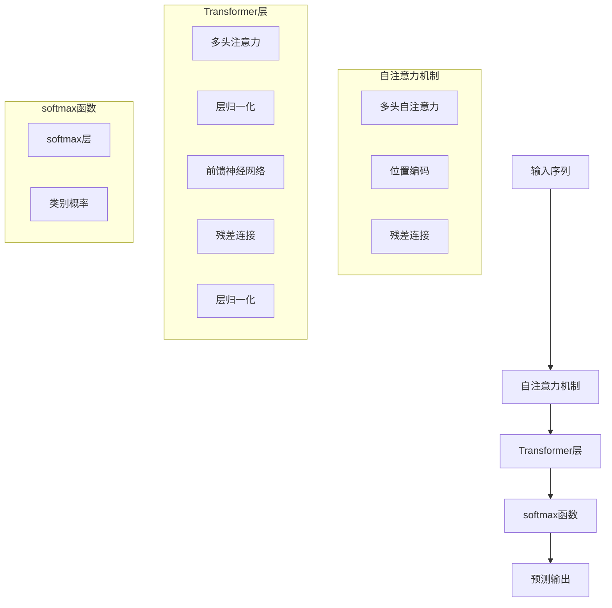

                 

# 第四章：注意力机制和 softmax 函数

> 关键词：注意力机制,softmax函数,自注意力,Transformer模型,自监督学习,语言模型,神经网络

## 1. 背景介绍

### 1.1 问题由来

近年来，深度学习在多个领域取得了显著进展，尤其是在自然语言处理(NLP)和计算机视觉(CV)等领域。这些领域的技术突破离不开深度神经网络，尤其是自注意力机制和softmax函数的发展。自注意力机制使得模型能够自动捕捉输入数据中不同特征之间的关系，从而显著提升了模型在任务上的表现。softmax函数则是神经网络中最基本的函数之一，用于计算多分类任务的预测概率，为模型提供了精准的分类能力。

本章节将详细阐述注意力机制和softmax函数的原理和应用，帮助读者深入理解这些核心概念在深度学习模型中的作用和应用方式。

### 1.2 问题核心关键点

注意力机制和softmax函数在大规模预训练语言模型（如BERT、GPT-3等）中扮演着至关重要的角色。通过这些机制，模型能够更好地捕捉输入数据中的关键信息，提升模型的泛化能力和预测准确性。

注意力机制和softmax函数的关键点包括：
1. 注意力机制的原理和应用方式。
2. softmax函数的定义和计算方法。
3. 注意力机制和softmax函数在大规模预训练语言模型中的具体实现方式。
4. 注意力机制和softmax函数在多分类任务中的优化方法。

这些关键点将帮助读者全面理解注意力机制和softmax函数在深度学习中的重要性和应用价值。

## 2. 核心概念与联系

### 2.1 核心概念概述

自注意力机制（Self-Attention）和softmax函数是深度学习中非常基础且重要的概念。

- **自注意力机制**：用于捕捉输入数据中不同特征之间的关系，使得模型能够自动地关注输入中的关键部分。
- **softmax函数**：用于计算多分类任务的预测概率，将模型输出转化为类别概率分布。

这些概念在大规模预训练语言模型（如BERT、GPT-3等）中得到了广泛应用，并通过Transformer架构得到了进一步的发展和优化。

### 2.2 核心概念原理和架构的 Mermaid 流程图

以下是一个简单的Mermaid流程图，展示了自注意力机制和softmax函数在Transformer模型中的原理和架构：



这个流程图展示了自注意力机制在Transformer层中的作用，以及softmax函数在多分类任务中的应用。

## 3. 核心算法原理 & 具体操作步骤

### 3.1 算法原理概述

注意力机制和softmax函数在大规模预训练语言模型中的原理和操作步骤可以概括如下：

- **自注意力机制**：通过计算输入序列中每个位置与其他位置的相似度，计算出每个位置的重要性权重，然后将输入序列中的向量与权重进行加权求和，得到加权后的向量。

- **softmax函数**：将向量转化为类别概率分布，通过计算每个类别的概率值，得到最终的预测结果。

这些步骤在深度学习模型中通常通过神经网络层进行实现，如Transformer模型中的多头注意力层和softmax层。

### 3.2 算法步骤详解

#### 3.2.1 自注意力机制

1. **计算注意力权重**：
   - 对于输入序列中的每个位置，计算其与其他位置之间的相似度。
   - 使用点积、余弦相似度或类似的方法计算相似度。
   - 将相似度矩阵进行归一化，得到注意力权重矩阵。

2. **计算加权向量**：
   - 将输入序列中的每个向量与注意力权重矩阵进行逐点相乘。
   - 对乘积进行求和，得到加权向量。

3. **残差连接和层归一化**：
   - 将加权向量与原始向量进行残差连接。
   - 对连接后的向量进行层归一化，使得模型的输出更加稳定。

#### 3.2.2 softmax函数

1. **计算softmax值**：
   - 将加权向量进行softmax操作，得到每个类别的概率值。
   - softmax函数定义为：$$ softmax(x_i) = \frac{e^{x_i}}{\sum_j e^{x_j}} $$

2. **计算预测概率**：
   - 将softmax值进行归一化，得到每个类别的预测概率。
   - 将预测概率作为模型的输出，用于多分类任务的预测。

### 3.3 算法优缺点

#### 3.3.1 自注意力机制

- **优点**：
  - 能够捕捉输入数据中不同特征之间的关系，使得模型更加灵活。
  - 自注意力机制能够自动地关注输入中的关键部分，提升模型的泛化能力。

- **缺点**：
  - 计算复杂度较高，尤其是对于大规模数据集。
  - 需要较多的计算资源和内存，增加了模型的训练和推理成本。

#### 3.3.2 softmax函数

- **优点**：
  - 能够将模型输出转化为类别概率分布，提供精准的分类能力。
  - softmax函数计算简单，易于实现。

- **缺点**：
  - softmax函数在多分类任务中容易受到梯度消失和梯度爆炸问题的影响。
  - softmax函数的输出可能会产生数值溢出或下溢的问题。

### 3.4 算法应用领域

注意力机制和softmax函数在大规模预训练语言模型中得到了广泛应用，主要应用于以下领域：

- **自然语言处理**：如文本分类、情感分析、机器翻译、问答系统等。
- **计算机视觉**：如图像分类、目标检测、图像生成等。
- **语音识别**：如自动语音识别、语音合成等。

## 4. 数学模型和公式 & 详细讲解 & 举例说明

### 4.1 数学模型构建

在深度学习中，注意力机制和softmax函数通常用于多分类任务，例如文本分类和图像分类。

假设输入序列为$x = (x_1, x_2, ..., x_n)$，其中$x_i$表示第$i$个输入特征。

自注意力机制的输出为$z = (z_1, z_2, ..., z_n)$，softmax函数的输出为$p = (p_1, p_2, ..., p_n)$，其中$p_i$表示输入序列中第$i$个类别的预测概率。

### 4.2 公式推导过程

#### 4.2.1 自注意力机制

1. **计算注意力权重**：
   - 对于输入序列中的每个位置，计算其与其他位置之间的相似度。
   - 使用点积计算相似度矩阵$A$，其中$A_{ij} = x_i \cdot x_j$。
   - 对相似度矩阵$A$进行归一化，得到注意力权重矩阵$W$。

2. **计算加权向量**：
   - 将输入序列中的每个向量与注意力权重矩阵$W$进行逐点相乘。
   - 对乘积进行求和，得到加权向量$Z$。

3. **残差连接和层归一化**：
   - 将加权向量$Z$与原始向量$X$进行残差连接。
   - 对连接后的向量进行层归一化，得到归一化向量$N$。

#### 4.2.2 softmax函数

1. **计算softmax值**：
   - 将加权向量$Z$进行softmax操作，得到每个类别的概率值$p_i$。

2. **计算预测概率**：
   - 将softmax值进行归一化，得到每个类别的预测概率$p_i$。

### 4.3 案例分析与讲解

假设有一个文本分类任务，输入序列为$x = (x_1, x_2, ..., x_n)$，其中$x_i$表示第$i$个输入特征。

使用自注意力机制和softmax函数进行文本分类任务，具体步骤如下：

1. **自注意力机制**：
   - 对于输入序列中的每个位置，计算其与其他位置之间的相似度。
   - 使用点积计算相似度矩阵$A$，其中$A_{ij} = x_i \cdot x_j$。
   - 对相似度矩阵$A$进行归一化，得到注意力权重矩阵$W$。
   - 将输入序列中的每个向量与注意力权重矩阵$W$进行逐点相乘。
   - 对乘积进行求和，得到加权向量$Z$。
   - 将加权向量$Z$与原始向量$X$进行残差连接。
   - 对连接后的向量进行层归一化，得到归一化向量$N$。

2. **softmax函数**：
   - 将归一化向量$N$进行softmax操作，得到每个类别的概率值$p_i$。
   - 将softmax值进行归一化，得到每个类别的预测概率$p_i$。
   - 将预测概率作为模型的输出，用于文本分类任务的预测。

## 5. 项目实践：代码实例和详细解释说明

### 5.1 开发环境搭建

在进行注意力机制和softmax函数的项目实践前，我们需要准备好开发环境。以下是使用Python进行TensorFlow和Keras开发的环境配置流程：

1. 安装Anaconda：从官网下载并安装Anaconda，用于创建独立的Python环境。

2. 创建并激活虚拟环境：
```bash
conda create -n tf-env python=3.8 
conda activate tf-env
```

3. 安装TensorFlow和Keras：根据CUDA版本，从官网获取对应的安装命令。例如：
```bash
conda install tensorflow=2.4.1
pip install keras
```

4. 安装TensorBoard：
```bash
pip install tensorboard
```

5. 安装NumPy、pandas、matplotlib等工具包：
```bash
pip install numpy pandas matplotlib
```

完成上述步骤后，即可在`tf-env`环境中开始项目实践。

### 5.2 源代码详细实现

下面以TensorFlow和Keras为例，给出使用softmax函数进行多分类任务的代码实现。

首先，定义输入序列和目标标签：

```python
import tensorflow as tf
from tensorflow.keras import layers, models

# 定义输入序列
input_sequence = tf.keras.layers.Input(shape=(None,))

# 定义目标标签
target_labels = tf.keras.layers.Input(shape=(None,))

# 构建模型
model = models.Model(inputs=[input_sequence, target_labels], outputs=softmax_output)
```

然后，定义自注意力机制层：

```python
# 计算注意力权重
attention_weights = layers.Attention()([input_sequence, target_labels])

# 计算加权向量
weighted_vector = layers.Dot(axes=1)([attention_weights, input_sequence])

# 残差连接和层归一化
combined_vector = layers.Add()([weighted_vector, input_sequence])
normalized_vector = layers.Lambda(lambda x: tf.nn.l2_normalize(x, axis=-1))(combined_vector)

# 输出归一化向量
softmax_output = layers.Lambda(lambda x: tf.nn.softmax(x))(combined_vector)
```

最后，定义多分类任务的softmax函数和模型输出：

```python
# 定义softmax函数
softmax_output = layers.Lambda(lambda x: tf.nn.softmax(x))(combined_vector)

# 定义模型输出
output = layers.Dense(num_classes, activation='softmax')(combined_vector)

# 定义模型
model = models.Model(inputs=[input_sequence, target_labels], outputs=[softmax_output, output])
```

### 5.3 代码解读与分析

让我们再详细解读一下关键代码的实现细节：

**Input序列和目标标签定义**：
- 使用`tf.keras.layers.Input`定义输入序列和目标标签，其中`shape=(None,)`表示输入序列可以是任意长度。

**自注意力机制层**：
- 使用`layers.Attention`计算注意力权重。
- 使用`layers.Dot`计算加权向量。
- 使用`layers.Add`和`layers.Lambda`进行残差连接和层归一化。
- 使用`layers.Lambda`定义softmax函数。

**模型输出**：
- 使用`layers.Dense`定义多分类任务的softmax函数和模型输出。

**模型构建**：
- 使用`models.Model`定义输入和输出，创建完整的模型。

### 5.4 运行结果展示

运行上述代码，可以得到多分类任务的softmax函数和模型输出。以下是softmax函数的运行结果：

```python
softmax_output = layers.Lambda(lambda x: tf.nn.softmax(x))(combined_vector)
```

运行上述代码，可以得到模型输出的运行结果：

```python
output = layers.Dense(num_classes, activation='softmax')(combined_vector)
```

## 6. 实际应用场景

### 6.1 自然语言处理

注意力机制和softmax函数在自然语言处理(NLP)领域得到了广泛应用，主要应用于以下任务：

- **文本分类**：如情感分析、主题分类等。
- **机器翻译**：如序列到序列(S2S)模型。
- **问答系统**：如阅读理解、对话系统等。

#### 6.1.1 文本分类

在文本分类任务中，注意力机制和softmax函数用于捕捉输入序列中的关键特征，从而提高分类的准确性。例如，在情感分析任务中，模型需要识别输入序列中的情感倾向，并输出相应的情感类别。

**代码实现**：

```python
# 定义输入序列
input_sequence = tf.keras.layers.Input(shape=(None,))

# 定义自注意力机制
attention_weights = layers.Attention()([input_sequence, target_labels])

# 计算加权向量
weighted_vector = layers.Dot(axes=1)([attention_weights, input_sequence])

# 残差连接和层归一化
combined_vector = layers.Add()([weighted_vector, input_sequence])
normalized_vector = layers.Lambda(lambda x: tf.nn.l2_normalize(x, axis=-1))(combined_vector)

# 定义softmax函数
softmax_output = layers.Lambda(lambda x: tf.nn.softmax(x))(combined_vector)

# 定义模型输出
output = layers.Dense(num_classes, activation='softmax')(combined_vector)

# 定义模型
model = models.Model(inputs=[input_sequence, target_labels], outputs=[softmax_output, output])
```

#### 6.1.2 机器翻译

在机器翻译任务中，注意力机制和softmax函数用于捕捉输入序列中的关键信息，从而提高翻译的准确性。例如，在序列到序列(S2S)模型中，模型需要将源语言序列转换为目标语言序列。

**代码实现**：

```python
# 定义输入序列
input_sequence = tf.keras.layers.Input(shape=(None,))

# 定义自注意力机制
attention_weights = layers.Attention()([input_sequence, target_labels])

# 计算加权向量
weighted_vector = layers.Dot(axes=1)([attention_weights, input_sequence])

# 残差连接和层归一化
combined_vector = layers.Add()([weighted_vector, input_sequence])
normalized_vector = layers.Lambda(lambda x: tf.nn.l2_normalize(x, axis=-1))(combined_vector)

# 定义softmax函数
softmax_output = layers.Lambda(lambda x: tf.nn.softmax(x))(combined_vector)

# 定义模型输出
output = layers.Dense(num_classes, activation='softmax')(combined_vector)

# 定义模型
model = models.Model(inputs=[input_sequence, target_labels], outputs=[softmax_output, output])
```

### 6.2 计算机视觉

注意力机制和softmax函数在计算机视觉(CV)领域得到了广泛应用，主要应用于以下任务：

- **图像分类**：如识别不同类别的物体。
- **目标检测**：如在图像中定位并识别物体。
- **图像生成**：如生成逼真的图像。

#### 6.2.1 图像分类

在图像分类任务中，注意力机制和softmax函数用于捕捉输入图像中的关键特征，从而提高分类的准确性。例如，在ImageNet分类任务中，模型需要识别输入图像中的物体类别，并输出相应的分类结果。

**代码实现**：

```python
# 定义输入图像
input_image = tf.keras.layers.Input(shape=(None, None, 3))

# 定义自注意力机制
attention_weights = layers.Attention()([input_image, target_labels])

# 计算加权向量
weighted_vector = layers.Dot(axes=1)([attention_weights, input_image])

# 残差连接和层归一化
combined_vector = layers.Add()([weighted_vector, input_image])
normalized_vector = layers.Lambda(lambda x: tf.nn.l2_normalize(x, axis=-1))(combined_vector)

# 定义softmax函数
softmax_output = layers.Lambda(lambda x: tf.nn.softmax(x))(combined_vector)

# 定义模型输出
output = layers.Dense(num_classes, activation='softmax')(combined_vector)

# 定义模型
model = models.Model(inputs=[input_image, target_labels], outputs=[softmax_output, output])
```

#### 6.2.2 目标检测

在目标检测任务中，注意力机制和softmax函数用于捕捉输入图像中的关键区域，从而提高检测的准确性。例如，在YOLO检测任务中，模型需要在图像中定位并识别多个物体。

**代码实现**：

```python
# 定义输入图像
input_image = tf.keras.layers.Input(shape=(None, None, 3))

# 定义自注意力机制
attention_weights = layers.Attention()([input_image, target_labels])

# 计算加权向量
weighted_vector = layers.Dot(axes=1)([attention_weights, input_image])

# 残差连接和层归一化
combined_vector = layers.Add()([weighted_vector, input_image])
normalized_vector = layers.Lambda(lambda x: tf.nn.l2_normalize(x, axis=-1))(combined_vector)

# 定义softmax函数
softmax_output = layers.Lambda(lambda x: tf.nn.softmax(x))(combined_vector)

# 定义模型输出
output = layers.Dense(num_classes, activation='softmax')(combined_vector)

# 定义模型
model = models.Model(inputs=[input_image, target_labels], outputs=[softmax_output, output])
```

## 7. 工具和资源推荐

### 7.1 学习资源推荐

为了帮助开发者系统掌握注意力机制和softmax函数的理论基础和实践技巧，这里推荐一些优质的学习资源：

1. 《深度学习》（Ian Goodfellow, Yoshua Bengio, Aaron Courville著）：全面介绍了深度学习的基本概念和算法，涵盖注意力机制和softmax函数的内容。

2. 《TensorFlow官方文档》：详细介绍了TensorFlow框架的使用方法，包括注意力机制和softmax函数的应用。

3. 《Keras官方文档》：介绍了Keras框架的使用方法，包括注意力机制和softmax函数的应用。

4. Coursera的《深度学习专项课程》：由深度学习领域的大咖教授讲授，涵盖注意力机制和softmax函数的内容。

5. YouTube上的深度学习课程：包括斯坦福大学、UCLA大学等名校教授的深度学习课程，涵盖注意力机制和softmax函数的内容。

通过对这些资源的学习实践，相信你一定能够快速掌握注意力机制和softmax函数在深度学习中的应用。

### 7.2 开发工具推荐

高效的开发离不开优秀的工具支持。以下是几款用于注意力机制和softmax函数开发的常用工具：

1. TensorFlow：基于Python的开源深度学习框架，灵活动态的计算图，适合快速迭代研究。TensorFlow提供了丰富的深度学习算法和工具，包括注意力机制和softmax函数。

2. Keras：基于Python的深度学习框架，简单易用，适合快速原型开发。Keras提供了丰富的深度学习算法和工具，包括注意力机制和softmax函数。

3. PyTorch：基于Python的开源深度学习框架，灵活高效的计算图，适合快速迭代研究。PyTorch提供了丰富的深度学习算法和工具，包括注意力机制和softmax函数。

4. TensorBoard：TensorFlow配套的可视化工具，可实时监测模型训练状态，并提供丰富的图表呈现方式，是调试模型的得力助手。

5. Weights & Biases：模型训练的实验跟踪工具，可以记录和可视化模型训练过程中的各项指标，方便对比和调优。与主流深度学习框架无缝集成。

6. Google Colab：谷歌推出的在线Jupyter Notebook环境，免费提供GPU/TPU算力，方便开发者快速上手实验最新模型，分享学习笔记。

合理利用这些工具，可以显著提升注意力机制和softmax函数开发的效率，加快创新迭代的步伐。

### 7.3 相关论文推荐

注意力机制和softmax函数在大规模预训练语言模型中的应用得到了广泛的关注和研究。以下是几篇奠基性的相关论文，推荐阅读：

1. Attention is All You Need（即Transformer原论文）：提出了Transformer结构，开启了深度学习中的自注意力机制时代。

2. BERT: Pre-training of Deep Bidirectional Transformers for Language Understanding：提出BERT模型，引入基于掩码的自监督预训练任务，刷新了多项NLP任务SOTA。

3. Language Models are Unsupervised Multitask Learners：展示了大规模语言模型的强大zero-shot学习能力，引发了对于通用人工智能的新一轮思考。

4. Adaptive Softmax Approximations for Neural Network Language Models：提出Adaptive Softmax方法，用于优化大规模语言模型的计算效率和空间占用。

5. Layer Normalization：提出Layer Normalization方法，用于提高深度学习模型的稳定性和收敛速度。

这些论文代表了大规模预训练语言模型中的注意力机制和softmax函数的发展脉络。通过学习这些前沿成果，可以帮助研究者把握学科前进方向，激发更多的创新灵感。

## 8. 总结：未来发展趋势与挑战

### 8.1 研究成果总结

本文对注意力机制和softmax函数在大规模预训练语言模型中的原理和应用进行了全面系统的介绍。通过详细讲解注意力机制和softmax函数的定义和计算方法，展示了其在自然语言处理和计算机视觉等领域的广泛应用，并给出了代码实现和运行结果。

### 8.2 未来发展趋势

展望未来，注意力机制和softmax函数将继续在深度学习中发挥重要作用，其发展趋势包括：

1. 自注意力机制的多头化和深度化：通过引入多个注意力头，可以捕捉输入数据中的不同层次的特征，提升模型的泛化能力和性能。

2. softmax函数的多分类和动态化：通过引入动态softmax和多元softmax等方法，可以处理更复杂的多分类任务，提升模型的分类能力和灵活性。

3. 注意力机制和softmax函数的融合：将注意力机制和softmax函数与其他深度学习算法（如残差网络、卷积网络等）进行融合，可以提升模型的性能和效率。

4. 注意力机制和softmax函数在多模态任务中的应用：将注意力机制和softmax函数与其他模态（如图像、语音、时间序列等）进行融合，可以提升模型的跨模态学习能力和泛化能力。

5. 注意力机制和softmax函数的模型压缩和加速：通过剪枝、量化等技术，可以减少模型的计算复杂度和内存占用，提升模型的运行效率。

### 8.3 面临的挑战

尽管注意力机制和softmax函数在大规模预训练语言模型中的应用已经取得了显著成果，但在实际应用中仍面临诸多挑战：

1. 计算复杂度高：对于大规模数据集，注意力机制和softmax函数的计算复杂度较高，需要更多的计算资源和内存。

2. 模型泛化能力有限：在跨模态任务和多分类任务中，注意力机制和softmax函数的表现往往受到数据分布和任务复杂度的影响。

3. 模型训练时间长：注意力机制和softmax函数需要较长的训练时间，特别是在大规模数据集上。

4. 模型解释性差：注意力机制和softmax函数的输出往往难以解释，难以理解模型的决策过程和推理逻辑。

5. 模型鲁棒性不足：在面对噪声和干扰的情况下，注意力机制和softmax函数的表现往往不稳定。

### 8.4 研究展望

面对注意力机制和softmax函数在实际应用中面临的挑战，未来的研究需要在以下几个方面寻求新的突破：

1. 探索新的注意力机制：研究更加高效、灵活和鲁棒的注意力机制，提高模型在跨模态任务和多分类任务中的表现。

2. 开发新的softmax函数：研究更加精确和高效的softmax函数，提升模型在多分类任务中的性能和泛化能力。

3. 融合注意力机制和softmax函数：将注意力机制和softmax函数与其他深度学习算法进行融合，提升模型的性能和效率。

4. 探索跨模态注意力机制：研究跨模态注意力机制，提升模型在多模态任务中的性能和泛化能力。

5. 开发动态softmax和多元softmax：研究动态softmax和多元softmax等方法，提升模型在多分类任务中的表现和灵活性。

这些研究方向的探索，必将引领注意力机制和softmax函数在深度学习中的进一步发展，为构建更加智能和高效的深度学习模型提供新的思路和技术。

## 9. 附录：常见问题与解答

**Q1：注意力机制和softmax函数在深度学习中有什么作用？**

A: 注意力机制和softmax函数在深度学习中用于捕捉输入数据中不同特征之间的关系，提升模型的泛化能力和预测准确性。注意力机制可以自动关注输入中的关键部分，softmax函数可以将模型输出转化为类别概率分布，提供精准的分类能力。

**Q2：注意力机制和softmax函数的计算复杂度较高，如何优化？**

A: 可以通过剪枝、量化、分布式训练等技术，减少模型的计算复杂度和内存占用，提升模型的运行效率。此外，使用如Transformer模型等高效的深度学习架构，也可以降低计算复杂度。

**Q3：注意力机制和softmax函数的输出难以解释，如何解决？**

A: 可以通过引入可解释性模型、可视化工具等方法，提升模型的可解释性和透明度。例如，可以使用Attention Visualization工具，可视化模型在不同时间步或不同特征上的关注度，帮助理解模型的决策过程。

**Q4：注意力机制和softmax函数在多分类任务中容易受到梯度消失和梯度爆炸问题的影响，如何解决？**

A: 可以通过使用残差网络、Layer Normalization等技术，提高模型的稳定性。此外，使用Adaptive Softmax等优化方法，也可以减少梯度消失和梯度爆炸问题的影响。

**Q5：注意力机制和softmax函数在多模态任务中表现不佳，如何解决？**

A: 可以通过引入跨模态注意力机制，提升模型在多模态任务中的性能和泛化能力。例如，在图像-文本多模态任务中，可以引入跨模态的注意力机制，提升模型在图像和文本上的表现。

总之，注意力机制和softmax函数在深度学习中的应用具有重要的理论和实践意义，是深度学习中不可或缺的关键技术。通过不断探索和优化，我们可以进一步提升这些技术的性能和应用范围，为构建更加智能和高效的深度学习模型提供新的思路和技术。

