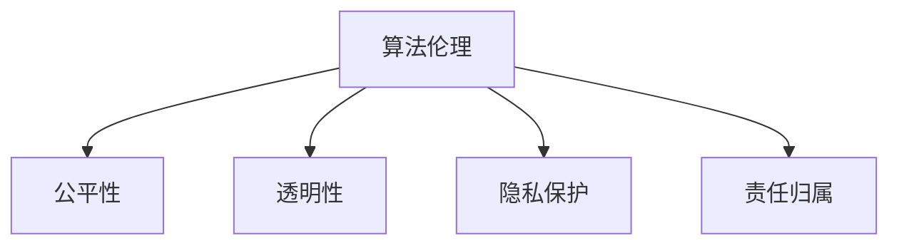

                 

# 算法伦理：构建公平、透明的人工智能

> 关键词：算法伦理, 公平性, 透明性, 人工智能, 模型偏见, 可解释性, 隐私保护

## 1. 背景介绍

### 1.1 问题由来
随着人工智能(AI)技术的快速发展，算法伦理问题逐渐成为社会关注的焦点。AI系统在医疗诊断、金融风险评估、司法决策等领域的应用，对人类生活的影响日益深远。然而，AI系统的决策过程往往缺乏透明度和可解释性，可能导致偏见和歧视，甚至侵害个人隐私。这些问题不仅会损害公众对AI技术的信任，还可能引发法律和道德风险。

### 1.2 问题核心关键点
本节将探讨以下核心问题：
1. 什么是算法伦理？
2. 算法中的主要伦理问题有哪些？
3. 如何构建公平、透明的AI系统？
4. 算法伦理在实践中的挑战和策略。

## 2. 核心概念与联系

### 2.1 核心概念概述

为了更好地理解算法伦理，我们需要先了解一些核心概念：

- **算法伦理**：指在算法设计、开发和应用过程中，遵循伦理准则，确保系统的公平性、透明性、隐私保护和责任归属。

- **公平性(Fairness)**：AI系统应避免对特定群体产生不公平的歧视或偏见。公平性涉及多个层面，包括消除输入数据偏差、设计无偏算法等。

- **透明性(Transparency)**：AI系统的决策过程应具有可解释性，让使用者和监管者能够理解模型如何做出预测。透明性有助于增强公众对AI系统的信任。

- **隐私保护(Privacy Protection)**：AI系统应遵守数据保护法律法规，保护个人隐私，避免数据滥用。

- **责任归属(Accountability)**：明确AI系统在决策中的责任归属，确保对错误决策的问责机制。

这些概念之间的逻辑关系可以通过以下Mermaid流程图来展示：



这个流程图展示了算法伦理的核心组成部分，即公平性、透明性、隐私保护和责任归属。

## 3. 核心算法原理 & 具体操作步骤

### 3.1 算法原理概述

构建公平、透明的AI系统，主要涉及以下算法原理：

- **公平性算法**：通过技术手段，消除数据偏差，确保模型在所有群体中表现一致。

- **透明性算法**：设计可解释的模型，使得决策过程透明，便于监督和审查。

- **隐私保护算法**：采用差分隐私、联邦学习等技术，保护用户隐私，防止数据泄露。

- **责任归属算法**：通过模型可解释性和责任分配机制，明确AI系统在决策中的责任。

### 3.2 算法步骤详解

构建公平、透明的AI系统，通常包括以下几个关键步骤：

**Step 1: 数据预处理**
- 收集数据并清洗，去除或修正明显的偏见或错误。
- 对数据进行标准化，减少不同群体之间的差异。

**Step 2: 模型选择与训练**
- 选择合适的算法，如线性回归、决策树、深度学习等。
- 使用公平性约束或透明性约束训练模型，如公平分类器、可解释模型等。

**Step 3: 评估与测试**
- 在测试集上评估模型的性能，确保在不同群体中表现一致。
- 采用公平性指标（如AUC、召回率、F1分数等）和透明性指标（如LIME、SHAP等）评估模型。

**Step 4: 部署与监控**
- 将模型部署到生产环境，进行实时预测。
- 持续监控模型的运行状态，及时发现和修正偏差。

**Step 5: 审计与反馈**
- 定期进行系统审计，检查公平性和透明性。
- 建立反馈机制，根据用户反馈调整模型。

### 3.3 算法优缺点

**优点**：
- 提升AI系统的公信力和可接受度，增强公众信任。
- 有助于识别和纠正数据偏差，确保模型公平性。
- 增加模型的可解释性，便于监管和审查。

**缺点**：
- 实现过程复杂，需要大量的资源和专业知识。
- 可能会增加算法的计算复杂度，影响性能。
- 需要定期更新和维护，成本较高。

### 3.4 算法应用领域

算法伦理在多个领域具有广泛的应用前景：

- **医疗**：确保诊断和治疗决策的公平性和透明性，保护患者隐私。
- **金融**：避免贷款、信用评分等过程中的偏见，保护消费者权益。
- **司法**：确保判决的公平性，保护嫌疑人隐私。
- **招聘**：避免招聘过程中的歧视，保护求职者权益。
- **教育**：确保教学评估的公平性，保护学生隐私。

## 4. 数学模型和公式 & 详细讲解

### 4.1 数学模型构建

为了更好地理解算法伦理，我们以公平性算法为例，详细讲解其数学模型构建。

假设我们有一个分类问题，其中特征向量 $x$，标签 $y \in \{0, 1\}$。设模型 $f(x; \theta)$ 为决策函数，其中 $\theta$ 为模型参数。我们希望在所有群体中，模型表现一致，即：

$$
P(y=1|x; \theta) = P(y=1|x; \theta) \quad \forall x
$$

为了消除数据偏差，我们可以采用公平性约束。假设群体 $A$ 和 $B$ 的样本分别为 $D_A$ 和 $D_B$，则公平性约束可以表示为：

$$
P(y=1|x; \theta) = P(y=1|x; \theta) \quad \forall x \in D_A \cup D_B
$$

### 4.2 公式推导过程

我们可以通过以下步骤推导公平性约束的优化目标：

1. **数据预处理**：
   - 对数据进行标准化，去除偏差。
   - 假设数据预处理后，群体 $A$ 和 $B$ 的特征向量分别为 $x_A$ 和 $x_B$，模型在群体 $A$ 和 $B$ 上的预测概率分别为 $P_A$ 和 $P_B$。

2. **公平性约束**：
   - 根据公平性约束，我们有 $P_A = P_B$。

3. **优化目标**：
   - 为了最小化模型在群体 $A$ 和 $B$ 上的误差，我们可以定义损失函数 $L$，例如交叉熵损失。
   - 优化目标为：
     $$
     \min_{\theta} L(P_A, P_B) = L(P_A, P_B)
     $$

### 4.3 案例分析与讲解

**案例：贷款信用评分系统**

假设一个贷款信用评分系统，不同种族和性别的申请者获得贷款的概率存在偏差。我们可以使用公平性约束，消除这种偏差。

1. **数据预处理**：
   - 收集历史贷款申请数据，对其进行清洗和标准化。
   - 将数据分为训练集和测试集。

2. **模型选择与训练**：
   - 选择决策树或随机森林作为模型。
   - 使用公平性约束训练模型，确保不同群体中预测概率一致。

3. **评估与测试**：
   - 在测试集上评估模型的公平性和性能。
   - 使用公平性指标（如Demographic Parity、Equalized Odds等）评估模型的公平性。

4. **部署与监控**：
   - 将模型部署到生产环境。
   - 持续监控模型的运行状态，确保公平性。

5. **审计与反馈**：
   - 定期审计模型的公平性。
   - 根据用户反馈调整模型，确保公平性。

## 5. 项目实践：代码实例和详细解释说明

### 5.1 开发环境搭建

在进行公平性算法实践前，我们需要准备好开发环境。以下是使用Python进行Scikit-learn开发的的环境配置流程：

1. 安装Anaconda：从官网下载并安装Anaconda，用于创建独立的Python环境。

2. 创建并激活虚拟环境：
```bash
conda create -n fairness-env python=3.8 
conda activate fairness-env
```

3. 安装Scikit-learn：
```bash
conda install scikit-learn
```

4. 安装必要的库：
```bash
pip install numpy pandas matplotlib scikit-learn imblearn
```

完成上述步骤后，即可在`fairness-env`环境中开始公平性算法的开发。

### 5.2 源代码详细实现

下面以决策树模型为例，给出使用Scikit-learn进行公平性算法开发的Python代码实现。

首先，定义数据集：

```python
import numpy as np
from sklearn.datasets import make_classification
from sklearn.model_selection import train_test_split
from sklearn.tree import DecisionTreeClassifier

# 生成模拟数据
X, y = make_classification(n_samples=1000, n_features=5, n_informative=3, n_redundant=0, random_state=42)
X = (X - np.mean(X, axis=0)) / np.std(X, axis=0)  # 标准化数据
y = np.array([1 if i < 250 else 0 for i in range(len(y))])  # 生成模拟二分类数据

# 拆分数据集
X_train, X_test, y_train, y_test = train_test_split(X, y, test_size=0.3, random_state=42)
```

然后，定义公平性约束：

```python
from sklearn.metrics import pairwise_distances
from sklearn.metrics import fowlkes_mallows_score

def fairness_constraint(X_train, y_train):
    group_1 = X_train[y_train == 0]
    group_2 = X_train[y_train == 1]
    
    # 计算两个群体之间的距离
    distances = pairwise_distances(group_1, group_2, metric='euclidean')
    
    # 计算公平性约束惩罚系数
    lambda_ = 0.5 * np.mean(distances)
    
    # 修改标签，确保两个群体之间的距离一致
    y_train = np.where(distances < lambda_, 1, 0)
    
    return y_train, lambda_
```

接着，定义决策树模型并进行公平性约束训练：

```python
# 应用公平性约束
y_train, lambda_ = fairness_constraint(X_train, y_train)

# 训练决策树模型
clf = DecisionTreeClassifier(max_depth=3)
clf.fit(X_train, y_train)
```

最后，评估模型公平性并进行预测：

```python
# 评估模型公平性
print(fowlkes_mallows_score(y_test, clf.predict(X_test)))

# 在测试集上进行预测
y_pred = clf.predict(X_test)
```

以上就是使用Scikit-learn进行决策树公平性算法开发的完整代码实现。可以看到，公平性约束的实现相对简洁，但实际应用中还需要根据具体任务进行优化调整。

### 5.3 代码解读与分析

让我们再详细解读一下关键代码的实现细节：

**make_classification**函数：
- 生成一个具有两个群体的二分类数据集。

**pairwise_distances**函数：
- 计算两个群体之间的距离，用于评估公平性。

**fowlkes_mallows_score**函数：
- 用于评估模型在两个群体上的公平性。

**y_train, lambda_ = fairness_constraint(X_train, y_train)**：
- 应用公平性约束，修改标签，确保两个群体之间的距离一致。

**clf.fit(X_train, y_train)**：
- 训练决策树模型，确保公平性约束在训练过程中得到满足。

**y_pred = clf.predict(X_test)**：
- 在测试集上进行预测，输出模型的公平性和性能。

可以看到，Scikit-learn的公平性约束模块提供了较为丰富的功能，可以方便地应用于各类公平性算法中。

## 6. 实际应用场景

### 6.1 医疗诊断系统

在医疗诊断系统中，AI模型需要对患者数据进行分类，如预测疾病概率、辅助诊断等。然而，医疗数据往往具有较强的群体差异性，例如不同性别、种族、年龄的患者在疾病的发生率上可能存在显著差异。因此，构建公平、透明的医疗诊断系统尤为重要。

在实践中，可以收集不同群体的医疗数据，设计公平性约束，训练AI模型。通过公平性评估和透明性分析，确保模型在不同群体中表现一致，保护患者隐私。

### 6.2 金融信用评分系统

金融信用评分系统广泛应用于贷款审批、信用卡审核等场景。AI模型需要根据申请人的财务数据、历史行为等进行信用评分，但不同群体（如种族、性别、收入水平）的评分结果可能存在偏差。公平性算法可以帮助消除这些偏差，确保信用评分的公正性。

在实践中，可以收集不同群体的财务数据，应用公平性约束，训练AI模型。通过定期审计和用户反馈，不断优化模型，确保公平性和透明性。

### 6.3 司法判决系统

司法判决系统需要准确判断案件的公正性，确保判决的一致性和公正性。AI模型需要根据案件的证据、事实等进行判决，但不同群体（如种族、性别、经济状况）的判决结果可能存在偏差。公平性算法可以帮助消除这些偏差，确保司法判决的公正性。

在实践中，可以收集不同群体的案件数据，应用公平性约束，训练AI模型。通过透明性分析，确保模型的决策过程可解释，增强公众对系统的信任。

## 7. 工具和资源推荐

### 7.1 学习资源推荐

为了帮助开发者系统掌握公平性算法，这里推荐一些优质的学习资源：

1. **《机器学习伦理与公平性》系列博文**：详细讲解了机器学习中的公平性、透明性和隐私保护，提供了丰富的实践案例。

2. **《公平性机器学习》课程**：斯坦福大学开设的机器学习课程，涵盖公平性算法、隐私保护等内容，适合初学者和进阶学习者。

3. **《可解释机器学习》书籍**：详细介绍了可解释机器学习的方法和实践，包括公平性算法、透明性分析等。

4. ** fairness-indicators 库**：提供了丰富的公平性指标，便于评估和优化公平性算法。

5. **scikit-learn 官方文档**：提供了丰富的公平性约束和评估方法，是公平性算法开发的必备资料。

通过对这些资源的学习实践，相信你一定能够快速掌握公平性算法的精髓，并用于解决实际的AI问题。

### 7.2 开发工具推荐

高效的开发离不开优秀的工具支持。以下是几款用于公平性算法开发的常用工具：

1. **Jupyter Notebook**：交互式编程环境，便于进行数据分析和模型训练。

2. **TensorBoard**：可视化工具，可实时监测模型训练状态，提供丰富的图表呈现方式。

3. **Weights & Biases**：实验跟踪工具，可记录和可视化模型训练过程中的各项指标，方便对比和调优。

4. **PyTorch**：基于Python的深度学习框架，支持动态计算图，适合快速迭代研究。

5. **Keras**：高层次的神经网络API，提供了丰富的模型和层，便于进行模型设计和训练。

6. **OpenAI GPT-3**：预训练语言模型，可用于生成自然语言文本，提升AI系统的自然语言处理能力。

合理利用这些工具，可以显著提升公平性算法的开发效率，加快创新迭代的步伐。

### 7.3 相关论文推荐

公平性算法的研究源于学界的持续研究。以下是几篇奠基性的相关论文，推荐阅读：

1. **The Fairness of Pre-trained Embeddings**：提出使用公平性约束优化预训练模型，确保不同群体中的嵌入向量一致。

2. **Fair Representation for Classifier Systems**：提出使用公平性约束训练分类器，确保不同群体中的分类结果一致。

3. **Towards Explainable and Fair AI**：提出使用可解释性算法和公平性算法，提升AI系统的透明性和公平性。

4. **Advances in Fair Representation**：综述了公平性算法的研究进展，提出了多种公平性约束和优化方法。

5. **Fairness-aware Deep Learning**：详细介绍了公平性算法在深度学习中的应用，包括公平性约束、透明性分析等。

这些论文代表了大语言模型公平性算法的发展脉络。通过学习这些前沿成果，可以帮助研究者把握学科前进方向，激发更多的创新灵感。

## 8. 总结：未来发展趋势与挑战

### 8.1 研究成果总结

本文对公平性算法进行了全面系统的介绍。首先阐述了算法伦理的背景和重要性，明确了公平性、透明性和隐私保护在AI系统中的应用。其次，从原理到实践，详细讲解了公平性算法的数学模型和操作步骤，给出了公平性算法开发的完整代码实例。同时，本文还探讨了公平性算法在医疗、金融、司法等多个领域的应用前景，展示了公平性算法的前景和潜力。

通过本文的系统梳理，可以看到，公平性算法为AI系统提供了重要的伦理保障，确保模型在所有群体中表现一致，增强公众对AI技术的信任。未来，伴随公平性算法的不断发展，AI系统必将更加公平、透明，成为社会各领域的可靠助手。

### 8.2 未来发展趋势

展望未来，公平性算法将呈现以下几个发展趋势：

1. **模型复杂度降低**：通过优化算法和改进模型结构，降低公平性算法的计算复杂度，提高模型性能。

2. **多模态融合**：将公平性算法与其他模态（如图像、语音）融合，提升AI系统的综合能力。

3. **在线学习**：通过在线学习技术，实时更新模型，确保模型始终公平透明。

4. **自适应公平性**：根据数据分布的变化，动态调整公平性约束，确保模型在不同数据分布下表现一致。

5. **隐私保护与公平性相结合**：在保护用户隐私的同时，确保模型的公平性，提升AI系统的可信度。

以上趋势凸显了公平性算法的前景广阔，未来必将有更多前沿技术被引入，推动公平性算法不断进步。

### 8.3 面临的挑战

尽管公平性算法已经取得了一定进展，但在迈向更加智能化、普适化应用的过程中，它仍面临诸多挑战：

1. **数据获取困难**：公平性算法的实施需要大量高质量的数据，但数据获取和标注成本较高，尤其是长尾数据集。如何高效获取数据，减少标注成本，将是未来的一个重要研究方向。

2. **算法复杂度高**：公平性算法的实现需要大量的计算资源和时间，可能影响AI系统的实时性和可扩展性。如何优化算法，提高公平性算法的效率，是未来需要解决的关键问题。

3. **模型可解释性不足**：尽管公平性算法增强了模型的可解释性，但模型的决策过程仍较为复杂，难以全面理解。如何进一步增强模型的可解释性，便于监管和审查，将是未来的一个重要研究方向。

4. **公平性与隐私保护冲突**：在保护用户隐私的同时，如何确保公平性，是一大挑战。如何在保护隐私的前提下，实现公平性约束，是未来需要解决的难题。

5. **多目标优化**：公平性算法需要在多个目标之间进行权衡，如何在保证公平性的同时，兼顾性能和效率，是未来需要解决的重要问题。

6. **跨领域应用**：公平性算法在多个领域具有广泛的应用前景，如何在不同领域中实现公平性约束，是一大挑战。

以上挑战凸显了公平性算法在实践中的复杂性和难度，未来需要更多理论和实践的研究来推动公平性算法的进步。

### 8.4 研究展望

面对公平性算法所面临的挑战，未来的研究需要在以下几个方面寻求新的突破：

1. **自动化数据标注**：开发自动化的数据标注技术，减少人工标注成本，提高数据获取效率。

2. **多目标优化算法**：开发多目标优化算法，在公平性、性能和效率之间进行权衡，实现最佳平衡。

3. **可解释性增强**：引入可解释性技术，如模型可视化和可解释性模型，增强公平性算法的可解释性。

4. **隐私保护技术**：开发隐私保护技术，如差分隐私、联邦学习等，保护用户隐私的同时，确保公平性约束。

5. **跨领域应用**：探索公平性算法在跨领域中的应用，提升公平性算法的通用性和适应性。

6. **公平性算法库**：开发公平性算法库，提供丰富的公平性约束和评估方法，便于开发者快速应用。

这些研究方向将推动公平性算法不断进步，确保AI系统在所有群体中表现一致，增强公众对AI技术的信任。相信通过学界和产业界的共同努力，公平性算法必将迎来更加广阔的发展前景。

## 9. 附录：常见问题与解答

**Q1: 什么是公平性算法？**

A: 公平性算法是指在AI模型的训练和应用过程中，通过技术手段消除数据偏差，确保模型在所有群体中表现一致，从而实现公平性和透明性。

**Q2: 如何设计公平性约束？**

A: 设计公平性约束通常包括以下步骤：
1. 收集数据并清洗，去除或修正明显的偏见或错误。
2. 对数据进行标准化，减少不同群体之间的差异。
3. 根据公平性指标（如Demographic Parity、Equalized Odds等）定义公平性约束。
4. 训练模型时，应用公平性约束，确保模型在不同群体中表现一致。

**Q3: 公平性算法有哪些优缺点？**

A: 优点：
- 提升AI系统的公信力和可接受度，增强公众信任。
- 有助于识别和纠正数据偏差，确保模型公平性。
- 增加模型的可解释性，便于监管和审查。

缺点：
- 实现过程复杂，需要大量的资源和专业知识。
- 可能会增加算法的计算复杂度，影响性能。
- 需要定期更新和维护，成本较高。

**Q4: 公平性算法在实际应用中需要注意哪些问题？**

A: 在实际应用中，需要注意以下问题：
1. 数据获取困难，需要高效获取数据，减少标注成本。
2. 算法复杂度高，需要优化算法，提高公平性算法的效率。
3. 模型可解释性不足，需要引入可解释性技术，增强模型的可解释性。
4. 公平性与隐私保护冲突，需要在保护隐私的前提下，实现公平性约束。
5. 多目标优化，需要在公平性、性能和效率之间进行权衡，实现最佳平衡。

**Q5: 公平性算法如何在多领域中应用？**

A: 公平性算法在多个领域具有广泛的应用前景：
1. 医疗：确保诊断和治疗决策的公平性，保护患者隐私。
2. 金融：避免贷款、信用评分等过程中的偏见，保护消费者权益。
3. 司法：确保判决的公平性，保护嫌疑人隐私。
4. 招聘：避免招聘过程中的歧视，保护求职者权益。
5. 教育：确保教学评估的公平性，保护学生隐私。

通过本文的系统梳理，可以看到，公平性算法为AI系统提供了重要的伦理保障，确保模型在所有群体中表现一致，增强公众对AI技术的信任。未来，伴随公平性算法的不断发展，AI系统必将更加公平、透明，成为社会各领域的可靠助手。总之，公平性算法需要开发者根据具体任务，不断迭代和优化模型、数据和算法，方能得到理想的效果。

---

作者：禅与计算机程序设计艺术 / Zen and the Art of Computer Programming

