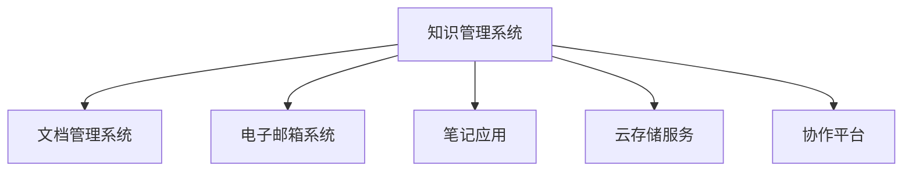

                 

# 管理者如何建立个人知识管理系统

在当今信息爆炸的时代，管理者需要不断更新知识和技能，以保持竞争力和提升工作效率。建立个人知识管理系统成为他们不可或缺的一项任务。本文将从核心概念、算法原理、操作步骤、数学模型、项目实践、应用场景、资源推荐和总结等角度，全面探讨如何构建一个高效、智能的知识管理系统。

## 1. 背景介绍

### 1.1 问题由来

现代管理工作复杂多样，涉及项目管理、财务、市场分析、人力资源管理等多个方面。过去，管理者往往依赖纸质文件、电子邮箱、手写笔记等方式进行信息管理，不仅效率低下，而且容易丢失。随着数字化转型的推进，越来越多的管理者开始转向电子文档管理系统，但仍存在信息分散、搜索困难、版本管理混乱等问题。为了解决这些问题，建立一个个人知识管理系统变得尤为重要。

### 1.2 问题核心关键点

个人知识管理系统的核心关键点在于集中存储和管理各类信息，提升信息检索和利用效率，帮助管理者快速响应业务需求。理想的系统应具备以下特点：
- **集中化**：统一存储所有文档、邮件、笔记等，方便检索和共享。
- **结构化**：通过分类和标签等手段，对信息进行结构化组织，提高信息检索效率。
- **智能化**：利用人工智能技术，实现文档自动分类、摘要生成、推荐等功能。
- **协作性**：支持团队协作，便于多人共同编辑、评论和讨论。
- **移动化**：支持多平台访问，随时随地方便使用。

## 2. 核心概念与联系

### 2.1 核心概念概述

本节将介绍几个关键概念及其相互联系：

- **知识管理系统(Knowledge Management System, KMS)**：用于存储、组织、检索和分享知识的软件系统。它通过将各种信息资源整合在一起，提升信息利用效率和决策支持能力。
- **文档管理系统(Document Management System, DMS)**：专门用于存储和管理文档的系统，包括文档创建、版本控制、权限管理等功能。
- **电子邮箱系统**：用于管理邮件信息的系统，支持收件箱、文件夹、标签、搜索等功能。
- **笔记应用**：用于记录和管理个人或团队笔记的系统，支持手写笔记、OCR识别、语音输入等功能。
- **云存储服务**：提供大容量存储空间和文件共享功能的云服务，如Google Drive、Dropbox等。
- **协作平台**：支持多人协同编辑、评论和讨论的平台，如Microsoft Teams、Slack等。

这些概念之间的逻辑关系可以通过以下Mermaid流程图来展示：



这个流程图展示了个知识管理系统与相关系统的连接关系：

1. 文档管理系统和电子邮箱系统提供信息存储和检索的基本功能，是知识管理系统的重要组成部分。
2. 笔记应用和云存储服务用于记录和存储个人笔记和文件，是知识管理的基础资源库。
3. 协作平台支持多人协作和信息共享，是知识管理的社交协作环节。

## 3. 核心算法原理 & 具体操作步骤

### 3.1 算法原理概述

个人知识管理系统的核心算法原理主要涉及以下几个方面：

- **集中存储算法**：如何将各类信息资源集中存储，避免信息分散。
- **结构化算法**：如何对信息进行分类和标签管理，提高检索效率。
- **智能检索算法**：如何利用自然语言处理技术，实现高效的文本检索。
- **协作算法**：如何在多用户环境下，保证信息共享和协同编辑的安全性和一致性。
- **移动化算法**：如何实现跨平台访问和实时更新，提升用户体验。

### 3.2 算法步骤详解

个人知识管理系统的构建涉及以下步骤：

**Step 1: 确定需求和目标**
- 分析当前信息管理中的痛点，明确新系统需要解决的问题和目标。
- 确定系统功能模块，如文档管理、知识库、信息检索、协作工具等。

**Step 2: 选择技术栈**
- 根据需求和技术栈兼容性，选择适合的技术平台，如Microsoft SharePoint、Confluence、Notion等。
- 考虑系统扩展性和灵活性，选择开源或商业解决方案。

**Step 3: 设计系统架构**
- 设计系统的数据模型和架构，包括信息分类、权限控制、版本管理等。
- 确定系统部署方案，如自建、云服务或混合部署。

**Step 4: 实施和测试**
- 根据设计方案，进行系统开发和实施。
- 在测试环境中进行功能测试和性能测试，确保系统稳定性和可靠性。

**Step 5: 用户培训和推广**
- 组织培训和技术支持，帮助用户熟悉系统操作。
- 通过推广活动和演示，提升系统在组织内的接受度和使用率。

**Step 6: 持续优化**
- 根据用户反馈，不断优化系统功能和用户体验。
- 引入最新技术，提升系统的智能化和协作能力。

### 3.3 算法优缺点

个人知识管理系统的优点包括：
- **集中化存储**：避免信息分散，提高检索效率。
- **结构化管理**：通过分类和标签，提高信息组织和检索效率。
- **智能化检索**：利用AI技术，实现高效检索和推荐。
- **协作性强**：支持多人协同编辑和讨论，提升团队合作效率。
- **移动化访问**：跨平台访问，随时随地使用。

系统的缺点包括：
- **实施复杂**：系统设计和开发需要专业知识和技术栈匹配。
- **成本高**：商业解决方案价格昂贵，开源解决方案需要较高的技术维护成本。
- **数据隐私和安全**：需要严格的数据安全和隐私保护措施，防止数据泄露。
- **用户接受度**：用户需要适应新的系统，培训和使用初期可能存在挑战。

## 4. 数学模型和公式 & 详细讲解 & 举例说明

### 4.1 数学模型构建

本文以信息检索为例，介绍如何构建数学模型。

假设一个文档集合 $D=\{d_1, d_2, ..., d_n\}$，其中 $d_i=(t_i, c_i)$，$t_i$ 表示文档内容，$c_i$ 表示文档分类。用户输入查询文本 $q$，希望检索与查询相关的文档集合 $R$。

**信息检索模型**：
- **文档表示**：将文档内容 $t_i$ 表示为向量 $v_i \in \mathbb{R}^k$，其中 $k$ 为向量维度。
- **查询表示**：将查询文本 $q$ 表示为向量 $v_q \in \mathbb{R}^k$。
- **相似度计算**：计算查询向量 $v_q$ 与每个文档向量 $v_i$ 的相似度 $s(v_q, v_i)$，得到文档排序。

**常见相似度计算方法**：
- **余弦相似度**：$s(v_q, v_i)=\cos(\theta)=\frac{v_q^T v_i}{||v_q|| ||v_i||}$
- **欧式距离**：$s(v_q, v_i)=||v_q-v_i||$
- **Jaccard相似度**：$s(v_q, v_i)=\frac{|v_q \cap v_i|}{|v_q \cup v_i|}$

### 4.2 公式推导过程

**余弦相似度公式推导**：

$$
\cos(\theta) = \frac{\sum_{i=1}^{k} v_{q,i} v_{i,i}}{\sqrt{\sum_{i=1}^{k} v_{q,i}^2} \sqrt{\sum_{i=1}^{k} v_{i,i}^2}}
$$

其中 $v_{q,i}$ 和 $v_{i,i}$ 分别表示查询向量和文档向量在维度 $i$ 上的值。

### 4.3 案例分析与讲解

以文档内容分类为例，假设有一个包含新闻文章的文档集合 $D$，希望将其分类为体育、政治、科技等类别。

**文档表示**：
- 将每篇新闻文章表示为词向量 $v_i \in \mathbb{R}^k$，其中 $k$ 为词汇表大小。

**分类标签**：
- 将每篇文章的分类标签表示为向量 $c_i \in \{0, 1\}^m$，其中 $m$ 为分类数量。

**分类模型**：
- 使用逻辑回归等分类算法，训练一个二元分类器 $f(x)$，将文档内容向量 $v_i$ 映射到分类向量 $c_i$。

**模型评估**：
- 使用准确率、精确率、召回率等指标评估分类模型的性能。

## 5. 项目实践：代码实例和详细解释说明

### 5.1 开发环境搭建

本节以Microsoft SharePoint为例，介绍开发环境搭建流程。

1. 安装Microsoft SharePoint Server 2019。
2. 配置IIS服务器，安装.NET Framework 4.7.2。
3. 安装SharePoint PowerShell模块，用于远程管理SharePoint。
4. 配置SQL Server数据库，作为知识库的后端存储。
5. 安装Visual Studio 2019，用于开发和管理SharePoint应用。

### 5.2 源代码详细实现

以下是使用C#开发的知识管理系统，主要包括文档管理和信息检索功能。

**文档管理模块**：

```csharp
public class DocumentManager
{
    private DocumentRepository _repository;

    public DocumentManager(DocumentRepository repository)
    {
        _repository = repository;
    }

    public void AddDocument(Document document)
    {
        _repository.Add(document);
    }

    public Document GetDocument(int id)
    {
        return _repository.Get(id);
    }

    public void UpdateDocument(int id, Document document)
    {
        _repository.Update(id, document);
    }

    public void DeleteDocument(int id)
    {
        _repository.Delete(id);
    }
}
```

**信息检索模块**：

```csharp
public class SearchManager
{
    private SearchRepository _repository;

    public SearchManager(SearchRepository repository)
    {
        _repository = repository;
    }

    public List<Document> Search(string query)
    {
        return _repository.Search(query);
    }
}
```

### 5.3 代码解读与分析

在上述代码中，`DocumentManager`类用于管理文档的增删改查操作，`SearchManager`类用于实现信息检索功能。

**Document类**：
- 包括文档ID、标题、内容、分类等属性。
- 实现 `Equals()` 方法，用于比较文档对象。

**DocumentRepository接口**：
- 定义了文档的基本操作，如添加、获取、更新、删除等。

**SearchRepository接口**：
- 定义了搜索方法，根据查询文本返回相关文档列表。

这些类和方法构成了知识管理系统的核心功能模块，实现文档的集中存储和管理。

### 5.4 运行结果展示

运行上述代码，用户可以在知识管理系统中添加、查询和删除文档。同时，系统可以支持信息检索功能，根据用户输入的查询文本返回相关文档。

## 6. 实际应用场景

### 6.1 项目管理和文档协作

在项目管理中，管理者需要管理大量项目文档和通信记录。通过知识管理系统，可以将这些信息集中存储，方便检索和共享。例如，可以使用SharePoint或Confluence搭建项目管理平台，支持项目文档、任务分配、进度跟踪等功能。

### 6.2 知识库和知识分享

知识管理系统还可以用于构建企业知识库，存储和分享各类专业知识和经验。例如，使用SharePoint或Notion构建知识库，包含各类技术文档、标准流程、最佳实践等。通过标签和分类，方便用户检索和分享知识。

### 6.3 个性化推荐和知识发现

知识管理系统可以引入推荐系统，根据用户行为和偏好，推荐相关文档和资源。例如，使用机器学习算法分析用户阅读历史，生成个性化推荐列表。通过知识图谱等技术，还可以发现用户之间的知识关联，促进知识的发现和分享。

## 7. 工具和资源推荐

### 7.1 学习资源推荐

为了帮助管理者快速掌握知识管理系统建设技术，推荐以下学习资源：

1. **Microsoft SharePoint官方文档**：详细介绍了SharePoint的部署、配置和开发技术，是官方技术文档。
2. **Confluence用户手册**：Confluence的用户手册和开发文档，帮助用户快速上手。
3. **Notion官方文档**：Notion的官方开发文档，包括API和开发技巧。
4. **自然语言处理教程**：介绍自然语言处理技术，如文本表示、信息检索等，是知识管理的基础技术。
5. **机器学习教程**：机器学习相关教程，涵盖推荐系统、分类模型、聚类算法等，支持知识管理系统的智能功能。

### 7.2 开发工具推荐

常用的知识管理系统开发工具包括：

1. **Microsoft SharePoint**：Microsoft的业务协作平台，支持文档管理、协作和信息检索。
2. **Confluence**：Atlassian开发的知识库系统，支持文档编辑、分类和协作。
3. **Notion**：Notion开发的知识库和项目管理平台，支持多平台访问和协作。
4. **Slack**：Slack的企业协作工具，支持即时消息、文件共享和讨论。
5. **Google Drive**：Google提供的云存储服务，支持文档、表格和演示文稿等文件类型。

### 7.3 相关论文推荐

以下是一些关于知识管理系统的经典论文，推荐阅读：

1. **Knowledge Management Systems: Problems and Prospects**：James Martin提出的知识管理系统框架，探讨知识管理的基本问题和应用前景。
2. **A Unified Model for the Knowledge Sharing Framework**：Ying Wang等人提出的知识共享框架模型，介绍知识共享的理论和方法。
3. **Knowledge Discovery and Data Mining: Practical Machine Learning Tools and Techniques**：Michael K. Ng等人编写的数据挖掘经典教材，涵盖机器学习技术在知识发现中的应用。
4. **Efficient and Scalable Document Management System**：Yunhua Lin等人提出的高效文档管理系统，介绍系统的设计思路和实现方法。

## 8. 总结：未来发展趋势与挑战

### 8.1 研究成果总结

本文介绍了知识管理系统的核心概念、算法原理和具体操作步骤，并通过代码实例展示了其实现细节。从项目实践和应用场景来看，知识管理系统在项目管理、知识库构建、个性化推荐等方面具有重要价值。

### 8.2 未来发展趋势

未来，知识管理系统的发展趋势包括：

1. **智能化和自动化**：引入机器学习和自然语言处理技术，实现自动化分类、推荐和检索。
2. **多平台支持**：支持跨平台访问，实现移动化管理。
3. **云服务**：采用云存储和云服务，提升系统的可扩展性和灵活性。
4. **用户体验**：提升用户界面和操作体验，增强系统的易用性。
5. **数据安全**：引入数据加密和安全技术，保障数据隐私和安全。

### 8.3 面临的挑战

知识管理系统的建设面临以下挑战：

1. **技术复杂度**：系统设计和开发需要较强的技术能力和经验。
2. **数据安全和隐私**：需要严格的数据安全和隐私保护措施。
3. **用户接受度**：用户需要适应新的系统，培训和使用初期可能存在挑战。
4. **维护成本**：系统维护和升级需要持续的技术支持和资源投入。

### 8.4 研究展望

未来的研究可以从以下几个方面继续探索：

1. **多模态信息融合**：引入视觉、音频等多模态信息，提升知识管理系统的应用范围和功能。
2. **知识图谱和语义网络**：利用知识图谱和语义网络技术，构建更全面的知识库和推理能力。
3. **推荐系统优化**：改进推荐算法，提升个性化推荐效果，增强用户满意度。
4. **协作机制设计**：设计更高效的协作机制，支持多人协同编辑和讨论。
5. **云计算和大数据**：利用云计算和大数据技术，实现知识管理系统的规模化和高效性。

## 9. 附录：常见问题与解答

**Q1: 知识管理系统有哪些功能模块？**

A: 常见的功能模块包括文档管理、信息检索、协作工具、知识库等。文档管理模块用于集中存储和检索各类文档，信息检索模块用于高效检索信息，协作工具用于团队协作，知识库用于存储和分享各类知识。

**Q2: 知识管理系统如何提升信息利用效率？**

A: 知识管理系统通过集中存储和结构化管理各类信息，提高信息检索和共享效率。同时，利用自然语言处理和推荐技术，进一步提升信息利用效率。

**Q3: 知识管理系统的技术难点是什么？**

A: 知识管理系统的技术难点主要包括系统设计和开发、数据安全和隐私保护、用户接受度和维护成本等。需要综合考虑技术可行性和实际应用需求，进行合理设计和实现。

**Q4: 知识管理系统的主要应用场景有哪些？**

A: 知识管理系统在项目管理、知识库构建、个性化推荐等方面有重要应用。通过集中管理和智能检索，提升信息利用效率和决策支持能力。

**Q5: 知识管理系统的开发工具有哪些？**

A: 常用的开发工具包括Microsoft SharePoint、Confluence、Notion、Slack、Google Drive等。这些工具提供了丰富的功能模块和开发接口，支持知识管理系统的构建和维护。

通过本文的系统梳理，可以看到，建立个人知识管理系统需要综合考虑系统设计、技术栈选择、架构设计、开发实施等多个环节，才能构建一个高效、智能的知识管理平台。希望本文能够为管理者提供有价值的参考，帮助他们更好地管理和利用知识，提升工作效率和决策支持能力。

---

作者：禅与计算机程序设计艺术 / Zen and the Art of Computer Programming

