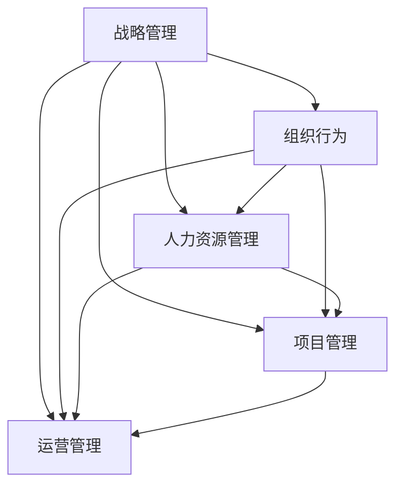

                 

# 管理者如何形成自己的方法论

## 1. 背景介绍

### 1.1 问题由来

管理是一门科学，也是一门艺术。在企业的运营中，管理者需要处理复杂多变的内外部环境，制定战略、优化流程、协调资源、激发团队活力等。然而，由于缺乏系统化的方法论指导，很多管理者在实际操作中往往依赖直觉、经验或模仿他人，难以形成一套符合自身特点和组织实际的方法论体系。

### 1.2 问题核心关键点

本节将介绍几个核心概念，帮助理解管理者形成方法论的逻辑关系：

1. **战略管理(Strategic Management)**：指企业如何制定、实施和评估战略，使企业适应外部环境变化，实现可持续发展。
2. **组织行为(Organizational Behavior)**：研究个体、群体和组织在行为上的规律性，包括动机、激励、沟通、领导等方面。
3. **人力资源管理(Human Resource Management)**：关注如何通过招聘、培训、绩效评估、薪酬福利等手段，吸引、激励和保留优秀人才。
4. **项目管理(Project Management)**：聚焦于如何高效地规划、执行和监控项目，以实现项目目标。
5. **运营管理(Operations Management)**：关注企业生产运作的效率、质量和成本，包括供应链管理、库存控制、质量管理等方面。

这些核心概念相互联系，共同构成了企业管理的框架。管理者通过系统的学习和实践，可以逐步形成一套适合自己的方法论。

### 1.3 问题研究意义

本节将阐明管理者形成方法论的重要性和影响：

1. **提升决策质量**：通过系统化的方法论指导，管理者可以更全面、更客观地分析问题，制定科学合理的决策。
2. **提高执行效率**：方法论提供了一套操作流程和工具，有助于提升团队执行效率，确保任务按时按质完成。
3. **增强团队协作**：良好的方法论体系可以明确团队成员的工作职责和协作方式，促进团队沟通和合作。
4. **促进持续改进**：方法论强调持续优化和改进，帮助企业不断提升管理水平，适应变化。
5. **塑造企业文化**：方法论的实施有助于塑造企业文化，形成统一的价值观和工作习惯。

## 2. 核心概念与联系

### 2.1 核心概念概述

本节将介绍上述核心概念的基本定义和关系：

- **战略管理**：指制定企业的长远发展方向和计划，包括战略规划、战略实施和战略评估。
- **组织行为**：研究个体在组织中的行为模式，包括动机理论、领导风格、团队协作等方面。
- **人力资源管理**：关注员工的招募、选拔、培训、绩效评估等环节，旨在提高员工满意度和生产力。
- **项目管理**：聚焦于项目的规划、执行、监控和收尾，强调时间、成本、质量和资源的控制。
- **运营管理**：涉及企业生产和运营活动的效率、质量和成本控制，包括供应链、生产流程、库存管理等。

这些概念间的关系可以通过以下Mermaid流程图来展示：



这个流程图展示了一些关键概念的相互关系：

1. 战略管理是企业管理的顶层设计，对组织行为、人力资源、项目管理和运营管理都有指导作用。
2. 组织行为和人力资源管理聚焦于人员层面，为项目管理提供人才支持。
3. 项目管理贯穿战略实施和运营流程，确保任务目标的实现。
4. 运营管理关注具体运作，保障企业生产效率和质量。

## 3. 核心算法原理 & 具体操作步骤
### 3.1 算法原理概述

管理者形成自己的方法论，本质上是一个学习、实践和迭代的过程。核心思想是：通过系统化的学习和实践，逐步构建和完善一套适合自身特点和组织实际的管理方法论。

具体来说，管理者需要：

1. **系统学习管理理论**：从管理学的经典书籍、论文和课程中获取基础知识。
2. **深入实践管理方法**：在实际工作中应用所学知识，不断调整和优化方法论。
3. **持续迭代反馈**：通过反思和总结，不断优化方法论，形成一套动态更新的体系。

### 3.2 算法步骤详解

管理者形成自己的方法论，可以遵循以下步骤：

**Step 1: 系统学习管理理论**

- 阅读经典管理书籍，如《管理的实践》、《第五项修炼》、《精益思想》等。
- 参加管理培训课程，如MBA、EMBA、高级管理课程等。
- 关注最新管理理论和研究动态，订阅管理期刊、网站和播客等。

**Step 2: 深入实践管理方法**

- 在实际工作中应用所学知识，如制定战略计划、优化运营流程、提高团队协作等。
- 设立KPI和指标，监控和评估管理方法的效果。
- 调整和优化方法论，根据实际效果进行反馈修正。

**Step 3: 持续迭代反馈**

- 定期进行自我反思，总结经验和教训，形成书面报告或案例分析。
- 设立管理团队定期讨论机制，分享成功案例和失败教训。
- 引入外部专家进行咨询和指导，吸收先进的管理经验和理念。

### 3.3 算法优缺点

管理者形成自己的方法论，具有以下优点：

1. **系统性**：通过系统化的学习和实践，形成一套完整的管理方法论体系。
2. **可操作性**：方法论经过实际验证，具备较强的可操作性，能够指导具体管理活动。
3. **灵活性**：可以根据组织特点和实际需求，灵活调整和优化方法论。
4. **可复制性**：一旦形成一套成功的方法论，可以在其他项目或团队中推广应用。

同时，该方法也存在以下局限性：

1. **时间和精力投入较大**：系统学习理论和深入实践方法论需要较长时间和大量精力。
2. **对个人能力要求高**：管理者需要具备较强的学习能力和反思能力，才能不断优化方法论。
3. **需要外部支持**：方法论的形成需要外部专家的指导和支持，以避免陷入局部最优解。

### 3.4 算法应用领域

管理者形成的方法论，在企业管理中有着广泛的应用，例如：

- **战略管理**：通过系统化方法论，制定科学合理的战略规划和实施路径。
- **组织行为**：通过研究个体和团队行为，优化组织结构和领导风格，提升团队协作效率。
- **人力资源管理**：通过系统化方法论，提高员工招聘、培训和绩效评估的科学性。
- **项目管理**：通过方法论，优化项目管理流程，确保项目按时按质完成。
- **运营管理**：通过系统化方法论，提升生产效率和质量，优化供应链和库存管理。

此外，管理者形成的方法论也可以应用于其他领域，如公共管理、教育管理等，帮助提升公共服务和教育质量。

## 4. 数学模型和公式 & 详细讲解 & 举例说明
### 4.1 数学模型构建

本节将使用数学语言对管理者形成方法论的过程进行严格描述。

假设管理者在t时间点的管理方法论为 $M_t$，其效果评估指标为 $K$。则管理者形成方法论的过程可以表示为：

$$
M_{t+1} = M_t + \delta M_t
$$

其中 $\delta M_t$ 为管理方法论的更新量，包括学习、实践和反馈修正。$K$ 的效果指标可以表示为：

$$
K = f(M_t, E_t, C_t)
$$

其中 $E_t$ 为外部环境因素，$C_t$ 为内部资源和能力因素。

### 4.2 公式推导过程

以项目管理为例，管理者形成方法论的过程可以推导如下：

- **学习阶段**：管理者通过系统学习项目管理理论，获取知识 $K_{learn}$。
- **实践阶段**：在实际项目管理中应用 $K_{learn}$，获取实践经验 $E_{pract}$。
- **反馈修正**：管理者根据实践效果 $E_{pract}$ 和外部环境 $E_{ext}$，进行反馈修正 $K_{feedback}$。
- **更新方法论**：管理者将 $K_{learn}$、$E_{pract}$ 和 $K_{feedback}$ 进行整合，更新方法论 $M_{t+1}$。

具体推导如下：

$$
E_{pract} = g(K_{learn}, E_{ext}, C_{pract})
$$

$$
K_{feedback} = h(E_{pract}, E_{ext}, C_{pract}, C_{feedback})
$$

$$
M_{t+1} = M_t + \delta M_t = M_t + (K_{learn} \cdot \alpha + E_{pract} \cdot \beta + K_{feedback} \cdot \gamma)
$$

其中 $\alpha$、$\beta$、$\gamma$ 为不同因素的权重系数。

### 4.3 案例分析与讲解

以某制造企业的运营管理为例，管理者形成方法论的过程如下：

1. **学习阶段**：管理者阅读《精益思想》，理解精益管理的核心原则和方法。
2. **实践阶段**：在生产线上应用精益管理，优化流程，减少浪费，提高效率。
3. **反馈修正**：根据精益实施效果和市场变化，管理者进行反馈调整，优化供应链和库存管理。
4. **更新方法论**：整合精益理论、实践经验和反馈修正，形成新的运营管理方法论。

通过不断学习、实践和反馈，管理者能够逐步形成一套科学的运营管理方法论，提升企业运营效率和竞争力。

## 5. 项目实践：代码实例和详细解释说明
### 5.1 开发环境搭建

在进行方法论实践前，我们需要准备好开发环境。以下是使用Python进行数据分析和可视化的环境配置流程：

1. 安装Anaconda：从官网下载并安装Anaconda，用于创建独立的Python环境。

2. 创建并激活虚拟环境：
```bash
conda create -n management-env python=3.8 
conda activate management-env
```

3. 安装Python库：
```bash
conda install numpy pandas matplotlib seaborn jupyter notebook
```

4. 安装数据处理库：
```bash
pip install pyodbc
```

完成上述步骤后，即可在`management-env`环境中开始方法论实践。

### 5.2 源代码详细实现

下面我们以项目管理为例，给出使用Python进行项目管理方法论优化的代码实现。

首先，定义项目管理效果评估指标：

```python
from collections import namedtuple

Project = namedtuple('Project', ['name', 'start_date', 'end_date', 'budget', 'resources'])

def calculate_project_kpi(project):
    """计算项目管理效果指标"""
    start_date = project.start_date
    end_date = project.end_date
    budget = project.budget
    resources = project.resources
    
    # 计算进度偏差
    progress = (end_date - start_date) / (end_date - start_date) * 100
    # 计算成本偏差
    cost = (budget / resources) * (end_date - start_date) / (end_date - start_date)
    # 计算质量指标
    quality = sum(project.quality_data) / len(project.quality_data)
    
    return progress, cost, quality
```

然后，定义项目管理方法论的更新过程：

```python
def update_management_methodology(project, kpi_threshold=80, feedback_coefficient=0.5):
    """更新项目管理方法论"""
    progress, cost, quality = calculate_project_kpi(project)
    
    if progress < kpi_threshold:
        update_strategy = 'Improve Scheduling'
        update_amount = progress * feedback_coefficient
    elif cost > kpi_threshold:
        update_strategy = 'Optimize Resources'
        update_amount = cost * feedback_coefficient
    else:
        update_strategy = 'Enhance Quality'
        update_amount = quality * feedback_coefficient
    
    return update_strategy, update_amount
```

最后，启动项目管理流程：

```python
from random import randint

projects = [Project('Project A', randint(1, 12, 4), randint(1, 12, 4), randint(1, 10), randint(1, 10))
            for _ in range(5)]

for project in projects:
    update_strategy, update_amount = update_management_methodology(project)
    print(f'Project {project.name}: {update_strategy}, update amount: {update_amount:.2f}')
```

以上就是使用Python进行项目管理方法论优化的完整代码实现。可以看到，通过定义具体的评估指标和更新策略，管理者可以系统地优化项目管理方法论。

### 5.3 代码解读与分析

让我们再详细解读一下关键代码的实现细节：

**Project类**：
- 定义了项目的属性，包括项目名称、开始日期、结束日期、预算和资源。

**calculate_project_kpi函数**：
- 计算项目在进度、成本和质量三个指标上的评估值。

**update_management_methodology函数**：
- 根据项目在进度、成本和质量指标上的表现，决定是否需要调整方法论，以及如何调整。

**项目管理流程**：
- 随机生成5个项目，分别计算并输出其更新策略和更新幅度。

这些代码实现展示了管理者通过系统化的数据分析和反馈机制，动态更新项目管理方法论的思路和方法。在实际应用中，还需要根据具体项目的需求，灵活调整和优化评估指标和方法论更新策略。

## 6. 实际应用场景
### 6.1 智能制造

基于项目管理方法论的智能制造，可以显著提升生产效率和质量。智能制造系统通过集成项目管理工具、物联网设备和数据分析平台，实现生产过程的实时监控和优化。

在技术实现上，可以收集生产设备的状态数据和操作日志，使用项目管理方法论进行过程监控和效果评估，动态调整生产计划和资源配置，以适应不同的生产需求。

### 6.2 供应链管理

项目管理方法论在供应链管理中也有着广泛的应用。传统的供应链管理依赖大量人工干预和手工记录，效率低下，误差率高。通过引入项目管理工具和方法论，可以实现供应链的自动化和智能化管理。

具体而言，可以通过项目管理软件记录供应链各个环节的任务、进度和成本数据，定期进行效果评估和反馈修正，优化供应链流程，提升物流效率和资源利用率。

### 6.3 项目风险管理

项目管理方法论还可以应用于项目风险管理。项目风险管理是指识别、评估和控制项目中的潜在风险，以保障项目顺利进行。

通过项目管理方法论，可以构建项目风险管理框架，定期进行风险识别和评估，制定相应的风险应对策略。项目团队可以定期召开风险评估会议，结合项目管理效果指标，动态调整风险管理措施，确保项目顺利进行。

### 6.4 未来应用展望

伴随项目管理方法论的持续演进，基于方法论的智能制造、供应链管理和项目风险管理等应用场景将不断拓展，推动企业运营向更高层次发展。

未来，项目管理方法论将与人工智能、大数据、物联网等技术深度融合，实现更为智能化的项目管理。例如，通过数据分析平台实时监控项目进度和资源使用情况，自动调整生产计划和资源配置，优化供应链流程，提升项目执行效率。

## 7. 工具和资源推荐
### 7.1 学习资源推荐

为了帮助管理者系统掌握项目管理方法论的理论基础和实践技巧，这里推荐一些优质的学习资源：

1. **经典项目管理书籍**：如《PMBOK指南》、《项目管理知识体系指南》等，提供了系统化的项目管理知识体系和方法论。

2. **项目管理培训课程**：如PMP认证、Prince2认证、PRINCE2基础课程等，帮助管理者系统学习和实践项目管理。

3. **项目管理工具和平台**：如Microsoft Project、Asana、Jira等，提供项目管理软件和平台，帮助管理者高效管理项目。

4. **项目管理社区和论坛**：如ProjectManagement.com、PMI.org等，提供项目管理从业者的交流平台，分享经验和案例。

通过对这些资源的学习实践，相信管理者一定能够快速掌握项目管理方法论的精髓，并用于解决实际的管理问题。

### 7.2 开发工具推荐

高效的开发离不开优秀的工具支持。以下是几款用于项目管理方法论开发的常用工具：

1. **Python和R语言**：数据处理和分析的重要工具，适合进行项目管理数据的处理和可视化。

2. **Excel和Tableau**：数据可视化的经典工具，方便进行项目管理数据的分析和展示。

3. **Jira和Asana**：项目管理软件，支持任务分配、进度监控和效果评估，适合项目管理团队的协作。

4. **Gantt Chart工具**：如Microsoft Project、GanttProject等，帮助管理者绘制项目进度甘特图，可视化项目执行情况。

5. **数据分析平台**：如SAS、RapidMiner等，支持数据分析和模型建立，适合进行项目管理数据的多维分析和预测。

合理利用这些工具，可以显著提升项目管理方法论的开发效率，加快创新迭代的步伐。

### 7.3 相关论文推荐

项目管理方法论的研究源于学界的持续研究。以下是几篇奠基性的相关论文，推荐阅读：

1. **Project Management Institute (PMI)的指南**：提供系统化的项目管理知识体系和方法论。

2. **PRINCE2项目管理方法论**：介绍PRINCE2方法论的核心理念和实践操作。

3. **Agile项目管理方法论**：介绍敏捷项目管理的核心思想和方法。

4. **精益管理与项目管理**：讨论精益管理与项目管理的融合，提升项目管理效率。

5. **风险管理与项目管理**：探讨风险管理与项目管理的结合，保障项目顺利进行。

这些论文代表了大项目管理方法论的发展脉络。通过学习这些前沿成果，可以帮助管理者把握学科前进方向，激发更多的创新灵感。

## 8. 总结：未来发展趋势与挑战
### 8.1 总结

本文对管理者形成自己的方法论进行了全面系统的介绍。首先阐述了方法论在管理中的重要性，明确了管理者形成方法论的逻辑关系和步骤。其次，从原理到实践，详细讲解了项目管理方法论的数学模型和具体步骤。最后，通过项目实践和实际应用场景，展示了项目管理方法论的广泛应用。

通过本文的系统梳理，可以看到，管理者形成方法论是一个系统化的学习和实践过程，需要不断迭代和优化。管理者通过系统化的学习和实践，逐步形成一套适合自己的管理方法论，提升决策质量、执行效率和团队协作，形成动态更新的体系。

### 8.2 未来发展趋势

展望未来，项目管理方法论将呈现以下几个发展趋势：

1. **与人工智能融合**：结合人工智能技术，实现更加智能化、自动化的项目管理，提升项目执行效率和质量。

2. **跨学科整合**：结合心理学、社会学、经济学等学科知识，构建更加全面、系统的项目管理方法论。

3. **多项目协同**：通过项目管理平台实现多项目协同管理，提升资源利用率和项目管理效率。

4. **全球化应用**：随着企业国际化步伐加快，项目管理方法论将在全球范围内推广应用，提升国际竞争力。

5. **可持续发展**：结合可持续发展理念，构建绿色、环保、高效的项目管理方法论，推动企业可持续发展。

以上趋势凸显了项目管理方法论的发展方向，有助于管理者应对复杂多变的管理环境，实现企业高效运营。

### 8.3 面临的挑战

尽管项目管理方法论已经取得了一定的成就，但在迈向更加智能化、普适化应用的过程中，它仍面临诸多挑战：

1. **数据质量问题**：项目管理方法论依赖大量数据支持，数据质量差将影响方法论的效果。

2. **组织文化差异**：不同组织文化和团队特点，可能导致项目管理方法论难以推广应用。

3. **技术和工具更新**：项目管理工具和方法论需要不断更新，以适应技术发展和应用需求。

4. **人才短缺问题**：具备系统化管理思维和方法论的优秀人才稀缺，制约方法论的推广和实施。

5. **跨部门协作难度**：跨部门协作是项目管理的重要环节，但不同部门间的协同机制和沟通方式仍需改进。

6. **风险管理挑战**：项目管理方法论在应对复杂项目风险时，仍需不断优化和调整。

正视项目管理方法论面临的这些挑战，积极应对并寻求突破，将是大项目管理方法论走向成熟的必由之路。相信随着学界和产业界的共同努力，这些挑战终将一一被克服，项目管理方法论必将在构建人机协同的智能时代中扮演越来越重要的角色。

### 8.4 研究展望

面向未来，项目管理方法论的研究还需要在以下几个方面寻求新的突破：

1. **跨学科融合研究**：结合不同学科的知识和方法，构建更为系统全面的项目管理方法论。

2. **人工智能和大数据应用**：通过大数据和人工智能技术，实现更加智能化、自动化的项目管理。

3. **企业定制化研究**：研究如何针对不同企业特点，定制化项目管理方法论，提升其适用性。

4. **全球化应用研究**：研究项目管理方法论在全球范围内的推广和应用，提升企业的国际竞争力。

5. **可持续发展研究**：结合可持续发展理念，研究如何构建绿色、环保、高效的项目管理方法论。

这些研究方向将推动项目管理方法论的发展，为管理者的实际应用提供更多科学依据和方法支持。总之，项目管理方法论的研究和应用需要不断创新和突破，才能更好地适应复杂的现代管理环境。

## 9. 附录：常见问题与解答

**Q1：项目管理方法论是否适用于所有类型的项目？**

A: 项目管理方法论在大多数项目上都能取得不错的效果，特别是对于规范性、结构性较强的大型项目。但对于创新性强、变化多端的项目，如创业项目、科研项目等，可能需要灵活调整和优化方法论。

**Q2：如何选择合适的项目管理工具和方法论？**

A: 选择项目管理工具和方法论需要考虑项目的特点、规模和复杂度。对于大型、复杂项目，建议使用PMP、PRINCE2等系统化方法论。对于小型、简单项目，可以选择敏捷项目管理方法论，如Scrum、Kanban等。

**Q3：项目管理方法论的实施需要哪些资源支持？**

A: 项目管理方法论的实施需要组织内部的支持和配合，包括高层管理者的支持、项目团队的协作、资源配置的保障等。同时，还需要外部专家进行培训和指导，帮助团队快速上手。

**Q4：项目管理方法论在实施过程中应注意哪些问题？**

A: 项目管理方法论在实施过程中，需要注意以下几个问题：
1. 项目团队的培训和适应。
2. 项目管理的灵活性和适应性。
3. 项目进度的监控和调整。
4. 项目风险的识别和应对。

**Q5：如何评估项目管理方法论的效果？**

A: 项目管理方法论的效果评估可以通过以下几个指标进行：
1. 项目完成时间和成本。
2. 项目质量评估指标。
3. 项目风险管理和控制。
4. 项目团队协作和满意度。

通过对这些指标的评估，管理者可以全面了解项目管理方法论的效果，进行持续优化和改进。

---

作者：禅与计算机程序设计艺术 / Zen and the Art of Computer Programming

