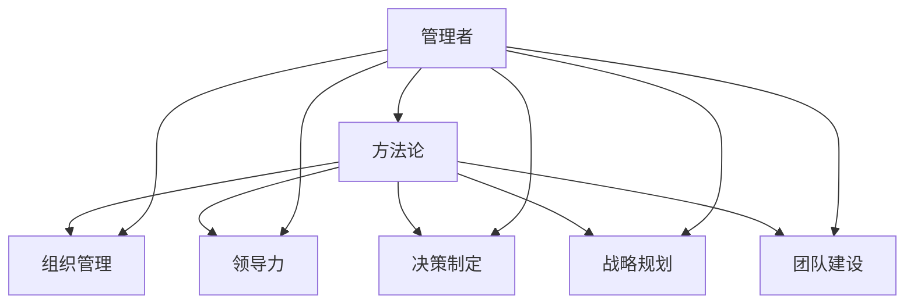

                 

# 管理者如何形成自己的方法论

> 关键词：管理者,方法论,组织管理,领导力,决策制定,战略规划,团队建设

## 1. 背景介绍

在当今快速变化和复杂多变的商业环境中，管理者需要具备系统化、结构化的思考方式来应对各种挑战。方法论为管理者提供了一套行之有效的工作流程和思考框架，帮助他们在面对复杂问题时能够做出更加科学和有效的决策。本文将深入探讨如何系统地形成自己的方法论，通过理解核心概念、掌握关键技巧，并结合实际案例分析，帮助管理者提升自身的领导力和组织管理能力。

## 2. 核心概念与联系

### 2.1 核心概念概述

形成管理者的方法论涉及多个关键概念：

- **管理者**：负责组织、指导、监督他人，以实现组织目标的领导者。
- **方法论**：一套系统化、结构化的思考和行动指南，用于解决特定类型的问题。
- **组织管理**：协调资源，指导团队，实现组织目标的过程。
- **领导力**：影响、激励和引导他人的能力。
- **决策制定**：基于信息分析和逻辑推理做出选择的过程。
- **战略规划**：确定组织目标和达成目标的路径。
- **团队建设**：组建、培养和维持高效的团队。

这些概念之间存在相互依存和交互的关系。有效的管理者需要通过这些概念的整合，形成一套行之有效的方法论，以应对各种管理挑战。

### 2.2 核心概念原理和架构的 Mermaid 流程图



这个流程图展示了管理者形成方法论的几个核心方面及其相互联系。管理者通过理解这些关键概念，整合到自己的方法论中，从而提升整体管理效能。

## 3. 核心算法原理 & 具体操作步骤

### 3.1 算法原理概述

管理者的核心算法原理包括以下几个方面：

- **系统化思考**：将复杂问题分解为可管理的小部分，逐一解决。
- **数据分析**：收集、整理和分析数据，为决策提供支持。
- **迭代优化**：不断调整策略，直到达到最佳效果。
- **反馈循环**：通过反馈机制不断改进管理方法。
- **风险评估**：识别和评估潜在的风险因素，制定应对策略。
- **绩效评估**：定期评估团队和项目的绩效，发现问题并改进。

### 3.2 算法步骤详解

形成管理者方法论的步骤如下：

**Step 1: 确立目标**
- 明确管理目标，设定可量化的KPI。

**Step 2: 收集数据**
- 使用工具和技术收集所需的数据，如问卷调查、数据分析软件等。

**Step 3: 数据整理**
- 清洗数据，去除噪音，确保数据的准确性和完整性。

**Step 4: 数据分析**
- 运用统计和数据挖掘技术，提取有价值的洞见。

**Step 5: 制定策略**
- 根据洞见和目标，制定详细的策略和行动计划。

**Step 6: 实施计划**
- 分配资源，制定时间表，执行策略。

**Step 7: 监控和反馈**
- 定期监控项目进展，收集反馈，及时调整策略。

**Step 8: 绩效评估**
- 评估团队和项目的实际绩效，与目标对比，发现问题并改进。

**Step 9: 总结和迭代**
- 总结成功经验和失败教训，形成新的方法论。

### 3.3 算法优缺点

#### 优点
- **系统化**：提供了一个结构化的工作框架，帮助管理者更有条理地解决问题。
- **数据驱动**：基于数据分析做出决策，提高决策的科学性和准确性。
- **迭代优化**：不断调整策略，逐步优化管理效果。
- **反馈机制**：通过持续的反馈和改进，提高管理质量和效率。

#### 缺点
- **复杂性**：需要较高的管理和分析能力，适用性可能受限于个体差异。
- **时间成本**：系统化方法论可能需要较长的时间来形成和实施。
- **资源需求**：需要投入大量的人力、物力和财力，实施成本较高。

### 3.4 算法应用领域

管理者的系统化方法论适用于多个领域：

- **组织战略规划**：通过系统化分析，确定组织的长期战略方向。
- **团队建设与管理**：通过科学方法，培养和维持高效的团队。
- **决策支持**：提供数据驱动的决策支持，减少主观判断的偏差。
- **绩效管理**：通过持续的监控和反馈，提升团队绩效。
- **风险管理**：识别和评估风险，制定应对策略。

## 4. 数学模型和公式 & 详细讲解 & 举例说明

### 4.1 数学模型构建

管理者的方法论可以构建为一系列数学模型，用于指导决策和行动。例如，决策树模型可以帮助管理者通过树状结构分析不同决策路径和结果。

### 4.2 公式推导过程

假设我们有一个简单的决策树模型，用于决定是否投资某项目。模型的输入为项目的潜在回报率 $R$ 和项目风险 $r$。模型的输出是投资与否的决策 $D$。

我们可以定义一个决策函数 $f(R,r)$，其中 $f=0$ 表示不投资，$f=1$ 表示投资。根据风险与回报的关系，我们可以定义如下函数：

$$
f(R,r) = 
\begin{cases} 
1, & \text{如果 } R > f(r) \\
0, & \text{如果 } R \leq f(r)
\end{cases}
$$

其中 $f(r)$ 为项目的风险调整回报率。

### 4.3 案例分析与讲解

假设某项目潜在回报率为 $R=30\%$，风险为 $r=15\%$。根据上述模型，我们计算出投资与否的决策 $D$。

首先，我们需要确定 $f(r)$。例如，如果风险的惩罚因子为 $p=0.2$，则有：

$$
f(r) = R \cdot (1-p) = 30\% \cdot (1-0.2) = 24\%
$$

因此，根据决策函数，项目回报率 $R=30\%$ 高于 $f(r)=24\%$，所以决策 $D=1$，即投资该项目。

## 5. 项目实践：代码实例和详细解释说明

### 5.1 开发环境搭建

为构建和管理者的决策树模型，我们首先需要搭建一个开发环境。使用 Python 和 Scikit-learn 库是最常见的选择。

安装 Python 和 Scikit-learn：

```bash
conda create -n manager-methodology python=3.8
conda activate manager-methodology
pip install scikit-learn
```

### 5.2 源代码详细实现

下面是一个简单的决策树模型实现：

```python
from sklearn.tree import DecisionTreeClassifier
from sklearn.model_selection import train_test_split
from sklearn.metrics import accuracy_score

# 准备数据
X = [[30, 15], [25, 20], [40, 25], [35, 30]]
y = [1, 1, 0, 0]

# 划分训练集和测试集
X_train, X_test, y_train, y_test = train_test_split(X, y, test_size=0.2)

# 构建决策树模型
model = DecisionTreeClassifier()
model.fit(X_train, y_train)

# 预测测试集
y_pred = model.predict(X_test)

# 计算准确率
accuracy = accuracy_score(y_test, y_pred)
print(f"Accuracy: {accuracy}")
```

### 5.3 代码解读与分析

在这个例子中，我们使用 Scikit-learn 库构建了一个简单的决策树模型。首先准备数据，然后使用 `train_test_split` 函数将数据划分为训练集和测试集。接着，构建决策树模型并训练它。最后，使用训练好的模型对测试集进行预测，并计算准确率。

## 6. 实际应用场景

### 6.1 战略规划

在企业战略规划中，管理者可以使用决策树模型来评估不同战略选项的潜在回报和风险，帮助企业做出更为科学的决策。

例如，某企业面临两种战略选择：进入新市场或扩大现有市场份额。可以分别计算每种选择的回报率和风险，构建决策树模型，评估最优策略。

### 6.2 团队建设与管理

管理者可以使用系统化方法论来识别团队中的关键成员，优化人力资源配置，提升团队绩效。

例如，通过数据收集和分析，可以评估团队成员的技能水平、工作表现和潜在贡献，从而做出更为科学的团队配置决策。

### 6.3 绩效管理

通过系统化方法论，管理者可以建立更为科学、公正的绩效评估体系，提高团队士气和效率。

例如，定期收集团队成员的反馈，结合定量数据，评估绩效，发现问题并改进。

## 7. 工具和资源推荐

### 7.1 学习资源推荐

- **《管理学原理》**：帮助你系统理解管理的基本原理和方法。
- **《领导力法则》**：介绍领导力的核心原则和实践技巧。
- **《数据驱动的决策》**：展示如何使用数据分析支持决策。
- **《组织变革与创新》**：探讨如何通过系统化方法论实现组织变革。

### 7.2 开发工具推荐

- **Python**：一个功能强大的编程语言，广泛用于数据科学和机器学习领域。
- **Scikit-learn**：一个强大的机器学习库，包含多种模型和工具，支持决策树、回归、分类等。
- **Tableau**：一个数据可视化工具，帮助管理者理解和分析数据。
- **Jira**：一个项目管理工具，支持任务分配、进度跟踪和团队协作。

### 7.3 相关论文推荐

- **《决策树学习理论与应用》**：详细介绍了决策树模型的原理和应用。
- **《领导力与组织变革》**：探讨领导力在组织变革中的作用。
- **《数据驱动的战略决策》**：展示如何使用数据支持战略决策。

## 8. 总结：未来发展趋势与挑战

### 8.1 研究成果总结

本文系统介绍了管理者如何通过系统化方法论提升管理效能。通过理解核心概念，掌握关键技巧，结合实际案例分析，帮助管理者形成自己的方法论，提升领导力和组织管理能力。

### 8.2 未来发展趋势

管理者的方法论将不断演进，适应新的技术和市场环境。未来趋势包括：

- **数字化转型**：利用大数据、人工智能等技术，优化管理流程。
- **跨领域融合**：将不同领域的知识和方法整合到管理中，提升创新能力。
- **可持续发展**：将可持续发展的理念融入管理，提升企业的社会责任。

### 8.3 面临的挑战

尽管管理者的方法论不断演进，但仍然面临诸多挑战：

- **数据质量**：数据不准确、不完整，影响决策的科学性和准确性。
- **复杂性**：管理问题复杂多变，系统化方法论可能无法完全应对。
- **文化差异**：不同组织文化和管理风格对方法论的适用性造成影响。
- **资源限制**：技术、人力、财力等资源限制，影响方法论的实施。

### 8.4 研究展望

未来的研究需要在以下几个方面寻求新的突破：

- **新技术应用**：利用大数据、人工智能等技术，优化管理方法论。
- **跨学科融合**：借鉴不同学科的方法和知识，提升管理创新能力。
- **可持续发展**：将可持续发展理念融入管理，推动绿色发展。

总之，管理者的方法论是一个不断演进和优化的过程。只有通过不断学习和实践，结合最新的技术和管理理念，才能形成更为科学、有效的方法论，应对各种管理挑战。

## 9. 附录：常见问题与解答

**Q1: 管理者如何平衡不同管理任务？**

A: 管理者可以采用优先级矩阵（Eisenhower矩阵）来平衡不同任务。将任务分为紧急和重要四个象限，帮助管理者合理分配时间和精力。

**Q2: 如何提高团队的凝聚力和士气？**

A: 管理者可以通过定期团队建设活动、奖励和认可、开放的沟通渠道等方式，提升团队的凝聚力和士气。

**Q3: 如何在快速变化的环境中保持灵活性？**

A: 管理者可以通过灵活的项目管理方法，如敏捷开发，灵活调整策略，适应变化。

**Q4: 如何有效进行绩效评估？**

A: 管理者可以采用平衡计分卡（Balanced Scorecard）等方法，综合考虑财务、客户、内部流程和学习与成长四个维度，全面评估绩效。

**Q5: 如何应对不确定性带来的风险？**

A: 管理者可以通过风险评估工具和方法，如SWOT分析、PEST分析等，识别和评估风险，制定应对策略。

---

作者：禅与计算机程序设计艺术 / Zen and the Art of Computer Programming

