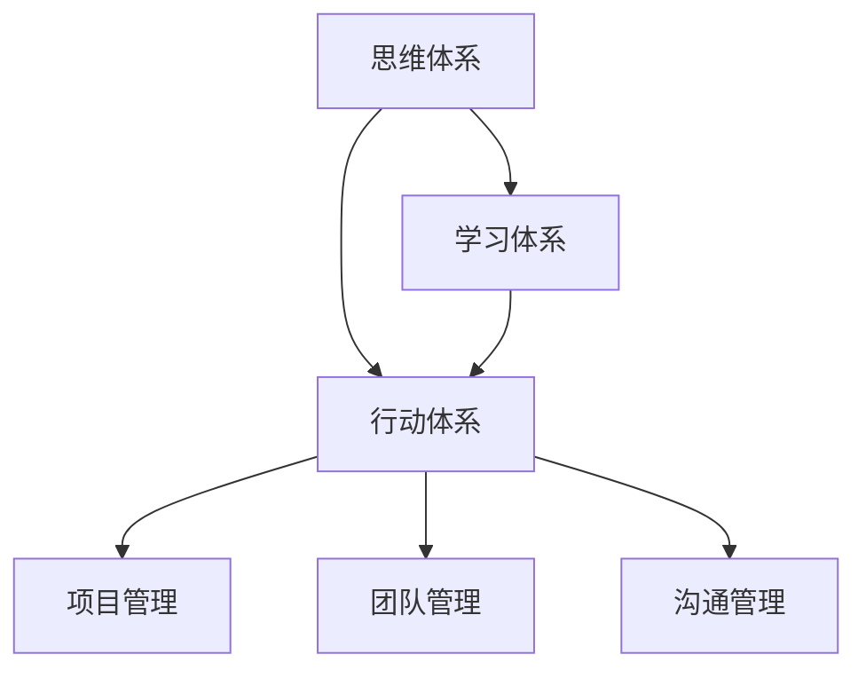

                 

# 管理者必备的三大体系：思维、行动和学习

> 关键词：管理者,思维体系,行动体系,学习体系,企业管理,组织发展

## 1. 背景介绍

### 1.1 问题由来

在当今快速变化、充满不确定性的商业环境中，管理者面临前所未有的挑战。如何高效地做出决策、如何激励团队、如何应对变化、如何推动组织发展，这些问题对每一个管理者来说都至关重要。而解决这些问题，首先需要建立一套系统化的管理框架，包括思维体系、行动体系和学习体系。

### 1.2 问题核心关键点

管理者面临的核心问题是如何在复杂多变的环境中进行有效的决策、管理和领导。这需要一套完整、系统化的管理方法论，包括思维、行动和学习三个方面。

1. **思维体系**：指管理者看待问题和分析问题的方式，包括战略思维、创新思维、系统思维等。
2. **行动体系**：指管理者将思维转化为具体行动的框架，包括项目管理、团队管理、沟通管理等。
3. **学习体系**：指管理者不断提升自身和团队能力的体系，包括培训、知识共享、经验积累等。

这三个体系相互关联、相互支撑，共同构成了一个高效的管理者能力模型。通过建立并不断优化这些体系，管理者可以有效应对各种挑战，推动组织持续发展。

### 1.3 问题研究意义

研究管理者的三大体系，对于提升管理者的综合素质、提高组织绩效、实现企业战略目标具有重要意义：

1. **提升管理效率**：系统的思维、行动和学习体系，可以帮助管理者更全面、深入地分析问题，制定科学合理的策略，从而提高管理决策的效率和准确性。
2. **增强团队凝聚力**：系统的团队管理和沟通管理，可以促进团队协作，提升团队士气和工作积极性，增强团队的凝聚力和战斗力。
3. **推动组织创新**：系统的创新思维和项目管理，可以帮助组织不断推出新产品、新服务，保持竞争优势。
4. **实现可持续增长**：系统的学习体系，可以提升组织成员的知识水平和能力，为组织的长期发展提供坚实的人才基础。

## 2. 核心概念与联系

### 2.1 核心概念概述

为了更好地理解管理者三大体系，本节将介绍几个密切相关的核心概念：

- **思维体系**：包括战略思维、创新思维、系统思维等，用于帮助管理者分析问题、制定战略。
- **行动体系**：包括项目管理、团队管理、沟通管理等，用于将思维转化为具体的行动计划和执行方案。
- **学习体系**：包括培训、知识共享、经验积累等，用于提升管理者及团队成员的知识水平和能力。

这些概念之间的逻辑关系可以通过以下Mermaid流程图来展示：



这个流程图展示了三大学体系的联系：

1. **思维体系**为**行动体系**提供方向和方法。
2. **学习体系**为**思维体系**提供知识和灵感。
3. **行动体系**是**思维体系**和**学习体系**的落地应用。

## 3. 核心算法原理 & 具体操作步骤

### 3.1 算法原理概述

管理者三大体系的构建，本质上是基于系统的思维、行动和学习方法论。其核心思想是：

- **思维体系**：通过战略思维、创新思维、系统思维等方法，帮助管理者全面、深入地分析问题和制定战略。
- **行动体系**：将思维转化为具体的行动计划和执行方案，通过项目管理、团队管理、沟通管理等方法，高效地实施和调整。
- **学习体系**：通过培训、知识共享、经验积累等方法，不断提升管理者及团队成员的知识水平和能力，实现持续改进和创新。

这些体系之间的相互作用和转换，可以归纳为以下几个关键步骤：

1. **问题识别与分析**：利用系统思维和创新思维，对问题进行全面、深入的识别和分析。
2. **目标设定与策略制定**：基于问题分析，设定具体、可行的目标，制定科学合理的策略。
3. **行动计划与执行**：将策略转化为具体的行动计划，通过项目管理、团队管理等方法，高效地执行和调整。
4. **反馈与学习**：通过系统的学习体系，收集反馈信息，总结经验教训，实现持续改进和创新。

### 3.2 算法步骤详解

以下是具体的操作流程：

**Step 1: 问题识别与分析**

1. **数据收集**：收集与问题相关的各种数据和信息，包括内部数据、市场数据、行业数据等。
2. **问题定义**：通过头脑风暴、SWOT分析等方法，明确问题的本质和关键因素。
3. **问题分解**：将问题分解为可管理的子问题，制定详细的问题清单。

**Step 2: 目标设定与策略制定**

1. **目标设定**：基于问题分解，设定具体、可行的目标，包括时间、资源、质量等关键指标。
2. **策略制定**：根据目标，制定科学合理的策略，包括短期、中期、长期策略。

**Step 3: 行动计划与执行**

1. **行动计划**：将策略转化为具体的行动计划，包括任务分解、资源分配、时间节点等。
2. **执行与监控**：按照行动计划，组织团队执行任务，并定期监控进度和效果。
3. **调整与优化**：根据执行过程中的反馈，及时调整和优化行动计划，确保目标达成。

**Step 4: 反馈与学习**

1. **反馈收集**：通过定期会议、绩效评估等方式，收集执行过程中的反馈信息。
2. **学习与总结**：总结经验教训，分析成功与失败的原因，制定改进措施。
3. **知识积累**：将学习到的知识进行整理和归纳，形成系统的知识库和经验库。

### 3.3 算法优缺点

三大体系的构建和应用，具有以下优点：

- **系统性**：通过系统的思维、行动和学习方法，帮助管理者全面、深入地解决问题，提高管理效率。
- **灵活性**：根据实际情况，灵活调整和优化策略、计划，适应复杂多变的商业环境。
- **可持续性**：通过不断的学习和改进，保持组织持续的创新能力和竞争力。

同时，这些体系也存在一定的局限性：

- **复杂性**：体系的构建和应用需要一定的时间和精力投入，对管理者的要求较高。
- **变化适应**：如果外部环境变化过于迅速，体系的调整和优化可能跟不上变化。
- **执行力**：体系的实施需要团队的积极配合和执行，如果团队管理不善，可能导致执行效果不佳。

尽管存在这些局限性，但三大体系的构建和管理，仍然是提升管理者综合素质、推动组织发展的有效手段。未来需要进一步优化和改进，以更好地适应快速变化的市场环境。

### 3.4 算法应用领域

三大体系在多个领域中得到了广泛应用，包括但不限于：

- **企业战略规划**：通过系统思维和创新思维，帮助企业制定科学合理的战略规划。
- **项目管理**：通过项目管理方法，高效地执行和调整项目计划，确保项目按时交付。
- **团队管理**：通过团队管理方法，提升团队协作和士气，增强团队战斗力。
- **产品开发**：通过创新思维和项目管理，不断推出新产品、新服务，保持市场领先地位。
- **客户服务**：通过沟通管理方法，提升客户满意度，增强客户忠诚度。
- **知识管理**：通过学习体系，建立系统的知识库和经验库，促进组织知识共享和创新。

这些应用领域表明，三大体系的构建和管理，不仅能够提升单个项目或产品的管理水平，还能推动整个组织的战略发展。

## 4. 数学模型和公式 & 详细讲解 & 举例说明

### 4.1 数学模型构建

在实际的管理中，问题识别与分析、目标设定与策略制定、行动计划与执行、反馈与学习等步骤，可以通过数学模型来辅助决策和分析。

以目标设定与策略制定为例，可以将问题分解为多个子问题，每个子问题设定具体目标，并评估其重要性、紧急性，从而制定优先级策略。

假设问题总数为 $N$，每个子问题的重要性为 $I_i$，紧急性为 $E_i$，则优先级 $P_i$ 可以表示为：

$$
P_i = \frac{I_i}{I_i + E_i}
$$

将优先级最高的子问题优先处理，可以最大限度地提升管理效率。

### 4.2 公式推导过程

在实际管理中，优先级 $P_i$ 的计算可以简化为对 $I_i$ 和 $E_i$ 的加权求和。将 $I_i$ 和 $E_i$ 归一化到0-1之间，则有：

$$
P_i = \frac{I_i}{I_i + E_i} = \frac{1 - E_i}{1 - (I_i + E_i)}
$$

将 $I_i$ 和 $E_i$ 代入公式，即可计算每个子问题的优先级。

### 4.3 案例分析与讲解

假设某公司面临多个业务问题，其中包含三个子问题：客户流失率上升、产品质量不稳定、市场竞争加剧。每个子问题的重要性 $I_i$ 和紧急性 $E_i$ 如下：

- 客户流失率上升：$I_1 = 0.8, E_1 = 0.6$
- 产品质量不稳定：$I_2 = 0.6, E_2 = 0.4$
- 市场竞争加剧：$I_3 = 0.5, E_3 = 0.7$

根据公式，计算每个子问题的优先级：

- $P_1 = \frac{0.8}{0.8 + 0.6} = 0.56$
- $P_2 = \frac{0.6}{0.6 + 0.4} = 0.60$
- $P_3 = \frac{0.5}{0.5 + 0.7} = 0.43$

根据计算结果，公司应优先处理产品质量不稳定和客户流失率上升两个子问题，以确保公司的业务健康发展。

## 5. 项目实践：代码实例和详细解释说明

### 5.1 开发环境搭建

在进行管理者三大体系的应用实践前，我们需要准备好开发环境。以下是使用Python进行代码实现的环境配置流程：

1. 安装Python：从官网下载并安装最新版本的Python。
2. 安装Pandas：用于数据处理和分析。
3. 安装Matplotlib：用于绘制图表和数据可视化。
4. 安装Scikit-learn：用于机器学习和数据挖掘。

完成上述步骤后，即可在Python环境中进行代码实现。

### 5.2 源代码详细实现

以下是一个基于Python的项目实践代码实例，用于计算每个子问题的优先级。

```python
import pandas as pd
import numpy as np
import matplotlib.pyplot as plt
from sklearn.preprocessing import MinMaxScaler

# 假设每个子问题的重要性I和紧急性E
I = np.array([0.8, 0.6, 0.5])
E = np.array([0.6, 0.4, 0.7])

# 将I和E归一化到0-1之间
I_norm = (I - np.min(I)) / (np.max(I) - np.min(I))
E_norm = (E - np.min(E)) / (np.max(E) - np.min(E))

# 计算每个子问题的优先级P
P = (1 - E_norm) / (1 - (I_norm + E_norm))

# 输出优先级结果
print("子问题优先级：")
for i in range(len(P)):
    print(f"问题{i+1}：{P[i]:.2f}")
```

### 5.3 代码解读与分析

让我们再详细解读一下关键代码的实现细节：

1. 导入必要的库和工具：
   - `pandas`：用于数据处理和分析。
   - `numpy`：用于数学计算和数组操作。
   - `matplotlib.pyplot`：用于绘制图表和数据可视化。
   - `sklearn.preprocessing`：用于数据归一化。

2. 假设每个子问题的重要性I和紧急性E：
   - 使用`np.array`创建重要性数组和紧急性数组。

3. 归一化I和E到0-1之间：
   - 使用`np.min`和`np.max`计算I和E的最小值和最大值。
   - 使用`np.array`创建归一化后的重要性数组和紧急性数组。

4. 计算每个子问题的优先级P：
   - 使用公式 $P_i = \frac{1 - E_i}{1 - (I_i + E_i)}$ 计算每个子问题的优先级。

5. 输出优先级结果：
   - 使用`print`函数输出每个子问题的优先级。

在实际应用中，管理者可以根据具体情况调整重要性I和紧急性E的值，确保优先级计算符合实际需求。

## 6. 实际应用场景

### 6.1 智能制造

在智能制造领域，管理者需要高效地管理生产流程、优化资源配置、提升产品质量。通过三大体系的构建，可以帮助管理者系统地识别和分析问题，制定科学合理的生产策略，确保生产高效、稳定。

在具体应用中，可以利用数据分析工具和机器学习模型，实时监控生产数据，分析生产过程中的瓶颈和异常，及时调整生产计划和资源分配。同时，通过知识共享和经验积累，不断提升生产管理水平和生产效率。

### 6.2 智慧城市

在智慧城市管理中，管理者需要协调交通、环境、安全等多方面的资源，提升城市的综合管理水平。通过三大体系的构建，可以帮助管理者系统地识别和管理城市问题，制定科学合理的管理策略，提升城市的宜居性和可持续发展能力。

在具体应用中，可以利用大数据和人工智能技术，实时监控城市运行数据，分析城市管理的瓶颈和问题，及时调整管理策略和资源配置。同时，通过知识共享和经验积累，不断提升城市管理水平和居民生活质量。

### 6.3 金融投资

在金融投资领域，管理者需要高效地分析市场信息、制定投资策略、控制风险。通过三大体系的构建，可以帮助管理者系统地识别和分析市场信息，制定科学合理的投资策略，提升投资收益和风险控制能力。

在具体应用中，可以利用数据分析和机器学习模型，实时监控市场数据，分析市场趋势和风险，及时调整投资策略和资产配置。同时，通过知识共享和经验积累，不断提升投资管理水平和风险控制能力。

### 6.4 未来应用展望

随着技术的不断进步和应用场景的扩展，管理者三大体系的应用将更加广泛和深入。未来的趋势可能包括以下几个方向：

1. **智能化和自动化**：通过人工智能和大数据分析技术，实现管理问题的智能化识别和自动化处理，提高管理效率和决策准确性。
2. **多模态融合**：将传统的定性管理与现代的定量管理相结合，通过数据、经验、知识和人的综合运用，提升管理效果。
3. **持续学习与改进**：通过持续学习和改进，不断优化管理策略和方法，适应快速变化的市场环境。
4. **跨界融合**：将管理知识与最新的技术趋势相结合，如物联网、区块链、量子计算等，提升管理的创新性和前瞻性。
5. **人机协同**：通过人机协同技术，实现管理过程的智能化和人性化，提升管理质量和用户体验。

## 7. 工具和资源推荐

### 7.1 学习资源推荐

为了帮助管理者系统掌握三大体系的理论基础和实践技巧，这里推荐一些优质的学习资源：

1. 《管理者的思维体系》系列博文：由管理学专家撰写，详细讲解了系统思维、创新思维、战略思维等关键概念，并提供了大量案例分析。

2. 《行动管理》系列书籍：由知名管理学家撰写，全面介绍了项目管理、团队管理、沟通管理等实际应用方法。

3. 《学习型组织》系列课程：由知名大学和机构开设，系统讲解了组织学习、知识管理、经验积累等系统方法。

4. 《管理学基础》课程：由知名大学开设，提供管理学的基础知识，帮助管理者建立系统的管理思维。

5. 《数据分析与决策》课程：由知名大学和机构开设，提供数据分析和决策支持的方法和技术，帮助管理者高效处理数据和信息。

通过对这些资源的学习实践，相信管理者一定能够更好地掌握三大体系的精髓，并将其应用于实际管理工作中。

### 7.2 开发工具推荐

在实际的开发过程中，以下是几款常用的开发工具：

1. Python：广泛用于数据处理、分析、可视化和建模，是数据科学和人工智能领域的主流语言。
2. R：广泛用于数据分析、统计建模和可视化，适合处理大数据和复杂统计问题。
3. Excel：广泛应用于数据处理和报表制作，适合中小规模的数据分析和决策支持。
4. SQL：广泛应用于数据库管理和数据查询，适合处理结构化数据和事务性操作。
5. Tableau：广泛应用于数据可视化和商业智能，适合快速生成交互式报表和仪表盘。
6. Power BI：广泛应用于数据可视化和商业智能，适合生成动态报表和仪表盘，支持实时数据接入。

合理利用这些工具，可以显著提升管理者的工作效率和决策质量。

### 7.3 相关论文推荐

管理者的三大体系，是管理学和组织行为学领域的研究热点，以下是几篇经典论文，推荐阅读：

1. 《系统思维与组织创新》：介绍系统思维的原理和应用，探讨如何通过系统思维推动组织创新。
2. 《项目管理方法论》：全面介绍了项目管理的各个环节和工具，提供了项目管理实践指南。
3. 《团队管理与协作》：探讨团队管理的基本原则和实践方法，提升团队的协作和士气。
4. 《知识管理与组织学习》：介绍知识管理的理论和实践，探讨如何通过知识共享和经验积累提升组织能力。
5. 《领导力与变革管理》：探讨领导力的核心要素和实践方法，提供变革管理的策略和工具。

这些论文代表了大管理理论的发展脉络，通过学习这些前沿成果，可以帮助管理者掌握系统的管理方法，提升管理水平。

## 8. 总结：未来发展趋势与挑战

### 8.1 总结

本文对管理者必备的三大体系：思维、行动和学习进行了全面系统的介绍。首先阐述了管理者面临的核心问题和挑战，明确了思维体系、行动体系和学习体系的重要性和关联性。其次，从原理到实践，详细讲解了三大体系的构建和应用方法，给出了具体的代码实现和案例分析。同时，本文还探讨了三大体系在实际应用场景中的应用前景，展示了其广泛的适用性和深远的影响力。最后，本文精选了相关的学习资源和开发工具，力求为管理者提供全方位的技术指引。

通过本文的系统梳理，可以看到，管理者三大体系的构建和管理，不仅是一种系统化的管理方法论，更是一种科学合理的管理思维方式。通过思维、行动和学习的协同作用，管理者可以有效应对各种复杂多变的问题，推动组织的持续发展和创新。

### 8.2 未来发展趋势

展望未来，管理者三大体系的构建和管理将呈现以下几个发展趋势：

1. **智能化和自动化**：通过人工智能和大数据分析技术，实现管理问题的智能化识别和自动化处理，提高管理效率和决策准确性。
2. **多模态融合**：将传统的定性管理与现代的定量管理相结合，通过数据、经验、知识和人的综合运用，提升管理效果。
3. **持续学习与改进**：通过持续学习和改进，不断优化管理策略和方法，适应快速变化的市场环境。
4. **跨界融合**：将管理知识与最新的技术趋势相结合，如物联网、区块链、量子计算等，提升管理的创新性和前瞻性。
5. **人机协同**：通过人机协同技术，实现管理过程的智能化和人性化，提升管理质量和用户体验。

这些趋势凸显了管理者三大体系的应用潜力，将进一步推动管理科学的发展和管理水平的提升。

### 8.3 面临的挑战

尽管管理者三大体系在实际应用中取得了显著的效果，但仍面临诸多挑战：

1. **复杂性**：体系的构建和应用需要一定的时间和精力投入，对管理者的要求较高。
2. **变化适应**：如果外部环境变化过于迅速，体系的调整和优化可能跟不上变化。
3. **执行力**：体系的实施需要团队的积极配合和执行，如果团队管理不善，可能导致执行效果不佳。
4. **资源限制**：体系的应用需要一定的资源投入，如数据、工具、人力等，资源限制可能影响应用效果。
5. **文化障碍**：管理体系的推广和实施需要组织文化的支持，组织文化和价值观可能影响管理变革的效果。

尽管存在这些挑战，但三大体系的构建和管理，仍然是提升管理者综合素质、推动组织发展的有效手段。未来需要进一步优化和改进，以更好地适应快速变化的市场环境。

### 8.4 研究展望

面向未来，管理者三大体系的研究方向可能包括以下几个方面：

1. **智能化管理方法**：探索基于人工智能和大数据分析的管理方法，提升管理效率和决策准确性。
2. **多模态管理模型**：将数据、经验、知识和人的综合运用，提升管理效果。
3. **学习型组织构建**：通过持续学习和改进，提升组织的知识水平和能力，推动组织持续发展。
4. **跨界管理融合**：将管理知识与最新的技术趋势相结合，提升管理的创新性和前瞻性。
5. **人机协同管理**：通过人机协同技术，实现管理过程的智能化和人性化，提升管理质量和用户体验。

这些研究方向将进一步推动管理科学的发展，为组织提供更科学、更高效、更可持续的管理方法。

## 9. 附录：常见问题与解答

**Q1：管理者如何构建三大体系？**

A: 构建管理者三大体系需要系统的方法和步骤，主要包括以下几个方面：

1. **思维体系构建**：
   - 学习系统思维、创新思维、战略思维等方法论。
   - 分析问题和制定策略，形成系统的思维框架。

2. **行动体系构建**：
   - 学习项目管理、团队管理、沟通管理等方法。
   - 制定详细的行动计划，并按计划执行和调整。

3. **学习体系构建**：
   - 学习培训、知识共享、经验积累等方法。
   - 定期收集反馈信息，总结经验教训，提升知识水平和能力。

通过系统的学习和实践，管理者可以有效构建三大体系，提升管理能力和组织绩效。

**Q2：管理者如何提升执行力和团队合作？**

A: 提升执行力和团队合作，需要从以下几个方面进行改进：

1. **明确目标和责任**：
   - 制定清晰的目标和责任分配，确保每个团队成员知道自己的职责和工作内容。

2. **优化沟通和协作**：
   - 建立有效的沟通渠道，促进信息共享和协作。
   - 采用项目管理工具，跟踪任务进度和资源分配。

3. **激励和奖励机制**：
   - 建立激励和奖励机制，激发团队成员的工作积极性和创新精神。

4. **持续学习和改进**：
   - 定期进行培训和学习，提升团队成员的能力和素质。
   - 通过团队讨论和反思，总结经验教训，不断改进工作方法。

通过优化目标设定、沟通协作、激励机制和持续学习，管理者可以提升团队的执行力，增强团队合作，推动组织目标的实现。

**Q3：管理者如何处理外部环境的快速变化？**

A: 处理外部环境的快速变化，需要具备以下能力：

1. **灵活应对**：
   - 建立快速反应机制，及时调整策略和计划。
   - 采用敏捷管理方法，提升应变能力和适应性。

2. **持续学习**：
   - 定期收集市场信息和反馈，分析环境变化趋势。
   - 通过持续学习和改进，提升应对变化的能力。

3. **资源整合**：
   - 灵活调配资源，确保关键任务的高效执行。
   - 利用外部资源和合作伙伴，提升资源整合能力。

通过灵活应对、持续学习和资源整合，管理者可以更好地处理外部环境的快速变化，推动组织稳定发展。

**Q4：管理者如何评估三大体系的实施效果？**

A: 评估三大体系的实施效果，需要从以下几个方面进行评估：

1. **目标达成情况**：
   - 评估是否达成了预期的目标和任务，分析任务完成情况。

2. **资源利用效率**：
   - 评估资源的使用效率，分析资源浪费和利用不足的情况。

3. **团队合作效果**：
   - 评估团队合作效果，分析团队协作和士气。

4. **反馈和改进情况**：
   - 收集反馈信息，总结经验教训，分析改进措施的实施效果。

通过系统化的评估和反馈机制，管理者可以持续改进三大体系的实施效果，提升管理水平和组织绩效。

**Q5：管理者如何应对突发事件？**

A: 应对突发事件，需要从以下几个方面进行应对：

1. **快速响应**：
   - 建立应急响应机制，确保在突发事件发生时能够快速响应和处理。

2. **资源调配**：
   - 灵活调配资源，确保关键任务的高效执行。
   - 采用跨部门协作，整合资源和力量。

3. **信息透明**：
   - 保持信息透明，及时披露事件进展和处理措施，增强员工的信任和支持。

4. **事后总结**：
   - 进行事后总结和反思，分析事件原因和处理措施的有效性。
   - 通过总结和反思，提升应对突发事件的能力。

通过快速响应、资源调配、信息透明和事后总结，管理者可以有效应对突发事件，保障组织安全和稳定发展。

---

作者：禅与计算机程序设计艺术 / Zen and the Art of Computer Programming

