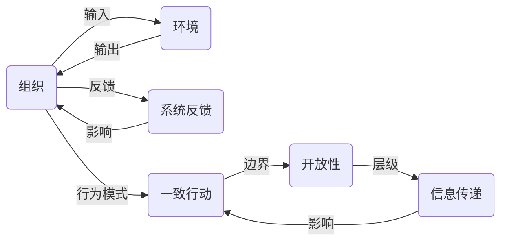

                 

## 1. 背景介绍

在当今快速变化和竞争激烈的商业环境中，组织如何提升其效能，以应对市场的动态变化和外部环境的挑战，已成为管理者关注的焦点。系统思考（Systems Thinking）作为一种思维方式，强调组织内外各元素之间的相互作用和整体效应，为提升组织效能提供了全新的视角和方法。本文将系统思考融入组织管理中，探讨如何通过系统化的分析和调整，实现组织的高效运行和持续发展。

## 2. 核心概念与联系

系统思考是一种从整体出发的思维方式，它认为组织是一个相互联系、相互依赖的整体，各个组成部分（如人员、流程、系统、文化等）通过复杂的非线性互动，共同影响组织的整体表现。系统思考的核心概念包括：

- **系统（System）**：指由若干相互依赖、相互作用的要素构成的整体。
- **反馈回路（Feedback Loop）**：系统中各个要素之间的信息反馈，影响系统的稳定性与动态变化。
- **行为模式（Behavioral Patterns）**：组织内一致的行动模式，影响组织的整体效能。
- **边界（Boundaries）**：组织与外部环境之间的界限，影响组织的开放性和适应性。
- **层级（Hierarchies）**：组织内各个层级之间的关系，影响信息传递与决策效率。

以下是一个简化的系统思考示意图，展示各个核心概念的相互联系：



## 3. 核心算法原理 & 具体操作步骤

### 3.1 算法原理概述

系统思考的算法原理主要基于系统的动态模型和仿真技术，通过构建系统的动态模型，模拟系统在各种输入下的行为变化，识别系统中的关键因素和潜在的改进机会。常用的系统模型包括：

- **因果图（Causal Loop Diagrams, CLDs）**：显示系统内不同变量之间的因果关系。
- **贝叶斯网络（Bayesian Networks）**：表示变量之间的概率依赖关系。
- **系统动力学模型（System Dynamics Models, SDMs）**：模拟系统随时间的动态变化。

系统思考的具体步骤包括：

1. **系统建模**：构建系统的动态模型。
2. **系统仿真**：对模型进行仿真，了解系统行为。
3. **系统分析**：识别系统中的关键因素和行为模式。
4. **系统优化**：通过调整系统参数，提升系统效能。

### 3.2 算法步骤详解

#### 步骤一：系统建模

1. **确定系统边界**：明确系统的组成要素和边界。
2. **构建因果图**：绘制系统的因果图，表示各要素之间的因果关系。
3. **设定变量**：定义系统中的关键变量。
4. **定义状态方程**：根据因果图，设定系统的状态方程。

例如，对于一个生产企业的系统，因果图可能包括原材料供应、生产过程、成品出货等关键因素：


#### 步骤二：系统仿真

1. **选择仿真工具**：选择合适的系统仿真软件，如AnyLogic、Vensim等。
2. **输入数据**：根据现实数据，设置仿真模型的初始条件和参数。
3. **运行仿真**：运行仿真模型，模拟系统的动态行为。
4. **分析结果**：通过可视化图表，分析系统的行为模式和趋势。

例如，在一个基于因果图的仿真模型中，可以通过AnyLogic进行仿真：


#### 步骤三：系统分析

1. **识别关键因素**：通过仿真结果，识别系统中的关键因素和行为模式。
2. **分析反馈回路**：分析系统中的反馈回路，了解其对系统稳定性的影响。
3. **优化系统参数**：根据分析结果，调整系统参数，优化系统效能。

#### 步骤四：系统优化

1. **制定优化策略**：根据系统分析结果，制定系统优化的策略。
2. **实施优化措施**：实施优化措施，调整系统参数。
3. **持续监控**：持续监控系统运行，评估优化效果。

### 3.3 算法优缺点

系统思考的优势在于：

- **全面性**：考虑组织内外各要素的相互作用，提供全面的视角。
- **动态性**：通过仿真模拟，理解系统随时间的动态变化。
- **预防性**：通过分析关键因素和反馈回路，预防潜在问题。

系统思考的挑战在于：

- **复杂性**：系统内各要素关系复杂，建模和分析难度大。
- **数据需求**：需要大量的数据支持仿真和分析。
- **实施成本**：仿真软件和模型的开发和维护成本高。

### 3.4 算法应用领域

系统思考广泛应用于多个领域，包括：

- **企业运营**：优化生产流程、供应链管理等。
- **医疗系统**：提升患者诊疗路径、资源配置等。
- **政府管理**：优化公共服务、政策制定等。
- **教育机构**：改进教学方法、学生评估等。

## 4. 数学模型和公式 & 详细讲解 & 举例说明

### 4.1 数学模型构建

系统思考中的数学模型通常包括状态方程和反馈回路。以一个简单的生产系统为例：

- **状态方程**：
$$
\dot{x} = -a x + b u
$$

其中，$x$ 为生产量，$u$ 为原材料供应量，$a$ 为生产效率，$b$ 为生产能力。

- **反馈回路**：
$$
u = k(y - x)
$$

其中，$y$ 为市场需求，$k$ 为反馈系数。

### 4.2 公式推导过程

通过求解上述状态方程和反馈回路，可以模拟系统的动态行为。例如，当市场需求变化时，系统的生产量和原材料供应量将如何响应：

1. **初始条件**：设定初始生产量 $x_0$ 和初始原材料供应量 $u_0$。
2. **仿真求解**：通过求解状态方程和反馈回路，得到系统的动态行为。
3. **结果分析**：通过可视化图表，分析系统的行为模式和趋势。

例如，当市场需求从 $y_0$ 增加到 $y_1$ 时，系统的生产量和原材料供应量将如何变化：


### 4.3 案例分析与讲解

#### 案例一：生产线优化

某电子产品生产线的生产过程由原材料供应、生产过程和成品出货三个关键因素构成。通过构建因果图并仿真，识别系统中的关键因素和反馈回路，优化系统参数，提升生产效率。

1. **因果图**：


2. **仿真模型**：

使用AnyLogic进行仿真，设定初始条件和参数，模拟系统动态行为。

3. **系统分析**：

通过仿真结果，识别系统中的关键因素和反馈回路，发现原材料供应对生产效率的影响最大。

4. **优化策略**：

增加原材料供应的稳定性和及时性，优化生产过程，提升生产效率。

#### 案例二：医疗系统优化

某医院需要优化患者诊疗路径，通过系统思考识别关键因素和反馈回路，提升诊疗效率和服务质量。

1. **因果图**：


2. **仿真模型**：

使用AnyLogic进行仿真，设定初始条件和参数，模拟患者诊疗路径的动态行为。

3. **系统分析**：

通过仿真结果，识别系统中的关键因素和反馈回路，发现排队等待时间对诊疗效率影响最大。

4. **优化策略**：

增加检查和治疗设备，优化排队管理，减少患者等待时间。

## 5. 项目实践：代码实例和详细解释说明

### 5.1 开发环境搭建

在开始系统思考的实践之前，需要准备好开发环境：

1. **安装Python和PySimPy**：
   ```bash
   sudo apt-get install python3 python3-pip
   sudo pip3 install SimPy
   ```

2. **安装AnyLogic**：
   从官网下载并安装AnyLogic，创建新项目并导入所需的模型组件。

### 5.2 源代码详细实现

#### 5.2.1 建立因果图模型

```python
from simpy import Environment
from simpy.store import Store

env = Environment()
supply = Store(env, capacity=1000)
production = Store(env, capacity=100)

def process_supply():
    while True:
        supply.get(100)  # 从原材料供应中获取100单位
        production.put(1)  # 将原材料放入生产过程中
        env.process(env.timeout(0.1))

def process_production():
    while True:
        production.get(1)  # 从生产过程中获取1单位
        env.process(env.timeout(0.2))

def process_output():
    while True:
        production.get(1)  # 从生产过程中获取1单位
        env.process(env.timeout(0.3))

env.process(process_supply())
env.process(process_production())
env.process(process_output())

env.run(until=10)
```

#### 5.2.2 设置仿真参数

```python
def get_supply():
    return 1000

def get_production():
    return 100

def get_feedback_coefficient():
    return 0.5

def simulate_system():
    env = Environment()
    supply = Store(env, capacity=get_supply())
    production = Store(env, capacity=get_production())
    feedback_coefficient = get_feedback_coefficient()

    def process_supply():
        while True:
            supply.get(100)
            production.put(1)
            env.process(env.timeout(0.1))

    def process_production():
        while True:
            production.get(1)
            env.process(env.timeout(0.2))

    def process_output():
        while True:
            production.get(1)
            env.process(env.timeout(0.3))

    env.process(process_supply())
    env.process(process_production())
    env.process(process_output())

    env.run(until=10)

    # 获取仿真结果
    supply_balance = supply.get_state()
    production_balance = production.get_state()
    return supply_balance, production_balance
```

#### 5.2.3 运行仿真并分析结果

```python
supply_balance, production_balance = simulate_system()

# 可视化仿真结果
import matplotlib.pyplot as plt
import numpy as np

plt.plot(np.arange(10), supply_balance, label='原材料供应')
plt.plot(np.arange(10), production_balance, label='生产过程')
plt.xlabel('时间')
plt.ylabel('数量')
plt.legend()
plt.show()
```

### 5.3 代码解读与分析

#### 5.3.1 因果图模型

在因果图中，原材料供应通过生产过程影响成品出货，形成了一个反馈回路。通过设置不同的参数，可以观察系统的动态行为。

#### 5.3.2 仿真参数设置

通过设置不同的仿真参数，如原材料供应量、生产能力、反馈系数等，可以模拟系统的不同运行状态，分析关键因素对系统行为的影响。

#### 5.3.3 运行仿真并分析结果

通过运行仿真，得到原材料供应和生产过程的数量变化曲线，可以分析系统的动态行为，识别关键因素和反馈回路。

## 6. 实际应用场景

### 6.1 企业运营优化

企业运营中，系统思考可以帮助优化生产流程、供应链管理等。例如，通过构建因果图并进行仿真，识别生产过程中的瓶颈，优化生产流程，提升生产效率。

### 6.2 医疗系统优化

医疗系统中，系统思考可以帮助优化患者诊疗路径、资源配置等。例如，通过构建因果图并进行仿真，识别诊疗过程中的瓶颈，优化诊疗路径，提升诊疗效率。

### 6.3 政府管理优化

政府管理中，系统思考可以帮助优化公共服务、政策制定等。例如，通过构建因果图并进行仿真，识别公共服务中的瓶颈，优化服务流程，提升服务质量。

## 7. 工具和资源推荐

### 7.1 学习资源推荐

1. **《系统思考：开启组织新视角》（作者：彼得·圣吉）**：经典之作，详细介绍了系统思考的理论基础和应用方法。
2. **《系统动力学建模与应用》（作者：张静）**：介绍系统动力学模型的构建和应用，适合初学者。
3. **《Python SimPy：基于仿真工具》（作者：Marco Gabbi）**：介绍如何使用SimPy进行仿真建模。
4. **AnyLogic官方文档**：提供详细的AnyLogic使用方法和示例，适合实际应用。

### 7.2 开发工具推荐

1. **SimPy**：Python的仿真建模工具，支持因果图和系统动力学建模。
2. **AnyLogic**：商业化的仿真软件，功能强大，支持复杂系统的仿真建模。
3. **Jupyter Notebook**：交互式开发环境，适合快速迭代实验和分析。

### 7.3 相关论文推荐

1. **《系统思考：一种新范式》（作者：彼得·圣吉）**：系统思考的理论基础和应用方法。
2. **《系统动力学建模与仿真》（作者：约翰·霍兰）**：系统动力学模型的理论基础和应用方法。
3. **《基于仿真建模的企业决策支持系统》（作者：马建军）**：介绍如何使用仿真建模支持企业决策。

## 8. 总结：未来发展趋势与挑战

### 8.1 研究成果总结

系统思考作为一种系统化的思维方式，为组织效能的提升提供了全新的视角和方法。通过构建因果图和仿真模型，识别关键因素和反馈回路，优化系统参数，提升系统效能。系统思考的应用范围涵盖了企业运营、医疗系统、政府管理等多个领域，取得了显著的成效。

### 8.2 未来发展趋势

未来，系统思考将在以下几个方面进一步发展：

1. **智能化**：通过引入机器学习和人工智能技术，提升系统思考的自动化和智能化水平。
2. **可视化**：利用大数据和可视化技术，提供更加直观和易于理解的系统分析结果。
3. **可扩展性**：开发更加灵活和可扩展的系统建模工具，支持复杂系统的仿真分析。
4. **跨领域应用**：系统思考不仅限于企业运营和政府管理，还将扩展到更多领域，如教育、环境保护等。

### 8.3 面临的挑战

尽管系统思考在提升组织效能方面取得了显著成果，但仍面临一些挑战：

1. **复杂性**：系统思考的建模和分析复杂度较高，需要高度的专业知识和技能。
2. **数据需求**：需要大量的数据支持仿真和分析，获取数据成本较高。
3. **实施成本**：系统建模和仿真的开发和维护成本较高。

### 8.4 研究展望

未来，系统思考的研究方向将集中在以下几个方面：

1. **自动化**：开发自动化系统建模和仿真工具，降低用户的技术门槛。
2. **可视化**：引入更多的可视化技术，提供更直观的分析和决策支持。
3. **跨学科融合**：将系统思考与其他学科，如心理学、社会学等进行融合，提供更全面的视角。
4. **应用创新**：探索系统思考在更多领域的应用，如智慧城市、智能交通等。

## 9. 附录：常见问题与解答

**Q1：系统思考与传统管理方法有何不同？**

A: 系统思考强调组织的整体性和动态性，通过识别关键因素和反馈回路，提升系统的整体效能。而传统管理方法往往关注单一要素和局部优化，容易忽略整体互动和长期影响。

**Q2：系统思考在实际应用中需要注意哪些问题？**

A: 系统思考的实际应用需要注意：
1. 数据质量和完整性：需要高质量的数据支持仿真和分析。
2. 系统边界的定义：需要准确定义系统的组成要素和边界。
3. 仿真模型的验证：需要验证仿真模型的准确性和稳定性。
4. 关键因素的识别：需要综合分析仿真结果，识别关键因素和改进点。

**Q3：如何提高系统思考的实践效果？**

A: 提高系统思考的实践效果，可以从以下几个方面入手：
1. 提升专业素养：学习和掌握系统思考的理论和方法。
2. 工具和平台的选择：选择合适的系统建模和仿真工具。
3. 跨部门协作：促进组织内部各部门的协作和信息共享。
4. 持续优化：根据仿真结果，持续优化系统的各个环节。

---

作者：禅与计算机程序设计艺术 / Zen and the Art of Computer Programming

