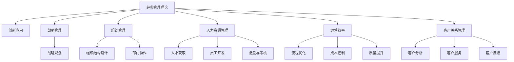

                 

# 经典管理理论在现代企业中的创新应用

## 1. 背景介绍

### 1.1 问题由来

在快速发展的今天，企业面临着复杂多变的外部环境和激烈的市场竞争，管理理论面临着前所未有的挑战。传统管理理论虽然构建了经典的管理框架和实践方法，但在应对现代企业新问题时显得力不从心。因此，如何创新应用经典管理理论，以提升企业的适应性和竞争力，成为管理学者和实践者共同关心的议题。

### 1.2 问题核心关键点

本文聚焦于如何创新应用经典管理理论，以提升企业的战略规划、组织管理、人力资源、运营效率等核心管理能力的实效性。经典管理理论的核心思想和模型如何与现代企业的实际状况相结合，以及如何基于这些理论进行创新应用，是本文的核心议题。

### 1.3 问题研究意义

本文旨在通过深度分析现代企业的管理现状和挑战，探索经典管理理论在其中的创新应用，为企业提供具有实效性的管理提升策略。这对于提高企业竞争力，增强其在复杂环境中的适应能力，具有重要意义。

## 2. 核心概念与联系

### 2.1 核心概念概述

为更好地理解经典管理理论在现代企业中的创新应用，本节将介绍几个关键概念：

- **经典管理理论**：包括泰勒的科学管理理论、法约尔的五大管理职能、韦伯的行政组织理论、麦格雷戈的X-Y理论、波特的五力模型等。这些理论为企业提供了系统的管理框架和方法，对企业的战略、运营、人力资源等方面产生了深远影响。

- **创新应用**：指在原有管理理论的基础上，结合现代企业的实际情况，对其进行创新性改造和应用，以提升管理的实效性和适应性。

- **战略管理**：企业制定长远发展目标和策略，通过明确方向和利用资源，实现组织绩效的提升。

- **组织管理**：研究如何设计和管理组织结构、协调各部门的协作，以高效完成任务。

- **人力资源管理**：通过人力资源的获取、开发、激励、使用和调整，提升企业的竞争优势。

- **运营效率**：研究如何优化企业的运营流程，提高资源的利用效率，实现成本控制和质量提升。

- **客户关系管理**：建立和维护与客户的长期关系，提升客户满意度和忠诚度。

这些概念之间的逻辑关系可以通过以下Mermaid流程图来展示：



这个流程图展示了经典管理理论的核心概念及其之间的关系：

1. 经典管理理论提供基础的管理框架。
2. 创新应用是对这些理论的改进和实践。
3. 在战略、组织、人力资源、运营和客户关系管理等各个模块，理论通过创新应用得到了实际的提升和改造。

## 3. 核心算法原理 & 具体操作步骤

### 3.1 算法原理概述

经典管理理论在现代企业中的创新应用，本质上是一种以理论为基础，结合企业实际情况进行优化和调整的过程。其核心思想是通过对管理理论的深入理解，结合现代企业的特点，进行创新性的改造和应用，以提升管理的实效性。

形式化地，假设企业原有的管理理论为 $T_{\text{classic}}$，在结合现代企业特点后形成的创新应用为 $T_{\text{innovative}}$。则：

$$
T_{\text{innovative}} = f(T_{\text{classic}}, \text{企业特点}, \text{实证数据})
$$

其中 $f$ 表示将理论应用到实际情况的映射函数。该函数需要结合企业的实际情况和实证数据，进行迭代优化，以找到最优的应用方案。

### 3.2 算法步骤详解

经典管理理论在现代企业中的创新应用，一般包括以下几个关键步骤：

**Step 1: 理论选择与评估**

- 根据企业特点，选择适合的经典管理理论作为参考依据。如企业面临高度竞争的市场环境，可以选取波特的五力模型作为分析工具。

**Step 2: 实证分析与数据收集**

- 通过调研、访谈等方式，收集企业内部和外部的实证数据，如市场竞争态势、客户反馈、员工满意度等。

**Step 3: 理论应用与创新**

- 将选定的理论应用到企业实际管理中，结合收集的实证数据，进行必要的调整和创新。如对波特的五力模型进行微调，引入SWOT分析等工具，以提升理论的适应性。

**Step 4: 实施与反馈**

- 将创新后的理论在企业内部进行试点推广，并不断收集反馈信息，评估其效果。如通过绩效考核、客户满意度调查等方式，评估理论实施的效果。

**Step 5: 迭代优化**

- 根据反馈信息，对理论应用进行迭代优化，持续提升其实效性。如在引入SWOT分析后，发现部分指标难以量化，则进一步探索合适的指标体系。

### 3.3 算法优缺点

经典管理理论在现代企业中的创新应用，具有以下优点：

1. **系统性与全面性**：经典管理理论提供了一个系统化的框架，能从多个维度全面分析企业的管理问题。
2. **适应性与灵活性**：通过结合企业的实际情况，对理论进行创新应用，使其更贴近企业的实际需求。
3. **实证支持**：基于实证数据的应用，更能确保理论的实际效果。
4. **可操作性**：理论应用通常具有具体的操作方法，易于实施。

同时，也存在一些局限性：

1. **理论适用性受限**：不同企业的实际情况差异较大，理论应用需要结合具体情况进行调整，难度较大。
2. **数据依赖性**：实证数据的收集和分析需要较多时间和资源，对企业的管理成本较高。
3. **操作复杂性**：部分理论应用涉及到复杂的计算和分析方法，操作较为繁琐。

### 3.4 算法应用领域

经典管理理论在现代企业中的创新应用，涵盖多个管理领域，具体如下：

- **战略管理**：波特的五力模型、PEST分析等理论，在市场分析和战略规划中得到了广泛应用。
- **组织管理**：法约尔的五大管理职能、泰勒的科学管理理论，通过结合现代企业的实际情况，进行组织结构设计和部门协作优化。
- **人力资源管理**：麦格雷戈的X-Y理论、人力资源战略，在人才获取、员工开发、激励与考核等方面提供了指导。
- **运营效率**：丰田的精益生产、六西格玛管理，通过流程优化和质量控制，提升了运营效率和成本控制能力。
- **客户关系管理**：客户细分理论、关系营销理论，在客户分析和客户服务中发挥了重要作用。

## 4. 数学模型和公式 & 详细讲解 & 举例说明

### 4.1 数学模型构建

在经典管理理论的应用中，数学模型和公式起到了重要的支撑作用。例如，通过数学模型可以对市场竞争态势、客户需求等进行量化分析，从而制定更为科学的战略决策。

以波特的五力模型为例，假设市场竞争态势用 $C$ 表示，则：

$$
C = \sum_{i=1}^5 f_i(X_i)
$$

其中 $X_i$ 表示市场竞争的各个要素，如潜在竞争者、替代品、供应商、买方和现有竞争者。$ f_i$ 表示各个要素对市场竞争态势的贡献度，可以通过实证数据和专家打分等方式确定。

### 4.2 公式推导过程

以泰勒的科学管理理论为例，推导其核心公式。假设工作流程的作业时间为 $T$，标准作业时间为 $T_{\text{standard}}$，则：

$$
\text{实际产出} = f(T, T_{\text{standard}}, \text{设备状况}, \text{工人能力})
$$

其中 $f$ 表示实际产出与作业时间的关系，可以通过实证数据和回归分析得到。

### 4.3 案例分析与讲解

以法约尔的五大管理职能为例，分析其在现代企业中的应用。法约尔的五大管理职能包括计划、组织、指挥、协调和控制。假设某公司计划推出新产品，则应用法约尔的理论如下：

1. **计划**：通过SWOT分析，评估新产品的市场机会和竞争优势，确定产品定位和推广策略。
2. **组织**：根据产品推广计划，设计合理的组织结构，明确各部门职责和协作方式。
3. **指挥**：通过目标管理等手段，激励员工积极参与新产品推广，确保任务顺利完成。
4. **协调**：建立跨部门协作机制，确保各部门之间信息畅通、资源共享。
5. **控制**：通过绩效考核和反馈机制，评估新产品推广效果，及时调整策略。

## 5. 项目实践：代码实例和详细解释说明

### 5.1 开发环境搭建

在进行项目实践前，我们需要准备好开发环境。以下是使用Python进行环境搭建的步骤：

1. 安装Anaconda：从官网下载并安装Anaconda，用于创建独立的Python环境。

2. 创建并激活虚拟环境：
```bash
conda create -n management-env python=3.8 
conda activate management-env
```

3. 安装必要的库：
```bash
conda install pandas numpy matplotlib scikit-learn
```

### 5.2 源代码详细实现

下面我们以波特的五力模型为例，给出使用Python进行市场竞争态势分析的代码实现。

首先，定义五力模型的各个要素和权重：

```python
import pandas as pd

# 定义市场竞争的各个要素及其权重
force_weights = {'潜在竞争者': 0.3, '替代品': 0.2, '供应商': 0.1, '买方': 0.2, '现有竞争者': 0.2}
```

然后，定义计算市场竞争态势的函数：

```python
def calculate_competition_force(force_weights, forces):
    """
    计算市场竞争态势
    """
    competition_force = 0
    for force, weight in force_weights.items():
        competition_force += weight * forces[force]
    return competition_force
```

接下来，定义数据集并进行分析：

```python
# 定义市场竞争的各个要素的数据
forces = {'潜在竞争者': 4, '替代品': 5, '供应商': 3, '买方': 4, '现有竞争者': 3}

# 计算市场竞争态势
competition_force = calculate_competition_force(force_weights, forces)
print("市场竞争态势：", competition_force)
```

最后，通过可视化工具呈现分析结果：

```python
import matplotlib.pyplot as plt

# 可视化市场竞争态势
plt.bar(force_weights.keys(), list(force_weights.values()))
plt.title("市场竞争态势分析")
plt.xlabel("市场竞争要素")
plt.ylabel("权重")
plt.show()
```

以上就是使用Python进行波特的五力模型分析的完整代码实现。可以看到，通过数学模型和编程语言的结合，经典管理理论在现代企业中的应用变得更加具体和可操作。

### 5.3 代码解读与分析

让我们再详细解读一下关键代码的实现细节：

**force_weights字典**：
- 定义了各个市场竞争要素的权重，权重值需根据企业实际情况进行调整。

**calculate_competition_force函数**：
- 通过实证数据和权重，计算出市场竞争态势的得分，返回一个数值。

**forces字典**：
- 定义了各个市场竞争要素的具体数值，通常来自市场调研或专家打分等数据源。

**可视化代码**：
- 使用matplotlib库绘制权重柱状图，直观展示了各个市场竞争要素的重要性。

**输出结果**：
- 输出市场竞争态势的数值，供企业管理者参考决策。

可以看出，通过Python的编程语言，经典管理理论得到了具体的实现和应用。通过数学模型和编程工具的结合，企业可以更加高效地进行管理分析和决策。

## 6. 实际应用场景

### 6.1 创新型科技企业

创新型科技企业面临快速变化的市场环境，需要灵活调整管理策略以保持竞争力。经典管理理论在科技企业的应用，可以通过波特的五力模型、SWOT分析等工具，进行市场机会和竞争态势的评估，制定科学的产品和市场策略。

以某科技企业为例，应用波特的五力模型进行市场分析：

1. **潜在竞争者**：分析潜在的新进入者和竞争对手，评估其市场份额和竞争实力。
2. **替代品**：分析市场上存在的替代品，评估其对企业产品的威胁。
3. **供应商**：分析主要供应商的议价能力和稳定性，评估其对企业成本的影响。
4. **买方**：分析主要买方的议价能力和需求变化，评估其对企业销售策略的影响。
5. **现有竞争者**：分析主要竞争对手的市场份额和竞争策略，评估其对企业市场地位的影响。

通过五力模型分析，企业可以全面了解市场竞争态势，制定更为科学的产品和市场策略，提升竞争力。

### 6.2 传统制造业

传统制造业面临技术更新和市场变革的双重挑战，需要通过经典管理理论进行流程优化和效率提升。以丰田的精益生产理论为例，通过流程分析、价值流映射等工具，企业可以识别和消除浪费，提升生产效率和产品质量。

以某传统制造企业为例，应用精益生产的理论进行流程优化：

1. **价值流分析**：通过价值流映射，识别企业价值流中的非增值环节和浪费。
2. **流程优化**：通过消除浪费、改进流程，提升生产效率和产品质量。
3. **持续改进**：建立持续改进机制，不断优化流程和提高效率。

通过精益生产的应用，传统制造企业可以大幅提升生产效率和产品质量，增强市场竞争力。

### 6.3 大型企业集团

大型企业集团管理复杂，需要通过经典管理理论进行组织结构和协作优化。以法约尔的五大管理职能为例，通过计划、组织、指挥、协调和控制，企业可以实现高效的内部管理和资源协同。

以某大型企业集团为例，应用法约尔的理论进行组织管理：

1. **计划**：通过SWOT分析，制定科学的发展策略和目标。
2. **组织**：根据战略目标，设计合理的组织结构，明确各部门职责和协作方式。
3. **指挥**：通过目标管理和绩效考核，激励员工积极参与集团发展。
4. **协调**：建立跨部门协作机制，确保各部门之间信息畅通、资源共享。
5. **控制**：通过绩效考核和反馈机制，评估集团运营效果，及时调整策略。

通过法约尔的理论应用，大型企业集团可以实现高效的内部管理和资源协同，提升整体运营效率。

## 7. 工具和资源推荐

### 7.1 学习资源推荐

为了帮助企业管理者系统掌握经典管理理论的创新应用，这里推荐一些优质的学习资源：

1. **《管理学》**：管理学领域的经典教材，系统介绍了各种管理理论和方法。
2. **Coursera《管理概论》课程**：由哈佛大学开设的公开课程，涵盖管理学理论和实践，适合初学者。
3. **《管理学与组织行为学》**：管理学的另一本经典教材，详细讲解了各种管理理论和实践应用。
4. **MBA教育中心**：提供各类管理课程和案例分析，适合在职学习者。
5. **《哈佛商业评论》**：管理学领域的权威期刊，提供最新的理论研究和案例分析。

通过对这些资源的学习实践，相信管理者能够全面掌握经典管理理论的创新应用，从而提升企业的管理能力和竞争力。

### 7.2 开发工具推荐

高效的开发离不开优秀的工具支持。以下是几款用于管理理论应用开发的常用工具：

1. **Microsoft Excel**：数据分析和可视化工具，适合处理和展示实证数据。
2. **Tableau**：数据可视化工具，适合绘制复杂的图表和仪表盘。
3. **Power BI**：企业级BI工具，支持实时数据分析和报告。
4. **Jupyter Notebook**：Python编程环境，支持数据分析和建模。
5. **Gantt Chart Pro**：项目管理工具，支持绘制甘特图和任务调度。

合理利用这些工具，可以显著提升管理理论应用开发的效率，加速创新迭代的步伐。

### 7.3 相关论文推荐

经典管理理论的应用研究涉及诸多领域，以下是几篇奠基性的相关论文，推荐阅读：

1. **《管理学原理》**：管理学领域的经典教材，系统介绍了各种管理理论和实践方法。
2. **《组织行为学》**：管理学的另一本经典教材，详细讲解了各种管理理论和实践应用。
3. **《管理科学与工程》**：管理科学领域的权威期刊，提供最新的理论和实践研究成果。
4. **《哈佛商业评论》**：管理学领域的权威期刊，提供最新的理论研究和案例分析。
5. **《管理科学与工程学报》**：中国管理科学领域的顶级期刊，提供最新的理论和实践研究成果。

这些论文代表了大企业管理理论应用的研究方向，通过学习这些前沿成果，可以帮助企业管理者把握学科前进方向，激发更多的创新灵感。

## 8. 总结：未来发展趋势与挑战

### 8.1 总结

本文对经典管理理论在现代企业中的创新应用进行了全面系统的介绍。首先阐述了经典管理理论在企业管理中的重要性，明确了创新应用在提升企业管理能力中的关键作用。其次，从原理到实践，详细讲解了经典管理理论的创新应用流程和方法，给出了具体的代码实例和解释。同时，本文还广泛探讨了经典管理理论在各类企业管理中的应用场景，展示了其广阔的实际应用价值。此外，本文精选了相关学习资源，力求为企业管理者提供全方位的技术指引。

通过本文的系统梳理，可以看到，经典管理理论在现代企业中的应用创新，不仅有助于提升企业的管理水平，还能够带来实际的经济效益和社会效益。管理者应当注重理论的创新应用，不断优化管理实践，以适应不断变化的市场环境。

### 8.2 未来发展趋势

展望未来，经典管理理论在现代企业中的应用将呈现以下几个发展趋势：

1. **智能化和数字化**：随着信息技术的发展，管理理论的应用将更加智能化和数字化，通过大数据、人工智能等手段，提升管理决策的科学性和实效性。
2. **全球化与本地化结合**：企业管理理论将更加注重全球化和本地化的结合，通过国际视野和本土化策略，提升企业的全球竞争力。
3. **可持续发展**：企业管理理论将更加注重可持续发展和环境保护，通过绿色管理、社会责任等手段，提升企业的社会价值和品牌形象。
4. **人本管理**：企业管理理论将更加注重员工的情感和心理需求，通过人本管理提升员工满意度和工作效率。
5. **创新与创业**：企业管理理论将更加注重创新和创业，通过创新驱动和创业孵化，推动企业持续发展。

这些趋势凸显了经典管理理论在现代企业中的重要性和广阔前景。随着信息技术和管理理论的不断融合，企业管理将迈向更加智能化、可持续化和人性化的方向。

### 8.3 面临的挑战

尽管经典管理理论在现代企业中的应用取得了显著成效，但在迈向更加智能化、可持续化和人性化的过程中，它仍面临着诸多挑战：

1. **理论与实践的脱节**：部分经典管理理论和方法在实际应用中存在局限性，难以直接应用于复杂的管理问题。
2. **数据驱动的挑战**：管理决策需要大量的实证数据支持，数据的获取和分析需要更多的时间和资源。
3. **组织变革的阻力**：企业内部的组织变革需要时间和耐心，不同部门和层级之间的协调也面临一定的阻力。
4. **技术工具的复杂性**：部分管理工具和方法需要较高的技术门槛，企业内部的培训和应用成本较高。
5. **动态环境的应对**：现代企业面临的市场环境变化迅速，传统的管理理论和方法需要不断更新和调整。

这些挑战凸显了经典管理理论在现代企业中的复杂性和多样性。企业管理者需要在实践中不断探索和创新，结合现代技术和管理理论，找到适合企业实际的管理方法。

### 8.4 研究展望

面对经典管理理论在现代企业中的应用挑战，未来的研究需要在以下几个方面寻求新的突破：

1. **理论的创新与发展**：深入研究企业管理的新趋势和新需求，创新发展经典管理理论，使其更好地适应现代企业管理实践。
2. **实证研究的深入**：通过大数据和人工智能等手段，深入挖掘管理问题的实证数据，提升管理决策的科学性。
3. **跨学科的融合**：结合管理学、经济学、社会学等学科的知识和方法，进行跨学科的融合创新，提升管理理论的综合性和实用性。
4. **技术的辅助应用**：通过信息技术、人工智能等手段，辅助管理决策和实践，提升管理效率和效果。
5. **全球化与本土化的结合**：结合全球化视野和本土化策略，提升企业管理理论的适应性和实用性。

这些研究方向的探索，必将引领经典管理理论在现代企业中的应用迈向更高的台阶，为构建人机协同的智能系统铺平道路。面向未来，经典管理理论需要与其他人工智能技术进行更深入的融合，多路径协同发力，共同推动企业管理系统的进步。

## 9. 附录：常见问题与解答

**Q1：经典管理理论在现代企业中的应用是否过时？**

A: 经典管理理论是管理学领域的基础性理论，具有系统的框架和方法。尽管现代企业的管理环境发生了变化，但其中的核心理念和方法仍然具有普适性和指导意义。通过创新应用，经典管理理论可以更好地适应现代企业的管理需求。

**Q2：企业如何选择适合自己的管理理论？**

A: 企业应根据自身特点和实际情况，选择适合的管理理论。可以通过实证数据和案例分析，评估不同理论的应用效果，选择最优的管理框架。同时，应结合企业实际需求和市场环境，进行创新性的改造和应用。

**Q3：管理理论在企业中的应用过程中需要注意哪些问题？**

A: 管理理论的应用需要注意以下问题：
1. 理论与实践的结合：确保理论方法与企业实际情况相结合，避免理论与实践脱节。
2. 数据的可靠性和完整性：实证数据的获取和分析需要确保数据的可靠性和完整性，避免偏差和误导。
3. 组织变革的平稳性：企业内部的组织变革需要时间和耐心，避免过度激进的变革措施。
4. 技术的辅助应用：结合信息技术和管理工具，辅助管理决策和实践，提升管理效率和效果。
5. 持续改进与优化：管理理论的应用需要不断优化和改进，根据实际效果进行调整。

**Q4：企业如何提高管理理论的实效性？**

A: 企业可以通过以下方式提高管理理论的实效性：
1. 数据驱动：通过大数据和人工智能等手段，深入挖掘管理问题的实证数据，提升管理决策的科学性。
2. 跨学科融合：结合管理学、经济学、社会学等学科的知识和方法，进行跨学科的融合创新，提升管理理论的综合性和实用性。
3. 技术辅助：通过信息技术、人工智能等手段，辅助管理决策和实践，提升管理效率和效果。
4. 人本管理：注重员工的情感和心理需求，通过人本管理提升员工满意度和工作效率。
5. 动态调整：根据市场环境的变化，不断更新和调整管理理论和方法，保持其适应性和实用性。

这些措施将有助于提高管理理论在现代企业中的实效性，提升企业的管理能力和竞争力。

---

作者：禅与计算机程序设计艺术 / Zen and the Art of Computer Programming

