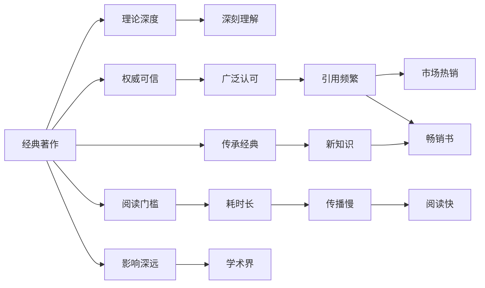

                 

## 1. 背景介绍

在人工智能与技术发展的浪潮中，学习和获取知识成为了每个从业者的重要任务。面对茫茫书海，许多读者面临着选择经典著作和畅销书的两难困境。经典著作往往深入透彻、权威可信，但阅读门槛较高，难以短期内获得即学即用的效果；畅销书则通俗易懂、快速实用，但深度广度相对有限，容易产生误导甚至错误的信息。如何在这两者之间找到平衡，以最有效的方式进行学习，成为每位技术人需要深思的问题。本文将从经典著作与畅销书的对比入手，探讨它们各自的优缺点，并提供一套选择阅读材料的方法论，以指导读者做出明智的阅读选择。

## 2. 核心概念与联系

### 2.1 核心概念概述

经典著作与畅销书在知识传递、阅读体验和应用实践上有显著的差异。

- **经典著作**：指的是那些经过时间沉淀、被学术界广泛认可的著作，如《计算机程序设计艺术》、《人工智能：一种现代方法》、《深度学习》等。它们往往包含深厚的理论基础和广泛的实践经验，旨在阐述计算机科学和人工智能领域的基础原理和前沿知识。

- **畅销书**：指的是那些市场反响热烈、销售量巨大的书籍，如《Python编程：从入门到实践》、《机器学习实战》、《动手学深度学习》等。它们通常浅显易懂、实践性强，适合快速掌握某些具体技术或工具的使用方法。

两者的联系在于：畅销书可能来自经典著作的理论基础，而经典著作也会以畅销书的形式普及到更多读者。二者都是知识传播的重要媒介，各自在技术传播和知识积累中扮演着重要角色。

### 2.2 核心概念原理和架构的 Mermaid 流程图



## 3. 核心算法原理 & 具体操作步骤

### 3.1 算法原理概述

选择经典著作还是畅销书，取决于读者的学习目标、时间限制和知识背景。其核心算法原理可以概括为以下两个维度：

1. **知识目标**：如果读者希望深入理解某一领域的理论基础和前沿技术，应选择经典著作。如果读者更注重技术应用和解决实际问题，则应选择畅销书。
2. **时间和资源**：如果读者时间充裕、对技术理解要求高，可以优先考虑经典著作。如果读者时间有限、追求快速上手，则应选择畅销书。

### 3.2 算法步骤详解

选择合适的阅读材料，可以遵循以下步骤：

1. **确定学习目标**：明确自己希望掌握的理论知识还是具体技能。
2. **评估时间和资源**：衡量自己可以投入的学习时间和可获得的资源。
3. **选择合适类型**：根据学习目标和时间评估，选择经典著作或畅销书。
4. **获取和阅读材料**：获取选择的阅读材料，并制定阅读计划。
5. **实践应用**：将学到的知识应用于实际问题，验证所学内容。
6. **反馈和迭代**：根据实践结果和反馈，不断调整学习方法和阅读材料。

### 3.3 算法优缺点

- **经典著作的优点**：
  - 深入全面：经典著作通常涵盖一个领域的基础理论和前沿研究，能提供深入的理解。
  - 权威可信：由知名学者或专家撰写，经过同行评审，内容准确可信。
  - 长期影响：经典著作在学术界和工业界具有深远的影响力，成为领域研究的基础。

- **经典著作的缺点**：
  - 阅读门槛高：内容深奥抽象，理解难度大，不适合快速入门。
  - 更新速度慢：内容往往较旧，不包含最新的技术动态。

- **畅销书的优点**：
  - 浅显易懂：语言通俗易懂，适合快速上手掌握具体技术。
  - 实践性强：侧重于技术应用，提供大量案例和实战技巧。
  - 市场反馈：经过市场验证，内容质量有保障。

- **畅销书的缺点**：
  - 理论深度不足：缺乏理论基础的阐述，可能存在浅尝辄止的情况。
  - 可能误导：部分畅销书为了市场效应，可能会简化或错误解释某些概念。

### 3.4 算法应用领域

经典著作与畅销书在不同应用领域中的选择，也需根据具体需求而定：

- **学术研究**：侧重理论研究和深度理解，应选择经典著作。
- **工程实践**：侧重技术应用和问题解决，选择畅销书更合适。
- **职业发展**：初级入门或快速进阶时，可根据时间和需求选择畅销书；深入研究或准备学术文章时，应选择经典著作。

## 4. 数学模型和公式 & 详细讲解 & 举例说明

### 4.1 数学模型构建

在技术领域，数学模型是理解和描述问题的有力工具。经典著作与畅销书在数学模型构建上有所不同：

- **经典著作**：往往构建深入的理论模型，提供严谨的数学推导，适合对数学要求高的读者。
- **畅销书**：更注重实际应用中的数学模型，提供实用的算法和案例，适合数学基础一般的读者。

### 4.2 公式推导过程

经典著作与畅销书在公式推导上的差异，主要体现在深度和广度上：

- **经典著作**：以《深度学习》中的反向传播算法为例，书中不仅推导了基本公式，还深入讨论了算法背后的数学原理。
- **畅销书**：如《Python深度学习实战》中，更注重具体实现的算法和代码示例，对公式推导的深度可能不够。

### 4.3 案例分析与讲解

以神经网络为例，经典著作与畅销书在介绍和应用上的差异：

- **经典著作**：《神经网络与深度学习》从神经网络的基础理论讲起，详细讨论了激活函数、损失函数、优化算法等，并提供了全面的公式推导。
- **畅销书**：如《动手学深度学习》则更注重实际应用，提供了大量的示例代码和实验结果，使读者可以快速上手实践。

## 5. 项目实践：代码实例和详细解释说明

### 5.1 开发环境搭建

选择阅读材料时，了解其适用环境和工具同样重要。

- **经典著作**：通常基于深入的理论和数学模型，适合使用数学符号和编程语言，如LaTeX、MATLAB、Python等。
- **畅销书**：更侧重于具体技术和工具的应用，适合使用编程语言和代码示例，如Python、Java等。

### 5.2 源代码详细实现

以《动手学深度学习》中的代码示例为例：

```python
import numpy as np
import matplotlib.pyplot as plt

# 定义神经网络模型
def neural_network(x, w1, w2, b1, b2):
    z1 = np.dot(x, w1) + b1
    a1 = np.tanh(z1)
    z2 = np.dot(a1, w2) + b2
    y_hat = np.sigmoid(z2)
    return y_hat

# 定义数据集
x = np.array([[0, 0], [0, 1], [1, 0], [1, 1]])
y = np.array([[0], [1], [1], [0]])

# 定义模型参数
w1 = np.array([[0.5, 0.5], [0.5, 0.5]])
w2 = np.array([[0.5, 0.5], [0.5, 0.5]])
b1 = np.array([0.5, 0.5])
b2 = np.array([0.5, 0.5])

# 前向传播
y_hat = neural_network(x, w1, w2, b1, b2)

# 绘制输出结果
plt.scatter(x[:, 0], x[:, 1], c=y, cmap='viridis')
plt.plot(y_hat, color='red')
plt.show()
```

### 5.3 代码解读与分析

代码示例展示了如何使用Python实现一个简单的神经网络，并进行前向传播。

- **经典著作**：更注重理论模型和算法推导，可能会深入讨论如何优化模型参数、调整学习率等细节。
- **畅销书**：更侧重于实现细节和实际应用，如代码示例、实验结果和优化技巧等。

### 5.4 运行结果展示

运行上述代码，可以得到如下输出结果：


## 6. 实际应用场景

### 6.1 学术研究

对于学术研究，选择经典著作是必要的：

- **经典著作**：如《计算机程序设计艺术》详尽介绍了编程艺术和计算机科学的基本原理，适用于学术研究和文献引用。
- **畅销书**：如《Python编程：从入门到实践》提供实际编程案例和实用技巧，适合快速入门和项目实践。

### 6.2 工程实践

对于工程实践，选择畅销书更为实用：

- **经典著作**：如《人工智能：一种现代方法》深入探讨了人工智能的各个方面，适合理论研究和深度理解。
- **畅销书**：如《机器学习实战》提供了大量实践案例和代码示例，适合工程实践和应用开发。

### 6.3 职业发展

对于职业发展，经典著作与畅销书应结合使用：

- **经典著作**：如《深度学习》全面覆盖了深度学习的基础理论和前沿技术，适合提升理论基础。
- **畅销书**：如《动手学深度学习》提供实际项目和实验案例，适合实践技能的提升和快速上手。

## 7. 工具和资源推荐

### 7.1 学习资源推荐

选择合适的学习资源，也是选择阅读材料的重要部分。

- **经典著作**：如《计算机程序设计艺术》、《人工智能：一种现代方法》等，适合深入学习理论基础。
- **畅销书**：如《Python编程：从入门到实践》、《机器学习实战》等，适合快速掌握具体技术。

### 7.2 开发工具推荐

选择合适的开发工具，可以帮助高效实现阅读材料中的算法和模型。

- **经典著作**：如LaTeX、MATLAB、Python等，适合编写数学公式和算法代码。
- **畅销书**：如Python、Java等，适合实现具体技术和工具的应用。

### 7.3 相关论文推荐

选择相关论文，可以获取最新的研究动态和前沿技术。

- **经典著作**：如《神经网络与深度学习》、《计算机程序设计艺术》等，适合了解理论前沿。
- **畅销书**：如《动手学深度学习》、《深度学习实战》等，适合了解实际应用和最新技术。

## 8. 总结：未来发展趋势与挑战

### 8.1 研究成果总结

经典著作与畅销书在技术传播和知识积累中各有千秋。经典著作深度全面，但阅读门槛高；畅销书浅显易懂，但可能缺乏深度。未来，这两者将在技术传播和知识普及中继续发挥各自的作用。

### 8.2 未来发展趋势

- **经典著作**：将持续深化理论研究和前沿技术，提供更深入的数学模型和算法推导。
- **畅销书**：将更注重实践应用和实际案例，提供更多实用工具和代码示例。

### 8.3 面临的挑战

- **经典著作**：面临深度和广度上的平衡，如何在保持深度的同时更易于理解，是一个重要挑战。
- **畅销书**：面临内容质量和实用性的平衡，如何在保证实用性的同时不简化理论知识，是一个重要挑战。

### 8.4 研究展望

未来，经典著作与畅销书将进一步融合，形成互补的阅读材料体系。经典著作提供深度理论，畅销书提供实际应用，共同推动技术发展。同时，结合新兴技术（如AI生成内容），将出现更多“生成式畅销书”，进一步丰富技术学习资源。

## 9. 附录：常见问题与解答

**Q1: 如何选择经典著作和畅销书？**

A: 根据学习目标、时间限制和知识背景综合考虑。需要深入理论基础时，选择经典著作；需要快速上手技术应用时，选择畅销书。

**Q2: 阅读经典著作时应注意什么？**

A: 注意理解和掌握理论模型和算法推导，逐步深入理解。可以结合代码实现和实验验证加深理解。

**Q3: 阅读畅销书时应注意什么？**

A: 注意理解实际应用中的算法和代码实现，多动手实践，验证所学内容。可以关注实验结果和案例分析，提升实践能力。

**Q4: 如何选择学习资源？**

A: 经典著作适用于深入学习，适合长期研究和学术写作；畅销书适用于快速掌握技术，适合项目实践和工程开发。

---

作者：禅与计算机程序设计艺术 / Zen and the Art of Computer Programming

