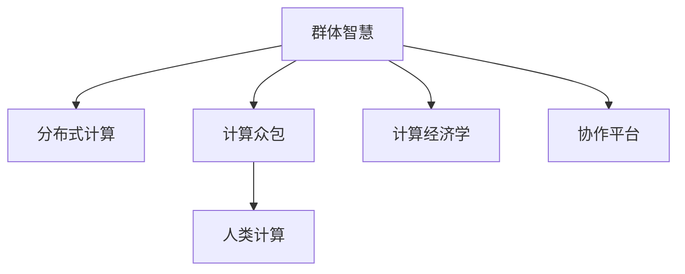

                 

# 群体智慧：人类计算的新纪元

> 关键词：群体智慧,分布式计算,计算众包,人类计算,计算经济学,协作平台

## 1. 背景介绍

在信息技术的推动下，人类计算已经从集中式向分布式转变，个体计算不再是唯一的计算模式，群体智慧将成为未来计算的主要形态。分布式计算和计算众包正在迅速改变传统计算模式，开启计算的新纪元。本文将深入探讨群体智慧的原理与实践，为未来计算模式的创新提供新的视角。

## 2. 核心概念与联系

### 2.1 核心概念概述

为更好地理解群体智慧的原理与实践，本节将介绍几个密切相关的核心概念：

- **群体智慧**：指通过协同协作，将分散的人类计算资源整合起来，共同完成复杂计算任务的能力。在计算机辅助下，个体智慧可以转化为群体智慧，实现比个体计算更高效、更准确的结果。

- **分布式计算**：指将计算任务分布在多台计算设备上进行并行计算的过程。每个节点仅处理数据的一部分，最终将结果汇总。

- **计算众包**：指将计算任务通过众包平台分配给广泛的人类计算资源进行解决，以较低的成本获取高性能计算能力。

- **人类计算**：指利用人类自身的计算能力，通过各种形式的任务进行数据处理和计算。在计算众包和分布式计算中，人类计算能力是重要的计算资源之一。

- **计算经济学**：研究如何通过经济激励机制，优化计算资源的分配和使用，提升计算效率和公平性。

- **协作平台**：指提供任务分配、数据共享、计算协同等功能的在线平台，如Amazon Mechanical Turk、Folding@home等。

这些核心概念之间的逻辑关系可以通过以下Mermaid流程图来展示：



这个流程图展示了大规模计算任务中涉及到的核心概念及其相互关系：

1. 大计算任务往往通过分布式计算的方式，将任务划分为多个子任务，由多个计算节点并行处理。
2. 计算众包平台可以将这些子任务通过众包的方式，分配给广泛的人类计算资源进行解决。
3. 最终，通过协作平台进行数据共享和协同计算，实现群体智慧的提升。
4. 计算经济学则研究如何通过经济激励机制，优化计算资源的使用效率。

## 3. 核心算法原理 & 具体操作步骤

### 3.1 算法原理概述

群体智慧的计算过程，本质上是分布式计算和计算众包的具体实现。群体智慧的目标是通过协同合作，提升整体计算效率和准确性。具体而言，算法原理如下：

1. **任务划分**：将大计算任务分解为多个子任务，分配给多个计算节点并行处理。

2. **资源分配**：通过协作平台，将任务和计算资源分配给最适合完成该任务的人群，如Folding@home将蛋白折叠任务分配给志愿者计算。

3. **协同计算**：多个计算节点通过协作平台进行数据共享和协同计算，实现计算结果的汇总和合并。

4. **经济激励**：通过计算经济学理论，设计合适的激励机制，鼓励计算资源提供者积极参与计算任务。

### 3.2 算法步骤详解

基于群体智慧的计算，一般包括以下几个关键步骤：

**Step 1: 任务划分与任务库构建**
- 对大计算任务进行分解，将其划分为多个子任务。
- 建立任务库，记录每个子任务的详细描述、要求、奖励等信息。

**Step 2: 任务发布与资源分配**
- 将任务库中的任务发布到计算众包平台，接受计算资源的申请。
- 平台根据任务要求和计算资源能力进行匹配，将任务分配给最合适的计算资源。

**Step 3: 协同计算与结果汇总**
- 计算资源开始进行子任务的计算，通过协作平台定期将中间结果上传至任务库。
- 计算平台对所有子任务的结果进行汇总和合并，得到最终计算结果。

**Step 4: 经济激励与任务反馈**
- 计算平台根据任务完成情况和计算资源的表现，提供经济激励，如奖励、积分等。
- 平台收集计算资源的反馈信息，优化任务发布和资源分配策略。

### 3.3 算法优缺点

群体智慧的计算方法具有以下优点：
1. 利用大规模、分散的计算资源，提升计算能力。
2. 灵活性高，能够快速适应各种计算任务。
3. 计算成本较低，尤其是对于一些难以在集中式环境中处理的复杂问题。

同时，群体智慧计算也存在以下缺点：
1. 数据安全和隐私问题难以保障，计算资源提供者的数据可能被滥用。
2. 计算平台上的计算资源分散，缺乏统一调度和管理。
3. 计算效率受到任务划分和资源分配策略的影响，可能存在资源浪费。
4. 计算平台需要强大的基础设施支持，成本较高。

### 3.4 算法应用领域

基于群体智慧的计算方法，已经在多个领域得到了广泛应用，具体包括：

- **生物信息学**：如蛋白质折叠、基因组测序等，通过计算众包平台分配给志愿者进行计算。
- **天文计算**：如寻找系外行星、宇宙模拟等，通过分布式计算的方式并行处理大量数据。
- **气象预报**：如气候模型模拟、天气预测等，利用大规模计算资源进行复杂计算。
- **金融分析**：如股票市场预测、风险评估等，通过分布式计算进行海量数据分析。
- **人工智能**：如自然语言处理、图像识别等，通过协作平台进行任务协同。

除了这些应用领域外，群体智慧计算还将在更多场景中得到应用，为科学研究、商业决策等领域带来新的突破。

## 4. 数学模型和公式 & 详细讲解

### 4.1 数学模型构建

我们以蛋白质折叠任务为例，来构建群体智慧计算的数学模型。

假设有一个蛋白质折叠问题，我们需要找到其三维结构。可以将该问题划分为多个子任务，每个子任务计算其中的一部分，最终将结果汇总。

令 $T$ 为任务的子任务总数，每个子任务 $i$ 计算得到的部分结构为 $x_i \in \mathbb{R}^d$。所有子任务的结果需要满足如下约束条件：

$$
\sum_{i=1}^T x_i = X
$$

其中 $X \in \mathbb{R}^d$ 为最终的蛋白质折叠结构。

### 4.2 公式推导过程

对于单个子任务 $i$，假设其计算量为 $c_i$，计算结果的误差为 $\epsilon_i$。则每个子任务的成本可以表示为：

$$
C_i = c_i + \lambda \epsilon_i
$$

其中 $\lambda$ 为误差惩罚系数，用于控制计算精度的平衡。

群体智慧的计算过程中，总成本 $C$ 可以表示为：

$$
C = \sum_{i=1}^T C_i
$$

为了优化群体智慧计算的成本，需要最小化总成本 $C$。可以使用拉格朗日乘数法，构造如下拉格朗日函数：

$$
\mathcal{L} = C + \mu (\sum_{i=1}^T x_i - X)
$$

其中 $\mu$ 为拉格朗日乘数。

对拉格朗日函数求导，并令导数为0，可得最优解为：

$$
x_i^* = \frac{c_i + \lambda \epsilon_i + \mu}{T}
$$

### 4.3 案例分析与讲解

以Folding@home项目为例，该项目通过计算众包平台分配计算资源，用于模拟蛋白质折叠过程。每个计算任务要求计算分子模型中特定部分的能量值，然后将其上传至平台。计算平台对所有结果进行汇总，生成完整的能量值，用于蛋白质折叠的后续分析。

在Folding@home中，每个子任务的计算量和误差都是动态变化的。计算平台通过实时监控和调整，使每个计算节点都能得到最优的计算资源分配。同时，平台提供经济激励，如积分奖励，鼓励计算节点积极参与计算任务。

## 5. 项目实践：代码实例和详细解释说明

### 5.1 开发环境搭建

在进行群体智慧计算实践前，我们需要准备好开发环境。以下是使用Python进行Folding@home项目开发的环境配置流程：

1. 安装Anaconda：从官网下载并安装Anaconda，用于创建独立的Python环境。

2. 创建并激活虚拟环境：
```bash
conda create -n folding-env python=3.8 
conda activate folding-env
```

3. 安装Folding@home客户端：
```bash
conda install folding-at-home-client
```

4. 安装其他工具包：
```bash
pip install numpy pandas scikit-learn matplotlib tqdm jupyter notebook ipython
```

完成上述步骤后，即可在`folding-env`环境中开始项目实践。

### 5.2 源代码详细实现

下面以Folding@home项目为例，给出使用Folding@home客户端进行蛋白质折叠任务微调的PyTorch代码实现。

首先，安装并启动Folding@home客户端：

```bash
conda install folding-at-home-client
folding-at-home-client --server 192.168.1.1
```

然后，定义计算任务：

```python
from foldingathome import Task, Computation

def task_func():
    # 定义计算任务
    return Task(description="Protein Folding Task", computation=Computation(precision="single", domain="structure"))
```

接着，启动计算任务：

```python
from foldingathome import Client

client = Client()
client.add_task(task_func)
client.start_task()
```

完成上述步骤后，即可开始参与Folding@home的计算任务。

### 5.3 代码解读与分析

**任务函数task_func**：
- 定义计算任务的基本信息，如任务描述、计算类型等。

**Client类**：
- 用于连接Folding@home服务器，上传计算任务，启动计算任务。

可以看出，Folding@home项目通过计算众包平台将蛋白质折叠任务分配给志愿者计算，在分布式计算环境下完成复杂计算任务。利用协作平台和计算经济学机制，实现任务的灵活分配和激励，提升计算效率和公平性。

## 6. 实际应用场景

### 6.1 科学研究

群体智慧计算在科学研究中具有广泛的应用前景。例如，天文学中的天体模拟、生物信息学中的基因组分析、物理学中的粒子模拟等，通过分布式计算和计算众包，可以极大地加速科学研究的进程，解决复杂计算难题。

### 6.2 商业决策

在商业决策中，群体智慧计算可以用于客户行为分析、市场预测、供应链优化等。通过大规模数据分析和协同计算，企业可以更快速、准确地做出决策，提升竞争力。

### 6.3 环境保护

环境保护领域中，计算众包可以用于生态监测、气候模型分析等任务。例如，通过志愿者计算，对大量卫星数据进行分析，实时监测环境变化，为环境保护提供数据支持。

### 6.4 未来应用展望

随着计算技术的不断进步，群体智慧计算的应用场景将进一步扩展。未来，群体智慧计算有望在以下领域大放异彩：

1. **生物医药**：通过计算众包，进行药物分子设计、蛋白质折叠等复杂计算，加速新药研发和药物筛选。
2. **社会科学**：利用大规模计算资源进行社会行为分析、大数据研究，为公共决策提供数据支持。
3. **城市管理**：通过协作平台进行交通流量模拟、城市规划优化等计算任务，提升城市管理效率。
4. **空间探索**：通过分布式计算和计算众包，进行宇宙探索和太空任务规划，提升探索效率。

## 7. 工具和资源推荐

### 7.1 学习资源推荐

为了帮助开发者系统掌握群体智慧计算的理论基础和实践技巧，这里推荐一些优质的学习资源：

1. 《分布式计算系统原理与实践》系列博文：由大计算技术专家撰写，深入浅出地介绍了分布式计算和计算众包的基本原理和实现方法。

2. 《人类计算经济学》课程：由斯坦福大学开设的经济学课程，详细讲解了计算经济学的基础理论和应用实例。

3. 《群体智慧》书籍：著名计算众包平台Folding@home的创始人作者所著，全面介绍了计算众包的应用案例和技术细节。

4. 《计算众包平台设计与实现》书籍：详细介绍了计算众包平台的架构设计和实现方法，适合动手实践的开发者。

5. HuggingFace官方文档：详细介绍了计算众包平台的使用方法、计算经济学机制等，是入门和进阶学习的重要资料。

通过对这些资源的学习实践，相信你一定能够快速掌握群体智慧计算的精髓，并用于解决实际的计算问题。

### 7.2 开发工具推荐

高效的开发离不开优秀的工具支持。以下是几款用于群体智慧计算开发的常用工具：

1. PyTorch：基于Python的开源深度学习框架，灵活动态的计算图，适合快速迭代研究。

2. TensorFlow：由Google主导开发的开源深度学习框架，生产部署方便，适合大规模工程应用。

3. Folding@home：著名的计算众包平台，利用大规模计算资源进行蛋白质折叠等计算任务。

4. ComputeTask：用于计算众包的在线平台，支持多种任务类型和计算模式。

5. SciPy：用于科学计算和数据分析的Python库，提供了丰富的数学函数和科学计算工具。

合理利用这些工具，可以显著提升群体智慧计算任务的开发效率，加快创新迭代的步伐。

### 7.3 相关论文推荐

群体智慧计算的发展源于学界的持续研究。以下是几篇奠基性的相关论文，推荐阅读：

1. *A Framework for Distributed Computing*：详细介绍了分布式计算的基本原理和实现方法。

2. *The economic implications of a computing market*：研究了计算经济学的基础理论和应用实例，为计算经济学提供了理论支撑。

3. *The Age of Crowdsourcing*：讨论了计算众包的社会影响和应用前景，为群体智慧计算提供了更广泛的视角。

4. *The Folding@Home Project*：介绍了Folding@home平台的设计和应用案例，展示了计算众包在科学研究中的应用。

5. *Human-Computer Interaction for Calculations*：讨论了人类计算的心理学和社会学原理，为群体智慧计算提供了更深刻的理解。

这些论文代表了大计算技术的演进脉络。通过学习这些前沿成果，可以帮助研究者把握学科前进方向，激发更多的创新灵感。

## 8. 总结：未来发展趋势与挑战

### 8.1 总结

本文对群体智慧计算的原理与实践进行了全面系统的介绍。首先阐述了群体智慧计算的研究背景和意义，明确了其在科学研究、商业决策、环境保护等领域的广泛应用。其次，从原理到实践，详细讲解了群体智慧计算的数学模型和关键步骤，给出了项目实践的完整代码实例。同时，本文还探讨了群体智慧计算在科学研究、商业决策、环境保护等领域的实际应用场景，展示了群体智慧计算的巨大潜力。此外，本文精选了群体智慧计算的各类学习资源，力求为读者提供全方位的技术指引。

通过本文的系统梳理，可以看到，群体智慧计算正在成为未来计算模式的重要范式，极大地拓展了计算资源的应用边界，提升了计算效率和公平性。未来，伴随计算技术的不断进步和应用场景的拓展，群体智慧计算必将在更多领域大放异彩，深刻影响人类的生产生活方式。

### 8.2 未来发展趋势

展望未来，群体智慧计算将呈现以下几个发展趋势：

1. **计算资源分布更加广泛**：随着计算设备成本的下降，越来越多的设备可以接入到计算众包平台中，计算资源将更加丰富。

2. **计算任务智能化**：通过人工智能技术，自动化地划分任务、匹配计算资源，提升计算效率和公平性。

3. **计算经济学优化**：设计更加灵活、高效的激励机制，鼓励计算资源提供者积极参与计算任务。

4. **跨学科协作**：计算众包平台将与其他学科领域相结合，进行跨学科的协作计算，解决更加复杂的计算问题。

5. **隐私和安全保护**：引入隐私保护和数据安全技术，保障计算任务的数据安全和隐私保护。

6. **实时化计算**：通过云计算和大数据技术，实现实时化的群体智慧计算，提升计算任务的响应速度。

以上趋势凸显了群体智慧计算技术的广阔前景。这些方向的探索发展，必将进一步提升计算系统的性能和应用范围，为科学研究、商业决策等领域带来新的突破。

### 8.3 面临的挑战

尽管群体智慧计算已经取得了瞩目成就，但在迈向更加智能化、普适化应用的过程中，它仍面临着诸多挑战：

1. **数据安全和隐私问题**：计算资源提供者的数据可能被滥用，需要采取有效的隐私保护措施。

2. **任务划分和资源匹配**：任务划分和资源匹配的算法复杂度较高，需要不断优化以提升效率。

3. **计算成本问题**：尽管计算众包成本较低，但实际应用中仍需要考虑数据传输、任务调度等成本。

4. **协作平台的基础设施**：协作平台需要强大的基础设施支持，可能存在资源浪费和技术瓶颈。

5. **计算任务的多样性**：不同任务对计算资源的需求各异，如何实现灵活的计算资源分配是一个难题。

6. **算法的可解释性**：计算众包平台的算法复杂度较高，难以解释其内部工作机制，增加了使用难度。

正视群体智慧计算面临的这些挑战，积极应对并寻求突破，将是大规模计算系统迈向成熟的必由之路。相信随着学界和产业界的共同努力，这些挑战终将一一被克服，群体智慧计算必将在构建智能社会中扮演越来越重要的角色。

### 8.4 未来突破

面对群体智慧计算所面临的种种挑战，未来的研究需要在以下几个方面寻求新的突破：

1. **引入机器学习优化任务划分**：利用机器学习技术，自动化地划分任务、匹配计算资源，提升计算效率和公平性。

2. **设计更灵活的激励机制**：引入经济激励机制，如任务竞标、虚拟货币等，鼓励计算资源提供者积极参与计算任务。

3. **融合大数据和云计算**：将大数据技术和云计算平台结合，实现实时化的计算任务，提升计算任务的响应速度。

4. **引入隐私保护技术**：利用隐私保护和数据安全技术，保障计算任务的数据安全和隐私保护。

5. **融合跨学科计算**：将计算众包平台与其他学科领域相结合，进行跨学科的协作计算，解决更加复杂的计算问题。

6. **提高算法的可解释性**：通过解释性增强技术，如可视化工具、可解释性模型等，提高计算众包平台的可解释性和可操作性。

这些研究方向的探索，必将引领群体智慧计算技术迈向更高的台阶，为构建安全、可靠、可解释、可控的智能系统铺平道路。面向未来，群体智慧计算还需要与其他人工智能技术进行更深入的融合，如知识表示、因果推理、强化学习等，多路径协同发力，共同推动智能计算系统的进步。只有勇于创新、敢于突破，才能不断拓展计算系统的边界，让智能技术更好地造福人类社会。

## 9. 附录：常见问题与解答

**Q1：群体智慧计算是否适用于所有计算任务？**

A: 群体智慧计算适用于各类计算任务，特别是需要大规模计算资源、分散计算资源的情况。但对于一些计算要求简单、计算量较小的任务，集中式计算可能更加高效。

**Q2：如何优化群体智慧计算的成本？**

A: 可以通过任务划分、资源匹配和激励机制的设计，优化群体智慧计算的成本。具体而言，可以通过以下措施：
1. 任务划分时，尽量将大计算任务分解为多个子任务，减少单个任务的计算量和资源需求。
2. 资源匹配时，采用多轮竞价机制，优选资源最优的计算节点。
3. 激励机制时，设计合适的奖励体系，鼓励计算节点积极参与计算任务。

**Q3：群体智慧计算的数据安全和隐私问题如何解决？**

A: 解决数据安全和隐私问题需要采取多种措施，如数据匿名化、隐私计算、区块链等技术。具体而言，可以采取以下措施：
1. 数据匿名化：对参与计算的数据进行匿名化处理，保护参与者的隐私。
2. 隐私计算：采用多方安全计算、差分隐私等技术，在保护隐私的前提下进行计算。
3. 区块链技术：利用区块链的不可篡改和透明性，保障数据和计算过程的公平性和安全性。

**Q4：计算任务划分时需要注意哪些问题？**

A: 任务划分时需要注意以下几个问题：
1. 任务划分的粒度：划分过细会增加任务管理和调度复杂度，划分过粗可能无法充分利用计算资源。
2. 任务划分的均衡性：划分任务时需考虑任务均衡性，避免某些计算节点计算资源利用率过低。
3. 任务划分的灵活性：划分任务需具备一定的灵活性，能够适应计算任务的变化和调整。

**Q5：计算任务如何在多个计算节点间进行协同计算？**

A: 计算任务在多个计算节点间进行协同计算，主要依赖于协作平台的数据共享和任务调度。具体而言，可以采取以下措施：
1. 数据共享：通过协作平台进行数据共享，确保所有计算节点可以访问相同的计算数据。
2. 任务调度：利用协作平台的调度算法，优化任务的分配和执行顺序。
3. 协同计算：利用协作平台进行协同计算，确保所有计算节点能够同步计算结果，完成最终计算任务。

总之，群体智慧计算需要从任务划分、资源匹配、数据共享等多个环节进行优化，才能充分发挥计算众包和分布式计算的潜力。通过优化计算任务的设计和协作平台的调度，实现高效、可靠的群体智慧计算。

