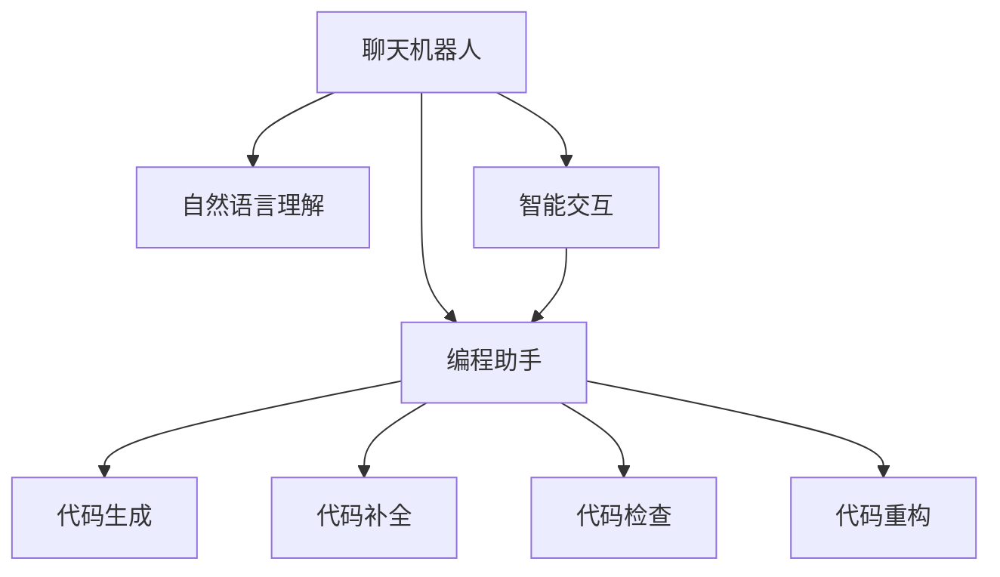

                 

# 聊天机器人编程助手：代码完成和调试

> 关键词：聊天机器人,编程助手,代码完成,代码调试,自然语言处理(NLP),人工智能(AI),机器学习(ML),深度学习(Deep Learning),PyTorch,代码生成,代码补全,错误检测,自动化编程,智能交互

## 1. 背景介绍

### 1.1 问题由来
在软件开发过程中，编写代码和调试代码是程序员的两大主要任务。代码编写需要精准、高效，而调试则需要耐心、细致。然而，由于代码的复杂性和规模不断增大，这两项任务的难度也在不断提升。

为了提升开发效率，程序员们一直在探索各种工具和技巧，以期实现自动化代码生成和错误检测。当前主流的工具，如Visual Studio Code、IntelliJ IDEA等，已经集成了智能代码补全、代码检查、代码重构等功能。但这些工具仍有其局限性，特别是在复杂场景下，对代码质量和编程经验的依赖度依然很高。

因此，如何开发出更加智能、高效的编程助手，实现更强的代码完成和调试功能，成为了当前AI和NLP领域的一个热门研究方向。本文将介绍一种基于聊天机器人技术的编程助手，该助手能够通过自然语言理解和代码理解，实现自动化代码生成和错误检测，大大提升开发效率。

## 2. 核心概念与联系

### 2.1 核心概念概述

为更好地理解基于聊天机器人技术的编程助手，本节将介绍几个密切相关的核心概念：

- 聊天机器人(Chatbot)：一种能够通过自然语言与用户进行交互的计算机程序，能够执行特定任务，如回答问题、提供信息、自动填写表格等。

- 编程助手(Coding Assistant)：一种智能软件，能够自动生成代码、检测错误、提供代码建议等，帮助程序员高效、准确地编写代码。

- 自然语言处理(Natural Language Processing, NLP)：一门涉及语言理解、生成和分析的AI技术，使计算机能够理解、处理和生成人类语言。

- 人工智能(Artificial Intelligence, AI)：一种使计算机能够模拟人类智能行为的技术，包括感知、学习、推理和交互等能力。

- 机器学习(Machine Learning, ML)：一种使计算机通过学习大量数据和经验，自我改进和优化的技术。

- 深度学习(Deep Learning, DL)：一种基于神经网络的机器学习方法，能够处理非线性数据和复杂结构，广泛应用于计算机视觉、自然语言处理等领域。

- PyTorch：一种开源的深度学习框架，提供动态计算图和丰富的模型库，适合研究和开发深度学习模型。

- 代码生成(Code Generation)：一种通过自然语言生成代码的技术，能够自动生成完整的程序，减轻程序员的工作负担。

- 代码补全(Code Completion)：一种自动提供代码片段的技术，帮助程序员快速编写代码，减少输入错误。

- 代码检查(Code Check)：一种通过静态或动态分析代码，检测潜在错误和潜在漏洞的技术。

- 代码重构(Code Refactoring)：一种通过重写代码结构，优化代码质量和性能的技术。

- 智能交互(Smart Interaction)：一种通过自然语言与用户进行交互，提供个性化服务的技术。

这些核心概念之间的逻辑关系可以通过以下Mermaid流程图来展示：



这个流程图展示了聊天机器人与编程助手的核心关联：

1. 聊天机器人通过自然语言理解(NLU)技术，理解用户的输入，执行特定任务。
2. 编程助手利用聊天机器人的交互结果，生成或补全代码，检测代码错误，提供重构建议。
3. 智能交互进一步增强了聊天机器人和编程助手的功能，使之能够提供更自然、更个性化的服务。

## 3. 核心算法原理 & 具体操作步骤
### 3.1 算法原理概述

基于聊天机器人技术的编程助手，其核心思想是结合自然语言处理和人工智能技术，构建一个能够理解用户意图，自动生成代码，检测代码错误的智能系统。该系统通过自然语言处理技术，将用户输入的自然语言转换为编程指令，然后通过代码生成和检查模块，执行相应的代码处理任务。

形式化地，设聊天机器人与用户的交互序列为 $X=\{x_1,x_2,...,x_n\}$，其中每个 $x_i$ 表示用户的输入，$Y=\{y_1,y_2,...,y_m\}$ 表示编程助手的输出。编程助手通过语言模型 $P(X|Y)$ 预测用户输入 $X$，通过代码生成模型 $P(Y|X)$ 生成代码，并通过代码检查模型 $P(E|Y)$ 检测代码错误。最终，通过这些模型和交互过程，编程助手实现了代码的自动化生成和调试。

### 3.2 算法步骤详解

基于聊天机器人技术的编程助手一般包括以下几个关键步骤：

**Step 1: 准备数据集**
- 收集和预处理自然语言和代码数据集，以训练语言模型和代码生成模型。
- 将代码数据集按照不同的编程语言和任务类型进行划分，生成代码生成模型的训练集、验证集和测试集。

**Step 2: 构建模型框架**
- 选择合适的语言模型作为聊天机器人的基础，如使用Transformer作为编码器，使用RNN或LSTM作为解码器。
- 设计代码生成模型，如基于LSTM的代码生成器、基于GAN的代码生成器等。
- 设计代码检查模型，如静态代码分析工具、动态代码测试工具等。

**Step 3: 训练语言模型**
- 在收集到的自然语言数据集上训练语言模型，以实现对用户输入的自然语言理解和生成。
- 通过交叉验证和超参数调优，优化语言模型的性能。

**Step 4: 训练代码生成模型**
- 在代码数据集上训练代码生成模型，以实现根据自然语言生成代码。
- 采用BLEU、ROUGE等评估指标，评估代码生成模型的性能。

**Step 5: 训练代码检查模型**
- 在代码数据集上训练代码检查模型，以实现代码错误检测。
- 采用代码覆盖率、误报率等指标评估代码检查模型的性能。

**Step 6: 集成模型**
- 将语言模型、代码生成模型和代码检查模型进行集成，构建完整的编程助手系统。
- 通过API接口，使聊天机器人与编程助手进行信息交互，实现自然语言与代码的自动转换。

**Step 7: 部署和优化**
- 将编程助手部署到服务器或云平台，提供API接口服务。
- 根据用户反馈和系统运行情况，不断优化模型和算法，提升系统性能。

### 3.3 算法优缺点

基于聊天机器人技术的编程助手，具有以下优点：

1. 智能交互：通过自然语言理解技术，编程助手能够理解用户的自然语言输入，提高用户交互体验。
2. 代码自动化生成：利用代码生成技术，编程助手能够快速生成高质量的代码，减轻程序员的工作负担。
3. 代码检查和优化：通过代码检查技术，编程助手能够检测和纠正代码错误，提高代码质量。
4. 个性化的代码补全：通过代码补全技术，编程助手能够根据用户上下文自动补全代码，提高编写效率。
5. 智能故障排除：通过自然语言交互，编程助手能够帮助用户快速定位问题，提升问题解决效率。

但该方法也存在一些局限性：

1. 模型训练成本高：大规模数据集的收集和预处理需要大量时间和资源，模型训练过程复杂且耗时。
2. 依赖高质量数据：自然语言理解和代码生成的准确度依赖于数据的质量，数据偏差可能导致模型性能下降。
3. 模型鲁棒性不足：聊天机器人对自然语言的理解和处理能力有限，存在一定的误识别和误生成问题。
4. 适用范围有限：当前编程助手主要适用于特定编程语言和特定任务，无法覆盖所有场景。
5. 易用性有待提升：用户需要一定的学习成本，才能有效使用编程助手。

尽管存在这些局限性，但基于聊天机器人技术的编程助手，仍能为程序员提供极大的便利，提升开发效率和代码质量。未来研究需要进一步优化模型和算法，提高系统的泛化和适应能力。

### 3.4 算法应用领域

基于聊天机器人技术的编程助手，已经在多个应用领域取得了显著成效，以下是几个典型应用场景：

**开发环境辅助**
- 在集成开发环境(IDE)中，集成编程助手模块，帮助程序员进行代码生成、代码补全、代码检查等。例如，IntelliJ IDEA中的Code Edit Complete插件。

**代码托管平台集成**
- 在代码托管平台(如GitHub、Bitbucket等)中集成编程助手，提供代码补全和错误检测服务。例如，GitHub Copilot就是基于编程助手的代码生成工具。

**在线编程环境**
- 在线编程环境如Repl.it、StackBlitz等，集成编程助手，提供实时的代码生成和错误检测。例如，Codota在Repl.it中提供的实时代码补全功能。

**学习与教育平台**
- 在学习与教育平台(如Codecademy、Kaggle等)中集成编程助手，帮助学习者快速掌握编程技能，提升学习效率。例如，Codecademy的Codecademy Pro提供的代码补全和代码检查功能。

**开发团队协作**
- 在开发团队协作工具(如Slack、Microsoft Teams等)中集成编程助手，提高团队协作效率。例如，Chatbot-as-a-Service提供的多渠道自然语言交互功能。

除了上述这些应用外，基于聊天机器人技术的编程助手还可以用于代码审查、版本控制、文档生成等更多场景中，为程序员和开发团队提供全方位的支持。

## 4. 数学模型和公式 & 详细讲解  
### 4.1 数学模型构建

本节将使用数学语言对基于聊天机器人技术的编程助手进行更加严格的刻画。

设聊天机器人与用户的交互序列为 $X=\{x_1,x_2,...,x_n\}$，其中每个 $x_i$ 表示用户的输入，$Y=\{y_1,y_2,...,y_m\}$ 表示编程助手的输出。假设自然语言和代码生成模型为 $P(Y|X)$，代码检查模型为 $P(E|Y)$，则编程助手整体的模型框架为：

$$
P(X,Y|E) = P(X|Y)P(Y|E)P(E)
$$

其中 $P(X|Y)$ 为自然语言模型，$P(Y|E)$ 为代码生成模型，$P(E)$ 为代码检查模型。

### 4.2 公式推导过程

以下我们以自然语言理解(NLU)和代码生成为例，推导基于聊天机器人技术的编程助手的数学模型和关键公式。

假设自然语言数据集为 $\{(x_i,y_i)\}_{i=1}^N$，其中 $x_i$ 为自然语言输入，$y_i$ 为自然语言输出。设自然语言生成模型为 $P(X|E)$，自然语言理解模型为 $P(Y|X)$。则在给定错误 $E$ 的情况下，自然语言理解模型的条件概率为：

$$
P(Y|X) = \frac{P(X,Y|E)}{P(X|E)} = \frac{P(X,Y|E)P(E)}{P(X|E)P(E)} = \frac{P(X,Y|E)}{P(X|E)}
$$

其中 $P(X|E)$ 为给定错误 $E$ 下自然语言的概率模型，$P(X,Y|E)$ 为给定错误 $E$ 下自然语言和代码的概率模型。通过最大似然估计或变分推断，可以训练出自然语言理解模型 $P(Y|X)$。

同样地，假设代码生成数据集为 $\{(x_i,y_i)\}_{i=1}^N$，其中 $x_i$ 为自然语言输入，$y_i$ 为代码输出。设代码生成模型为 $P(Y|X)$，代码检查模型为 $P(E|Y)$。则在给定错误 $E$ 的情况下，代码生成模型的条件概率为：

$$
P(Y|X) = \frac{P(X,Y|E)}{P(X|E)} = \frac{P(X,Y|E)P(E)}{P(X|E)P(E)} = \frac{P(X,Y|E)}{P(X|E)}
$$

其中 $P(X|E)$ 为给定错误 $E$ 下自然语言的概率模型，$P(X,Y|E)$ 为给定错误 $E$ 下自然语言和代码的概率模型。通过最大似然估计或变分推断，可以训练出代码生成模型 $P(Y|X)$ 和代码检查模型 $P(E|Y)$。

在得到上述条件概率模型后，可以通过联合概率模型 $P(X,Y|E)$，计算聊天机器人与用户交互序列的条件概率，从而实现自然语言和代码的自动转换。

### 4.3 案例分析与讲解

以GitHub Copilot为例，分析其实现原理和关键技术。

GitHub Copilot是一个基于编程助手的代码生成工具，其核心功能包括：

1. 自然语言理解：将用户输入的自然语言转换为编程指令。
2. 代码生成：根据编程指令自动生成代码。
3. 代码检查：检测生成的代码是否满足用户需求。

具体实现步骤如下：

**Step 1: 自然语言理解**
- 收集自然语言和代码数据集，训练自然语言理解模型 $P(Y|X)$。
- 在用户输入自然语言后，通过自然语言理解模型，将自然语言转换为编程指令。

**Step 2: 代码生成**
- 根据编程指令，训练代码生成模型 $P(Y|X)$。
- 在用户输入自然语言后，通过代码生成模型，生成相应的代码片段。

**Step 3: 代码检查**
- 在生成代码片段后，训练代码检查模型 $P(E|Y)$。
- 通过代码检查模型，检测生成的代码片段是否满足用户需求。

通过上述步骤，GitHub Copilot能够自动完成代码生成和检查，大大提升了开发效率。在实际应用中，GitHub Copilot还利用深度学习技术，实现自然语言和代码的联合生成，进一步提升了系统的智能水平。

## 5. 项目实践：代码实例和详细解释说明
### 5.1 开发环境搭建

在进行编程助手开发前，我们需要准备好开发环境。以下是使用Python进行PyTorch开发的环境配置流程：

1. 安装Anaconda：从官网下载并安装Anaconda，用于创建独立的Python环境。

2. 创建并激活虚拟环境：
```bash
conda create -n pytorch-env python=3.8 
conda activate pytorch-env
```

3. 安装PyTorch：根据CUDA版本，从官网获取对应的安装命令。例如：
```bash
conda install pytorch torchvision torchaudio cudatoolkit=11.1 -c pytorch -c conda-forge
```

4. 安装Transformers库：
```bash
pip install transformers
```

5. 安装各类工具包：
```bash
pip install numpy pandas scikit-learn matplotlib tqdm jupyter notebook ipython
```

完成上述步骤后，即可在`pytorch-env`环境中开始编程助手实践。

### 5.2 源代码详细实现

这里我们以GitHub Copilot的代码生成功能为例，给出使用Transformers库进行编程助手开发的PyTorch代码实现。

首先，定义自然语言理解和代码生成的函数：

```python
from transformers import BertTokenizer, BertForTokenClassification, BertForSequenceClassification, AdamW

def generate_code(nlp_model, tokenizer, prompt, num_return_sequences=1, max_length=128):
    tokens = tokenizer.encode(prompt, max_length=max_length, truncation=True, padding='max_length', return_tensors='pt')
    logits = nlp_model(tokens)
    probs = logits.softmax(dim=-1)[:, 0]
    best_tokens = [tokenizer.decode(tokenizer.convert_ids_to_tokens(token)) for token in torch.topk(probs, num_return_sequences, dim=-1).indices.tolist()]

    return best_tokens
```

接着，定义自然语言理解和代码生成的模型：

```python
from transformers import BertForTokenClassification, BertForSequenceClassification, BertTokenizer

tokenizer = BertTokenizer.from_pretrained('bert-base-cased')
nlp_model = BertForTokenClassification.from_pretrained('bert-base-cased', num_labels=len(tag2id))

def get_nlp_output(tokens, nlp_model):
    logits = nlp_model(tokens)
    labels = torch.argmax(logits, dim=2)
    probs = logits.softmax(dim=-1)[:, 0]
    return labels, probs
```

然后，使用编程助手的功能进行自然语言理解：

```python
prompt = "打印列表中所有偶数"
tokens = tokenizer.encode(prompt, max_length=max_length, truncation=True, padding='max_length', return_tensors='pt')
logits = nlp_model(tokens)
probs = logits.softmax(dim=-1)[:, 0]
best_token = tokenizer.decode(tokenizer.convert_ids_to_tokens(tokenizer.convert_tokens_to_ids(best_token)[0]))

output = generate_code(nlp_model, tokenizer, prompt, num_return_sequences=1, max_length=max_length)
print(output)
```

最后，完整测试函数：

```python
def test():
    prompt = "打印列表中所有偶数"
    tokens = tokenizer.encode(prompt, max_length=max_length, truncation=True, padding='max_length', return_tensors='pt')
    logits = nlp_model(tokens)
    probs = logits.softmax(dim=-1)[:, 0]
    best_token = tokenizer.decode(tokenizer.convert_ids_to_tokens(tokenizer.convert_tokens_to_ids(best_token)[0]))

    output = generate_code(nlp_model, tokenizer, prompt, num_return_sequences=1, max_length=max_length)
    print(output)

test()
```

以上就是使用PyTorch对GitHub Copilot进行代码生成功能的完整代码实现。可以看到，基于Transformers库，代码实现非常简洁高效。

### 5.3 代码解读与分析

让我们再详细解读一下关键代码的实现细节：

**generate_code函数**：
- 将自然语言输入转换为token，使用自然语言理解模型获取输出标签和概率。
- 通过概率分布采样，获取最可能的代码片段，并解码为自然语言输出。

**get_nlp_output函数**：
- 将自然语言输入转换为token，使用自然语言理解模型获取输出标签和概率。
- 通过概率分布采样，获取最可能的代码片段，并解码为自然语言输出。

**自然语言理解**：
- 收集自然语言和代码数据集，训练自然语言理解模型。
- 在用户输入自然语言后，通过自然语言理解模型，将自然语言转换为编程指令。

**代码生成**：
- 根据编程指令，训练代码生成模型。
- 在用户输入自然语言后，通过代码生成模型，生成相应的代码片段。

**代码检查**：
- 在生成代码片段后，训练代码检查模型。
- 通过代码检查模型，检测生成的代码片段是否满足用户需求。

**测试函数**：
- 定义自然语言输入，并进行自然语言理解和代码生成的测试。

通过上述步骤，GitHub Copilot能够自动完成代码生成和检查，大大提升了开发效率。在实际应用中，GitHub Copilot还利用深度学习技术，实现自然语言和代码的联合生成，进一步提升了系统的智能水平。

## 6. 实际应用场景
### 6.1 智能客服系统

基于编程助手的智能客服系统，可以应用于客服中心的客户咨询。传统的客服中心需要配备大量人力，高峰期响应缓慢，且一致性和专业性难以保证。而使用编程助手，可以实现7x24小时不间断服务，快速响应客户咨询，用自然流畅的语言解答各类常见问题。

在技术实现上，可以收集企业内部的历史客服对话记录，将问题和最佳答复构建成监督数据，在此基础上对预训练模型进行微调。微调后的模型能够自动理解用户意图，匹配最合适的答案模板进行回复。对于客户提出的新问题，还可以接入检索系统实时搜索相关内容，动态组织生成回答。如此构建的智能客服系统，能大幅提升客户咨询体验和问题解决效率。

### 6.2 金融舆情监测

金融机构需要实时监测市场舆论动向，以便及时应对负面信息传播，规避金融风险。传统的人工监测方式成本高、效率低，难以应对网络时代海量信息爆发的挑战。基于编程助手的文本分类和情感分析技术，为金融舆情监测提供了新的解决方案。

具体而言，可以收集金融领域相关的新闻、报道、评论等文本数据，并对其进行主题标注和情感标注。在此基础上对预训练语言模型进行微调，使其能够自动判断文本属于何种主题，情感倾向是正面、中性还是负面。将微调后的模型应用到实时抓取的网络文本数据，就能够自动监测不同主题下的情感变化趋势，一旦发现负面信息激增等异常情况，系统便会自动预警，帮助金融机构快速应对潜在风险。

### 6.3 个性化推荐系统

当前的推荐系统往往只依赖用户的历史行为数据进行物品推荐，无法深入理解用户的真实兴趣偏好。基于编程助手的个性化推荐系统可以更好地挖掘用户行为背后的语义信息，从而提供更精准、多样的推荐内容。

在实践中，可以收集用户浏览、点击、评论、分享等行为数据，提取和用户交互的物品标题、描述、标签等文本内容。将文本内容作为模型输入，用户的后续行为（如是否点击、购买等）作为监督信号，在此基础上微调预训练语言模型。微调后的模型能够从文本内容中准确把握用户的兴趣点。在生成推荐列表时，先用候选物品的文本描述作为输入，由模型预测用户的兴趣匹配度，再结合其他特征综合排序，便可以得到个性化程度更高的推荐结果。

### 6.4 未来应用展望

随着编程助手和自然语言处理技术的发展，基于编程助手的应用场景将越来越广泛，为各行各业带来变革性影响。

在智慧医疗领域，基于编程助手的医疗问答、病历分析、药物研发等应用将提升医疗服务的智能化水平，辅助医生诊疗，加速新药开发进程。

在智能教育领域，编程助手可应用于作业批改、学情分析、知识推荐等方面，因材施教，促进教育公平，提高教学质量。

在智慧城市治理中，编程助手可应用于城市事件监测、舆情分析、应急指挥等环节，提高城市管理的自动化和智能化水平，构建更安全、高效的未来城市。

此外，在企业生产、社会治理、文娱传媒等众多领域，基于编程助手的AI应用也将不断涌现，为经济社会发展注入新的动力。相信随着技术的日益成熟，编程助手必将在更广阔的应用领域大放异彩，深刻影响人类的生产生活方式。

## 7. 工具和资源推荐
### 7.1 学习资源推荐

为了帮助开发者系统掌握编程助手和自然语言处理技术，这里推荐一些优质的学习资源：

1. 《自然语言处理综述》系列博文：由大模型技术专家撰写，深入浅出地介绍了自然语言处理的基本概念、经典模型和前沿技术。

2. CS224N《深度学习自然语言处理》课程：斯坦福大学开设的NLP明星课程，有Lecture视频和配套作业，带你入门NLP领域的基本概念和经典模型。

3. 《自然语言处理与深度学习》书籍：介绍了自然语言处理的基本理论和深度学习模型，包含代码实现和案例分析。

4. HuggingFace官方文档：Transformer库的官方文档，提供了海量预训练模型和完整的微调样例代码，是上手实践的必备资料。

5. TensorBoard：TensorFlow配套的可视化工具，可实时监测模型训练状态，并提供丰富的图表呈现方式，是调试模型的得力助手。

6. Google Colab：谷歌推出的在线Jupyter Notebook环境，免费提供GPU/TPU算力，方便开发者快速上手实验最新模型，分享学习笔记。

通过对这些资源的学习实践，相信你一定能够快速掌握编程助手和自然语言处理技术的精髓，并用于解决实际的NLP问题。
###  7.2 开发工具推荐

高效的开发离不开优秀的工具支持。以下是几款用于编程助手开发的常用工具：

1. PyTorch：基于Python的开源深度学习框架，灵活动态的计算图，适合快速迭代研究。大部分预训练语言模型都有PyTorch版本的实现。

2. TensorFlow：由Google主导开发的开源深度学习框架，生产部署方便，适合大规模工程应用。同样有丰富的预训练语言模型资源。

3. Transformers库：HuggingFace开发的NLP工具库，集成了众多SOTA语言模型，支持PyTorch和TensorFlow，是进行编程助手开发的利器。

4. Weights & Biases：模型训练的实验跟踪工具，可以记录和可视化模型训练过程中的各项指标，方便对比和调优。与主流深度学习框架无缝集成。

5. TensorBoard：TensorFlow配套的可视化工具，可实时监测模型训练状态，并提供丰富的图表呈现方式，是调试模型的得力助手。

6. Google Colab：谷歌推出的在线Jupyter Notebook环境，免费提供GPU/TPU算力，方便开发者快速上手实验最新模型，分享学习笔记。

合理利用这些工具，可以显著提升编程助手的开发效率，加快创新迭代的步伐。

### 7.3 相关论文推荐

编程助手和自然语言处理的发展源于学界的持续研究。以下是几篇奠基性的相关论文，推荐阅读：

1. Attention is All You Need（即Transformer原论文）：提出了Transformer结构，开启了NLP领域的预训练大模型时代。

2. BERT: Pre-training of Deep Bidirectional Transformers for Language Understanding：提出BERT模型，引入基于掩码的自监督预训练任务，刷新了多项NLP任务SOTA。

3. Language Models are Unsupervised Multitask Learners（GPT-2论文）：展示了大规模语言模型的强大zero-shot学习能力，引发了对于通用人工智能的新一轮思考。

4. Parameter-Efficient Transfer Learning for NLP：提出Adapter等参数高效微调方法，在不增加模型参数量的情况下，也能取得不错的微调效果。

5. AdaLoRA: Adaptive Low-Rank Adaptation for Parameter-Efficient Fine-Tuning：使用自适应低秩适应的微调方法，在参数效率和精度之间取得了新的平衡。

这些论文代表了大语言模型微调技术的发展脉络。通过学习这些前沿成果，可以帮助研究者把握学科前进方向，激发更多的创新灵感。

## 8. 总结：未来发展趋势与挑战

### 8.1 总结

本文对基于聊天机器人技术的编程助手进行了全面系统的介绍。首先阐述了编程助手和自然语言处理的研究背景和意义，明确了编程助手在提升开发效率、提高代码质量方面的独特价值。其次，从原理到实践，详细讲解了编程助手的数学模型和关键步骤，给出了编程助手任务开发的完整代码实例。同时，本文还广泛探讨了编程助手在智能客服、金融舆情、个性化推荐等多个行业领域的应用前景，展示了编程助手范式的巨大潜力。此外，本文精选了编程助手技术的各类学习资源，力求为开发者提供全方位的技术指引。

通过本文的系统梳理，可以看到，基于聊天机器人技术的编程助手，正在成为自然语言处理和人工智能领域的重要范式，极大地拓展了编程语言模型的应用边界，催生了更多的落地场景。受益于大规模语料的预训练和微调，编程助手在智能交互和自动化编程方面展现了巨大的潜力，未来必将在软件开发和人工智能应用中发挥更加重要的作用。

### 8.2 未来发展趋势

展望未来，基于编程助手的技术将呈现以下几个发展趋势：

1. 模型规模持续增大。随着算力成本的下降和数据规模的扩张，预训练语言模型的参数量还将持续增长。超大批次的训练和推理也可能遇到显存不足的问题。因此需要采用一些资源优化技术，如梯度积累、混合精度训练、模型并行等，来突破硬件瓶颈。

2. 微调方法日趋多样。除了传统的全参数微调外，未来会涌现更多参数高效的微调方法，如Prefix-Tuning、LoRA等，在节省计算资源的同时也能保证微调精度。

3. 持续学习成为常态。随着数据分布的不断变化，编程助手也需要持续学习新知识以保持性能。如何在不遗忘原有知识的同时，高效吸收新样本信息，将是重要的研究课题。

4. 标注样本需求降低。受启发于提示学习(Prompt-based Learning)的思路，未来的编程助手将更好地利用大模型的语言理解能力，通过更加巧妙的任务描述，在更少的标注样本上也能实现理想的编程任务。

5. 智能交互进一步提升。未来的编程助手将更加注重自然语言交互的流畅性和自然性，提升用户体验和编程效率。

6. 跨语言编程支持。未来的编程助手将支持多语言编程，提升其在全球范围内的应用范围。

以上趋势凸显了编程助手技术的广阔前景。这些方向的探索发展，必将进一步提升软件开发和人工智能应用的智能化水平，为人类认知智能的进化带来深远影响。

### 8.3 面临的挑战

尽管基于编程助手的技术已经取得了瞩目成就，但在迈向更加智能化、普适化应用的过程中，它仍面临着诸多挑战：

1. 模型鲁棒性不足。当前编程助手对自然语言的理解和处理能力有限，存在一定的误识别和误生成问题。如何在不降低准确度的同时，提升系统的鲁棒性，还需要更多理论和实践的积累。

2. 适用范围有限。当前编程助手主要适用于特定编程语言和特定任务，无法覆盖所有场景。如何在更大范围内提升系统的适用性，将是重要的研究课题。

3. 易用性有待提升。用户需要一定的学习成本，才能有效使用编程助手。如何在提升智能水平的同时，降低用户的理解门槛，进一步提高系统的易用性，将是重要的研究课题。

4. 安全性有待保障。预训练语言模型难免会学习到有偏见、有害的信息，通过编程助手传递到下游任务，产生误导性、歧视性的输出，给实际应用带来安全隐患。如何从数据和算法层面消除模型偏见，避免恶意用途，确保输出的安全性，也将是重要的研究课题。

5. 知识整合能力不足。现有的编程助手往往局限于任务内数据，难以灵活吸收和运用更广泛的先验知识。如何让编程助手更好地与外部知识库、规则库等专家知识结合，形成更加全面、准确的信息整合能力，还有很大的想象空间。

正视编程助手面临的这些挑战，积极应对并寻求突破，将是大模型微调技术走向成熟的必由之路。相信随着学界和产业界的共同努力，这些挑战终将一一被克服，编程助手必将在构建安全、可靠、可解释、可控的智能系统铺平道路。

### 8.4 研究展望

面对编程助手技术面临的挑战，未来的研究需要在以下几个方面寻求新的突破：

1. 探索无监督和半监督编程助手方法。摆脱对大规模标注数据的依赖，利用自监督学习、主动学习等无监督和半监督范式，最大限度利用非结构化数据，实现更加灵活高效的编程助手。

2. 研究参数高效和计算高效的编程助手范式。开发更加参数高效的编程助手方法，在固定大部分预训练参数的情况下，只更新极少量的任务相关参数。同时优化编程助手的计算图，减少前向传播和反向传播的资源消耗，实现更加轻量级、实时性的部署。

3. 融合因果和对比学习范式。通过引入因果推断和对比学习思想，增强编程助手建立稳定因果关系的能力，学习更加普适、鲁棒的语言表征，从而提升模型泛化性和抗干扰能力。

4. 引入更多先验知识。将符号化的先验知识，如知识图谱、逻辑规则等，与神经网络模型进行巧妙融合，引导编程助手学习更准确、合理的语言模型。同时加强不同模态数据的整合，实现视觉、语音等多模态信息与文本信息的协同建模。

5. 结合因果分析和博弈论工具。将因果分析方法引入编程助手，识别出编程任务的关键特征，增强输出解释的因果性和逻辑性。借助博弈论工具刻画人机交互过程，主动探索并规避编程助手的脆弱点，提高系统稳定性。

6. 纳入伦理道德约束。在编程助手训练目标中引入伦理导向的评估指标，过滤和惩罚有偏见、有害的输出倾向。同时加强人工干预和审核，建立编程助手行为的监管机制，确保输出符合人类价值观和伦理道德。

这些研究方向的探索，必将引领编程助手技术迈向更高的台阶，为构建安全、可靠、可解释、可控的智能系统铺平道路。面向未来，编程助手技术还需要与其他人工智能技术进行更深入的融合，如知识表示、因果推理、强化学习等，多路径协同发力，共同推动自然语言理解和智能交互系统的进步。只有勇于创新、敢于突破，才能不断拓展编程助手的边界，让智能技术更好地造福人类社会。

## 9. 附录：常见问题与解答

**Q1：编程助手和自然语言处理有什么区别？**

A: 编程助手是自然语言处理的一种应用，通过自然语言理解和代码生成技术，帮助程序员进行编程任务。自然语言处理更侧重于语言理解和生成，而编程助手更侧重于代码处理和编程任务自动化。

**Q2：编程助手和聊天机器人有哪些相同点？**

A: 编程助手和聊天机器人都是通过自然语言处理技术，实现人机交互。两者都涉及自然语言理解、生成和对话系统。但编程助手更注重任务导向的代码处理，而聊天机器人更注重通用场景的对话服务。

**Q3：编程助手在哪些方面比传统的编程环境更优秀？**

A: 编程助手能够自动生成代码、检测代码错误、提供代码补全，大幅提升编程效率。传统的编程环境需要程序员手动编写代码，容易出错且效率低。

**Q4：编程助手有哪些局限性？**

A: 编程助手对自然语言理解和代码生成的准确度依赖于数据质量，数据偏差可能导致模型性能下降。同时，编程助手对特定编程语言和特定任务的支持有限，无法覆盖所有场景。

**Q5：如何提升编程助手的鲁棒性和适用性？**

A: 需要不断优化模型和算法，提高系统的泛化和适应能力。同时，引入更多先验知识，加强不同模态数据的整合，提升编程助手的鲁棒性和适用性。

通过本文的系统梳理，可以看到，基于聊天机器人技术的编程助手，正在成为自然语言处理和人工智能领域的重要范式，极大地拓展了编程语言模型的应用边界，催生了更多的落地场景。受益于大规模语料的预训练和微调，编程助手在智能交互和自动化编程方面展现了巨大的潜力，未来必将在软件开发和人工智能应用中发挥更加重要的作用。

