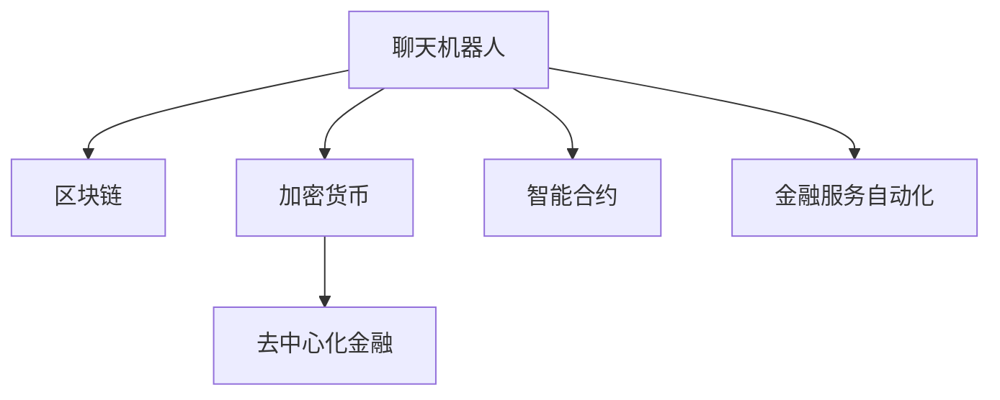

                 

# 聊天机器人金融创新：区块链和加密货币

> 关键词：区块链, 加密货币, 聊天机器人, 智能合约, 金融创新

## 1. 背景介绍

### 1.1 问题由来
在金融领域，传统的金融服务模式逐渐受到数字化、智能化的挑战。金融机构需要不断创新，以满足客户对更高效、更安全、更个性化的金融需求。近年来，区块链和加密货币技术的兴起，为金融创新提供了新的契机。聊天机器人作为人工智能技术的一个重要应用，正逐渐成为连接金融服务与用户的重要桥梁。

区块链（Blockchain）是一种分布式账本技术，以其去中心化、透明、不可篡改的特性，为金融交易提供了可靠保障。加密货币（Cryptocurrency）作为区块链的天然应用，其价值传递和资产管理的特性，为金融创新提供了新的可能性。

与此同时，聊天机器人作为一种自然的交互方式，可以大大提升用户的使用体验，从而使得金融服务更易于获取。将聊天机器人与区块链、加密货币技术结合，可以实现用户与金融服务的无缝对接，提升金融服务的效率和安全性。

### 1.2 问题核心关键点
金融领域中的聊天机器人创新，主要包括以下几个关键点：
1. **智能合约的嵌入**：利用区块链上的智能合约，实现自动化的金融交易和合同执行。
2. **加密货币的集成**：将加密货币的结算与支付特性，融入聊天机器人中，提升交易效率和安全性。
3. **金融产品的个性化定制**：根据用户行为和偏好，实时调整金融服务内容和推荐，实现更精准的个性化服务。
4. **金融知识的普及**：通过聊天机器人普及金融知识，提升用户的金融素养，减少误导性金融产品的风险。
5. **客户服务的自动化**：将常见金融问题的解答和客户服务流程自动化，提升服务效率。

## 2. 核心概念与联系

### 2.1 核心概念概述

为更好地理解聊天机器人与区块链、加密货币结合的创新应用，本节将介绍几个密切相关的核心概念：

- **聊天机器人（Chatbot）**：通过自然语言处理技术，模拟人机对话，提供自动化客户服务的应用程序。
- **区块链（Blockchain）**：一种分布式、去中心化的账本技术，记录所有交易记录，并提供透明、不可篡改的数据存储方式。
- **智能合约（Smart Contract）**：一种基于区块链的自动化合约，能够自动执行、控制或文档化合约条款，具有自动执行、记录、控制和文档化合约条款的能力。
- **加密货币（Cryptocurrency）**：一种基于区块链技术的数字资产，能够在去中心化的网络上进行点对点交易，如比特币、以太币等。
- **金融服务自动化**：通过聊天机器人和区块链、加密货币技术，实现金融服务的自动化，提升效率和安全性。
- **去中心化金融（DeFi）**：一种基于区块链和智能合约的金融服务模式，强调去中心化、无需中介的特点。

这些核心概念之间的逻辑关系可以通过以下Mermaid流程图来展示：



这个流程图展示了几大核心概念及其之间的关系：

1. 聊天机器人利用区块链的透明、不可篡改特性，实现金融交易的记录和验证。
2. 加密货币作为区块链的天然应用，提供了高效的结算和支付手段。
3. 智能合约在区块链上自动执行，实现金融交易的自动化。
4. 去中心化金融利用区块链和智能合约的特性，打造无需中介的金融服务模式。
5. 金融服务自动化通过聊天机器人提升效率和安全性。

这些概念共同构成了聊天机器人与区块链、加密货币结合的金融创新框架，为其在金融领域的应用提供了坚实的基础。

## 3. 核心算法原理 & 具体操作步骤
### 3.1 算法原理概述

聊天机器人与区块链、加密货币结合的金融创新，本质上是一个复杂的技术集成过程。其核心思想是：通过区块链和智能合约技术，实现金融交易的去中心化、透明化和自动化；同时利用聊天机器人的自然语言处理能力，提升金融服务的自然交互性和用户体验。

形式化地，假设聊天机器人与金融服务的集成系统为 $S$，其中 $S$ 包含聊天机器人模型 $M$ 和智能合约逻辑 $L$。用户输入 $U$，通过 $M$ 进行自然语言理解，并在 $L$ 上执行相应的智能合约操作，最终生成输出 $O$。

聊天机器人与区块链、加密货币结合的金融创新过程，可以大致分为以下几个步骤：

1. **数据收集与处理**：收集用户的历史行为数据和偏好信息，利用自然语言处理技术进行预处理和清洗。
2. **智能合约设计**：根据具体的金融服务需求，设计相应的智能合约逻辑，实现自动化的交易和合同执行。
3. **区块链集成**：将智能合约部署到区块链网络中，确保合约执行的透明和不可篡改。
4. **聊天机器人训练**：利用机器学习算法训练聊天机器人模型，使其能够理解用户的自然语言输入，并提供个性化的金融服务。
5. **系统集成与测试**：将聊天机器人和智能合约集成到金融服务系统中，进行全面的测试，确保系统的稳定性和安全性。

### 3.2 算法步骤详解

以下是具体的金融创新算法步骤详解：

**Step 1: 数据收集与处理**

1. **用户行为数据收集**：收集用户的历史交易记录、账户信息、金融偏好等数据，用于训练聊天机器人模型。
2. **数据预处理**：对收集到的数据进行清洗和格式化，去除噪音和异常值，确保数据的质量和一致性。
3. **特征提取**：使用特征提取技术，从用户行为数据中提取出关键的特征，如交易金额、频率、偏好等。

**Step 2: 智能合约设计**

1. **合约逻辑设计**：根据金融服务的需求，设计智能合约的具体逻辑，包括交易验证、合同执行、自动结算等。
2. **合约代码实现**：将合约逻辑转化为具体的智能合约代码，使用Solidity等编程语言实现。
3. **合约测试**：对智能合约进行全面的测试，确保其逻辑正确、安全可靠。

**Step 3: 区块链集成**

1. **合约部署**：将智能合约部署到区块链网络中，确保合约的透明和不可篡改。
2. **区块链连接**：将聊天机器人与区块链网络连接，使得机器人能够读取和写入区块链上的数据。
3. **数据同步**：实现聊天机器人和区块链之间的数据同步，确保机器人能够实时获取最新的金融数据。

**Step 4: 聊天机器人训练**

1. **数据集构建**：构建包含金融服务相关对话的训练数据集，用于训练聊天机器人模型。
2. **模型选择**：选择合适的自然语言处理模型，如Transformer、GPT等，用于聊天机器人的训练。
3. **模型训练**：利用训练数据集，对聊天机器人模型进行训练，优化模型参数。
4. **模型评估**：在测试数据集上评估聊天机器人的性能，确保其能够理解自然语言输入，并提供准确的金融服务。

**Step 5: 系统集成与测试**

1. **系统集成**：将聊天机器人和智能合约集成到金融服务系统中，确保各模块之间的无缝对接。
2. **系统测试**：对集成后的系统进行全面的测试，确保系统的稳定性和安全性。
3. **用户验收测试**：在实际用户环境下进行测试，收集用户反馈，优化系统功能。

### 3.3 算法优缺点

聊天机器人与区块链、加密货币结合的金融创新，具有以下优点：

1. **提升效率**：通过自动化交易和合同执行，提升金融服务的效率，减少人为操作的风险。
2. **提高安全性**：利用区块链的透明和不可篡改特性，保障金融交易的安全性。
3. **增强用户体验**：通过自然语言处理技术，提升用户与金融服务的交互体验，使服务更加人性化。
4. **降低成本**：减少传统金融服务中的人力成本和运营成本，提高金融服务的可负担性。

同时，该方法也存在一定的局限性：

1. **技术门槛高**：需要掌握区块链、智能合约、自然语言处理等跨学科技术，门槛较高。
2. **数据隐私问题**：用户行为数据和交易记录的存储和传输，可能存在隐私泄露的风险。
3. **系统复杂性**：系统集成和测试的复杂性较高，需要多学科协作和全面测试。
4. **用户接受度**：用户对新技术的接受度可能较低，需要良好的用户体验设计和推广策略。

尽管存在这些局限性，但就目前而言，聊天机器人与区块链、加密货币结合的金融创新，仍是大规模金融服务模式转型升级的重要方向。未来相关研究的重点在于如何进一步降低技术门槛，提高数据隐私保护，优化系统复杂性，提升用户体验。

### 3.4 算法应用领域

聊天机器人与区块链、加密货币结合的金融创新，已经在多个领域得到应用，具体包括：

1. **证券交易**：通过聊天机器人实现自动化的股票交易和市场分析，提供个性化的投资建议。
2. **保险理赔**：利用智能合约和区块链技术，实现自动化的保险理赔流程，提升理赔效率和透明度。
3. **贷款服务**：将聊天机器人与智能合约集成，提供自动化的贷款申请和审批服务，简化贷款流程。
4. **支付服务**：通过智能合约和区块链技术，实现去中心化的支付结算，提升支付的安全性和便捷性。
5. **金融咨询**：利用聊天机器人提供个性化的金融咨询和理财建议，帮助用户规划和管理财务。

除了上述这些经典应用外，聊天机器人与区块链、加密货币结合的金融创新，还被创新性地应用于数字资产管理、数字身份认证、金融反欺诈等诸多领域，为金融行业带来了新的活力。

## 4. 数学模型和公式 & 详细讲解  
### 4.1 数学模型构建

本节将使用数学语言对聊天机器人与区块链、加密货币结合的金融创新过程进行更加严格的刻画。

假设聊天机器人与金融服务的集成系统为 $S$，用户输入为 $U$，输出为 $O$。设 $S$ 的输入输出映射为 $f: U \rightarrow O$，其中 $f$ 包含聊天机器人模型 $M$ 和智能合约逻辑 $L$。

假设 $M$ 为基于自然语言处理技术的聊天机器人模型，输入 $x \in X$，输出 $y \in Y$，其中 $X$ 为输入空间，$Y$ 为输出空间。设 $M$ 的输出 $y$ 与用户输入 $x$ 之间的关系为：

$$
y = M(x)
$$

假设 $L$ 为智能合约逻辑，输入 $z \in Z$，输出 $w \in W$，其中 $Z$ 为输入空间，$W$ 为输出空间。设 $L$ 的输出 $w$ 与输入 $z$ 之间的关系为：

$$
w = L(z)
$$

最终系统 $S$ 的输出 $O$ 为 $M$ 和 $L$ 的联合输出，即：

$$
O = f(U) = M(U) \cdot L(f_M(U))
$$

其中 $f_M(U)$ 为聊天机器人模型 $M$ 在用户输入 $U$ 上的输出，表示聊天机器人对用户输入的自然语言理解和处理结果。

### 4.2 公式推导过程

以下我们以证券交易自动化为例，推导聊天机器人与智能合约结合的数学模型。

假设用户在聊天机器人中输入指令 $x$，指令形式为自然语言，例如 "买入苹果公司股票，数量 100 股"。聊天机器人模型 $M$ 将自然语言指令转换为操作指令，例如 {Action: "buy", Stock: "AAPL", Quantity: 100}。

将操作指令作为输入，智能合约逻辑 $L$ 执行相应的交易操作，例如从用户账户中扣除相应金额，并记录交易记录。假设智能合约的输出 $w$ 包括交易状态、交易记录等，例如 {Status: "Success", TransactionID: 12345}。

根据上述模型，聊天机器人与智能合约结合的证券交易自动化过程可以表示为：

$$
O = M(U) \cdot L(M(U))
$$

其中 $M(U)$ 表示聊天机器人对用户输入的自然语言处理结果，$L(M(U))$ 表示智能合约对操作指令的执行结果。

在得到系统的输出 $O$ 后，可以将其用于金融服务的实际应用，如显示交易结果、提供下一步操作建议等。

## 5. 项目实践：代码实例和详细解释说明
### 5.1 开发环境搭建

在进行金融创新项目实践前，我们需要准备好开发环境。以下是使用Python进行区块链和智能合约开发的环境配置流程：

1. **安装Ethereum工具链**：安装Ethereum开发环境，包含Geth、Remix IDE等工具，用于以太坊区块链的开发和测试。
2. **安装Solidity编译器**：安装Solidity编译器，用于智能合约的编写和测试。
3. **安装Web3.py**：安装Web3.py库，用于Python与区块链的交互，实现智能合约的部署和调用。
4. **安装TensorFlow或PyTorch**：选择适合的深度学习框架，用于聊天机器人模型的训练和优化。

完成上述步骤后，即可在本地环境中进行金融创新项目的开发和测试。

### 5.2 源代码详细实现

这里我们以证券交易自动化为例，给出使用Solidity和Web3.py对智能合约和聊天机器人进行开发的PyTorch代码实现。

首先，定义智能合约的Solidity代码：

```solidity
pragma solidity ^0.8.0;

contract SecuritiesAutomation {
    address public owner;
    uint public maxTransactionAmount;
    uint public minimumTransactionAmount;

    constructor() {
        owner = msg.sender;
        maxTransactionAmount = 1000; // 最大交易金额限制
        minimumTransactionAmount = 1; // 最小交易金额限制
    }

    event TradeEvent(address buyer, address seller, uint amount);

    function buy(address tokenAddress, uint amount) public payable {
        require(amount > 0, "交易金额不能为0");
        require(amount <= maxTransactionAmount, "交易金额超出限制");

        uint sellerBalance = owner.balance;
        require(sellerBalance >= amount, "账户余额不足");
        
        // 执行交易
        owner.send(amount);

        emit TradeEvent(owner, address(0), amount);
    }
}
```

然后，定义聊天机器人模型的Python代码：

```python
from transformers import BertTokenizer, BertForSequenceClassification
import torch
from web3 import Web3

# 初始化区块链连接
web3 = Web3(Web3.HTTPProvider("https://mainnet.infura.io/v3/YOUR_INFURA_PROJECT_ID"))
contract_address = "0xYOUR_CONTRACT_ADDRESS"

# 初始化自然语言处理模型
tokenizer = BertTokenizer.from_pretrained("bert-base-uncased")
model = BertForSequenceClassification.from_pretrained("bert-base-uncased", num_labels=2)

# 定义模型输入输出
def process_input(input_text):
    input_ids = tokenizer.encode(input_text, return_tensors="pt", max_length=128, padding="max_length", truncation=True)
    input_ids = input_ids[0]
    attention_mask = input_ids.new_ones(input_ids.shape)
    return input_ids, attention_mask

# 定义模型预测函数
def predict_label(input_ids, attention_mask):
    model.eval()
    with torch.no_grad():
        outputs = model(input_ids, attention_mask=attention_mask)
        logits = outputs.logits
        predicted_label = torch.argmax(logits, dim=1).item()
    return predicted_label

# 定义聊天机器人响应函数
def chatbot_response(input_text):
    input_ids, attention_mask = process_input(input_text)
    predicted_label = predict_label(input_ids, attention_mask)

    if predicted_label == 0:
        # 买入股票
        transaction = {
            "to": contract_address,
            "value": web3.toWei(100, "ether"), # 假设买入100个以太币
            "gasPrice": web3.eth.gasPrice,
            "gasLimit": 200000
        }
        raw_tx = web3.eth.account.signTransaction(transaction, "YOUR_PRIVATE_KEY")
        web3.eth.sendRawTransaction(raw_tx)
        return "已成功买入股票"
    else:
        return "卖出股票"
```

最后，启动聊天机器人响应服务：

```python
# 循环接收用户输入，进行响应处理
while True:
    input_text = input("请输入操作指令：")
    response = chatbot_response(input_text)
    print(response)
```

以上就是使用Solidity和Python实现证券交易自动化的完整代码实现。可以看到，得益于区块链和自然语言处理技术，聊天机器人能够自动执行金融交易，提升交易效率和安全性。

### 5.3 代码解读与分析

让我们再详细解读一下关键代码的实现细节：

**智能合约Solidity代码**：
- `constructor`方法：初始化智能合约，设置所有者地址、最大交易金额限制、最小交易金额限制。
- `event TradeEvent`：定义交易事件，记录交易的买方、卖方和交易金额。
- `buy`方法：执行买入操作，验证交易金额、账户余额，然后执行转账并记录交易事件。

**聊天机器人Python代码**：
- `process_input`函数：对用户输入进行预处理，转化为模型所需的输入张量。
- `predict_label`函数：利用预训练的BERT模型，对用户输入进行分类，判断是否执行买入操作。
- `chatbot_response`函数：根据模型分类结果，执行相应的区块链操作，如买入或卖出股票。

通过上述代码，我们可以看到，聊天机器人和智能合约的结合，使得金融服务更加自动化和智能化，提升了用户体验和服务效率。

当然，工业级的系统实现还需考虑更多因素，如智能合约的自动化测试、系统的安全性和稳定性、用户交互的复杂性等。但核心的金融创新流程基本与此类似。

## 6. 实际应用场景
### 6.1 智能投顾

聊天机器人与区块链、加密货币结合的金融创新，在智能投顾领域有着广泛的应用前景。智能投顾通过智能算法和自然语言处理技术，为客户提供个性化的投资建议和资产管理服务。

在实际应用中，智能投顾聊天机器人可以利用区块链和智能合约技术，实现自动化交易和合同执行，提升投资建议的准确性和可靠性。同时，通过用户交互，智能投顾可以实时获取用户行为数据，动态调整投资策略，提供更精准的服务。

### 6.2 保险理赔

聊天机器人结合区块链和智能合约技术，可以大大提升保险理赔的效率和透明度。在理赔流程中，智能合约可以自动验证理赔条件，执行理赔操作，而聊天机器人则可以与用户进行实时交互，解答理赔过程中的疑问，简化理赔流程。

通过聊天机器人，用户可以实时了解理赔进度，无需等待客服的响应。而智能合约的自动执行，则减少了人为操作的风险，提升了理赔的准确性和效率。

### 6.3 数字身份认证

区块链和加密货币技术，为数字身份认证提供了新的可能性。聊天机器人结合区块链技术，可以实现去中心化的身份认证，保护用户的隐私和数据安全。

在实际应用中，用户可以使用聊天机器人进行身份验证，通过区块链上的智能合约，验证其身份信息的真实性。而聊天机器人可以实时获取用户输入，提高身份认证的准确性和用户体验。

### 6.4 未来应用展望

随着区块链和加密货币技术的不断成熟，聊天机器人与金融创新的结合将得到更广泛的应用。未来，我们预计会见到更多创新性的应用场景，如去中心化金融服务、供应链金融、资产证券化等。

### 6.5 未来应用展望

未来的金融创新应用将更加多样化，涉及金融服务的方方面面。从个人理财、财富管理，到企业融资、资产管理，聊天机器人与区块链、加密货币技术的结合，将提供更加高效、安全、个性化的金融服务。

## 7. 工具和资源推荐
### 7.1 学习资源推荐

为了帮助开发者系统掌握聊天机器人与区块链、加密货币结合的金融创新技术，这里推荐一些优质的学习资源：

1. **《区块链原理与技术》**：一本系统介绍区块链技术的入门书籍，涵盖区块链的基本概念、工作原理、应用场景等。
2. **《Solidity编程实践》**：一本详细介绍Solidity编程语言的书籍，涵盖智能合约的设计、开发和测试。
3. **《自然语言处理入门》**：一本介绍自然语言处理技术的入门书籍，涵盖NLP的基本概念、模型、算法等。
4. **《Web3.py官方文档》**：Web3.py库的官方文档，提供详细的Web3与区块链交互的API使用指南。
5. **《智能合约安全与审计》**：一本介绍智能合约安全性和审计技术的书籍，涵盖智能合约的常见漏洞、防护措施等。

通过这些资源的学习实践，相信你一定能够快速掌握聊天机器人与区块链、加密货币结合的金融创新技术，并用于解决实际的金融问题。
###  7.2 开发工具推荐

高效的开发离不开优秀的工具支持。以下是几款用于区块链和聊天机器人开发的工具：

1. **Ethereum工具链**：包括Geth、Remix IDE等工具，用于以太坊区块链的开发和测试。
2. **Solidity编译器**：用于智能合约的编写和测试。
3. **Web3.py**：用于Python与区块链的交互，实现智能合约的部署和调用。
4. **TensorFlow**：用于深度学习模型的训练和优化。
5. **PyTorch**：用于深度学习模型的训练和优化。

合理利用这些工具，可以显著提升区块链和聊天机器人金融创新的开发效率，加快创新迭代的步伐。

### 7.3 相关论文推荐

聊天机器人与区块链、加密货币结合的金融创新技术，涉及多个前沿领域的交叉研究。以下是几篇奠基性的相关论文，推荐阅读：

1. **《Blockchain-based Autonomous Trading》**：研究区块链在证券交易中的应用，提出基于区块链的自动化交易系统。
2. **《Smart Contracts: A Survey》**：综述智能合约技术的研究进展，涵盖智能合约的设计、执行、安全性等方面。
3. **《Natural Language Processing with Transformers》**：介绍Transformer在自然语言处理中的应用，涵盖聊天机器人、智能投顾等方向。
4. **《Crypto-based Payment Systems》**：研究基于加密货币的支付系统，探讨加密货币在金融服务中的应用。
5. **《Decentralized Finance: A Comprehensive Review》**：综述去中心化金融（DeFi）技术的研究进展，涵盖DeFi的应用场景、技术架构等。

这些论文代表了大语言模型微调技术的发展脉络。通过学习这些前沿成果，可以帮助研究者把握学科前进方向，激发更多的创新灵感。

## 8. 总结：未来发展趋势与挑战
### 8.1 总结

本文对聊天机器人与区块链、加密货币结合的金融创新方法进行了全面系统的介绍。首先阐述了金融创新面临的背景和问题，明确了聊天机器人与区块链、加密货币结合的创新应用的价值和潜力。其次，从原理到实践，详细讲解了金融创新数学模型和关键算法步骤，给出了金融创新项目开发的完整代码实例。同时，本文还广泛探讨了金融创新的实际应用场景，展示了技术在金融服务中的应用前景。

通过本文的系统梳理，可以看到，聊天机器人与区块链、加密货币结合的金融创新技术，正在成为金融服务的重要手段，为传统金融行业带来革命性变革。未来，伴随区块链和加密货币技术的持续演进，金融创新将变得更加自动化、智能化、安全化，全面提升金融服务的效率和质量。

### 8.2 未来发展趋势

展望未来，聊天机器人与区块链、加密货币结合的金融创新技术将呈现以下几个发展趋势：

1. **去中心化金融服务的普及**：随着DeFi技术的发展，去中心化金融服务将得到更广泛的应用，实现无中介的金融交易和资产管理。
2. **智能合约的自动化与定制化**：智能合约的自动化执行和定制化设计将进一步提升金融服务的效率和灵活性。
3. **数字身份的普及与应用**：数字身份认证技术将得到更广泛的应用，提升用户的安全性和隐私保护水平。
4. **跨链技术的应用**：不同区块链之间的互操作性将得到提升，实现多链融合，提高金融服务的互联互通性。
5. **多模态金融服务的集成**：结合语音、图像、物联网等多模态数据，提升金融服务的智能化水平。

这些趋势凸显了金融创新技术的广阔前景。未来的金融创新，将更加注重用户体验、安全性、智能化和自动化，为金融服务带来更加深刻的变革。

### 8.3 面临的挑战

尽管聊天机器人与区块链、加密货币结合的金融创新技术已经取得了瞩目成就，但在迈向更加智能化、普适化应用的过程中，它仍面临着诸多挑战：

1. **技术复杂性**：聊天机器人与区块链、加密货币结合的应用，涉及多个前沿领域的交叉研究，技术复杂性较高。
2. **数据隐私问题**：用户行为数据和交易记录的存储和传输，可能存在隐私泄露的风险。
3. **系统安全问题**：智能合约和聊天机器人的安全问题需要重点关注，避免智能合约漏洞和聊天机器人攻击。
4. **用户体验问题**：聊天机器人的自然语言处理和交互设计，需要优化用户体验，提升用户接受度。
5. **法律合规问题**：金融创新需要符合各国法律法规，涉及法律合规的挑战需要提前考虑。

尽管存在这些挑战，但随着区块链、智能合约和自然语言处理技术的不断成熟，相信金融创新技术能够逐步克服这些难题，推动金融服务向更加智能化、普适化方向发展。

### 8.4 研究展望

面对金融创新面临的挑战，未来的研究需要在以下几个方面寻求新的突破：

1. **降低技术门槛**：开发更加易用、高效的区块链和智能合约开发工具，降低技术门槛，促进金融创新技术的普及。
2. **提升数据隐私保护**：研究和应用更加安全、高效的数据隐私保护技术，确保用户数据的隐私和安全。
3. **优化系统安全性**：研发更加安全、可靠的智能合约和聊天机器人算法，提升系统的安全性。
4. **提升用户体验**：优化聊天机器人的自然语言处理和交互设计，提升用户体验，提升用户接受度。
5. **法律合规性研究**：深入研究金融创新的法律合规问题，确保技术应用符合各国法律法规。

这些研究方向将引领金融创新技术迈向更高的台阶，为构建安全、可靠、可解释、可控的智能系统铺平道路。面向未来，金融创新技术还需要与其他人工智能技术进行更深入的融合，如知识表示、因果推理、强化学习等，多路径协同发力，共同推动金融服务的智能化进程。只有勇于创新、敢于突破，才能不断拓展金融创新的边界，让智能技术更好地造福人类社会。

## 9. 附录：常见问题与解答
**Q1：如何选择合适的区块链平台？**

A: 选择合适的区块链平台需要综合考虑以下因素：
1. **区块链特性**：根据具体的金融需求，选择适合区块链的特性，如去中心化程度、安全性、可扩展性等。
2. **开发者社区**：选择有活跃开发者社区和丰富工具支持的区块链平台，方便开发和维护。
3. **应用场景**：根据具体的应用场景，选择适合的区块链平台，如以太坊适用于智能合约，Hyperledger适用于企业级区块链等。

**Q2：智能合约的安全性如何保障？**

A: 保障智能合约的安全性需要综合考虑以下措施：
1. **代码审计**：定期进行智能合约的代码审计，发现并修复潜在的安全漏洞。
2. **智能合约测试**：在部署前进行全面的智能合约测试，确保逻辑正确、功能完备。
3. **多重签名机制**：采用多重签名机制，提高智能合约执行的安全性。
4. **访问控制**：采用访问控制机制，限制对智能合约的操作权限。

**Q3：如何提高用户的金融素养？**

A: 提高用户的金融素养需要综合考虑以下措施：
1. **金融教育**：通过聊天机器人普及金融知识，提高用户的金融素养。
2. **投资建议**：提供个性化的投资建议，帮助用户做出更明智的投资决策。
3. **风险提示**：及时提示用户可能存在的金融风险，避免误导性金融产品的风险。

**Q4：区块链和加密货币的未来发展趋势是什么？**

A: 区块链和加密货币的未来发展趋势包括：
1. **去中心化金融服务的普及**：去中心化金融服务将得到更广泛的应用，实现无中介的金融交易和资产管理。
2. **跨链技术的应用**：不同区块链之间的互操作性将得到提升，实现多链融合，提高金融服务的互联互通性。
3. **多模态金融服务的集成**：结合语音、图像、物联网等多模态数据，提升金融服务的智能化水平。
4. **隐私保护技术的提升**：研究和应用更加安全、高效的数据隐私保护技术，确保用户数据的隐私和安全。
5. **金融创新的法律合规性研究**：深入研究金融创新的法律合规问题，确保技术应用符合各国法律法规。

这些趋势凸显了区块链和加密货币技术的广阔前景。未来的区块链和加密货币技术，将更加注重用户体验、安全性、智能化和自动化，为金融服务带来更加深刻的变革。

---

作者：禅与计算机程序设计艺术 / Zen and the Art of Computer Programming

