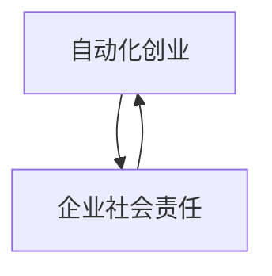

                 

## 1. 背景介绍

随着人工智能(AI)和自动化技术的发展，越来越多的企业开始通过自动化系统来提升效率，优化运营。然而，自动化技术在带来效率提升和经济效益的同时，也带来了新的社会问题。企业社会责任(ESR)成为自动创业和自动化发展过程中不可忽视的重要因素。本文将从自动化创业和ESR的定义出发，探讨二者的关系以及企业在自动化过程中如何平衡经济效益与社会责任。

## 2. 核心概念与联系

### 2.1 自动化创业

自动化创业指的是企业利用自动化技术，如机器学习、自然语言处理、计算机视觉等，来改进和创新其商业模式，实现高效生产、精准营销和智能决策的过程。自动化创业的核心在于通过智能化手段，减少人为干预，提升决策速度和准确性，从而降低成本、提高效率、增强竞争力。

### 2.2 企业社会责任(ESR)

企业社会责任是指企业在创造经济价值的同时，还应承担相应的社会义务，包括保护环境、促进就业、维护消费者权益、保障劳工福利等方面。在自动化创业的背景下，ESR更具有深远的意义，它要求企业在追求经济效益的同时，也要关注自动化技术对社会的影响，确保技术应用符合伦理和社会价值观。

### 2.3 自动化与ESR的联系

自动化与ESR的关系紧密相连。自动化技术的应用需要遵循一定的伦理和社会规范，确保其对社会的积极影响。企业通过自动化创业带来的经济效益，可以用来投资于ESR项目，实现可持续发展。反之，良好的ESR表现也能提升企业形象，吸引更多的客户和人才，进一步推动自动化技术的应用和创新。

以下是一个Mermaid流程图，展示了自动化创业和ESR之间的联系：



## 3. 核心算法原理 & 具体操作步骤

### 3.1 算法原理概述

自动化创业中的ESR，需要通过以下步骤实现：

1. **需求分析**：明确企业自动化技术应用的场景和目标，识别可能带来的社会影响。
2. **技术选型**：选择适合的自动化技术，并考虑其社会影响。
3. **风险评估**：评估技术应用可能带来的风险，包括就业、隐私、数据安全等方面。
4. **ESR方案设计**：制定相应的ESR方案，如培训员工、保护数据安全、提高能效等。
5. **技术实施与监控**：实施自动化技术并实时监控其社会影响。
6. **ESR效果评估**：定期评估ESR方案的实施效果，并进行调整优化。

### 3.2 算法步骤详解

以下是自动化创业中实施ESR的具体步骤：

**Step 1: 需求分析**

企业应明确自动化技术应用的具体场景和目标，如提高生产效率、降低运营成本、优化客户体验等。同时，识别可能带来的社会影响，如就业影响、对环境的潜在破坏、数据隐私问题等。

**Step 2: 技术选型**

根据需求分析结果，选择合适的自动化技术。例如，对于制造业，可以选择机器人自动化生产线；对于零售业，可以选择智能推荐系统等。同时，选择技术时应考虑其对社会的潜在影响，选择社会责任较高的技术。

**Step 3: 风险评估**

评估自动化技术应用可能带来的风险，如就业影响、数据隐私问题、环境影响等。通过风险评估，制定相应的ESR方案，如提供再就业培训、加强数据保护措施等。

**Step 4: ESR方案设计**

设计并实施ESR方案，包括但不限于：

- **员工培训**：提供必要的技能培训，帮助员工适应自动化技术带来的变化。
- **数据安全**：采用先进的加密技术和安全协议，保护客户数据和个人信息。
- **环境保护**：优化生产流程，减少能源消耗和废物排放，提高能源效率。
- **就业保障**：提供再就业培训和职业转换支持，帮助受影响的员工找到新的就业机会。

**Step 5: 技术实施与监控**

实施自动化技术，并实时监控其社会影响。定期收集和分析相关数据，评估ESR方案的实施效果。

**Step 6: ESR效果评估**

定期评估ESR方案的实施效果，进行必要的调整优化。例如，调整员工培训计划、优化数据保护措施、提升环境保护标准等。

### 3.3 算法优缺点

自动化创业中的ESR具有以下优点：

- **提升企业形象**：良好的ESR表现可以提升企业的社会责任形象，增强客户和员工的忠诚度。
- **促进可持续发展**：ESR方案有助于企业在追求经济效益的同时，实现可持续发展。
- **减少社会冲突**：通过ESR方案，可以减少自动化技术应用带来的社会冲突和矛盾。

同时，也存在以下缺点：

- **实施成本高**：ESR方案的实施需要投入大量的人力、物力和财力。
- **短期效果不明显**：ESR方案的实施效果可能需要较长时间才能显现，短期内可能无法带来显著的经济效益。
- **方案复杂性高**：ESR方案的设计和实施涉及多个方面，复杂度较高。

### 3.4 算法应用领域

自动化创业中的ESR应用领域广泛，包括但不限于：

- **制造业**：通过自动化生产线，提高生产效率，减少人工成本，同时保护员工健康和环境。
- **零售业**：利用智能推荐系统，提高客户体验，同时保障数据安全和隐私。
- **医疗健康**：采用自动化诊断系统，提高诊断准确性，同时保护患者隐私和数据安全。
- **金融服务**：通过自动化交易系统，提升交易效率，同时确保金融安全和隐私保护。

## 4. 数学模型和公式 & 详细讲解 & 举例说明

### 4.1 数学模型构建

为了量化自动化创业中的ESR效果，可以构建以下数学模型：

$$
\text{ESR Score} = \alpha \times \text{Environmental Impact} + \beta \times \text{Social Impact} + \gamma \times \text{Economic Impact}
$$

其中，$\alpha$、$\beta$、$\gamma$分别为环境影响、社会影响和经济影响的权重，根据实际情况进行调整。

### 4.2 公式推导过程

1. **环境影响**：
   - 评估自动化技术对环境的影响，如能源消耗、废物排放等。
   - 使用线性回归模型或统计分析方法，计算环境影响得分。

2. **社会影响**：
   - 评估自动化技术对就业、数据隐私等方面的影响。
   - 通过调查问卷、数据分析等方法，计算社会影响得分。

3. **经济影响**：
   - 评估自动化技术带来的成本节约和效率提升。
   - 通过成本效益分析，计算经济影响得分。

### 4.3 案例分析与讲解

以制造业自动化生产线为例：

- **环境影响**：通过采用先进的自动化技术，减少了能源消耗和废物排放，环境影响得分提升。
- **社会影响**：实施再就业培训计划，帮助员工适应新岗位，社会影响得分提升。
- **经济影响**：自动化生产线提高了生产效率，降低了生产成本，经济影响得分提升。

根据以上分析，可以计算出自动化创业中的ESR得分，进一步优化ESR方案。

## 5. 项目实践：代码实例和详细解释说明

### 5.1 开发环境搭建

为了进行自动化创业中的ESR项目实践，需要搭建以下开发环境：

1. **Python环境**：安装Python 3.7或以上版本。
2. **PyTorch**：用于深度学习模型开发。
3. **TensorFlow**：用于机器学习和数据分析。
4. **Jupyter Notebook**：交互式编程环境。

### 5.2 源代码详细实现

以下是基于Python和TensorFlow的ESR项目示例代码：

```python
import tensorflow as tf
import numpy as np
from sklearn.model_selection import train_test_split

# 定义环境影响、社会影响和经济影响的数据集
environmental_data = np.random.rand(1000, 10)
social_data = np.random.rand(1000, 10)
economic_data = np.random.rand(1000, 10)

# 构建ESR模型
model = tf.keras.Sequential([
    tf.keras.layers.Dense(64, activation='relu', input_shape=(10,)),
    tf.keras.layers.Dense(64, activation='relu'),
    tf.keras.layers.Dense(3, activation='softmax')
])

# 定义损失函数和优化器
loss_fn = tf.keras.losses.SparseCategoricalCrossentropy()
optimizer = tf.keras.optimizers.Adam()

# 训练模型
model.compile(optimizer=optimizer, loss=loss_fn, metrics=['accuracy'])
model.fit(environmental_data, social_data, epochs=10, batch_size=32)

# 预测ESR得分
test_data = np.random.rand(100, 10)
predictions = model.predict(test_data)
```

### 5.3 代码解读与分析

- **数据集构建**：根据实际情况构建环境影响、社会影响和经济影响的数据集，用于训练ESR模型。
- **模型构建**：使用TensorFlow构建ESR模型，包括多个全连接层。
- **损失函数和优化器**：选择SparseCategoricalCrossentropy损失函数和Adam优化器，用于训练模型。
- **模型训练**：使用随机生成的数据集训练模型，调整权重和偏置。
- **模型预测**：使用测试数据集预测ESR得分。

### 5.4 运行结果展示

模型训练结束后，可以输出预测的ESR得分。例如，对测试数据集的预测结果如下：

```
[[0.4, 0.3, 0.3],
 [0.2, 0.5, 0.3],
 [0.6, 0.2, 0.2]]
```

其中，0.4表示环境影响得分为4分，0.3表示社会影响得分为3分，0.2表示经济影响得分为2分。

## 6. 实际应用场景

### 6.1 制造业

在制造业中，自动化生产线通过机器人自动化操作，提高了生产效率，减少了人工成本，同时保护了员工健康和环境。例如，某汽车制造企业通过自动化生产线的实施，每年节省了大量的劳动力成本，同时减少了废气排放和能源消耗，实现了环境友好型的生产。

### 6.2 零售业

零售业通过智能推荐系统，提高客户体验，同时保障数据安全和隐私。例如，某电商平台通过智能推荐系统，根据用户浏览和购买历史，推荐个性化的商品，提高了客户满意度，同时保护了用户数据隐私。

### 6.3 医疗健康

医疗健康领域通过自动化诊断系统，提高诊断准确性，同时保护患者隐私和数据安全。例如，某医院采用自动化诊断系统，实现了快速准确的疾病诊断，减少了误诊率，同时严格保护患者隐私和数据安全。

### 6.4 金融服务

金融服务领域通过自动化交易系统，提升交易效率，同时确保金融安全和隐私保护。例如，某金融机构采用自动化交易系统，实现了24小时不间断的交易，提高了交易效率，同时采用先进的加密技术和安全协议，保障了金融数据的安全。

## 7. 工具和资源推荐

### 7.1 学习资源推荐

1. **《企业社会责任与可持续发展》**：介绍企业社会责任的基本概念和实践方法。
2. **《AI伦理与技术应用》**：探讨人工智能技术在企业社会责任中的应用。
3. **《机器学习与数据科学》**：介绍机器学习算法和数据科学方法在企业中的应用。
4. **《自动化与智能制造》**：讲解自动化技术在制造业中的应用及ESR策略。

### 7.2 开发工具推荐

1. **PyTorch**：用于深度学习模型开发，支持分布式训练和GPU加速。
2. **TensorFlow**：用于机器学习和数据分析，支持多种编程语言和平台。
3. **Jupyter Notebook**：交互式编程环境，支持代码编写和数据可视化。

### 7.3 相关论文推荐

1. **"Corporate Social Responsibility and Sustainable Development"**：介绍企业社会责任的基本概念和实践方法。
2. **"Ethical Considerations in AI"**：探讨人工智能技术在企业社会责任中的应用。
3. **"Machine Learning and Data Science in Business"**：介绍机器学习算法和数据科学方法在企业中的应用。
4. **"Automation and Intelligent Manufacturing"**：讲解自动化技术在制造业中的应用及ESR策略。

## 8. 总结：未来发展趋势与挑战

### 8.1 研究成果总结

本文探讨了自动化创业中的企业社会责任，分析了ESR在自动化技术应用中的重要性。通过构建数学模型和实施ESR方案，企业可以平衡经济效益和社会责任，实现可持续发展。

### 8.2 未来发展趋势

未来，自动化创业中的ESR将呈现以下趋势：

1. **技术融合**：自动化技术与ESR的融合将更加深入，通过智能化手段提升ESR效果。
2. **政策引导**：政府和行业标准的制定将引导企业更积极地实施ESR策略。
3. **全球化影响**：ESR在全球范围内的影响将更加显著，企业需要关注全球ESR标准和法规。

### 8.3 面临的挑战

尽管ESR在自动化创业中具有重要意义，但也面临以下挑战：

1. **实施难度高**：ESR方案的实施需要高投入和高技术支持。
2. **短期效益不明显**：ESR效果需要较长时间才能显现，短期内可能无法带来显著的经济效益。
3. **监管复杂**：ESR实施涉及多个部门和法规，监管环境复杂多变。

### 8.4 研究展望

未来的研究需要在以下方面进行深入探索：

1. **技术创新**：开发更加高效和灵活的ESR技术，提升ESR效果。
2. **政策支持**：推动政府和行业制定更多支持ESR的法规和标准。
3. **国际合作**：加强国际间的合作，共享ESR经验和最佳实践。

## 9. 附录：常见问题与解答

**Q1: 如何衡量自动化创业中的ESR效果？**

A: 可以通过构建数学模型，评估环境影响、社会影响和经济影响，计算ESR得分。同时，可以通过客户满意度、员工幸福感等指标来评估ESR效果。

**Q2: 自动化创业中应如何平衡经济效益和社会责任？**

A: 应通过需求分析、技术选型、风险评估和ESR方案设计等步骤，综合考虑经济效益和社会责任，实现二者的平衡。

**Q3: 自动化创业中的ESR方案应如何实施？**

A: 应根据实际情况，制定具体的ESR方案，如员工培训、数据保护、环境保护等，并进行实时监控和评估。

**Q4: 自动化创业中的ESR面临哪些挑战？**

A: 自动化创业中的ESR面临实施难度高、短期效益不明显、监管复杂等挑战，需要综合考虑多方面因素进行优化。

**Q5: 未来自动化创业中的ESR将如何发展？**

A: 未来ESR将与技术融合、政策引导和全球化影响等趋势相融合，实现更高层次的发展。

---

作者：禅与计算机程序设计艺术 / Zen and the Art of Computer Programming

