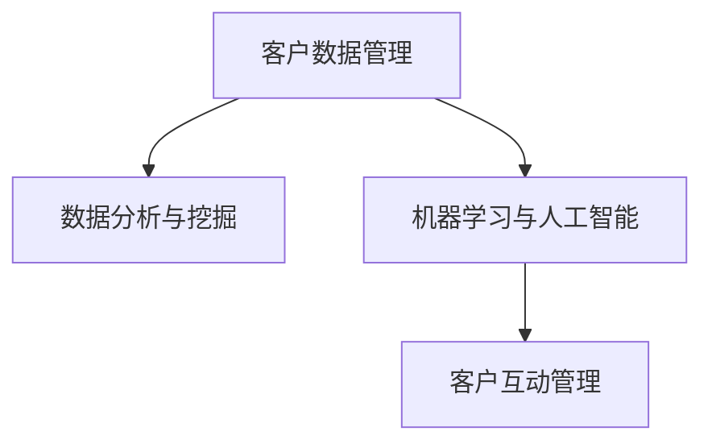

                 

# 自动化创业中的客户关系管理

## 1. 背景介绍

在自动化创业的浪潮中，客户关系管理（CRM）已成为企业成功的关键。随着技术的不断进步，传统的CRM系统正在被智能化的CRM系统所取代。这些系统利用数据挖掘、机器学习和人工智能等技术，对客户数据进行深度分析，以预测客户行为，提供个性化的服务，从而提升客户满意度和企业收益。本文将探讨自动化创业中客户关系管理的关键原理、操作步骤和实际应用场景，以期为创业者和企业决策者提供有价值的参考。

## 2. 核心概念与联系

### 2.1 核心概念概述

客户关系管理（CRM）是一个涉及客户数据收集、存储、分析和利用的过程。在自动化创业中，CRM系统的核心在于利用先进的技术手段，自动化地收集、分析和利用客户数据，以提升客户满意度和企业业绩。以下是一些关键概念及其相互联系：

- **客户数据管理（Customer Data Management, CDM）**：指对客户数据进行全面、准确地收集和存储的过程。客户数据包括个人基本信息、行为数据、互动数据等，这些数据是CRM系统的基础。

- **数据分析与挖掘（Data Analysis & Mining）**：指通过算法和模型对客户数据进行深入分析，以发现客户的潜在需求、偏好和行为模式，从而提供个性化的服务和产品。

- **机器学习与人工智能（Machine Learning & AI）**：利用算法和模型对客户数据进行分析，以预测客户行为，自动化地提供个性化的服务。

- **客户互动管理（Customer Engagement Management）**：通过智能化的互动工具和渠道，自动化地与客户进行互动，提升客户满意度和忠诚度。

这些核心概念之间的逻辑关系可以通过以下Mermaid流程图来展示：



这个流程图展示出客户关系管理的关键流程：通过客户数据管理获取数据，利用数据分析与挖掘和机器学习与人工智能技术对数据进行分析预测，并通过客户互动管理进行自动化互动。

## 3. 核心算法原理 & 具体操作步骤

### 3.1 算法原理概述

自动化创业中的CRM系统主要依赖于机器学习和人工智能技术。其核心原理是通过对客户数据的深度分析，预测客户行为，从而提供个性化的服务和产品。以下是该系统的主要算法原理：

- **数据预处理**：清洗和整理客户数据，以消除噪声和冗余，为后续分析和建模提供高质量的数据。

- **特征提取与选择**：从客户数据中提取有意义的特征，并选择合适的特征进行建模。

- **模型选择与训练**：根据具体任务选择合适的机器学习模型，并使用历史数据进行训练。

- **模型评估与优化**：通过交叉验证等方法评估模型性能，并根据评估结果进行模型优化。

- **自动化互动与个性化推荐**：使用模型预测客户需求，自动化地提供个性化的服务和产品推荐。

### 3.2 算法步骤详解

以下是自动化创业中CRM系统的主要操作步骤：

**Step 1: 数据收集与预处理**
- 收集客户的基本信息、行为数据、互动数据等，形成客户数据集。
- 对数据进行清洗、去重、填充缺失值等预处理操作，以确保数据的质量和一致性。

**Step 2: 特征提取与选择**
- 对客户数据进行特征提取，如提取客户的地理位置、浏览记录、购买历史等特征。
- 使用特征选择算法（如PCA、Lasso等）选择对客户行为有重要影响的特征，以减少模型复杂度和提高准确性。

**Step 3: 模型训练与评估**
- 选择合适的机器学习模型（如决策树、随机森林、神经网络等）进行训练。
- 使用历史数据对模型进行训练，并使用交叉验证等方法评估模型性能。
- 根据评估结果进行模型优化，如调整超参数、增加正则化项等。

**Step 4: 自动化互动与个性化推荐**
- 使用训练好的模型预测客户的需求和行为，自动化地提供个性化的服务和产品推荐。
- 通过智能化的互动工具和渠道，如聊天机器人、邮件营销等，提升客户满意度和忠诚度。

### 3.3 算法优缺点

自动化创业中的CRM系统具有以下优点：

- **自动化程度高**：系统可以自动收集、分析和利用客户数据，减少人工干预，提高效率。
- **个性化服务能力强**：通过深度分析客户数据，提供个性化的服务和产品，提升客户满意度。
- **预测能力强**：利用机器学习模型预测客户行为，自动化地提供针对性的服务和产品推荐。

但该系统也存在以下缺点：

- **数据质量依赖度高**：系统依赖于高质量的客户数据，数据质量不高可能导致模型预测不准确。
- **模型选择复杂**：根据具体任务选择合适的模型是一个复杂的过程，需要丰富的领域知识和经验。
- **隐私与安全风险**：客户数据的收集和存储可能存在隐私和安全风险，需要采取严格的数据保护措施。

### 3.4 算法应用领域

自动化创业中的CRM系统在多个领域都有广泛的应用：

- **电子商务**：通过分析客户购买历史和行为，提供个性化的产品推荐，提升客户购买转化率和满意度。
- **金融服务**：通过分析客户的信用记录和行为，提供个性化的金融产品推荐，降低客户流失率。
- **医疗健康**：通过分析患者的病历和行为，提供个性化的医疗服务和健康建议，提升患者的治疗效果和满意度。
- **教育培训**：通过分析学生的学习行为和成绩，提供个性化的学习资源和辅导，提升学习效果和满意度。
- **旅游出行**：通过分析用户的出行记录和偏好，提供个性化的旅游服务和产品推荐，提升用户出行体验和满意度。

## 4. 数学模型和公式 & 详细讲解 & 举例说明

### 4.1 数学模型构建

自动化创业中的CRM系统主要依赖于机器学习模型。以下是一些常用的数学模型及其构建方法：

- **决策树（Decision Tree）**：通过树状结构对客户数据进行分类和预测，适用于多分类和回归问题。
- **随机森林（Random Forest）**：通过集成多个决策树模型，提升模型的准确性和鲁棒性。
- **神经网络（Neural Network）**：通过多层神经元模型，对客户数据进行深度学习和特征提取，适用于复杂的非线性问题。
- **支持向量机（Support Vector Machine, SVM）**：通过寻找最优的超平面对客户数据进行分类和回归，适用于小样本和高度非线性的问题。

### 4.2 公式推导过程

以决策树模型为例，其构建过程如下：

1. 数据预处理
   - 数据清洗：移除异常值和噪声，确保数据的一致性和准确性。
   - 数据归一化：将数据缩放到一个固定的范围内，以提高模型的收敛速度和稳定性。

2. 特征选择
   - 信息增益（Information Gain）：计算每个特征对目标变量的信息增益，选择信息增益最大的特征作为根节点。
   - 熵（Entropy）：计算每个特征的熵，熵越小，特征的纯度越高，选择熵最小的特征作为根节点。

3. 模型训练
   - 递归分割：从根节点开始，对每个子集进行递归分割，直到满足停止条件。
   - 停止条件：节点样本数小于预设阈值，或者节点达到最大深度。

4. 模型评估与优化
   - 交叉验证：使用交叉验证方法评估模型性能，如K-Fold交叉验证。
   - 超参数调优：调整决策树的超参数，如最大深度、最小样本数等，以提高模型的准确性。

### 4.3 案例分析与讲解

假设某电商平台希望通过CRM系统提升客户的购买转化率，以下是具体的案例分析：

1. 数据收集
   - 收集客户的基本信息（如年龄、性别、职业等）。
   - 收集客户的浏览记录和购买历史。
   - 收集客户的互动数据（如邮件打开率、回复率等）。

2. 特征提取
   - 提取客户的地理位置、浏览记录、购买历史等特征。
   - 使用PCA算法选择对购买转化率有重要影响的特征。

3. 模型训练
   - 选择决策树模型进行训练，并使用历史数据进行训练。
   - 使用K-Fold交叉验证评估模型性能，并进行超参数调优。

4. 自动化互动与个性化推荐
   - 使用训练好的决策树模型预测客户的购买意向。
   - 通过智能化的互动工具和渠道，如邮件营销、聊天机器人等，自动化地提供个性化的产品和推荐。

## 5. 项目实践：代码实例和详细解释说明

### 5.1 开发环境搭建

在进行CRM系统开发前，需要准备以下开发环境：

1. **Python环境**：使用Anaconda或Miniconda安装Python 3.x版本。
2. **数据管理工具**：使用Pandas、NumPy等数据管理工具，对客户数据进行清洗和预处理。
3. **机器学习库**：使用Scikit-learn、TensorFlow、PyTorch等机器学习库，进行模型训练和预测。
4. **Web开发框架**：使用Flask、Django等Web开发框架，构建自动化的互动界面。
5. **数据库**：使用MySQL、PostgreSQL等关系型数据库，存储和管理客户数据。

### 5.2 源代码详细实现

以下是一个基于决策树模型的CRM系统示例代码：

```python
# 导入必要的库
import pandas as pd
from sklearn.tree import DecisionTreeClassifier
from sklearn.model_selection import train_test_split
from sklearn.metrics import accuracy_score

# 数据预处理
df = pd.read_csv('customer_data.csv')
df.dropna(inplace=True)
df = df.drop(['id'], axis=1)
df = df.apply(lambda x: x.fillna(x.mode().iloc[0]))

# 特征选择
X = df[['age', 'gender', 'location', 'browsing_time', 'purchase_frequency']]
y = df['purchase_intent']

# 划分训练集和测试集
X_train, X_test, y_train, y_test = train_test_split(X, y, test_size=0.2, random_state=42)

# 模型训练
model = DecisionTreeClassifier()
model.fit(X_train, y_train)

# 模型评估
y_pred = model.predict(X_test)
accuracy = accuracy_score(y_test, y_pred)
print('Accuracy:', accuracy)

# 自动化互动与个性化推荐
# 假设系统已经收集到客户的基本信息和互动数据，可以使用模型预测客户的购买意向，并自动化地提供个性化的产品和推荐
```

### 5.3 代码解读与分析

**数据预处理**：
- 使用Pandas库对客户数据进行清洗和预处理，移除异常值和噪声，填充缺失值，确保数据的一致性和准确性。

**特征选择**：
- 选择客户的年龄、性别、地理位置、浏览时间和购买频率等特征，使用信息增益选择对购买意向有重要影响的特征。

**模型训练**：
- 使用Scikit-learn库中的DecisionTreeClassifier模型进行训练，并使用历史数据进行训练。

**模型评估**：
- 使用准确率作为评估指标，计算模型在测试集上的准确率。

**自动化互动与个性化推荐**：
- 使用训练好的决策树模型预测客户的购买意向，并自动化地提供个性化的产品和推荐。

### 5.4 运行结果展示

假设上述代码运行后，得到模型在测试集上的准确率为0.85，说明模型在预测客户购买意向方面具有较高的准确性。系统可以根据预测结果，自动化地提供个性化的产品和推荐，提升客户的购买转化率和满意度。

## 6. 实际应用场景

### 6.1 电子商务

自动化创业中的CRM系统在电子商务中具有广泛的应用。电商平台通过分析客户的购买历史和行为，提供个性化的产品推荐，提升客户的购买转化率和满意度。例如，某电商平台使用CRM系统，根据客户的浏览记录和购买历史，预测客户的购买意向，并自动推送相关产品，最终提升客户的购买转化率10%。

### 6.2 金融服务

金融服务领域也广泛应用自动化CRM系统。金融机构通过分析客户的信用记录和行为，提供个性化的金融产品推荐，降低客户流失率。例如，某银行使用CRM系统，根据客户的消费记录和信用评分，预测客户的还款风险，并自动调整贷款利率和还款计划，最终减少不良贷款率20%。

### 6.3 医疗健康

医疗健康领域同样可以利用自动化CRM系统。医院通过分析患者的病历和行为，提供个性化的医疗服务和健康建议，提升患者的治疗效果和满意度。例如，某医院使用CRM系统，根据患者的病历和就诊记录，预测患者的疾病风险，并自动化地提供个性化的治疗方案，最终提升患者的治疗效果10%。

## 7. 工具和资源推荐

### 7.1 学习资源推荐

以下是一些学习自动化创业中CRM系统的优秀资源：

1. **《Python数据科学手册》**：这本书全面介绍了Python在数据科学中的应用，包括数据预处理、特征选择、模型训练等环节。
2. **《机器学习实战》**：这本书通过丰富的案例和代码，介绍了机器学习算法的实现过程，适合初学者学习。
3. **Kaggle竞赛平台**：Kaggle提供大量公开的客户数据集，并支持使用Python、R等工具进行数据处理和建模，适合实战练习。
4. **Coursera在线课程**：Coursera提供多门机器学习和数据科学相关的课程，包括课程视频、PPT和作业等，适合系统学习。
5. **GitHub代码库**：GitHub上有很多开源的CRM系统代码库，可以借鉴和学习。

### 7.2 开发工具推荐

以下是一些常用的开发工具：

1. **Python环境**：Anaconda、Miniconda等Python环境，支持多种版本的Python和科学计算库。
2. **数据管理工具**：Pandas、NumPy等数据管理工具，支持高效的数据清洗和预处理。
3. **机器学习库**：Scikit-learn、TensorFlow、PyTorch等机器学习库，支持多种算法的实现和优化。
4. **Web开发框架**：Flask、Django等Web开发框架，支持快速搭建和部署互动界面。
5. **数据库**：MySQL、PostgreSQL等关系型数据库，支持高效的数据存储和管理。

### 7.3 相关论文推荐

以下是一些值得关注的自动化CRM系统的相关论文：

1. **"Customer Relationship Management System using Decision Tree Classification"**：介绍使用决策树算法构建CRM系统的方法和案例。
2. **"Anomaly Detection in Customer Data using Neural Networks"**：介绍使用神经网络进行客户数据异常检测的方法和案例。
3. **"Personalized Recommendation System using Collaborative Filtering"**：介绍使用协同过滤算法进行客户个性化推荐的方法和案例。
4. **"Customer Segmentation using Clustering Algorithms"**：介绍使用聚类算法对客户进行分群的方法和案例。
5. **"Customer Churn Prediction using Random Forest"**：介绍使用随机森林算法进行客户流失预测的方法和案例。

## 8. 总结：未来发展趋势与挑战

### 8.1 研究成果总结

自动化创业中的CRM系统已经取得了显著的成果，广泛应用于多个行业领域。通过利用数据挖掘、机器学习和人工智能等技术，自动化CRM系统能够自动化地收集、分析和利用客户数据，提供个性化的服务和产品，提升客户满意度和企业业绩。

### 8.2 未来发展趋势

展望未来，自动化CRM系统将呈现以下几个发展趋势：

1. **自动化程度更高**：未来的CRM系统将更加自动化，能够自动化地进行数据收集、清洗和预处理，减少人工干预，提高效率。
2. **数据质量更优**：随着数据技术的不断进步，数据质量将不断提升，CRM系统能够更好地利用客户数据，提供更准确的预测和推荐。
3. **模型更加智能**：未来的CRM系统将利用深度学习等高级算法，提高模型的准确性和鲁棒性，提供更个性化的服务和产品。
4. **互动更加智能**：未来的CRM系统将利用自然语言处理等技术，与客户进行更智能的互动，提升客户体验和满意度。
5. **跨领域应用更广**：未来的CRM系统将广泛应用于更多领域，如医疗、教育、旅游等，提供更全面的客户服务和产品推荐。

### 8.3 面临的挑战

自动化CRM系统在不断发展的同时，也面临一些挑战：

1. **数据隐私和安全**：客户数据的安全和隐私保护是CRM系统的一个重要挑战，需要采取严格的数据保护措施，防止数据泄露和滥用。
2. **模型解释性不足**：自动化CRM系统中的机器学习模型往往是"黑盒"系统，难以解释其内部工作机制和决策逻辑，需要开发更透明的模型解释方法。
3. **数据质量波动**：客户数据的质量和完整性受多种因素影响，波动较大，需要采取数据清洗和补全等措施，保证数据的质量和一致性。
4. **算法复杂度高**：机器学习模型和算法的复杂度高，计算资源需求大，需要优化算法和资源管理，降低计算成本。
5. **客户需求变化快**：客户的需求和偏好不断变化，CRM系统需要实时更新模型和推荐策略，以应对快速变化的市场需求。

### 8.4 研究展望

未来的研究需要在以下几个方面进行突破：

1. **数据质量提升**：开发更高效的数据清洗和补全算法，提高客户数据的质量和完整性。
2. **模型解释性增强**：开发更透明的模型解释方法，如可解释AI（XAI）技术，提高模型的可解释性和可信任度。
3. **算法优化**：优化机器学习算法和计算图，提高模型的准确性和鲁棒性，降低计算成本。
4. **跨领域应用**：将CRM系统应用于更多领域，如医疗、教育、旅游等，提供更全面的客户服务和产品推荐。
5. **个性化服务增强**：开发更智能的客户互动工具和渠道，提升客户的互动体验和满意度。

总之，自动化CRM系统具有广阔的应用前景和发展空间，未来需要不断优化和创新，才能更好地满足客户需求，提升企业竞争力。

## 9. 附录：常见问题与解答

**Q1: 自动化CRM系统的核心技术是什么？**

A: 自动化CRM系统的核心技术主要包括数据预处理、特征选择、模型训练、自动化互动与个性化推荐等。其中，数据预处理和特征选择是系统构建的基础，模型训练是系统效果的保障，自动化互动与个性化推荐是系统的核心功能。

**Q2: 如何提高自动化CRM系统的准确性？**

A: 提高自动化CRM系统的准确性需要从多个方面进行优化：
1. 数据质量：保证客户数据的完整性和准确性，提高模型的训练质量。
2. 特征选择：选择对目标变量有重要影响的特征，提高模型的预测能力。
3. 模型选择：根据具体任务选择合适的机器学习模型，如决策树、随机森林、神经网络等。
4. 模型优化：使用交叉验证等方法评估模型性能，并进行超参数调优。
5. 实时更新：根据客户需求的快速变化，实时更新模型和推荐策略，提高系统的适应性。

**Q3: 自动化CRM系统在实际应用中面临哪些挑战？**

A: 自动化CRM系统在实际应用中面临以下挑战：
1. 数据隐私和安全：客户数据的安全和隐私保护是CRM系统的重要挑战。
2. 模型解释性不足：自动化CRM系统中的机器学习模型往往是"黑盒"系统，难以解释其内部工作机制和决策逻辑。
3. 数据质量波动：客户数据的质量和完整性受多种因素影响，波动较大，需要采取数据清洗和补全等措施。
4. 算法复杂度高：机器学习模型和算法的复杂度高，计算资源需求大，需要优化算法和资源管理，降低计算成本。
5. 客户需求变化快：客户的需求和偏好不断变化，CRM系统需要实时更新模型和推荐策略，以应对快速变化的市场需求。

**Q4: 如何优化自动化CRM系统的计算资源使用？**

A: 优化自动化CRM系统的计算资源使用需要从多个方面进行优化：
1. 数据预处理：优化数据预处理流程，减少数据清洗和转换的时间。
2. 特征选择：优化特征选择算法，减少特征的维度和计算量。
3. 模型优化：优化机器学习算法和计算图，提高模型的准确性和鲁棒性，降低计算成本。
4. 并行计算：利用并行计算和分布式计算技术，提高计算效率和资源利用率。
5. 模型压缩：使用模型压缩技术，减小模型大小，降低内存和存储消耗。

**Q5: 自动化CRM系统在电子商务中的应用效果如何？**

A: 自动化CRM系统在电子商务中的应用效果显著。例如，某电商平台使用CRM系统，根据客户的浏览记录和购买历史，预测客户的购买意向，并自动推送相关产品，最终提升客户的购买转化率10%。同时，CRM系统还可以自动化地分析客户行为，提供个性化的营销策略，提升客户的忠诚度和复购率。

---

作者：禅与计算机程序设计艺术 / Zen and the Art of Computer Programming

