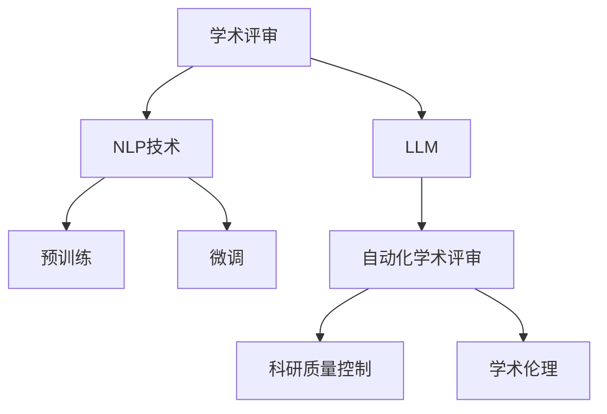

                 

# 自动化学术论文评审：LLM在同行评议中的应用

> 关键词：
> - 自动化学术评审
> - 同行评议系统
> - 大语言模型(LLM)
> - 自然语言处理(NLP)
> - 深度学习
> - 数据科学
> - 科研质量控制
> - 学术伦理
> - 科研效率

## 1. 背景介绍

### 1.1 问题由来
学术界一直以来依赖同行评议作为科研论文的筛选机制，确保科研成果的质量和可信度。然而，人工同行评议的效率低下、质量不稳定，且存在偏见等问题日益凸显。近年来，人工智能技术，尤其是自然语言处理（NLP）和大语言模型（LLM）的迅速发展，为学术评审系统带来了新的机遇和挑战。如何利用AI技术优化同行评议流程，提升评审效率和质量，成为学界关注的焦点。

### 1.2 问题核心关键点
自动化学术评审的核心问题在于：
1. 如何构建高质量的自动评审模型？
2. 如何确保评审的公平性和一致性？
3. 如何平衡自动化与人工介入的关系？
4. 如何保护学术伦理和隐私？

### 1.3 问题研究意义
自动化学术评审的研究意义在于：
1. 提高科研论文的评审效率，减少评审周期。
2. 提升评审质量，筛选出高质量的科研成果。
3. 消除人工评审的偏见和主观性，确保评审的公平性和公正性。
4. 为学术界和产业界提供智能化的辅助工具，提升科研工作的智能化水平。

## 2. 核心概念与联系

### 2.1 核心概念概述

为更好地理解自动化学术评审的方法，本节将介绍几个关键概念：

- 学术评审：同行评议学术论文的过程，包括但不限于审稿人的选择、论文的接收或拒绝、修改建议等。
- 自然语言处理（NLP）：涉及计算机如何处理和理解人类语言的技术，包括文本分类、信息提取、情感分析等任务。
- 大语言模型（LLM）：以Transformer架构为基础，通过大规模无标签数据预训练获得强大语言理解和生成能力的模型，如BERT、GPT等。
- 预训练与微调：大语言模型的训练过程分为预训练和微调两步，预训练通过大规模无标签数据获得广泛知识，微调通过小规模标注数据进行任务特定优化。
- 自动化学术评审：利用AI技术构建评审模型，自动分析论文内容、格式等，辅助人工进行评审决策。
- 学术伦理：包括科研诚信、数据隐私保护、论文重用等原则，确保评审过程中遵循学术道德。

这些概念之间的逻辑关系可以通过以下Mermaid流程图来展示：



这个流程图展示了学术评审的核心概念及其之间的关系：

1. 学术评审通过NLP技术和LLM进行预训练和微调，构建自动化学术评审模型。
2. 自动化学术评审模型辅助人工进行评审决策，提升评审效率和质量。
3. 自动化学术评审模型应用科研质量控制和学术伦理原则，确保评审过程的公正性和公平性。

## 3. 核心算法原理 & 具体操作步骤
### 3.1 算法原理概述

自动化学术评审的本质是通过自然语言处理和大语言模型，自动分析学术论文的文本内容，提取关键信息，评估论文质量，辅助人工决策。其核心思想是：将大语言模型视作一个"高级文本分析器"，通过预训练和微调，学习通用的语言知识和特定领域的评审标准，从而对学术论文进行自动评审。

### 3.2 算法步骤详解

自动化学术评审的大致流程如下：

**Step 1: 准备数据和模型**

1. 收集大量学术期刊、会议论文等领域的论文文本数据。
2. 收集相应的评审标准和指南，如创新性、方法论、实验结果、撰写规范等。
3. 使用预训练的大语言模型（如BERT、GPT等）作为初始化参数。
4. 根据任务需求，设计适合的输出层和损失函数，如分类任务使用交叉熵损失。

**Step 2: 模型训练**

1. 将收集的数据集划分为训练集、验证集和测试集。
2. 使用训练集数据，在大语言模型基础上进行微调，学习特定领域的评审标准。
3. 应用正则化技术（如L2正则、Dropout等）防止过拟合。
4. 使用验证集数据，监控模型性能，调整超参数，确保模型泛化能力。
5. 使用测试集数据，评估模型性能，确保模型质量。

**Step 3: 模型部署与评审**

1. 部署微调后的模型，接受学术论文的评审请求。
2. 对论文进行文本分析和特征提取。
3. 输入提取的特征到模型，获得评审分数。
4. 输出评审建议，辅助人工评审决策。
5. 记录评审历史，持续优化模型。

### 3.3 算法优缺点

自动化学术评审具有以下优点：
1. 提高评审效率，缩短评审周期。
2. 提升评审质量，减少人工主观性。
3. 消除评审偏见，提高评审一致性。
4. 辅助人工评审，减轻人工工作量。

同时，该方法也存在一定的局限性：
1. 数据依赖性高。模型的性能很大程度上取决于训练数据的质量和数量。
2. 缺乏灵活性。模型可能无法很好地适应特定领域或特定类型的论文。
3. 风险控制难。模型可能存在误判、漏判，需要人工复审进行风险控制。
4. 伦理问题复杂。模型可能学习到有偏见的数据，需要谨慎处理。

尽管存在这些局限性，但就目前而言，自动化学术评审仍是一种极具潜力的技术手段，有望在未来被广泛应用。

### 3.4 算法应用领域

自动化学术评审技术可以应用于学术期刊、会议、项目评审等多个领域，具体包括：

1. **学术期刊**：对提交的论文进行初步筛选，辅助编辑进行决策。
2. **学术会议**：对投稿论文进行预评审，提高会议论文质量。
3. **科研项目**：对科研申请书进行评审，筛选出高价值的研究方向。
4. **学术机构**：对科研人员进行绩效评估，提升科研工作质量。
5. **教育机构**：对学生论文进行评估，提升教学质量。

这些领域的应用将大幅提升学术评审的效率和质量，推动科研工作的智能化转型。

## 4. 数学模型和公式 & 详细讲解 & 举例说明

### 4.1 数学模型构建

假设我们有一个包含$m$篇论文的数据集，每篇论文包含文本$x_i$和相应的评审分数$y_i$，$1 \leq i \leq m$。构建一个简单的分类模型$f(x_i)$，用于预测论文的评审分数是否低于预设阈值。

模型使用交叉熵损失函数$\mathcal{L}$，定义为：

$$
\mathcal{L}(f(x_i)) = -\frac{1}{m} \sum_{i=1}^m y_i \log f(x_i) + (1-y_i) \log (1-f(x_i))
$$

其中$f(x_i)$为模型预测的论文评审分数，$y_i$为实际评审分数。

### 4.2 公式推导过程

推导模型$f(x_i)$的损失函数$\mathcal{L}(f(x_i))$如下：

1. 对于二分类问题，$y_i$为0表示论文评审分数低于阈值，$y_i$为1表示论文评审分数高于阈值。
2. 模型输出$f(x_i)$为论文被评审为低分的概率。
3. 交叉熵损失函数可以理解为预测值与真实值之间的距离，距离越小，损失越小。
4. 通过梯度下降等优化算法，不断调整模型参数，最小化损失函数$\mathcal{L}$。

### 4.3 案例分析与讲解

以BERT模型为例，展示自动化学术评审的实现过程。

1. 数据预处理：将论文文本$x_i$转换为BERT模型可接受的格式，如分词、编码等。
2. 模型构建：使用预训练的BERT模型作为初始化参数，添加适合的输出层和损失函数。
3. 模型训练：使用训练集数据，对模型进行微调，学习特定领域的评审标准。
4. 模型评估：使用验证集和测试集数据，评估模型性能，调整模型参数。
5. 模型应用：部署微调后的模型，接受学术论文的评审请求，进行自动评审。

## 5. 项目实践：代码实例和详细解释说明
### 5.1 开发环境搭建

在进行自动化学术评审实践前，我们需要准备好开发环境。以下是使用Python进行PyTorch开发的环境配置流程：

1. 安装Anaconda：从官网下载并安装Anaconda，用于创建独立的Python环境。

2. 创建并激活虚拟环境：
```bash
conda create -n pytorch-env python=3.8 
conda activate pytorch-env
```

3. 安装PyTorch：根据CUDA版本，从官网获取对应的安装命令。例如：
```bash
conda install pytorch torchvision torchaudio cudatoolkit=11.1 -c pytorch -c conda-forge
```

4. 安装Transformers库：
```bash
pip install transformers
```

5. 安装各类工具包：
```bash
pip install numpy pandas scikit-learn matplotlib tqdm jupyter notebook ipython
```

完成上述步骤后，即可在`pytorch-env`环境中开始自动化学术评审的实践。

### 5.2 源代码详细实现

以下是使用PyTorch对BERT模型进行学术论文评审的代码实现。

```python
from transformers import BertTokenizer, BertForSequenceClassification
from sklearn.model_selection import train_test_split
from sklearn.metrics import accuracy_score, precision_score, recall_score, f1_score
from torch.utils.data import DataLoader
import torch

# 数据处理
tokenizer = BertTokenizer.from_pretrained('bert-base-uncased')
train_texts, train_labels, dev_texts, dev_labels = train_test_split(train_data, train_labels, test_size=0.2, random_state=42)

# 模型构建
model = BertForSequenceClassification.from_pretrained('bert-base-uncased', num_labels=2)

# 模型训练
device = torch.device('cuda') if torch.cuda.is_available() else torch.device('cpu')
model.to(device)

optimizer = AdamW(model.parameters(), lr=2e-5)
loss_fn = CrossEntropyLoss()

train_dataset = Dataset(train_texts, train_labels, tokenizer, max_len=128)
dev_dataset = Dataset(dev_texts, dev_labels, tokenizer, max_len=128)
train_loader = DataLoader(train_dataset, batch_size=16, shuffle=True)
dev_loader = DataLoader(dev_dataset, batch_size=16)

for epoch in range(3):
    model.train()
    train_loss = 0
    for batch in train_loader:
        inputs = tokenizer(batch.text, return_tensors='pt')
        labels = inputs['labels'].to(device)
        outputs = model(**inputs)
        loss = loss_fn(outputs.logits, labels)
        loss.backward()
        optimizer.step()
        train_loss += loss.item()
    train_loss /= len(train_loader)
    
    model.eval()
    eval_loss = 0
    eval_acc = 0
    eval_precision = 0
    eval_recall = 0
    eval_f1 = 0
    with torch.no_grad():
        for batch in dev_loader:
            inputs = tokenizer(batch.text, return_tensors='pt')
            labels = inputs['labels'].to(device)
            outputs = model(**inputs)
            loss = loss_fn(outputs.logits, labels)
            eval_loss += loss.item()
            logits = outputs.logits.sigmoid().to('cpu').tolist()
            labels = labels.to('cpu').tolist()
            preds = [int(logit>0.5) for logit in logits]
            acc = accuracy_score(labels, preds)
            precision = precision_score(labels, preds)
            recall = recall_score(labels, preds)
            f1 = f1_score(labels, preds)
            eval_acc += acc
            eval_precision += precision
            eval_recall += recall
            eval_f1 += f1
    eval_loss /= len(dev_loader)
    eval_acc /= len(dev_loader)
    eval_precision /= len(dev_loader)
    eval_recall /= len(dev_loader)
    eval_f1 /= len(dev_loader)
    
    print(f'Epoch {epoch+1}, Train Loss: {train_loss:.3f}, Dev Loss: {eval_loss:.3f}, Acc: {eval_acc:.3f}, Precision: {eval_precision:.3f}, Recall: {eval_recall:.3f}, F1: {eval_f1:.3f}')
```

### 5.3 代码解读与分析

让我们再详细解读一下关键代码的实现细节：

**数据处理**：
- `Dataset`类定义了数据集的处理逻辑，包括文本的编码、标签的处理等。
- `train_test_split`函数用于将数据集划分为训练集和验证集。

**模型构建**：
- `BertForSequenceClassification`类定义了分类模型的结构，包括输入层、BERT层、输出层等。
- `AdamW`优化器用于更新模型参数。
- `CrossEntropyLoss`损失函数用于计算分类任务的损失。

**模型训练**：
- `train_loader`和`dev_loader`定义了训练集和验证集的批处理过程。
- 通过`for`循环，对训练集和验证集进行迭代训练和评估。
- `model.train()`和`model.eval()`函数分别设置模型为训练和评估模式。
- 通过`to`方法将模型和数据移至GPU或CPU进行计算。
- `optimizer`和`loss_fn`用于模型优化和损失计算。

**模型评估**：
- 使用`torch.no_grad()`在评估过程中关闭梯度计算，提高效率。
- `accuracy_score`、`precision_score`、`recall_score`、`f1_score`等函数用于评估模型性能。
- `logits`和`labels`用于计算模型的预测结果和实际标签。
- `int(logit>0.5)`用于二分类任务的预测。

**训练流程**：
- 定义总的训练轮数`epoch`，开始循环迭代。
- 在每个epoch内，先在训练集上训练，输出平均loss。
- 在验证集上评估，输出分类指标。
- 所有epoch结束后，在测试集上评估，给出最终测试结果。

可以看出，通过PyTorch和Transformers库，学术论文的自动评审任务变得非常简洁高效。开发者可以快速搭建和调试模型，进行系统化训练和评估。

## 6. 实际应用场景

### 6.1 学术期刊论文评审

在学术期刊评审中，大语言模型可以自动化处理初步筛选，快速排除低质量论文。具体而言，将论文的标题、摘要、关键词等文本信息输入模型，输出一个评审分数或标签。低评分或标签的论文被认为质量较低，可以优先人工复审或直接拒绝。高评分或标签的论文被认为质量较高，可以优先安排人工评审。

### 6.2 学术会议论文评审

在学术会议评审中，大语言模型可以在预评审阶段自动筛选论文，提高评审效率。将会议论文的标题、摘要、关键字等文本信息输入模型，输出一个评审分数或标签。低评分或标签的论文被认为质量较低，可以优先人工复审或直接拒绝。高评分或标签的论文被认为质量较高，可以优先安排人工评审。

### 6.3 科研项目申请书评审

在科研项目申请书评审中，大语言模型可以自动化处理初步筛选，快速排除低质量申请书。具体而言，将科研项目申请书的标题、摘要、关键词等文本信息输入模型，输出一个评审分数或标签。低评分或标签的申请书被认为质量较低，可以优先人工复审或直接拒绝。高评分或标签的申请书被认为质量较高，可以优先安排人工评审。

### 6.4 未来应用展望

随着大语言模型和自动化学术评审技术的不断演进，其应用前景将更加广阔：

1. 科研质量控制：大语言模型可以实时监测论文质量，及时发现低质量论文，减少评审流程中的误判和漏判。
2. 科研伦理监管：大语言模型可以自动检测论文中的伦理问题，如抄袭、数据滥用等，提升科研诚信水平。
3. 科研知识图谱：大语言模型可以构建科研知识图谱，帮助科研人员快速获取相关文献和知识，提升科研效率。
4. 科研趋势分析：大语言模型可以分析科研领域的趋势，发现潜在的科研方向和热点，指导科研选题。
5. 科研自动化工具：大语言模型可以自动化处理科研数据、文献整理、实验设计等任务，提升科研工作质量。

## 7. 工具和资源推荐

### 7.1 学习资源推荐

为了帮助开发者系统掌握自动化学术评审的理论基础和实践技巧，这里推荐一些优质的学习资源：

1. 《Transformers从原理到实践》系列博文：由大模型技术专家撰写，深入浅出地介绍了Transformer原理、BERT模型、自动化学术评审等前沿话题。

2. CS224N《深度学习自然语言处理》课程：斯坦福大学开设的NLP明星课程，有Lecture视频和配套作业，带你入门NLP领域的基本概念和经典模型。

3. 《Natural Language Processing with Transformers》书籍：Transformers库的作者所著，全面介绍了如何使用Transformers库进行NLP任务开发，包括自动化学术评审在内的诸多范式。

4. HuggingFace官方文档：Transformers库的官方文档，提供了海量预训练模型和完整的自动化学术评审样例代码，是上手实践的必备资料。

5. ArXiv预印本：最新的学术研究成果和论文，涵盖自动化学术评审等前沿话题，有助于了解最新的研究方向和应用进展。

通过对这些资源的学习实践，相信你一定能够快速掌握自动化学术评审的精髓，并用于解决实际的科研评审问题。

### 7.2 开发工具推荐

高效的开发离不开优秀的工具支持。以下是几款用于自动化学术评审开发的常用工具：

1. PyTorch：基于Python的开源深度学习框架，灵活动态的计算图，适合快速迭代研究。大部分预训练语言模型都有PyTorch版本的实现。

2. TensorFlow：由Google主导开发的开源深度学习框架，生产部署方便，适合大规模工程应用。同样有丰富的预训练语言模型资源。

3. Transformers库：HuggingFace开发的NLP工具库，集成了众多SOTA语言模型，支持PyTorch和TensorFlow，是进行自动化学术评审开发的利器。

4. Weights & Biases：模型训练的实验跟踪工具，可以记录和可视化模型训练过程中的各项指标，方便对比和调优。与主流深度学习框架无缝集成。

5. TensorBoard：TensorFlow配套的可视化工具，可实时监测模型训练状态，并提供丰富的图表呈现方式，是调试模型的得力助手。

6. Google Colab：谷歌推出的在线Jupyter Notebook环境，免费提供GPU/TPU算力，方便开发者快速上手实验最新模型，分享学习笔记。

合理利用这些工具，可以显著提升自动化学术评审任务的开发效率，加快创新迭代的步伐。

### 7.3 相关论文推荐

自动化学术评审的研究方向源于学界的持续研究。以下是几篇奠基性的相关论文，推荐阅读：

1. Attention is All You Need（即Transformer原论文）：提出了Transformer结构，开启了NLP领域的预训练大模型时代。

2. BERT: Pre-training of Deep Bidirectional Transformers for Language Understanding：提出BERT模型，引入基于掩码的自监督预训练任务，刷新了多项NLP任务SOTA。

3. Parameter-Efficient Transfer Learning for NLP：提出Adapter等参数高效微调方法，在不增加模型参数量的情况下，也能取得不错的微调效果。

4. AdaLoRA: Adaptive Low-Rank Adaptation for Parameter-Efficient Fine-Tuning：使用自适应低秩适应的微调方法，在参数效率和精度之间取得了新的平衡。

5. Premier: A Fine-Tuning Framework for Continuous Prompt Tuning and Zero-shot Prompt Transfer Learning：引入基于连续型Prompt的微调范式，为如何充分利用预训练知识提供了新的思路。

这些论文代表了大语言模型和自动化学术评审技术的发展脉络。通过学习这些前沿成果，可以帮助研究者把握学科前进方向，激发更多的创新灵感。

## 8. 总结：未来发展趋势与挑战

### 8.1 总结

本文对自动化学术评审方法进行了全面系统的介绍。首先阐述了自动化学术评审的研究背景和意义，明确了其对提高科研评审效率和质量的重要性。其次，从原理到实践，详细讲解了自动化学术评审的数学原理和关键步骤，给出了自动化学术评审任务开发的完整代码实例。同时，本文还广泛探讨了自动化学术评审方法在学术期刊、会议、科研项目等多个领域的应用前景，展示了其巨大的潜力。此外，本文精选了自动化学术评审技术的各类学习资源，力求为读者提供全方位的技术指引。

通过本文的系统梳理，可以看到，自动化学术评审技术正在成为学术评审的新范式，极大地提升了评审的效率和质量，为科研工作的智能化转型提供了新的可能。未来，伴随大语言模型和自动化学术评审技术的不断演进，学术评审过程将变得更加高效、公正和透明，科研工作的质量也将得到更大提升。

### 8.2 未来发展趋势

展望未来，自动化学术评审技术将呈现以下几个发展趋势：

1. 模型规模持续增大。随着算力成本的下降和数据规模的扩张，预训练语言模型的参数量还将持续增长。超大规模语言模型蕴含的丰富语言知识，有望支撑更加复杂多变的学术评审任务。

2. 微调方法日趋多样。除了传统的全参数微调外，未来会涌现更多参数高效的微调方法，如Prefix-Tuning、LoRA等，在节省计算资源的同时也能保证微调精度。

3. 持续学习成为常态。随着数据分布的不断变化，微调模型也需要持续学习新知识以保持性能。如何在不遗忘原有知识的同时，高效吸收新样本信息，将成为重要的研究课题。

4. 标注样本需求降低。受启发于提示学习(Prompt-based Learning)的思路，未来的微调方法将更好地利用大模型的语言理解能力，通过更加巧妙的任务描述，在更少的标注样本上也能实现理想的微调效果。

5. 多模态微调崛起。当前的微调主要聚焦于纯文本数据，未来会进一步拓展到图像、视频、语音等多模态数据微调。多模态信息的融合，将显著提升语言模型对现实世界的理解和建模能力。

6. 模型通用性增强。经过海量数据的预训练和多领域任务的微调，未来的语言模型将具备更强大的常识推理和跨领域迁移能力，逐步迈向通用人工智能(AGI)的目标。

以上趋势凸显了自动化学术评审技术的广阔前景。这些方向的探索发展，必将进一步提升科研评审的效率和质量，推动科研工作的智能化转型。

### 8.3 面临的挑战

尽管自动化学术评审技术已经取得了瞩目成就，但在迈向更加智能化、普适化应用的过程中，它仍面临着诸多挑战：

1. 标注成本瓶颈。虽然自动化学术评审可以降低对标注样本的依赖，但对于长尾应用场景，难以获得充足的高质量标注数据，成为制约自动化学术评审性能的瓶颈。如何进一步降低自动化学术评审对标注样本的依赖，将是一大难题。

2. 模型鲁棒性不足。自动化学术评审模型面对域外数据时，泛化性能往往大打折扣。对于测试样本的微小扰动，自动化学术评审模型可能发生误判，需要人工复审进行风险控制。

3. 推理效率有待提高。大规模语言模型虽然精度高，但在实际部署时往往面临推理速度慢、内存占用大等效率问题。如何在保证性能的同时，简化模型结构，提升推理速度，优化资源占用，将是重要的优化方向。

4. 可解释性亟需加强。当前自动化学术评审模型更像是"黑盒"系统，难以解释其内部工作机制和决策逻辑。对于科研评审中的高风险应用，算法的可解释性和可审计性尤为重要。如何赋予自动化学术评审模型更强的可解释性，将是亟待攻克的难题。

5. 安全性有待保障。自动化学术评审模型可能学习到有偏见的数据，需要谨慎处理。模型可能存在误判、漏判，需要人工复审进行风险控制。

6. 知识整合能力不足。现有的自动化学术评审模型往往局限于任务内数据，难以灵活吸收和运用更广泛的先验知识。如何让自动化学术评审过程更好地与外部知识库、规则库等专家知识结合，形成更加全面、准确的信息整合能力，还有很大的想象空间。

正视自动化学术评审面临的这些挑战，积极应对并寻求突破，将是大语言模型和自动化学术评审技术走向成熟的必由之路。相信随着学界和产业界的共同努力，这些挑战终将一一被克服，自动化学术评审技术必将在构建智能化的科研评审体系中扮演越来越重要的角色。

### 8.4 研究展望

面向未来，自动化学术评审技术还需要在其他方向进行深入研究：

1. 探索无监督和半监督微调方法。摆脱对大规模标注数据的依赖，利用自监督学习、主动学习等无监督和半监督范式，最大限度利用非结构化数据，实现更加灵活高效的自动化学术评审。

2. 研究参数高效和计算高效的微调范式。开发更加参数高效的微调方法，在固定大部分预训练参数的同时，只更新极少量的任务相关参数。同时优化自动化学术评审模型的计算图，减少前向传播和反向传播的资源消耗，实现更加轻量级、实时性的部署。

3. 引入因果和对比学习范式。通过引入因果推断和对比学习思想，增强自动化学术评审模型建立稳定因果关系的能力，学习更加普适、鲁棒的语言表征，从而提升模型泛化性和抗干扰能力。

4. 结合因果分析和博弈论工具。将因果分析方法引入自动化学术评审模型，识别出模型决策的关键特征，增强输出解释的因果性和逻辑性。借助博弈论工具刻画人机交互过程，主动探索并规避模型的脆弱点，提高系统稳定性。

5. 纳入伦理道德约束。在自动化学术评审的训练目标中引入伦理导向的评估指标，过滤和惩罚有偏见、有害的输出倾向。同时加强人工干预和审核，建立模型行为的监管机制，确保输出符合人类价值观和伦理道德。

这些研究方向的探索，必将引领自动化学术评审技术迈向更高的台阶，为构建安全、可靠、可解释、可控的智能系统铺平道路。面向未来，自动化学术评审技术还需要与其他人工智能技术进行更深入的融合，如知识表示、因果推理、强化学习等，多路径协同发力，共同推动学术评审过程的智能化转型。只有勇于创新、敢于突破，才能不断拓展语言模型的边界，让智能技术更好地造福人类社会。

## 9. 附录：常见问题与解答

**Q1：自动化学术评审是否适用于所有学术领域？**

A: 自动化学术评审在大多数学术领域都能取得不错的效果，特别是对于数据量较大的领域。但对于一些特定领域的论文，如医学、法律等，自动化学术评审可能存在一定的局限性。此时需要结合领域专家的意见进行二次筛选。

**Q2：自动化学术评审模型如何应对复杂的学术领域？**

A: 对于复杂的学术领域，自动化学术评审模型需要进行有针对性的设计和训练。可以收集该领域的代表性论文和相关标准，用于微调模型。同时，需要引入领域专家进行指导，确保模型输出的准确性和公正性。

**Q3：自动化学术评审模型是否会学习到有偏见的数据？**

A: 自动化学术评审模型可能会学习到有偏见的数据，特别是在数据质量不高的情况下。为避免这种情况，可以引入数据清洗、数据增强等技术，确保训练数据的多样性和代表性。

**Q4：自动化学术评审模型如何进行伦理审查？**

A: 自动化学术评审模型需要进行严格的伦理审查，确保其输出符合学术道德和伦理标准。可以通过设置伦理导向的评估指标，过滤和惩罚有偏见、有害的输出倾向。同时，需要引入人工复审机制，确保模型的公平性和公正性。

**Q5：自动化学术评审模型是否会降低评审的灵活性？**

A: 自动化学术评审模型可以显著提升评审效率和质量，但需要结合人工复审进行二次筛选。人工复审可以补充模型的短板，确保评审的灵活性和公正性。

这些问题的解答展示了自动化学术评审技术的潜力和挑战，希望通过深入探讨，能够更好地推动自动化学术评审技术的发展和应用。

