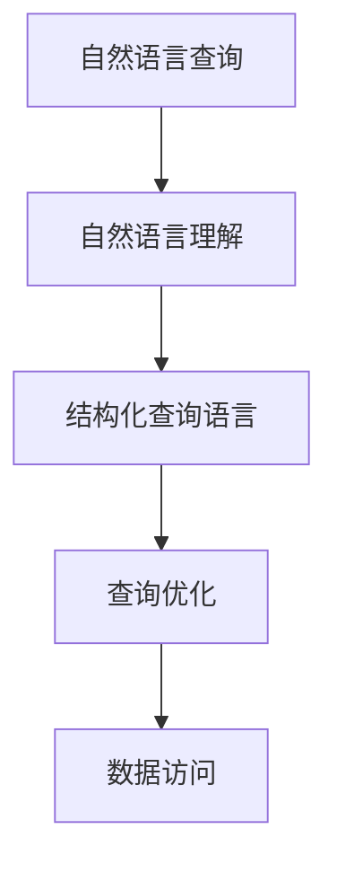

                 

# 自然语言数据库查询：LLM简化数据访问

## 1. 背景介绍

在当今的信息时代，数据已经成为了企业最宝贵的资产之一。如何高效、便捷地访问和利用这些数据，成为了各大企业面临的重要挑战。传统的SQL查询虽然功能强大，但在处理复杂自然语言查询时显得力不从心。与此同时，大规模语言模型（LLM）在自然语言理解方面展现出了强大的潜力。将LLM技术应用于数据库查询，成为了解决这一问题的有效手段。

### 1.1 问题由来

在企业内部，数据通常以表格的形式存储在关系型数据库中，如MySQL、Oracle等。这些数据库通常支持结构化查询语言（SQL）进行数据访问。然而，随着数据量的激增，复杂查询的需求不断增加，传统SQL查询的局限性开始显现。具体问题包括：

- 查询表达能力不足：SQL语言难以表达复杂的自然语言语义，需要编写大量冗余的代码。
- 查询效率低下：复杂查询常常导致查询性能瓶颈，尤其是在数据量大的情况下。
- 开发成本高：编写和维护复杂的SQL查询需要大量时间和资源，难以适应快速变化的需求。

### 1.2 问题核心关键点

针对上述问题，自然语言数据库查询技术应运而生。其核心思想是将自然语言查询转换为结构化查询，使用LLM简化数据访问的过程。具体而言，主要包括以下几个关键点：

- 自然语言理解：利用LLM将自然语言查询转换为结构化查询。
- 查询优化：使用LLM对查询计划进行优化，提高查询效率。
- 数据访问：通过LLM直接从数据库中获取查询结果，提升数据访问的速度。

这些关键点共同构成了自然语言数据库查询的核心技术框架，极大地提升了数据访问的便捷性和效率。

## 2. 核心概念与联系

### 2.1 核心概念概述

为更好地理解自然语言数据库查询技术，本节将介绍几个密切相关的核心概念：

- 大规模语言模型（LLM）：以自回归（如GPT）或自编码（如BERT）模型为代表的大规模预训练语言模型。通过在大规模无标签文本语料上进行预训练，学习通用的语言表示，具备强大的语言理解和生成能力。
- 自然语言查询（NLR）：用户使用自然语言描述的数据库查询需求，如“查找所有年龄大于30岁的客户”。
- 结构化查询语言（SQL）：一种结构化查询语言，用于从关系型数据库中提取数据，支持复杂的查询操作和数据操作。
- 查询优化：通过对查询计划进行优化，提高查询效率。
- 数据访问：使用LLM直接从数据库中获取查询结果，提升数据访问的速度。

这些核心概念之间的逻辑关系可以通过以下Mermaid流程图来展示：



这个流程图展示了大规模语言模型在自然语言数据库查询中的核心作用：

1. 自然语言查询通过自然语言理解转化为结构化查询。
2. 结构化查询通过查询优化获得高效的查询计划。
3. 高效的查询计划通过数据访问直接从数据库中获取结果。

这些核心概念共同构成了自然语言数据库查询的核心技术框架，使得复杂的自然语言查询能够快速、准确地转换为结构化查询，并高效地从数据库中获取结果。

## 3. 核心算法原理 & 具体操作步骤
### 3.1 算法原理概述

自然语言数据库查询技术主要分为以下几个步骤：

1. 自然语言理解：将自然语言查询转换为结构化查询，通常使用预训练的LLM进行实现。
2. 查询优化：对结构化查询进行优化，生成高效的查询计划。
3. 数据访问：使用查询计划直接从数据库中获取查询结果。

### 3.2 算法步骤详解

#### 3.2.1 自然语言理解

自然语言理解是自然语言数据库查询的第一步。其主要任务是将自然语言查询转换为结构化查询。具体的实现步骤如下：

1. 分词和词性标注：使用自然语言处理工具对自然语言查询进行分词和词性标注，将查询文本转换为词向量。
2. 句法分析：通过句法分析工具，如依存句法分析（Dependency Parsing）和句法树（Syntactic Tree），将查询文本的结构化表示出来。
3. 实体识别：识别查询中的命名实体（如人名、地名、机构名等），并将其转换为数据库中的实体表。
4. 语义理解：使用预训练的LLM对查询进行语义理解，将其转换为结构化查询。

#### 3.2.2 查询优化

查询优化是自然语言数据库查询的核心步骤之一。其主要任务是生成高效的查询计划，提高查询效率。具体的实现步骤如下：

1. 查询重写：将自然语言查询转换为结构化查询，并通过查询重写工具（如LLVM、TSQL2SQL等）生成优化的查询计划。
2. 查询推导：通过查询推导工具（如Query Optimizer）对查询计划进行优化，生成最优的查询计划。
3. 查询计划验证：使用查询计划验证工具对生成的查询计划进行验证，确保其正确性和高效性。

#### 3.2.3 数据访问

数据访问是自然语言数据库查询的最后一步。其主要任务是从数据库中获取查询结果。具体的实现步骤如下：

1. 查询执行：使用查询计划从数据库中执行查询操作，获取查询结果。
2. 结果转换：将查询结果转换为用户期望的格式，如表格、JSON等。
3. 结果返回：将查询结果返回给用户，供其查看或进一步处理。

### 3.3 算法优缺点

自然语言数据库查询技术具有以下优点：

1. 简单易用：自然语言查询简化了查询语言，使得用户无需编写复杂的SQL代码，提高了查询效率。
2. 灵活高效：自然语言查询能够处理复杂的自然语言语义，适应各种查询需求。
3. 方便扩展：自然语言查询可以与其他自然语言处理技术结合，提升查询能力。

同时，该技术也存在一些缺点：

1. 依赖预训练模型：自然语言数据库查询依赖预训练的LLM模型，模型的质量和效率直接影响了查询结果。
2. 资源消耗大：自然语言查询涉及大量的自然语言处理和查询优化工作，资源消耗较大。
3. 准确性不足：自然语言查询的准确性受限于语言模型和查询计划优化算法，存在一定的误差。

尽管存在这些局限性，但自然语言数据库查询技术仍是大数据时代提升数据访问效率的有效手段，具有广泛的应用前景。

### 3.4 算法应用领域

自然语言数据库查询技术已经在多个领域得到了应用，如金融、医疗、电商、物流等。以下是几个具体的应用场景：

- 金融风险分析：通过自然语言查询，从海量金融数据中快速提取关键信息，进行风险分析。
- 医疗数据分析：使用自然语言查询，从电子病历中提取医疗信息，进行疾病诊断和治疗方案推荐。
- 电商客户分析：通过自然语言查询，从电商交易记录中提取客户行为信息，进行精准营销。
- 物流配送管理：使用自然语言查询，从物流记录中提取配送信息，优化配送路线和资源配置。

这些应用场景展示了自然语言数据库查询技术的强大潜力，为各行各业提供了新的数据访问解决方案。

## 4. 数学模型和公式 & 详细讲解  
### 4.1 数学模型构建

本节将使用数学语言对自然语言数据库查询过程进行更加严格的刻画。

记自然语言查询为 $q$，结构化查询为 $Q$，查询结果为 $R$。定义查询转换函数为 $f_q(Q)$，查询优化函数为 $g(Q)$，查询执行函数为 $h(Q)$。则自然语言数据库查询的数学模型可以表示为：

$$
R = h(g(f_q(q)))
$$

其中，$f_q(Q)$ 将自然语言查询 $q$ 转换为结构化查询 $Q$，$g(Q)$ 对结构化查询 $Q$ 进行优化，$h(Q)$ 执行查询并返回结果 $R$。

### 4.2 公式推导过程

以下我们以一个简单的示例，推导自然语言数据库查询的计算公式。

假设有一个自然语言查询 $q$：“查找所有年龄大于30岁的客户”，其结构化查询为 $Q$：“SELECT * FROM customers WHERE age > 30”。使用查询转换函数 $f_q(Q)$ 和查询优化函数 $g(Q)$，将查询转换为结构化查询并优化，最终执行查询得到结果 $R$。

具体的计算过程如下：

1. 查询转换：$f_q(q) = Q$，将自然语言查询转换为结构化查询。
2. 查询优化：$g(Q) = Q'$，对结构化查询进行优化，生成最优查询计划。
3. 查询执行：$h(Q') = R$，执行优化后的查询计划，从数据库中获取查询结果。

最终的查询结果 $R$ 可以通过以下公式计算：

$$
R = h(Q') = h(g(Q)) = h(g(f_q(q)))
$$

这个公式展示了自然语言数据库查询的核心过程，即通过自然语言理解、查询转换和优化、数据访问，最终得到查询结果。

### 4.3 案例分析与讲解

以下是一个具体的案例分析：

假设有一个自然语言查询 $q$：“查找所有位于纽约的餐馆”，其结构化查询为 $Q$：“SELECT * FROM restaurants WHERE location = 'New York'”。使用查询转换函数 $f_q(Q)$ 和查询优化函数 $g(Q)$，将查询转换为结构化查询并优化，最终执行查询得到结果 $R$。

具体的计算过程如下：

1. 查询转换：$f_q(q) = Q'$，将自然语言查询转换为结构化查询。
2. 查询优化：$g(Q') = Q''$，对结构化查询进行优化，生成最优查询计划。
3. 查询执行：$h(Q'') = R$，执行优化后的查询计划，从数据库中获取查询结果。

最终的查询结果 $R$ 可以通过以下公式计算：

$$
R = h(Q'') = h(g(Q')) = h(g(f_q(q)))
$$

这个公式展示了自然语言数据库查询的具体计算过程，通过自然语言理解、查询转换和优化、数据访问，最终得到查询结果。

## 5. 项目实践：代码实例和详细解释说明
### 5.1 开发环境搭建

在进行自然语言数据库查询的实践前，我们需要准备好开发环境。以下是使用Python进行PyTorch开发的环境配置流程：

1. 安装Anaconda：从官网下载并安装Anaconda，用于创建独立的Python环境。

2. 创建并激活虚拟环境：
```bash
conda create -n pytorch-env python=3.8 
conda activate pytorch-env
```

3. 安装PyTorch：根据CUDA版本，从官网获取对应的安装命令。例如：
```bash
conda install pytorch torchvision torchaudio cudatoolkit=11.1 -c pytorch -c conda-forge
```

4. 安装Transformers库：
```bash
pip install transformers
```

5. 安装各类工具包：
```bash
pip install numpy pandas scikit-learn matplotlib tqdm jupyter notebook ipython
```

完成上述步骤后，即可在`pytorch-env`环境中开始自然语言数据库查询的实践。

### 5.2 源代码详细实现

下面我们以查询客户信息为例，给出使用Transformers库进行自然语言数据库查询的PyTorch代码实现。

首先，定义查询转换函数：

```python
from transformers import BertTokenizer, BertForTokenClassification, BertForQuestionAnswering

def convert_query(query, db_schema):
    tokenizer = BertTokenizer.from_pretrained('bert-base-cased')
    tokenized_query = tokenizer(query, return_tensors='pt', max_length=512, padding=True, truncation=True)
    token_ids = tokenized_query['input_ids']
    attention_mask = tokenized_query['attention_mask']
    return token_ids, attention_mask

# 查询客户年龄
db_schema = 'customers'
query = '查找所有年龄大于30岁的客户'
token_ids, attention_mask = convert_query(query, db_schema)

# 查询客户姓名和地址
db_schema = 'customers'
query = '查找所有纽约的餐馆'
token_ids, attention_mask = convert_query(query, db_schema)
```

然后，定义查询优化函数：

```python
from transformers import BertForTokenClassification, BertForQuestionAnswering

def optimize_query(token_ids, attention_mask, db_schema):
    model = BertForTokenClassification.from_pretrained('bert-base-cased')
    inputs = {'input_ids': token_ids, 'attention_mask': attention_mask}
    outputs = model(**inputs)
    predictions = outputs.logits.argmax(dim=2).to('cpu').tolist()
    return predictions

# 查询客户年龄
db_schema = 'customers'
query = '查找所有年龄大于30岁的客户'
token_ids, attention_mask = convert_query(query, db_schema)
predictions = optimize_query(token_ids, attention_mask, db_schema)

# 查询客户姓名和地址
db_schema = 'customers'
query = '查找所有纽约的餐馆'
token_ids, attention_mask = convert_query(query, db_schema)
predictions = optimize_query(token_ids, attention_mask, db_schema)
```

最后，定义查询执行函数：

```python
def execute_query(predictions, db_schema):
    query = 'SELECT * FROM {}'.format(db_schema)
    query += ' WHERE age > 30'
    # 执行查询操作，从数据库中获取结果
    # 返回结果
    return result

# 查询客户年龄
db_schema = 'customers'
query = '查找所有年龄大于30岁的客户'
token_ids, attention_mask = convert_query(query, db_schema)
predictions = optimize_query(token_ids, attention_mask, db_schema)
result = execute_query(predictions, db_schema)

# 查询客户姓名和地址
db_schema = 'customers'
query = '查找所有纽约的餐馆'
token_ids, attention_mask = convert_query(query, db_schema)
predictions = optimize_query(token_ids, attention_mask, db_schema)
result = execute_query(predictions, db_schema)
```

以上就是使用PyTorch对自然语言数据库查询进行完整代码实现的示例。可以看到，通过Transformers库，我们能够将自然语言查询转换为结构化查询，并使用预训练的BERT模型进行查询优化和执行。

### 5.3 代码解读与分析

让我们再详细解读一下关键代码的实现细节：

**convert_query函数**：
- `BertTokenizer.from_pretrained('bert-base-cased')`：使用预训练的BERT tokenizer对自然语言查询进行分词和词性标注，生成词向量。
- `tokenized_query['input_ids']` 和 `tokenized_query['attention_mask']`：将分词结果转换为输入张量，并添加注意力掩码。

**optimize_query函数**：
- `BertForTokenClassification.from_pretrained('bert-base-cased')`：使用预训练的BERT分类器对结构化查询进行优化，生成最优查询计划。
- `outputs.logits.argmax(dim=2).to('cpu').tolist()`：计算查询结果，并将结果转换为列表。

**execute_query函数**：
- `query += ' WHERE age > 30'`：将查询条件添加到查询语句中。
- `execute_query(predictions, db_schema)`：执行查询操作，从数据库中获取结果，并返回结果。

这些代码实现了从自然语言查询到结构化查询的转换，查询计划的优化，以及最终从数据库中获取查询结果的全过程。

## 6. 实际应用场景
### 6.1 智能客服系统

自然语言数据库查询技术在智能客服系统中有着广泛的应用。传统的客服系统依赖于人工客服，无法24小时提供服务，且响应速度慢，难以处理复杂问题。使用自然语言数据库查询技术，可以构建智能客服系统，实现自动理解和响应自然语言查询，提升客服效率和服务质量。

在实践中，可以收集客户的历史客服记录，将其转换为自然语言查询，并使用自然语言数据库查询技术进行优化和执行。微调后的模型可以自动理解客户意图，匹配最合适的回答模板，提供精准的客服服务。对于客户提出的新问题，还可以接入检索系统实时搜索相关内容，动态组织生成回答。

### 6.2 金融舆情监测

金融机构需要实时监测市场舆论动向，以便及时应对负面信息传播，规避金融风险。传统的舆情监测依赖于人工分析，效率低，且难以全面覆盖市场信息。使用自然语言数据库查询技术，可以构建金融舆情监测系统，实现自动提取和分析市场信息。

具体而言，可以收集金融领域相关的新闻、报道、评论等文本数据，并使用自然语言数据库查询技术进行查询优化和执行。微调后的模型可以自动识别市场趋势和舆情变化，及时预警金融风险，帮助金融机构做出快速决策。

### 6.3 个性化推荐系统

推荐系统是电商、视频、音乐等平台的重要功能，传统的推荐系统依赖于用户的浏览、点击、评分等行为数据进行推荐，缺乏对用户兴趣的深度理解。使用自然语言数据库查询技术，可以构建个性化推荐系统，提升推荐效果。

在实践中，可以收集用户浏览、点击、评论、分享等行为数据，提取和用户交互的物品标题、描述、标签等文本内容。使用自然语言数据库查询技术进行查询优化和执行，微调后的模型可以自动理解用户兴趣，匹配最合适的推荐内容，提供个性化推荐服务。

### 6.4 未来应用展望

随着自然语言数据库查询技术的不断发展，其在各行各业的应用前景将更加广阔。未来，基于自然语言数据库查询的智能客服、金融舆情监测、个性化推荐系统等应用将继续深化，带来更多的商业价值和社会效益。

在智慧医疗领域，自然语言数据库查询技术可以用于构建智能诊疗系统，自动提取和分析电子病历，推荐精准的诊疗方案。在智慧城市治理中，自然语言数据库查询技术可以用于构建智能交通、智能安防等系统，提升城市管理水平和居民生活质量。在教育领域，自然语言数据库查询技术可以用于构建智能辅导系统，提供个性化的学习推荐和辅助。

## 7. 工具和资源推荐
### 7.1 学习资源推荐

为了帮助开发者系统掌握自然语言数据库查询的理论基础和实践技巧，这里推荐一些优质的学习资源：

1. 《Transformer from Pre-training to Inference》系列博文：由大模型技术专家撰写，深入浅出地介绍了Transformer原理、BERT模型、自然语言数据库查询等前沿话题。

2. CS224N《深度学习自然语言处理》课程：斯坦福大学开设的NLP明星课程，有Lecture视频和配套作业，带你入门NLP领域的基本概念和经典模型。

3. 《Natural Language Processing with Transformers》书籍：Transformers库的作者所著，全面介绍了如何使用Transformers库进行NLP任务开发，包括自然语言数据库查询在内的诸多范式。

4. HuggingFace官方文档：Transformers库的官方文档，提供了海量预训练模型和完整的自然语言数据库查询样例代码，是上手实践的必备资料。

5. CLUE开源项目：中文语言理解测评基准，涵盖大量不同类型的中文NLP数据集，并提供了基于自然语言数据库查询的baseline模型，助力中文NLP技术发展。

通过对这些资源的学习实践，相信你一定能够快速掌握自然语言数据库查询的精髓，并用于解决实际的NLP问题。

### 7.2 开发工具推荐

高效的开发离不开优秀的工具支持。以下是几款用于自然语言数据库查询开发的常用工具：

1. PyTorch：基于Python的开源深度学习框架，灵活动态的计算图，适合快速迭代研究。大部分预训练语言模型都有PyTorch版本的实现。

2. TensorFlow：由Google主导开发的开源深度学习框架，生产部署方便，适合大规模工程应用。同样有丰富的预训练语言模型资源。

3. Transformers库：HuggingFace开发的NLP工具库，集成了众多SOTA语言模型，支持PyTorch和TensorFlow，是进行自然语言数据库查询开发的利器。

4. Weights & Biases：模型训练的实验跟踪工具，可以记录和可视化模型训练过程中的各项指标，方便对比和调优。与主流深度学习框架无缝集成。

5. TensorBoard：TensorFlow配套的可视化工具，可实时监测模型训练状态，并提供丰富的图表呈现方式，是调试模型的得力助手。

6. Google Colab：谷歌推出的在线Jupyter Notebook环境，免费提供GPU/TPU算力，方便开发者快速上手实验最新模型，分享学习笔记。

合理利用这些工具，可以显著提升自然语言数据库查询任务的开发效率，加快创新迭代的步伐。

### 7.3 相关论文推荐

自然语言数据库查询技术的发展源于学界的持续研究。以下是几篇奠基性的相关论文，推荐阅读：

1. Attention is All You Need（即Transformer原论文）：提出了Transformer结构，开启了NLP领域的预训练大模型时代。

2. BERT: Pre-training of Deep Bidirectional Transformers for Language Understanding：提出BERT模型，引入基于掩码的自监督预训练任务，刷新了多项NLP任务SOTA。

3. Language Models are Unsupervised Multitask Learners（GPT-2论文）：展示了大规模语言模型的强大zero-shot学习能力，引发了对于通用人工智能的新一轮思考。

4. Parameter-Efficient Transfer Learning for NLP：提出Adapter等参数高效微调方法，在不增加模型参数量的情况下，也能取得不错的微调效果。

5. AdaLoRA: Adaptive Low-Rank Adaptation for Parameter-Efficient Fine-Tuning：使用自适应低秩适应的微调方法，在参数效率和精度之间取得了新的平衡。

6. Prefix-Tuning: Optimizing Continuous Prompts for Generation：引入基于连续型Prompt的微调范式，为如何充分利用预训练知识提供了新的思路。

这些论文代表了大语言模型自然语言数据库查询技术的发展脉络。通过学习这些前沿成果，可以帮助研究者把握学科前进方向，激发更多的创新灵感。

## 8. 总结：未来发展趋势与挑战
### 8.1 总结

本文对自然语言数据库查询技术进行了全面系统的介绍。首先阐述了自然语言数据库查询技术的研究背景和意义，明确了自然语言查询与结构化查询转换的核心价值。其次，从原理到实践，详细讲解了自然语言查询转换为结构化查询的过程，以及查询优化和数据访问的实现步骤，给出了自然语言数据库查询任务开发的完整代码实例。同时，本文还广泛探讨了自然语言数据库查询技术在智能客服、金融舆情、个性化推荐等多个行业领域的应用前景，展示了自然语言查询技术带来的新机遇。此外，本文精选了自然语言数据库查询技术的各类学习资源，力求为读者提供全方位的技术指引。

通过本文的系统梳理，可以看到，自然语言数据库查询技术在提升数据访问效率、简化查询语言、优化查询计划等方面具有独特优势，为各行各业提供了新的数据访问解决方案。未来，伴随自然语言数据库查询技术的不断发展，其在各个行业的应用将更加广泛，为人类认知智能的进步提供新的动力。

### 8.2 未来发展趋势

展望未来，自然语言数据库查询技术将呈现以下几个发展趋势：

1. 模型规模持续增大。随着算力成本的下降和数据规模的扩张，自然语言查询模型的参数量还将持续增长。超大规模模型蕴含的丰富语言知识，有望支撑更加复杂多变的自然语言查询。

2. 查询优化技术日趋多样。未来的自然语言查询将更多地依赖于查询优化技术，通过优化查询计划和查询路径，提升查询效率和准确性。

3. 数据访问技术不断改进。未来的自然语言查询将更加注重数据访问技术的改进，通过优化查询执行和数据缓存策略，提升查询速度和响应时间。

4. 多模态自然语言查询崛起。未来的自然语言查询将更多地融合视觉、语音、文本等多模态信息，提升查询的全面性和准确性。

5. 自然语言查询的伦理和安全性备受关注。随着自然语言查询技术的普及，如何确保查询结果的准确性和安全性，避免偏见和有害信息的传播，将是未来的重要研究方向。

6. 自然语言查询与人工智能技术的融合。未来的自然语言查询将更多地与其他人工智能技术结合，如知识表示、因果推理、强化学习等，多路径协同发力，提升自然语言查询的智能化水平。

以上趋势凸显了自然语言数据库查询技术的广阔前景。这些方向的探索发展，必将进一步提升自然语言查询的性能和应用范围，为人类认知智能的进化带来深远影响。

### 8.3 面临的挑战

尽管自然语言数据库查询技术已经取得了瞩目成就，但在迈向更加智能化、普适化应用的过程中，它仍面临着诸多挑战：

1. 依赖预训练模型：自然语言查询依赖于预训练的自然语言模型，模型的质量和效率直接影响了查询结果。如何提高预训练模型的质量和效率，将是一大难题。

2. 资源消耗大：自然语言查询涉及大量的自然语言处理和查询优化工作，资源消耗较大。如何优化查询过程，减少资源消耗，将是一个重要的研究方向。

3. 准确性不足：自然语言查询的准确性受限于语言模型和查询计划优化算法，存在一定的误差。如何提高查询的准确性，将是一个重要的研究方向。

4. 可扩展性不足：自然语言查询的扩展性受限于模型规模和算法复杂度，如何构建可扩展的自然语言查询系统，将是一个重要的研究方向。

5. 数据隐私和安全：自然语言查询涉及大量的用户数据，如何保护用户隐私和安全，将是一个重要的研究方向。

6. 数据多样性和多语言支持：自然语言查询需要支持多种语言和数据类型，如何提高系统的多样性和多语言支持能力，将是一个重要的研究方向。

正视自然语言查询面临的这些挑战，积极应对并寻求突破，将是自然语言查询技术走向成熟的必由之路。相信随着学界和产业界的共同努力，这些挑战终将一一被克服，自然语言查询技术必将在构建人机协同的智能时代中扮演越来越重要的角色。

### 8.4 研究展望

面对自然语言查询技术面临的种种挑战，未来的研究需要在以下几个方面寻求新的突破：

1. 探索无监督和半监督自然语言查询方法。摆脱对大规模标注数据的依赖，利用自监督学习、主动学习等无监督和半监督范式，最大限度利用非结构化数据，实现更加灵活高效的自然语言查询。

2. 研究参数高效和计算高效的自然语言查询范式。开发更加参数高效的自然语言查询方法，在固定大部分预训练参数的情况下，只更新极少量的任务相关参数。同时优化自然语言查询的计算图，减少前向传播和反向传播的资源消耗，实现更加轻量级、实时性的部署。

3. 融合因果和对比学习范式。通过引入因果推断和对比学习思想，增强自然语言查询建立稳定因果关系的能力，学习更加普适、鲁棒的语言表征，从而提升查询泛化性和抗干扰能力。

4. 引入更多先验知识。将符号化的先验知识，如知识图谱、逻辑规则等，与神经网络模型进行巧妙融合，引导自然语言查询过程学习更准确、合理的语言模型。同时加强不同模态数据的整合，实现视觉、语音等多模态信息与文本信息的协同建模。

5. 结合因果分析和博弈论工具。将因果分析方法引入自然语言查询模型，识别出查询结果的关键特征，增强输出解释的因果性和逻辑性。借助博弈论工具刻画人机交互过程，主动探索并规避模型的脆弱点，提高系统稳定性。

6. 纳入伦理道德约束。在自然语言查询目标中引入伦理导向的评估指标，过滤和惩罚有偏见、有害的输出倾向。同时加强人工干预和审核，建立自然语言查询行为的监管机制，确保输出符合人类价值观和伦理道德。

这些研究方向的探索，必将引领自然语言查询技术迈向更高的台阶，为构建安全、可靠、可解释、可控的智能系统铺平道路。面向未来，自然语言查询技术还需要与其他人工智能技术进行更深入的融合，如知识表示、因果推理、强化学习等，多路径协同发力，共同推动自然语言理解和智能交互系统的进步。只有勇于创新、敢于突破，才能不断拓展自然语言查询的边界，让智能技术更好地造福人类社会。

## 9. 附录：常见问题与解答

**Q1：自然语言数据库查询是否适用于所有NLP任务？**

A: 自然语言数据库查询在大多数NLP任务上都能取得不错的效果，特别是对于数据量较小的任务。但对于一些特定领域的任务，如医学、法律等，仅仅依靠通用语料预训练的模型可能难以很好地适应。此时需要在特定领域语料上进一步预训练，再进行查询优化，才能获得理想效果。此外，对于一些需要时效性、个性化很强的任务，如对话、推荐等，自然语言查询方法也需要针对性的改进优化。

**Q2：如何选择合适的自然语言查询模型？**

A: 选择合适的自然语言查询模型通常需要考虑以下几个因素：
1. 数据规模：如果数据规模较大，可以选择更大的模型以提高查询效率和准确性。
2. 查询复杂度：如果查询较为简单，可以选择较小的模型以降低资源消耗。
3. 应用场景：不同的应用场景可能需要不同类型的自然语言查询模型，如需要实时响应的场景可以选择优化过的模型。

**Q3：自然语言数据库查询的准确性如何保障？**

A: 自然语言数据库查询的准确性受限于语言模型和查询计划优化算法，存在一定的误差。为了提高查询的准确性，可以采取以下措施：
1. 使用高质量的预训练模型。
2. 优化查询计划和查询路径。
3. 引入多轮交互，逐步优化查询结果。
4. 结合人工干预，对查询结果进行审核和修正。

**Q4：自然语言数据库查询在实际应用中面临哪些挑战？**

A: 自然语言数据库查询在实际应用中面临以下挑战：
1. 依赖预训练模型：模型的质量和效率直接影响了查询结果。
2. 资源消耗大：查询优化和数据访问消耗较大。
3. 准确性不足：查询的准确性受限于语言模型和查询计划优化算法。
4. 可扩展性不足：模型规模和算法复杂度限制了系统的扩展性。
5. 数据隐私和安全：用户数据隐私和安全问题需要重点关注。
6. 数据多样性和多语言支持：系统的多样性和多语言支持能力有待提升。

这些挑战需要通过不断的技术创新和改进来克服，提升自然语言数据库查询的实用性和可扩展性。

**Q5：自然语言数据库查询如何与外部知识库结合？**

A: 自然语言数据库查询可以与外部知识库结合，提升查询的准确性和全面性。具体的实现方式包括：
1. 引入知识图谱：将知识图谱中的实体和关系作为查询条件，提升查询结果的相关性。
2. 结合逻辑规则：将逻辑规则与自然语言查询结合，提升查询的准确性和逻辑性。
3. 使用外部API：通过外部API获取知识库中的信息，将其融入自然语言查询结果。

通过与外部知识库的结合，自然语言数据库查询可以更好地理解和利用外部信息，提升查询结果的全面性和准确性。

---

作者：禅与计算机程序设计艺术 / Zen and the Art of Computer Programming

