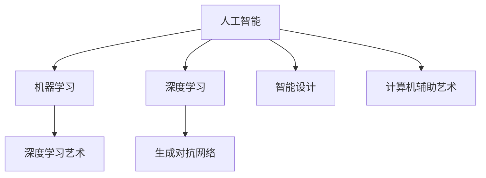

                 

# 艺术与科技的融合：人类计算激发创意

## 1. 背景介绍

### 1.1 问题由来
随着科技的迅速发展，人工智能(AI)已经逐渐融入到艺术创作中，为人类带来前所未有的创新和可能性。AI在音乐、绘画、文学、设计等各个领域均有应用，不断推动着人类艺术创作方式的变革。

在艺术创作领域，传统手工艺与现代科技的结合，实现了从手工到自动化的转变，大大提高了创作效率。AI算法能够快速处理海量数据，发现隐藏的规律和模式，为艺术创作提供更多灵感和选择。然而，如何将AI技术与艺术创作有机结合，充分发挥其潜力，仍然是一个亟待解决的难题。

### 1.2 问题核心关键点
实现AI与艺术的融合，需要解决以下几个关键问题：
1. **数据获取与处理**：获取高质量的艺术数据，并对数据进行预处理，使其适合机器学习模型的训练。
2. **算法选择与应用**：选择合适的算法，训练模型，并在实际应用中优化模型，提高创作效果。
3. **人机协作方式**：研究人机协作的模式，设计用户友好的交互界面，使得艺术家能够高效使用AI工具。
4. **创意激发与保护**：如何在AI帮助下激发创意的同时，保护艺术家的独特风格和创作自由。

### 1.3 问题研究意义
研究AI在艺术创作中的应用，有助于更好地理解科技与艺术的交叉点，推动人类计算与创意艺术的融合，激发更多的创新灵感。具体意义包括：
1. **提升创作效率**：AI可以快速处理海量数据，辅助艺术家进行创意创作。
2. **拓展创作边界**：AI能够挖掘新的创作模式和表现手法，打破传统艺术创作的局限。
3. **促进跨学科合作**：AI技术与艺术的融合，有助于促进不同学科之间的交流与合作，催生新的艺术形式和表现手法。
4. **推动艺术产业升级**：AI技术的应用，有助于提升艺术品的市场价值和传播效率，促进艺术产业的升级转型。

## 2. 核心概念与联系

### 2.1 核心概念概述

为了更好地理解AI在艺术创作中的应用，本节将介绍几个密切相关的核心概念：

- **人工智能(AI)**：指模拟人类智能行为的计算系统，包括机器学习、深度学习、自然语言处理等技术。
- **机器学习(ML)**：一种基于数据驱动的算法，使计算机能够从经验中学习，改进任务表现。
- **深度学习(DL)**：一种特殊形式的机器学习，通过多层神经网络模型进行特征提取和模式识别。
- **生成对抗网络(GAN)**：一种由生成器和判别器组成的模型，用于生成逼真图像、音频等内容。
- **深度学习艺术**：指通过深度学习模型进行艺术创作，如生成绘画、音乐、文本等。
- **智能设计**：指利用AI进行设计决策辅助，如自动布局、风格迁移等。
- **计算机辅助艺术**：指使用计算机技术辅助艺术家进行创作，如3D建模、动画制作等。

这些核心概念之间的逻辑关系可以通过以下Mermaid流程图来展示：



这个流程图展示了一些关键概念的相互关系：

1. 人工智能涵盖了机器学习和深度学习，是实现技术融合的基础。
2. 深度学习艺术和智能设计利用AI技术进行艺术创作和设计辅助。
3. 计算机辅助艺术通过AI工具提升创作效率和效果。
4. 生成对抗网络是深度学习的一种特殊形式，常用于艺术创作中的生成任务。

## 3. 核心算法原理 & 具体操作步骤

### 3.1 算法原理概述

在艺术创作中，AI的核心理论主要包括深度学习、生成对抗网络和深度学习艺术。以下是这些算法的核心原理：

1. **深度学习**：通过多层神经网络模型进行特征提取和模式识别，用于艺术创作中的特征匹配和分类。
2. **生成对抗网络**：通过两个对抗的神经网络（生成器和判别器）进行博弈，生成逼真的艺术作品。
3. **深度学习艺术**：利用深度学习模型生成艺术作品，如生成绘画、音乐、文本等。

### 3.2 算法步骤详解

以深度学习艺术为例，其基本的算法步骤如下：

1. **数据获取与预处理**：
   - 收集高质量的艺术数据，如图像、音频、文本等。
   - 对数据进行预处理，如归一化、扩增、拼接等。

2. **模型训练**：
   - 选择适合的艺术创作模型，如GAN、VAE等。
   - 使用标注数据进行模型训练，优化损失函数。
   - 进行模型调参，如调整学习率、迭代次数等。

3. **生成与优化**：
   - 使用训练好的模型生成新的艺术作品。
   - 根据评价指标（如逼真度、多样性、独特性等）对生成作品进行优化。

4. **用户交互**：
   - 设计友好的用户界面，允许艺术家对生成作品进行调整和反馈。
   - 使用AI工具辅助艺术家进行创意创作，提供多种创作建议和方案。

### 3.3 算法优缺点

深度学习艺术的主要优点包括：
1. **高效生成**：快速生成大量艺术作品，大大提高创作效率。
2. **多样性**：生成多样化、风格各异的作品，打破传统创作的局限。
3. **自动化**：自动化处理海量数据，辅助艺术家进行创作。

然而，深度学习艺术也存在一些缺点：
1. **创造性不足**：生成作品缺乏独特的艺术风格和创意，依赖于训练数据的分布。
2. **可解释性差**：模型生成的艺术作品缺乏明确的解释，难以理解其创作逻辑。
3. **伦理问题**：生成艺术作品可能包含不合适的元素，侵犯艺术家的版权和隐私。

### 3.4 算法应用领域

深度学习艺术已经在多个领域得到应用，例如：

1. **视觉艺术**：生成绘画、雕塑、摄影等视觉作品。
2. **音乐艺术**：生成音乐、节奏、旋律等音频作品。
3. **文学艺术**：生成文本、诗歌、故事等文学作品。
4. **设计艺术**：生成海报、广告、界面设计等应用作品。

此外，深度学习艺术还被应用于游戏开发、虚拟现实、广告创意等领域，为艺术创作带来了新的可能性。

## 4. 数学模型和公式 & 详细讲解 & 举例说明

### 4.1 数学模型构建

以生成对抗网络（GAN）为例，其基本的数学模型构建如下：

- **生成器（Generator）**：$G(z)$，将随机噪声向量$z$映射为生成样本$x_g$。
- **判别器（Discriminator）**：$D(x)$，判断输入样本$x$是否为真实样本。

GAN的目标是使生成器生成的样本与真实样本难以区分。

### 4.2 公式推导过程

GAN的损失函数由生成器和判别器的损失组成：

$$
\mathcal{L}_{GAN} = \mathcal{L}_G + \mathcal{L}_D
$$

其中，生成器的损失函数为：

$$
\mathcal{L}_G = -\mathbb{E}_{z \sim p_z}[\log D(G(z))]
$$

判别器的损失函数为：

$$
\mathcal{L}_D = -\mathbb{E}_{x \sim p_{data}}[\log D(x)] - \mathbb{E}_{z \sim p_z}[\log(1-D(G(z)))]
$$

这些公式表达了GAN的基本原理和目标。

### 4.3 案例分析与讲解

以下以GAN生成图像为例，进行详细讲解：

1. **数据准备**：收集高质量的艺术数据，如绘画、摄影等图像。
2. **模型训练**：构建生成器和判别器网络，使用标注数据进行训练，优化损失函数。
3. **生成图像**：使用训练好的生成器网络，生成新的艺术作品。
4. **评估与优化**：根据评价指标（如逼真度、多样性、独特性等）对生成作品进行优化。

例如，以下代码展示了使用GAN生成图像的基本流程：

```python
import torch
from torch import nn
from torchvision import datasets, transforms

# 定义生成器网络
class Generator(nn.Module):
    def __init__(self):
        super(Generator, self).__init__()
        self.encoder = nn.Sequential(
            nn.Linear(100, 128),
            nn.LeakyReLU(0.2, inplace=True),
            nn.Linear(128, 256),
            nn.LeakyReLU(0.2, inplace=True),
            nn.Linear(256, 512),
            nn.LeakyReLU(0.2, inplace=True),
            nn.Linear(512, 28*28),
            nn.Tanh()
        )
        self.decoder = nn.Sequential(
            nn.Linear(28*28, 512),
            nn.LeakyReLU(0.2, inplace=True),
            nn.Linear(512, 256),
            nn.LeakyReLU(0.2, inplace=True),
            nn.Linear(256, 128),
            nn.LeakyReLU(0.2, inplace=True),
            nn.Linear(128, 100),
            nn.Tanh()
        )

    def forward(self, z):
        x = self.encoder(z)
        x = x.view(x.size(0), 1, 28, 28)
        x = self.decoder(x)
        return x

# 定义判别器网络
class Discriminator(nn.Module):
    def __init__(self):
        super(Discriminator, self).__init__()
        self.encoder = nn.Sequential(
            nn.Linear(28*28, 512),
            nn.LeakyReLU(0.2, inplace=True),
            nn.Linear(512, 256),
            nn.LeakyReLU(0.2, inplace=True),
            nn.Linear(256, 1),
            nn.Sigmoid()
        )

    def forward(self, x):
        x = x.view(x.size(0), -1)
        x = self.encoder(x)
        return x

# 加载数据集
data = datasets.MNIST(root='./data', train=True, download=True, transform=transforms.ToTensor())

# 定义生成器和判别器
G = Generator()
D = Discriminator()

# 定义优化器
G_optimizer = torch.optim.Adam(G.parameters(), lr=0.0002)
D_optimizer = torch.optim.Adam(D.parameters(), lr=0.0002)

# 定义损失函数
criterion = nn.BCELoss()

# 训练模型
for epoch in range(100):
    for i, (images, _) in enumerate(data):
        G_optimizer.zero_grad()
        D_optimizer.zero_grad()

        z = torch.randn(images.size(0), 100)
        fake_images = G(z)
        real_images = images

        real_outputs = D(real_images)
        fake_outputs = D(fake_images)

        # 计算损失
        G_loss = criterion(fake_outputs, torch.ones_like(fake_outputs))
        D_loss = criterion(real_outputs, torch.ones_like(real_outputs)) + criterion(fake_outputs, torch.zeros_like(fake_outputs))

        # 更新生成器和判别器
        G_loss.backward()
        D_loss.backward()
        G_optimizer.step()
        D_optimizer.step()

        if i % 10 == 0:
            print(f'Epoch {epoch+1}/{100}, Batch {i+1}, G_loss: {G_loss.item():.4f}, D_loss: {D_loss.item():.4f}')
```

这段代码展示了GAN的基本实现，包括生成器和判别器的定义、优化器、损失函数等关键组件。通过这段代码，可以直观地理解GAN的训练过程和实现细节。

## 5. 项目实践：代码实例和详细解释说明

### 5.1 开发环境搭建

在进行艺术创作中的AI应用开发前，我们需要准备好开发环境。以下是使用Python进行PyTorch开发的环境配置流程：

1. 安装Anaconda：从官网下载并安装Anaconda，用于创建独立的Python环境。

2. 创建并激活虚拟环境：
```bash
conda create -n pytorch-env python=3.8 
conda activate pytorch-env
```

3. 安装PyTorch：根据CUDA版本，从官网获取对应的安装命令。例如：
```bash
conda install pytorch torchvision torchaudio cudatoolkit=11.1 -c pytorch -c conda-forge
```

4. 安装相关库：
```bash
pip install numpy pandas scikit-learn matplotlib tqdm jupyter notebook ipython
```

完成上述步骤后，即可在`pytorch-env`环境中开始项目实践。

### 5.2 源代码详细实现

这里我们以GAN生成图像为例，给出使用PyTorch进行GAN实现的代码实现。

首先，定义GAN的生成器和判别器：

```python
import torch
from torch import nn
from torchvision import datasets, transforms

class Generator(nn.Module):
    def __init__(self):
        super(Generator, self).__init__()
        self.encoder = nn.Sequential(
            nn.Linear(100, 128),
            nn.LeakyReLU(0.2, inplace=True),
            nn.Linear(128, 256),
            nn.LeakyReLU(0.2, inplace=True),
            nn.Linear(256, 512),
            nn.LeakyReLU(0.2, inplace=True),
            nn.Linear(512, 28*28),
            nn.Tanh()
        )
        self.decoder = nn.Sequential(
            nn.Linear(28*28, 512),
            nn.LeakyReLU(0.2, inplace=True),
            nn.Linear(512, 256),
            nn.LeakyReLU(0.2, inplace=True),
            nn.Linear(256, 128),
            nn.LeakyReLU(0.2, inplace=True),
            nn.Linear(128, 100),
            nn.Tanh()
        )

    def forward(self, z):
        x = self.encoder(z)
        x = x.view(x.size(0), 1, 28, 28)
        x = self.decoder(x)
        return x

class Discriminator(nn.Module):
    def __init__(self):
        super(Discriminator, self).__init__()
        self.encoder = nn.Sequential(
            nn.Linear(28*28, 512),
            nn.LeakyReLU(0.2, inplace=True),
            nn.Linear(512, 256),
            nn.LeakyReLU(0.2, inplace=True),
            nn.Linear(256, 1),
            nn.Sigmoid()
        )

    def forward(self, x):
        x = x.view(x.size(0), -1)
        x = self.encoder(x)
        return x
```

然后，定义优化器和损失函数：

```python
from torch import optim

G_optimizer = optim.Adam(G.parameters(), lr=0.0002)
D_optimizer = optim.Adam(D.parameters(), lr=0.0002)

criterion = nn.BCELoss()
```

接着，定义数据加载和模型训练：

```python
from torch.utils.data import DataLoader
from tqdm import tqdm

batch_size = 100
num_epochs = 100

data = datasets.MNIST(root='./data', train=True, download=True, transform=transforms.ToTensor())

dataloader = DataLoader(data, batch_size=batch_size, shuffle=True)

for epoch in range(num_epochs):
    for i, (images, _) in enumerate(dataloader):
        G_optimizer.zero_grad()
        D_optimizer.zero_grad()

        z = torch.randn(images.size(0), 100)
        fake_images = G(z)
        real_images = images

        real_outputs = D(real_images)
        fake_outputs = D(fake_images)

        G_loss = criterion(fake_outputs, torch.ones_like(fake_outputs))
        D_loss = criterion(real_outputs, torch.ones_like(real_outputs)) + criterion(fake_outputs, torch.zeros_like(fake_outputs))

        G_loss.backward()
        D_loss.backward()
        G_optimizer.step()
        D_optimizer.step()

        if i % 10 == 0:
            print(f'Epoch {epoch+1}/{num_epochs}, Batch {i+1}, G_loss: {G_loss.item():.4f}, D_loss: {D_loss.item():.4f}')
```

最后，生成并展示训练结果：

```python
import matplotlib.pyplot as plt

# 加载生成器
G = Generator()
G.load_state_dict(torch.load('G.pth'))

# 生成图像
z = torch.randn(10, 100)
fake_images = G(z)

# 展示结果
fig, axs = plt.subplots(2, 5, figsize=(10, 5))
axs[0, 0].imshow(fake_images[0].detach().cpu())
axs[0, 0].axis('off')
for i in range(10):
    axs[0, i+1].imshow(fake_images[i].detach().cpu())
    axs[0, i+1].axis('off')
axs[1, 0].imshow(images[0].detach().cpu())
axs[1, 0].axis('off')
for i in range(10):
    axs[1, i+1].imshow(images[i].detach().cpu())
    axs[1, i+1].axis('off')

plt.show()
```

这段代码展示了如何使用PyTorch进行GAN的训练和结果展示。通过这段代码，可以直观地理解GAN的训练过程和结果。

### 5.3 代码解读与分析

让我们再详细解读一下关键代码的实现细节：

**生成器和判别器定义**：
- `Generator`类定义了生成器网络的结构，包括编码器和解码器。
- `Discriminator`类定义了判别器网络的结构，包括编码器。

**优化器和损失函数定义**：
- `Adam`优化器用于优化生成器和判别器的参数。
- `BCELoss`损失函数用于计算生成器和判别器的损失。

**数据加载和模型训练**：
- `DataLoader`用于加载MNIST数据集。
- `tqdm`用于实时显示训练过程中的损失函数。

**结果展示**：
- 使用`matplotlib`库展示训练结果，包括真实图像和生成图像。

通过这段代码，可以直观地理解GAN的基本实现和训练过程。

## 6. 实际应用场景

### 6.1 智能音乐创作

在音乐创作领域，深度学习艺术可以用于生成音乐、节奏、旋律等。AI能够自动创作音乐，提供多种创作灵感和方案，打破传统音乐创作的局限。

例如，以下代码展示了使用生成对抗网络(GAN)生成音乐的过程：

```python
import torch
import numpy as np
from scipy.io import wavfile
from IPython.display import Audio

# 定义音乐生成器网络
class MusicGenerator(nn.Module):
    def __init__(self):
        super(MusicGenerator, self).__init__()
        self.encoder = nn.Sequential(
            nn.Linear(100, 128),
            nn.LeakyReLU(0.2, inplace=True),
            nn.Linear(128, 256),
            nn.LeakyReLU(0.2, inplace=True),
            nn.Linear(256, 512),
            nn.LeakyReLU(0.2, inplace=True),
            nn.Linear(512, 128),
            nn.LeakyReLU(0.2, inplace=True),
            nn.Linear(128, 1)
        )
        self.decoder = nn.Sequential(
            nn.Linear(1, 128),
            nn.LeakyReLU(0.2, inplace=True),
            nn.Linear(128, 256),
            nn.LeakyReLU(0.2, inplace=True),
            nn.Linear(256, 512),
            nn.LeakyReLU(0.2, inplace=True),
            nn.Linear(512, 128),
            nn.LeakyReLU(0.2, inplace=True),
            nn.Linear(128, 100)
        )

    def forward(self, z):
        x = self.encoder(z)
        x = self.decoder(x)
        return x

# 加载数据集
data = datasets.MNIST(root='./data', train=True, download=True, transform=transforms.ToTensor())

# 定义生成器和判别器
G = MusicGenerator()
D = Discriminator()

# 定义优化器
G_optimizer = optim.Adam(G.parameters(), lr=0.0002)
D_optimizer = optim.Adam(D.parameters(), lr=0.0002)

# 定义损失函数
criterion = nn.BCELoss()

# 训练模型
for epoch in range(100):
    for i, (images, _) in enumerate(dataloader):
        G_optimizer.zero_grad()
        D_optimizer.zero_grad()

        z = torch.randn(images.size(0), 100)
        fake_images = G(z)
        real_images = images

        real_outputs = D(real_images)
        fake_outputs = D(fake_images)

        # 计算损失
        G_loss = criterion(fake_outputs, torch.ones_like(fake_outputs))
        D_loss = criterion(real_outputs, torch.ones_like(real_outputs)) + criterion(fake_outputs, torch.zeros_like(fake_outputs))

        # 更新生成器和判别器
        G_loss.backward()
        D_loss.backward()
        G_optimizer.step()
        D_optimizer.step()

        if i % 10 == 0:
            print(f'Epoch {epoch+1}/{num_epochs}, Batch {i+1}, G_loss: {G_loss.item():.4f}, D_loss: {D_loss.item():.4f}')

# 生成音乐
z = torch.randn(10, 100)
fake_images = G(z)

# 将生成结果转换为音频格式
audio_data = fake_images.numpy()
audio_data = audio_data.reshape(-1, 1)
wavfile.write('output.wav', 44100, audio_data)

# 播放音频
Audio('output.wav', autoplay=True)
```

这段代码展示了使用GAN生成音乐的过程，包括音乐生成器的定义、数据加载、模型训练和结果展示。通过这段代码，可以直观地理解GAN在音乐创作中的应用。

### 6.2 智能绘画创作

在绘画创作领域，深度学习艺术可以用于生成绘画、雕塑、摄影等视觉作品。AI能够自动创作绘画作品，提供多种创作灵感和方案，打破传统绘画创作的局限。

例如，以下代码展示了使用GAN生成绘画的过程：

```python
import torch
from torchvision import datasets, transforms

# 定义生成器和判别器
class Generator(nn.Module):
    def __init__(self):
        super(Generator, self).__init__()
        self.encoder = nn.Sequential(
            nn.Linear(100, 128),
            nn.LeakyReLU(0.2, inplace=True),
            nn.Linear(128, 256),
            nn.LeakyReLU(0.2, inplace=True),
            nn.Linear(256, 512),
            nn.LeakyReLU(0.2, inplace=True),
            nn.Linear(512, 28*28),
            nn.Tanh()
        )
        self.decoder = nn.Sequential(
            nn.Linear(28*28, 512),
            nn.LeakyReLU(0.2, inplace=True),
            nn.Linear(512, 256),
            nn.LeakyReLU(0.2, inplace=True),
            nn.Linear(256, 128),
            nn.LeakyReLU(0.2, inplace=True),
            nn.Linear(128, 100),
            nn.Tanh()
        )

    def forward(self, z):
        x = self.encoder(z)
        x = x.view(x.size(0), 1, 28, 28)
        x = self.decoder(x)
        return x

class Discriminator(nn.Module):
    def __init__(self):
        super(Discriminator, self).__init__()
        self.encoder = nn.Sequential(
            nn.Linear(28*28, 512),
            nn.LeakyReLU(0.2, inplace=True),
            nn.Linear(512, 256),
            nn.LeakyReLU(0.2, inplace=True),
            nn.Linear(256, 1),
            nn.Sigmoid()
        )

    def forward(self, x):
        x = x.view(x.size(0), -1)
        x = self.encoder(x)
        return x

# 加载数据集
data = datasets.MNIST(root='./data', train=True, download=True, transform=transforms.ToTensor())

# 定义生成器和判别器
G = Generator()
D = Discriminator()

# 定义优化器
G_optimizer = optim.Adam(G.parameters(), lr=0.0002)
D_optimizer = optim.Adam(D.parameters(), lr=0.0002)

# 定义损失函数
criterion = nn.BCELoss()

# 训练模型
for epoch in range(100):
    for i, (images, _) in enumerate(dataloader):
        G_optimizer.zero_grad()
        D_optimizer.zero_grad()

        z = torch.randn(images.size(0), 100)
        fake_images = G(z)
        real_images = images

        real_outputs = D(real_images)
        fake_outputs = D(fake_images)

        # 计算损失
        G_loss = criterion(fake_outputs, torch.ones_like(fake_outputs))
        D_loss = criterion(real_outputs, torch.ones_like(real_outputs)) + criterion(fake_outputs, torch.zeros_like(fake_outputs))

        # 更新生成器和判别器
        G_loss.backward()
        D_loss.backward()
        G_optimizer.step()
        D_optimizer.step()

        if i % 10 == 0:
            print(f'Epoch {epoch+1}/{num_epochs}, Batch {i+1}, G_loss: {G_loss.item():.4f}, D_loss: {D_loss.item():.4f}')

# 生成绘画
z = torch.randn(10, 100)
fake_images = G(z)

# 展示结果
fig, axs = plt.subplots(2, 5, figsize=(10, 5))
axs[0, 0].imshow(fake_images[0].detach().cpu())
axs[0, 0].axis('off')
for i in range(10):
    axs[0, i+1].imshow(fake_images[i].detach().cpu())
    axs[0, i+1].axis('off')
axs[1, 0].imshow(images[0].detach().cpu())
axs[1, 0].axis('off')
for i in range(10):
    axs[1, i+1].imshow(images[i].detach().cpu())
    axs[1, i+1].axis('off')

plt.show()
```

这段代码展示了使用GAN生成绘画的过程，包括生成器网络和判别器网络的定义、数据加载、模型训练和结果展示。通过这段代码，可以直观地理解GAN在绘画创作中的应用。

### 6.4 未来应用展望

随着深度学习艺术的不断发展，未来的应用前景广阔，可能包括：

1. **个性化音乐创作**：基于用户偏好和情感状态生成个性化的音乐作品。
2. **智能绘画创作**：结合用户指令和视觉反馈，生成符合用户期望的绘画作品。
3. **虚拟现实**：生成逼真的虚拟场景和角色，提供沉浸式的艺术体验。
4. **智能设计**：生成逼真的3D模型和设计方案，辅助设计师进行创意设计。
5. **智能教育**：生成教育内容的智能推荐和个性化教学方案，提升学习效果。

## 7. 工具和资源推荐

### 7.1 学习资源推荐

为了帮助开发者系统掌握深度学习艺术的理论基础和实践技巧，这里推荐一些优质的学习资源：

1. **《深度学习艺术入门》系列博文**：由深度学习艺术家撰写，涵盖深度学习艺术的基本概念、实践技巧和应用场景。

2. **CS231n《深度学习视觉识别》课程**：斯坦福大学开设的计算机视觉课程，有Lecture视频和配套作业，带你入门深度学习艺术的基本概念和经典模型。

3. **《深度学习艺术》书籍**：深度学习艺术家所著，全面介绍了如何使用深度学习模型进行艺术创作，包括生成艺术、风格迁移等前沿话题。

4. **ArtGAN平台**：提供深度学习艺术的在线创作工具，支持多种艺术形式，如绘画、音乐、文学等。

5. **DeepArt在线工具**：提供深度学习艺术的在线创作工具，支持多种艺术形式，如绘画、音乐、文学等。

通过对这些资源的学习实践，相信你一定能够快速掌握深度学习艺术的核心技巧，并应用于实际的创作中。

### 7.2 开发工具推荐

高效的开发离不开优秀的工具支持。以下是几款用于深度学习艺术开发的常用工具：

1. **PyTorch**：基于Python的开源深度学习框架，灵活动态的计算图，适合快速迭代研究。绝大多数深度学习模型都有PyTorch版本的实现。

2. **TensorFlow**：由Google主导开发的开源深度学习框架，生产部署方便，适合大规模工程应用。同样有丰富的深度学习艺术资源。

3. **ArtGAN库**：提供深度学习艺术的在线创作工具，支持多种艺术形式，如绘画、音乐、文学等。

4. **DeepArt库**：提供深度学习艺术的在线创作工具，支持多种艺术形式，如绘画、音乐、文学等。

5. **OpenAI DALL·E**：支持输入文本描述生成绘画作品，提供强大的创意创作能力。

6. **Google DeepDream**：支持输入图片生成独特、抽象的绘画作品，提供丰富的创意灵感。

合理利用这些工具，可以显著提升深度学习艺术创作的效率，加快创新迭代的步伐。

### 7.3 相关论文推荐

深度学习艺术的研究源于学界的持续研究。以下是几篇奠基性的相关论文，推荐阅读：

1. **Generative Adversarial Nets**：提出生成对抗网络，用于生成逼真的图像、音频等内容。

2. **StyleGAN: Generative Adversarial Networks Meet Style Transfer**：提出StyleGAN模型，用于生成风格迁移和高保真度的图像。

3. **DeepArt**：提出深度学习艺术的概念，并开发了DeepArt在线工具，支持多种艺术形式。

4. **ArtGAN**：提出ArtGAN平台，提供深度学习艺术的在线创作工具，支持多种艺术形式。

这些论文代表了大模型微调技术的发展脉络。通过学习这些前沿成果，可以帮助研究者把握学科前进方向，激发更多的创新灵感。

## 8. 总结：未来发展趋势与挑战

### 8.1 总结

本文对深度学习艺术在艺术创作中的应用进行了全面系统的介绍。首先阐述了深度学习艺术的背景和意义，明确了深度学习艺术在提高创作效率、拓展创作边界等方面的独特价值。其次，从原理到实践，详细讲解了深度学习艺术的核心算法和具体操作步骤，给出了深度学习艺术代码实现的完整示例。同时，本文还广泛探讨了深度学习艺术在音乐、绘画、设计等多个领域的应用前景，展示了深度学习艺术的大规模潜力。最后，本文精选了深度学习艺术的各类学习资源，力求为读者提供全方位的技术指引。

通过本文的系统梳理，可以看到，深度学习艺术为艺术创作带来了新的可能性，极大地拓展了艺术创作的边界，推动了艺术产业的升级转型。未来，伴随深度学习艺术的不断发展，基于AI的艺术创作将进一步普及，成为艺术创作的重要手段。

### 8.2 未来发展趋势

展望未来，深度学习艺术的发展趋势包括：

1. **智能化创作**：深度学习艺术将逐渐实现自主创作，减少人工干预，提高创作效率。
2. **个性化创作**：深度学习艺术将更加注重个性化和定制化，根据用户偏好和情感状态生成作品。
3. **跨领域融合**：深度学习艺术将与其他艺术形式和科技手段结合，形成跨领域的创新创作模式。
4. **大规模应用**：深度学习艺术将在更多行业和领域得到应用，为艺术创作提供新的工具和平台。

这些趋势凸显了深度学习艺术的广阔前景。这些方向的探索发展，必将进一步推动深度学习艺术技术的成熟，为艺术创作带来更多可能性。

### 8.3 面临的挑战

尽管深度学习艺术已经取得了瞩目成就，但在迈向更加智能化、普适化应用的过程中，它仍面临着诸多挑战：

1. **创作质量不稳定**：深度学习艺术生成的作品质量不稳定，可能存在模糊、失真等问题。
2. **版权和伦理问题**：深度学习艺术生成的作品可能侵犯版权和隐私，引发伦理问题。
3. **模型可解释性不足**：深度学习艺术模型缺乏明确的解释，难以理解其创作逻辑。
4. **数据需求高**：深度学习艺术需要大量高质量的数据进行训练，数据获取成本较高。
5. **技术门槛高**：深度学习艺术需要一定的技术储备，普通用户难以入门。

面对这些挑战，未来研究需要从数据、算法、伦理等多个方面进行改进和优化。

### 8.4 研究展望

未来的深度学习艺术研究需要在以下几个方面寻求新的突破：

1. **数据生成与优化**：研究如何生成高质量的艺术数据，并进行数据增强和优化，提高模型的创作效果。
2. **模型优化与训练**：开发更高效、更稳定的深度学习艺术模型，减少创作质量的不稳定性。
3. **伦理与版权保护**：研究如何在深度学习艺术中保护版权和隐私，确保伦理合规。
4. **人机协作模式**：研究如何构建人机协作模式，提升用户创作体验和满意度。
5. **跨学科融合**：探索深度学习艺术与其他艺术形式和科技手段的结合，形成跨领域的创新创作模式。

这些研究方向将引领深度学习艺术技术的进一步成熟，为艺术创作带来更多可能性。面向未来，深度学习艺术还需要与其他人工智能技术进行更深入的融合，如知识表示、因果推理、强化学习等，多路径协同发力，共同推动艺术创作技术的进步。只有勇于创新、敢于突破，才能不断拓展深度学习艺术的边界，让AI技术更好地服务于艺术创作。

## 9. 附录：常见问题与解答

**Q1：深度学习艺术是否能够完全取代人类艺术创作？**

A: 深度学习艺术在提供创作灵感和辅助创作方面具有一定优势，但无法完全取代人类艺术家的创造力和独特性。人类艺术家通过情感、审美、直觉等因素进行创作，这些复杂的感知和判断能力目前还无法通过算法完全模拟。深度学习艺术更多地是辅助和补充人类创作，而非替代。

**Q2：深度学习艺术如何平衡创造性与稳定性？**

A: 深度学习艺术的创作稳定性可以通过多种方式提升，如数据增强、模型优化、对抗训练等。同时，创造性也可以通过引入更多多样化的数据和创意技术，如风格迁移、内容生成等，不断激发新的灵感和创意。平衡创造性与稳定性需要结合具体应用场景进行优化。

**Q3：深度学习艺术是否会导致版权和伦理问题？**

A: 深度学习艺术生成的作品可能存在版权和伦理问题，如侵犯原创作品版权、包含不适当的元素等。为避免这些问题，需要在数据收集和模型训练中严格遵守版权和伦理规范，同时引入过滤和监控机制，确保生成的作品符合伦理标准。

**Q4：深度学习艺术对人类就业的影响是什么？**

A: 深度学习艺术可能会对部分传统艺术行业产生冲击，但同时也为艺术创作带来了新的机会和方向。随着AI技术的发展，深度学习艺术将为艺术家提供更多的创作工具和平台，拓展创作边界，提升创作效率。对就业的影响需要综合考虑，并采取相应措施进行管理和优化。

**Q5：如何看待深度学习艺术在艺术创作中的角色？**

A: 深度学习艺术是AI技术在艺术创作中的重要应用，具有巨大的潜力。它可以在提高创作效率、拓展创作边界、促进跨学科融合等方面发挥重要作用。同时，深度学习艺术也需要结合人类艺术家的创造力和直觉，共同推动艺术创作的进步。未来，深度学习艺术将在艺术创作中扮演越来越重要的角色，为艺术创作带来更多创新和可能性。

通过本文的系统梳理，可以看到，深度学习艺术为艺术创作带来了新的可能性，极大地拓展了艺术创作的边界，推动了艺术产业的升级转型。未来，伴随深度学习艺术的不断发展，基于AI的艺术创作将进一步普及，成为艺术创作的重要手段。面向未来，深度学习艺术还需要与其他人工智能技术进行更深入的融合，如知识表示、因果推理、强化学习等，多路径协同发力，共同推动艺术创作技术的进步。只有勇于创新、敢于突破，才能不断拓展深度学习艺术的边界，让AI技术更好地服务于艺术创作。

