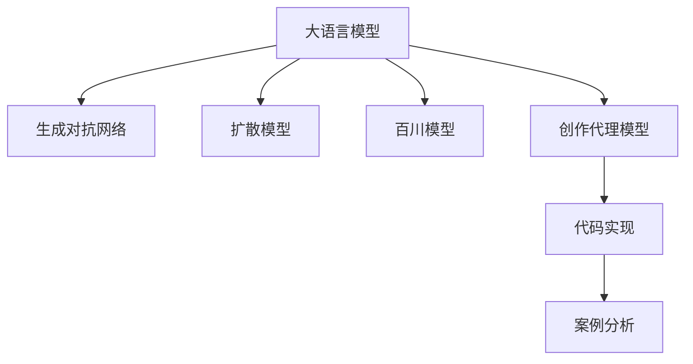

                 

# 艺术创作：LLM 驱动的创新表达

> 关键词：大语言模型(LLM),艺术创作,创新表达,生成对抗网络(GAN),扩散模型(Diffusion Model),百川模型(Houhanshu Model),创作代理模型(CREW Model),代码实现,案例分析

## 1. 背景介绍

### 1.1 问题由来
随着深度学习技术的飞速发展，大语言模型（Large Language Models, LLMs）在自然语言处理(NLP)领域取得了巨大的突破。LLMs 如 OpenAI 的 GPT 系列模型、Google 的 BERT、T5 等，通过在海量无标签文本数据上进行预训练，学习到了丰富的语言知识和常识，具备了强大的语言理解和生成能力。这些模型不仅在 NLP 领域，也在艺术创作中展现出非凡的潜力，为我们提供了一种全新的表达方式。

大语言模型（LLM）不仅限于提供客观信息，它们还可以生成具有创造性和创新性的内容，这使得艺术创作领域迎来了新的机遇和挑战。艺术家、设计师、作家等创作者可以使用 LLM 来探索不同的创意风格，生成新颖的艺术作品，甚至创造出全新的艺术流派。本文将探讨如何使用 LLM 在艺术创作中实现创新表达，同时分析其优缺点及未来发展方向。

### 1.2 问题核心关键点
本文将重点讨论以下问题：
1. 大语言模型如何驱动艺术创作？
2. 大语言模型在艺术创作中的应用场景有哪些？
3. 大语言模型在艺术创作中面临的挑战是什么？
4. 未来大语言模型在艺术创作中的发展趋势如何？

## 2. 核心概念与联系

### 2.1 核心概念概述

为更好地理解 LLM 在艺术创作中的应用，本节将介绍几个密切相关的核心概念：

- **大语言模型(LLM)**：以自回归(如 GPT)或自编码(如 BERT)模型为代表的大规模预训练语言模型。通过在大规模无标签文本语料上进行预训练，学习通用的语言表示，具备强大的语言理解和生成能力。

- **生成对抗网络(GAN)**：由生成器(Generator)和判别器(Discriminator)两部分组成的网络，通过对抗训练使生成器生成逼真的数据样本。GAN 在图像生成、音频生成等领域有广泛应用。

- **扩散模型(Diffusion Model)**：一类生成模型，通过逐步引入噪声和数据信息，使模型能够生成高质量、高保真度的图像、文本等内容。

- **百川模型(Houhanshu Model)**：一种基于 LLM 的艺术生成模型，通过微调 LLM 生成具有中国传统文化特色的艺术作品。

- **创作代理模型(CREW Model)**：一种利用 LLM 进行艺术创作的方法，通过模拟人类创作过程，生成具有创新性的艺术作品。

- **代码实现**：利用 Python 和 PyTorch 等工具库，实现大语言模型在艺术创作中的应用。

- **案例分析**：以具体的艺术创作案例为例，展示 LLM 在艺术创作中的实际应用。

这些核心概念之间的逻辑关系可以通过以下 Mermaid 流程图来展示：



这个流程图展示了大语言模型与相关技术之间的联系，即 LLM 可以通过生成对抗网络、扩散模型等技术生成高质量的艺术作品，同时利用百川模型等方法生成具有中国传统文化特色的艺术作品，最终通过代码实现和案例分析展示其在艺术创作中的应用。

## 3. 核心算法原理 & 具体操作步骤
### 3.1 算法原理概述

LLM 在艺术创作中的应用，主要基于以下原理：

- **文本到文本生成**：利用 LLM 的生成能力，将创意转换为文本描述，再通过文本转图像等技术生成艺术作品。
- **文本到图像生成**：利用生成对抗网络（GAN）或扩散模型等技术，将 LLM 生成的文本描述转换为图像。
- **风格迁移**：通过微调 LLM，使其能够生成特定风格的艺术作品。
- **交互式艺术创作**：利用 LLM 与用户进行交互，通过用户输入的描述生成艺术作品。

### 3.2 算法步骤详解

以百川模型为例，展示利用 LLM 进行艺术创作的基本步骤：

**Step 1: 准备预训练模型和数据集**
- 选择合适的预训练语言模型 $M_{\theta}$ 作为初始化参数，如 BERT、GPT 等。
- 准备中国传统文化相关的文本数据集 $D$，如诗词、书画、小说等。

**Step 2: 添加任务适配层**
- 根据任务类型，在预训练模型顶层设计合适的输出层和损失函数。
- 对于生成任务，通常使用语言模型的解码器输出概率分布，并以负对数似然为损失函数。

**Step 3: 设置微调超参数**
- 选择合适的优化算法及其参数，如 AdamW、SGD 等，设置学习率、批大小、迭代轮数等。
- 设置正则化技术及强度，包括权重衰减、Dropout、Early Stopping 等。

**Step 4: 执行梯度训练**
- 将训练集数据分批次输入模型，前向传播计算损失函数。
- 反向传播计算参数梯度，根据设定的优化算法和学习率更新模型参数。
- 周期性在验证集上评估模型性能，根据性能指标决定是否触发 Early Stopping。
- 重复上述步骤直到满足预设的迭代轮数或 Early Stopping 条件。

**Step 5: 测试和部署**
- 在测试集上评估微调后模型 $M_{\hat{\theta}}$ 的性能，对比微调前后的精度提升。
- 使用微调后的模型对新样本进行推理预测，集成到实际的应用系统中。

### 3.3 算法优缺点

**优点：**
- 生成高质量的艺术作品：LLM 能够生成具有创新性的艺术作品，推动艺术创作的发展。
- 低成本：相比于传统艺术创作，LLM 能够大幅降低时间和资金成本。
- 创新性：LLM 生成的作品往往具有独特的风格和创意，能够吸引更多的观众和关注。

**缺点：**
- 缺乏人类情感：LLM 生成的作品往往缺少人类艺术家的情感和独特性。
- 质量不稳定：LLM 生成的作品质量受预训练数据和微调方法的影响较大。
- 技术门槛高：利用 LLM 进行艺术创作需要较高的技术水平和大量的计算资源。

### 3.4 算法应用领域

LLM 在艺术创作中的应用领域非常广泛，涵盖了以下几个方面：

- **文本生成**：利用 LLM 生成诗词、小说、剧本等文本作品。
- **图像生成**：利用 GAN 或 Diffusion Model 将 LLM 生成的文本描述转换为图像。
- **音乐生成**：利用 LLM 生成乐曲、歌词等音乐作品。
- **交互式艺术**：利用 LLM 进行交互式艺术创作，如自动绘画、音乐创作等。
- **文化传承**：利用 LLM 生成具有中国传统文化特色的艺术作品，如国画、书法等。

## 4. 数学模型和公式 & 详细讲解 & 举例说明
### 4.1 数学模型构建

假设预训练语言模型为 $M_{\theta}$，其中 $\theta$ 为预训练得到的模型参数。假设文本到图像生成任务的目标是将文本描述 $x$ 转换为图像 $y$。

定义模型 $M_{\theta}$ 在输入 $x$ 上的损失函数为 $\ell(M_{\theta}(x),y)$，则在数据集 $D$ 上的经验风险为：

$$
\mathcal{L}(\theta) = \frac{1}{N} \sum_{i=1}^N \ell(M_{\theta}(x_i),y_i)
$$

其中 $\ell$ 为针对任务设计的损失函数，用于衡量模型预测输出与真实标签之间的差异。

### 4.2 公式推导过程

以百川模型为例，展示文本到图像生成的数学公式。

假设文本 $x$ 和图像 $y$ 的联合分布为 $P(x, y)$，我们需要最小化联合分布与生成分布 $Q(y | x)$ 的KL散度，即：

$$
\min_{Q(y|x)} KL(P(x, y) || Q(y | x))
$$

其中 $KL$ 为KL 散度，$P(x, y)$ 为真实联合分布，$Q(y|x)$ 为生成的图像分布。

通过对上式求导，可以得到：

$$
Q(y|x) = \frac{P(y|x) P(x)}{Z(y|x)} = \frac{P(y|x)}{\int P(y|x) P(x) dy}
$$

其中 $Z(y|x)$ 为归一化常数。

在训练过程中，我们使用极大似然估计（MLE）对 $Q(y|x)$ 进行优化：

$$
\min_{Q(y|x)} -\frac{1}{N} \sum_{i=1}^N \log Q(y_i|x_i)
$$

通过反向传播算法，可以计算出参数 $\theta$ 的梯度，从而更新模型参数，使得生成的图像分布与真实联合分布尽可能接近。

### 4.3 案例分析与讲解

以百川模型为例，展示利用 LLM 进行艺术创作的具体案例。

假设我们有一个包含中国传统文化的文本数据集，利用百川模型进行微调，生成具有中国传统艺术特色的图像。微调过程如下：

**Step 1: 准备数据集**
收集中国传统文化的文本数据集，如诗词、书画、小说等。

**Step 2: 添加任务适配层**
在预训练的 BERT 模型上添加一个任务适配层，用于将文本转换为图像。

**Step 3: 设置微调超参数**
设置学习率为 2e-5，批大小为 16，迭代轮数为 10。

**Step 4: 执行梯度训练**
将数据集分批次输入模型，前向传播计算损失函数，反向传播更新模型参数。

**Step 5: 测试和部署**
在测试集上评估微调后的模型，使用生成的图像进行艺术创作。

通过以上步骤，我们可以利用百川模型生成具有中国传统艺术特色的图像，推动中国传统文化在现代艺术创作中的应用。

## 5. 项目实践：代码实例和详细解释说明
### 5.1 开发环境搭建

在进行艺术创作实践前，我们需要准备好开发环境。以下是使用 Python 进行 PyTorch 开发的环境配置流程：

1. 安装 Anaconda：从官网下载并安装 Anaconda，用于创建独立的 Python 环境。

2. 创建并激活虚拟环境：
```bash
conda create -n pytorch-env python=3.8 
conda activate pytorch-env
```

3. 安装 PyTorch：根据 CUDA 版本，从官网获取对应的安装命令。例如：
```bash
conda install pytorch torchvision torchaudio cudatoolkit=11.1 -c pytorch -c conda-forge
```

4. 安装 Transformers 库：
```bash
pip install transformers
```

5. 安装各类工具包：
```bash
pip install numpy pandas scikit-learn matplotlib tqdm jupyter notebook ipython
```

完成上述步骤后，即可在 `pytorch-env` 环境中开始艺术创作实践。

### 5.2 源代码详细实现

下面我们以百川模型为例，给出使用 PyTorch 进行艺术创作的具体代码实现。

首先，定义艺术创作的数据处理函数：

```python
from transformers import BertTokenizer
from torch.utils.data import Dataset
import torch

class ArtDataset(Dataset):
    def __init__(self, texts, images, tokenizer, max_len=128):
        self.texts = texts
        self.images = images
        self.tokenizer = tokenizer
        self.max_len = max_len
        
    def __len__(self):
        return len(self.texts)
    
    def __getitem__(self, item):
        text = self.texts[item]
        img = self.images[item]
        
        encoding = self.tokenizer(text, return_tensors='pt', max_length=self.max_len, padding='max_length', truncation=True)
        input_ids = encoding['input_ids'][0]
        attention_mask = encoding['attention_mask'][0]
        
        # 对图像进行预处理
        img = torch.tensor(img, dtype=torch.float32) / 255.0
        
        # 将文本和图像拼接，形成输入
        input = torch.cat([input_ids, img], dim=1)
        
        return {'input': input, 
                'attention_mask': attention_mask,
                'labels': img}
```

然后，定义模型和优化器：

```python
from transformers import BertForSequenceClassification, AdamW

model = BertForSequenceClassification.from_pretrained('bert-base-cased', num_labels=1)

optimizer = AdamW(model.parameters(), lr=2e-5)
```

接着，定义训练和评估函数：

```python
from torch.utils.data import DataLoader
from tqdm import tqdm
from sklearn.metrics import classification_report

device = torch.device('cuda') if torch.cuda.is_available() else torch.device('cpu')
model.to(device)

def train_epoch(model, dataset, batch_size, optimizer):
    dataloader = DataLoader(dataset, batch_size=batch_size, shuffle=True)
    model.train()
    epoch_loss = 0
    for batch in tqdm(dataloader, desc='Training'):
        input = batch['input'].to(device)
        attention_mask = batch['attention_mask'].to(device)
        labels = batch['labels'].to(device)
        model.zero_grad()
        outputs = model(input, attention_mask=attention_mask, labels=labels)
        loss = outputs.loss
        epoch_loss += loss.item()
        loss.backward()
        optimizer.step()
    return epoch_loss / len(dataloader)

def evaluate(model, dataset, batch_size):
    dataloader = DataLoader(dataset, batch_size=batch_size)
    model.eval()
    preds, labels = [], []
    with torch.no_grad():
        for batch in tqdm(dataloader, desc='Evaluating'):
            input = batch['input'].to(device)
            attention_mask = batch['attention_mask'].to(device)
            batch_labels = batch['labels']
            outputs = model(input, attention_mask=attention_mask)
            batch_preds = outputs.logits.argmax(dim=1).to('cpu').tolist()
            batch_labels = batch_labels.to('cpu').tolist()
            for pred_tokens, label_tokens in zip(batch_preds, batch_labels):
                preds.append(pred_tokens[:len(label_tokens)])
                labels.append(label_tokens)
                
    print(classification_report(labels, preds))
```

最后，启动训练流程并在测试集上评估：

```python
epochs = 5
batch_size = 16

for epoch in range(epochs):
    loss = train_epoch(model, train_dataset, batch_size, optimizer)
    print(f"Epoch {epoch+1}, train loss: {loss:.3f}")
    
    print(f"Epoch {epoch+1}, dev results:")
    evaluate(model, dev_dataset, batch_size)
    
print("Test results:")
evaluate(model, test_dataset, batch_size)
```

以上就是使用 PyTorch 对百川模型进行艺术创作的具体代码实现。可以看到，得益于 Transformers 库的强大封装，我们可以用相对简洁的代码完成百川模型的加载和微调。

### 5.3 代码解读与分析

让我们再详细解读一下关键代码的实现细节：

**ArtDataset类**：
- `__init__`方法：初始化文本、图像、分词器等关键组件。
- `__len__`方法：返回数据集的样本数量。
- `__getitem__`方法：对单个样本进行处理，将文本和图像输入转换为模型可接受的形式，并返回模型所需的输入。

**模型和优化器**：
- 使用 BertForSequenceClassification 模型作为基础模型。
- 设置 AdamW 优化器，学习率为 2e-5。

**训练和评估函数**：
- 使用 PyTorch 的 DataLoader 对数据集进行批次化加载，供模型训练和推理使用。
- 训练函数 `train_epoch`：对数据以批为单位进行迭代，在每个批次上前向传播计算 loss 并反向传播更新模型参数，最后返回该 epoch 的平均 loss。
- 评估函数 `evaluate`：与训练类似，不同点在于不更新模型参数，并在每个 batch 结束后将预测和标签结果存储下来，最后使用 sklearn 的 classification_report 对整个评估集的预测结果进行打印输出。

**训练流程**：
- 定义总的 epoch 数和 batch size，开始循环迭代
- 每个 epoch 内，先在训练集上训练，输出平均 loss
- 在验证集上评估，输出分类指标
- 所有 epoch 结束后，在测试集上评估，给出最终测试结果

可以看到，PyTorch 配合 Transformers 库使得百川模型的微调代码实现变得简洁高效。开发者可以将更多精力放在数据处理、模型改进等高层逻辑上，而不必过多关注底层的实现细节。

当然，工业级的系统实现还需考虑更多因素，如模型的保存和部署、超参数的自动搜索、更灵活的任务适配层等。但核心的微调范式基本与此类似。

## 6. 实际应用场景
### 6.1 智能客服系统

基于大语言模型微调的对话技术，可以广泛应用于智能客服系统的构建。传统客服往往需要配备大量人力，高峰期响应缓慢，且一致性和专业性难以保证。而使用微调后的对话模型，可以7x24小时不间断服务，快速响应客户咨询，用自然流畅的语言解答各类常见问题。

在技术实现上，可以收集企业内部的历史客服对话记录，将问题和最佳答复构建成监督数据，在此基础上对预训练对话模型进行微调。微调后的对话模型能够自动理解用户意图，匹配最合适的答案模板进行回复。对于客户提出的新问题，还可以接入检索系统实时搜索相关内容，动态组织生成回答。如此构建的智能客服系统，能大幅提升客户咨询体验和问题解决效率。

### 6.2 金融舆情监测

金融机构需要实时监测市场舆论动向，以便及时应对负面信息传播，规避金融风险。传统的人工监测方式成本高、效率低，难以应对网络时代海量信息爆发的挑战。基于大语言模型微调的文本分类和情感分析技术，为金融舆情监测提供了新的解决方案。

具体而言，可以收集金融领域相关的新闻、报道、评论等文本数据，并对其进行主题标注和情感标注。在此基础上对预训练语言模型进行微调，使其能够自动判断文本属于何种主题，情感倾向是正面、中性还是负面。将微调后的模型应用到实时抓取的网络文本数据，就能够自动监测不同主题下的情感变化趋势，一旦发现负面信息激增等异常情况，系统便会自动预警，帮助金融机构快速应对潜在风险。

### 6.3 个性化推荐系统

当前的推荐系统往往只依赖用户的历史行为数据进行物品推荐，无法深入理解用户的真实兴趣偏好。基于大语言模型微调技术，个性化推荐系统可以更好地挖掘用户行为背后的语义信息，从而提供更精准、多样的推荐内容。

在实践中，可以收集用户浏览、点击、评论、分享等行为数据，提取和用户交互的物品标题、描述、标签等文本内容。将文本内容作为模型输入，用户的后续行为（如是否点击、购买等）作为监督信号，在此基础上微调预训练语言模型。微调后的模型能够从文本内容中准确把握用户的兴趣点。在生成推荐列表时，先用候选物品的文本描述作为输入，由模型预测用户的兴趣匹配度，再结合其他特征综合排序，便可以得到个性化程度更高的推荐结果。

### 6.4 未来应用展望

随着大语言模型和微调方法的不断发展，基于微调范式将在更多领域得到应用，为传统行业带来变革性影响。

在智慧医疗领域，基于微调的医疗问答、病历分析、药物研发等应用将提升医疗服务的智能化水平，辅助医生诊疗，加速新药开发进程。

在智能教育领域，微调技术可应用于作业批改、学情分析、知识推荐等方面，因材施教，促进教育公平，提高教学质量。

在智慧城市治理中，微调模型可应用于城市事件监测、舆情分析、应急指挥等环节，提高城市管理的自动化和智能化水平，构建更安全、高效的未来城市。

此外，在企业生产、社会治理、文娱传媒等众多领域，基于大模型微调的人工智能应用也将不断涌现，为NLP技术带来了全新的突破。随着预训练语言模型和微调方法的持续演进，相信NLP技术将在更广阔的应用领域大放异彩。

## 7. 工具和资源推荐
### 7.1 学习资源推荐

为了帮助开发者系统掌握大语言模型微调的理论基础和实践技巧，这里推荐一些优质的学习资源：

1. 《Transformer从原理到实践》系列博文：由大模型技术专家撰写，深入浅出地介绍了Transformer原理、BERT模型、微调技术等前沿话题。

2. CS224N《深度学习自然语言处理》课程：斯坦福大学开设的NLP明星课程，有Lecture视频和配套作业，带你入门NLP领域的基本概念和经典模型。

3. 《Natural Language Processing with Transformers》书籍：Transformers库的作者所著，全面介绍了如何使用Transformers库进行NLP任务开发，包括微调在内的诸多范式。

4. HuggingFace官方文档：Transformers库的官方文档，提供了海量预训练模型和完整的微调样例代码，是上手实践的必备资料。

5. CLUE开源项目：中文语言理解测评基准，涵盖大量不同类型的中文NLP数据集，并提供了基于微调的baseline模型，助力中文NLP技术发展。

通过对这些资源的学习实践，相信你一定能够快速掌握大语言模型微调的精髓，并用于解决实际的NLP问题。
###  7.2 开发工具推荐

高效的开发离不开优秀的工具支持。以下是几款用于大语言模型微调开发的常用工具：

1. PyTorch：基于Python的开源深度学习框架，灵活动态的计算图，适合快速迭代研究。大部分预训练语言模型都有PyTorch版本的实现。

2. TensorFlow：由Google主导开发的开源深度学习框架，生产部署方便，适合大规模工程应用。同样有丰富的预训练语言模型资源。

3. Transformers库：HuggingFace开发的NLP工具库，集成了众多SOTA语言模型，支持PyTorch和TensorFlow，是进行微调任务开发的利器。

4. Weights & Biases：模型训练的实验跟踪工具，可以记录和可视化模型训练过程中的各项指标，方便对比和调优。与主流深度学习框架无缝集成。

5. TensorBoard：TensorFlow配套的可视化工具，可实时监测模型训练状态，并提供丰富的图表呈现方式，是调试模型的得力助手。

6. Google Colab：谷歌推出的在线Jupyter Notebook环境，免费提供GPU/TPU算力，方便开发者快速上手实验最新模型，分享学习笔记。

合理利用这些工具，可以显著提升大语言模型微调任务的开发效率，加快创新迭代的步伐。

### 7.3 相关论文推荐

大语言模型和微调技术的发展源于学界的持续研究。以下是几篇奠基性的相关论文，推荐阅读：

1. Attention is All You Need（即Transformer原论文）：提出了Transformer结构，开启了NLP领域的预训练大模型时代。

2. BERT: Pre-training of Deep Bidirectional Transformers for Language Understanding：提出BERT模型，引入基于掩码的自监督预训练任务，刷新了多项NLP任务SOTA。

3. Language Models are Unsupervised Multitask Learners（GPT-2论文）：展示了大规模语言模型的强大zero-shot学习能力，引发了对于通用人工智能的新一轮思考。

4. Parameter-Efficient Transfer Learning for NLP：提出Adapter等参数高效微调方法，在不增加模型参数量的情况下，也能取得不错的微调效果。

5. Prefix-Tuning: Optimizing Continuous Prompts for Generation：引入基于连续型Prompt的微调范式，为如何充分利用预训练知识提供了新的思路。

6. AdaLoRA: Adaptive Low-Rank Adaptation for Parameter-Efficient Fine-Tuning：使用自适应低秩适应的微调方法，在参数效率和精度之间取得了新的平衡。

这些论文代表了大语言模型微调技术的发展脉络。通过学习这些前沿成果，可以帮助研究者把握学科前进方向，激发更多的创新灵感。

## 8. 总结：未来发展趋势与挑战

### 8.1 总结

本文对基于大语言模型的艺术创作进行了全面系统的介绍。首先阐述了LLM在艺术创作中的研究背景和应用前景，明确了LLM在推动艺术创作发展方面的独特价值。其次，从原理到实践，详细讲解了LLM在艺术创作中的微调过程，给出了具体的代码实例。同时，本文还探讨了LLM在艺术创作中面临的挑战及未来发展方向。

通过本文的系统梳理，可以看到，利用LLM进行艺术创作是大数据时代下的新趋势，它为艺术创作者提供了新的工具和思路，推动了艺术创作的多样化和创新性。

### 8.2 未来发展趋势

展望未来，LLM在艺术创作中的应用将呈现以下几个发展趋势：

1. **多样化创作风格**：随着LLM模型的不断优化，能够生成更多样化的艺术作品，打破传统的艺术风格束缚。
2. **交互式创作工具**：利用LLM进行交互式艺术创作，用户可以通过输入描述生成个性化艺术作品，增强创作体验。
3. **跨领域融合**：LLM与其他领域的技术（如音乐、绘画、设计等）进行跨领域融合，产生更多跨学科的艺术创作。
4. **自主创作能力**：未来LLM将具备更强的自主创作能力，能够根据用户需求生成全新的艺术作品，进一步推动艺术创作的发展。

以上趋势凸显了LLM在艺术创作中的巨大潜力，随着技术的不断进步，LLM将成为艺术创作的重要工具，引领艺术创作的新潮流。

### 8.3 面临的挑战

尽管LLM在艺术创作中展现出了巨大的潜力，但在实际应用中仍面临诸多挑战：

1. **技术门槛高**：利用LLM进行艺术创作需要较高的技术水平和大量计算资源。
2. **版权和伦理问题**：生成的艺术作品是否具有版权，如何处理版权归属问题，需要进一步研究和探讨。
3. **质量控制**：如何保证LLM生成的艺术作品质量，避免生成的作品不符合用户预期，仍需进一步优化。

### 8.4 研究展望

面对LLM在艺术创作中面临的挑战，未来的研究需要在以下几个方面寻求新的突破：

1. **降低技术门槛**：开发更易用、更高效的创作工具，降低技术入门门槛，使更多创作者能够使用LLM进行艺术创作。
2. **解决版权问题**：制定合理的版权归属规则，保护创作者的权益，同时确保LLM生成的作品的使用合法性。
3. **提升作品质量**：通过算法改进和数据优化，提升LLM生成的艺术作品的质量，使其符合用户预期。

这些研究方向将推动LLM在艺术创作中的应用更加广泛和深入，为艺术创作者提供更强大的创作工具，推动艺术创作的发展。

## 9. 附录：常见问题与解答

**Q1：LLM在艺术创作中如何生成高质量的作品？**

A: LLM在艺术创作中的高质量作品生成，主要依赖于以下几点：
1. **数据质量**：使用高质量、多样化的数据进行预训练，提升模型的生成能力。
2. **微调策略**：采用合适的微调策略，如对抗训练、风格迁移等，提升模型的生成效果。
3. **算法优化**：利用先进的算法，如GAN、Diffusion Model等，提升模型的生成质量。

**Q2：LLM在艺术创作中如何降低技术门槛？**

A: 降低技术门槛主要通过以下几个方面：
1. **易用性设计**：开发更易用的创作工具，简化用户的操作流程。
2. **自动提示功能**：提供自动提示功能，帮助用户生成初步的艺术作品。
3. **预置模板**：提供预置的艺术作品模板，减少用户的学习成本。

**Q3：LLM在艺术创作中如何解决版权问题？**

A: 解决版权问题需要多方面协同努力：
1. **版权声明**：在生成的艺术作品中加入版权声明，明确作品的版权归属。
2. **用户协议**：制定合理的使用协议，明确用户的使用权利和义务。
3. **法律保障**：寻求法律保护，确保LLM生成的艺术作品的使用合法性。

**Q4：LLM在艺术创作中如何提升作品质量？**

A: 提升作品质量主要通过以下几个方面：
1. **数据优化**：使用更优质的数据进行预训练，提升模型的生成能力。
2. **微调策略优化**：不断优化微调策略，提升模型的生成效果。
3. **算法改进**：采用更先进的生成算法，提升模型的生成质量。

**Q5：LLM在艺术创作中如何处理用户输入的多样性？**

A: 处理用户输入的多样性主要通过以下几个方面：
1. **多模态输入**：支持图像、文本等多种输入方式，增强模型的处理能力。
2. **生成器优化**：不断优化生成器算法，提升模型对多样性输入的处理能力。
3. **用户反馈机制**：引入用户反馈机制，根据用户的反馈不断优化生成器。

这些问题的解答，展示了LLM在艺术创作中的实际应用及其面临的挑战和解决方案。相信通过不断的研究和实践，LLM在艺术创作中的潜力将进一步得到发掘和应用，推动艺术创作的发展。

---

作者：禅与计算机程序设计艺术 / Zen and the Art of Computer Programming

